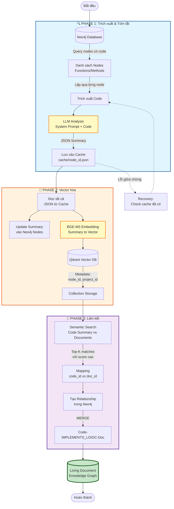

# Living Document Strategy

## Tổng quan

Living Document là cơ chế tự động liên kết giữa mã nguồn và tài liệu kỹ thuật thông qua knowledge graph, giúp thu hẹp khoảng cách giữa **"Logic Nghiệp Vụ"** (tài liệu) và **"Logic Kỹ Thuật"** (code).

### Quy trình gồm 3 giai đoạn:

1. **Trích xuất & Tóm tắt**: Phân tích code từ Neo4j và tạo summary bằng LLM
2. **Vector hóa**: Embedding summary và lưu vào Qdrant
3. **Liên kết**: Tạo relationship giữa code và document trong Neo4j

---

## Phase 1: Trích xuất và Tóm tắt Code

### 1.1. Truy vấn Node từ Neo4j

Lấy tất cả các node chứa code trong project:

```cypher
MATCH (n)
WHERE n.project_id CONTAINS "tên_project"
  AND n.code IS NOT NULL
  AND NOT n:File
  AND NOT n:Class
RETURN n
```

**Lưu ý**: Query này lấy các node đơn lẻ (Function, Method), không cần relationship để tăng hiệu suất.

### 1.2. Tạo Summary bằng LLM

**System Prompt:**

```
You are a Senior Technical Architect and Business Analyst.
Your task is to analyze source code functions and generate a structured JSON summary optimized for a Semantic Search Engine (RAG).

Your goal is to bridge the gap between "Technical Implementation" (Code) and "Business Logic" (Documentation).

### RULES:
1. **Output Format:** JSON only. No markdown, no conversational text.
2. **Language:** The values in JSON should be in English (or Vietnamese if requested), but keep it professional and concise.
3. **Analyze Deeply:** Look for specific standard references (e.g., ISO, CCC, RFC), error codes, and business rules within the code.

### JSON STRUCTURE:
{
  "Business_Intent": "A single, clear sentence explaining WHY this function exists from a business perspective (e.g., 'Handles payment validation', 'Implements CCC Digital Key protocol'). This is crucial for matching with documentation.",
  "Input": {
    "param_name": "Description of what this parameter represents and its data type."
  },
  "Logic": "A step-by-step description of the flow. Focus on business rules, validation checks, and handling of specific scenarios (e.g., 'If fast_mode is True, skip validation X').",
  "Output": "Description of the return value and what it signifies.",
  "Keywords": ["List", "of", "important", "technical", "terms", "found", "in", "code"]
}
```

**User Prompt:**

```
Analyze the following code snippet and generate the JSON summary.

### CODE:
{CODE_CỦA_NODE}
```

### 1.3. Lưu vào Cache

**Mục đích:** Tránh phải gọi lại LLM nếu bị gián đoạn giữa chừng.

**Quy tắc đặt tên file:**

- Format: `cache/{node_id}.json`
- Dùng `node_id` để tránh trùng lặp và dễ mapping

**Kết quả Phase 1:** Thư mục `cache/` chứa các file JSON summary cho từng node.

---

## Phase 2: Vector hóa và Lưu trữ

### 2.1. Đọc Cache và Update Summary cho Neo4j

1. Duyệt tất cả file JSON trong `cache/`
2. Với mỗi file, đọc nội dung summary
3. Update lại Node có id là file {node_id} tương ứng trong Neo4j bằng summary lưu trong file

### 2.2. Đọc Cache và Tạo Embeddings

1. Duyệt tất cả file JSON trong `cache/`
2. Với mỗi file, đọc nội dung summary
3. Sử dụng **BGE-M3** model để tạo embedding vector

### 2.3. Lưu vào Qdrant

**Metadata cần lưu:**

```json
{
  "node_id": "id_của_node_trong_neo4j",
  "project_id": "tên_project",
  "node_type": "Function|Method|...",
  "file_path": "đường_dẫn_file_gốc"
}
```

**Collection:** Chỉ định collection name khi lưu.

**Kết quả Phase 2:** Collection trong Qdrant chứa vector embeddings của tất cả code summaries.

---

## Phase 3: Liên kết Code và Document

### 3.1. Tìm kiếm Semantic

**Input:** Summary của code node (hoặc document query)

**Process:**

1. Query vector tương tự trong Qdrant collection
2. Lấy top-k results với score cao nhất
3. Trích xuất `node_id` và `doc_id` từ metadata

### 3.2. Tạo Relationship trong Neo4j

```cypher
MATCH (c:Function {id: $code_id}), (d:Document {id: $doc_id})
MERGE (c)-[:IMPLEMENTS_LOGIC]->(d)
```

**Giải thích:**

- `c`: Node chứa code (Function, Method)
- `d`: Node chứa document mô tả logic
- `IMPLEMENTS_LOGIC`: Relationship chỉ ra code implement logic từ document

**Kết quả Phase 3:** Knowledge graph hoàn chỉnh với liên kết code ↔ document.

---

## Xử lý Lỗi và Recovery

1. **Phase 1:** Nếu bị gián đoạn, check file trong `cache/` và bỏ qua các node đã xử lý
2. **Phase 2:** Kiểm tra vector đã tồn tại trong Qdrant bằng `node_id` trước khi insert
3. **Phase 3:** Sử dụng `MERGE` thay vì `CREATE` để tránh duplicate relationships

---

## Lưu ý Kỹ thuật

- **BGE-M3:** Model hỗ trợ multilingual, phù hợp cho project có cả English và Vietnamese
- **Qdrant Collection:** Nên tạo index cho metadata fields (`node_id`, `project_id`) để query nhanh
- **Neo4j Performance:** Tạo index trên `id` property của các node types chính

---

## Sơ Đồ Quy Trình



### Giải thích Sơ đồ:

#### 📊 Luồng chính:

1. **Neo4j** → Lấy danh sách nodes có code
2. **Phase 1** (Xanh dương):
   - Trích xuất code từ mỗi node
   - Phân tích bằng LLM → JSON summary
   - Lưu vào cache để recovery
3. **Phase 2** (Cam):
   - Đọc cache và update summary vào Neo4j
   - Tạo embeddings bằng BGE-M3
   - Lưu vectors vào Qdrant kèm metadata
4. **Phase 3** (Tím):
   - Tìm kiếm semantic giữa code và documents
   - Mapping các cặp tương ứng
   - Tạo relationship `IMPLEMENTS_LOGIC` trong Neo4j

#### 🔄 Recovery:

- Nếu bị lỗi ở Phase 1, kiểm tra cache và bỏ qua nodes đã xử lý
- Đường nét đứt `-.->` chỉ luồng recovery

#### 🎯 Kết quả:

- **Living Document Knowledge Graph**: Hệ thống hoàn chỉnh với liên kết code ↔ document
