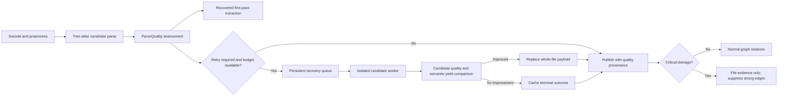

# C/C++ parser quality diagnostics and bounded recovery

## 2026-08-24 dual-plane amendment

The cross-backend whole-file winner described in this plan and Phase 04 is
superseded by
[`260824-1411-cplus-clang-containment-hardening`](../260824-1411-cplus-clang-containment-hardening/plan.md).
Only same-backend Tree-sitter recovery may replace the structural payload.
Clang protocol 2 is additive semantic evidence for faithful contexts; legacy
and bounded LIBCLANG structural payload selection/cache reuse must be removed.
Completion of Phases 05-06 is blocked on that containment cutover and canary.

## Overview

Turn the existing non-fatal Tree-sitter warning into an actionable, bounded,
and trustworthy recovery workflow. The observed run flagged 6,673 of 20,186
files while reporting only 2,650 explicit `ERROR` nodes. This means the file
count and node count use different semantics and at least 4,023 flagged files
contain no explicit `ERROR` node. Many are expected to be `MISSING`-only legacy,
grammar-context, encoding, generated-code, or dialect cases rather than total
parse failures.

The implementation preserves Tree-sitter's recovered first pass, emits a
run-scoped quality artifact by default, classifies files using structural damage
and semantic yield, and queues only high-value retry candidates. Expensive
libclang work runs in isolated, resource-limited workers and never becomes an
unbounded synchronous retry of the full flagged corpus. Graph entities retain
parser provenance and quality state so partial evidence cannot silently appear
authoritative.

## Desired outcome

- `dev sync code` always reports where its machine-readable parser-quality
  artifact was written.
- Operators see separate counts for files with explicit `ERROR`, files with
  `MISSING`, lossy decoding, grammar retries, fallback attempts, improvements,
  and quarantines.
- Normal ingestion remains non-blocking for recoverable syntax damage.
- Only prioritized files enter a resumable repair queue with explicit file,
  wall-time, memory, concurrency, and retry budgets.
- Every C/C++ file payload records parser backend, language mode, compile
  context, recovery policy, quality tier, and candidate-selection reason.
- Cache entries are invalidated when parser context or recovery policy changes.
- Critically damaged files cannot emit unqualified strong call, inheritance, or
  containment edges into a published graph generation.

## Non-goals

- Achieving zero Tree-sitter `ERROR` or `MISSING` nodes across all legacy code.
- Rewriting upstream Tree-sitter grammars.
- Retrying all 6,673 flagged files through libclang.
- Executing repository-supplied compile commands.
- Automatically modifying source encodings or source contents.
- Building a per-node AST merge engine in the first release.
- Generalizing recovery to every language analyzer before the C/C++ canary is
  measured and accepted.

## Verified baseline

| Signal | Current evidence | Planning implication |
| --- | --- | --- |
| Flagged files | 6,673 / 20,186 (33.06%) | Treat as a quality cohort, not hard failures |
| Explicit `ERROR` nodes | 2,650 | At least 4,023 flagged files have no explicit `ERROR` node |
| Compile-command entries | Approximately 3,281 | Measure translation-unit coverage; derive header context from includers |
| Header grammar retry | Existing C/C++ retry selected five alternates | Preserve and include in the common recovery ladder |
| Legacy decoding | CP932 samples contain `MISSING` without `ERROR` | Encoding and structural damage must be reported separately |
| Existing detailed report | `cplus_analyzer.py --parse-errors-path` | Wire it through the normal incremental-sync path instead of rebuilding it |
| Existing fallback | libclang threshold 50/100/200 explicit errors | Current threshold can reach at most 53 files and misses `MISSING`-only cases |
| Existing verification | `tests/test_cplus_graph_runtime.py`: 4 passed | Extend from metadata presence to classification/recovery correctness |

## Architecture



### Parse-quality contract

Add a provider-neutral, JSON-serializable contract under
`code-tiny/tools/common/parse_quality.py`. The C/C++ analyzer is the first
producer; other analyzers may adopt it later without being changed by this plan.

Required fields:

- schema and recovery-policy versions;
- repository-relative path and source fingerprint;
- parser backend/language and grammar version;
- source encoding and lossy-decode diagnostics;
- explicit `ERROR` and `MISSING` counts;
- error/missing source-span coverage and structural-context flags;
- extracted function/type/call/include counts;
- compile-context availability and fingerprint;
- retry stages attempted, elapsed time, and outcome;
- selected candidate and selection reason;
- quality tier: `clean`, `recovered`, `retry_required`, or `quarantined`.

Raw source snippets and absolute host paths are excluded by default. Reports use
normalized repository-relative paths and bounded normalized error signatures.

### Candidate scoring

Do not compare Tree-sitter error nodes directly with clang diagnostics. Candidate
selection uses one deterministic whole-file tuple, finalized by Phase 01:

1. critical structural damage in declarations/signatures/scopes;
2. damaged source-span ratio;
3. top-level functions/types/declarations recovered;
4. stable scope and symbol identity;
5. useful calls/includes recovered;
6. parser diagnostics as the final tie-breaker.

Per-node merging remains out of scope. A retry replaces the whole payload only
when the common score is strictly better; otherwise the recovered Tree-sitter
payload remains selected and the non-improvement is cached.

### Recovery ladder

Each file gets at most one attempt per enabled stage:

1. validate legacy decoding and preserve byte/source mapping;
2. C/C++ alternate grammar for ambiguous headers;
3. dialect-specific masking/preprocessing (`.pc`/`.pcc` consumes the active Pro*C
   plan's output; generated/resource cohorts use their owning parsers);
4. context-aware libclang using sanitized compile arguments and bounded header
   context inherited from representative includer translation units;
5. retain recovered baseline or quarantine strong relations.

### Budget and safety defaults

The first guarded implementation uses configurable safe defaults:

- at most 500 recovery files or 15 minutes per run, whichever comes first;
- worker concurrency `min(4, max(1, floor(cpu_count / 2)))`, further reduced by
  memory headroom;
- one alternate Tree-sitter attempt and one libclang attempt per file;
- per-file timeout, memory cap, process-tree termination, and worker recycling;
- no network and no graph/vector handles in parser workers;
- compile database loaded/indexed once with size, entry, token, and path limits;
- strict compile-flag allowlist; command strings are parsed but never executed;
- `report` and `repair` explicitly disable executable compile-database bootstrap
  (CMake, Make, Bear, `compiledb`, and repository build hooks); they consume only
  a validated existing database or a harness-generated synthetic database;
- stop a cohort after 20 consecutive non-improvements or under 10% improvement
  in the trailing 100 attempts.

These are rollout controls, not permanent performance claims. Phase 06 tunes them
from the stratified pilot without weakening isolation or boundedness.

## CLI and artifact behavior

`dev sync code` and `dev sync code all` gain one consistent policy surface:

- `--parse-quality report` (default): first-pass parsing plus artifact only;
- `--parse-quality repair`: artifact plus bounded queued recovery;
- `--parse-quality off`: compatibility escape hatch that still preserves current
  non-fatal parser logging;
- optional validated budget overrides for file count, wall time, and workers.

`cortex_harness/dev.py` forwards policy to
`code-tiny/tools/sync/incremental_sync.py`. Incremental sync creates a run-scoped
artifact directory next to its existing summary, supplies a parser-specific
quality-report path to C/C++, and returns aggregate counts plus artifact paths in
the child summary. Direct analyzer CLI use retains `--parse-errors-path` as a
compatible alias during migration.

## Phases

1. [Phase 01 — quality contract, gold corpus, and baseline](phase-01-contract-and-baseline.md)
2. [Phase 02 — run-scoped diagnostics and CLI integration](phase-02-diagnostics-and-cli.md)
3. [Phase 03 — classification, provenance, and cache identity](phase-03-quality-provenance-and-cache.md)
4. [Phase 04 — isolated bounded recovery and candidate selection](phase-04-bounded-recovery.md)
5. [Phase 05 — incremental queue and guarded graph publication](phase-05-publication-and-incremental.md)
6. [Phase 06 — security, performance, canary, and rollout](phase-06-validation-and-rollout.md)

## Cross-plan dependencies and ownership

### `260821-1144-cplus-semantic-call-graph`

The semantic-call-graph plan consumes this plan's parse-quality tiers,
provenance, cache identity, bounded recovery, and guarded-publication policy.
This plan remains the owner of parser assessment/recovery and blocks semantic
Phase 06; the semantic plan owns callsite taxonomy, Clang resolution, and the
strict/conservative call-graph views.

### `260807-2103-toolchain-reliability-hardening`

The reliability plan consumes this plan's quality tiers, provenance, cache
identity, and guarded-publication policy. This plan remains the owner of parser
assessment/recovery. Its stable adapter contract blocks reliability Phases 02
and 07; the reliability plan owns record-level envelope validation, typed
outcomes, cross-tool certification, and operator UX.

### `260804-1640-port-proc-cplus-to-code-tiny`

The Pro*C plan owns `.pc`/`.pcc` lexical masking, embedded SQL models, and their
byte/source mapping. This plan consumes those diagnostics in the common quality
contract and must not add a competing Pro*C parser. Phase 05's full mixed-corpus
acceptance waits for the Pro*C output to stabilize.

### `260807-1202-graph-ingest-write-path-hardening`

The graph plan owns schema preflight, label-qualified writes, writer-local
checkpoints, and truthful graph-write health. This plan owns parser-quality
semantics and keeps them separate from database health. Phase 05 consumes its
safe publication/incomplete-run contract before suppressing or replacing strong
relations.

### `260807-0929-mcp-ingest-query-concurrency`

The concurrency plan owns physical-store admission, staged generations, bounded
CPU preparation, and atomic publication. This plan owns parser worker payloads,
budgets, and recovery outcomes. Phase 05 integrates its recovery queue with the
staged job lifecycle rather than creating a second global scheduler.

Phases 01-04 may proceed against current local analyzer interfaces. Phase 05 is
blocked until the three owning contracts above are available; Phase 06 runs only
after that integration is complete.

## Expected file changes

### New contracts and recovery modules

- `code-tiny/tools/common/parse_quality.py`
- `code-tiny/tools/cplus/parse_recovery.py`
- `code-tiny/tools/cplus/clang_worker.py`

### Existing integration points

- `code-tiny/tools/cplus/cplus_analyzer.py`
- `code-tiny/tools/cplus/clang_parser.py`
- `code-tiny/tools/common/analyzer_cache.py`
- `code-tiny/tools/common/legacy_encoding.py`
- `code-tiny/tools/sync/incremental_sync.py`
- `cortex_harness/dev.py`
- graph writer/file payload integration selected by Phase 05 after the hardened
  writer contract is finalized

### Tests and fixtures

- `tests/test_parse_quality_contract.py`
- `tests/test_cplus_parse_recovery.py`
- `tests/test_cplus_clang_worker.py`
- `tests/test_incremental_sync_parse_quality.py`
- `tests/test_dev_sync_reliability.py`
- `tests/test_cplus_graph_runtime.py`
- a small reviewed corpus under the existing test-fixture convention covering
  clean C/C++, ambiguous headers, macro-heavy/generated source, CP932, Pro*C,
  resource files, and present/absent compile context

## Verification strategy

- Unit tests validate quality serialization, classification, candidate scoring,
  compile-argument filtering, path containment, budgets, cache fingerprints, and
  terminal non-improvement caching.
- Integration tests run recovery workers against temporary roots with timeouts,
  malformed compile databases, symlinks, oversized files, crashes, and memory
  pressure; no test uses a registered user graph or cache.
- Incremental tests prove unchanged historical failures are not retried, changed
  files and include-impacted dependents are queued once, and policy/context
  changes invalidate only affected cache entries.
- Graph tests prove quality metadata is traceable, recovered evidence remains
  searchable, quarantined files do not emit strong relations, and a failed repair
  cannot publish a partial generation.
- Benchmark tests capture p50/p95 latency, peak RSS, timeouts, retry improvement
  rate, semantic yield, and graph cardinality/correctness on the 100-file pilot.

## Acceptance gates

| Concern | Gate |
| --- | --- |
| Normal first pass | Default `report` mode adds no more than 10% wall time on the representative corpus |
| Artifact correctness | File/node semantics reconcile exactly; every flagged file has one classified record |
| Path/privacy | No absolute root, raw compile command, or source snippet appears by default |
| Repository execution | `report` and `repair` never invoke repository build/configure commands while discovering compile context |
| Worker safety | Timeout/crash/OOM affects one file, terminates its process tree, and does not fail the first-pass run |
| Bounded recovery | File, wall-time, concurrency, and retry caps are enforced and observable |
| Candidate quality | A fallback is selected only when structural quality or semantic yield strictly improves |
| Incremental behavior | Unchanged success and terminal non-improvement are not reprocessed |
| Graph trust | Every C/C++ file/entity is traceable to quality/backend; quarantined files emit no strong relations |
| Pilot usefulness | At least 30% of attempted pilot retries materially improve the accepted quality/yield tuple before repair mode is promoted |

## Risks and mitigations

| Risk | Mitigation |
| --- | --- |
| Threshold tuning overfits one repository | Stratified reviewed corpus, configuration versioning, and cohort-level metrics |
| Libclang native crash or memory retention | Disposable subprocess, timeout/RSS cap, worker recycling, run circuit breaker |
| Repository compile flags access external files or load plugins | Allowlist flags and roots; reject response/plugin/output/module/PCH flags; never execute commands |
| Quality metadata increases graph/vector size | Store compact enums/fingerprints on entities and full diagnostics only in artifacts |
| Quarantine removes useful historical relations | Use staged publication, explicit before/after counts, and rollback to last accepted generation |
| Cache preserves stale candidate results | Context-aware fingerprint and schema/policy version in every cache key |
| Active plans collide in shared files | Phase ownership above; additive edits in Phases 01-04; Phase 05 waits for owner contracts |

## Success criteria

- The 6,673/20,186 style warning is replaced by internally consistent,
  actionable metrics and a report path.
- All source files continue through the normal first pass unless an independent
  infrastructure failure occurs.
- Recovery work is persistent, resumable, isolated, and bounded.
- Candidate choice measures structural and semantic improvement rather than
  comparing unrelated diagnostic counts.
- Parser provenance and quality tiers reach file/entity consumers and guard
  strong graph relations.
- Cache identity reflects parser, grammar, compile context, encoding, and policy.
- Security and performance gates pass on the reviewed pilot before recovery is
  enabled beyond opt-in use.

## Delivery command

After approval, implement with:

```text
/hi-craft plans/260807-1329-parser-quality-recovery/plan.md
```
