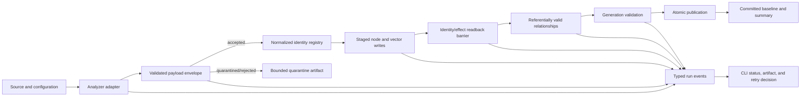

# End-to-end toolchain reliability hardening

## Overview

Make the Cortex Harness tools predictable under malformed legacy source,
partial parser recovery, storage under-writes, timeouts, process crashes,
duplicate identities, and operator mistakes. The goal is not to promise that no
defect can ever occur. The goal is to eliminate nuisance failures by turning
expected bad inputs into bounded quarantine outcomes and turning genuine
infrastructure or integrity faults into typed, diagnosable, resumable failures
that never publish partial data.

The motivating incident is a C/Pro*C full scan where the first 500-file buffer
requested 1,000 `File -> Function` relationships and FalkorDB matched 985. The
integrity guard correctly stopped publication, but the current system exposed a
raw Python traceback, retried a deterministic failure, marked state dirty only
after partial graph mutation, and did not produce the exact unresolved endpoint
records in one operator-facing artifact. Investigation also found malformed
function identities containing preprocessor/comment fragments and control
characters, while file-level parse quality could still report `clean` or
`recovered`.

This is an umbrella reliability program. It does not replace the active graph,
parser-quality, Pro*C, or storage-concurrency plans. It defines the contracts
between them and supplies the missing certification, error taxonomy, quarantine
boundary, end-to-end tests, and release gates.

## Reliability definition

A tool is considered stable only when all of the following are true:

1. Expected source defects are data outcomes, not unhandled exceptions.
2. Invalid records are quarantined with bounded evidence and cannot generate
   dependent nodes, relations, vectors, or published state.
3. A storage API reports success only when the intended identities/effects are
   verified, not merely when a driver returns a count.
4. A failed or cancelled run leaves the last committed generation and baseline
   unchanged.
5. Retry policy is driven by a typed failure class and idempotency contract;
   deterministic validation failures are never retried blindly.
6. Every failure has one stable code, run ID, phase, owner, artifact path,
   retryability decision, and safe next action.
7. Normal CLI output is concise and structured; raw tracebacks are available
   only in debug artifacts or explicit debug mode.
8. The same input and configuration are deterministic: accepted/quarantined
   counts, graph/vector cardinalities, and final generation fingerprints match.
9. Every supported analyzer/provider combination passes the same conformance
   and fault-injection suite before promotion.

## Verified gaps

The repository evidence is captured in
[`research/evidence-bundle.md`](research/evidence-bundle.md). The most important
gaps are:

- `cortex_harness/dev.py::_run_with_retry` retries every nonzero exit except
  code `2`, so deterministic integrity failures may run three times.
- `incremental_sync.py::_run` merges child stderr into stdout, replays the raw
  traceback, then reduces the failure to `CalledProcessError` plus an output
  tail.
- `_run_incremental` catches broad `Exception`, stores only `str(exc)`, marks
  state dirty, and returns exit code `1`; failure type, phase, retryability, and
  unresolved records are lost at the process boundary.
- `ParseQualityRecord` is file-oriented. C/C++ emits
  `evidence_policy.strong_relations_allowed`, but current consumers do not
  enforce that policy before graph payload construction/publication.
- `LanguageCodeWriter.write_relations_typed` detects a cardinality mismatch
  only after mutation. The count cannot distinguish unresolved endpoints,
  duplicates, provider under-write, or ambiguous commit.
- The active graph and parser plans contain many of the necessary lower-level
  mechanisms, but no plan owns their end-to-end outcome contract or certifies
  every tool against it.

## Target architecture



### Validated analyzer payload envelope

Every analyzer must emit or adapt to a versioned envelope before storage:

- run, project, source, analyzer, parser, and policy fingerprints;
- accepted node records grouped by declared label and identity contract;
- accepted relation records with required/optional endpoint semantics;
- vector records with deterministic IDs and source ownership;
- quarantine records with stable reason codes and bounded evidence;
- per-record provenance and source span where available;
- exact accounting: discovered = accepted + quarantined + rejected;
- contract/version capabilities so old cache entries cannot bypass new rules.

Validation is layered:

1. schema and type validation;
2. lexical validation of names/IDs/paths and forbidden control characters;
3. structural validation of spans, required fields, and source ownership;
4. identity conflict and duplicate normalization;
5. relation/call referential validation against the accepted identity registry;
6. quality/evidence-policy enforcement;
7. bounded artifact serialization and privacy validation.

An analyzer-specific validator may add stricter rules, but it cannot weaken the
shared envelope invariants. C/C++/Pro*C is the first canary because it exposes
parser recovery, legacy encoding, duplicate declarations, and malformed symbol
risks in one workload.

### Typed outcome and failure contract

Introduce provider-neutral JSON-serializable models shared across subprocesses:

- `RunOutcome`: `success`, `success_with_quarantine`, `no_changes`,
  `failed_retryable`, `failed_terminal`, `cancelled`, `ambiguous`;
- `FailureClass`: input validation, parser isolation, source changed, lock,
  capacity, storage unavailable, timeout, ambiguous mutation, integrity,
  journal/recovery, configuration, internal defect;
- `FailureRecord`: stable code, class, phase, component, retryable, run ID,
  correlation ID, summary, safe action, artifact references, bounded details;
- `PhaseResult`: expected, accepted, quarantined, attempted, persisted,
  unresolved, elapsed, and fingerprint fields;
- stable exit-code mapping owned by the orchestrator, not individual analyzers.

Known failures write the result artifact first and exit without a traceback.
Unexpected defects retain the traceback in the debug artifact and return the
typed `internal_defect` result. `--debug` may mirror the traceback to the
terminal, but normal `dev sync code` output shows one failure summary.

### Verified effect and publication contract

- Normalize/deduplicate identities before storage using declared merge policy.
- Preflight required relation endpoints from the accepted identity registry.
- Write to a staging generation or journal-owned incomplete run.
- Reconcile storage effects using deterministic identity/effect readback.
- Treat count-only acknowledgements and timed-out mutations as ambiguous.
- Write relations only after required node-label barriers are verified.
- Validate graph/vector cross-store generation consistency and cardinalities.
- Publish atomically only after every required phase passes.
- Advance incremental baseline only after publication succeeds.
- Quarantine optional bad records without weakening required integrity gates.

### Run state machine

Use one explicit state machine across CLI, incremental sync, analyzer workers,
and storage jobs:

```text
CREATED -> DISCOVERING -> PARSING -> VALIDATING -> PREPARING
        -> WRITING_NODES -> VERIFYING_NODES -> WRITING_RELATIONS
        -> VERIFYING_GENERATION -> PUBLISHING
        -> SUCCESS | SUCCESS_WITH_QUARANTINE

Any active phase -> FAILED_RETRYABLE | FAILED_TERMINAL | AMBIGUOUS | CANCELLED
FAILED_RETRYABLE/AMBIGUOUS -> RECONCILING -> resume compatible unfinished work
```

Only state-machine transitions update operator status. Parser logs, writer
progress, and child output become structured events attached to the same run ID.

## Ownership and cross-plan coordination

| Area | Owning plan | This plan consumes/defines |
| --- | --- | --- |
| C/C++/Pro*C semantic call evidence and graph views | `260821-1144-cplus-semantic-call-graph` | Semantic-evidence validator adapter, rollout report, and certification gates |
| Graph schema, typed relations, journal, barriers | `260807-1202-graph-ingest-write-path-hardening` | Verified effect result, failure mapping, certification gates |
| C/C++ quality, provenance, bounded recovery | `260807-1329-parser-quality-recovery` | Record-level validation/quarantine and policy enforcement contract |
| Pro*C extraction and masking semantics | `260804-1640-port-proc-cplus-to-code-tiny` | Pro*C validator adapter and mixed-corpus conformance |
| Store admission, staged generations, atomic publication | `260807-0929-mcp-ingest-query-concurrency` | Run state machine, publication prerequisites, user-facing outcomes |
| Incremental candidate/baseline logic | completed `260718-2159-incremental-scan-reliability` | Typed result propagation and baseline commit invariant |
| End-to-end reliability contract and release certification | this plan | Shared contracts, CLI UX, conformance/fault lab, rollout decision |

This plan must not introduce a second graph journal, parser recovery queue,
generation manager, or scheduler. It adds adapters and acceptance gates around
the owning implementations.

## Phases

1. [Phase 01 — reliability contract and incident corpus](phase-01-reliability-contract.md)
2. [Phase 02 — analyzer validation and quarantine boundary](phase-02-analyzer-validation.md)
3. [Phase 03 — verified storage effects and provider conformance](phase-03-verified-storage-effects.md)
4. [Phase 04 — transactional run, recovery, and publication](phase-04-run-recovery-publication.md)
5. [Phase 05 — typed orchestration errors and operator UX](phase-05-typed-errors-and-ux.md)
6. [Phase 06 — reliability laboratory and fault injection](phase-06-reliability-lab.md)
7. [Phase 07 — canary, SLOs, rollout, and governance](phase-07-rollout-and-governance.md)

## Expected file areas

### Shared reliability contracts

- New: `code-tiny/tools/common/reliability.py`
- New: `code-tiny/tools/common/payload_validation.py`
- New: `code-tiny/tools/common/run_result.py`
- Update: `code-tiny/tools/common/parse_quality.py`
- Update: analyzer cache fingerprints and result serialization helpers

Final module names may be consolidated during Phase 01, but there must be one
canonical model definition and no copied error-code dictionaries.

### Analyzer adapters and validators

- `code-tiny/tools/cplus/cplus_analyzer.py`
- `code-tiny/tools/cplus/parse_recovery.py`
- `code-tiny/tools/cplus/proc_analyzer.py`
- analyzer registry/configuration paths under `code-tiny/tools/sync/`
- later adapters for Android, Java, TypeScript, shell, COBOL, Perl, Flutter,
  framework overlays, and project topology

### Storage and publication

- `code-tiny/tools/graph/writer/language_writer.py`
- `code-tiny/tools/graph/writer/query_contract.py`
- `code-tiny/tools/graph/driver/falkordb_driver.py`
- provider-neutral driver/result contracts
- `code-tiny/tools/graph/journal/`
- `code-tiny/tools/common/local_qdrant.py`
- StoreGateway/generation modules owned by the concurrency plan

### Orchestration and UX

- `code-tiny/tools/sync/incremental_sync.py`
- `cortex_harness/dev.py`
- status/doctor/resume commands and summary rendering
- MCP ingestion/status error mapping after the owner gateway is available

### Tests and evidence

- `tests/test_dev_sync_reliability.py`
- `tests/test_incremental_sync_result_contract.py`
- `tests/test_analyzer_payload_validation.py`
- `tests/test_cplus_graph_runtime.py`
- `code-tiny/tests/test_relationship_query_contract.py`
- provider conformance suites using temporary stores only
- reviewed fixtures under the existing fixture conventions
- run-scoped artifacts and benchmark reports under this plan's `reports/`

## Acceptance gates

| Concern | Required gate |
| --- | --- |
| Accounting | For every phase, `expected = accepted + quarantined + rejected` and `attempted = persisted + unresolved + ambiguous`; unexplained deltas are terminal. |
| Input resilience | Malformed source/symbol fixtures produce bounded quarantine records and never an unhandled exception. |
| Referential integrity | Required relations are generated only from accepted endpoints; optional unresolved relations are explicitly counted and evidenced. |
| Storage truth | A successful node/vector/relation batch passes deterministic readback or provider-approved reconciliation; count-only success is insufficient. |
| Publication | Failed, cancelled, quarantined-over-threshold, or ambiguous runs cannot change active generation or baseline. |
| Retry | Deterministic validation/integrity/configuration failures execute once; retryable storage failures follow bounded backoff and idempotent reconciliation. |
| UX | Normal mode prints no raw traceback for known failures; it prints one stable code, phase, summary, artifact path, and safe action. |
| Observability | No active operation is silent for more than 10 seconds; status reports current phase and progress without duplicate lines. |
| Determinism | Two clean full scans of the same revision/config produce identical accepted/quarantine counts and graph/vector fingerprints. |
| Provider parity | FalkorDB and Neo4j pass the shared semantic contract; provider-specific limits are explicit and benchmarked. |
| Recovery | Forced termination at every journal/publication boundary resumes or rolls back without duplicate effects or baseline advancement. |
| Full canary | The 20,186-file C/Pro*C workload completes as `success` or `success_with_quarantine`, with zero unexplained loss and a valid rollback generation. |

## Reliability SLOs

- Known-failure classification and summary artifact are available within one
  second after the failing child exits.
- Status/doctor remains responsive at p95 <= 250 ms through a reserved control
  path during ingestion.
- Progress heartbeat interval is <= 10 seconds for active parse/write/verify
  operations.
- Default report-mode validation overhead is <= 10% on the representative
  corpus; required readback/journal overhead follows the owning graph plan's
  measured rollout gate and cannot be waived without evidence.
- Quarantine/debug artifacts have item, byte, retention, and privacy limits.
- Retry count, cumulative retry delay, queue wait, and reconciliation time are
  bounded and exposed.
- Full canary runtime and peak RSS/disk must remain within the baselines approved
  by the graph, parser, and concurrency plans.

## Failure policy

### Continue with quarantine

Continue only when the record is invalid or low-confidence, the owning policy
allows quarantine, dependent effects are suppressed, accounting remains exact,
and the quarantine threshold is not exceeded.

### Fail terminally without retry

Fail terminally for contract/schema violations, deterministic malformed
configuration, required unresolved endpoints after preflight, incompatible
journal/cache versions, privacy/artifact-limit violations, or an internal
invariant breach. Preserve the last committed generation and provide the
artifact/safe action.

### Fail retryably

Retry only for classified transient capacity, lock, or storage availability
failures where the operation is known not to have committed, or after
deterministic reconciliation confirms missing effects. Retry budget exhaustion
becomes a terminal typed outcome.

### Ambiguous mutation

A timeout/cancellation after submission is `ambiguous`, never immediately
`retryable`. Reconcile by deterministic operation identity. Confirmed effects
are ACKed; confirmed missing effects may retry; unverifiable effects fail closed
and block publication.

## Rollout strategy

1. Ship contracts and artifacts in observe-only mode.
2. Enable C/C++/Pro*C validation with quarantine reporting but no publication
   behavior change; compare counts and review samples.
3. Enforce validation and verified effects on disposable graphs.
4. Run the exact failing 500-file buffer and provider matrix.
5. Run cold/warm full 20,186-file staging canaries with crash/fault injection.
6. Enable required mode for C/C++/Pro*C, retaining last-generation rollback.
7. Migrate remaining analyzers in risk order; an unmigrated analyzer cannot
   claim reliability certification.
8. Remove compatibility flags only after two stable releases and archived
   evidence.

## Risks and mitigations

| Risk | Mitigation |
| --- | --- |
| Quarantine hides useful symbols | Exact reason codes, reviewed samples, thresholds, before/after semantic-yield reports, and rollback generation |
| Validators encode one language's grammar | Shared structural invariants plus analyzer-specific adapters; no global identifier regex |
| Readback is expensive | Provider conformance benchmarks, bounded batches, index-ready queries, and verification only through declared identities |
| Existing plans implement competing mechanisms | Ownership table, phase blockers, bidirectional plan metadata, and one canonical contract module |
| Typed wrappers hide internal defects | Unknown exceptions map to `internal_defect` and preserve full debug traceback/artifact |
| Retry replays partial mutation | Ambiguous state plus journal operation identity and readback; no catch-all retry |
| Quarantine/artifacts leak source or paths | Relative paths, normalized signatures, redaction, byte/item limits, retention, and adversarial tests |
| A broad migration stalls feature work | C/C++ canary first, adapter interface, risk-ranked waves, and explicit uncertified status for remaining tools |
| Tests pass only with mocks | Real temporary FalkorDB/Qdrant/Neo4j-compatible integration and process-kill fault tests |

## Success criteria

- The motivating `expected=1000 matched=985` incident produces either a valid
  quarantine outcome before mutation or one concise typed integrity failure
  with exact endpoint evidence; it never emits an unexplained raw traceback or
  blind retry.
- C/C++/Pro*C malformed symbol records cannot create graph/vector effects, and
  their dependent relations/calls are accounted for in quarantine.
- `dev sync code` always returns a stable run outcome, summary path, current or
  retained generation, and safe next action.
- A successful result proves verified graph/vector effects and atomic
  publication; an unsuccessful result proves the prior generation/baseline was
  preserved.
- Crash, timeout, disk, lock, duplicate, cache, parser, encoding, source-change,
  and provider-under-write scenarios pass the fault matrix.
- All supported tools expose certification status and cannot be called
  production-stable until their adapter and provider matrix pass.
- The full source canary and two deterministic reruns pass every acceptance
  gate with archived evidence and tested rollback.

## Delivery command

After approval and completion of the phase blockers, implement with:

```text
/hi-craft plans/260807-2103-toolchain-reliability-hardening/plan.md --full
```
