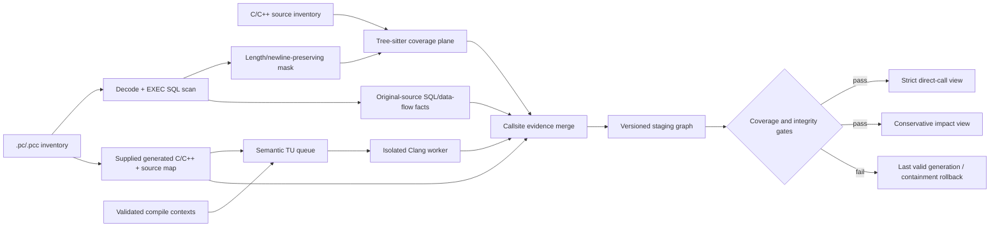

# C/C++/Pro*C semantic call graph with Tree-sitter coverage and Clang authority

## 2026-08-24 runtime-hardening amendment

[`260824-1411-cplus-clang-containment-hardening`](../260824-1411-cplus-clang-containment-hardening/plan.md)
closes the remaining contradiction between this dual-plane design and two live
whole-payload Clang replacement/cache paths. It also owns normal-path protocol-2
orchestration, faithful-context enforcement, exact-frontier query coverage, and
the missing provider readback/rollback proof. Phase 07 cannot promote until that
remediation finishes; the current containment decision remains authoritative.

Phase 04E of
[`260807-1202-graph-ingest-write-path-hardening`](../260807-1202-graph-ingest-write-path-hardening/phase-04e-node-first-staging.md)
owns durable node-first delivery, full-key endpoint binding, and exact graph
readback. Those checks prevent dropped or misbound rows but do not promote a
lexical/weak candidate into a semantically correct callee. This plan continues
to own resolution authority, provenance, and strong-edge eligibility.

## Overview

Replace the current implicit equivalence between lexical call expressions and
semantic `CALLS` edges with an evidence-preserving dual-plane architecture for
multi-million-line legacy C, C++, and Pro*C repositories.

Pro*C is an end-to-end scope, not an adapter added after C/C++ analysis. The
full inventory, source contracts, failure isolation rules, and corpus are in
[the Pro*C component map](pro-c-component-map.md); every implementation phase
below has explicit Pro*C work and acceptance criteria.

Tree-sitter remains the repository-wide coverage and structure plane because it
is fast, tolerant of incomplete source, and already integrated with the scan,
cache, and Pro*C masking flow. A versioned, isolated Clang semantic worker
becomes the only authority allowed to publish resolved direct `CALLS` edges.
Lexical, heuristic, virtual, indirect, dependent-template, and unresolved
observations remain explicitly weaker evidence.

The plan follows the conditional brainstorm decision:

1. enforce conservative containment before adding semantic coverage;
2. use sparse Clang analysis only as a shadow/canary rollout mode;
3. promote the comprehensive eligible-translation-unit dual plane only after
   accuracy, compile-context coverage, Pro*C source mapping, resource, security,
   and consumer-contract gates pass;
4. retain Tree-sitter-only containment as the rollback architecture.

The current parser-quality corpus does not exercise calls, the standard runtime
does not install `libclang`, and the Clang candidate currently emits
`callee_id=None` before the graph layer applies name/scope/file/arity heuristics.
Those gaps make a direct Clang-first replacement unsafe and make a semantic
shadow phase mandatory.

## Decision boundaries

### Selected baseline: conservative containment

- `CALLS` means a provenance-bound, semantically resolved direct call.
- Tree-sitter and name-based resolution may emit candidates, but never `CALLS`.
- Existing `POSSIBLE_CALLS`, `CALLS_FUNCTION_POINTER`, and `UNKNOWN_CALL`
  concepts are preserved and refined rather than flattened.
- A query cannot use absence of a strict edge as proof of no impact when its
  traversal crosses incomplete semantic coverage.

### Conditional target: comprehensive dual plane

- Tree-sitter owns file discovery, structure, source ranges, and lexical
  callsite candidates.
- Clang owns semantic caller/callee identity and direct-call resolution inside
  a recorded translation unit and build configuration.
- The Pro*C lane owns `.pc`/`.pcc` discovery, encoding, lexical SQL regions,
  masking, embedded SQL/data-flow facts, generated-artifact provenance, and
  original/generated location reconciliation.
- The graph merge layer owns callsite identity, evidence reconciliation,
  coverage, strict/conservative views, and publication policy.

Clang authority is intentionally scoped. A referenced declaration is not a
whole-program runtime target for virtual dispatch or an indirect call. Multiple
build configurations may produce multiple valid observations; the merge must
preserve rather than erase that distinction.

### Interface choice: libclang/CIndex versus LibTooling

Phase 02 defines a provider-neutral semantic-worker output contract first. The
existing Python `clang.cindex` adapter may prove the contract quickly, but it is
accepted as the production backend only if it supplies the required caller and
callee identities, call classification, spelling/expansion locations,
diagnostics, and dependency evidence on the reviewed corpus. If the stable C
interface cannot satisfy those gates, implement a version-pinned C++ LibTooling
sidecar behind the same worker protocol before Phase 03. The graph contract must
not depend on which Clang interface wins that bounded comparison.

## Target architecture



### Coverage plane

Tree-sitter continues to emit files, namespaces, types, functions, includes,
control context, source locations, and lexical callsites. It must not synthesize
a semantic callee identity. Its output remains valuable when Clang is absent,
times out, lacks headers, or cannot reproduce a build configuration.

### Semantic plane

Run one bounded worker request per translation unit/configuration. Each accepted
semantic observation carries:

- caller and referenced-callee semantic identities;
- USR plus linkage-aware disambiguation for internal/file-local entities;
- callsite kind and resolution class;
- original spelling and macro-expansion locations when available;
- translation-unit key and build-configuration fingerprint;
- normalized compile-argument, target, sysroot/resource-dir, Clang, worker,
  schema, and source/dependency fingerprints;
- diagnostics, completeness state, and bounded failure reason.

Workers receive no graph/vector handles, execute no repository command, have no
network, and retain the existing argument allowlist, path containment, timeout,
RSS/output limits, and process-tree termination rules.

### Evidence and edge contract

Store callsites/evidence as the primary fact and derive consumer views:

```text
Function --HAS_CALLSITE--> CallSite --RESOLVES_TO--> Function
                               |--OBSERVED_AS------> Candidate/Unknown
                               |--IN_CONFIGURATION-> BuildConfiguration
                               `--MAPS_TO_SOURCE---> Original Pro*C span
```

Minimum resolution classes:

| Class | Publication rule |
| --- | --- |
| `direct_resolved` | Eligible for strict `CALLS` when every gate passes |
| `declared_virtual_target` | Not an unconditional runtime `CALLS` |
| `possible_dispatch_target` | Conservative view only |
| `indirect_callsite` | Preserve function type/callback evidence; no invented target |
| `dependent_template_call` | Candidate until a concrete instantiation resolves it |
| `lexical_candidate` | `POSSIBLE_CALLS` only |
| `unresolved` | `UNKNOWN_CALL` with bounded reason |

`CallSite` identity must be stable for repeated analysis of the same source and
configuration and must not include `parse_run_id`. Revision and analysis-run
identity remain provenance, not the merge key. The finalized identity formula
is owned by Phase 01 and must handle macro spelling/expansion and Pro*C mapping.

### Strict and conservative views

- **Strict direct-call view:** only accepted `direct_resolved` observations,
  always returned with semantic coverage/freshness.
- **Conservative impact view:** strict calls plus explicitly selected virtual,
  indirect, possible, and unresolved evidence. Every result retains its class.
- Negative answers such as `no callers` or `unaffected` are permitted only when
  the relevant traversal frontier is semantically complete under the requested
  configuration policy. Otherwise the result is `incomplete`, not empty.

### Pro*C end-to-end architecture

The implementation must preserve four related but independently valid
artifacts:

| Artifact | Authority | Primary consumers | Strict-call eligibility |
| --- | --- | --- | --- |
| Original `.pc`/`.pcc` | User-visible source, encoding, `EXEC SQL` text and locations | SQL/data impact, navigation, migration evidence | Supplies the final source identity |
| Masked C/C++ | Length/newline-aligned structure view | Tree-sitter functions, includes, macros, lexical callsites | Weak evidence only |
| Generated or validated virtual C/C++ | Precompiler/semantic input bound to one configuration | Isolated Clang worker | Eligible only with accepted context and mapping |
| Original/generated source map | Reconciliation evidence with quality and generated-code class | Evidence merge, cache, diagnostics, source navigation | Must pass the configured mapping gate |

The current Pro*C model is explicitly preserved:

- five labels: `SqlStatement`, `SqlDirective`, `SqlCursor`,
  `SqlHostVariable`, and `DatabaseTable`;
- nine relationships: `DECLARES_STATEMENT`, `DECLARES_DIRECTIVE`,
  `BINDS_PARAMETER`, `DECLARES_CURSOR`, `REFERENCES_CURSOR`,
  `REFERENCES_STATEMENT`, `READS_FROM`, `WRITES_TO`, and
  `REFERENCES_TABLE`;
- diagnostics for decode, masking, unterminated SQL, SQL-parser readiness, and
  every new artifact/context/map/reconciliation failure;
- independent SQL publication when generated C, Clang, or mapping is missing.

Cross-domain joins are additive. SQL statements retain original IDs; their
enclosing Tree-sitter function is reconciled with the Clang semantic function.
Host and indicator variables may resolve to unique C parameters, locals,
fields, or globals through a separately typed evidence edge approved by the
schema owner. Dynamic SQL and ambiguous host/cursor/function joins remain
partial evidence and make negative data-impact answers incomplete.

Generated calls are classified as `original_application`, `macro_expansion`,
`precompiler_wrapper`, `precompiler_runtime`, `generated_declaration`, or
`unmapped_generated`. Only mapped application evidence can enter the strict
original-source call view. The analyzer consumes supplied precompiler artifacts
from an allowlisted root; it does not execute the Oracle precompiler or persist
credential-bearing command/options. See the
[complete Pro*C component matrix](pro-c-component-map.md).

## Phases

| Phase | Outcome | Depends on |
| --- | --- | --- |
| [01](phase-01-edge-contract-and-containment.md) | Versioned C/C++/Pro*C call-evidence contract, Pro*C source-bundle identity, gold corpus, baseline, and fail-closed edge containment | Existing graph/payload contracts |
| [02](phase-02-clang-worker-and-usr-identity.md) | Installable isolated Clang backend producing semantic identities for ordinary and mapped Pro*C generated inputs in shadow mode | 01 |
| [03](phase-03-context-cache-and-incremental.md) | Validated compiler/precompiler context registry, Pro*C artifact/map-aware cache, bounded scheduler, and exact invalidation | 02 |
| [04](phase-04-evidence-merge-and-query-views.md) | C call, Pro*C SQL/data-flow, source-map, and coverage reconciliation in strict/conservative migration-impact views | 01-03 |
| [05](phase-05-proc-semantic-source-mapping.md) | Complete Pro*C original/masked/generated bundle, mapping, generated filtering, host/function joins, and regression evidence | 01-04, stabilized Pro*C owner output |
| [06](phase-06-guarded-publication-integration.md) | Quality-aware, label-aware, journaled graph/vector publication of Pro*C SQL plus semantic evidence with independent failure isolation | 01-05 plus owning graph/parser/concurrency contracts |
| [07](phase-07-pilot-and-rollout-decision.md) | Stratified C/C++/Pro*C production pilot with separate Pro*C gates and recorded promote/contain decision | 01-06 plus reliability certification |

## Cross-plan dependencies and ownership

| Area | Owning plan | This plan consumes or defines |
| --- | --- | --- |
| Tree-sitter damage tiers, recovery queue, parser provenance | `260807-1329-parser-quality-recovery` | Consumes quality state; defines semantic call evidence and supplies Phase 01 edge policy to guarded publication |
| Pro*C discovery, decode, lexical SQL extraction, five labels, nine relationships, masking, diagnostics | `260804-1640-port-proc-cplus-to-code-tiny` | Consumes stable original-source facts; defines source bundles, compiler/precompiler provenance, Clang/source-map bridge, semantic/function/host joins, and coverage without adding a second SQL parser |
| Schema preflight, relationship compiler, mutation journal | `260807-1202-graph-ingest-write-path-hardening` | Consumes safe write/reconcile barriers; does not add another writer or journal |
| Staged generation, store admission, atomic publication | `260807-0929-mcp-ingest-query-concurrency` | Supplies semantic artifacts and coverage validation; does not add a scheduler or generation manager |
| Typed outcomes, validation envelope, release certification | `260807-2103-toolchain-reliability-hardening` | Supplies call-evidence adapter and semantic canary; consumes common failure/publication contracts |
| Changed/include-impacted selection | completed `260718-2159-incremental-scan-reliability` | Extends lexical include impact with Clang dependency/configuration evidence |

Phase ordering avoids a circular plan dependency:

1. this plan's Phase 01 finalizes semantic call classes and containment;
2. parser-quality Phase 05 consumes that contract while enforcing damage tiers;
3. this plan's Phase 06 consumes the completed quality and publication gates.

## Expected file areas

### Contracts and C/C++ extraction

- New provider-neutral call-evidence model under `code-tiny/tools/common/` or
  `code-tiny/tools/cplus/`, selected once in Phase 01.
- `code-tiny/tools/cplus/cplus_analyzer.py`
- `code-tiny/tools/cplus/clang_parser.py`
- `code-tiny/tools/cplus/clang_worker.py`
- `code-tiny/tools/cplus/parse_recovery.py`
- `code-tiny/tools/cplus/bootstrap_compile_commands.py`
- `code-tiny/tools/common/analyzer_cache.py`
- `code-tiny/tools/common/parse_quality.py`
- `code-tiny/tools/common/payload_validation.py`

### Graph and query consumers

- `code-tiny/tools/graph/schema/`
- `code-tiny/tools/graph/writer/language_writer.py`
- `code-tiny/mcp/cplus/cplus_mcp.py`
- `code-tiny/mcp/cplus/services/graph_service.py`
- `code-tiny/mcp/cplus/services/impact_service.py`
- `code-tiny/tools/common/graph_expander.py`
- `code-tiny/tools/common/workflow_impact_scorer.py`

### Pro*C integration

- `code-tiny/tools/cplus/proc_analyzer.py`
- `code-tiny/tools/cplus/cplus_analyzer.py` discovery, C/C++ mode, masking,
  payload normalization, Pro*C node/relation buffering, and vector items
- `code-tiny/tools/cplus/bootstrap_compile_commands.py` compiler/precompiler
  context and generated-artifact manifest ingestion
- `code-tiny/tools/cplus/clang_worker.py` mapped generated/virtual input contract
- `code-tiny/tools/common/parse_quality.py` versioned mask/map context
- `code-tiny/tools/common/analyzer_cache.py` source-bundle fingerprints
- `code-tiny/tools/common/payload_validation.py` concrete five-label validation
  and semantic/source-map promotion gates
- `code-tiny/tools/graph/schema/manifest.py` identities and properties for the
  five existing labels, nine relations, and new evidence/map records
- `code-tiny/mcp/framework_registry.py`, `code-tiny/mcp/tool_metadata.py`, and
  C++ graph/impact services for aliases and coverage-aware SQL/call traversal
- `code-tiny/tools/sync/incremental_sync.py`,
  `code-tiny/tools/sync/owner_manifest.py`, and `cortex_harness/dev.py` for
  discovery, ownership, invalidation, cleanup, status, and rollout controls
- Pro*C source-bundle/artifact-manifest/source-map adapters selected by Phase 05
- [Pro*C component map](pro-c-component-map.md) as the exhaustive ownership and
  test inventory

### Orchestration and tests

- `code-tiny/tools/sync/incremental_sync.py`
- `cortex_harness/dev.py`
- `tests/test_cplus_graph_runtime.py`
- `tests/test_cplus_parse_recovery.py`
- `tests/test_cplus_clang_worker.py`
- New semantic contract/worker/view/source-map tests under `tests/`
- New reviewed fixture corpus under `tests/fixtures/cplus_semantic_calls/`
- New cold/warm benchmark producing plan-scoped Phase 07 reports

## Acceptance gates

| Concern | Required gate |
| --- | --- |
| Edge truth | 100% of published `CALLS` have accepted semantic provider, caller/callee identity, TU/configuration fingerprint, source span, and resolution class |
| Containment | Zero Tree-sitter-only or name/scope/arity heuristic observations publish as `CALLS` |
| Direct-call accuracy | Initial promotion gate: precision >=98% and recall >=95% on reviewed, well-configured direct-call cases; any threshold change requires an evidence report and explicit approval |
| Call taxonomy | Virtual, indirect, dependent-template, macro, unresolved, and multi-configuration cases remain distinguishable; no category is flattened to gain recall |
| Compile coverage | At least 90% of agreed priority canary TUs have faithful validated contexts, and every ineligible/failed TU has a stable reason and visible coverage state |
| Pro*C inventory/routing | `.pc`/`.pcc` full and incremental discovery, rename/delete cleanup, C/C++ mode, and `proc`/`pro*c`/`pro-c` routing are deterministic with no PL/SQL extension collision |
| Pro*C source integrity | 100% of accepted reviewed masks preserve normalized byte length/newlines; lossy or misaligned spans fail closed with original encoding/hash provenance |
| Pro*C SQL preservation | All five existing labels and nine relationships have zero reviewed regression; SQL facts remain available when generated C, mapping, or Clang fails |
| Pro*C semantic mapping | 100% of reviewed strict Pro*C calls map to the expected original file/span and semantic function under an accepted source bundle/configuration |
| Pro*C generated filtering | Zero reviewed precompiler wrapper/runtime/unmapped generated calls appear as original application `CALLS` or migration source locations |
| Pro*C cross-domain impact | Function→SQL→table, caller→function→SQL, cursor, host/indicator, dynamic SQL, and unresolved joins return explicit evidence and completeness rather than invented targets |
| Pro*C lifecycle/security | Original/generated/map/context changes invalidate exact affected artifacts; supplied artifacts are contained and credential-bearing precompiler options never enter workers or persisted evidence |
| Worker readiness | Pinned Clang backend is installed and health-checked on every supported platform; real worker tests pass without mocks or silent skip |
| Worker safety | Timeout/crash/OOM/unsafe flags/external paths affect one request, never execute repository commands, and never publish semantic evidence |
| Determinism | Two clean runs of the same revision, toolchain, context, and policy produce identical accepted callsite/evidence fingerprints |
| Incremental correctness | Source, compile context, analyzer version, and dependency changes invalidate every affected observation and no unaffected cache entry |
| Consumer safety | Strict and conservative views preserve evidence classes; negative impact claims fail closed across incomplete coverage |
| Publication | Failed, partial, cancelled, ambiguous, or over-threshold runs cannot change the active generation or baseline |
| Scale | Cold/warm runtime, peak RSS, queue depth, cache size, header fan-out, and changed-TU latency meet budgets recorded before the Phase 07 pilot |
| Rollback | One configuration switch returns consumers to Tree-sitter structure plus weak edges and the last valid semantic generation |

Accuracy thresholds apply only to direct calls with faithful contexts. They do
not pretend that virtual or indirect call target recall is solved in v1.

## Verification strategy

- Unit tests validate evidence serialization, identity, edge promotion, merge,
  coverage, and forbidden weak-to-strong transitions.
- Worker tests cover overloads, ADL, namespaces, methods, operators, templates,
  macros, internal linkage, virtual calls, function pointers, malformed inputs,
  timeouts, crashes, and unavailable toolchains.
- Configuration tests cover duplicate commands, multiple variants, missing
  headers, target/sysroot drift, generated files, and header contexts inherited
  from representative includers.
- Pro*C tests cover `.pc`/`.pcc`, C/C++ modes, UTF-8/CP932/lossy decode,
  mask alignment, comments/literals/raw strings, multiline and embedded PL/SQL,
  cursor/directive/host/indicator/dynamic SQL, SQLCA/ORACA, C calls around SQL,
  precompiler includes, generated wrappers, and every map-quality state.
- Pro*C graph/MCP tests preserve all five labels and nine relationships, prove
  label-aware payload validation and graph/vector cleanup, and validate
  function→SQL→table plus caller→function→SQL coverage-aware impact paths.
- Graph/MCP tests prove strict and conservative views, coverage-aware traversal,
  no unsafe negative claims, provider parity, and stable callsite identities.
- Incremental tests mutate source, headers, compile flags, Clang versions,
  source maps, and policy versions and assert exact invalidation.
- Phase 07 benchmarks a stratified real workload; warning reduction or higher
  edge count alone is never a success criterion.

## Non-goals

- Replacing Tree-sitter as the resilient structure/index plane.
- Treating Clang success under one configuration as repository-wide truth.
- Complete points-to, alias, callback registration, or runtime virtual-dispatch
  analysis in the first release.
- Executing repository build/configure commands in normal report/repair flows.
- Parsing raw `EXEC SQL` with Clang without a validated transformation/map.
- Running an Oracle precompiler or repository build command in the normal
  analyzer, report, repair, or semantic worker path.
- Replacing the Pro*C lexical SQL owner, renaming its five labels/nine
  relationships, or treating generated C as the user-visible source.
- Per-node merging of Tree-sitter and Clang ASTs.
- Creating a second graph journal, generation manager, scheduler, or reliability
  envelope beside the owning plans.
- Publishing a permanently sparse semantic overlay as if it were complete.

## Risks and mitigations

| Risk | Mitigation |
| --- | --- |
| Faithful compile contexts are sparse | Census first; preserve containment; prioritize context repair without claiming completeness |
| Clang version/toolchain drift changes identities | Pin versions and include toolchain/context in cache and evidence fingerprints |
| Header/configuration multiplicity explodes observations | Preserve configuration identity, deduplicate exact evidence, cap approved variants, report coverage |
| Native parser consumes excessive CPU/RSS | Disposable bounded workers, adaptive admission owned by the gateway, circuit breaker, cold/warm pilot |
| USR is overused for internal-linkage/config-specific entities | Add linkage, file/TU, and configuration disambiguation and gold tests |
| Virtual/function-pointer calls appear falsely certain | Separate resolution classes and derived views; never promote without stronger whole-program evidence |
| Pro*C mapping is missing or drifts | Fail closed to weak C-call evidence while retaining original SQL facts |
| Pro*C validation collapses concrete labels to `ProcStatement` | Make payload validation label-aware and cover every label/endpoint before any graph/vector side effect |
| Generated precompiler runtime calls pollute migration results | Persist generated classification and exclude wrapper/runtime/unmapped classes from original-source strict views |
| Precompiler options contain credentials or external paths | Redact/hash approved semantic inputs, reject secret-bearing arguments, contain artifact roots, and never persist raw command text |
| Stale strong edges survive downgrade or deletion | Stage full evidence replacement with before/after reconciliation and rollback generation |
| Consumers ignore coverage | Make coverage part of response schema and prohibit negative claims when incomplete |
| Plans edit shared hot files concurrently | Respect owner table and phase blockers; keep early changes additive and shadow-only |

## Success criteria

- The graph contract has one auditable meaning for `CALLS`: accepted direct
  semantic evidence, never lexical/name heuristic inference.
- Tree-sitter continues to index incomplete repositories and preserves useful
  weak callsite evidence without blocking normal ingestion.
- The Clang backend is installed, isolated, reproducible, and produces stable
  semantic identities and classified callsites on the reviewed corpus.
- Pro*C retains all SQL/data-flow facts and maps accepted C semantic evidence to
  original `.pc`/`.pcc` source.
- Every Pro*C component in the [component map](pro-c-component-map.md) has an
  owner, implementation phase, failure policy, test cohort, and completion
  artifact; Pro*C results are reported separately from aggregate C/C++ metrics.
- Strict and conservative queries expose coverage and cannot turn incomplete
  analysis into a false negative impact conclusion.
- Incremental invalidation follows source, headers/dependencies, compile
  contexts, semantic worker versions, policies, and Pro*C mappings.
- The Phase 07 report records one explicit outcome: promote comprehensive
  eligible-TU semantic publication, remain in containment, or revise the plan.

## Delivery command

After plan approval, implement with:

```text
/hi-craft plans/260821-1144-cplus-semantic-call-graph/plan.md
```
