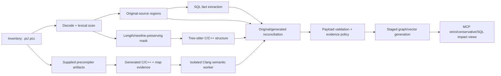

# Pro*C end-to-end component map

## Purpose

This document makes Pro*C a first-class lane of the semantic call-graph plan.
It inventories every repository component that discovers, parses, validates,
stores, queries, invalidates, or tests `.pc`/`.pcc` evidence and defines how
the original source, masked C/C++ view, embedded SQL facts, and Clang semantic
observations remain joined without corrupting source identity.

The existing `proc_analyzer.py` remains the authority for Pro*C lexical SQL
extraction. This plan does not replace it. It adds the semantic C/C++ bridge,
source-map contract, cross-domain evidence joins, guarded publication, and the
consumer coverage rules needed for migration and impact analysis.

## End-to-end flow



The normal analyzer never executes an Oracle precompiler or a repository build
command. It may consume generated artifacts and mapping evidence from an
explicitly provisioned, allowlisted artifact root. Precompiler execution, if
ever enabled, requires a separate approved workflow with pinned tooling,
redacted configuration, resource limits, and captured provenance.

## Non-negotiable invariants

1. Original `.pc`/`.pcc` content is authoritative for user-visible locations,
   `EXEC SQL` text, cursors, host variables, table references, directives, and
   transaction statements.
2. Masking must preserve normalized UTF-8 byte length and newline placement;
   otherwise Tree-sitter locations and enclosing-function joins are
   quarantined.
3. Raw Pro*C is never submitted to Clang as ordinary C/C++.
4. A generated or virtual C/C++ observation cannot become strict `CALLS`
   unless its translation-unit context and original-source map are accepted.
5. Precompiler-generated runtime calls and wrappers never masquerade as calls
   written by the application developer.
6. SQL facts publish independently of semantic C call coverage. Missing Clang,
   generated output, or source mapping cannot erase valid SQL evidence.
7. Dynamic SQL, macro-generated calls, indirect calls, cursor state, and
   unresolved host-variable bindings stay explicitly classified; the pipeline
   does not invent targets to improve graph density.
8. Credentials, environment values, absolute external paths, and raw
   precompiler command lines are not persisted in cache, graph, reports, or
   worker diagnostics.

## Component inventory and implementation ownership

| Component | Current repository behavior | Required semantic-plan change | Owner / phase |
| --- | --- | --- | --- |
| File discovery | `_scan_c_family_files`, `incremental_sync.py`, `owner_manifest.py`, and `cortex_harness/dev.py` recognize `.pc`/`.pcc` | Keep one canonical extension set; test full/incremental/deleted/renamed discovery and prevent `.pck` PL/SQL collision | Existing C++ owner; Phases 01, 03, 07 |
| MCP routing | `framework_registry.py` maps `proc`, `pro*c`, and `pro-c` to `cplus` | Preserve aliases; expose Pro*C semantic/SQL coverage fields without creating a second backend | MCP owner; Phases 04, 07 |
| C versus C++ mode | `.pc`/`.pcc` default to C and may be overridden by compile-database evidence | Add explicit `proc_language_mode` provenance from build/precompiler metadata; reject silent mode conflicts | Phase 03 |
| Source decoding | `prepare_proc_bytes` tries UTF-8, then CP932, then UTF-8 replacement | Carry original content hash, detected encoding, normalization policy, and lossy flag into every region/map/cache identity | Pro*C owner input; Phases 01, 03, 05 |
| Lexical region scanner | `proc_analyzer.py` finds `EXEC SQL`, skips comments/literals, tracks spans, operations, targets, host and indicator variables, and dynamic SQL | Freeze behavior with gold fixtures for raw strings, nested/multiline SQL, embedded PL/SQL, directives, cursors, unterminated blocks, and encoding edges before semantic joins | Pro*C owner; Phase 05 consumes |
| Masked Tree-sitter input | `prepare_proc_path` supplies length/newline-preserving `masked_bytes`; `cplus_analyzer.py` parses it as C/C++ | Version the mask algorithm/hash, enforce alignment gates, and retain original plus masked span provenance on lexical callsites/functions | Phases 01, 05 |
| Tree-sitter structure | Masked `.pc`/`.pcc` emits functions, types, includes, macros, and lexical calls | Mark calls `lexical_candidate`; never promote them to `CALLS`; expose whether the enclosing function intersects damaged/masked spans | Phases 01, 04 |
| SQL parser availability | `_sql_parse_status` lazily probes the common SQL parser while the Pro*C lexer still emits best-effort facts | Preserve typed `sql_parser_unavailable` diagnostics and distinguish lexical facts from grammar-validated SQL facts | Pro*C owner; Phases 05, 06 |
| SQL node model | Current labels are `SqlStatement`, `SqlDirective`, `SqlCursor`, `SqlHostVariable`, and `DatabaseTable` | Preserve stable original-source IDs and add evidence/version fields additively; do not fork these labels for generated C | Pro*C/schema owners; Phases 05, 06 |
| SQL relationship model | Current relations are `DECLARES_STATEMENT`, `DECLARES_DIRECTIVE`, `BINDS_PARAMETER`, `DECLARES_CURSOR`, `REFERENCES_CURSOR`, `REFERENCES_STATEMENT`, `READS_FROM`, `WRITES_TO`, and `REFERENCES_TABLE` | Preserve all nine; validate endpoint identities and original spans; keep dynamic/unknown targets explicit | Pro*C/schema owners; Phases 04-06 |
| Enclosing-function join | SQL regions are attached to a Tree-sitter function by original line range | Reconcile that function with its semantic identity; on ambiguity retain the lexical function ID and a weak join instead of selecting by name | Phases 04, 05 |
| Host-variable join | SQL host variables are nodes bound to statements but are not semantically tied to C declarations | Resolve host/indicator variables to Clang parameter/local/field identities when unique; use a schema-owner-approved evidence edge and retain unresolved/ambiguous states | Phases 04, 05 |
| Cursor lifecycle | Lexer emits declarations and references for cursor operations | Preserve declare/open/fetch/close ordering evidence and original spans; do not infer a cursor target across ambiguous scopes | Pro*C owner plus Phase 05 reconciliation |
| Dynamic SQL | `EXECUTE IMMEDIATE` is flagged; table target extraction is necessarily incomplete | Mark dynamic SQL as incomplete data impact, retain host/string evidence where available, and prohibit authoritative `no table impact` answers | Phases 04, 05, 07 |
| Pro*C includes | `EXEC SQL INCLUDE` is represented as a directive, separate from C preprocessor includes | Add it to dependency/context evidence when it resolves inside approved roots; unresolved/external include remains a visible coverage reason | Phases 03, 05 |
| Compile/precompiler context | Compile database support exists for C/C++; no complete Pro*C context contract exists | Define normalized C/C++ compiler context plus redacted precompiler/tool/options/include/macro/mode fingerprint; never store credentials or execute command text | Phase 03 |
| Generated artifact discovery | No canonical mapping from `.pc`/`.pcc` to supplied precompiler `.c`/`.cpp` output | Add an explicit manifest keyed by original hash, generated hash, configuration, precompiler identity, and artifact path under an allowlisted root | Phase 05 |
| Source-map ingestion | No provider-neutral Pro*C original/generated map currently exists | Add versioned exact/line/inferred/missing/stale/invalid mapping entries with generated-only classifications and diagnostics | Phase 05 |
| Clang semantic input | Current in-process Clang fallback explicitly excludes `.pc`/`.pcc` | Submit only accepted generated or validated virtual C/C++ through the isolated worker; carry original bundle/map IDs in request and response | Phases 02, 05 |
| Generated runtime filtering | Precompiler helper calls/wrappers are not currently classified | Separate `original_application`, `macro_expansion`, `precompiler_wrapper`, `precompiler_runtime`, and `unmapped_generated` observations; strict source impact accepts only mapped application evidence | Phase 05 |
| Callsite identity | Existing callsite identity is source oriented but has no complete Pro*C mapping key | Base original callsite identity on original file/span plus semantic/configuration identity; keep generated span and artifact hash as provenance, not the user-visible identity | Phases 01, 05 |
| Parse/cache identity | Current `masking_fingerprint` is `proc-v1`; parse payload caches SQL nodes and diagnostics | Include original/masked/generated/map hashes, mask/precompiler/worker/schema/policy versions, mode/context, and dependency closure; migrate or fail closed on old entries | Phases 03, 05 |
| Payload normalization | `normalize_cached_payload` supplies Pro*C defaults; `payload_validation.py` currently uses a generic `ProcStatement` fallback while records carry concrete labels | Make Pro*C validation label-aware for all five labels, validate required fields per label, preserve evidence class/map quality, and quarantine invalid endpoints before side effects | Phases 01, 06 |
| Graph schema and write path | Canonical manifest contains the five labels; analyzer still buffers per-label Pro*C Cypher and nine relation types | Register identities/properties/relationships in the canonical schema compiler and journal; remove analyzer-local semantic schema authority without duplicating the graph-hardening owner | Graph owner; Phase 06 |
| Vector indexing | `_iter_vector_items` embeds `proc_nodes` alongside functions/resources | Index only approved original SQL text/summary fields; exclude generated source, credentials, and unstable runtime wrappers; keep project/file provenance and deletion parity | Phases 05, 06 |
| Query and impact views | C++ MCP knows Pro*C aliases and SQL labels/relations, but semantic coverage is not joined to SQL/data impact | Support function→SQL→table and caller→function→SQL traversals with evidence class, dynamic-SQL incompleteness, configuration, source map, and served generation | Phase 04 |
| Incremental cleanup | `.pc`/`.pcc` participates in sync ownership and file-scoped cleanup | Invalidate source, generated artifact, map, compile/precompiler context, included file, semantic evidence, graph, and vector artifacts as one replacement set | Phases 03, 06 |
| Diagnostics and status | `proc_diagnostics` captures encoding, masking, unterminated SQL, and parser availability issues | Add stable categories for artifact/map/context/worker/reconciliation/generated filtering; aggregate per file/configuration without leaking raw commands or secrets | Phases 05-07 |
| Test and benchmark corpus | Existing tests cover basic extraction, scan integration, CP932, graph scope, embedding count, and one E2E fixture | Add a stratified Pro*C corpus for C/C++ modes, SQL forms, macros, includes, mappings, generated wrappers, failure isolation, incremental invalidation, graph/MCP views, and million-LOC sampling | Phases 01, 05-07 |

## Required contracts

### `ProcSourceBundle`

One immutable bundle represents the related source artifacts for a single
original file and configuration:

```text
project/revision
original_file_id + original_hash + original_encoding + lossy_decode
masked_hash + mask_policy_version
generated_artifact_id/hash/language (optional)
source_map_id/hash/quality (optional)
compile_context_fingerprint
precompiler_fingerprint (redacted)
semantic_worker/schema/policy versions
```

The bundle status is one of `sql_only`, `lexical_ready`, `semantic_eligible`,
`semantic_complete`, `partial`, `stale`, `invalid`, or `failed`. SQL extraction
may succeed in `sql_only`; strict semantic calls require `semantic_complete`.

### `ProcSourceMapEntry`

Each entry contains generated file/span, original file/span, mapping method,
quality, bundle/configuration identity, and generated-code classification.
Required mapping qualities are:

| Quality | Allowed use |
| --- | --- |
| `exact_span` | Eligible for strict source calls when all semantic gates pass |
| `exact_line` | Conservative/source-navigation use; strict only if corpus proves stable column reconstruction and policy explicitly allows it |
| `line_directive` | Conservative evidence; never silently treated as byte exact |
| `inferred` | Weak evidence only |
| `missing` | Generated-only diagnostics; no original-source call edge |
| `stale` | Quarantine semantic evidence and invalidate previous accepted output |
| `invalid` | Quarantine the bundle's semantic lane |

Generated-code classification is one of `original_application`,
`macro_expansion`, `precompiler_wrapper`, `precompiler_runtime`,
`generated_declaration`, or `unmapped_generated`.

### SQL and C semantic reconciliation

- A SQL node keeps its current original-source identity and relation types.
- Its enclosing function is resolved first by original source containment, then
  checked against the semantic function identity mapped from generated C.
- Unique host and indicator variables may link to C parameters, locals, fields,
  or globals through a separately typed evidence relationship selected with
  the graph-schema owner. `BINDS_PARAMETER` remains the statement-to-SQL-host
  relationship and is not redefined.
- SQL table impact and C call impact share the same function identity but retain
  independent evidence/provenance. A Clang failure cannot delete SQL facts; an
  SQL parse failure cannot promote or demote an otherwise valid C direct call.
- Dynamic SQL and unresolved host/cursor joins propagate `partial` coverage to
  conservative migration/impact results.

## Failure isolation matrix

| Failure | SQL facts | Tree-sitter structure/calls | Strict semantic calls | Required outcome |
| --- | --- | --- | --- | --- |
| Lossless legacy decode with diagnostic | Preserve | Preserve | Eligible if map uses normalized source identity | Report encoding provenance |
| Lossy decode or mask-length mismatch | Preserve only facts with safe spans | Quarantine affected locations | Reject | Visible `invalid_source_alignment` |
| Unterminated `EXEC SQL` | Preserve preceding safe regions | Parse masked best effort | Reject intersecting/ambiguous spans | Partial coverage with region diagnostic |
| SQL parser unavailable | Preserve lexical Pro*C facts with lower SQL confidence | Preserve | Independent of SQL grammar status | Never erase C call evidence |
| Generated artifact missing | Preserve | Preserve weak candidates | Reject | `sql_only` or `lexical_ready` |
| Generated artifact hash mismatch | Preserve | Preserve weak candidates | Reject and remove stale accepted evidence in staging | `stale_generated_artifact` |
| Source map missing/inferred | Preserve | Preserve weak candidates | Reject original-source strict edge | Conservative generated evidence only |
| Precompiler runtime wrapper | Preserve | Not an original source call | Exclude from original-source `CALLS` | Store generated-only diagnostic/evidence if useful |
| Clang timeout/crash/OOM | Preserve | Preserve weak candidates | Reject request output | Isolated typed failure |
| Unsafe/external artifact or secret-bearing option | Preserve | Preserve weak candidates | Reject before worker | Redacted policy violation |
| Graph/vector publication failure | Keep active generation unchanged | Keep active generation unchanged | Keep active generation unchanged | Reconcile/rollback through owner contracts |

## Pro*C test corpus

The reviewed corpus must include:

- `.pc` and `.pcc`, C and C++ modes, multiple compile/precompiler variants;
- UTF-8, CP932, normalized multibyte spans, and deliberate lossy input;
- comments, escaped strings/chars, raw strings, macros, multiline SQL, embedded
  PL/SQL, unterminated blocks, and semicolons inside SQL strings/comments;
- `SELECT`, DML, `COMMIT`, `ROLLBACK`, `WHENEVER`, `INCLUDE`, cursor
  declare/open/fetch/close, host variables, indicator variables, SQLCA/ORACA,
  dynamic SQL, and unresolved table targets;
- application C calls before, between, and after `EXEC SQL` regions;
- overloaded C++ calls, namespaces, methods, templates, virtual/indirect calls,
  macro expansions, internal linkage, and calls inside conditional compilation;
- exact, line-only, inferred, missing, stale, conflicting, and invalid maps;
- generated helper wrappers/runtime calls plus user calls that happen to have
  similar names;
- changed original source, generated output, map, included header, precompiler
  context, compile flags, toolchain, schema, and policy invalidation;
- graph/vector deletion, deterministic rerun, MCP strict/conservative/SQL impact,
  worker failure, staged publication, and rollback.

## Completion evidence

Phase 07 must publish Pro*C-specific results rather than folding them into C/C++
aggregates: file/configuration census, SQL fact regression, mask alignment,
generated-artifact coverage, mapping quality distribution, accepted/rejected
semantic call counts, generated-runtime filtering, host/cursor join coverage,
direct-call precision/recall, dynamic-SQL incomplete results, incremental
invalidation, graph/vector parity, query correctness, resource use, failure
isolation, and rollback outcome.
