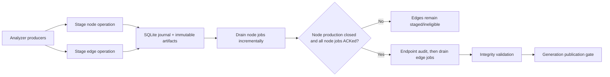

# Phase 04E: Durable node-first staging and edge release

## Context

The shared writer currently awaits node categories before most generic
relationships, but it does not enforce one graph-wide node-first boundary.
`Repository-[:HAS_FILE]->File`, navigation edges, call-evidence edges, and
several custom writers can execute before later node families finish. The
journal also derives edge dependencies from an in-memory mapping of node
identity to per-batch barriers, so a relationship produced before a later node
cannot depend on a barrier that has not yet been registered.

The target is stronger and simpler to reason about: during one ingest run,
node mutations may drain incrementally, while every edge mutation is written to
durable local staging and remains ineligible. Edge execution begins only after
the producer declares that no more nodes can appear and all staged node batches
are ACKed. This reuses the existing SQLite WAL journal and immutable JSONL
artifacts; it does not introduce an unbounded process-memory cache.

## Requirements

- Guarantee that no relationship, call, possible-call, evidence-edge, workflow
  edge, topology edge, or framework edge mutates the graph before the run-level
  node phase is drained.
- Persist node and edge operation payloads before graph execution so crash and
  restart preserve ordering without reparsing an already compatible run.
- Keep memory bounded to the active parser/write batch plus a bounded identity
  lookup; do not retain all node or edge payloads in Python collections.
- Persist complete endpoint references on edge rows: project scope, endpoint
  label, identity property, identity value, relationship type, stable edge
  identity where applicable, and properties.
- Prove row conservation across extraction, staging, graph ACK, and final
  readback. A matching total alone is insufficient; every node and edge row
  must retain a stable manifest identity and an explicit terminal disposition.
- Bind edges by the complete canonical endpoint key. Name-only lookup,
  cross-project fallback, unlabeled matching, and ambiguous label inference are
  forbidden in required node-first mode.
- Separate referential correctness from semantic correctness. SQLite and graph
  readback prove that the declared endpoint was materialized exactly; analyzer
  resolution policy and provenance must prove that the declared endpoint is
  the intended source-code symbol.
- Continue using deterministic analyzer IDs. Do not add database-generated ID
  mapping or depend on mutation return order.
- Reject phase closure if a producer is still open, an unsupported direct edge
  writer remains, staged artifacts are corrupt/incompatible, or required
  endpoint metadata is incomplete.
- Preserve provider parity, idempotency, project isolation, count
  reconciliation, generation publication gates, and existing schema preflight.

## Architecture



Use one persisted barrier such as `phase:nodes` per compatible journal run.
Every node job produces that barrier. Every edge/call job requires it. Opening
the run opens node production; finalization closes it. The journal changes the
barrier to `drained` only when it is closed and its `drained_count` equals its
`produced_count`. Edge jobs cannot be claimed before that state.

Per-node/per-batch barriers may remain for diagnostics and precise dependency
evidence, but edge eligibility must not depend on the process-local
`_node_barriers` dictionary. Restarted consumers derive eligibility entirely
from persisted journal state.

### Exact role of SQLite

SQLite is the durable control plane and accounting ledger for one compatible
ingest run. It is not the graph database, not the canonical node/edge payload
store, and not a semantic resolver.

| Component | Owns | Does not prove |
| --- | --- | --- |
| SQLite WAL journal | Run fingerprint, producer lifecycle, batch metadata, node/edge manifests, barriers, leases, fencing, retry state, terminal disposition, and conservation counters | That the graph mutation committed, or that a symbol resolver selected the semantically correct target |
| Immutable JSONL artifacts | Canonical full node/edge rows, content hash, byte count, and row count used for replay | Eligibility, ordering, or graph existence |
| Analyzer/resolver | Source-derived identity, endpoint choice, resolution class, and provenance | Durable delivery or graph commit |
| Graph store | Materialized nodes and relationships | Whether all intended rows were delivered without an external expected manifest |
| Graph receipts and exact readback | Whether a particular operation and canonical identity set was applied to the expected generation | Original parser/resolver intent |
| Generation manager | Keeps partial node-only or incomplete edge state invisible to normal readers until validation passes | Row-level correctness by itself |

SQLite also cannot detect a source construct that the parser never discovered.
Parser/semantic coverage gates own that class of omission. SQLite begins its
guarantee at the accepted extraction-intent boundary: once an analyzer accepts
a node or edge row, that intent must be durably staged before the producing
buffer may be released.

SQLite metadata and artifact publication must follow enqueue-before-mutate
ordering: fsync and hash the immutable artifact, commit its manifest and batch
record in one SQLite transaction, and only then allow graph execution. SQLite
ACK occurs only after a graph receipt or exact readback proves the mutation.
There is no distributed transaction between SQLite and the graph store;
ambiguous outcomes remain `reconciling` until graph evidence resolves them.

The SQLite database must stay compact. Large code, properties, and full
payloads remain in content-addressed JSONL artifacts. SQLite stores normalized
identity/endpoint ledger rows needed for joins and audits, plus references to
the artifacts. WAL, foreign keys, `STRICT` tables, uniqueness constraints,
bounded admission, and explicit schema migration are required.

### Local staging contract

Node operations store their existing canonical artifact plus a compact identity
manifest keyed by:

```text
(run_id, project_id_normalized, node_label, identity_property, identity_value)
```

The identity value uses a versioned canonical encoding that preserves its
declared type. Arbitrary `str(value)` conversion is not allowed because values
such as integer `1` and string `"1"` can otherwise collide. Composite identities
are encoded as canonical ordered tuples. Case normalization is applied only by
the owning identity contract, never globally.

The node manifest doubles as the durable accepted-intent ledger and records at
least `producer_id`, artifact hash, row ordinal, payload hash,
resolution/provenance class, and disposition. Its compound key is unique within
the run. The stage API commits the intent/manifest and artifact reference before
acknowledging the analyzer or allowing it to clear the buffer. Byte-equivalent
repeats become declared duplicates; different payload hashes for the same
identity are conflicts and block node phase closure.

Edge artifacts store explicit endpoint keys rather than only `source_id` and
`target_id`. A normalized edge-endpoint ledger stores one source and one target
row per edge row, keyed by `(edge_job_id, row_ordinal, role)`, including project,
label, identity property, canonical identity value, required/optional policy,
and expected origin (`current_run`, `preexisting_anchor`, or
`explicit_external`). Foreign keys tie endpoint rows to their staged edge batch.

The compact manifests support preflight diagnostics and deduplication; the
graph endpoint audit remains the final authority because a valid edge may
target an explicitly allowed node that predates the current run, such as a
repository anchor. Such anchors require an allowlisted contract and exact graph
readback. Missing endpoints are never auto-created implicitly. An external
placeholder must be staged as a real typed node with provenance before it can
satisfy a required edge.

Duplicate node keys with byte-equivalent payloads deduplicate. Conflicting
payloads for the same key fail closed with bounded diagnostics. Edge
deduplication uses the relationship contract's stable identity: endpoint pair
for pair-unique edges, or endpoint pair plus `site_id`, `evidence_id`, route
name, step order, or other declared edge key.

Each relationship contract also declares allowed source/target labels and
identity properties, project-scope policy, stable edge key, required/optional
policy, self-loop policy, and cardinality/ownership rules. For example, an
ownership edge may require exactly one owner while `CALLS` permits fan-out.
These contract checks run against the complete staged edge manifest before
release, catching structurally valid but impossible bindings that raw endpoint
existence cannot detect.

Every analyzer emits a producer-completion record. Node production cannot close
until all registered producers, including tail/inferred/semantic/external-node
producers, are terminal. The final node inventory records expected/emitted,
staged-unique, declared-duplicate, conflict, ACKed, and graph-verified counts by
producer and node contract.

Required conservation equations are:

```text
emitted node rows = staged unique nodes + declared duplicate rows + rejected rows
staged unique nodes = ACKed nodes = graph-verified unique nodes

emitted edge rows = staged unique edges + declared duplicate rows + rejected rows
staged unique edges = ACKed edges = graph-verified exact edges
```

Every rejected row has a typed reason and blocks clean publication unless its
contract explicitly classifies it as optional. Counters are derived from ledger
rows, not trusted from producer-supplied totals.

### Writer lifecycle

Add an analyzer-level lifecycle rather than inferring completion from one
`write_all()` invocation:

```text
begin_graph_production(run)
stage/drain node batches as discovered
stage edge batches as discovered
close_node_production()
await_node_drain()
audit_edge_endpoints()
drain_edges()
close_graph_production()
```

`write_all()` becomes a compatibility facade over this lifecycle. Nested or
streamed calls cannot close node production. Only the owning analyzer/sync
orchestrator may close the phase after tail/inferred/external-placeholder nodes
have been staged.

### Endpoint binding and release gates

Before the first edge mutation, the orchestrator freezes an edge-audit horizon
bound to the run fingerprint, graph generation, node-barrier receipt set, and
node-manifest digest. It then executes all of these gates:

1. **Producer closure:** every registered node producer is terminal; no late
   node enqueue is possible after the node barrier closes.
2. **Local endpoint closure:** each required endpoint resolves to exactly one
   compatible staged identity or one explicitly allowlisted pre-existing
   anchor. Zero or multiple candidates fail closed.
3. **Graph node readback:** group by `(project, label, identity property)` and
   verify exactly one graph node for every required endpoint. All matches use
   project scope and label; internal database IDs and name-only fallbacks are
   forbidden.
4. **Semantic eligibility:** strong edges require an accepted resolution class,
   resolver/provider provenance, identity-schema fingerprint, and any
   language-specific authority gates. Weak or unresolved evidence cannot be
   silently promoted because it happens to match an existing node.
5. **Relationship invariants:** validate label pairs, identity properties,
   project policy, self-loop rules, ownership/cardinality, and stable edge-key
   uniqueness over the complete staged manifest.
6. **Audit seal:** persist the complete endpoint-audit result and digest in
   SQLite. Edge jobs require both the drained node barrier and this sealed audit
   barrier. Exclusive staging-generation ownership prevents node changes
   between audit and edge drain.

After edge execution, exact readback matches each canonical edge key, both
canonical endpoint keys, project scope, and identity-defining edge properties.
`count(edge) == expected_count` alone is not sufficient because the same count
can hide missing and incorrectly bound edges. A batch is ACKed only when every
row resolves exactly once or a graph transaction receipt binds the job ID,
operation version, artifact hash, expected row count, and canonical manifest
digest. Final publication additionally requires zero pending, reconciling,
blocked, dead-lettered, or unexplained optional rows.

## Related Files

- `code-tiny/tools/graph/journal/runtime.py`
- `code-tiny/tools/graph/journal/sqlite_store.py`
- `code-tiny/tools/graph/journal/models.py`
- `code-tiny/tools/graph/journal/operation.py`
- `code-tiny/tools/graph/journal/consumer.py`
- `code-tiny/tools/graph/writer/language_writer.py`
- `code-tiny/tools/graph/writer/query_contract.py`
- Specialized writers under `code-tiny/tools/graph/writer/`
- `code-tiny/tools/cplus/cplus_analyzer.py`
- Android, TypeScript backend, COBOL, Shell, JP1, framework, and topology
  analyzer entry points that directly stage or execute graph mutations
- `code-tiny/tools/sync/incremental_sync.py`
- `cortex_harness/dev.py`
- `tests/test_graph_write_journal.py`
- `tests/test_graph_write_journal_runtime.py`
- Relationship and analyzer graph-contract tests under `tests/` and
  `code-tiny/tests/`

## Implementation Steps

### 1. Persist the phase and identity contracts

1. Version the graph-write operation and run compatibility fingerprints with a
   `node_first_v1` ordering policy.
2. Add the run-level `phase:nodes` barrier and explicit producer lifecycle
   state to the SQLite schema through an idempotent migration.
3. Attach `produced_barriers=("phase:nodes",)` to every trusted node operation
   and `required_barriers=("phase:nodes",)` to every trusted edge/call
   operation.
4. Add normalized `node_manifest`, `edge_manifest`, `edge_endpoint`, and
   `producer_completion` ledgers with compound uniqueness, foreign keys,
   canonical typed identity encoding, payload digests, and terminal
   dispositions.
5. Add a sealed `endpoint_audit` record bound to the run, generation,
   node-manifest digest, and node receipt set. Edge eligibility requires its
   barrier in addition to `phase:nodes`.
6. Add SQL-derived conservation views/checks for emitted, unique, duplicate,
   rejected, ACKed, and graph-verified rows by producer/contract.
7. Extend the relationship schema manifest with full endpoint, scope,
   self-loop, edge-key, and cardinality/ownership rules used by both local audit
   and Cypher compilation.
8. Quarantine old incomplete journals whose ordering/version contract cannot be
   upgraded deterministically; never reinterpret them silently.

### 2. Separate staging from execution in the shared writer

1. Split `write_batches()` into durable preparation and eligible execution
   paths while keeping a compatibility wrapper for node writes.
2. Let node jobs execute after committed enqueue; enqueue edge jobs with
   `defer=True` regardless of whether their endpoints have already appeared.
3. Replace `_deferred_journal_writes` closures with reconstructible operation
   descriptors consumed from persisted artifacts after restart.
4. Add `begin_graph_production()`, `close_node_production()`,
   `await_node_drain()`, `drain_edges()`, and abort/finalize APIs with typed,
   idempotent state transitions.
5. Run complete local and graph endpoint audits only after node drain and before
   the first edge mutation. Required unresolved, cross-project, type-mismatched,
   or ambiguous endpoints block the entire edge phase; explicitly optional
   external endpoints remain reported and policy-controlled.
6. Require exact per-row graph receipts/readback before ACK; do not accept only
   aggregate count equality for nodes or edges.
7. Update progress/status output to distinguish `nodes_producing`,
   `nodes_draining`, `edges_staged`, `edges_draining`, and `blocked`.

### 3. Migrate every edge family and producer

1. Route generic relationships, repository-file edges, calls, site calls,
   possible calls, evidence edges, routes, workflow steps, and other shared
   edge writers through the same staged-edge operation contract.
2. Refactor `LanguageCodeWriter.write_all()` so it never executes an edge
   inline between node categories; preserve result counts as staged versus
   committed counts with unambiguous names.
3. Migrate C++ streaming: stage regular, inferred, tail, resource, semantic,
   and include nodes before closing node production; remove the special
   memory-only include fallback once the common lifecycle is active.
4. Migrate direct/custom Android, TypeScript backend, framework, topology,
   database-schema, MyBatis, Spring, COBOL, Shell, and JP1 paths or reject them
   in node-first mode until a trusted operation compiler exists.
5. Add a repository guard that detects direct edge mutation queries outside the
   allowlisted executor and requires an explicit exemption for read-only/test
   fixtures.
6. Make the sync orchestrator the sole owner of final phase closure and require
   journal drain plus graph validation before marking the run clean.
7. Remove endpoint-label inference from ID alone in required mode. Producers
   must emit complete endpoint descriptors; a compatibility resolver may use
   the staged identity ledger only when it finds exactly one project-scoped,
   contract-compatible candidate and persists that resolution evidence.
8. Update specialized relationship queries so source and target matching always
   includes the declared label, identity property, canonical value, and
   `project_id_normalized` (or an explicit globally scoped anchor contract).

### 4. Validate, benchmark, and roll out

1. Add ordering tests that capture every graph mutation and prove all node
   queries precede all edge queries across normal, streamed, and specialized
   writers.
2. Add forward-reference fixtures where an edge is produced before its source
   or target node, including a node appearing in the final partial buffer.
3. Inject crashes before/after node enqueue, node commit/ACK, node barrier
   close, endpoint audit, edge claim, and edge commit/ACK; compatible restart
   must preserve the phase invariant without duplicate effects.
4. Test conflicting node identities, duplicate edges, optional/pre-existing
   endpoints, typed identity collisions (`1` versus `"1"`), same IDs across
   labels/projects, wrong-label endpoints, corrupt artifacts, disk full,
   cancellation, and unsupported direct writers.
5. Add adversarial fixtures where aggregate counts still match while two edges
   are swapped, one edge is duplicated and another omitted, or a specialized
   writer binds to a same-name node in another project. Exact manifest readback
   must reject every case.
6. Add ownership/cardinality adversarial cases such as one function assigned to
   two declaring files, an illegal self-loop, and an edge label pair outside its
   schema contract. Complete-manifest validation must block release.
7. Add kill points immediately before and after durable stage acknowledgement;
   after restart, an accepted intent must either exist in SQLite or the analyzer
   must replay the uncleared source buffer—never silently lose the row.
8. Measure peak RSS, staging bytes, enqueue latency, node-drain latency,
   edge-release latency, and total runtime at representative 100k/500k node
   scales and the C++/Pro*C canary.
9. Roll out as shadow validation first, then required node-first mode on a
   disposable generation. Promote only after count, parity, restart, memory,
   and performance gates pass; retain the previous generation for rollback.

## Todo

- [ ] Run-level node-production lifecycle and persisted barrier are versioned.
- [ ] Node identity manifest and explicit edge endpoint contract are durable.
- [ ] Producer completion and row-conservation ledgers prove that no emitted
      node or edge disappears without a typed disposition.
- [ ] Canonical typed identities and full project/label/property endpoint keys
      replace ambiguous ID-only binding.
- [ ] Accepted extraction intent is durable before producer-buffer release, and
      parser/semantic coverage separately reports source constructs that were
      never discovered.
- [ ] Relationship label-pair, scope, self-loop, stable-key, and
      cardinality/ownership invariants are enforced over the full manifest.
- [ ] A sealed local-plus-graph endpoint audit gates the first edge mutation.
- [ ] Exact per-row edge readback detects swapped, duplicate, omitted, and
      cross-project bindings even when aggregate counts match.
- [ ] Shared writer stages every edge family until the node barrier drains.
- [ ] Process-local deferred closures are removed from the recovery path.
- [ ] All direct/custom graph writers are migrated, blocked, or explicitly
      inventoried with an owner and deadline.
- [ ] Sync clean/publication gates require node drain, edge drain, and integrity
      validation.
- [ ] Cross-provider ordering, crash/restart, memory, and scale gates pass.
- [ ] Full C++/Pro*C canary proves zero edge mutation before all nodes drain.

## Risks

- A producer that closes node production before inferred or tail nodes are
  staged can create deterministic but incomplete graphs. Only the analyzer
  owner may close the phase, and closure must record producer completion.
- Durable edge staging increases local disk use and delays edge visibility.
  Capacity preflight, bounded retention, generation isolation, and explicit
  progress are required.
- A global barrier reduces pipelining compared with endpoint-specific release.
  Node draining remains incremental to recover most throughput; performance
  acceptance compares total runtime and peak memory rather than assuming the
  stronger ordering is free.
- Existing direct writers can bypass the invariant. Required mode must fail
  closed until the mutation inventory and repository guard are clean.
- Without staged generations, readers can observe a node-only intermediate
  graph. This phase controls write order, while atomic reader visibility remains
  owned by the ingest/query concurrency plan.

## Success Criteria

- For every supported analyzer, captured execution history contains zero edge
  mutation before `phase:nodes` is persisted as `drained`.
- A forward edge emitted before a later node is durably staged, resolves after
  node drain, and survives process restart without reparsing or ID remapping.
- Required missing or duplicate endpoints block the entire edge phase before
  any edge in that phase is mutated; diagnostic skip mode remains explicit and
  cannot publish a clean generation.
- Replaying a compatible run does not duplicate nodes, edges, counts, or
  evidence and does not execute ACKed jobs again.
- Peak memory remains bounded by configured batches; increasing graph payload
  volume grows staging disk usage rather than process-wide node/edge lists.
- Neo4j and FalkorDB produce equivalent node/edge counts and project-scoped
  endpoint resolution on the reviewed fixtures.
- For every producer and contract, conservation ledgers reconcile emitted,
  staged, duplicate/rejected, ACKed, and graph-verified rows with zero
  unexplained loss.
- Every required endpoint has exactly one full-key match in both the sealed
  local audit and graph readback; same ID values in another label or project
  never satisfy the edge.
- Exact edge-manifest comparison catches endpoint swaps or compensating
  duplicate/missing edges that would pass aggregate count checks.
- Ownership/cardinality and allowed-label-pair validation reject an edge that
  targets an existing but structurally invalid node.
- Once a producer accepts a node or edge intent, crash injection proves it is
  either durably staged or replayed from an uncleared buffer, with no silent
  gap. Parser coverage separately quantifies constructs never accepted.
- Referentially valid but semantically weak/unresolved targets remain weak
  evidence unless their analyzer-specific authority gate explicitly promotes
  them.
- The canary meets the existing journal overhead target or records an
  evidence-backed threshold revision before promotion.
