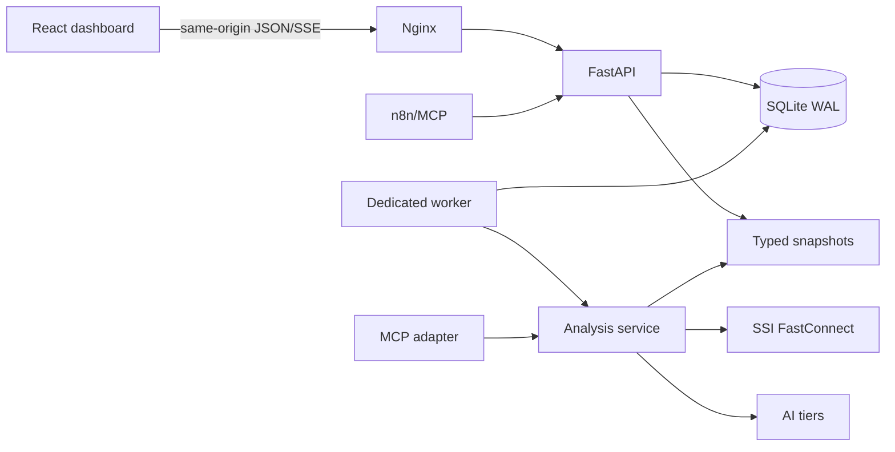

# Stock dashboard architecture

## Overview

The repository is a monorepo with an installed Python backend and a generated-contract React client.

## Boundaries

- `backend/src/stock_backend/analysis` owns typed requests, results, orchestration, and immutable snapshots.
- `backend/src/stock_backend/api` owns browser HTTP/SSE and the temporary n8n compatibility surface.
- `backend/src/stock_backend/auth`, `jobs`, and `watchlists` own durable state and authorization.
- `frontend` consumes `backend/openapi.json`; it never reads CSV, Markdown, or server paths.
- `backend/var` is runtime state. Production mounts it at `/var/lib/stock`.

## Runtime model

API and worker are separate processes. `POST /api/v1/analysis-jobs` persists a queued job and returns `202`; the worker claims it transactionally, emits sequenced events, writes one immutable snapshot, and then marks the job terminal. A per-symbol database lock prevents concurrent publication for the same symbol.

SQLite uses WAL, short transactions, foreign keys, and versioned migrations. Move to PostgreSQL plus a distributed queue when sustained queue wait exceeds the operating SLO or more than one host is required.

## Compatibility

The old n8n routes retain their response shape for one release and require a configured machine token. `stock_mcp`, `stock_bot`, and `analyze_stock` import wrappers delegate to the installed package. Streamlit remains a rollback-only entry point until the cutover observation window is complete.
