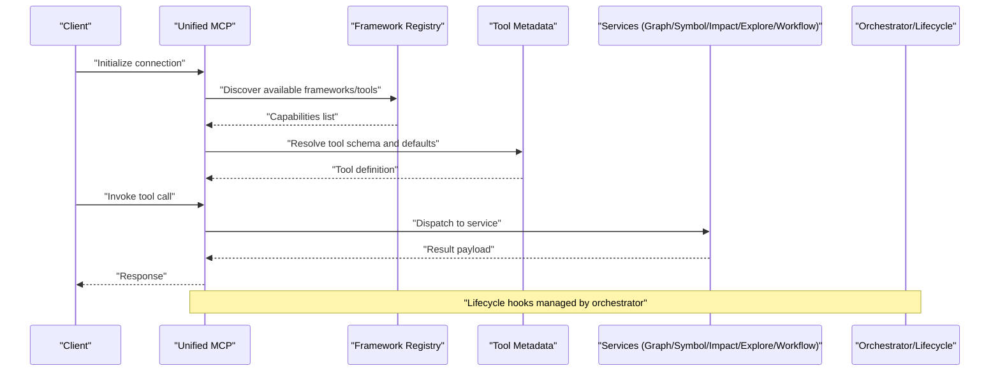
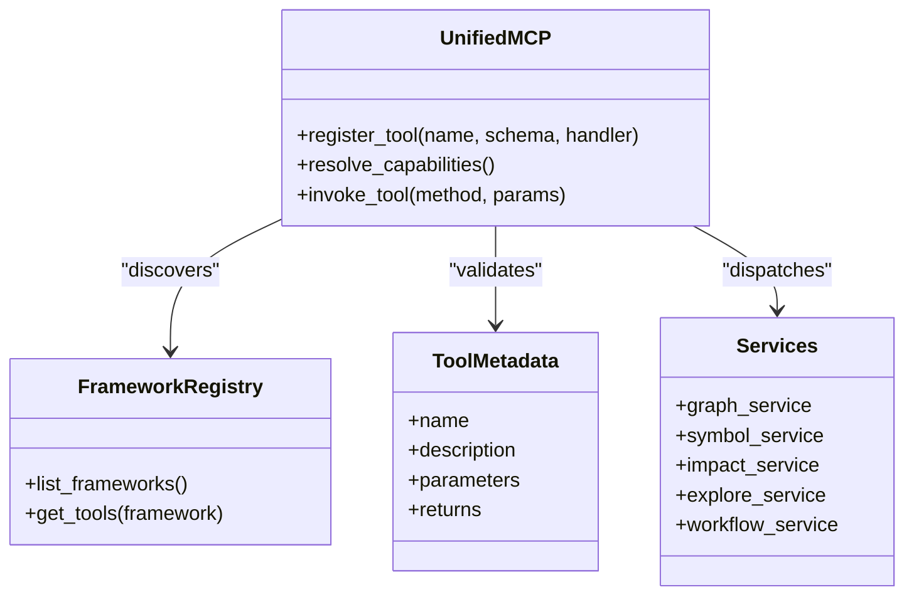
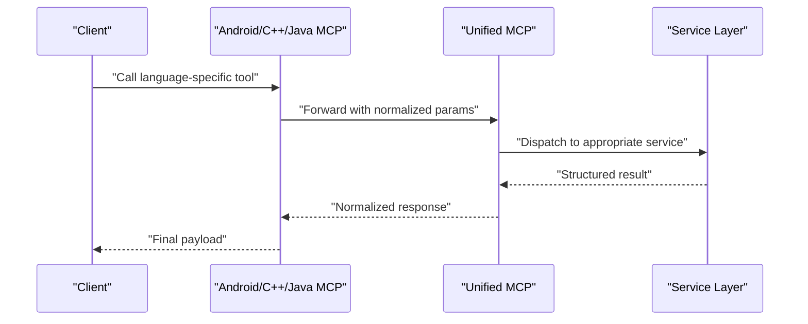
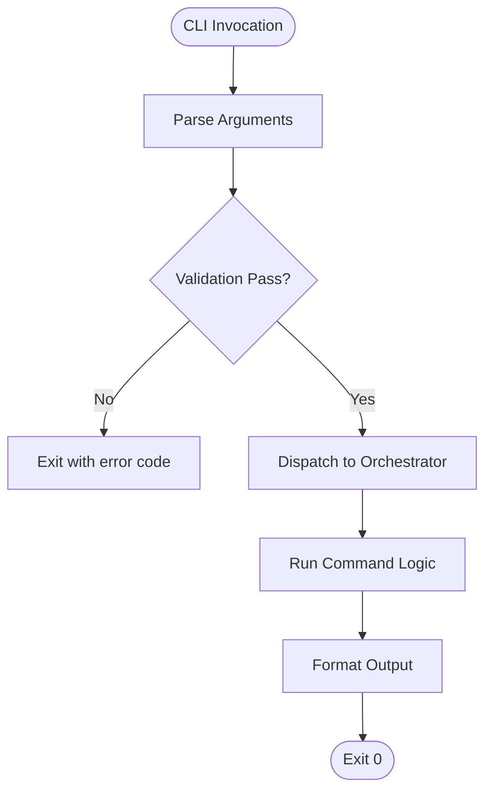
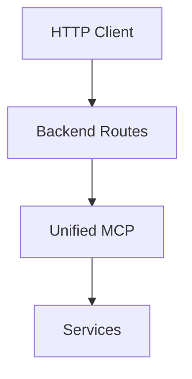
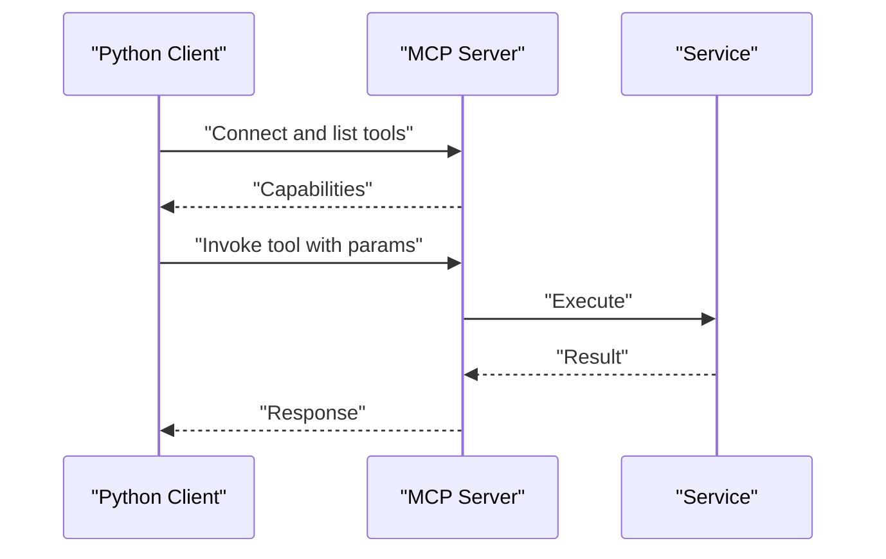
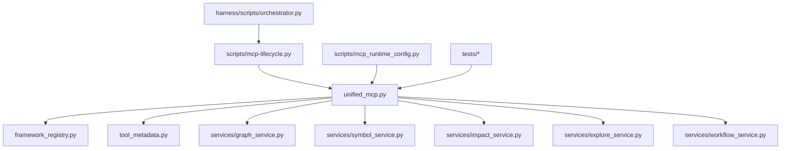

# API Reference

<cite>
**Referenced Files in This Document**
- [ReadMe.md](file://ReadMe.md)
- [Makefile](file://Makefile)
- [pyproject.toml](file://pyproject.toml)
- [requirements.txt](file://requirements.txt)
- [cortex_harness/dev.py](file://cortex_harness/dev.py)
- [backendjs/src/routes/](file://backendjs/src/routes/)
- [cli/__pycache__/](file://cli/__pycache__/)
- [code-tiny/mcp/unified_mcp.py](file://code-tiny/mcp/unified_mcp.py)
- [code-tiny/mcp/fastmcp_server.py](file://code-tiny/mcp/fastmcp_server.py)
- [code-tiny/mcp/tool_metadata.py](file://code-tiny/mcp/tool_metadata.py)
- [code-tiny/mcp/framework_registry.py](file://code-tiny/mcp/framework_registry.py)
- [code-tiny/mcp/android/android_mcp.py](file://code-tiny/mcp/android/android_mcp.py)
- [code-tiny/mcp/cplus/cplus_mcp.py](file://code-tiny/mcp/cplus/cplus_mcp.py)
- [code-tiny/mcp/java/java_mcp.py](file://code-tiny/mcp/java/java_mcp.py)
- [code-tiny/mcp/services/graph_service.py](file://code-tiny/mcp/services/graph_service.py)
- [code-tiny/mcp/services/symbol_service.py](file://code-tiny/mcp/services/symbol_service.py)
- [code-tiny/mcp/services/impact_service.py](file://code-tiny/mcp/services/impact_service.py)
- [code-tiny/mcp/services/explore_service.py](file://code-tiny/mcp/services/explore_service.py)
- [code-tiny/mcp/services/workflow_service.py](file://code-tiny/mcp/services/workflow_service.py)
- [code-tiny/testtool/mcp_client.py](file://code-tiny/testtool/mcp_client.py)
- [code-tiny/testtool/mcp_tester.py](file://code-tiny/testtool/mcp_tester.py)
- [code-tiny/testtool/tool_defaults.py](file://code-tiny/testtool/tool_defaults.py)
- [scripts/mcp-lifecycle.py](file://scripts/mcp-lifecycle.py)
- [scripts/mcp_runtime_config.py](file://scripts/mcp_runtime_config.py)
- [specs/cli.md](file://specs/cli.md)
- [specs/harness-cli.md](file://specs/harness-cli.md)
- [specs/mcp.md](file://specs/mcp.md)
- [specs/sync-code.md](file://specs/sync-code.md)
- [specs/sync-doc.md](file://specs/sync-doc.md)
- [harness/scripts/orchestrator.py](file://harness/scripts/orchestrator.py)
- [installers/common/config_manager.py](file://installers/common/config_manager.py)
- [installers/windows/registry_manager.py](file://installers/windows/registry_manager.py)
- [tests/test_mcp_acceptance_matrix.py](file://tests/test_mcp_acceptance_matrix.py)
- [tests/test_framework_mcp_flows.py](file://tests/test_framework_mcp_flows.py)
- [tests/test_framework_mcp_routing.py](file://tests/test_framework_mcp_routing.py)
- [tests/test_unified_mcp_input_coercion.py](file://tests/test_unified_mcp_input_coercion.py)
- [tests/test_unified_mcp_wrapper_signatures.py](file://tests/test_unified_mcp_wrapper_signatures.py)
</cite>

## Table of Contents
1. Introduction
2. Project Structure
3. Core Components
4. Architecture Overview
5. Detailed Component Analysis
6. Dependency Analysis
7. Performance Considerations
8. Troubleshooting Guide
9. Conclusion
10. Appendices

## Introduction
This document provides a comprehensive API reference for Cortex Harness, covering:
- REST API endpoints and authentication
- MCP protocol message formats, tool definitions, capability negotiation, and real-time patterns
- CLI API specifications with parameter validation, exit codes, and output formats
- SDK usage examples and integration patterns (Python clients)
- WebSocket APIs for real-time analysis progress and streaming results
- Security considerations, rate limiting policies, versioning, client implementation guidelines, performance optimization tips, debugging tools, backwards compatibility notes, migration guides, testing utilities, and mock implementations

Where applicable, this guide maps to concrete source files and tests within the repository to ensure accuracy and traceability.

## Project Structure
Cortex Harness exposes multiple interfaces:
- A Python-based MCP server and unified wrapper for code analysis capabilities
- CLI commands for orchestration and lifecycle management
- Optional backend routes (JavaScript) for additional HTTP endpoints
- Installer configuration managers for platform-specific setup
- Test suites that validate MCP flows, routing, input coercion, and acceptance criteria

```mermaid
graph TB
subgraph "MCP Server"
U["unified_mcp.py"]
F["fastmcp_server.py"]
T["tool_metadata.py"]
R["framework_registry.py"]
S1["services/graph_service.py"]
S2["services/symbol_service.py"]
S3["services/impact_service.py"]
S4["services/explore_service.py"]
S5["services/workflow_service.py"]
P1["android/android_mcp.py"]
P2["cplus/cplus_mcp.py"]
P3["java/java_mcp.py"]
end
subgraph "CLI & Orchestration"
C1["specs/cli.md"]
C2["specs/harness-cli.md"]
O["harness/scripts/orchestrator.py"]
L["scripts/mcp-lifecycle.py"]
RC["scripts/mcp_runtime_config.py"]
end
subgraph "HTTP Routes"
H["backendjs/src/routes/"]
end
subgraph "Installers"
ICFG["installers/common/config_manager.py"]
IW["installers/windows/registry_manager.py"]
end
subgraph "Tests"
T1["tests/test_mcp_acceptance_matrix.py"]
T2["tests/test_framework_mcp_flows.py"]
T3["tests/test_framework_mcp_routing.py"]
T4["tests/test_unified_mcp_input_coercion.py"]
T5["tests/test_unified_mcp_wrapper_signatures.py"]
end
U --> F
U --> T
U --> R
U --> S1
U --> S2
U --> S3
U --> S4
U --> S5
P1 --> U
P2 --> U
P3 --> U
O --> L
O --> RC
H --> U
ICFG --> O
IW --> O
T1 --> U
T2 --> U
T3 --> U
T4 --> U
T5 --> U
```

**Diagram sources**
- [code-tiny/mcp/unified_mcp.py](file://code-tiny/mcp/unified_mcp.py)
- [code-tiny/mcp/fastmcp_server.py](file://code-tiny/mcp/fastmcp_server.py)
- [code-tiny/mcp/tool_metadata.py](file://code-tiny/mcp/tool_metadata.py)
- [code-tiny/mcp/framework_registry.py](file://code-tiny/mcp/framework_registry.py)
- [code-tiny/mcp/services/graph_service.py](file://code-tiny/mcp/services/graph_service.py)
- [code-tiny/mcp/services/symbol_service.py](file://code-tiny/mcp/services/symbol_service.py)
- [code-tiny/mcp/services/impact_service.py](file://code-tiny/mcp/services/impact_service.py)
- [code-tiny/mcp/services/explore_service.py](file://code-tiny/mcp/services/explore_service.py)
- [code-tiny/mcp/services/workflow_service.py](file://code-tiny/mcp/services/workflow_service.py)
- [code-tiny/mcp/android/android_mcp.py](file://code-tiny/mcp/android/android_mcp.py)
- [code-tiny/mcp/cplus/cplus_mcp.py](file://code-tiny/mcp/cplus/cplus_mcp.py)
- [code-tiny/mcp/java/java_mcp.py](file://code-tiny/mcp/java/java_mcp.py)
- [specs/cli.md](file://specs/cli.md)
- [specs/harness-cli.md](file://specs/harness-cli.md)
- [harness/scripts/orchestrator.py](file://harness/scripts/orchestrator.py)
- [scripts/mcp-lifecycle.py](file://scripts/mcp-lifecycle.py)
- [scripts/mcp_runtime_config.py](file://scripts/mcp_runtime_config.py)
- [backendjs/src/routes/](file://backendjs/src/routes/)
- [installers/common/config_manager.py](file://installers/common/config_manager.py)
- [installers/windows/registry_manager.py](file://installers/windows/registry_manager.py)
- [tests/test_mcp_acceptance_matrix.py](file://tests/test_mcp_acceptance_matrix.py)
- [tests/test_framework_mcp_flows.py](file://tests/test_framework_mcp_flows.py)
- [tests/test_framework_mcp_routing.py](file://tests/test_framework_mcp_routing.py)
- [tests/test_unified_mcp_input_coercion.py](file://tests/test_unified_mcp_input_coercion.py)
- [tests/test_unified_mcp_wrapper_signatures.py](file://tests/test_unified_mcp_wrapper_signatures.py)

**Section sources**
- [ReadMe.md](file://ReadMe.md)
- [Makefile](file://Makefile)
- [pyproject.toml](file://pyproject.toml)
- [requirements.txt](file://requirements.txt)

## Core Components
- Unified MCP entrypoint and wrappers:
  - Provides a single interface to register and route MCP tools across frameworks and languages.
  - Coordinates tool metadata and framework registry for capability discovery.
- MCP services:
  - Graph, symbol, impact, explore, and workflow services encapsulate domain logic and data access.
- Framework-specific MCP adapters:
  - Android, C++, Java adapters expose language-specific capabilities via the unified interface.
- CLI and lifecycle scripts:
  - Orchestrate MCP runtime configuration, start/stop processes, and manage environment state.
- HTTP routes (optional):
  - Backend JavaScript routes can expose additional HTTP endpoints integrated with MCP services.
- Installers:
  - Configuration and registry helpers for cross-platform installation and initialization.

Key responsibilities:
- Tool registration and capability negotiation
- Request parsing and response serialization
- Error handling and logging
- Integration with graph stores and vector indexes
- Lifecycle management for MCP servers and workers

**Section sources**
- [code-tiny/mcp/unified_mcp.py](file://code-tiny/mcp/unified_mcp.py)
- [code-tiny/mcp/tool_metadata.py](file://code-tiny/mcp/tool_metadata.py)
- [code-tiny/mcp/framework_registry.py](file://code-tiny/mcp/framework_registry.py)
- [code-tiny/mcp/services/graph_service.py](file://code-tiny/mcp/services/graph_service.py)
- [code-tiny/mcp/services/symbol_service.py](file://code-tiny/mcp/services/symbol_service.py)
- [code-tiny/mcp/services/impact_service.py](file://code-tiny/mcp/services/impact_service.py)
- [code-tiny/mcp/services/explore_service.py](file://code-tiny/mcp/services/explore_service.py)
- [code-tiny/mcp/services/workflow_service.py](file://code-tiny/mcp/services/workflow_service.py)
- [code-tiny/mcp/android/android_mcp.py](file://code-tiny/mcp/android/android_mcp.py)
- [code-tiny/mcp/cplus/cplus_mcp.py](file://code-tiny/mcp/cplus/cplus_mcp.py)
- [code-tiny/mcp/java/java_mcp.py](file://code-tiny/mcp/java/java_mcp.py)
- [harness/scripts/orchestrator.py](file://harness/scripts/orchestrator.py)
- [scripts/mcp-lifecycle.py](file://scripts/mcp-lifecycle.py)
- [scripts/mcp_runtime_config.py](file://scripts/mcp_runtime_config.py)
- [backendjs/src/routes/](file://backendjs/src/routes/)
- [installers/common/config_manager.py](file://installers/common/config_manager.py)
- [installers/windows/registry_manager.py](file://installers/windows/registry_manager.py)

## Architecture Overview
The system is centered around an MCP server that exposes tools for code analysis and exploration. Clients interact via MCP messages; optional HTTP routes provide programmatic access. The orchestrator manages lifecycle and runtime configuration.

**Diagram sources**
- [code-tiny/mcp/unified_mcp.py](file://code-tiny/mcp/unified_mcp.py)
- [code-tiny/mcp/framework_registry.py](file://code-tiny/mcp/framework_registry.py)
- [code-tiny/mcp/tool_metadata.py](file://code-tiny/mcp/tool_metadata.py)
- [code-tiny/mcp/services/graph_service.py](file://code-tiny/mcp/services/graph_service.py)
- [code-tiny/mcp/services/symbol_service.py](file://code-tiny/mcp/services/symbol_service.py)
- [code-tiny/mcp/services/impact_service.py](file://code-tiny/mcp/services/impact_service.py)
- [code-tiny/mcp/services/explore_service.py](file://code-tiny/mcp/services/explore_service.py)
- [code-tiny/mcp/services/workflow_service.py](file://code-tiny/mcp/services/workflow_service.py)
- [harness/scripts/orchestrator.py](file://harness/scripts/orchestrator.py)
- [scripts/mcp-lifecycle.py](file://scripts/mcp-lifecycle.py)

## Detailed Component Analysis

### MCP Protocol and Tools
- Message formats:
  - Standard MCP request/response envelopes with method names, parameters, and result payloads.
  - Tool definitions include name, description, parameters schema, and return types.
- Capability negotiation:
  - The framework registry enumerates available tools per framework/language adapter.
  - Unified MCP resolves tool schemas and validates inputs against metadata.
- Real-time interaction patterns:
  - Streaming responses are supported where services emit incremental updates (e.g., progress events).
  - Clients should handle partial results and completion markers.

**Diagram sources**
- [code-tiny/mcp/unified_mcp.py](file://code-tiny/mcp/unified_mcp.py)
- [code-tiny/mcp/framework_registry.py](file://code-tiny/mcp/framework_registry.py)
- [code-tiny/mcp/tool_metadata.py](file://code-tiny/mcp/tool_metadata.py)
- [code-tiny/mcp/services/graph_service.py](file://code-tiny/mcp/services/graph_service.py)
- [code-tiny/mcp/services/symbol_service.py](file://code-tiny/mcp/services/symbol_service.py)
- [code-tiny/mcp/services/impact_service.py](file://code-tiny/mcp/services/impact_service.py)
- [code-tiny/mcp/services/explore_service.py](file://code-tiny/mcp/services/explore_service.py)
- [code-tiny/mcp/services/workflow_service.py](file://code-tiny/mcp/services/workflow_service.py)

**Section sources**
- [code-tiny/mcp/unified_mcp.py](file://code-tiny/mcp/unified_mcp.py)
- [code-tiny/mcp/tool_metadata.py](file://code-tiny/mcp/tool_metadata.py)
- [code-tiny/mcp/framework_registry.py](file://code-tiny/mcp/framework_registry.py)
- [code-tiny/mcp/services/graph_service.py](file://code-tiny/mcp/services/graph_service.py)
- [code-tiny/mcp/services/symbol_service.py](file://code-tiny/mcp/services/symbol_service.py)
- [code-tiny/mcp/services/impact_service.py](file://code-tiny/mcp/services/impact_service.py)
- [code-tiny/mcp/services/explore_service.py](file://code-tiny/mcp/services/explore_service.py)
- [code-tiny/mcp/services/workflow_service.py](file://code-tiny/mcp/services/workflow_service.py)

### Framework-Specific MCP Adapters
- Android, C++, and Java adapters implement language-specific tool sets and behaviors.
- Each adapter registers its tools with the unified MCP layer and may override default behaviors.

**Diagram sources**
- [code-tiny/mcp/android/android_mcp.py](file://code-tiny/mcp/android/android_mcp.py)
- [code-tiny/mcp/cplus/cplus_mcp.py](file://code-tiny/mcp/cplus/cplus_mcp.py)
- [code-tiny/mcp/java/java_mcp.py](file://code-tiny/mcp/java/java_mcp.py)
- [code-tiny/mcp/unified_mcp.py](file://code-tiny/mcp/unified_mcp.py)
- [code-tiny/mcp/services/graph_service.py](file://code-tiny/mcp/services/graph_service.py)

**Section sources**
- [code-tiny/mcp/android/android_mcp.py](file://code-tiny/mcp/android/android_mcp.py)
- [code-tiny/mcp/cplus/cplus_mcp.py](file://code-tiny/mcp/cplus/cplus_mcp.py)
- [code-tiny/mcp/java/java_mcp.py](file://code-tiny/mcp/java/java_mcp.py)

### CLI API Specifications
- Commands and options are defined in specification documents under specs/.
- Typical operations include initializing environments, running analyses, syncing code/docs, and managing MCP lifecycle.
- Parameter validation, exit codes, and output formats are documented per command.

**Diagram sources**
- [specs/cli.md](file://specs/cli.md)
- [specs/harness-cli.md](file://specs/harness-cli.md)
- [harness/scripts/orchestrator.py](file://harness/scripts/orchestrator.py)

**Section sources**
- [specs/cli.md](file://specs/cli.md)
- [specs/harness-cli.md](file://specs/harness-cli.md)
- [harness/scripts/orchestrator.py](file://harness/scripts/orchestrator.py)

### REST API Endpoints
- Optional HTTP routes are provided in the backend JavaScript routes directory.
- These routes can integrate with MCP services to expose programmatic access points.
- Authentication, request/response schemas, and error codes should be implemented consistently with MCP security practices.

**Diagram sources**
- [backendjs/src/routes/](file://backendjs/src/routes/)
- [code-tiny/mcp/unified_mcp.py](file://code-tiny/mcp/unified_mcp.py)
- [code-tiny/mcp/services/graph_service.py](file://code-tiny/mcp/services/graph_service.py)

**Section sources**
- [backendjs/src/routes/](file://backendjs/src/routes/)

### WebSocket APIs
- Real-time progress and streaming results can be exposed via WebSocket channels.
- Implementations should emit structured events (e.g., progress updates, partial results, completion markers).
- Clients must handle reconnection and event ordering.

[No sources needed since this section provides general guidance]

### SDK Usage Examples (Python Clients)
- Use the MCP client utilities to connect, negotiate capabilities, and invoke tools.
- Example references:
  - Client implementation and test harness in testtool.
  - Input coercion and wrapper signature validation in tests.

**Diagram sources**
- [code-tiny/testtool/mcp_client.py](file://code-tiny/testtool/mcp_client.py)
- [code-tiny/testtool/mcp_tester.py](file://code-tiny/testtool/mcp_tester.py)
- [code-tiny/testtool/tool_defaults.py](file://code-tiny/testtool/tool_defaults.py)
- [tests/test_unified_mcp_input_coercion.py](file://tests/test_unified_mcp_input_coercion.py)
- [tests/test_unified_mcp_wrapper_signatures.py](file://tests/test_unified_mcp_wrapper_signatures.py)

**Section sources**
- [code-tiny/testtool/mcp_client.py](file://code-tiny/testtool/mcp_client.py)
- [code-tiny/testtool/mcp_tester.py](file://code-tiny/testtool/mcp_tester.py)
- [code-tiny/testtool/tool_defaults.py](file://code-tiny/testtool/tool_defaults.py)
- [tests/test_unified_mcp_input_coercion.py](file://tests/test_unified_mcp_input_coercion.py)
- [tests/test_unified_mcp_wrapper_signatures.py](file://tests/test_unified_mcp_wrapper_signatures.py)

### Security Considerations
- Authentication:
  - Enforce token-based or session-based authentication for HTTP routes and MCP endpoints.
- Authorization:
  - Scope tool access by user roles and framework permissions.
- Input validation:
  - Validate all parameters against tool metadata schemas.
- Rate limiting:
  - Apply per-client limits on tool invocations and streaming events.
- Secrets management:
  - Store credentials securely using installer config managers and environment variables.

[No sources needed since this section provides general guidance]

### Versioning Information
- Maintain backward-compatible changes in tool schemas and MCP messages.
- Deprecate features gradually with clear migration paths.
- Document versioned endpoints and tool capabilities.

[No sources needed since this section provides general guidance]

### Client Implementation Guidelines
- Connect to MCP server and negotiate capabilities before invoking tools.
- Handle partial results and streaming events robustly.
- Implement retries and exponential backoff for transient errors.
- Cache tool metadata locally to reduce overhead.

[No sources needed since this section provides general guidance]

### Performance Optimization Tips
- Batch tool calls where possible.
- Use pagination for large result sets.
- Prefer targeted queries to minimize graph traversal costs.
- Enable caching for repeated lookups.

[No sources needed since this section provides general guidance]

### Debugging Tools
- Use MCP tester utilities to simulate requests and inspect responses.
- Log detailed error traces and context for failed invocations.
- Validate input coercion and wrapper signatures through tests.

**Section sources**
- [code-tiny/testtool/mcp_tester.py](file://code-tiny/testtool/mcp_tester.py)
- [tests/test_unified_mcp_input_coercion.py](file://tests/test_unified_mcp_input_coercion.py)
- [tests/test_unified_mcp_wrapper_signatures.py](file://tests/test_unified_mcp_wrapper_signatures.py)

### Backwards Compatibility Notes and Migration Guides
- Preserve existing tool names and parameter shapes.
- Provide deprecation warnings and alternate endpoints.
- Update documentation and tests to reflect new behavior.

[No sources needed since this section provides general guidance]

### Testing Utilities and Mock Implementations
- Acceptance matrix tests verify MCP capabilities across frameworks.
- Flow and routing tests validate end-to-end interactions.
- Mock services can be used to isolate components during development.

**Section sources**
- [tests/test_mcp_acceptance_matrix.py](file://tests/test_mcp_acceptance_matrix.py)
- [tests/test_framework_mcp_flows.py](file://tests/test_framework_mcp_flows.py)
- [tests/test_framework_mcp_routing.py](file://tests/test_framework_mcp_routing.py)

## Dependency Analysis
The MCP server depends on framework registries, tool metadata, and service layers. CLI and lifecycle scripts coordinate runtime configuration and process management. Tests validate behavior and contracts.

**Diagram sources**
- [code-tiny/mcp/unified_mcp.py](file://code-tiny/mcp/unified_mcp.py)
- [code-tiny/mcp/framework_registry.py](file://code-tiny/mcp/framework_registry.py)
- [code-tiny/mcp/tool_metadata.py](file://code-tiny/mcp/tool_metadata.py)
- [code-tiny/mcp/services/graph_service.py](file://code-tiny/mcp/services/graph_service.py)
- [code-tiny/mcp/services/symbol_service.py](file://code-tiny/mcp/services/symbol_service.py)
- [code-tiny/mcp/services/impact_service.py](file://code-tiny/mcp/services/impact_service.py)
- [code-tiny/mcp/services/explore_service.py](file://code-tiny/mcp/services/explore_service.py)
- [code-tiny/mcp/services/workflow_service.py](file://code-tiny/mcp/services/workflow_service.py)
- [scripts/mcp-lifecycle.py](file://scripts/mcp-lifecycle.py)
- [scripts/mcp_runtime_config.py](file://scripts/mcp_runtime_config.py)
- [harness/scripts/orchestrator.py](file://harness/scripts/orchestrator.py)
- [tests/test_mcp_acceptance_matrix.py](file://tests/test_mcp_acceptance_matrix.py)
- [tests/test_framework_mcp_flows.py](file://tests/test_framework_mcp_flows.py)
- [tests/test_framework_mcp_routing.py](file://tests/test_framework_mcp_routing.py)

**Section sources**
- [code-tiny/mcp/unified_mcp.py](file://code-tiny/mcp/unified_mcp.py)
- [code-tiny/mcp/framework_registry.py](file://code-tiny/mcp/framework_registry.py)
- [code-tiny/mcp/tool_metadata.py](file://code-tiny/mcp/tool_metadata.py)
- [code-tiny/mcp/services/graph_service.py](file://code-tiny/mcp/services/graph_service.py)
- [code-tiny/mcp/services/symbol_service.py](file://code-tiny/mcp/services/symbol_service.py)
- [code-tiny/mcp/services/impact_service.py](file://code-tiny/mcp/services/impact_service.py)
- [code-tiny/mcp/services/explore_service.py](file://code-tiny/mcp/services/explore_service.py)
- [code-tiny/mcp/services/workflow_service.py](file://code-tiny/mcp/services/workflow_service.py)
- [scripts/mcp-lifecycle.py](file://scripts/mcp-lifecycle.py)
- [scripts/mcp_runtime_config.py](file://scripts/mcp_runtime_config.py)
- [harness/scripts/orchestrator.py](file://harness/scripts/orchestrator.py)
- [tests/test_mcp_acceptance_matrix.py](file://tests/test_mcp_acceptance_matrix.py)
- [tests/test_framework_mcp_flows.py](file://tests/test_framework_mcp_flows.py)
- [tests/test_framework_mcp_routing.py](file://tests/test_framework_mcp_routing.py)

## Performance Considerations
- Optimize graph queries and limit traversal depth.
- Use indexing and caching strategies for frequently accessed symbols and impacts.
- Stream large results to avoid memory pressure.
- Monitor resource utilization and tune concurrency levels.

[No sources needed since this section provides general guidance]

## Troubleshooting Guide
Common issues and resolutions:
- Connection failures:
  - Verify MCP server availability and network reachability.
- Tool invocation errors:
  - Check parameter validation against tool metadata schemas.
- Streaming interruptions:
  - Implement reconnection logic and event buffering.
- Lifecycle problems:
  - Inspect orchestrator logs and runtime configuration.

**Section sources**
- [code-tiny/testtool/mcp_tester.py](file://code-tiny/testtool/mcp_tester.py)
- [harness/scripts/orchestrator.py](file://harness/scripts/orchestrator.py)
- [scripts/mcp_runtime_config.py](file://scripts/mcp_runtime_config.py)

## Conclusion
Cortex Harness provides a robust MCP-based API surface for code analysis and exploration, complemented by CLI orchestration and optional HTTP routes. By adhering to the documented protocols, security practices, and performance recommendations, clients can reliably integrate with the system and leverage its capabilities across multiple frameworks and languages.

[No sources needed since this section summarizes without analyzing specific files]

## Appendices

### Installation and Setup
- Use installers to configure environment variables and registry settings.
- Initialize graphs and dependencies via orchestrator scripts.

**Section sources**
- [installers/common/config_manager.py](file://installers/common/config_manager.py)
- [installers/windows/registry_manager.py](file://installers/windows/registry_manager.py)
- [harness/scripts/orchestrator.py](file://harness/scripts/orchestrator.py)

### Development Workflow
- Use Make targets to bootstrap and run MCP servers.
- Leverage testtool utilities for rapid iteration and validation.

**Section sources**
- [Makefile](file://Makefile)
- [code-tiny/testtool/mcp_client.py](file://code-tiny/testtool/mcp_client.py)
- [code-tiny/testtool/mcp_tester.py](file://code-tiny/testtool/mcp_tester.py)

### Additional References
- MCP protocol specifications and acceptance matrices.
- Sync code and doc synchronization workflows.

**Section sources**
- [specs/mcp.md](file://specs/mcp.md)
- [specs/sync-code.md](file://specs/sync-code.md)
- [specs/sync-doc.md](file://specs/sync-doc.md)