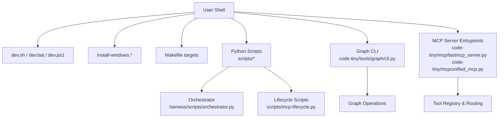
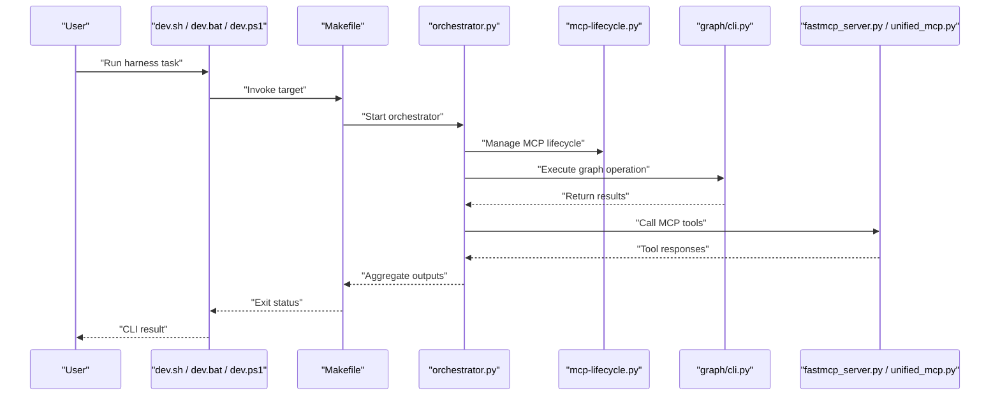
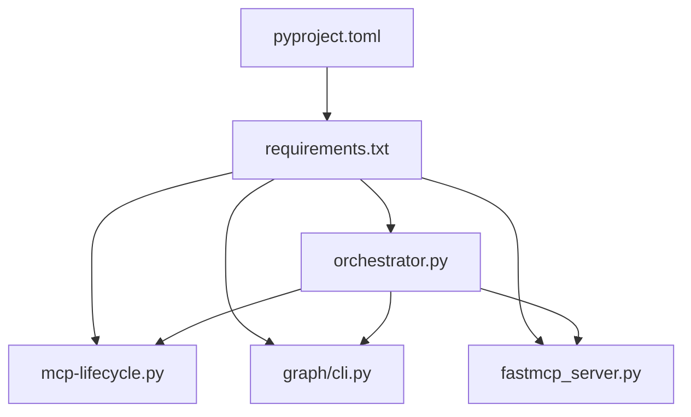

# Command Line Interface

<cite>
**Referenced Files in This Document**
- [ReadMe.md](file://ReadMe.md)
- [Makefile](file://Makefile)
- [pyproject.toml](file://pyproject.toml)
- [requirements.txt](file://requirements.txt)
- [dev.sh](file://dev.sh)
- [dev.bat](file://dev.bat)
- [dev.ps1](file://dev.ps1)
- [install-windows.bat](file://install-windows.bat)
- [install-windows.ps1](file://install-windows.ps1)
- [harness/scripts/orchestrator.py](file://harness/scripts/orchestrator.py)
- [harness/scripts/init.sh](file://harness/scripts/init.sh)
- [harness/scripts/verify.sh](file://harness/scripts/verify.sh)
- [harness/templates/config.yaml](file://harness/templates/config.yaml)
- [harness/templates/feature_template.json](file://harness/templates/feature_template.json)
- [harness/templates/session_template.json](file://harness/templates/session_template.json)
- [code-tiny/mcp/fastmcp_server.py](file://code-tiny/mcp/fastmcp_server.py)
- [code-tiny/mcp/unified_mcp.py](file://code-tiny/mcp/unified_mcp.py)
- [code-tiny/tools/graph/cli.py](file://code-tiny/tools/graph/cli.py)
- [scripts/mcp-lifecycle.py](file://scripts/mcp-lifecycle.py)
- [scripts/mcp-lifecycle.ps1](file://scripts/mcp-lifecycle.ps1)
- [scripts/mcp_runtime_config.py](file://scripts/mcp_runtime_config.py)
- [scripts/validate_retrieval.py](file://scripts/validate_retrieval.py)
- [doc-tiny/.env-sample](file://doc-tiny/.env-sample)
- [docs/specs/harness-cli.md](file://docs/specs/harness-cli.md)
</cite>

## Table of Contents
1. [Introduction](#introduction)
2. [Project Structure](#project-structure)
3. [Core Components](#core-components)
4. [Architecture Overview](#architecture-overview)
5. [Detailed Component Analysis](#detailed-component-analysis)
6. [Dependency Analysis](#dependency-analysis)
7. [Performance Considerations](#performance-considerations)
8. [Troubleshooting Guide](#troubleshooting-guide)
9. [Conclusion](#conclusion)
10. [Appendices](#appendices)

## Introduction
This document provides comprehensive CLI API documentation for Cortex Harness command-line interfaces. It covers available commands, parameter specifications, validation rules, exit codes, configuration options, output formats, environment variables, and integration patterns for automation and CI/CD pipelines. Practical examples are included for common workflows such as project initialization, code analysis, and query execution.

## Project Structure
Cortex Harness exposes CLI capabilities through multiple entry points:
- Top-level shell and PowerShell scripts for development and installation
- Python-based orchestrators and lifecycle scripts
- MCP server components that expose tooling via CLI-invoked processes
- Graph tools with a dedicated CLI module
- Configuration templates and environment samples

**Diagram sources**
- [dev.sh](file://dev.sh)
- [dev.bat](file://dev.bat)
- [dev.ps1](file://dev.ps1)
- [install-windows.bat](file://install-windows.bat)
- [install-windows.ps1](file://install-windows.ps1)
- [Makefile](file://Makefile)
- [harness/scripts/orchestrator.py](file://harness/scripts/orchestrator.py)
- [scripts/mcp-lifecycle.py](file://scripts/mcp-lifecycle.py)
- [code-tiny/tools/graph/cli.py](file://code-tiny/tools/graph/cli.py)
- [code-tiny/mcp/fastmcp_server.py](file://code-tiny/mcp/fastmcp_server.py)
- [code-tiny/mcp/unified_mcp.py](file://code-tiny/mcp/unified_mcp.py)

**Section sources**
- [ReadMe.md](file://ReadMe.md)
- [Makefile](file://Makefile)
- [pyproject.toml](file://pyproject.toml)
- [requirements.txt](file://requirements.txt)
- [dev.sh](file://dev.sh)
- [dev.bat](file://dev.bat)
- [dev.ps1](file://dev.ps1)
- [install-windows.bat](file://install-windows.bat)
- [install-windows.ps1](file://install-windows.ps1)

## Core Components
- Development and Installation Scripts
  - Cross-platform launchers (shell and PowerShell) to bootstrap the environment and run harness tasks.
  - Windows installers to register harness commands and dependencies.
- Orchestrator and Lifecycle Management
  - Central orchestrator script to coordinate analysis, sync, and MCP operations.
  - Lifecycle scripts to manage MCP server runtime and related tasks.
- Graph CLI
  - Dedicated CLI module for graph operations used by analysis and querying workflows.
- MCP Server Integration
  - FastMCP server entrypoints and unified wrapper to expose tools and capabilities via CLI-invoked processes.
- Configuration and Templates
  - YAML config template and JSON templates for features and sessions.
  - Environment sample file for required variables.

**Section sources**
- [harness/scripts/orchestrator.py](file://harness/scripts/orchestrator.py)
- [harness/scripts/init.sh](file://harness/scripts/init.sh)
- [harness/scripts/verify.sh](file://harness/scripts/verify.sh)
- [harness/templates/config.yaml](file://harness/templates/config.yaml)
- [harness/templates/feature_template.json](file://harness/templates/feature_template.json)
- [harness/templates/session_template.json](file://harness/templates/session_template.json)
- [code-tiny/mcp/fastmcp_server.py](file://code-tiny/mcp/fastmcp_server.py)
- [code-tiny/mcp/unified_mcp.py](file://code-tiny/mcp/unified_mcp.py)
- [code-tiny/tools/graph/cli.py](file://code-tiny/tools/graph/cli.py)
- [scripts/mcp-lifecycle.py](file://scripts/mcp-lifecycle.py)
- [scripts/mcp-lifecycle.ps1](file://scripts/mcp-lifecycle.ps1)
- [scripts/mcp_runtime_config.py](file://scripts/mcp_runtime_config.py)
- [scripts/validate_retrieval.py](file://scripts/validate_retrieval.py)
- [doc-tiny/.env-sample](file://doc-tiny/.env-sample)

## Architecture Overview
The CLI architecture centers on user-facing scripts and Python modules that orchestrate analysis, synchronization, and MCP interactions. The flow typically starts from platform-specific launchers or Makefile targets, which invoke orchestrators and lifecycle scripts. Graph operations and MCP servers are invoked as subcommands or separate processes.

**Diagram sources**
- [dev.sh](file://dev.sh)
- [dev.bat](file://dev.bat)
- [dev.ps1](file://dev.ps1)
- [Makefile](file://Makefile)
- [harness/scripts/orchestrator.py](file://harness/scripts/orchestrator.py)
- [scripts/mcp-lifecycle.py](file://scripts/mcp-lifecycle.py)
- [code-tiny/tools/graph/cli.py](file://code-tiny/tools/graph/cli.py)
- [code-tiny/mcp/fastmcp_server.py](file://code-tiny/mcp/fastmcp_server.py)
- [code-tiny/mcp/unified_mcp.py](file://code-tiny/mcp/unified_mcp.py)

## Detailed Component Analysis

### Development and Installation Scripts
- Purpose
  - Provide cross-platform entry points to initialize environments, install dependencies, and run harness tasks.
- Key Responsibilities
  - Resolve paths and environment variables
  - Invoke Python orchestrators and lifecycle scripts
  - Handle platform differences (Windows vs Unix-like)
- Typical Usage Patterns
  - Initialize project scaffolding
  - Start development server or analysis pipeline
  - Install Windows-specific integrations

**Section sources**
- [dev.sh](file://dev.sh)
- [dev.bat](file://dev.bat)
- [dev.ps1](file://dev.ps1)
- [install-windows.bat](file://install-windows.bat)
- [install-windows.ps1](file://install-windows.ps1)

### Makefile Targets
- Purpose
  - Standardize common tasks across platforms using make targets.
- Typical Targets
  - Initialization, analysis runs, verification, and cleanup.
- Integration
  - Calls into orchestrator and lifecycle scripts.

**Section sources**
- [Makefile](file://Makefile)

### Orchestrator
- Purpose
  - Central coordination point for analysis, synchronization, and MCP operations.
- Responsibilities
  - Parse CLI arguments
  - Manage subprocesses for graph and MCP components
  - Aggregate logs and results
  - Determine exit codes based on success/failure
- Common Workflows
  - Project initialization
  - Incremental sync
  - Query execution via MCP tools

**Section sources**
- [harness/scripts/orchestrator.py](file://harness/scripts/orchestrator.py)

### Lifecycle Scripts
- Purpose
  - Manage MCP server lifecycle and runtime configuration.
- Responsibilities
  - Start/stop MCP server processes
  - Load runtime configuration
  - Validate environment prerequisites
- Platform Support
  - Python and PowerShell variants for cross-platform compatibility

**Section sources**
- [scripts/mcp-lifecycle.py](file://scripts/mcp-lifecycle.py)
- [scripts/mcp-lifecycle.ps1](file://scripts/mcp-lifecycle.ps1)
- [scripts/mcp_runtime_config.py](file://scripts/mcp_runtime_config.py)

### Graph CLI
- Purpose
  - Provide command-line access to graph operations used by analysis and querying.
- Responsibilities
  - Parse graph-related parameters
  - Execute operations against configured graph provider
  - Return structured outputs suitable for scripting

**Section sources**
- [code-tiny/tools/graph/cli.py](file://code-tiny/tools/graph/cli.py)

### MCP Server Integration
- Purpose
  - Expose tools and capabilities via MCP protocol, invoked by CLI workflows.
- Components
  - FastMCP server entrypoint
  - Unified wrapper for capability routing
- Responsibilities
  - Register tools
  - Route requests to appropriate analyzers/services
  - Produce standardized responses

**Section sources**
- [code-tiny/mcp/fastmcp_server.py](file://code-tiny/mcp/fastmcp_server.py)
- [code-tiny/mcp/unified_mcp.py](file://code-tiny/mcp/unified_mcp.py)

### Configuration and Templates
- Purpose
  - Define harness behavior and provide reusable templates for projects and sessions.
- Files
  - YAML config template
  - Feature and session JSON templates
  - Environment sample for required variables
- Usage
  - Copy templates to project root
  - Adjust settings per environment
  - Reference environment variables in configs

**Section sources**
- [harness/templates/config.yaml](file://harness/templates/config.yaml)
- [harness/templates/feature_template.json](file://harness/templates/feature_template.json)
- [harness/templates/session_template.json](file://harness/templates/session_template.json)
- [doc-tiny/.env-sample](file://doc-tiny/.env-sample)

### Validation and Utilities
- Purpose
  - Provide utilities for validating retrieval and other post-processing steps.
- Responsibilities
  - Run checks against outputs
  - Report pass/fail statuses
  - Generate summary reports

**Section sources**
- [scripts/validate_retrieval.py](file://scripts/validate_retrieval.py)

## Dependency Analysis
Cortex Harness depends on:
- Python packages listed in requirements and project metadata
- External graph providers and MCP services
- Platform-specific tools for installation and lifecycle management

**Diagram sources**
- [pyproject.toml](file://pyproject.toml)
- [requirements.txt](file://requirements.txt)
- [harness/scripts/orchestrator.py](file://harness/scripts/orchestrator.py)
- [scripts/mcp-lifecycle.py](file://scripts/mcp-lifecycle.py)
- [code-tiny/tools/graph/cli.py](file://code-tiny/tools/graph/cli.py)
- [code-tiny/mcp/fastmcp_server.py](file://code-tiny/mcp/fastmcp_server.py)

**Section sources**
- [pyproject.toml](file://pyproject.toml)
- [requirements.txt](file://requirements.txt)

## Performance Considerations
- Prefer incremental sync where supported to reduce processing time.
- Use targeted scopes and filters to limit analysis breadth.
- Cache intermediate results when possible.
- Parallelize independent tasks via orchestrator concurrency controls.
- Monitor resource usage for graph operations and MCP calls.

[No sources needed since this section provides general guidance]

## Troubleshooting Guide
Common issues and resolutions:
- Environment setup failures
  - Verify Python version and virtual environment activation.
  - Ensure all dependencies are installed.
- MCP server startup errors
  - Check runtime configuration and environment variables.
  - Validate network connectivity if remote services are used.
- Graph operation timeouts
  - Increase timeouts in configuration.
  - Reduce scope or enable caching.
- Exit code interpretation
  - Zero indicates success; non-zero indicates failure.
  - Consult orchestrator logs for detailed error messages.

**Section sources**
- [harness/scripts/orchestrator.py](file://harness/scripts/orchestrator.py)
- [scripts/mcp-lifecycle.py](file://scripts/mcp-lifecycle.py)
- [scripts/mcp_runtime_config.py](file://scripts/mcp_runtime_config.py)

## Conclusion
Cortex Harness CLI provides a robust set of commands for project initialization, code analysis, and query execution. By leveraging orchestrators, lifecycle scripts, and MCP integration, users can automate complex workflows and integrate seamlessly into CI/CD pipelines. Proper configuration and environment setup are essential for reliable operation.

[No sources needed since this section summarizes without analyzing specific files]

## Appendices

### Command Reference Summary
- Development Launchers
  - dev.sh, dev.bat, dev.ps1: Bootstrap environment and run harness tasks.
- Installation Scripts
  - install-windows.bat, install-windows.ps1: Install harness on Windows.
- Makefile Targets
  - Standardized tasks for initialization, analysis, verification, and cleanup.
- Orchestrator
  - harness/scripts/orchestrator.py: Central CLI entry for analysis and sync workflows.
- Lifecycle Management
  - scripts/mcp-lifecycle.py, scripts/mcp-lifecycle.ps1: Manage MCP server runtime.
- Graph CLI
  - code-tiny/tools/graph/cli.py: Execute graph operations.
- MCP Server
  - code-tiny/mcp/fastmcp_server.py, code-tiny/mcp/unified_mcp.py: Expose tools via MCP.

**Section sources**
- [dev.sh](file://dev.sh)
- [dev.bat](file://dev.bat)
- [dev.ps1](file://dev.ps1)
- [install-windows.bat](file://install-windows.bat)
- [install-windows.ps1](file://install-windows.ps1)
- [Makefile](file://Makefile)
- [harness/scripts/orchestrator.py](file://harness/scripts/orchestrator.py)
- [scripts/mcp-lifecycle.py](file://scripts/mcp-lifecycle.py)
- [scripts/mcp-lifecycle.ps1](file://scripts/mcp-lifecycle.ps1)
- [code-tino/tools/graph/cli.py](file://code-tiny/tools/graph/cli.py)
- [code-tiny/mcp/fastmcp_server.py](file://code-tiny/mcp/fastmcp_server.py)
- [code-tiny/mcp/unified_mcp.py](file://code-tiny/mcp/unified_mcp.py)

### Configuration Options
- Config Template
  - harness/templates/config.yaml: Primary harness configuration.
- Feature and Session Templates
  - harness/templates/feature_template.json, harness/templates/session_template.json: Reusable structures for features and sessions.
- Environment Variables
  - doc-tiny/.env-sample: Sample variables for MCP and graph providers.

**Section sources**
- [harness/templates/config.yaml](file://harness/templates/config.yaml)
- [harness/templates/feature_template.json](file://harness/templates/feature_template.json)
- [harness/templates/session_template.json](file://harness/templates/session_template.json)
- [doc-tiny/.env-sample](file://doc-tiny/.env-sample)

### Practical Examples
- Project Initialization
  - Use development launcher to scaffold project and copy templates.
- Code Analysis
  - Invoke orchestrator with analysis targets; configure scope and filters.
- Query Execution
  - Use graph CLI to run queries; pipe results to validation utilities.

**Section sources**
- [harness/scripts/init.sh](file://harness/scripts/init.sh)
- [harness/scripts/verify.sh](file://harness/scripts/verify.sh)
- [harness/scripts/orchestrator.py](file://harness/scripts/orchestrator.py)
- [code-tiny/tools/graph/cli.py](file://code-tiny/tools/graph/cli.py)
- [scripts/validate_retrieval.py](file://scripts/validate_retrieval.py)

### Automation and CI/CD Integration
- Shell Scripting
  - Wrap orchestrator calls in CI jobs; capture exit codes and logs.
- PowerShell Automation
  - Use PowerShell lifecycle scripts for Windows-based pipelines.
- Batch Processing
  - Iterate over projects and invoke orchestrator with scoped configurations.

**Section sources**
- [scripts/mcp-lifecycle.py](file://scripts/mcp-lifecycle.py)
- [scripts/mcp-lifecycle.ps1](file://scripts/mcp-lifecycle.ps1)
- [Makefile](file://Makefile)

### Error Handling and Logging
- Exit Codes
  - Non-zero indicates failure; consult logs for details.
- Logging Options
  - Enable verbose logging in orchestrator and lifecycle scripts.
- Troubleshooting Steps
  - Validate environment variables and configuration files.
  - Check MCP server health and connectivity.

**Section sources**
- [harness/scripts/orchestrator.py](file://harness/scripts/orchestrator.py)
- [scripts/mcp-lifecycle.py](file://scripts/mcp-lifecycle.py)
- [scripts/mcp_runtime_config.py](file://scripts/mcp_runtime_config.py)

### Additional References
- Specification Documents
  - docs/specs/harness-cli.md: Official CLI specification and conventions.

**Section sources**
- [docs/specs/harness-cli.md](file://docs/specs/harness-cli.md)