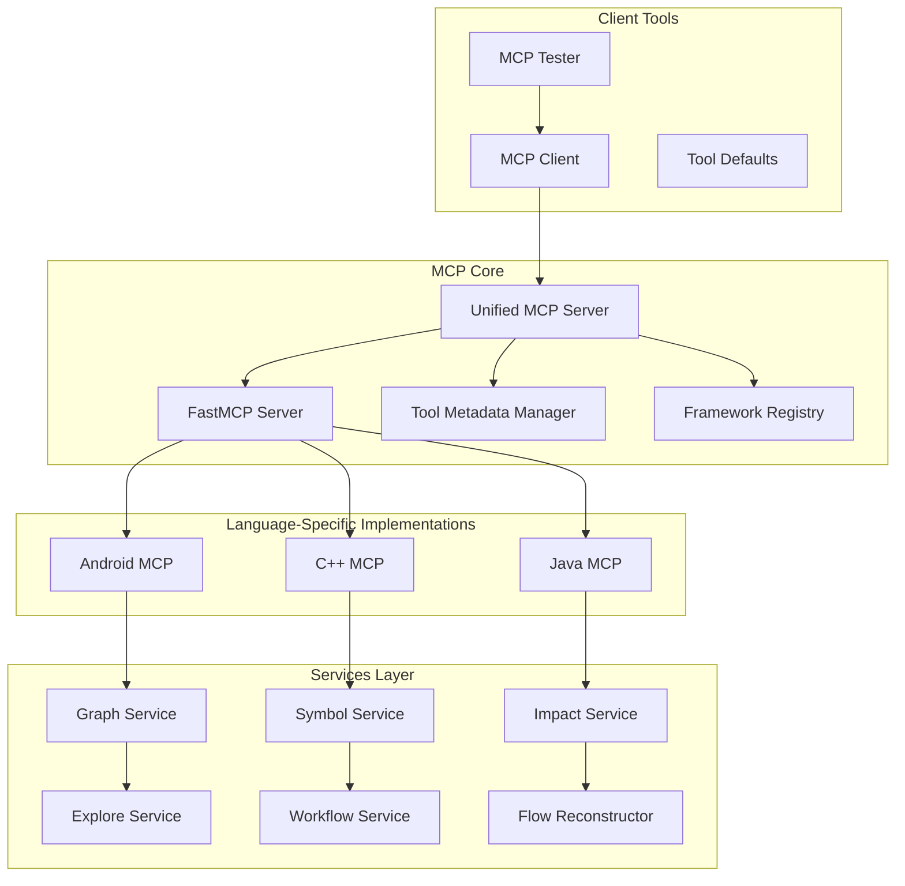
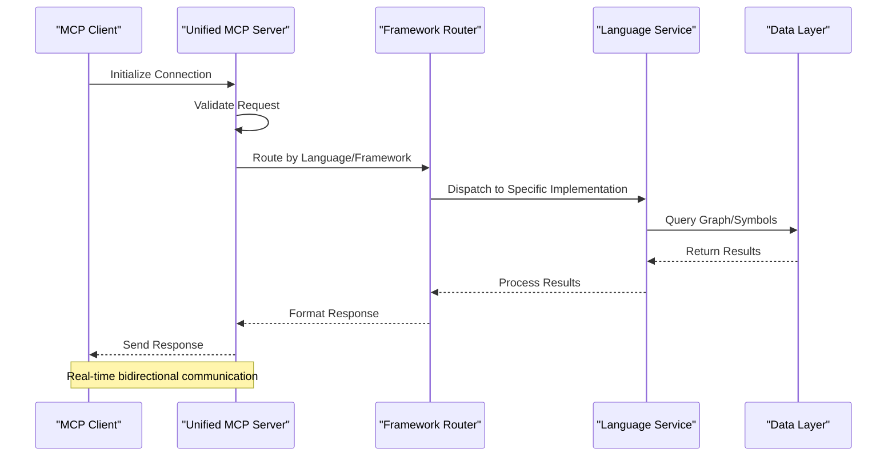
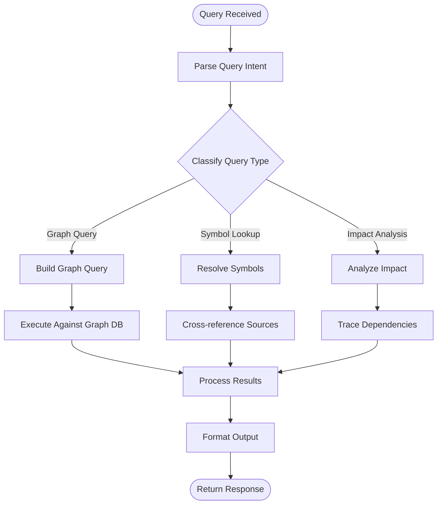
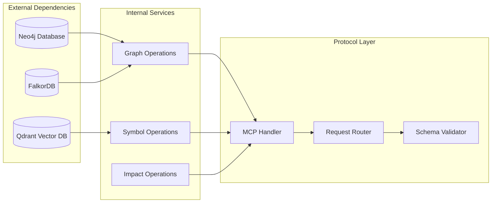

# Model Context Protocol

<cite>
**Referenced Files in This Document**
- [unified_mcp.py](file://code-tiny/mcp/unified_mcp.py)
- [fastmcp_server.py](file://code-tiny/mcp/fastmcp_server.py)
- [tool_metadata.py](file://code-tiny/mcp/tool_metadata.py)
- [framework_registry.py](file://code-tiny/mcp/framework_registry.py)
- [semantic_graph_expansion.py](file://code-tiny/mcp/semantic_graph_expansion.py)
- [android_mcp.py](file://code-tiny/mcp/android/android_mcp.py)
- [cplus_mcp.py](file://code-tiny/mcp/cplus/cplus_mcp.py)
- [java_mcp.py](file://code-tiny/mcp/java/java_mcp.py)
- [graph_service.py](file://code-tiny/mcp/services/graph_service.py)
- [symbol_service.py](file://code-tiny/mcp/services/symbol_service.py)
- [impact_service.py](file://code-tiny/mcp/services/impact_service.py)
- [explore_service.py](file://code-tiny/mcp/services/explore_service.py)
- [workflow_service.py](file://code-tiny/mcp/services/workflow_service.py)
- [flow_reconstructor.py](file://code-tiny/mcp/services/flow_reconstructor.py)
- [mcp_client.py](file://code-tiny/testtool/mcp_client.py)
- [mcp_tester.py](file://code-tiny/testtool/mcp_tester.py)
- [tool_defaults.py](file://code-tiny/testtool/tool_defaults.py)
- [mcp.md](file://docs/specs/mcp.md)
- [MCP_CAPABILITY_ACCEPTANCE_MATRIX.md](file://docs/MCP_CAPABILITY_ACCEPTANCE_MATRIX.md)
</cite>

## Table of Contents
1. [Introduction](#introduction)
2. [Project Structure](#project-structure)
3. [Core Components](#core-components)
4. [Architecture Overview](#architecture-overview)
5. [Detailed Component Analysis](#detailed-component-analysis)
6. [Dependency Analysis](#dependency-analysis)
7. [Performance Considerations](#performance-considerations)
8. [Troubleshooting Guide](#troubleshooting-guide)
9. [Conclusion](#conclusion)
10. [Appendices](#appendices)

## Introduction

The Model Context Protocol (MCP) is a standardized communication protocol designed to enable AI models to interact with external tools, services, and data sources through a consistent interface. This implementation provides a comprehensive framework for integrating AI capabilities with code analysis, semantic graph queries, and multi-language support across Android, C++, Java, and other programming environments.

The MCP implementation supports real-time interaction patterns, capability negotiation, tool registration, and parameter validation while maintaining backwards compatibility and providing robust error handling mechanisms.

## Project Structure

The MCP implementation follows a modular architecture with clear separation of concerns:

**Diagram sources**
- [unified_mcp.py](file://code-tiny/mcp/unified_mcp.py)
- [fastmcp_server.py](file://code-tiny/mcp/fastmcp_server.py)
- [tool_metadata.py](file://code-tiny/mcp/tool_metadata.py)
- [framework_registry.py](file://code-tiny/mcp/framework_registry.py)

**Section sources**
- [unified_mcp.py](file://code-tiny/mcp/unified_mcp.py)
- [fastmcp_server.py](file://code-tiny/mcp/fastmcp_server.py)

## Core Components

### Unified MCP Server
The unified MCP server serves as the central entry point for all MCP communications, providing a single interface for multiple language-specific implementations.

### FastMCP Server
A high-performance server implementation optimized for rapid request processing and concurrent connections.

### Tool Metadata Manager
Manages tool definitions, schemas, validation rules, and capability descriptions for all registered tools.

### Framework Registry
Maintains mappings between programming languages/frameworks and their corresponding MCP implementations.

**Section sources**
- [unified_mcp.py](file://code-tiny/mcp/unified_mcp.py)
- [fastmcp_server.py](file://code-tiny/mcp/fastmcp_server.py)
- [tool_metadata.py](file://code-tiny/mcp/tool_metadata.py)
- [framework_registry.py](file://code-tiny/mcp/framework_registry.py)

## Architecture Overview

The MCP architecture follows a layered approach with clear separation between protocol handling, business logic, and data access:

**Diagram sources**
- [unified_mcp.py](file://code-tiny/mcp/unified_mcp.py)
- [framework_registry.py](file://code-tiny/mcp/framework_registry.py)
- [graph_service.py](file://code-tiny/mcp/services/graph_service.py)

## Detailed Component Analysis

### Message Protocol Schema

The MCP protocol defines a comprehensive message format supporting various operation types:

#### Request/Response Structure
All MCP messages follow a consistent envelope format with metadata, payload, and correlation identifiers for proper request-response matching.

#### Tool Registration Schema
Tools are registered with detailed metadata including:
- Tool name and description
- Parameter schemas with validation rules
- Capability tags for filtering
- Version compatibility information
- Authentication requirements

#### Capability Negotiation
Clients and servers negotiate supported capabilities during connection establishment, ensuring compatibility before proceeding with operations.

**Section sources**
- [tool_metadata.py](file://code-tiny/mcp/tool_metadata.py)
- [mcp.md](file://docs/specs/mcp.md)

### Semantic Graph Operations

The MCP implementation provides extensive semantic graph query capabilities:

#### Graph Query Patterns
Support for complex graph traversals, pattern matching, and semantic searches across code repositories.

#### Symbol Resolution
Advanced symbol resolution with context-aware lookups, cross-references, and dependency tracking.

#### Impact Analysis
Comprehensive impact analysis for understanding change propagation and dependency relationships.

**Diagram sources**
- [graph_service.py](file://code-tiny/mcp/services/graph_service.py)
- [symbol_service.py](file://code-tiny/mcp/services/symbol_service.py)
- [impact_service.py](file://code-tiny/mcp/services/impact_service.py)

### Language-Specific Implementations

#### Android MCP
Specialized implementation for Android applications supporting Java/Kotlin code analysis, manifest parsing, and resource management.

#### C++ MCP
Comprehensive C++ analysis including header parsing, template instantiation, and cross-file dependency tracking.

#### Java MCP
Full-featured Java analysis with Spring framework support, annotation processing, and bytecode analysis capabilities.

**Section sources**
- [android_mcp.py](file://code-tiny/mcp/android/android_mcp.py)
- [cplus_mcp.py](file://code-tiny/mcp/cplus/cplus_mcp.py)
- [java_mcp.py](file://code-tiny/mcp/java/java_mcp.py)

### Service Layer Architecture

The service layer provides specialized functionality for different aspects of code analysis:

#### Graph Service
Handles graph database operations, node creation, relationship management, and complex graph queries.

#### Symbol Service
Manages symbol tables, scope resolution, type inference, and cross-reference generation.

#### Impact Service
Performs change impact analysis, dependency tracing, and risk assessment for code modifications.

#### Explore Service
Provides exploratory analysis capabilities including code navigation, refactoring suggestions, and quality metrics.

#### Workflow Service
Orchestrates complex analysis workflows, manages pipeline execution, and coordinates multiple analysis stages.

#### Flow Reconstructor
Reconstructs control flow graphs, data flow analysis, and execution paths from compiled or interpreted code.

**Section sources**
- [graph_service.py](file://code-tiny/mcp/services/graph_service.py)
- [symbol_service.py](file://code-tiny/mcp/services/symbol_service.py)
- [impact_service.py](file://code-tiny/mcp/services/impact_service.py)
- [explore_service.py](file://code-tiny/mcp/services/explore_service.py)
- [workflow_service.py](file://code-tiny/mcp/services/workflow_service.py)
- [flow_reconstructor.py](file://code-tiny/mcp/services/flow_reconstructor.py)

## Dependency Analysis

The MCP implementation maintains clear dependency boundaries and follows SOLID principles:

**Diagram sources**
- [graph_service.py](file://code-tiny/mcp/services/graph_service.py)
- [symbol_service.py](file://code-tiny/mcp/services/symbol_service.py)
- [impact_service.py](file://code-tiny/mcp/services/impact_service.py)

**Section sources**
- [framework_registry.py](file://code-tiny/mcp/framework_registry.py)
- [semantic_graph_expansion.py](file://code-tiny/mcp/semantic_graph_expansion.py)

## Performance Considerations

### Connection Management
- Implement connection pooling for database backends
- Use async/await patterns for I/O operations
- Apply circuit breaker patterns for external service calls
- Implement graceful degradation when dependencies fail

### Query Optimization
- Cache frequently accessed graph structures
- Use pagination for large result sets
- Implement query optimization and indexing strategies
- Apply result deduplication and aggregation

### Resource Management
- Monitor memory usage for large codebases
- Implement streaming responses for long-running operations
- Use background processing for heavy computations
- Apply rate limiting and throttling mechanisms

## Troubleshooting Guide

### Common Issues and Solutions

#### Connection Problems
- Verify network connectivity and firewall settings
- Check authentication credentials and permissions
- Validate endpoint URLs and port configurations
- Review connection timeout and retry policies

#### Query Performance Issues
- Analyze query execution plans and identify bottlenecks
- Optimize database indexes and schema design
- Implement query caching strategies
- Monitor resource utilization and scale accordingly

#### Tool Registration Failures
- Validate tool schemas against defined contracts
- Check capability compatibility between client and server
- Review authentication and authorization configurations
- Verify tool availability and health status

**Section sources**
- [mcp_client.py](file://code-tiny/testtool/mcp_client.py)
- [mcp_tester.py](file://code-tiny/testtool/mcp_tester.py)
- [tool_defaults.py](file://code-tiny/testtool/tool_defaults.py)

## Conclusion

The Model Context Protocol implementation provides a robust, scalable foundation for AI model integration with code analysis capabilities. The modular architecture ensures maintainability and extensibility while the comprehensive tooling ecosystem supports diverse programming languages and frameworks.

Key strengths include:
- Standardized protocol interface for consistent interactions
- Extensible framework for adding new language support
- High-performance query engine for complex code analysis
- Comprehensive error handling and debugging capabilities
- Strong focus on backwards compatibility and versioning

Future enhancements should focus on improving query performance, expanding language support, and enhancing the developer experience through better tooling and documentation.

## Appendices

### API Reference

#### Core MCP Operations
- Connection establishment and lifecycle management
- Tool discovery and capability negotiation
- Request/response message formats
- Error handling and status codes
- Authentication and authorization flows

#### Tool Categories
- Code analysis tools (syntax, semantics, dependencies)
- Graph query tools (traversal, pattern matching, analytics)
- Impact analysis tools (change detection, risk assessment)
- Refactoring tools (automated improvements, migrations)

**Section sources**
- [MCP_CAPABILITY_ACCEPTANCE_MATRIX.md](file://docs/MCP_CAPABILITY_ACCEPTANCE_MATRIX.md)
- [mcp.md](file://docs/specs/mcp.md)