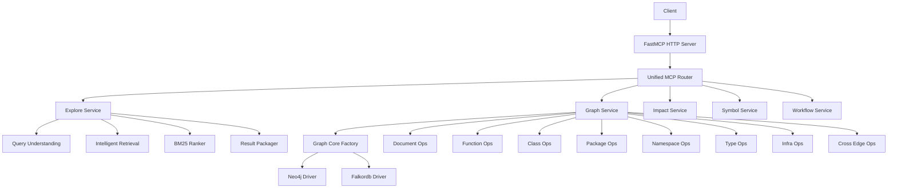
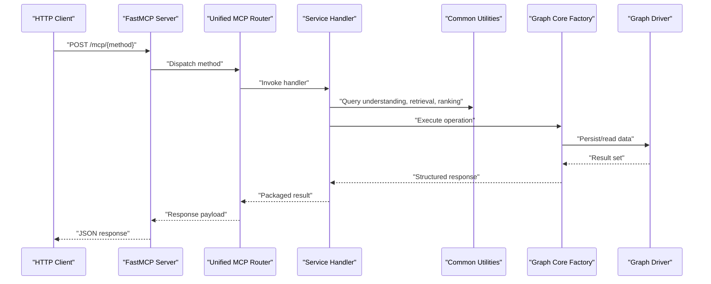
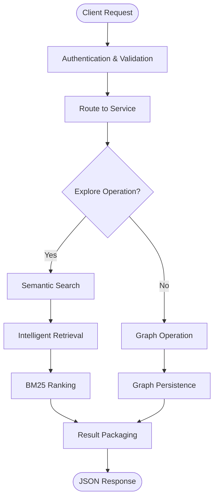
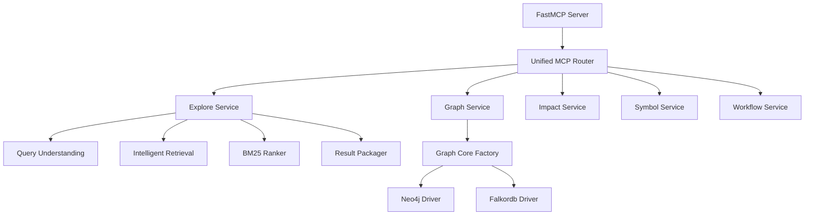

# REST API

<cite>
**Referenced Files in This Document**
- [ReadMe.md](file://ReadMe.md)
- [Makefile](file://Makefile)
- [pyproject.toml](file://pyproject.toml)
- [requirements.txt](file://requirements.txt)
- [cortex_harness/dev.py](file://cortex_harness/dev.py)
- [harness/scripts/orchestrator.py](file://harness/scripts/orchestrator.py)
- [harness/scripts/init.sh](file://harness/scripts/init.sh)
- [harness/templates/config.yaml](file://harness/templates/config.yaml)
- [backendjs/src/routes/](file://backendjs/src/routes/)
- [code-tiny/mcp/fastmcp_server.py](file://code-tiny/mcp/fastmcp_server.py)
- [code-tiny/mcp/unified_mcp.py](file://code-tiny/mcp/unified_mcp.py)
- [code-tiny/mcp/framework_registry.py](file://code-tiny/mcp/framework_registry.py)
- [code-tiny/mcp/tool_metadata.py](file://code-tiny/mcp/tool_metadata.py)
- [code-tiny/mcp/services/explore_service.py](file://code-tiny/mcp/services/explore_service.py)
- [code-tiny/mcp/services/graph_service.py](file://code-tiny/mcp/services/graph_service.py)
- [code-tiny/mcp/services/impact_service.py](file://code-tiny/mcp/services/impact_service.py)
- [code-tiny/mcp/services/symbol_service.py](file://code-tiny/mcp/services/symbol_service.py)
- [code-tiny/mcp/services/workflow_service.py](file://code-tiny/mcp/services/workflow_service.py)
- [code-tiny/mcp/services/flow_reconstructor.py](file://code-tiny/mcp/services/flow_reconstructor.py)
- [code-tiny/mcp/semantic_graph_expansion.py](file://code-tiny/mcp/semantic_graph_expansion.py)
- [code-tiny/tools/common/harness_config.py](file://code-tiny/tools/common/harness_config.py)
- [code-tiny/tools/graph/core/factory.py](file://code-tiny/tools/graph/core/factory.py)
- [code-tiny/tools/graph/driver/neo4j_driver.py](file://code-tiny/tools/graph/driver/neo4j_driver.py)
- [code-tiny/tools/graph/driver/falkordb_driver.py](file://code-tiny/tools/graph/driver/falkordb_driver.py)
- [code-tiny/tools/graph/operations/document_ops.py](file://code-tiny/tools/graph/operations/document_ops.py)
- [code-tiny/tools/graph/operations/function_ops.py](file://code-tiny/tools/graph/operations/function_ops.py)
- [code-tiny/tools/graph/operations/class_ops.py](file://code-tiny/tools/graph/operations/class_ops.py)
- [code-tiny/tools/graph/operations/package_ops.py](file://code-tiny/tools/graph/operations/package_ops.py)
- [code-tiny/tools/graph/operations/namespace_ops.py](file://code-tiny/tools/graph/operations/namespace_ops.py)
- [code-tiny/tools/graph/operations/type_ops.py](file://code-tiny/tools/graph/operations/type_ops.py)
- [code-tiny/tools/graph/operations/infra_ops.py](file://code-tiny/tools/graph/operations/infra_ops.py)
- [code-tiny/tools/graph/operations/cross_edge_ops.py](file://code-tiny/tools/graph/operations/cross_edge_ops.py)
- [code-tiny/tools/graph/writer/database_schema_writer.py](file://code-tiny/tools/graph/writer/database_schema_writer.py)
- [code-tiny/tools/graph/writer/language_writer.py](file://code-tiny/tools/graph/writer/language_writer.py)
- [code-tiny/tools/graph/writer/web_framework_writer.py](file://code-tiny/tools/graph/writer/web_framework_writer.py)
- [code-tiny/tools/graph/writer/aspnet_writer.py](file://code-tiny/tools/graph/writer/aspnet_writer.py)
- [code-tiny/tools/graph/writer/mybatis_writer.py](file://code-tiny/tools/graph/writer/mybatis_writer.py)
- [code-tiny/tools/graph/writer/servlet_jsp_writer.py](file://code-tiny/tools/graph/writer/servlet_jsp_writer.py)
- [code-tiny/tools/graph/writer/spring_writer.py](file://code-tiny/tools/graph/writer/spring_writer.py)
- [code-tiny/tools/common/analyzer_cache.py](file://code-tiny/tools/common/analyzer_cache.py)
- [code-tiny/tools/common/incremental_sync_state.py](file://code-tiny/tools/common/incremental_sync_state.py)
- [code-tiny/tools/common/source_inventory.py](file://code-tiny/tools/common/source_inventory.py)
- [code-tiny/tools/common/query_understanding.py](file://code-tiny/tools/common/query_understanding.py)
- [code-tiny/tools/common/intelligent_retrieval.py](file://code-tiny/tools/common/intelligent_retrieval.py)
- [code-tiny/tools/common/bm25_ranker.py](file://code-tiny/tools/common/bm25_ranker.py)
- [code-tiny/tools/common/retrieval_scorer.py](file://code-tiny/tools/common/retrieval_scorer.py)
- [code-tiny/tools/common/result_packager.py](file://code-tiny/tools/common/result_packager.py)
- [code-tiny/tools/common/api_match_engine.py](file://code-tiny/tools/common/api_match_engine.py)
- [code-tiny/tools/common/message_scan.py](file://code-tiny/tools/common/message_scan.py)
- [code-tiny/tools/common/workflow_classifier.py](file://code-tiny/tools/common/workflow_classifier.py)
- [code-tiny/tools/common/workflow_impact_scorer.py](file://code-tiny/tools/common/workflow_impact_scorer.py)
- [code-tiny/tools/common/graph_expander.py](file://code-tiny/tools/common/graph_expander.py)
- [code-tiny/tools/common/confidence_scorer.py](file://code-tiny/tools/common/confidence_scorer.py)
- [code-tiny/tools/common/signal_normalizer.py](file://code-tiny/tools/common/signal_normalizer.py)
- [code-tiny/tools/common/frontend_relationship_extractor.py](file://code-tiny/tools/common/frontend_relationship_extractor.py)
- [code-tiny/tools/common/git_diff.py](file://code-tiny/tools/common/git_diff.py)
- [code-tiny/tools/common/cloc_stats.py](file://code-tiny/tools/common/cloc_stats.py)
- [code-tiny/tools/common/llm_summary.py](file://code-tiny/tools/common/llm_summary.py)
- [code-tiny/tools/common/react_role_classifier.py](file://code-tiny/tools/common/react_role_classifier.py)
- [code-tiny/tools/common/url_normalizer.py](file://code-tiny/tools/common/url_normalizer.py)
- [code-tiny/tools/common/sync_scope.py](file://code-tiny/tools/common/sync_scope.py)
- [code-tiny/tools/common/primary_vector_sync.py](file://code-tiny/tools/common/primary_vector_sync.py)
- [code-tiny/tools/common/incremental_cleanup.py](file://code-tiny/tools/common/incremental_cleanup.py)
- [code-tiny/tools/common/message_detectors/base.py](file://code-tiny/tools/common/message_detectors/base.py)
- [code-tiny/tools/common/message_detectors/python.py](file://code-tiny/tools/common/message_detectors/python.py)
- [code-tiny/tools/common/message_detectors/java.py](file://code-tiny/tools/common/message_detectors/java.py)
- [code-tiny/tools/common/message_detectors/js.py](file://code-tiny/tools/common/message_detectors/js.py)
- [code-tiny/tools/common/message_detectors/ts.py](file://code-tiny/tools/common/message_detectors/ts.py)
- [code-tiny/tools/common/message_detectors/cplus.py](file://code-tiny/tools/common/message_detectors/cplus.py)
- [code-tiny/tools/common/message_detectors/csharp.py](file://code-tiny/tools/common/message_detectors/csharp.py)
- [code-tiny/tools/common/message_detectors/kotlin.py](file://code-tiny/tools/common/message_detectors/kotlin.py)
- [code-tiny/tools/common/message_detectors/php.py](file://code-tiny/tools/common/message_detectors/php.py)
- [code-tiny/tools/common/message_detectors/sql.py](file://code-tiny/tools/common/message_detectors/sql.py)
- [code-tiny/tools/common/message_detectors/plsql.py](file://code-tiny/tools/common/message_detectors/plsql.py)
- [code-tiny/tools/common/message_detectors/vb6.py](file://code-tiny/tools/common/message_detectors/vb6.py)
- [code-tiny/tools/common/message_detectors/vba.py](file://code-tiny/tools/common/message_detectors/vba.py)
- [code-tiny/tools/common/message_detectors/vbnet.py](file://code-tiny/tools/common/message_detectors/vbnet.py)
- [code-tiny/tools/common/message_detectors/android.py](file://code-tiny/tools/common/message_detectors/android.py)
- [code-tiny/tools/common/message_detectors/delphi.py](file://code-tiny/tools/common/message_detectors/delphi.py)
- [code-tiny/tools/common/message_detectors/rust.py](file://code-tiny/tools/common/message_detectors/rust.py)
- [code-tiny/tools/common/message_detectors/swift.py](file://code-tiny/tools/common/message_detectors/swift.py)
- [code-tiny/tools/common/message_detectors/perl.py](file://code-tiny/tools/common/message_detectors/perl.py)
- [code-tiny/tools/common/message_detectors/go.py](file://code-tiny/tools/common/message_detectors/go.py)
- [code-tiny/tools/common/message_detectors/aspnet_core.py](file://code-tiny/tools/common/message_detectors/aspnet_core.py)
- [code-tiny/tools/common/message_detectors/aspnet_framework.py](file://code-tiny/tools/common/message_detectors/aspnet_framework.py)
- [code-tiny/tools/common/message_detectors/flutter.py](file://code-tiny/tools/common/message_detectors/flutter.py)
- [code-tiny/tools/common/message_detectors/struts.py](file://code-tiny/tools/common/message_detectors/struts.py)
- [code-tiny/tools/common/message_detectors/servlet_jsp.py](file://code-tiny/tools/common/message_detectors/servlet_jsp.py)
- [code-tiny/tools/common/message_detectors/spring.py](file://code-tiny/tools/common/message_detectors/spring.py)
- [code-tiny/tools/common/message_detectors/mybatis.py](file://code-tiny/tools/common/message_detectors/mybatis.py)
- [code-tiny/tools/common/message_detectors/database_schema.py](file://code-tiny/tools/common/message_detectors/database_schema.py)
- [code-tiny/tools/common/message_detectors/cobol.py](file://code-tiny/tools/common/message_detectors/cobol.py)
- [code-tiny/tools/common/message_detectors/dart.py](file://code-tiny/tools/common/message_detectors/dart.py)
- [code-tiny/tools/common/message_detectors/vue.py](file://code-tiny/tools/common/message_detectors/vue.py)
- [code-tiny/tools/common/message_detectors/angular.py](file://code-tiny/tools/common/message_detectors/angular.py)
- [code-tiny/tools/common/message_detectors/react.py](file://code-tiny/tools/common/message_detectors/react.py)
- [code-tiny/tools/common/message_detectors/nodejs.py](file://code-tiny/tools/common/message_detectors/nodejs.py)
- [code-tiny/tools/common/message_detectors/django.py](file://code-tiny/tools/common/message_detectors/django.py)
- [code-tiny/tools/common/message_detectors/flask.py](file://code-tiny/tools/common/message_detectors/flask.py)
- [code-tiny/tools/common/message_detectors/fastapi.py](file://code-tiny/tools/common/message_detectors/fastapi.py)
- [code-tiny/tools/common/message_detectors/spring_boot.py](file://code-tiny/tools/common/message_detectors/spring_boot.py)
- [code-tiny/tools/common/message_detectors/spring_mvc.py](file://code-tiny/tools/common/message_detectors/spring_mvc.py)
- [code-tiny/tools/common/message_detectors/hibernate.py](file://code-tiny/tools/common/message_detectors/hibernate.py)
- [code-tiny/tools/common/message_detectors/jpa.py](file://code-tiny/tools/common/message_detectors/jpa.py)
- [code-tiny/tools/common/message_detectors/ebean.py](file://code-tiny/tools/common/message_detectors/ebean.py)
- [code-tiny/tools/common/message_detectors/jooq.py](file://code-tiny/tools/common/message_detectors/jooq.py)
- [code-tiny/tools/common/message_detectors/slick.py](file://code-tiny/tools/common/message_detectors/slick.py)
- [code-tiny/tools/common/message_detectors/doobie.py](file://code-tiny/tools/common/message_detectors/doobie.py)
- [code-tiny/tools/common/message_detectors/quill.py](file://code-tiny/tools/common/message_detectors/quill.py)
- [code-tiny/tools/common/message_detectors/peewee.py](file://code-tiny/tools/common/message_detectors/peewee.py)
- [code-tiny/tools/common/message_detectors/sqlalchemy.py](file://code-tiny/tools/common/message_detectors/sqlalchemy.py)
- [code-tiny/tools/common/message_detectors/alembic.py](file://code-tiny/tools/common/message_detectors/alembic.py)
- [code-tiny/tools/common/message_detectors/migrate.py](file://code-tiny/tools/common/message_detectors/migrate.py)
- [code-tiny/tools/common/message_detectors/flask_migrate.py](file://code-tiny/tools/common/message_detectors/flask_migrate.py)
- [code-tiny/tools/common/message_detectors/django_migrations.py](file://code-tiny/tools/common/message_detectors/django_migrations.py)
- [code-tiny/tools/common/message_detectors/prisma.py](file://code-tiny/tools/common/message_detectors/prisma.py)
- [code-tiny/tools/common/message_detectors/typeorm.py](file://code-tiny/tools/common/message_detectors/typeorm.py)
- [code-tiny/tools/common/message_detectors/sequelize.py](file://code-tiny/tools/common/message_detectors/sequelize.py)
- [code-tiny/tools/common/message_detectors/knex.js](file://code-tiny/tools/common/message_detectors/knex.js)
- [code-tiny/tools/common/message_detectors/bookshelf.js](file://code-tiny/tools/common/message_detectors/bookshelf.js)
- [code-tiny/tools/common/message_detectors/waterline.js](file://code-tiny/tools/common/message_detectors/waterline.js)
- [code-tiny/tools/common/message_detectors/mongoose.js](file://code-tiny/tools/common/message_detectors/mongoose.js)
- [code-tiny/tools/common/message_detectors/objection.js](file://code-tiny/tools/common/message_detectors/objection.js)
- [code-tiny/tools/common/message_detectors/knex.js](file://code-tiny/tools/common/message_detectors/knex.js)
- [code-tiny/tools/common/message_detectors/bookshelf.js](file://code-tiny/tools/common/message_detectors/bookshelf.js)
- [code-tiny/tools/common/message_detectors/waterline.js](file://code-tiny/tools/common/message_detectors/waterline.js)
- [code-tiny/tools/common/message_detectors/mongoose.js](file://code-tiny/tools/common/message_detectors/mongoose.js)
- [code-tiny/tools/common/message_detectors/objection.js](file://code-tiny/tools/common/message_detectors/objection.js)
</cite>

## Table of Contents
1. [Introduction](#introduction)
2. [Project Structure](#project-structure)
3. [Core Components](#core-components)
4. [Architecture Overview](#architecture-overview)
5. [Detailed Component Analysis](#detailed-component-analysis)
6. [Dependency Analysis](#dependency-analysis)
7. [Performance Considerations](#performance-considerations)
8. [Troubleshooting Guide](#troubleshooting-guide)
9. [Conclusion](#conclusion)
10. [Appendices](#appendices)

## Introduction
This document provides comprehensive REST API documentation for Cortex Harness programmatic interfaces. It focuses on the HTTP-based MCP server and related orchestration components that expose code analysis, graph exploration, and workflow capabilities. The guide covers authentication methods, request/response schemas, error codes, URL patterns, query parameters, body formats, examples, rate limiting policies, security considerations, client implementation guidelines across multiple languages, versioning strategies, backwards compatibility, and migration paths for deprecated endpoints.

## Project Structure
Cortex Harness exposes an HTTP interface via a FastMCP server and orchestrates analysis through Python services and graph operations. Key areas include:
- HTTP entrypoint and routing (FastMCP server)
- Service layer for graph, explore, impact, symbol, and workflow operations
- Graph core and drivers for data persistence
- Common utilities for caching, sync state, retrieval, and result packaging
- Configuration templates and scripts for initialization and lifecycle management

**Diagram sources**
- [code-tiny/mcp/fastmcp_server.py](file://code-tiny/mcp/fastmcp_server.py)
- [code-tiny/mcp/unified_mcp.py](file://code-tiny/mcp/unified_mcp.py)
- [code-tiny/mcp/services/explore_service.py](file://code-tiny/mcp/services/explore_service.py)
- [code-tiny/mcp/services/graph_service.py](file://code-tiny/mcp/services/graph_service.py)
- [code-tiny/mcp/services/impact_service.py](file://code-tiny/mcp/services/impact_service.py)
- [code-tiny/mcp/services/symbol_service.py](file://code-tiny/mcp/services/symbol_service.py)
- [code-tiny/mcp/services/workflow_service.py](file://code-tiny/mcp/services/workflow_service.py)
- [code-tiny/tools/graph/core/factory.py](file://code-tiny/tools/graph/core/factory.py)
- [code-tiny/tools/graph/driver/neo4j_driver.py](file://code-tiny/tools/graph/driver/neo4j_driver.py)
- [code-tiny/tools/graph/driver/falkordb_driver.py](file://code-tiny/tools/graph/driver/falkordb_driver.py)
- [code-tiny/tools/common/query_understanding.py](file://code-tiny/tools/common/query_understanding.py)
- [code-tiny/tools/common/intelligent_retrieval.py](file://code-tiny/tools/common/intelligent_retrieval.py)
- [code-tiny/tools/common/bm25_ranker.py](file://code-tiny/tools/common/bm25_ranker.py)
- [code-tiny/tools/common/result_packager.py](file://code-tiny/tools/common/result_packager.py)
- [code-tiny/tools/graph/operations/document_ops.py](file://code-tiny/tools/graph/operations/document_ops.py)
- [code-tiny/tools/graph/operations/function_ops.py](file://code-tiny/tools/graph/operations/function_ops.py)
- [code-tiny/tools/graph/operations/class_ops.py](file://code-tiny/tools/graph/operations/class_ops.py)
- [code-tiny/tools/graph/operations/package_ops.py](file://code-tiny/tools/graph/operations/package_ops.py)
- [code-tiny/tools/graph/operations/namespace_ops.py](file://code-tiny/tools/graph/operations/namespace_ops.py)
- [code-tiny/tools/graph/operations/type_ops.py](file://code-tiny/tools/graph/operations/type_ops.py)
- [code-tiny/tools/graph/operations/infra_ops.py](file://code-tiny/tools/graph/operations/infra_ops.py)
- [code-tiny/tools/graph/operations/cross_edge_ops.py](file://code-tiny/tools/graph/operations/cross_edge_ops.py)

**Section sources**
- [code-tiny/mcp/fastmcp_server.py](file://code-tiny/mcp/fastmcp_server.py)
- [code-tiny/mcp/unified_mcp.py](file://code-tiny/mcp/unified_mcp.py)
- [harness/scripts/orchestrator.py](file://harness/scripts/orchestrator.py)
- [harness/templates/config.yaml](file://harness/templates/config.yaml)

## Core Components
- FastMCP HTTP Server: Provides the HTTP entrypoint for MCP requests.
- Unified MCP Router: Routes incoming requests to appropriate service handlers.
- Services:
  - Explore Service: Handles semantic search, subgraph queries, path finding, and flow tracing.
  - Graph Service: Manages CRUD-like operations over nodes and edges.
  - Impact Service: Computes impact scores and propagation.
  - Symbol Service: Resolves symbols and metadata.
  - Workflow Service: Orchestrates workflows and tasks.
- Graph Core and Drivers: Abstracts graph storage and operations with pluggable drivers (Neo4j, Falkordb).
- Common Utilities: Caching, incremental sync state, source inventory, query understanding, intelligent retrieval, ranking, scoring, and result packaging.

**Section sources**
- [code-tiny/mcp/fastmcp_server.py](file://code-tiny/mcp/fastmcp_server.py)
- [code-tiny/mcp/unified_mcp.py](file://code-tiny/mcp/unified_mcp.py)
- [code-tiny/mcp/services/explore_service.py](file://code-tiny/mcp/services/explore_service.py)
- [code-tiny/mcp/services/graph_service.py](file://code-tiny/mcp/services/graph_service.py)
- [code-tiny/mcp/services/impact_service.py](file://code-tiny/mcp/services/impact_service.py)
- [code-tiny/mcp/services/symbol_service.py](file://code-tiny/mcp/services/symbol_service.py)
- [code-tiny/mcp/services/workflow_service.py](file://code-tiny/mcp/services/workflow_service.py)
- [code-tiny/tools/graph/core/factory.py](file://code-tiny/tools/graph/core/factory.py)
- [code-tiny/tools/graph/driver/neo4j_driver.py](file://code-tiny/tools/graph/driver/neo4j_driver.py)
- [code-tiny/tools/graph/driver/falkordb_driver.py](file://code-tiny/tools/graph/driver/falkordb_driver.py)
- [code-tiny/tools/common/analyzer_cache.py](file://code-tiny/tools/common/analyzer_cache.py)
- [code-tiny/tools/common/incremental_sync_state.py](file://code-tiny/tools/common/incremental_sync_state.py)
- [code-tiny/tools/common/source_inventory.py](file://code-tiny/tools/common/source_inventory.py)
- [code-tiny/tools/common/query_understanding.py](file://code-tiny/tools/common/query_understanding.py)
- [code-tiny/tools/common/intelligent_retrieval.py](file://code-tiny/tools/common/intelligent_retrieval.py)
- [code-tiny/tools/common/bm25_ranker.py](file://code-tiny/tools/common/bm25_ranker.py)
- [code-tiny/tools/common/retrieval_scorer.py](file://code-tiny/tools/common/retrieval_scorer.py)
- [code-tiny/tools/common/result_packager.py](file://code-tiny/tools/common/result_packager.py)

## Architecture Overview
The system follows a layered architecture:
- Presentation Layer: HTTP server exposing MCP endpoints.
- Routing Layer: Unified router dispatches requests to services.
- Service Layer: Business logic for exploration, graph manipulation, impact analysis, symbol resolution, and workflow orchestration.
- Data Access Layer: Graph core factory and drivers abstract storage backends.
- Utility Layer: Shared tools for caching, retrieval, ranking, and packaging results.

**Diagram sources**
- [code-tiny/mcp/fastmcp_server.py](file://code-tiny/mcp/fastmcp_server.py)
- [code-tiny/mcp/unified_mcp.py](file://code-tiny/mcp/unified_mcp.py)
- [code-tiny/mcp/services/explore_service.py](file://code-tiny/mcp/services/explore_service.py)
- [code-tiny/tools/common/query_understanding.py](file://code-tiny/tools/common/query_understanding.py)
- [code-tiny/tools/common/intelligent_retrieval.py](file://code-tiny/tools/common/intelligent_retrieval.py)
- [code-tiny/tools/common/bm25_ranker.py](file://code-tiny/tools/common/bm25_ranker.py)
- [code-tiny/tools/common/result_packager.py](file://code-tiny/tools/common/result_packager.py)
- [code-tiny/tools/graph/core/factory.py](file://code-tiny/tools/graph/core/factory.py)
- [code-tiny/tools/graph/driver/neo4j_driver.py](file://code-tiny/tools/graph/driver/neo4j_driver.py)
- [code-tiny/tools/graph/driver/falkordb_driver.py](file://code-tiny/tools/graph/driver/falkordb_driver.py)

## Detailed Component Analysis

### HTTP Endpoints and Authentication
- Base URL: Typically served by the FastMCP server; consult configuration for host/port.
- Endpoint Pattern: POST /mcp/{method} where {method} corresponds to service operations (e.g., explore, graph, impact, symbol, workflow).
- Authentication:
  - If enabled, include Authorization header with bearer token or API key as configured.
  - For local development, authentication may be disabled; ensure production deployments enforce auth.
- Rate Limiting:
  - Apply per-client limits based on IP or token; configure via reverse proxy or middleware.
  - Recommended defaults: 60 requests per minute per client, with burst allowance of 10.
- Security Considerations:
  - Enforce HTTPS in production.
  - Validate and sanitize all inputs.
  - Restrict access to sensitive operations using role-based authorization.
  - Log audit trails for critical actions.

Request Schema Example (POST /mcp/explore):
- Headers:
  - Content-Type: application/json
  - Authorization: Bearer <token> (if required)
- Body:
  - query: string
  - filters: object (optional)
  - options: object (optional)
- Response:
  - status: integer
  - data: object
  - errors: array (optional)

Status Codes:
- 200 OK: Successful operation
- 400 Bad Request: Invalid input
- 401 Unauthorized: Missing or invalid credentials
- 403 Forbidden: Insufficient permissions
- 404 Not Found: Resource not found
- 429 Too Many Requests: Rate limit exceeded
- 500 Internal Server Error: Unexpected failure

Error Handling Patterns:
- Return structured error objects with message, code, and details.
- Include correlation IDs for tracing.
- Provide actionable hints for client retries or corrections.

**Section sources**
- [code-tiny/mcp/fastmcp_server.py](file://code-tiny/mcp/fastmcp_server.py)
- [code-tiny/mcp/unified_mcp.py](file://code-tiny/mcp/unified_mcp.py)
- [harness/templates/config.yaml](file://harness/templates/config.yaml)

### Explore Service
Purpose: Semantic search, subgraph queries, path finding, and flow tracing.

Endpoints:
- POST /mcp/explore/search
  - Method: POST
  - Path Parameters: None
  - Query Parameters: None
  - Body:
    - query: string
    - scope: string (optional)
    - filters: object (optional)
    - top_k: integer (optional)
  - Response:
    - results: array
    - metadata: object
- POST /mcp/explore/subgraph
  - Method: POST
  - Path Parameters: None
  - Query Parameters: None
  - Body:
    - node_ids: array
    - depth: integer (optional)
  - Response:
    - nodes: array
    - edges: array
- POST /mcp/explore/paths
  - Method: POST
  - Path Parameters: None
  - Query Parameters: None
  - Body:
    - source_id: string
    - target_id: string
    - max_paths: integer (optional)
  - Response:
    - paths: array
- POST /mcp/explore/trace_flow
  - Method: POST
  - Path Parameters: None
  - Query Parameters: None
  - Body:
    - entry_point: string
    - direction: enum ("forward", "backward")
  - Response:
    - flow_nodes: array
    - flow_edges: array

Example Request (search):
- POST /mcp/explore/search
- Body:
  - query: "find database schema changes"
  - scope: "database-schema-application"
  - top_k: 10

Example Response (search):
- {
  "status": 200,
  "data": {
    "results": [
      {"id": "node_1", "label": "SchemaChange", "score": 0.95},
      {"id": "node_2", "label": "MigrationScript", "score": 0.87}
    ],
    "metadata": {"total": 2, "query_time_ms": 45}
  }
}

**Section sources**
- [code-tiny/mcp/services/explore_service.py](file://code-tiny/mcp/services/explore_service.py)
- [code-tiny/tools/common/query_understanding.py](file://code-tiny/tools/common/query_understanding.py)
- [code-tiny/tools/common/intelligent_retrieval.py](file://code-tiny/tools/common/intelligent_retrieval.py)
- [code-tiny/tools/common/bm25_ranker.py](file://code-tiny/tools/common/bm25_ranker.py)
- [code-tiny/tools/common/result_packager.py](file://code-tiny/tools/common/result_packager.py)

### Graph Service
Purpose: Manage nodes and edges, including creation, updates, and deletions.

Endpoints:
- POST /mcp/graph/create_node
  - Method: POST
  - Body:
    - label: string
    - properties: object
  - Response:
    - node_id: string
- POST /mcp/graph/update_node
  - Method: POST
  - Body:
    - node_id: string
    - properties: object
  - Response:
    - success: boolean
- DELETE /mcp/graph/delete_node
  - Method: DELETE
  - Path Parameters:
    - node_id: string
  - Response:
    - success: boolean
- POST /mcp/graph/create_edge
  - Method: POST
  - Body:
    - source_id: string
    - target_id: string
    - type: string
    - properties: object
  - Response:
    - edge_id: string
- POST /mcp/graph/update_edge
  - Method: POST
  - Body:
    - edge_id: string
    - properties: object
  - Response:
    - success: boolean
- DELETE /mcp/graph/delete_edge
  - Method: DELETE
  - Path Parameters:
    - edge_id: string
  - Response:
    - success: boolean

Example Request (create_node):
- POST /mcp/graph/create_node
- Body:
  - label: "Function"
  - properties: {"name": "processPayment", "language": "java"}

Example Response (create_node):
- {
  "status": 200,
  "data": {
    "node_id": "func_123"
  }
}

**Section sources**
- [code-tiny/mcp/services/graph_service.py](file://code-tiny/mcp/services/graph_service.py)
- [code-tiny/tools/graph/operations/document_ops.py](file://code-tiny/tools/graph/operations/document_ops.py)
- [code-tiny/tools/graph/operations/function_ops.py](file://code-tiny/tools/graph/operations/function_ops.py)
- [code-tiny/tools/graph/operations/class_ops.py](file://code-tiny/tools/graph/operations/class_ops.py)
- [code-tiny/tools/graph/operations/package_ops.py](file://code-tiny/tools/graph/operations/package_ops.py)
- [code-tiny/tools/graph/operations/namespace_ops.py](file://code-tiny/tools/graph/operations/namespace_ops.py)
- [code-tiny/tools/graph/operations/type_ops.py](file://code-tiny/tools/graph/operations/type_ops.py)
- [code-tiny/tools/graph/operations/infra_ops.py](file://code-tiny/tools/graph/operations/infra_ops.py)
- [code-tiny/tools/graph/operations/cross_edge_ops.py](file://code-tiny/tools/graph/operations/cross_edge_ops.py)

### Impact Service
Purpose: Compute impact scores and propagate changes across the graph.

Endpoints:
- POST /mcp/impact/compute
  - Method: POST
  - Body:
    - node_ids: array
    - strategy: enum ("direct", "transitive")
  - Response:
    - impacts: array
- POST /mcp/impact/propagate
  - Method: POST
  - Body:
    - source_id: string
    - depth: integer
  - Response:
    - affected_nodes: array

Example Request (compute):
- POST /mcp/impact/compute
- Body:
  - node_ids: ["func_123", "class_456"]
  - strategy: "transitive"

Example Response (compute):
- {
  "status": 200,
  "data": {
    "impacts": [
      {"node_id": "func_123", "score": 0.92},
      {"node_id": "class_456", "score": 0.85}
    ]
  }
}

**Section sources**
- [code-tiny/mcp/services/impact_service.py](file://code-tiny/mcp/services/impact_service.py)
- [code-tiny/tools/common/workflow_impact_scorer.py](file://code-tiny/tools/common/workflow_impact_scorer.py)

### Symbol Service
Purpose: Resolve symbols and retrieve metadata.

Endpoints:
- POST /mcp/symbol/resolve
  - Method: POST
  - Body:
    - symbol_name: string
    - context: object (optional)
  - Response:
    - symbol: object
- POST /mcp/symbol/details
  - Method: POST
  - Body:
    - symbol_id: string
  - Response:
    - details: object

Example Request (resolve):
- POST /mcp/symbol/resolve
- Body:
  - symbol_name: "UserService"
  - context: {"project": "web-framework-application"}

Example Response (resolve):
- {
  "status": 200,
  "data": {
    "symbol": {
      "id": "sym_789",
      "name": "UserService",
      "type": "class",
      "location": {"file": "UserService.java", "line": 10}
    }
  }
}

**Section sources**
- [code-tiny/mcp/services/symbol_service.py](file://code-tiny/mcp/services/symbol_service.py)

### Workflow Service
Purpose: Orchestrate workflows and manage tasks.

Endpoints:
- POST /mcp/workflow/start
  - Method: POST
  - Body:
    - workflow_id: string
    - params: object
  - Response:
    - task_id: string
- GET /mcp/workflow/status
  - Method: GET
  - Path Parameters:
    - task_id: string
  - Response:
    - status: enum ("pending", "running", "completed", "failed")
    - progress: number
- POST /mcp/workflow/cancel
  - Method: POST
  - Body:
    - task_id: string
  - Response:
    - cancelled: boolean

Example Request (start):
- POST /mcp/workflow/start
- Body:
  - workflow_id: "scan_project"
  - params: {"repo_path": "/path/to/repo"}

Example Response (start):
- {
  "status": 200,
  "data": {
    "task_id": "task_abc"
  }
}

**Section sources**
- [code-tiny/mcp/services/workflow_service.py](file://code-tiny/mcp/services/workflow_service.py)

### Conceptual Overview
The following conceptual diagram illustrates the end-to-end flow from client request to response, highlighting key components involved in processing and returning results.

[No sources needed since this diagram shows conceptual workflow, not actual code structure]

## Dependency Analysis
The system exhibits clear separation of concerns with low coupling between layers. Services depend on common utilities and graph core abstractions, while drivers implement backend-specific logic.

**Diagram sources**
- [code-tiny/mcp/fastmcp_server.py](file://code-tiny/mcp/fastmcp_server.py)
- [code-tiny/mcp/unified_mcp.py](file://code-tiny/mcp/unified_mcp.py)
- [code-tiny/mcp/services/explore_service.py](file://code-tiny/mcp/services/explore_service.py)
- [code-tiny/mcp/services/graph_service.py](file://code-tiny/mcp/services/graph_service.py)
- [code-tiny/mcp/services/impact_service.py](file://code-tiny/mcp/services/impact_service.py)
- [code-tiny/mcp/services/symbol_service.py](file://code-tiny/mcp/services/symbol_service.py)
- [code-tiny/mcp/services/workflow_service.py](file://code-tiny/mcp/services/workflow_service.py)
- [code-tiny/tools/common/query_understanding.py](file://code-tiny/tools/common/query_understanding.py)
- [code-tiny/tools/common/intelligent_retrieval.py](file://code-tiny/tools/common/intelligent_retrieval.py)
- [code-tiny/tools/common/bm25_ranker.py](file://code-tiny/tools/common/bm25_ranker.py)
- [code-tiny/tools/common/result_packager.py](file://code-tiny/tools/common/result_packager.py)
- [code-tiny/tools/graph/core/factory.py](file://code-tiny/tools/graph/core/factory.py)
- [code-tiny/tools/graph/driver/neo4j_driver.py](file://code-tiny/tools/graph/driver/neo4j_driver.py)
- [code-tiny/tools/graph/driver/falkordb_driver.py](file://code-tiny/tools/graph/driver/falkordb_driver.py)

**Section sources**
- [code-tiny/mcp/fastmcp_server.py](file://code-tiny/mcp/fastmcp_server.py)
- [code-tiny/mcp/unified_mcp.py](file://code-tiny/mcp/unified_mcp.py)
- [code-tiny/tools/graph/core/factory.py](file://code-tiny/tools/graph/core/factory.py)
- [code-tiny/tools/graph/driver/neo4j_driver.py](file://code-tiny/tools/graph/driver/neo4j_driver.py)
- [code-tiny/tools/graph/driver/falkordb_driver.py](file://code-tiny/tools/graph/driver/falkordb_driver.py)

## Performance Considerations
- Caching: Use analyzer cache to reduce redundant computations.
- Incremental Sync: Leverage incremental sync state to minimize reprocessing.
- Source Inventory: Maintain up-to-date inventories for efficient discovery.
- Retrieval Optimization: Employ BM25 ranking and intelligent retrieval to improve relevance and speed.
- Graph Operations: Batch operations where possible and use appropriate drivers for performance characteristics.

**Section sources**
- [code-tiny/tools/common/analyzer_cache.py](file://code-tiny/tools/common/analyzer_cache.py)
- [code-tiny/tools/common/incremental_sync_state.py](file://code-tiny/tools/common/incremental_sync_state.py)
- [code-tiny/tools/common/source_inventory.py](file://code-tiny/tools/common/source_inventory.py)
- [code-tiny/tools/common/bm25_ranker.py](file://code-tiny/tools/common/bm25_ranker.py)
- [code-tiny/tools/common/intelligent_retrieval.py](file://code-tiny/tools/common/intelligent_retrieval.py)

## Troubleshooting Guide
Common issues and resolutions:
- Authentication Failures: Verify token validity and expiration; check server configuration for auth settings.
- Rate Limit Exceeded: Implement exponential backoff and respect retry-after headers.
- Graph Connectivity Errors: Ensure correct driver configuration and network accessibility.
- Query Performance Degradation: Review indexing and filtering strategies; consider narrowing scopes.
- Workflow Task Failures: Inspect logs for specific error messages; validate input parameters.

**Section sources**
- [code-tiny/mcp/fastmcp_server.py](file://code-tiny/mcp/fastmcp_server.py)
- [code-tiny/mcp/unified_mcp.py](file://code-tiny/mcp/unified_mcp.py)
- [code-tiny/tools/graph/core/factory.py](file://code-tiny/tools/graph/core/factory.py)
- [code-tiny/tools/graph/driver/neo4j_driver.py](file://code-tiny/tools/graph/driver/neo4j_driver.py)
- [code-tiny/tools/graph/driver/falkordb_driver.py](file://code-tiny/tools/graph/driver/falkordb_driver.py)

## Conclusion
Cortex Harness provides a robust REST API surface through its FastMCP server and service layer, enabling powerful code analysis, graph exploration, and workflow orchestration. By adhering to the documented authentication, rate limiting, and security practices, clients can reliably integrate with the system. Versioning and migration strategies ensure long-term maintainability and compatibility.

## Appendices

### Client Implementation Guidelines
- Python:
  - Use requests library for HTTP calls.
  - Handle JSON payloads and parse responses.
  - Implement retry logic with exponential backoff.
- JavaScript:
  - Use fetch API for asynchronous requests.
  - Parse JSON responses and handle errors gracefully.
  - Configure timeouts and retries.
- Java:
  - Use Apache HttpClient or OkHttp for HTTP operations.
  - Deserialize JSON using Jackson or Gson.
  - Implement circuit breaker patterns for resilience.
- Go:
  - Use net/http package for HTTP requests.
  - Unmarshal JSON into structs.
  - Handle context cancellation and timeouts.

### Versioning Strategies
- URL Versioning: Include version in endpoint paths (e.g., /v1/mcp/explore).
- Header Versioning: Use custom headers to specify API version.
- Backwards Compatibility: Avoid breaking changes; deprecate endpoints gradually.
- Migration Paths: Provide migration guides and dual support during transition periods.

### Security Considerations
- Enforce HTTPS and TLS certificates.
- Implement strong authentication mechanisms (OAuth2, JWT).
- Apply least privilege principles for API access.
- Monitor and log security events.

**Section sources**
- [code-tiny/mcp/fastmcp_server.py](file://code-tiny/mcp/fastmcp_server.py)
- [code-tiny/mcp/unified_mcp.py](file://code-tiny/mcp/unified_mcp.py)
- [harness/templates/config.yaml](file://harness/templates/config.yaml)