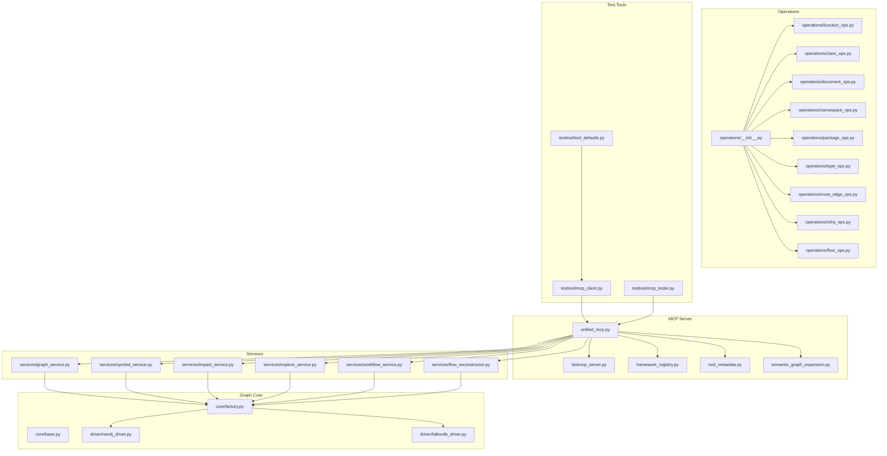
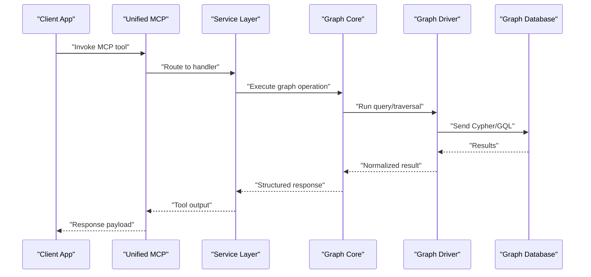
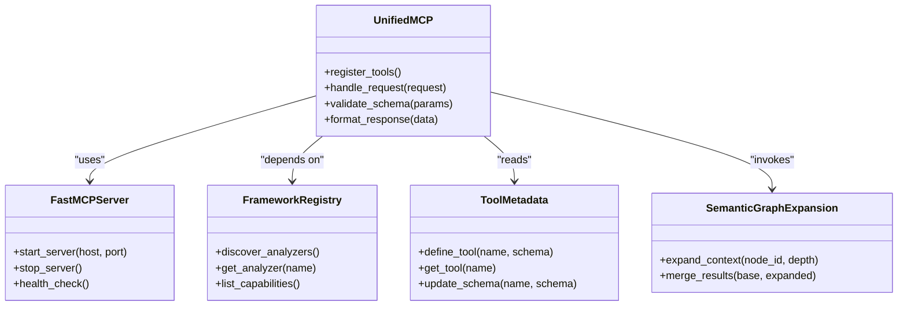
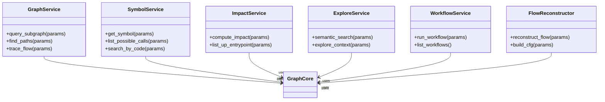
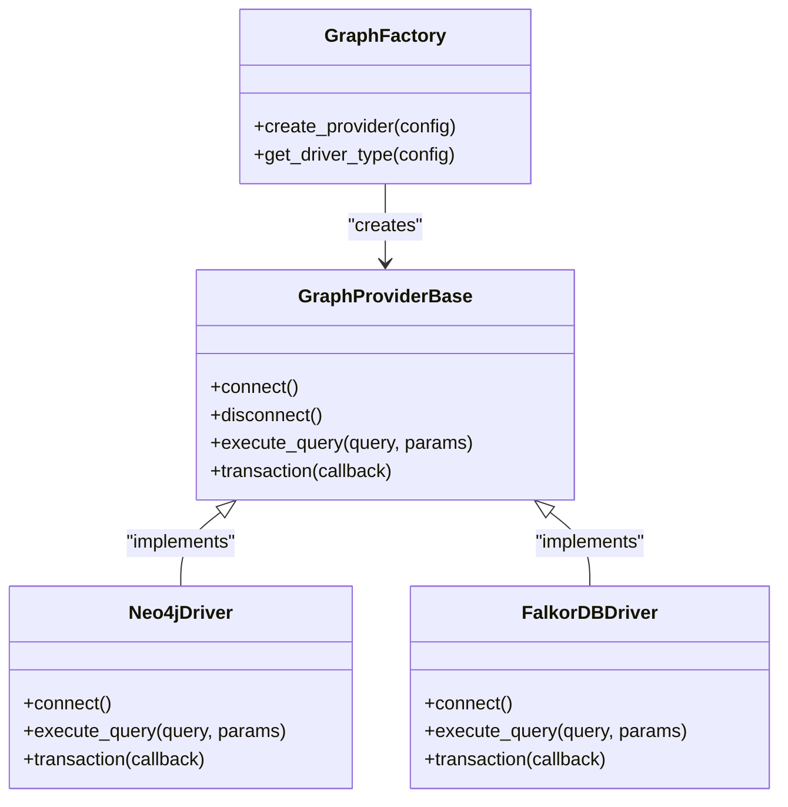
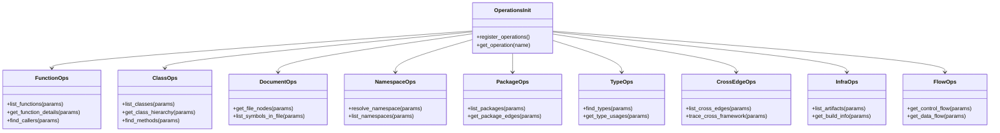
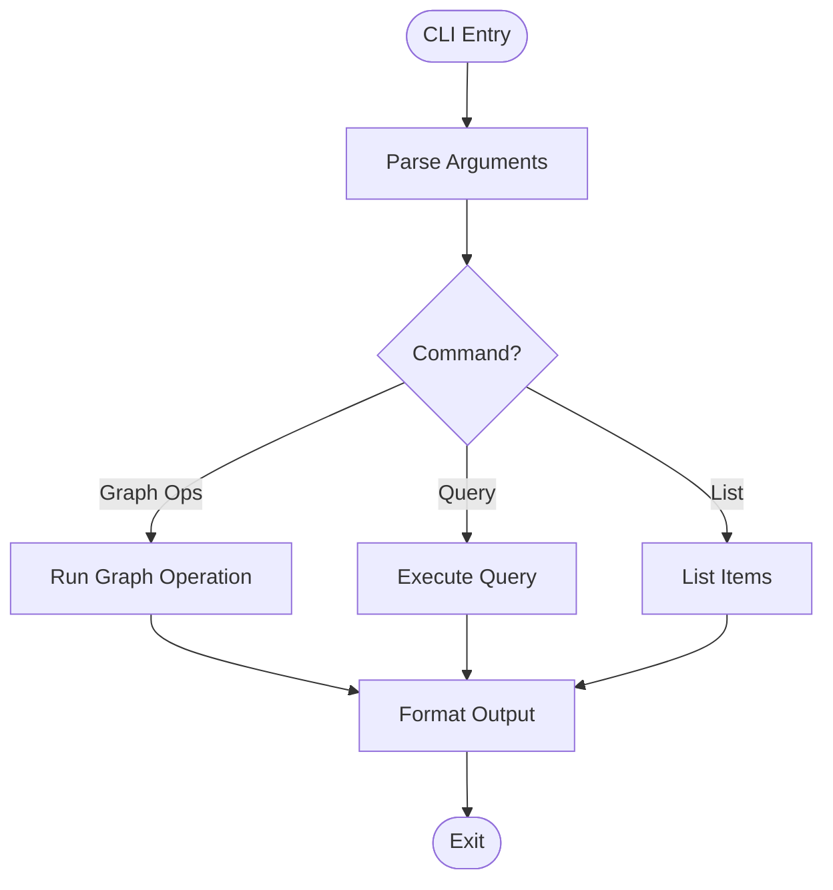
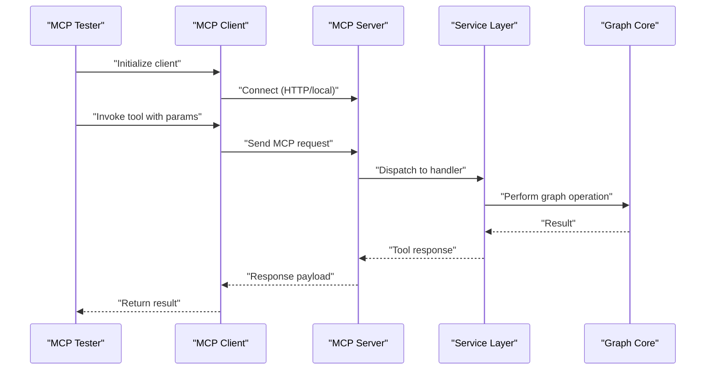
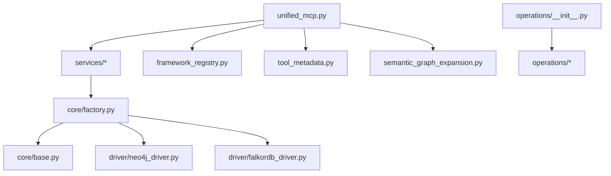

# SDK & Client Libraries

<cite>
**Referenced Files in This Document**
- [ReadMe.md](file://ReadMe.md)
- [pyproject.toml](file://pyproject.toml)
- [requirements.txt](file://requirements.txt)
- [cortex_harness/dev.py](file://cortex_harness/dev.py)
- [code-tiny/mcp/unified_mcp.py](file://code-tiny/mcp/unified_mcp.py)
- [code-tiny/mcp/fastmcp_server.py](file://code-tiny/mcp/fastmcp_server.py)
- [code-tiny/mcp/framework_registry.py](file://code-tiny/mcp/framework_registry.py)
- [code-tiny/mcp/tool_metadata.py](file://code-tiny/mcp/tool_metadata.py)
- [code-tiny/mcp/semantic_graph_expansion.py](file://code-tiny/mcp/semantic_graph_expansion.py)
- [code-tiny/mcp/services/graph_service.py](file://code-tiny/mcp/services/graph_service.py)
- [code-tiny/mcp/services/symbol_service.py](file://code-tiny/mcp/services/symbol_service.py)
- [code-tiny/mcp/services/impact_service.py](file://code-tiny/mcp/services/impact_service.py)
- [code-tiny/mcp/services/explore_service.py](file://code-tiny/mcp/services/explore_service.py)
- [code-tiny/mcp/services/workflow_service.py](file://code-tiny/mcp/services/workflow_service.py)
- [code-tiny/mcp/services/flow_reconstructor.py](file://code-tiny/mcp/services/flow_reconstructor.py)
- [code-tiny/tools/graph/core/factory.py](file://code-tiny/tools/graph/core/factory.py)
- [code-tiny/tools/graph/core/base.py](file://code-tiny/tools/graph/core/base.py)
- [code-tiny/tools/graph/driver/neo4j_driver.py](file://code-tiny/tools/graph/driver/neo4j_driver.py)
- [code-tiny/tools/graph/driver/falkordb_driver.py](file://code-tiny/tools/graph/driver/falkordb_driver.py)
- [code-tiny/tools/graph/operations/__init__.py](file://code-tiny/tools/graph/operations/__init__.py)
- [code-tiny/tools/graph/operations/function_ops.py](file://code-tiny/tools/graph/operations/function_ops.py)
- [code-tiny/tools/graph/operations/class_ops.py](file://code-tiny/tools/graph/operations/class_ops.py)
- [code-tiny/tools/graph/operations/document_ops.py](file://code-tiny/tools/graph/operations/document_ops.py)
- [code-tiny/tools/graph/operations/namespace_ops.py](file://code-tiny/tools/graph/operations/namespace_ops.py)
- [code-tiny/tools/graph/operations/package_ops.py](file://code-tiny/tools/graph/operations/package_ops.py)
- [code-tiny/tools/graph/operations/type_ops.py](file://code-tiny/tools/graph/operations/type_ops.py)
- [code-tiny/tools/graph/operations/cross_edge_ops.py](file://code-tiny/tools/graph/operations/cross_edge_ops.py)
- [code-tiny/tools/graph/operations/infra_ops.py](file://code-tiny/tools/graph/operations/infra_ops.py)
- [code-tiny/tools/graph/operations/flow_ops.py](file://code-tiny/tools/graph/operations/flow_ops.py)
- [code-tiny/tools/graph/cli.py](file://code-tiny/tools/graph/cli.py)
- [code-tiny/testtool/mcp_client.py](file://code-tiny/testtool/mcp_client.py)
- [code-tiny/testtool/mcp_tester.py](file://code-tiny/testtool/mcp_tester.py)
- [code-tiny/testtool/tool_defaults.py](file://code-tiny/testtool/tool_defaults.py)
- [scripts/mcp_runtime_config.py](file://scripts/mcp_runtime_config.py)
- [harness/templates/config.yaml](file://harness/templates/config.yaml)
- [installers/common/config_manager.py](file://installers/common/config_manager.py)
</cite>

## Table of Contents
1. [Introduction](#introduction)
2. [Project Structure](#project-structure)
3. [Core Components](#core-components)
4. [Architecture Overview](#architecture-overview)
5. [Detailed Component Analysis](#detailed-component-analysis)
6. [Dependency Analysis](#dependency-analysis)
7. [Performance Considerations](#performance-considerations)
8. [Troubleshooting Guide](#troubleshooting-guide)
9. [Conclusion](#conclusion)
10. [Appendices](#appendices)

## Introduction
This document provides comprehensive SDK and client library documentation for integrating with Cortex Harness. It focuses on the Python-based components that expose code analysis, graph operations, and query execution capabilities via a unified MCP (Model Context Protocol) interface. The guide covers:
- Client initialization and configuration management
- Connection handling patterns (HTTP and local process)
- Programmatic code analysis workflows
- Graph operations and query execution
- Asynchronous operations, streaming responses, and error handling strategies
- Integration patterns for web applications, background jobs, and microservices
- Performance optimization, connection pooling, and resource management
- Testing utilities, mock implementations, and debugging techniques

The repository includes an MCP server implementation, service modules for graph and symbol queries, a graph core abstraction with multiple drivers, and test tools to exercise the MCP endpoints.

## Project Structure
At a high level, the SDK surface is exposed through:
- An MCP server entrypoint and runtime configuration
- Service modules that implement MCP tool handlers for graph, symbol, impact, explore, workflow, and flow reconstruction
- A graph core abstraction with driver implementations (Neo4j and FalkorDB)
- Operations modules providing typed APIs for common graph tasks
- Test tools for client-side integration testing and validation

**Diagram sources**
- [code-tiny/mcp/unified_mcp.py](file://code-tiny/mcp/unified_mcp.py)
- [code-tiny/mcp/fastmcp_server.py](file://code-tiny/mcp/fastmcp_server.py)
- [code-tiny/mcp/framework_registry.py](file://code-tiny/mcp/framework_registry.py)
- [code-tiny/mcp/tool_metadata.py](file://code-tiny/mcp/tool_metadata.py)
- [code-tiny/mcp/semantic_graph_expansion.py](file://code-tiny/mcp/semantic_graph_expansion.py)
- [code-tiny/mcp/services/graph_service.py](file://code-tiny/mcp/services/graph_service.py)
- [code-tiny/mcp/services/symbol_service.py](file://code-tiny/mcp/services/symbol_service.py)
- [code-tiny/mcp/services/impact_service.py](file://code-tiny/mcp/services/impact_service.py)
- [code-tiny/mcp/services/explore_service.py](file://code-tiny/mcp/services/explore_service.py)
- [code-tiny/mcp/services/workflow_service.py](file://code-tiny/mcp/services/workflow_service.py)
- [code-tiny/mcp/services/flow_reconstructor.py](file://code-tiny/mcp/services/flow_reconstructor.py)
- [code-tiny/tools/graph/core/factory.py](file://code-tiny/tools/graph/core/factory.py)
- [code-tiny/tools/graph/core/base.py](file://code-tiny/tools/graph/core/base.py)
- [code-tiny/tools/graph/driver/neo4j_driver.py](file://code-tiny/tools/graph/driver/neo4j_driver.py)
- [code-tiny/tools/graph/driver/falkordb_driver.py](file://code-tiny/tools/graph/driver/falkordb_driver.py)
- [code-tiny/tools/graph/operations/__init__.py](file://code-tiny/tools/graph/operations/__init__.py)
- [code-tiny/tools/graph/operations/function_ops.py](file://code-tiny/tools/graph/operations/function_ops.py)
- [code-tiny/tools/graph/operations/class_ops.py](file://code-tiny/tools/graph/operations/class_ops.py)
- [code-tiny/tools/graph/operations/document_ops.py](file://code-tiny/tools/graph/operations/document_ops.py)
- [code-tiny/tools/graph/operations/namespace_ops.py](file://code-tiny/tools/graph/operations/namespace_ops.py)
- [code-tiny/tools/graph/operations/package_ops.py](file://code-tiny/tools/graph/operations/package_ops.py)
- [code-tiny/tools/graph/operations/type_ops.py](file://code-tiny/tools/graph/operations/type_ops.py)
- [code-tiny/tools/graph/operations/cross_edge_ops.py](file://code-tiny/tools/graph/operations/cross_edge_ops.py)
- [code-tiny/tools/graph/operations/infra_ops.py](file://code-tiny/tools/graph/operations/infra_ops.py)
- [code-tiny/tools/graph/operations/flow_ops.py](file://code-tiny/tools/graph/operations/flow_ops.py)
- [code-tiny/testtool/mcp_client.py](file://code-tiny/testtool/mcp_client.py)
- [code-tiny/testtool/mcp_tester.py](file://code-tiny/testtool/mcp_tester.py)
- [code-tiny/testtool/tool_defaults.py](file://code-tiny/testtool/tool_defaults.py)

**Section sources**
- [ReadMe.md](file://ReadMe.md)
- [pyproject.toml](file://pyproject.toml)
- [requirements.txt](file://requirements.txt)

## Core Components
This section outlines the primary building blocks used by clients and integrations.

- MCP Server and Runtime
  - Unified MCP entrypoint orchestrates tool registration and request routing.
  - FastMCP server wrapper configures HTTP transport and lifecycle.
  - Framework registry maps language/framework-specific analyzers to MCP tools.
  - Tool metadata defines schemas, parameters, and descriptions for MCP tools.
  - Semantic graph expansion augments query results with related context.

- Services Layer
  - Graph service exposes graph traversal and query helpers.
  - Symbol service resolves symbols across files and frameworks.
  - Impact service computes change impact and dependency propagation.
  - Explore service supports exploratory search and discovery.
  - Workflow service manages workflow definitions and executions.
  - Flow reconstructor rebuilds control/data flows from graph data.

- Graph Core Abstraction
  - Factory selects and initializes the appropriate graph driver.
  - Base defines the contract for graph providers.
  - Drivers implement Neo4j and FalkorDB connectivity and query execution.

- Operations Layer
  - Typed operation modules encapsulate common graph tasks (functions, classes, documents, namespaces, packages, types, cross edges, infrastructure, flows).

- Test Tools
  - MCP client helper for invoking tools programmatically.
  - MCP tester for running acceptance tests against live servers.
  - Tool defaults provide consistent input fixtures.

**Section sources**
- [code-tiny/mcp/unified_mcp.py](file://code-tiny/mcp/unified_mcp.py)
- [code-tiny/mcp/fastmcp_server.py](file://code-tiny/mcp/fastmcp_server.py)
- [code-tiny/mcp/framework_registry.py](file://code-tiny/mcp/framework_registry.py)
- [code-tiny/mcp/tool_metadata.py](file://code-tiny/mcp/tool_metadata.py)
- [code-tiny/mcp/semantic_graph_expansion.py](file://code-tiny/mcp/semantic_graph_expansion.py)
- [code-tiny/mcp/services/graph_service.py](file://code-tiny/mcp/services/graph_service.py)
- [code-tiny/mcp/services/symbol_service.py](file://code-tiny/mcp/services/symbol_service.py)
- [code-tiny/mcp/services/impact_service.py](file://code-tiny/mcp/services/impact_service.py)
- [code-tiny/mcp/services/explore_service.py](file://code-tiny/mcp/services/explore_service.py)
- [code-tiny/mcp/services/workflow_service.py](file://code-tiny/mcp/services/workflow_service.py)
- [code-tiny/mcp/services/flow_reconstructor.py](file://code-tiny/mcp/services/flow_reconstructor.py)
- [code-tiny/tools/graph/core/factory.py](file://code-tiny/tools/graph/core/factory.py)
- [code-tiny/tools/graph/core/base.py](file://code-tiny/tools/graph/core/base.py)
- [code-tiny/tools/graph/driver/neo4j_driver.py](file://code-tiny/tools/graph/driver/neo4j_driver.py)
- [code-tiny/tools/graph/driver/falkordb_driver.py](file://code-tiny/tools/graph/driver/falkordb_driver.py)
- [code-tiny/tools/graph/operations/__init__.py](file://code-tiny/tools/graph/operations/__init__.py)
- [code-tiny/tools/graph/operations/function_ops.py](file://code-tiny/tools/graph/operations/function_ops.py)
- [code-tiny/tools/graph/operations/class_ops.py](file://code-tiny/tools/graph/operations/class_ops.py)
- [code-tiny/tools/graph/operations/document_ops.py](file://code-tiny/tools/graph/operations/document_ops.py)
- [code-tiny/tools/graph/operations/namespace_ops.py](file://code-tiny/tools/graph/operations/namespace_ops.py)
- [code-tiny/tools/graph/operations/package_ops.py](file://code-tiny/tools/graph/operations/package_ops.py)
- [code-tiny/tools/graph/operations/type_ops.py](file://code-tiny/tools/graph/operations/type_ops.py)
- [code-tiny/tools/graph/operations/cross_edge_ops.py](file://code-tiny/tools/graph/operations/cross_edge_ops.py]
- [code-tiny/tools/graph/operations/infra_ops.py](file://code-tiny/tools/graph/operations/infra_ops.py)
- [code-tiny/tools/graph/operations/flow_ops.py](file://code-tiny/tools/graph/operations/flow_ops.py)
- [code-tiny/testtool/mcp_client.py](file://code-tiny/testtool/mcp_client.py)
- [code-tiny/testtool/mcp_tester.py](file://code-tiny/testtool/mcp_tester.py)
- [code-tiny/testtool/tool_defaults.py](file://code-tiny/testtool/tool_defaults.py)

## Architecture Overview
The SDK integrates with Cortex Harness primarily via MCP. Clients can call MCP tools over HTTP or invoke them locally within the same process. The services layer translates MCP requests into graph operations using the graph core abstraction, which abstracts the underlying database driver.

**Diagram sources**
- [code-tiny/mcp/unified_mcp.py](file://code-tiny/mcp/unified_mcp.py)
- [code-tiny/mcp/services/graph_service.py](file://code-tiny/mcp/services/graph_service.py)
- [code-tiny/tools/graph/core/factory.py](file://code-tiny/tools/graph/core/factory.py)
- [code-tiny/tools/graph/driver/neo4j_driver.py](file://code-tiny/tools/graph/driver/neo4j_driver.py)
- [code-tiny/tools/graph/driver/falkordb_driver.py](file://code-tiny/tools/graph/driver/falkordb_driver.py)

## Detailed Component Analysis

### MCP Server and Runtime
The MCP server exposes a set of tools for code analysis and graph querying. Key responsibilities include:
- Tool registration and schema definition
- Request parsing and validation
- Routing to service handlers
- Error normalization and response formatting

**Diagram sources**
- [code-tiny/mcp/unified_mcp.py](file://code-tiny/mcp/unified_mcp.py)
- [code-tiny/mcp/fastmcp_server.py](file://code-tiny/mcp/fastmcp_server.py)
- [code-tiny/mcp/framework_registry.py](file://code-tiny/mcp/framework_registry.py)
- [code-tiny/mcp/tool_metadata.py](file://code-tiny/mcp/tool_metadata.py)
- [code-tiny/mcp/semantic_graph_expansion.py](file://code-tiny/mcp/semantic_graph_expansion.py)

**Section sources**
- [code-tiny/mcp/unified_mcp.py](file://code-tiny/mcp/unified_mcp.py)
- [code-tiny/mcp/fastmcp_server.py](file://code-tiny/mcp/fastmcp_server.py)
- [code-tiny/mcp/framework_registry.py](file://code-tiny/mcp/framework_registry.py)
- [code-tiny/mcp/tool_metadata.py](file://code-tiny/mcp/tool_metadata.py)
- [code-tiny/mcp/semantic_graph_expansion.py](file://code-tiny/mcp/semantic_graph_expansion.py)

### Services Layer
Services implement domain-specific logic for MCP tools:
- Graph service: traversal, path finding, subgraph extraction
- Symbol service: symbol lookup, resolution, references
- Impact service: dependency impact, change propagation
- Explore service: semantic search, discovery
- Workflow service: workflow orchestration
- Flow reconstructor: reconstructing control/data flows

**Diagram sources**
- [code-tiny/mcp/services/graph_service.py](file://code-tiny/mcp/services/graph_service.py)
- [code-tiny/mcp/services/symbol_service.py](file://code-tiny/mcp/services/symbol_service.py)
- [code-tiny/mcp/services/impact_service.py](file://code-tiny/mcp/services/impact_service.py)
- [code-tiny/mcp/services/explore_service.py](file://code-tiny/mcp/services/explore_service.py)
- [code-tiny/mcp/services/workflow_service.py](file://code-tiny/mcp/services/workflow_service.py)
- [code-tiny/mcp/services/flow_reconstructor.py](file://code-tiny/mcp/services/flow_reconstructor.py)

**Section sources**
- [code-tiny/mcp/services/graph_service.py](file://code-tiny/mcp/services/graph_service.py)
- [code-tiny/mcp/services/symbol_service.py](file://code-tiny/mcp/services/symbol_service.py)
- [code-tiny/mcp/services/impact_service.py](file://code-tiny/mcp/services/impact_service.py)
- [code-tiny/mcp/services/explore_service.py](file://code-tiny/mcp/services/explore_service.py)
- [code-tiny/mcp/services/workflow_service.py](file://code-tiny/mcp/services/workflow_service.py)
- [code-tiny/mcp/services/flow_reconstructor.py](file://code-tiny/mcp/services/flow_reconstructor.py)

### Graph Core Abstraction and Drivers
The graph core provides a uniform API over different backends:
- Factory selects the driver based on configuration
- Base defines the provider contract
- Neo4j driver implements Neo4j connectivity
- FalkorDB driver implements FalkorDB connectivity

**Diagram sources**
- [code-tiny/tools/graph/core/factory.py](file://code-tiny/tools/graph/core/factory.py)
- [code-tiny/tools/graph/core/base.py](file://code-tiny/tools/graph/core/base.py)
- [code-tiny/tools/graph/driver/neo4j_driver.py](file://code-tiny/tools/graph/driver/neo4j_driver.py)
- [code-tiny/tools/graph/driver/falkordb_driver.py](file://code-tiny/tools/graph/driver/falkordb_driver.py)

**Section sources**
- [code-tiny/tools/graph/core/factory.py](file://code-tiny/tools/graph/core/factory.py)
- [code-tiny/tools/graph/core/base.py](file://code-tiny/tools/graph/core/base.py)
- [code-tiny/tools/graph/driver/neo4j_driver.py](file://code-tiny/tools/graph/driver/neo4j_driver.py)
- [code-tiny/tools/graph/driver/falkordb_driver.py](file://code-tiny/tools/graph/driver/falkordb_driver.py)

### Operations Layer
Operations encapsulate common graph tasks behind typed APIs:
- Function operations: function nodes, calls, signatures
- Class operations: class hierarchies, methods, inheritance
- Document operations: file-level nodes and relationships
- Namespace operations: module/package scoping
- Package operations: package boundaries and imports
- Type operations: type declarations and usages
- Cross edge operations: cross-language/framework edges
- Infrastructure operations: build/system artifacts
- Flow operations: control/data flow constructs

**Diagram sources**
- [code-tiny/tools/graph/operations/__init__.py](file://code-tiny/tools/graph/operations/__init__.py)
- [code-tiny/tools/graph/operations/function_ops.py](file://code-tiny/tools/graph/operations/function_ops.py)
- [code-tiny/tools/graph/operations/class_ops.py](file://code-tiny/tools/graph/operations/class_ops.py)
- [code-tiny/tools/graph/operations/document_ops.py](file://code-tiny/tools/graph/operations/document_ops.py)
- [code-tiny/tools/graph/operations/namespace_ops.py](file://code-tiny/tools/graph/operations/namespace_ops.py)
- [code-tiny/tools/graph/operations/package_ops.py](file://code-tiny/tools/graph/operations/package_ops.py)
- [code-tiny/tools/graph/operations/type_ops.py](file://code-tiny/tools/graph/operations/type_ops.py)
- [code-tiny/tools/graph/operations/cross_edge_ops.py](file://code-tiny/tools/graph/operations/cross_edge_ops.py)
- [code-tiny/tools/graph/operations/infra_ops.py](file://code-tiny/tools/graph/operations/infra_ops.py)
- [code-tiny/tools/graph/operations/flow_ops.py](file://code-tiny/tools/graph/operations/flow_ops.py)

**Section sources**
- [code-tiny/tools/graph/operations/__init__.py](file://code-tiny/tools/graph/operations/__init__.py)
- [code-tiny/tools/graph/operations/function_ops.py](file://code-tiny/tools/graph/operations/function_ops.py)
- [code-tiny/tools/graph/operations/class_ops.py](file://code-tiny/tools/graph/operations/class_ops.py)
- [code-tiny/tools/graph/operations/document_ops.py](file://code-tiny/tools/graph/operations/document_ops.py)
- [code-tiny/tools/graph/operations/namespace_ops.py](file://code-tiny/tools/graph/operations/namespace_ops.py)
- [code-tiny/tools/graph/operations/package_ops.py](file://code-tiny/tools/graph/operations/package_ops.py)
- [code-tiny/tools/graph/operations/type_ops.py](file://code-tiny/tools/graph/operations/type_ops.py)
- [code-tiny/tools/graph/operations/cross_edge_ops.py](file://code-tiny/tools/graph/operations/cross_edge_ops.py)
- [code-tiny/tools/graph/operations/infra_ops.py](file://code-tiny/tools/graph/operations/infra_ops.py)
- [code-tiny/tools/graph/operations/flow_ops.py](file://code-tiny/tools/graph/operations/flow_ops.py)

### CLI and Utilities
A CLI entrypoint provides command-line access to graph operations and utilities.

**Diagram sources**
- [code-tiny/tools/graph/cli.py](file://code-tiny/tools/graph/cli.py)

**Section sources**
- [code-tiny/tools/graph/cli.py](file://code-tiny/tools/graph/cli.py)

### Client and Testing Utilities
The test tools provide a client helper and tester harness for validating MCP interactions.

**Diagram sources**
- [code-tiny/testtool/mcp_client.py](file://code-tiny/testtool/mcp_client.py)
- [code-tiny/testtool/mcp_tester.py](file://code-tiny/testtool/mcp_tester.py)
- [code-tiny/testtool/tool_defaults.py](file://code-tiny/testtool/tool_defaults.py)

**Section sources**
- [code-tiny/testtool/mcp_client.py](file://code-tiny/testtool/mcp_client.py)
- [code-tiny/testtool/mcp_tester.py](file://code-tiny/testtool/mcp_tester.py)
- [code-tiny/testtool/tool_defaults.py](file://code-tiny/testtool/tool_defaults.py)

## Dependency Analysis
The following diagram shows key dependencies between MCP server components, services, graph core, and drivers.

**Diagram sources**
- [code-tiny/mcp/unified_mcp.py](file://code-tiny/mcp/unified_mcp.py)
- [code-tiny/mcp/services/graph_service.py](file://code-tiny/mcp/services/graph_service.py)
- [code-tiny/mcp/services/symbol_service.py](file://code-tiny/mcp/services/symbol_service.py)
- [code-tiny/mcp/services/impact_service.py](file://code-tiny/mcp/services/impact_service.py)
- [code-tiny/mcp/services/explore_service.py](file://code-tiny/mcp/services/explore_service.py)
- [code-tiny/mcp/services/workflow_service.py](file://code-tiny/mcp/services/workflow_service.py)
- [code-tiny/mcp/services/flow_reconstructor.py](file://code-tiny/mcp/services/flow_reconstructor.py)
- [code-tiny/tools/graph/core/factory.py](file://code-tiny/tools/graph/core/factory.py)
- [code-tiny/tools/graph/core/base.py](file://code-tiny/tools/graph/core/base.py)
- [code-tiny/tools/graph/driver/neo4j_driver.py](file://code-tiny/tools/graph/driver/neo4j_driver.py)
- [code-tiny/tools/graph/driver/falkordb_driver.py](file://code-tiny/tools/graph/driver/falkordb_driver.py)
- [code-tiny/tools/graph/operations/__init__.py](file://code-tiny/tools/graph/operations/__init__.py)

**Section sources**
- [code-tiny/mcp/unified_mcp.py](file://code-tiny/mcp/unified_mcp.py)
- [code-tiny/tools/graph/core/factory.py](file://code-tiny/tools/graph/core/factory.py)
- [code-tiny/tools/graph/operations/__init__.py](file://code-tiny/tools/graph/operations/__init__.py)

## Performance Considerations
- Connection pooling: Reuse graph connections where supported by drivers; avoid per-request connect/disconnect cycles.
- Query batching: Combine small operations into single transactions to reduce round-trips.
- Result pagination: For large traversals, use limit/offset or cursor-based pagination at the driver level.
- Indexing: Ensure indexes exist on frequently queried labels and properties.
- Caching: Cache stable metadata (e.g., symbol catalogs) in memory or external cache layers.
- Streaming: For long-running queries, stream partial results when possible to improve latency.
- Resource limits: Set timeouts and maximum result sizes to prevent resource exhaustion.

[No sources needed since this section provides general guidance]

## Troubleshooting Guide
Common issues and strategies:
- Connection failures: Validate host/port, credentials, and firewall rules; check driver health endpoints.
- Schema mismatches: Verify tool metadata schemas match expected inputs; update tool definitions if contracts change.
- Timeouts: Increase request timeouts for heavy queries; consider asynchronous invocation for long-running tasks.
- Errors and retries: Implement exponential backoff for transient network errors; log detailed stack traces.
- Debugging: Use MCP tester and tool defaults to reproduce issues; enable verbose logging in server and client.

**Section sources**
- [code-tiny/testtool/mcp_tester.py](file://code-tiny/testtool/mcp_tester.py)
- [code-tiny/testtool/tool_defaults.py](file://code-tiny/testtool/tool_defaults.py)
- [scripts/mcp_runtime_config.py](file://scripts/mcp_runtime_config.py)

## Conclusion
Cortex Harness exposes powerful code analysis and graph querying capabilities through a well-structured MCP-based SDK surface. By leveraging the services layer, graph core abstraction, and operations modules, integrations can perform programmatic analysis, traverse complex codebases, and execute targeted queries efficiently. Following the recommended patterns for initialization, configuration, connection handling, and error management ensures robust deployments across web applications, background jobs, and microservices.

[No sources needed since this section summarizes without analyzing specific files]

## Appendices

### Configuration Management
- Runtime configuration for MCP server and clients is managed centrally.
- Template configuration provides default settings for environments.
- Installer configuration manager handles platform-specific setup.

**Section sources**
- [scripts/mcp_runtime_config.py](file://scripts/mcp_runtime_config.py)
- [harness/templates/config.yaml](file://harness/templates/config.yaml)
- [installers/common/config_manager.py](file://installers/common/config_manager.py)

### Example Workflows
- Initialize MCP client with environment variables or config file.
- Register tools and validate schemas before making requests.
- Execute graph queries using operations layer for clarity and safety.
- Handle asynchronous responses and stream results for large datasets.
- Apply retry and timeout policies for resilience.

[No sources needed since this section provides general guidance]