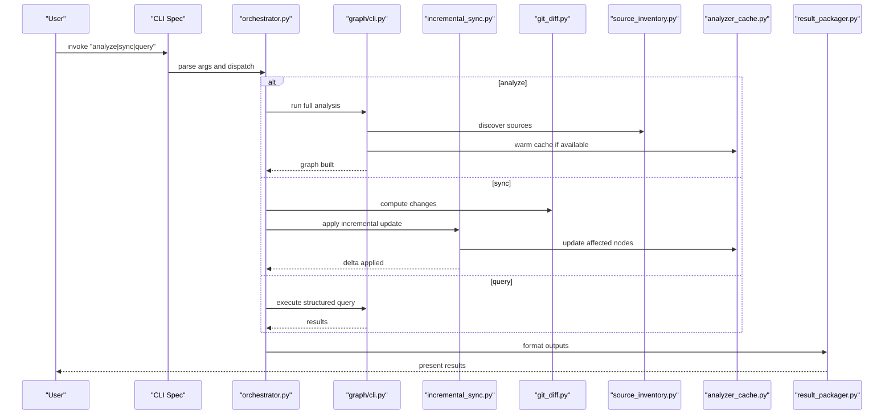
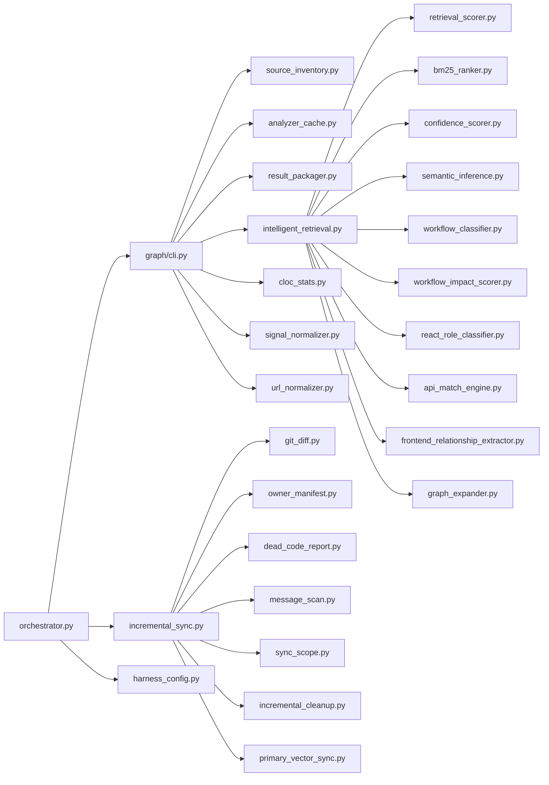

# Analysis Control Commands

<cite>
**Referenced Files in This Document**
- [cli.md](file://docs/specs/cli.md)
- [harness-cli.md](file://docs/specs/harness-cli.md)
- [sync-code.md](file://docs/specs/sync-code.md)
- [orchestrator.py](file://harness/scripts/orchestrator.py)
- [init.sh](file://harness/scripts/init.sh)
- [verify.sh](file://harness/scripts/verify.sh)
- [context_selector.py](file://harness/scripts/context_selector.py)
- [graph/cli.py](file://code-tiny/tools/graph/cli.py)
- [incremental_sync.py](file://code-tiny/tools/sync/incremental_sync.py)
- [build_owner_manifests.py](file://code-tiny/tools/sync/build_owner_manifests.py)
- [dead_code_report.py](file://code-tiny/tools/sync/dead_code_report.py)
- [message_scan.py](file://code-tiny/tools/sync/message_scan.py)
- [owner_manifest.py](file://code-tiny/tools/sync/owner_manifest.py)
- [git_diff.py](file://code-tiny/tools/common/git_diff.py)
- [source_inventory.py](file://code-tiny/tools/common/source_inventory.py)
- [analyzer_cache.py](file://code-tiny/tools/common/analyzer_cache.py)
- [result_packager.py](file://code-tiny/tools/common/result_packager.py)
- [query_intent_classifier.py](file://code-tiny/tools/common/query_intent_classifier.py)
- [query_understanding.py](file://code-tiny/tools/common/query_understanding.py)
- [intelligent_retrieval.py](file://code-tiny/tools/common/intelligent_retrieval.py)
- [retrieval_scorer.py](file://code-tiny/tools/common/retrieval_scorer.py)
- [semantic_inference.py](file://code-tiny/tools/common/semantic_inference.py)
- [workflow_classifier.py](file://code-tiny/tools/common/workflow_classifier.py)
- [workflow_impact_scorer.py](file://code-tiny/tools/common/workflow_impact_scorer.py)
- [react_role_classifier.py](file://code-tiny/tools/common/react_role_classifier.py)
- [api_match_engine.py](file://code-tiny/tools/common/api_match_engine.py)
- [bm25_ranker.py](file://code-tiny/tools/common/bm25_ranker.py)
- [confidence_scorer.py](file://code-tiny/tools/common/confidence_scorer.py)
- [frontend_relationship_extractor.py](file://code-tiny/tools/common/frontend_relationship_extractor.py)
- [graph_expander.py](file://code-tiny/tools/common/graph_expander.py)
- [cloc_stats.py](file://code-tiny/tools/common/cloc_stats.py)
- [signal_normalizer.py](file://code-tiny/tools/common/signal_normalizer.py)
- [url_normalizer.py](file://code-tiny/tools/common/url_normalizer.py)
- [primary_vector_sync.py](file://code-tiny/tools/common/primary_vector_sync.py)
- [sync_scope.py](file://code-tiny/tools/common/sync_scope.py)
- [incremental_cleanup.py](file://code-tiny/tools/common/incremental_cleanup.py)
- [harness_config.py](file://code-tiny/tools/common/harness_config.py)
</cite>

## Table of Contents
1. [Introduction](#introduction)
2. [Project Structure](#project-structure)
3. [Core Components](#core-components)
4. [Architecture Overview](#architecture-overview)
5. [Detailed Component Analysis](#detailed-component-analysis)
6. [Dependency Analysis](#dependency-analysis)
7. [Performance Considerations](#performance-considerations)
8. [Troubleshooting Guide](#troubleshooting-guide)
9. [Conclusion](#conclusion)
10. [Appendices](#appendices)

## Introduction
This document provides comprehensive documentation for Cortex Harness analysis control CLI commands, focusing on:
- analyze: full codebase analysis with language detection, framework identification, and graph construction
- sync: incremental analysis updates, change detection, and selective re-analysis
- query: executing structured queries against the analyzed codebase

It covers parameters (targets, language filters, frameworks, output formats, performance tuning), examples, progress indicators, logging options, result interpretation, troubleshooting, and performance optimization tips.

## Project Structure
The CLI surface is defined by specification documents and orchestrated via harness scripts and tools under code-tiny. The key areas are:
- CLI specifications: docs/specs
- Orchestration scripts: harness/scripts
- Graph CLI entrypoint: code-tiny/tools/graph/cli.py
- Sync pipeline and utilities: code-tiny/tools/sync and code-tiny/tools/common

```mermaid
graph TB
subgraph "CLI Specs"
A["cli.md"]
B["harness-cli.md"]
C["sync-code.md"]
end
subgraph "Orchestration"
D["orchestrator.py"]
E["init.sh"]
F["verify.sh"]
G["context_selector.py"]
end
subgraph "Graph CLI"
H["graph/cli.py"]
end
subgraph "Sync Pipeline"
I["sync/incremental_sync.py"]
J["sync/build_owner_manifests.py"]
K["sync/dead_code_report.py"]
L["sync/message_scan.py"]
M["sync/owner_manifest.py"]
end
subgraph "Common Tools"
N["common/git_diff.py"]
O["common/source_inventory.py"]
P["common/analyzer_cache.py"]
Q["common/result_packager.py"]
R["common/query_intent_classifier.py"]
S["common/query_understanding.py"]
T["common/intelligent_retrieval.py"]
U["common/retrieval_scorer.py"]
V["common/semantic_inference.py"]
W["common/workflow_classifier.py"]
X["common/workflow_impact_scorer.py"]
Y["common/react_role_classifier.py"]
Z["common/api_match_engine.py"]
AA["common/bm25_ranker.py"]
AB["common/confidence_scorer.py"]
AC["common/frontend_relationship_extractor.py"]
AD["common/graph_expander.py"]
AE["common/cloc_stats.py"]
AF["common/signal_normalizer.py"]
AG["common/url_normalizer.py"]
AH["common/primary_vector_sync.py"]
AI["common/sync_scope.py"]
AJ["common/incremental_cleanup.py"]
AK["common/harness_config.py"]
end
A --> D
B --> D
C --> D
D --> H
D --> I
D --> J
D --> K
D --> L
D --> M
D --> N
D --> O
D --> P
D --> Q
D --> R
D --> S
D --> T
D --> U
D --> V
D --> W
D --> X
D --> Y
D --> Z
D --> AA
D --> AB
D --> AC
D --> AD
D --> AE
D --> AF
D --> AG
D --> AH
D --> AI
D --> AJ
D --> AK
```

**Diagram sources**
- [cli.md](file://docs/specs/cli.md)
- [harness-cli.md](file://docs/specs/harness-cli.md)
- [sync-code.md](file://docs/specs/sync-code.md)
- [orchestrator.py](file://harness/scripts/orchestrator.py)
- [graph/cli.py](file://code-tiny/tools/graph/cli.py)
- [incremental_sync.py](file://code-tiny/tools/sync/incremental_sync.py)
- [build_owner_manifests.py](file://code-tiny/tools/sync/build_owner_manifests.py)
- [dead_code_report.py](file://code-tiny/tools/sync/dead_code_report.py)
- [message_scan.py](file://code-tiny/tools/sync/message_scan.py)
- [owner_manifest.py](file://code-tiny/tools/sync/owner_manifest.py)
- [git_diff.py](file://code-tiny/tools/common/git_diff.py)
- [source_inventory.py](file://code-tiny/tools/common/source_inventory.py)
- [analyzer_cache.py](file://code-tiny/tools/common/analyzer_cache.py)
- [result_packager.py](file://code-tiny/tools/common/result_packager.py)
- [query_intent_classifier.py](file://code-tiny/tools/common/query_intent_classifier.py)
- [query_understanding.py](file://code-tiny/tools/common/query_understanding.py)
- [intelligent_retrieval.py](file://code-tiny/tools/common/intelligent_retrieval.py)
- [retrieval_scorer.py](file://code-tiny/tools/common/retrieval_scorer.py)
- [semantic_inference.py](file://code-tiny/tools/common/semantic_inference.py)
- [workflow_classifier.py](file://code-tiny/tools/common/workflow_classifier.py)
- [workflow_impact_scorer.py](file://code-tiny/tools/common/workflow_impact_scorer.py)
- [react_role_classifier.py](file://code-tiny/tools/common/react_role_classifier.py)
- [api_match_engine.py](file://code-tiny/tools/common/api_match_engine.py)
- [bm25_ranker.py](file://code-tiny/tools/common/bm25_ranker.py)
- [confidence_scorer.py](file://code-tiny/tools/common/confidence_scorer.py)
- [frontend_relationship_extractor.py](file://code-tiny/tools/common/frontend_relationship_extractor.py)
- [graph_expander.py](file://code-tiny/tools/common/graph_expander.py)
- [cloc_stats.py](file://code-tiny/tools/common/cloc_stats.py)
- [signal_normalizer.py](file://code-tiny/tools/common/signal_normalizer.py)
- [url_normalizer.py](file://code-tiny/tools/common/url_normalizer.py)
- [primary_vector_sync.py](file://code-tiny/tools/common/primary_vector_sync.py)
- [sync_scope.py](file://code-tiny/tools/common/sync_scope.py)
- [incremental_cleanup.py](file://code-tiny/tools/common/incremental_cleanup.py)
- [harness_config.py](file://code-tiny/tools/common/harness_config.py)

**Section sources**
- [cli.md](file://docs/specs/cli.md)
- [harness-cli.md](file://docs/specs/harness-cli.md)
- [sync-code.md](file://docs/specs/sync-code.md)
- [orchestrator.py](file://harness/scripts/orchestrator.py)
- [graph/cli.py](file://code-tiny/tools/graph/cli.py)

## Core Components
- CLI Specifications: Define command surfaces, flags, and behaviors for analyze, sync, and query.
- Orchestrator: Central script that wires CLI specs to underlying tools and services.
- Graph CLI: Entry point for graph-related operations including analysis and querying.
- Sync Pipeline: Implements incremental updates, change detection, owner manifests, dead code reporting, and message scanning.
- Common Utilities: Provide shared functionality such as caching, scoping, retrieval, scoring, normalization, and statistics.

Key responsibilities:
- Language detection and framework identification during analysis
- Incremental change detection and selective re-analysis
- Structured query execution with intent understanding and retrieval
- Progress tracking and logging across all phases
- Result packaging and output formatting

**Section sources**
- [cli.md](file://docs/specs/cli.md)
- [harness-cli.md](file://docs/specs/harness-cli.md)
- [sync-code.md](file://docs/specs/sync-code.md)
- [orchestrator.py](file://harness/scripts/orchestrator.py)
- [graph/cli.py](file://code-tiny/tools/graph/cli.py)

## Architecture Overview
High-level flow for each command:

**Diagram sources**
- [cli.md](file://docs/specs/cli.md)
- [harness-cli.md](file://docs/specs/harness-cli.md)
- [sync-code.md](file://docs/specs/sync-code.md)
- [orchestrator.py](file://harness/scripts/orchestrator.py)
- [graph/cli.py](file://code-tiny/tools/graph/cli.py)
- [incremental_sync.py](file://code-tiny/tools/sync/incremental_sync.py)
- [git_diff.py](file://code-tiny/tools/common/git_diff.py)
- [source_inventory.py](file://code-tiny/tools/common/source_inventory.py)
- [analyzer_cache.py](file://code-tiny/tools/common/analyzer_cache.py)
- [result_packager.py](file://code-tiny/tools/common/result_packager.py)

## Detailed Component Analysis

### analyze Command
Purpose: Run a full analysis over target directories, detect languages and frameworks, construct graphs, and produce outputs.

Parameters:
- Target directories: one or more paths to scan
- Language filters: restrict analysis to specific languages
- Framework options: enable/disable framework overlays (e.g., Spring, ASP.NET, Flutter)
- Output formats: JSON, text, or other supported formats
- Performance tuning flags: concurrency limits, cache usage, memory settings
- Logging options: verbosity levels, log destinations
- Progress indicators: terminal progress bars or structured logs

Behavior:
- Source discovery and inventory
- Language detection and framework identification
- Graph construction and persistence
- Caching and pre-warming
- Result packaging and reporting

Examples:
- Analyze entire repository with auto-detection
- Analyze only Python and Java sources
- Enable Spring overlay for Java projects
- Output results in JSON to a file
- Increase concurrency for faster analysis

Progress and Logging:
- Phased progress updates (discovery, parsing, graphing, indexing)
- Verbose logs for diagnostics
- Summary metrics (files scanned, symbols found, edges created)

Result Interpretation:
- Graph topology overview
- Detected languages and frameworks
- Key artifacts and relationships
- Errors and warnings summary

**Section sources**
- [cli.md](file://docs/specs/cli.md)
- [harness-cli.md](file://docs/specs/harness-cli.md)
- [graph/cli.py](file://code-tiny/tools/graph/cli.py)
- [source_inventory.py](file://code-tiny/tools/common/source_inventory.py)
- [analyzer_cache.py](file://code-tiny/tools/common/analyzer_cache.py)
- [result_packager.py](file://code-tiny/tools/common/result_packager.py)

### sync Command
Purpose: Perform incremental analysis updates based on detected changes, selectively re-analyze affected parts, and maintain graph consistency.

Parameters:
- Target directories: same as analyze
- Change scope: git-based diffs, time windows, or manual file lists
- Language and framework filters: limit re-analysis to relevant subsets
- Output formats: diff summaries, updated artifacts
- Performance tuning flags: parallelism, cache strategies
- Logging options: detailed change tracking

Behavior:
- Change detection using git diffs or provided inputs
- Scope determination for affected modules and files
- Selective re-analysis and graph patching
- Owner manifest updates and dead code reporting
- Message scanning for cross-language impacts

Examples:
- Sync after a feature branch merge
- Re-analyze only changed Python files
- Update Spring annotations and related edges
- Generate a report of dead code candidates

Progress and Logging:
- Delta computation progress
- Affected node counts
- Patch application status

Result Interpretation:
- List of changed files and modules
- Updated graph segments
- Potential impact areas

**Section sources**
- [sync-code.md](file://docs/specs/sync-code.md)
- [incremental_sync.py](file://code-tiny/tools/sync/incremental_sync.py)
- [git_diff.py](file://code-tiny/tools/common/git_diff.py)
- [build_owner_manifests.py](file://code-tiny/tools/sync/build_owner_manifests.py)
- [dead_code_report.py](file://code-tiny/tools/sync/dead_code_report.py)
- [message_scan.py](file://code-tiny/tools/sync/message_scan.py)
- [owner_manifest.py](file://code-tiny/tools/sync/owner_manifest.py)

### query Command
Purpose: Execute structured queries against the analyzed codebase, leveraging intent understanding, retrieval, and scoring.

Parameters:
- Query input: natural language or structured query syntax
- Filters: language, framework, module, symbol types
- Output formats: JSON, text, or interactive views
- Performance tuning flags: retrieval depth, ranking strategies
- Logging options: query tracing and timing

Behavior:
- Intent classification and query understanding
- Intelligent retrieval from graph and indexes
- Scoring and ranking of results
- Semantic inference and workflow context
- React role classification and API matching when applicable

Examples:
- Find all REST endpoints in a Java Spring project
- Locate callers of a specific function in TypeScript
- Trace data flows between modules
- Identify potential security-sensitive calls

Progress and Logging:
- Query parsing and planning
- Retrieval steps and hit counts
- Ranking and filtering details

Result Interpretation:
- Ranked list of matches with confidence scores
- Contextual metadata (files, symbols, relationships)
- Explanatory notes and suggested next steps

**Section sources**
- [cli.md](file://docs/specs/cli.md)
- [harness-cli.md](file://docs/specs/harness-cli.md)
- [graph/cli.py](file://code-tiny/tools/graph/cli.py)
- [query_intent_classifier.py](file://code-tiny/tools/common/query_intent_classifier.py)
- [query_understanding.py](file://code-tiny/tools/common/query_understanding.py)
- [intelligent_retrieval.py](file://code-tiny/tools/common/intelligent_retrieval.py)
- [retrieval_scorer.py](file://code-tiny/tools/common/retrieval_scorer.py)
- [semantic_inference.py](file://code-tiny/tools/common/semantic_inference.py)
- [workflow_classifier.py](file://code-tiny/tools/common/workflow_classifier.py)
- [workflow_impact_scorer.py](file://code-tiny/tools/common/workflow_impact_scorer.py)
- [react_role_classifier.py](file://code-tiny/tools/common/react_role_classifier.py)
- [api_match_engine.py](file://code-tiny/tools/common/api_match_engine.py)
- [bm25_ranker.py](file://code-tiny/tools/common/bm25_ranker.py)
- [confidence_scorer.py](file://code-tiny/tools/common/confidence_scorer.py)
- [frontend_relationship_extractor.py](file://code-tiny/tools/common/frontend_relationship_extractor.py)
- [graph_expander.py](file://code-tiny/tools/common/graph_expander.py)

## Dependency Analysis
Component interactions and coupling:

**Diagram sources**
- [orchestrator.py](file://harness/scripts/orchestrator.py)
- [graph/cli.py](file://code-tiny/tools/graph/cli.py)
- [incremental_sync.py](file://code-tiny/tools/sync/incremental_sync.py)
- [git_diff.py](file://code-tiny/tools/common/git_diff.py)
- [owner_manifest.py](file://code-tiny/tools/sync/owner_manifest.py)
- [dead_code_report.py](file://code-tiny/tools/sync/dead_code_report.py)
- [message_scan.py](file://code-tiny/tools/sync/message_scan.py)
- [source_inventory.py](file://code-tiny/tools/common/source_inventory.py)
- [analyzer_cache.py](file://code-tiny/tools/common/analyzer_cache.py)
- [result_packager.py](file://code-tiny/tools/common/result_packager.py)
- [intelligent_retrieval.py](file://code-tiny/tools/common/intelligent_retrieval.py)
- [retrieval_scorer.py](file://code-tiny/tools/common/retrieval_scorer.py)
- [bm25_ranker.py](file://code-tiny/tools/common/bm25_ranker.py)
- [confidence_scorer.py](file://code-tiny/tools/common/confidence_scorer.py)
- [semantic_inference.py](file://code-tiny/tools/common/semantic_inference.py)
- [workflow_classifier.py](file://code-tiny/tools/common/workflow_classifier.py)
- [workflow_impact_scorer.py](file://code-tiny/tools/common/workflow_impact_scorer.py)
- [react_role_classifier.py](file://code-tiny/tools/common/react_role_classifier.py)
- [api_match_engine.py](file://code-tiny/tools/common/api_match_engine.py)
- [frontend_relationship_extractor.py](file://code-tiny/tools/common/frontend_relationship_extractor.py)
- [graph_expander.py](file://code-tiny/tools/common/graph_expander.py)
- [sync_scope.py](file://code-tiny/tools/common/sync_scope.py)
- [incremental_cleanup.py](file://code-tiny/tools/common/incremental_cleanup.py)
- [primary_vector_sync.py](file://code-tiny/tools/common/primary_vector_sync.py)
- [cloc_stats.py](file://code-tiny/tools/common/cloc_stats.py)
- [signal_normalizer.py](file://code-tiny/tools/common/signal_normalizer.py)
- [url_normalizer.py](file://code-tiny/tools/common/url_normalizer.py)
- [harness_config.py](file://code-tiny/tools/common/harness_config.py)

**Section sources**
- [orchestrator.py](file://harness/scripts/orchestrator.py)
- [graph/cli.py](file://code-tiny/tools/graph/cli.py)
- [incremental_sync.py](file://code-tiny/tools/sync/incremental_sync.py)

## Performance Considerations
- Concurrency and parallelism: tune worker threads/processes for analysis and retrieval
- Caching strategy: leverage analyzer cache to avoid redundant work
- Memory management: adjust heap size and batch sizes for large repos
- Indexing and vector sync: ensure primary vectors are up-to-date for fast retrieval
- Filtering and scoping: narrow targets and languages to reduce overhead
- Graph expansion controls: limit traversal depth and breadth where appropriate
- Statistics and profiling: use cloc stats and signal normalization insights to guide optimizations

[No sources needed since this section provides general guidance]

## Troubleshooting Guide
Common issues and resolutions:
- Language detection failures: verify source layout and configuration; check language-specific parsers
- Framework identification gaps: ensure framework overlays are enabled and dependencies are installed
- Incremental sync inconsistencies: validate git state and ownership manifests; re-run owner manifest build
- Query result quality: refine filters, adjust retrieval depth, and review scoring weights
- Performance regressions: inspect logs for bottlenecks, adjust concurrency, and clear stale caches
- Graph corruption or missing edges: rebuild affected segments and re-index primary vectors

Operational checks:
- Use init and verify scripts to validate environment and graph integrity
- Review logs for errors and warnings during analyze, sync, and query phases
- Inspect result packaging for malformed outputs

**Section sources**
- [init.sh](file://harness/scripts/init.sh)
- [verify.sh](file://harness/scripts/verify.sh)
- [context_selector.py](file://harness/scripts/context_selector.py)
- [analyzer_cache.py](file://code-tiny/tools/common/analyzer_cache.py)
- [owner_manifest.py](file://code-tiny/tools/sync/owner_manifest.py)
- [result_packager.py](file://code-tiny/tools/common/result_packager.py)

## Conclusion
Cortex Harness provides a robust CLI for analyzing, syncing, and querying codebases with strong support for multi-language and multi-framework environments. By leveraging incremental updates, intelligent retrieval, and configurable performance tuning, teams can maintain accurate, up-to-date code graphs efficiently.

[No sources needed since this section summarizes without analyzing specific files]

## Appendices

### Example Workflows
- Full analysis:
  - Specify target directories
  - Auto-detect languages and frameworks
  - Output results in JSON
- Incremental sync:
  - Detect changes via git diff
  - Re-analyze affected modules
  - Report dead code candidates
- Structured query:
  - Provide natural language or structured query
  - Apply filters for language/framework/module
  - Retrieve ranked results with context

[No sources needed since this section provides conceptual examples]