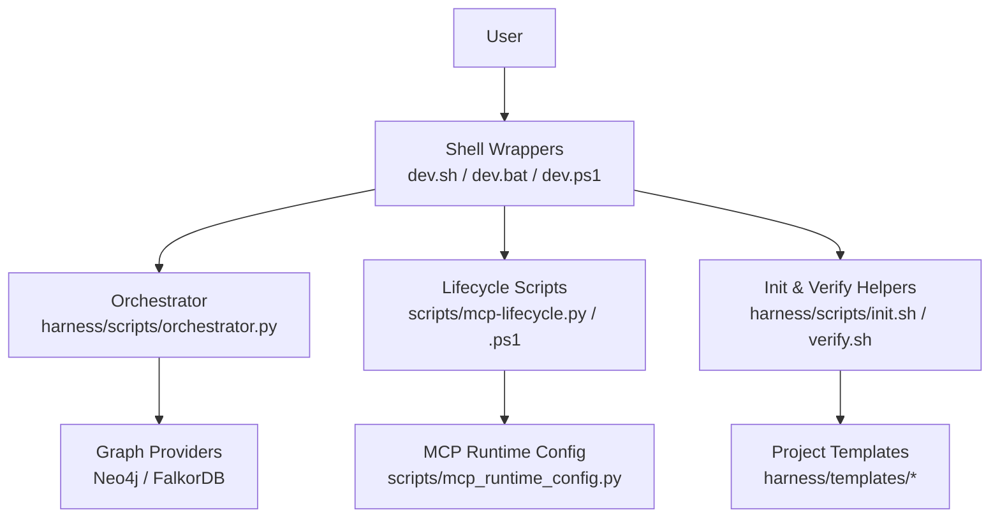
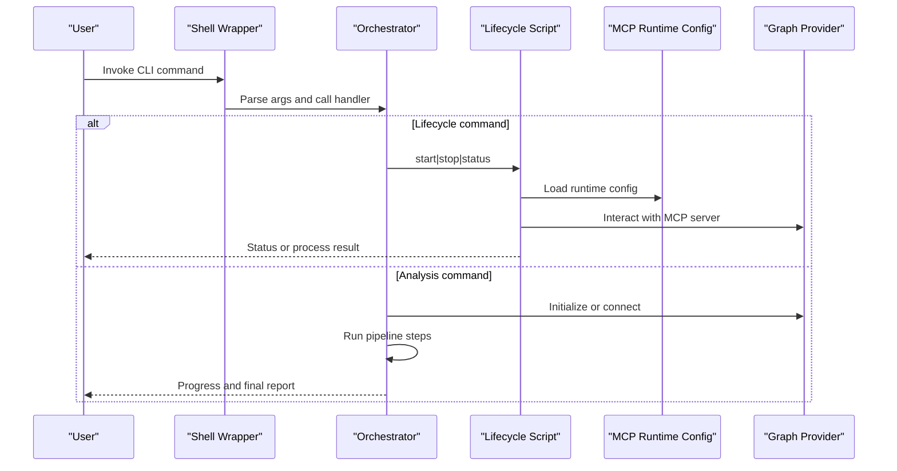
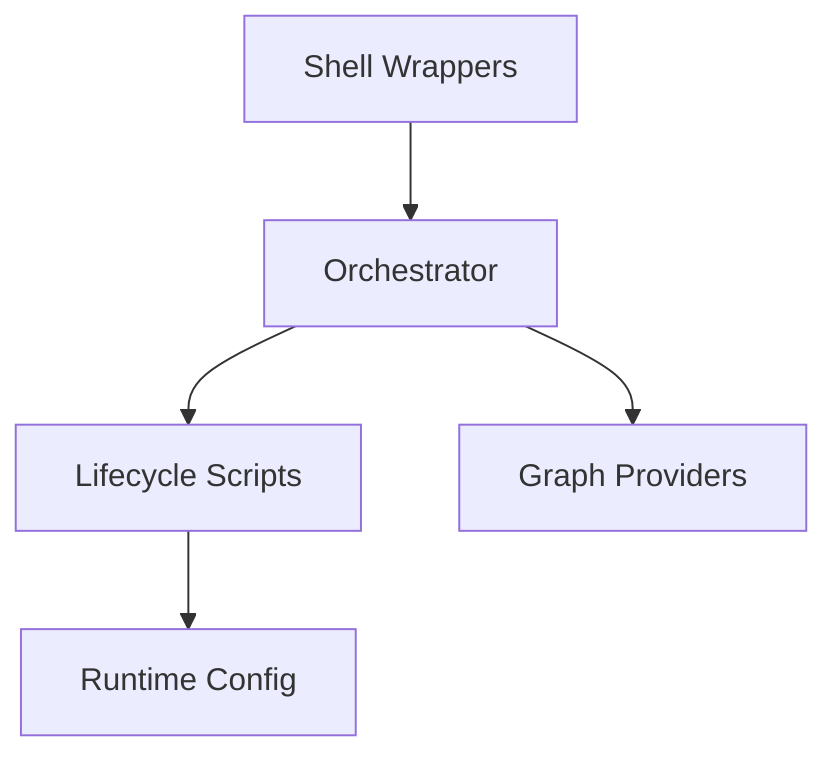

# CLI Commands Reference

<cite>
**Referenced Files in This Document**
- [ReadMe.md](file://ReadMe.md)
- [Makefile](file://Makefile)
- [dev.sh](file://dev.sh)
- [dev.bat](file://dev.bat)
- [dev.ps1](file://dev.ps1)
- [install-windows.bat](file://install-windows.bat)
- [install-windows.ps1](file://install-windows.ps1)
- [harness/scripts/orchestrator.py](file://harness/scripts/orchestrator.py)
- [harness/scripts/init.sh](file://harness/scripts/init.sh)
- [harness/scripts/verify.sh](file://harness/scripts/verify.sh)
- [scripts/mcp-lifecycle.py](file://scripts/mcp-lifecycle.py)
- [scripts/mcp-lifecycle.ps1](file://scripts/mcp-lifecycle.ps1)
- [scripts/mcp_runtime_config.py](file://scripts/mcp_runtime_config.py)
- [specs/harness-cli.md](file://specs/harness-cli.md)
- [specs/cli.md](file://specs/cli.md)
- [cortex_harness/dev.py](file://cortex_harness/dev.py)
</cite>

## Table of Contents
1. [Introduction](#introduction)
2. [Project Structure](#project-structure)
3. [Core Components](#core-components)
4. [Architecture Overview](#architecture-overview)
5. [Detailed Component Analysis](#detailed-component-analysis)
6. [Dependency Analysis](#dependency-analysis)
7. [Performance Considerations](#performance-considerations)
8. [Troubleshooting Guide](#troubleshooting-guide)
9. [Conclusion](#conclusion)
10. [Appendices](#appendices)

## Introduction
This document provides a comprehensive reference for the Cortex Harness command-line interface (CLI). It covers project initialization, analysis orchestration, lifecycle management, and utility commands. For each command, you will find syntax patterns, parameters and flags, environment variables, expected outputs, exit codes, error messages, and practical usage examples. The goal is to enable both new and experienced users to initialize projects, run full or incremental analyses, manage services, and query results effectively.

## Project Structure
The CLI surface is exposed through multiple entry points:
- Cross-platform shell wrappers for development and installation
- Python-based orchestrators and lifecycle scripts
- Specification documents describing CLI behavior and contracts

**Diagram sources**
- [dev.sh](file://dev.sh)
- [dev.bat](file://dev.bat)
- [dev.ps1](file://dev.ps1)
- [harness/scripts/orchestrator.py](file://harness/scripts/orchestrator.py)
- [scripts/mcp-lifecycle.py](file://scripts/mcp-lifecycle.py)
- [scripts/mcp-lifecycle.ps1](file://scripts/mcp-lifecycle.ps1)
- [harness/scripts/init.sh](file://harness/scripts/init.sh)
- [harness/scripts/verify.sh](file://harness/scripts/verify.sh)
- [scripts/mcp_runtime_config.py](file://scripts/mcp_runtime_config.py)

**Section sources**
- [ReadMe.md](file://ReadMe.md)
- [Makefile](file://Makefile)
- [dev.sh](file://dev.sh)
- [dev.bat](file://dev.bat)
- [dev.ps1](file://dev.ps1)
- [specs/harness-cli.md](file://specs/harness-cli.md)
- [specs/cli.md](file://specs/cli.md)

## Core Components
- Shell wrappers: Provide consistent invocation across platforms and translate user commands into orchestrator calls.
- Orchestrator: Centralizes analysis workflows, including init, analyze, sync, and query operations.
- Lifecycle scripts: Manage MCP server processes and runtime configuration.
- Init and verify helpers: Scaffold project structure and validate prerequisites.

Key responsibilities:
- Command parsing and validation
- Environment preparation and configuration loading
- Orchestration of graph provider setup and data ingestion
- Service lifecycle control and status reporting
- Output formatting and error propagation

**Section sources**
- [harness/scripts/orchestrator.py](file://harness/scripts/orchestrator.py)
- [harness/scripts/init.sh](file://harness/scripts/init.sh)
- [harness/scripts/verify.sh](file://harness/scripts/verify.sh)
- [scripts/mcp-lifecycle.py](file://scripts/mcp-lifecycle.py)
- [scripts/mcp-lifecycle.ps1](file://scripts/mcp-lifecycle.ps1)
- [scripts/mcp_runtime_config.py](file://scripts/mcp_runtime_config.py)

## Architecture Overview
The CLI architecture follows a layered approach:
- User-facing layer: Shell wrappers and platform-specific installers
- Orchestration layer: Python orchestrator coordinating tasks
- Runtime layer: MCP server and graph providers
- Configuration layer: Environment variables and config files

**Diagram sources**
- [dev.sh](file://dev.sh)
- [dev.bat](file://dev.bat)
- [dev.ps1](file://dev.ps1)
- [harness/scripts/orchestrator.py](file://harness/scripts/orchestrator.py)
- [scripts/mcp-lifecycle.py](file://scripts/mcp-lifecycle.py)
- [scripts/mcp-lifecycle.ps1](file://scripts/mcp-lifecycle.ps1)
- [scripts/mcp_runtime_config.py](file://scripts/mcp_runtime_config.py)

## Detailed Component Analysis

### Global Options and Common Flags
Common options apply across most commands:
- --project-dir: Path to the project root
- --config-file: Path to harness configuration file
- --env-file: Path to environment variables file
- --log-level: Logging verbosity (e.g., debug, info, warn, error)
- --output-format: Output format (text, json)
- --dry-run: Preview actions without executing
- --timeout: Operation timeout in seconds

Environment variables:
- CORTEX_HARNESS_PROJECT_DIR: Default project directory
- CORTEX_HARNESS_CONFIG_FILE: Default configuration file path
- CORTEX_HARNESS_LOG_LEVEL: Default log level
- CORTEX_HARNESS_OUTPUT_FORMAT: Default output format
- CORTEX_HARNESS_TIMEOUT: Default operation timeout

Validation rules:
- Paths must exist and be readable/writable where applicable
- Log levels must match allowed values
- Timeout must be a positive integer
- Output format must be one of the supported formats

Exit codes:
- 0: Success
- 1: General error
- 2: Invalid arguments or configuration
- 3: Runtime failure (e.g., provider unavailable)
- 4: Timeout exceeded

Error messages:
- Missing required argument: “Missing required argument”
- Invalid value: “Invalid value for option”
- File not found: “File not found”
- Permission denied: “Permission denied”
- Provider unreachable: “Provider unreachable”

Usage example:
- Set defaults via environment variables and invoke a command with minimal flags.

**Section sources**
- [specs/harness-cli.md](file://specs/harness-cli.md)
- [specs/cli.md](file://specs/cli.md)

### Project Initialization (init)
Purpose:
- Scaffolds a new project with templates and default configuration.

Syntax:
- cortex-harness init [--project-dir PATH] [--template NAME] [--overwrite]

Parameters and flags:
- --project-dir: Target directory for initialization (required if not set via environment)
- --template: Template name to use (default provided by harness)
- --overwrite: Allow overwriting existing files

Environment variables:
- CORTEX_HARNESS_PROJECT_DIR
- CORTEX_HARNESS_TEMPLATE_NAME

Expected outputs:
- Created directories and files based on template
- Confirmation message indicating successful initialization

Exit codes:
- 0: Success
- 2: Invalid project directory or template
- 3: Permission denied when writing files

Error messages:
- “Project directory does not exist”
- “Template not found”
- “Failed to write files”

Practical workflow:
- Initialize a new project in a specified directory using the default template.

**Section sources**
- [harness/scripts/init.sh](file://harness/scripts/init.sh)
- [harness/scripts/orchestrator.py](file://harness/scripts/orchestrator.py)
- [specs/harness-cli.md](file://specs/harness-cli.md)

### Analysis Orchestration (analyze)
Purpose:
- Runs the full analysis pipeline against the target project.

Syntax:
- cortex-harness analyze [--project-dir PATH] [--provider PROVIDER] [--scope SCOPE] [--incremental] [--parallel N]

Parameters and flags:
- --project-dir: Target project directory
- --provider: Graph provider (e.g., neo4j, falkordb)
- --scope: Scope of analysis (full, module, file)
- --incremental: Enable incremental updates
- --parallel: Number of parallel workers

Environment variables:
- CORTEX_HARNESS_PROVIDER
- CORTEX_HARNESS_ANALYSIS_SCOPE
- CORTEX_HARNESS_PARALLEL_WORKERS

Expected outputs:
- Progress logs per stage
- Summary report with counts and errors
- Artifacts stored in project outputs

Exit codes:
- 0: Success
- 1: Pipeline error
- 3: Provider connection failure
- 4: Timeout

Error messages:
- “Analysis failed at stage”
- “Provider connection error”
- “Timeout while processing”

Practical workflow:
- Run a full analysis with a specific provider and parallel workers.

**Section sources**
- [harness/scripts/orchestrator.py](file://harness/scripts/orchestrator.py)
- [specs/harness-cli.md](file://specs/harness-cli.md)

### Incremental Sync (sync)
Purpose:
- Performs incremental synchronization to update only changed parts of the graph.

Syntax:
- cortex-harness sync [--project-dir PATH] [--provider PROVIDER] [--diff-mode MODE] [--force]

Parameters and flags:
- --project-dir: Target project directory
- --provider: Graph provider
- --diff-mode: Change detection mode (git, filesystem)
- --force: Force re-sync even if no changes detected

Environment variables:
- CORTEX_HARNESS_SYNC_DIFF_MODE
- CORTEX_HARNESS_FORCE_SYNC

Expected outputs:
- List of changed files/modules
- Sync progress and summary
- Updated graph state

Exit codes:
- 0: Success
- 1: Sync error
- 3: Provider connection failure
- 4: Timeout

Error messages:
- “No changes detected”
- “Sync interrupted”
- “Provider unavailable”

Practical workflow:
- Use git diff mode to sync changes after committing code updates.

**Section sources**
- [harness/scripts/orchestrator.py](file://harness/scripts/orchestrator.py)
- [specs/harness-cli.md](file://specs/harness-cli.md)

### Query Results (query)
Purpose:
- Executes queries against the graph store and returns results.

Syntax:
- cortex-harness query [--project-dir PATH] [--provider PROVIDER] [--query QUERY] [--format FORMAT] [--limit N]

Parameters and flags:
- --project-dir: Target project directory
- --provider: Graph provider
- --query: Query string or file path
- --format: Output format (text, json)
- --limit: Maximum number of results

Environment variables:
- CORTEX_HARNESS_QUERY_STRING
- CORTEX_HARNESS_QUERY_FORMAT
- CORTEX_HARNESS_QUERY_LIMIT

Expected outputs:
- Formatted query results
- Metadata such as execution time and row count

Exit codes:
- 0: Success
- 1: Query execution error
- 3: Provider connection failure
- 4: Timeout

Error messages:
- “Query syntax error”
- “Provider returned empty result”
- “Timeout waiting for response”

Practical workflow:
- Retrieve top symbols matching a pattern with JSON output.

**Section sources**
- [harness/scripts/orchestrator.py](file://harness/scripts/orchestrator.py)
- [specs/harness-cli.md](file://specs/harness-cli.md)

### Lifecycle Management (start, stop, status)
Purpose:
- Manages MCP server processes and related services.

Syntax:
- cortex-harness start [--provider PROVIDER] [--port PORT]
- cortex-harness stop [--provider PROVIDER]
- cortex-harness status [--provider PROVIDER]

Parameters and flags:
- --provider: Graph provider
- --port: Port for MCP server

Environment variables:
- CORTEX_HARNESS_MCP_PORT
- CORTEX_HARNESS_PROVIDER

Expected outputs:
- Start: Process ID and readiness confirmation
- Stop: Termination confirmation
- Status: Current state and health checks

Exit codes:
- 0: Success
- 1: Process error
- 3: Provider unavailable
- 4: Timeout

Error messages:
- “Port already in use”
- “Process not running”
- “Health check failed”

Practical workflow:
- Start the MCP server on a custom port and verify its status.

**Section sources**
- [scripts/mcp-lifecycle.py](file://scripts/mcp-lifecycle.py)
- [scripts/mcp-lifecycle.ps1](file://scripts/mcp-lifecycle.ps1)
- [scripts/mcp_runtime_config.py](file://scripts/mcp_runtime_config.py)
- [specs/harness-cli.md](file://specs/harness-cli.md)

### Utility Functions (config, validate, migrate)
Purpose:
- Provides utilities for configuration inspection, validation, and migration.

Syntax:
- cortex-harness config [--show] [--set KEY=VALUE]
- cortex-harness validate [--project-dir PATH]
- cortex-harness migrate [--from-provider PROVIDER] [--to-provider PROVIDER]

Parameters and flags:
- --show: Display current configuration
- --set: Update a configuration key-value pair
- --project-dir: Target project directory for validation
- --from-provider: Source provider for migration
- --to-provider: Destination provider for migration

Environment variables:
- CORTEX_HARNESS_CONFIG_SHOW
- CORTEX_HARNESS_VALIDATE_PROJECT_DIR
- CORTEX_HARNESS_MIGRATION_FROM_PROVIDER
- CORTEX_HARNESS_MIGRATION_TO_PROVIDER

Expected outputs:
- Config: Key-value pairs or updated confirmation
- Validate: Validation report with issues and recommendations
- Migrate: Migration progress and completion summary

Exit codes:
- 0: Success
- 1: Validation or migration error
- 2: Invalid configuration
- 3: Provider mismatch or unsupported

Error messages:
- “Configuration key not found”
- “Validation failed”
- “Migration aborted due to incompatibility”

Practical workflow:
- Validate project configuration before running analysis.

**Section sources**
- [harness/scripts/orchestrator.py](file://harness/scripts/orchestrator.py)
- [specs/harness-cli.md](file://specs/harness-cli.md)

### Development and Installation Helpers
Purpose:
- Simplifies local development and Windows installation.

Commands:
- dev.sh / dev.bat / dev.ps1: Development entry points
- install-windows.bat / install-windows.ps1: Windows installer helpers

Usage:
- Use development wrappers to run commands with preconfigured environments.
- Use Windows installers to set up dependencies and shortcuts.

**Section sources**
- [dev.sh](file://dev.sh)
- [dev.bat](file://dev.bat)
- [dev.ps1](file://dev.ps1)
- [install-windows.bat](file://install-windows.bat)
- [install-windows.ps1](file://install-windows.ps1)

## Dependency Analysis
The CLI depends on:
- Shell wrappers for cross-platform invocation
- Orchestrator for command handling
- Lifecycle scripts for service management
- Runtime configuration for provider settings

**Diagram sources**
- [dev.sh](file://dev.sh)
- [dev.bat](file://dev.bat)
- [dev.ps1](file://dev.ps1)
- [harness/scripts/orchestrator.py](file://harness/scripts/orchestrator.py)
- [scripts/mcp-lifecycle.py](file://scripts/mcp-lifecycle.py)
- [scripts/mcp-lifecycle.ps1](file://scripts/mcp-lifecycle.ps1)
- [scripts/mcp_runtime_config.py](file://scripts/mcp_runtime_config.py)

**Section sources**
- [Makefile](file://Makefile)
- [specs/harness-cli.md](file://specs/harness-cli.md)

## Performance Considerations
- Parallelism: Adjust worker counts for large repositories to balance throughput and resource usage.
- Incremental sync: Prefer incremental updates to reduce processing time and network overhead.
- Provider selection: Choose providers optimized for your workload (e.g., FalkorDB for high-throughput vector operations).
- Timeouts: Increase timeouts for large-scale operations to avoid premature failures.
- Logging: Use appropriate log levels to minimize I/O overhead during production runs.

[No sources needed since this section provides general guidance]

## Troubleshooting Guide
Common issues and resolutions:
- Provider connectivity: Ensure provider endpoints are reachable and credentials are correct.
- Permission errors: Verify read/write permissions for project directories and output paths.
- Timeout failures: Increase timeout values or reduce scope/parallelism.
- Configuration mismatches: Validate configuration keys and values; ensure environment variables align with CLI flags.
- Process lifecycle: Check process IDs and ports; restart services if health checks fail.

Diagnostic steps:
- Inspect logs with increased verbosity.
- Run validation to identify configuration problems.
- Test provider connectivity independently.
- Review exit codes and error messages for precise failure points.

**Section sources**
- [harness/scripts/verify.sh](file://harness/scripts/verify.sh)
- [scripts/mcp_runtime_config.py](file://scripts/mcp_runtime_config.py)
- [specs/harness-cli.md](file://specs/harness-cli.md)

## Conclusion
The Cortex Harness CLI provides a robust interface for initializing projects, orchestrating analyses, managing services, and querying results. By leveraging common flags, environment variables, and utility commands, users can tailor workflows to their needs. Proper configuration, performance tuning, and troubleshooting practices ensure reliable and efficient operation across diverse environments.

[No sources needed since this section summarizes without analyzing specific files]

## Appendices

### Practical Usage Examples
- Initialize a new project:
  - Use the init command with a target directory and optional template.
- Run a full analysis:
  - Use analyze with provider and parallel workers configured.
- Perform incremental updates:
  - Use sync with diff mode and force flag as needed.
- Query results:
  - Use query with formatted output and result limits.
- Manage lifecycle:
  - Use start, stop, and status to control MCP server processes.

[No sources needed since this section provides general guidance]