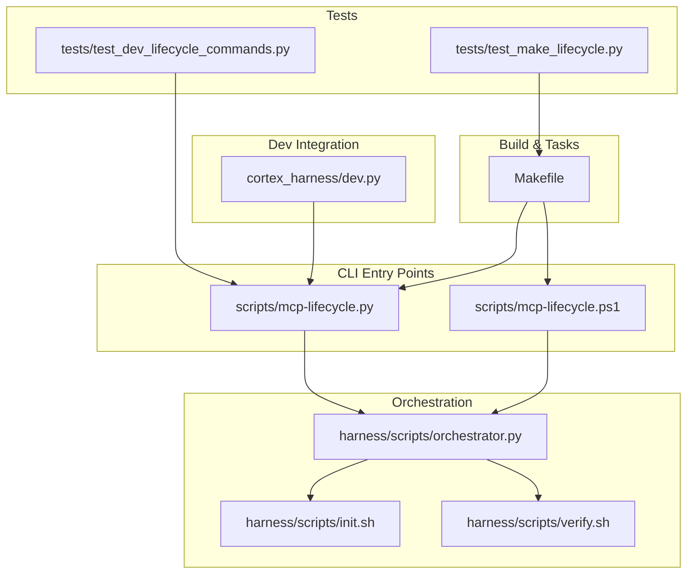
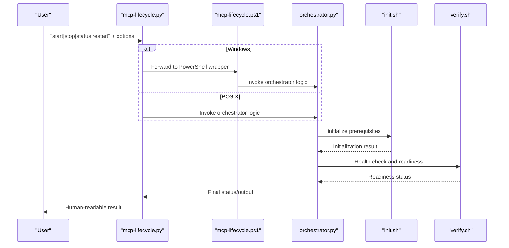
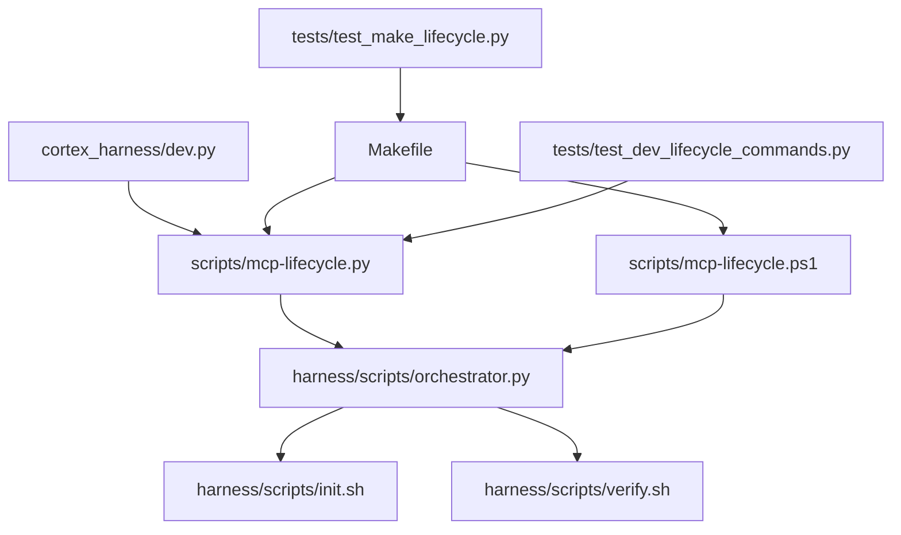

# Lifecycle Management Commands

<cite>
**Referenced Files in This Document**
- [scripts/mcp-lifecycle.py](file://scripts/mcp-lifecycle.py)
- [scripts/mcp-lifecycle.ps1](file://scripts/mcp-lifecycle.ps1)
- [Makefile](file://Makefile)
- [harness/scripts/orchestrator.py](file://harness/scripts/orchestrator.py)
- [harness/scripts/init.sh](file://harness/scripts/init.sh)
- [harness/scripts/verify.sh](file://harness/scripts/verify.sh)
- [cortex_harness/dev.py](file://cortex_harness/dev.py)
- [tests/test_dev_lifecycle_commands.py](file://tests/test_dev_lifecycle_commands.py)
- [tests/test_make_lifecycle.py](file://tests/test_make_lifecycle.py)
- [docs/specs/harness-cli.md](file://docs/specs/harness-cli.md)
- [docs/HARNESS_WORKFLOW.md](file://docs/HARNESS_WORKFLOW.md)
</cite>

## Table of Contents
1. [Introduction](#introduction)
2. [Project Structure](#project-structure)
3. [Core Components](#core-components)
4. [Architecture Overview](#architecture-overview)
5. [Detailed Component Analysis](#detailed-component-analysis)
6. [Dependency Analysis](#dependency-analysis)
7. [Performance Considerations](#performance-considerations)
8. [Troubleshooting Guide](#troubleshooting-guide)
9. [Conclusion](#conclusion)
10. [Appendices](#appendices)

## Introduction
This document describes the lifecycle management commands for Cortex Harness, focusing on service orchestration for MCP servers and background processes. It covers start, stop, status, and restart operations, including parameters for process management, ports, logging, and monitoring endpoints. It also provides examples for development and production environments, integration with system service managers and CI/CD pipelines, and troubleshooting guidance for startup failures, resource conflicts, and performance monitoring.

## Project Structure
The lifecycle management functionality is implemented across Python scripts, shell helpers, Make targets, and tests:
- Core CLI entry points and command implementations are under scripts and harness directories.
- Platform-specific wrappers exist for Windows PowerShell.
- Make targets provide cross-platform convenience for common workflows.
- Tests validate behavior and edge cases.

**Diagram sources**
- [scripts/mcp-lifecycle.py](file://scripts/mcp-lifecycle.py)
- [scripts/mcp-lifecycle.ps1](file://scripts/mcp-lifecycle.ps1)
- [harness/scripts/orchestrator.py](file://harness/scripts/orchestrator.py)
- [harness/scripts/init.sh](file://harness/scripts/init.sh)
- [harness/scripts/verify.sh](file://harness/scripts/verify.sh)
- [cortex_harness/dev.py](file://cortex_harness/dev.py)
- [Makefile](file://Makefile)
- [tests/test_dev_lifecycle_commands.py](file://tests/test_dev_lifecycle_commands.py)
- [tests/test_make_lifecycle.py](file://tests/test_make_lifecycle.py)

**Section sources**
- [scripts/mcp-lifecycle.py](file://scripts/mcp-lifecycle.py)
- [scripts/mcp-lifecycle.ps1](file://scripts/mcp-lifecycle.ps1)
- [harness/scripts/orchestrator.py](file://harness/scripts/orchestrator.py)
- [harness/scripts/init.sh](file://harness/scripts/init.sh)
- [harness/scripts/verify.sh](file://harness/scripts/verify.sh)
- [cortex_harness/dev.py](file://cortex_harness/dev.py)
- [Makefile](file://Makefile)
- [tests/test_dev_lifecycle_commands.py](file://tests/test_dev_lifecycle_commands.py)
- [tests/test_make_lifecycle.py](file://tests/test_make_lifecycle.py)

## Core Components
- Command dispatcher and argument parsing: The main CLI script defines commands (start, stop, status, restart) and parses options such as port, log level, environment flags, and monitoring endpoints.
- Orchestrator: Manages process lifecycles, health checks, and cleanup. It coordinates initialization and verification steps via helper scripts.
- Platform wrappers: A PowerShell wrapper ensures consistent behavior on Windows.
- Dev integration: The dev module integrates lifecycle commands into local development flows.
- Make targets: Provide convenient aliases for common tasks and ensure parity across platforms.

Key responsibilities:
- Start: Launch MCP server(s), background services, and monitoring processes; configure ports and logging; expose health endpoints.
- Stop: Gracefully terminate managed processes and perform cleanup.
- Status: Report health, resource usage, and operational state.
- Restart: Perform rolling updates by stopping and starting services with minimal downtime.

**Section sources**
- [scripts/mcp-lifecycle.py](file://scripts/mcp-lifecycle.py)
- [harness/scripts/orchestrator.py](file://harness/scripts/orchestrator.py)
- [scripts/mcp-lifecycle.ps1](file://scripts/mcp-lifecycle.ps1)
- [cortex_harness/dev.py](file://cortex_harness/dev.py)
- [Makefile](file://Makefile)

## Architecture Overview
The lifecycle management architecture centers around a CLI that delegates to an orchestrator. The orchestrator uses platform-appropriate helpers to initialize and verify services, then manages their runtime state.

**Diagram sources**
- [scripts/mcp-lifecycle.py](file://scripts/mcp-lifecycle.py)
- [scripts/mcp-lifecycle.ps1](file://scripts/mcp-lifecycle.ps1)
- [harness/scripts/orchestrator.py](file://harness/scripts/orchestrator.py)
- [harness/scripts/init.sh](file://harness/scripts/init.sh)
- [harness/scripts/verify.sh](file://harness/scripts/verify.sh)

## Detailed Component Analysis

### Start Command
Purpose:
- Launch MCP servers and related background services.
- Configure process management options, ports, logging levels, and monitoring endpoints.
- Ensure prerequisites are initialized and services become ready.

Parameters:
- Process management:
  - Background mode flag to detach from terminal.
  - PID file or process group handling for tracking.
  - Restart policy (e.g., always-on during session).
- Ports:
  - Primary service port configuration.
  - Secondary ports for auxiliary services if applicable.
- Logging:
  - Log level selection (e.g., debug, info, warn, error).
  - Log destination (stdout/stderr or file-based).
- Monitoring:
  - Enable/disable health endpoint exposure.
  - Metrics endpoint toggle and path configuration.

Behavior:
- Validates arguments and environment.
- Initializes dependencies via helper scripts.
- Starts services and performs readiness checks.
- Reports success or failure with actionable details.

Example usage patterns:
- Development: Start with verbose logs and local ports.
- Production: Start in background mode with structured logging and metrics enabled.

**Section sources**
- [scripts/mcp-lifecycle.py](file://scripts/mcp-lifecycle.py)
- [harness/scripts/orchestrator.py](file://harness/scripts/orchestrator.py)
- [harness/scripts/init.sh](file://harness/scripts/init.sh)
- [harness/scripts/verify.sh](file://harness/scripts/verify.sh)

### Stop Command
Purpose:
- Gracefully shut down managed services.
- Clean up temporary files, locks, and PID records.
- Ensure no orphaned processes remain.

Parameters:
- Forceful termination option when graceful shutdown fails.
- Target scope (all services vs specific service identifiers).
- Timeout for graceful shutdown before force kill.

Behavior:
- Locates running processes using tracked identifiers.
- Sends termination signals and waits for exit.
- Performs cleanup of artifacts and state.
- Returns status indicating completion or partial success.

Example usage patterns:
- Interactive stop after development session.
- Automated stop in CI/CD teardown stages.

**Section sources**
- [scripts/mcp-lifecycle.py](file://scripts/mcp-lifecycle.py)
- [harness/scripts/orchestrator.py](file://harness/scripts/orchestrator.py)

### Status Command
Purpose:
- Check service health, resource usage, and operational state.
- Surface readiness and liveness information.
- Provide diagnostics for troubleshooting.

Parameters:
- Output format (text or machine-readable).
- Detail level (summary vs full diagnostics).
- Specific service selector if multiple services are managed.

Behavior:
- Queries health endpoints and internal state.
- Aggregates resource metrics (CPU, memory, open handles).
- Reports overall status and per-service details.

Example usage patterns:
- Quick health check before deployment.
- Detailed diagnostics when errors occur.

**Section sources**
- [scripts/mcp-lifecycle.py](file://scripts/mcp-lifecycle.py)
- [harness/scripts/orchestrator.py](file://harness/scripts/orchestrator.py)
- [harness/scripts/verify.sh](file://harness/scripts/verify.sh)

### Restart Command
Purpose:
- Perform rolling updates and maintenance operations.
- Minimize downtime by coordinating stop/start phases.

Parameters:
- Rolling strategy (sequential vs parallel).
- Health gate to prevent restart if preconditions fail.
- Rollback trigger based on post-start health checks.

Behavior:
- Validates current state and readiness.
- Stops services gracefully according to strategy.
- Restarts services and verifies readiness.
- Reverts changes if health checks fail.

Example usage patterns:
- Zero-downtime update in development clusters.
- Maintenance window restart in production.

**Section sources**
- [scripts/mcp-lifecycle.py](file://scripts/mcp-lifecycle.py)
- [harness/scripts/orchestrator.py](file://harness/scripts/orchestrator.py)

### Platform-Specific Wrapper (Windows)
Purpose:
- Provide consistent lifecycle behavior on Windows.
- Bridge CLI calls to PowerShell-based orchestration.

Behavior:
- Parses arguments similarly to the main CLI.
- Invokes orchestrator logic through PowerShell.
- Ensures process isolation and cleanup on Windows.

**Section sources**
- [scripts/mcp-lifecycle.ps1](file://scripts/mcp-lifecycle.ps1)
- [scripts/mcp-lifecycle.py](file://scripts/mcp-lifecycle.py)

### Dev Integration
Purpose:
- Integrate lifecycle commands into local development workflows.
- Provide convenience functions for developers.

Behavior:
- Exposes high-level APIs for start/stop/status/restart.
- Integrates with IDE or scripting tools.

**Section sources**
- [cortex_harness/dev.py](file://cortex_harness/dev.py)
- [scripts/mcp-lifecycle.py](file://scripts/mcp-lifecycle.py)

### Make Targets
Purpose:
- Offer cross-platform aliases for common lifecycle tasks.
- Ensure parity between macOS/Linux and Windows workflows.

Behavior:
- Delegates to appropriate CLI or wrapper scripts.
- Encapsulates environment setup and defaults.

**Section sources**
- [Makefile](file://Makefile)
- [scripts/mcp-lifecycle.py](file://scripts/mcp-lifecycle.py)
- [scripts/mcp-lifecycle.ps1](file://scripts/mcp-lifecycle.ps1)

## Dependency Analysis
Lifecycle commands depend on orchestrator logic and helper scripts. Tests validate behavior and ensure reliability.

**Diagram sources**
- [scripts/mcp-lifecycle.py](file://scripts/mcp-lifecycle.py)
- [scripts/mcp-lifecycle.ps1](file://scripts/mcp-lifecycle.ps1)
- [harness/scripts/orchestrator.py](file://harness/scripts/orchestrator.py)
- [harness/scripts/init.sh](file://harness/scripts/init.sh)
- [harness/scripts/verify.sh](file://harness/scripts/verify.sh)
- [cortex_harness/dev.py](file://cortex_harness/dev.py)
- [Makefile](file://Makefile)
- [tests/test_dev_lifecycle_commands.py](file://tests/test_dev_lifecycle_commands.py)
- [tests/test_make_lifecycle.py](file://tests/test_make_lifecycle.py)

**Section sources**
- [scripts/mcp-lifecycle.py](file://scripts/mcp-lifecycle.py)
- [scripts/mcp-lifecycle.ps1](file://scripts/mcp-lifecycle.ps1)
- [harness/scripts/orchestrator.py](file://harness/scripts/orchestrator.py)
- [harness/scripts/init.sh](file://harness/scripts/init.sh)
- [harness/scripts/verify.sh](file://harness/scripts/verify.sh)
- [cortex_harness/dev.py](file://cortex_harness/dev.py)
- [Makefile](file://Makefile)
- [tests/test_dev_lifecycle_commands.py](file://tests/test_dev_lifecycle_commands.py)
- [tests/test_make_lifecycle.py](file://tests/test_make_lifecycle.py)

## Performance Considerations
- Prefer background mode for long-running services to avoid blocking terminals.
- Use appropriate log levels to balance observability and overhead.
- Enable metrics endpoints selectively to reduce instrumentation cost.
- Tune restart strategies to minimize churn and resource spikes.
- Monitor resource usage via status output and external observability tools.

[No sources needed since this section provides general guidance]

## Troubleshooting Guide
Common issues and resolutions:
- Startup failures:
  - Validate port availability and permissions.
  - Check initialization script outputs and prerequisites.
  - Review health check responses and readiness criteria.
- Resource conflicts:
  - Inspect status output for overlapping services.
  - Adjust port configurations and process isolation settings.
- Performance monitoring:
  - Use detailed status reports to identify bottlenecks.
  - Correlate metrics with application logs for root cause analysis.

Operational tips:
- Use verbose logging during development to capture early errors.
- Employ rolling restarts with health gates to detect regressions quickly.
- Integrate status checks into CI/CD pipelines to catch issues early.

**Section sources**
- [harness/scripts/init.sh](file://harness/scripts/init.sh)
- [harness/scripts/verify.sh](file://harness/scripts/verify.sh)
- [scripts/mcp-lifecycle.py](file://scripts/mcp-lifecycle.py)
- [tests/test_dev_lifecycle_commands.py](file://tests/test_dev_lifecycle_commands.py)

## Conclusion
Cortex Harness lifecycle management provides robust commands for starting, stopping, checking status, and restarting MCP servers and background services. With clear parameterization for process management, ports, logging, and monitoring, it supports both development and production workflows. Integration with system service managers, container orchestration, and CI/CD pipelines is facilitated through consistent interfaces and Make targets. The included troubleshooting guidance helps diagnose startup failures, resolve resource conflicts, and monitor performance effectively.

[No sources needed since this section summarizes without analyzing specific files]

## Appendices

### Environment and Configuration References
- Harness workflow documentation outlines recommended practices and integration patterns.
- CLI specification documents define command contracts and expected behaviors.

**Section sources**
- [docs/HARNESS_WORKFLOW.md](file://docs/HARNESS_WORKFLOW.md)
- [docs/specs/harness-cli.md](file://docs/specs/harness-cli.md)