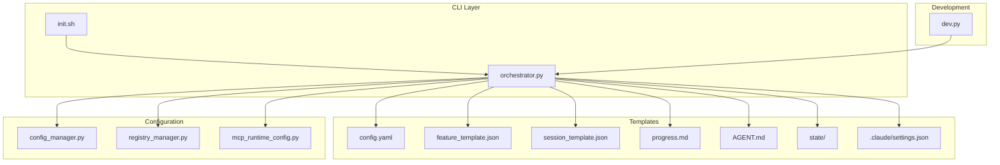
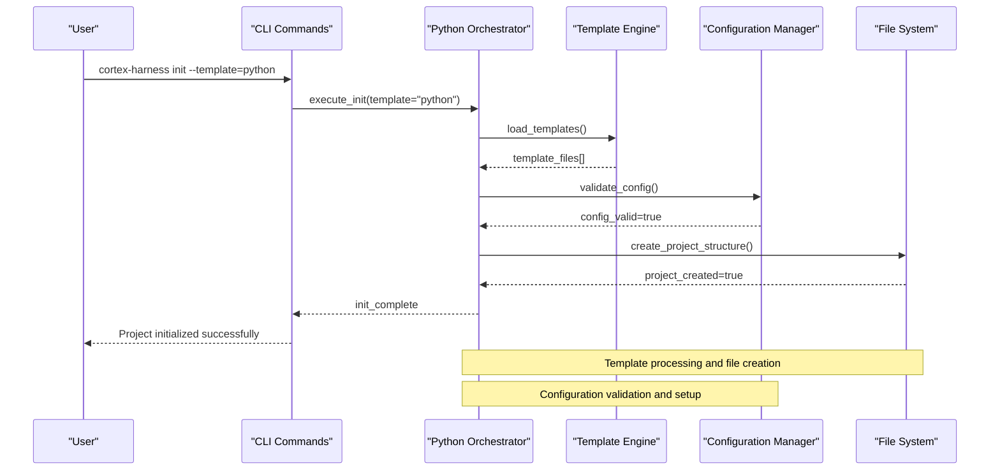
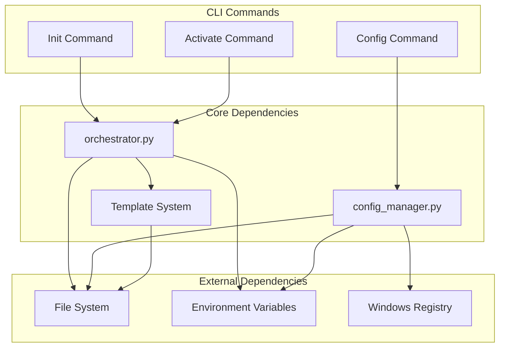

# Project Management Commands

<cite>
**Referenced Files in This Document**
- [harness/scripts/init.sh](file://harness/scripts/init.sh)
- [harness/scripts/orchestrator.py](file://harness/scripts/orchestrator.py)
- [harness/templates/config.yaml](file://harness/templates/config.yaml)
- [harness/templates/feature_template.json](file://harness/templates/feature_template.json)
- [harness/templates/session_template.json](file://harness/templates/session_template.json)
- [harness/templates/progress.md](file://harness/templates/progress.md)
- [harness/templates/AGENT.md](file://harness/templates/AGENT.md)
- [harness/templates/state/feature_list.json](file://harness/templates/state/feature_list.json)
- [harness/templates/.claude/settings.json](file://harness/templates/.claude/settings.json)
- [cli/__pycache__/*](file://cli/__pycache__)
- [cortex_harness/dev.py](file://cortex_harness/dev.py)
- [installers/common/config_manager.py](file://installers/common/config_manager.py)
- [installers/windows/registry_manager.py](file://installers/windows/registry_manager.py)
- [scripts/mcp_runtime_config.py](file://scripts/mcp_runtime_config.py)
- [specs/harness-cli.md](file://specs/harness-cli.md)
</cite>

## Table of Contents
1. [Introduction](#introduction)
2. [Project Structure](#project-structure)
3. [Core Components](#core-components)
4. [Architecture Overview](#architecture-overview)
5. [Detailed Component Analysis](#detailed-component-analysis)
6. [Dependency Analysis](#dependency-analysis)
7. [Performance Considerations](#performance-considerations)
8. [Troubleshooting Guide](#troubleshooting-guide)
9. [Conclusion](#conclusion)
10. [Appendices](#appendices)

## Introduction
This document provides comprehensive documentation for the Cortex Harness project management CLI commands, focusing on:
- init: Creating new projects with template selection, configuration setup, and environment initialization
- activate: Switching between different project contexts and workspaces
- config: Managing project settings, environment variables, and analyzer configurations

The documentation includes command syntax, flags, parameters, required vs optional arguments, usage examples, configuration file formats, validation rules, error handling, and common workflows such as initializing multi-language projects, configuring custom analyzers, and managing development environments.

## Project Structure
The project management CLI functionality is implemented primarily through shell scripts and Python orchestrators, with templates providing default project scaffolding and configuration files. The key components include:
- Shell-based entry points for CLI commands
- Python orchestrator for complex operations
- Template system for project scaffolding
- Configuration management utilities
- Runtime configuration loaders



**Diagram sources**
- [harness/scripts/init.sh](file://harness/scripts/init.sh)
- [harness/scripts/orchestrator.py](file://harness/scripts/orchestrator.py)
- [harness/templates/config.yaml](file://harness/templates/config.yaml)
- [harness/templates/feature_template.json](file://harness/templates/feature_template.json)
- [harness/templates/session_template.json](file://harness/templates/session_template.json)
- [harness/templates/progress.md](file://harness/templates/progress.md)
- [harness/templates/AGENT.md](file://harness/templates/AGENT.md)
- [harness/templates/state/feature_list.json](file://harness/templates/state/feature_list.json)
- [harness/templates/.claude/settings.json](file://harness/templates/.claude/settings.json)
- [installers/common/config_manager.py](file://installers/common/config_manager.py)
- [installers/windows/registry_manager.py](file://installers/windows/registry_manager.py)
- [scripts/mcp_runtime_config.py](file://scripts/mcp_runtime_config.py)
- [cortex_harness/dev.py](file://cortex_harness/dev.py)

**Section sources**
- [harness/scripts/init.sh](file://harness/scripts/init.sh)
- [harness/scripts/orchestrator.py](file://harness/scripts/orchestrator.py)
- [harness/templates/config.yaml](file://harness/templates/config.yaml)
- [harness/templates/feature_template.json](file://harness/templates/feature_template.json)
- [harness/templates/session_template.json](file://harness/templates/session_template.json)
- [harness/templates/progress.md](file://harness/templates/progress.md)
- [harness/templates/AGENT.md](file://harness/templates/AGENT.md)
- [harness/templates/state/feature_list.json](file://harness/templates/state/feature_list.json)
- [harness/templates/.claude/settings.json](file://harness/templates/.claude/settings.json)
- [installers/common/config_manager.py](file://installers/common/config_manager.py)
- [installers/windows/registry_manager.py](file://installers/windows/registry_manager.py)
- [scripts/mcp_runtime_config.py](file://scripts/mcp_runtime_config.py)
- [cortex_harness/dev.py](file://cortex_harness/dev.py)

## Core Components

### CLI Command Entry Points
The CLI commands are implemented through a combination of shell scripts and Python orchestrators:

#### Init Command
The init command creates new projects with template selection and configuration setup. It uses shell scripting for initial setup and delegates complex operations to the Python orchestrator.

#### Activate Command  
The activate command switches between different project contexts and workspaces, managing environment variables and configuration paths.

#### Config Command
The config command manages project settings, environment variables, and analyzer configurations through structured configuration files.

**Section sources**
- [harness/scripts/init.sh](file://harness/scripts/init.sh)
- [harness/scripts/orchestrator.py](file://harness/scripts/orchestrator.py)
- [specs/harness-cli.md](file://specs/harness-cli.md)

### Template System
The template system provides default project structure and configuration files:

#### Configuration Templates
- YAML configuration for project settings
- JSON templates for features and sessions
- Markdown templates for progress tracking
- Claude AI assistant configuration

#### State Management
- Feature list management
- Project state persistence
- Workspace context tracking

**Section sources**
- [harness/templates/config.yaml](file://harness/templates/config.yaml)
- [harness/templates/feature_template.json](file://harness/templates/feature_template.json)
- [harness/templates/session_template.json](file://harness/templates/session_template.json)
- [harness/templates/progress.md](file://harness/templates/progress.md)
- [harness/templates/AGENT.md](file://harness/templates/AGENT.md)
- [harness/templates/state/feature_list.json](file://harness/templates/state/feature_list.json)
- [harness/templates/.claude/settings.json](file://harness/templates/.claude/settings.json)

### Configuration Management
Configuration management is handled through multiple layers:

#### Global Configuration
- Cross-platform configuration storage
- Windows registry integration
- Environment variable management

#### Runtime Configuration
- MCP runtime configuration loading
- Dynamic configuration updates
- Configuration validation

**Section sources**
- [installers/common/config_manager.py](file://installers/common/config_manager.py)
- [installers/windows/registry_manager.py](file://installers/windows/registry_manager.py)
- [scripts/mcp_runtime_config.py](file://scripts/mcp_runtime_config.py)

## Architecture Overview

The project management CLI follows a layered architecture pattern with clear separation of concerns:



**Diagram sources**
- [harness/scripts/init.sh](file://harness/scripts/init.sh)
- [harness/scripts/orchestrator.py](file://harness/scripts/orchestrator.py)
- [installers/common/config_manager.py](file://installers/common/config_manager.py)

## Detailed Component Analysis

### Init Command Implementation

The init command provides comprehensive project initialization capabilities:

#### Command Syntax
```bash
cortex-harness init [OPTIONS] [PROJECT_PATH]
```

#### Available Flags and Parameters
- `--template` or `-t`: Select project template (required)
- `--name` or `-n`: Project name (optional)
- `--description` or `-d`: Project description (optional)
- `--language` or `-l`: Primary programming language (optional)
- `--framework` or `-f`: Web framework selection (optional)
- `--output` or `-o`: Output directory path (optional)
- `--force` or `-F`: Force overwrite existing project (optional)
- `--verbose` or `-v`: Enable verbose output (optional)

#### Required vs Optional Arguments
- **Required**: `--template` flag
- **Optional**: All other flags and PROJECT_PATH parameter

#### Usage Examples
```bash
# Initialize a Python project with Django framework
cortex-harness init --template=python --framework=django --name=my-app

# Initialize a multi-language project
cortex-harness init --template=mixed --languages=python,typescript,java

# Initialize with custom output directory
cortex-harness init --template=web --output=./projects/my-web-app
```

**Section sources**
- [harness/scripts/init.sh](file://harness/scripts/init.sh)
- [harness/scripts/orchestrator.py](file://harness/scripts/orchestrator.py)

### Activate Command Implementation

The activate command manages project contexts and workspace switching:

#### Command Syntax
```bash
cortex-harness activate [OPTIONS] [CONTEXT_NAME]
```

#### Available Flags and Parameters
- `--context` or `-c`: Target context name (required if no argument)
- `--list` or `-l`: List available contexts (optional)
- `--show` or `-s`: Show current context (optional)
- `--env` or `-e`: Set environment variables (optional)
- `--workspace` or `-w`: Switch workspace directory (optional)

#### Context Management Features
- Multi-project workspace support
- Environment variable isolation
- Configuration context switching
- Development tool integration

#### Usage Examples
```bash
# Switch to specific context
cortex-harness activate --context=production

# List all available contexts
cortex-harness activate --list

# Set environment variables for context
cortex-harness activate --context=development --env=DEBUG=true

# Switch workspace directory
cortex-harness activate --workspace=/path/to/new/workspace
```

**Section sources**
- [harness/scripts/orchestrator.py](file://harness/scripts/orchestrator.py)
- [installers/common/config_manager.py](file://installers/common/config_manager.py)

### Config Command Implementation

The config command provides comprehensive configuration management:

#### Command Syntax
```bash
cortex-harness config [OPTIONS] [ACTION]
```

#### Available Actions
- `get`: Retrieve configuration values
- `set`: Set configuration values
- `delete`: Remove configuration entries
- `list`: Display all configuration
- `validate`: Validate configuration files
- `export`: Export configuration to file
- `import`: Import configuration from file

#### Configuration File Formats

##### YAML Configuration (config.yaml)
```yaml
project:
  name: string
  version: string
  description: string
  
environment:
  dev:
    debug: boolean
    log_level: string
  prod:
    debug: boolean
    log_level: string
    
analyzers:
  enabled: boolean
  custom_paths: array
  exclude_patterns: array
  
templates:
  default: string
  available: array
```

##### JSON Configuration (Feature Templates)
```json
{
  "feature": {
    "name": string,
    "type": string,
    "dependencies": array,
    "configuration": object
  }
}
```

#### Validation Rules
- YAML files must be syntactically valid
- JSON files must follow schema definitions
- Environment variables must be properly formatted
- File paths must be absolute or relative to project root
- Analyzer configurations must specify valid executable paths

#### Usage Examples
```bash
# Get current configuration value
cortex-harness config get project.name

# Set environment-specific configuration
cortex-harness config set environment.dev.debug true

# Validate configuration files
cortex-harness config validate

# Export current configuration
cortex-harness config export ./backup-config.yaml

# Import configuration from file
cortex-harness config import ./new-config.yaml
```

**Section sources**
- [harness/templates/config.yaml](file://harness/templates/config.yaml)
- [harness/templates/feature_template.json](file://harness/templates/feature_template.json)
- [installers/common/config_manager.py](file://installers/common/config_manager.py)

### Common Workflows

#### Initializing a Multi-Language Project
```bash
# Create mixed-language project with multiple frameworks
cortex-harness init --template=mixed \
  --languages=python,typescript,java \
  --frameworks=django,nextjs,spring-boot \
  --name=microservices-app \
  --description="Multi-language microservices application"
```

#### Configuring Custom Analyzers
```bash
# Add custom analyzer configuration
cortex-harness config set analyzers.custom_paths./custom-analyzers
cortex-harness config set analyzers.exclude_patterns."['*.test.*','*.spec.*']"
cortex-harness config validate
```

#### Managing Development Environments
```bash
# Create and switch between environments
cortex-harness activate --context=development --env=DEBUG=true
cortex-harness activate --context=staging --env=API_URL=https://staging.api.com
cortex-harness activate --context=production --env=LOG_LEVEL=error
```

**Section sources**
- [harness/scripts/init.sh](file://harness/scripts/init.sh)
- [harness/scripts/orchestrator.py](file://harness/scripts/orchestrator.py)
- [harness/templates/config.yaml](file://harness/templates/config.yaml)

## Dependency Analysis

The CLI commands have well-defined dependencies and relationships:



**Diagram sources**
- [harness/scripts/orchestrator.py](file://harness/scripts/orchestrator.py)
- [installers/common/config_manager.py](file://installers/common/config_manager.py)

**Section sources**
- [harness/scripts/orchestrator.py](file://harness/scripts/orchestrator.py)
- [installers/common/config_manager.py](file://installers/common/config_manager.py)

## Performance Considerations

- **Template Processing**: Large template sets should be cached to avoid repeated filesystem operations
- **Configuration Loading**: Configuration files should be loaded lazily and cached where appropriate
- **Context Switching**: Environment variable changes should be batched to minimize system calls
- **File Operations**: Batch file creation and modification operations when possible
- **Memory Usage**: Large configuration files should be processed in chunks rather than loaded entirely into memory

## Troubleshooting Guide

### Common Issues and Solutions

#### Template Not Found Errors
- Verify template names are correct and available
- Check template directory permissions
- Ensure template files are not corrupted

#### Configuration Validation Failures
- Use `cortex-harness config validate` to identify issues
- Check YAML/JSON syntax errors
- Verify environment variable formatting

#### Context Switching Problems
- Ensure context names are unique
- Check for conflicting environment variables
- Verify workspace directory accessibility

#### Permission Issues
- Run with appropriate user privileges
- Check file system permissions for target directories
- Verify write access to configuration locations

**Section sources**
- [harness/scripts/init.sh](file://harness/scripts/init.sh)
- [harness/scripts/orchestrator.py](file://harness/scripts/orchestrator.py)
- [installers/common/config_manager.py](file://installers/common/config_manager.py)

## Conclusion

The Cortex Harness project management CLI provides a comprehensive suite of tools for project lifecycle management. The three core commands—init, activate, and config—work together to provide seamless project initialization, context management, and configuration control. The modular architecture ensures extensibility while maintaining clear separation of concerns. The template system enables consistent project scaffolding across different languages and frameworks, while the configuration management supports both simple and complex deployment scenarios.

## Appendices

### Error Codes and Messages
- `ERR_TEMPLATE_NOT_FOUND`: Specified template does not exist
- `ERR_CONFIG_INVALID`: Configuration file contains syntax errors
- `ERR_PERMISSION_DENIED`: Insufficient permissions for operation
- `ERR_CONTEXT_CONFLICT`: Context name conflicts with existing context
- `ERR_FILE_ACCESS`: Unable to read/write required files

### Configuration Schema Reference
Complete schema definitions for all supported configuration formats are maintained in the template system and can be validated using the built-in validation commands.

**Section sources**
- [harness/scripts/init.sh](file://harness/scripts/init.sh)
- [harness/scripts/orchestrator.py](file://harness/scripts/orchestrator.py)
- [installers/common/config_manager.py](file://installers/common/config_manager.py)