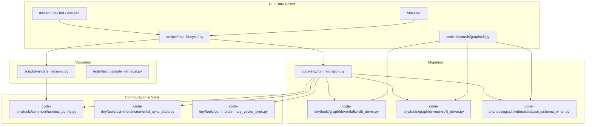
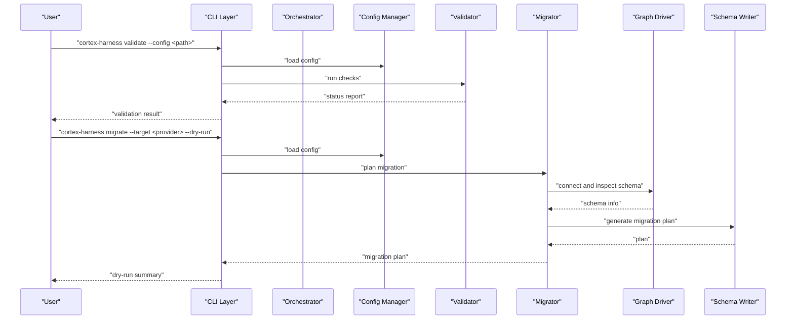
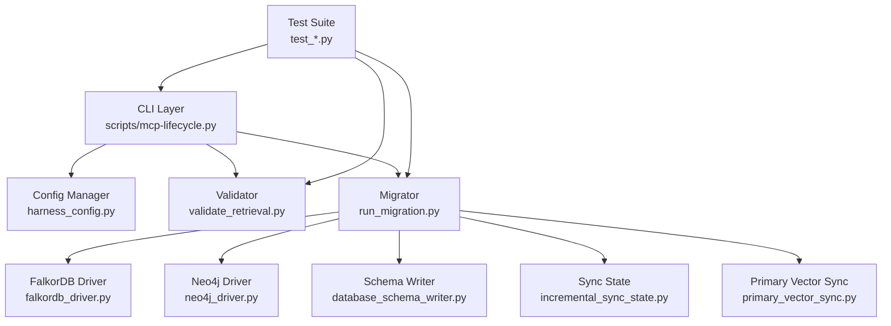

# Utility Commands

<cite>
**Referenced Files in This Document**
- [cli.md](file://docs/specs/cli.md)
- [harness-cli.md](file://docs/specs/harness-cli.md)
- [Makefile](file://Makefile)
- [dev.sh](file://dev.sh)
- [dev.bat](file://dev.bat)
- [dev.ps1](file://dev.ps1)
- [run_migration.py](file://code-tiny/run_migration.py)
- [scripts/mcp-lifecycle.py](file://scripts/mcp-lifecycle.py)
- [scripts/validate_retrieval.py](file://scripts/validate_retrieval.py)
- [graph/cli.py](file://code-tiny/tools/graph/cli.py)
- [graph/driver/falkordb_driver.py](file://code-tiny/tools/graph/driver/falkordb_driver.py)
- [graph/driver/neo4j_driver.py](file://code-tiny/tools/graph/driver/neo4j_driver.py)
- [graph/writer/database_schema_writer.py](file://code-tiny/tools/graph/writer/database_schema_writer.py)
- [common/harness_config.py](file://code-tiny/tools/common/harness_config.py)
- [incremental_sync_state.py](file://code-tiny/tools/common/incremental_sync_state.py)
- [primary_vector_sync.py](file://code-tiny/tools/common/primary_vector_sync.py)
- [test_dev_lifecycle_commands.py](file://tests/test_dev_lifecycle_commands.py)
- [test_make_lifecycle.py](file://tests/test_make_lifecycle.py)
- [test_validate_retrieval.py](file://tests/test_validate_retrieval.py)
</cite>

## Table of Contents
1. [Introduction](#introduction)
2. [Project Structure](#project-structure)
3. [Core Components](#core-components)
4. [Architecture Overview](#architecture-overview)
5. [Detailed Component Analysis](#detailed-component-analysis)
6. [Dependency Analysis](#dependency-analysis)
7. [Performance Considerations](#performance-considerations)
8. [Troubleshooting Guide](#troubleshooting-guide)
9. [Conclusion](#conclusion)
10. [Appendices](#appendices)

## Introduction
This document describes the utility commands available in Cortex Harness for system maintenance, configuration validation, database migrations, testing, and data import/export. It focuses on:
- validate: checks configuration validity, dependency resolution, and system readiness
- migrate: performs database schema migrations, data format upgrades, and version compatibility checks
- test: runs validation suites, performance benchmarks, and integration tests
- export/import: manages data backup, restoration, and cross-platform compatibility

The goal is to provide clear guidance for administrators and developers to operate these utilities safely and effectively, including parameters, workflows, error handling, rollback strategies, and best practices.

## Project Structure
Cortex Harness exposes CLI capabilities through multiple entry points:
- Top-level scripts and Make targets orchestrate lifecycle tasks
- Graph tooling provides a dedicated CLI for graph operations
- Validation and migration utilities are implemented as Python scripts
- Tests cover command behavior and integration flows

**Diagram sources**
- [Makefile](file://Makefile)
- [dev.sh](file://dev.sh)
- [dev.bat](file://dev.bat)
- [dev.ps1](file://dev.ps1)
- [scripts/mcp-lifecycle.py](file://scripts/mcp-lifecycle.py)
- [scripts/validate_retrieval.py](file://scripts/validate_retrieval.py)
- [code-tiny/run_migration.py](file://code-tiny/run_migration.py)
- [code-tiny/tools/graph/cli.py](file://code-tiny/tools/graph/cli.py)
- [code-tiny/tools/graph/driver/falkordb_driver.py](file://code-tiny/tools/graph/driver/falkordb_driver.py)
- [code-tiny/tools/graph/driver/neo4j_driver.py](file://code-tiny/tools/graph/driver/neo4j_driver.py)
- [code-tiny/tools/graph/writer/database_schema_writer.py](file://code-tiny/tools/graph/writer/database_schema_writer.py)
- [code-tiny/tools/common/harness_config.py](file://code-tiny/tools/common/harness_config.py)
- [code-tiny/tools/common/incremental_sync_state.py](file://code-tiny/tools/common/incremental_sync_state.py)
- [code-tiny/tools/common/primary_vector_sync.py](file://code-tiny/tools/common/primary_vector_sync.py)

**Section sources**
- [cli.md](file://docs/specs/cli.md)
- [harness-cli.md](file://docs/specs/harness-cli.md)
- [Makefile](file://Makefile)
- [dev.sh](file://dev.sh)
- [dev.bat](file://dev.bat)
- [dev.ps1](file://dev.ps1)
- [scripts/mcp-lifecycle.py](file://scripts/mcp-lifecycle.py)
- [scripts/validate_retrieval.py](file://scripts/validate_retrieval.py)
- [code-tiny/run_migration.py](file://code-tiny/run_migration.py)
- [code-tiny/tools/graph/cli.py](file://code-tiny/tools/graph/cli.py)
- [code-tiny/tools/graph/driver/falkordb_driver.py](file://code-tiny/tools/graph/driver/falkordb_driver.py)
- [code-tiny/tools/graph/driver/neo4j_driver.py](file://code-tiny/tools/graph/driver/neo4j_driver.py)
- [code-tiny/tools/graph/writer/database_schema_writer.py](file://code-tiny/tools/graph/writer/database_schema_writer.py)
- [code-tiny/tools/common/harness_config.py](file://code-tiny/tools/common/harness_config.py)
- [code-tiny/tools/common/incremental_sync_state.py](file://code-tiny/tools/common/incremental_sync_state.py)
- [code-tiny/tools/common/primary_vector_sync.py](file://code-tiny/tools/common/primary_vector_sync.py)

## Core Components
- Configuration management: centralizes environment and harness settings used by all utilities
- Validation pipeline: verifies configuration, dependencies, and runtime readiness
- Migration engine: orchestrates schema changes, data upgrades, and provider-specific steps
- Test harness: executes unit, integration, and performance tests with reporting
- Export/import utilities: serialize and deserialize graph and state data across platforms

Key implementation references:
- Configuration: [harness_config.py](file://code-tiny/tools/common/harness_config.py)
- Validation: [validate_retrieval.py](file://scripts/validate_retrieval.py), [test_validate_retrieval.py](file://tests/test_validate_retrieval.py)
- Migration: [run_migration.py](file://code-tiny/run_migration.py), [falkordb_driver.py](file://code-tiny/tools/graph/driver/falkordb_driver.py), [neo4j_driver.py](file://code-tiny/tools/graph/driver/neo4j_driver.py), [database_schema_writer.py](file://code-tiny/tools/graph/writer/database_schema_writer.py)
- Lifecycle orchestration: [mcp-lifecycle.py](file://scripts/mcp-lifecycle.py), [Makefile](file://Makefile)
- Graph CLI: [graph/cli.py](file://code-tiny/tools/graph/cli.py)

**Section sources**
- [code-tiny/tools/common/harness_config.py](file://code-tiny/tools/common/harness_config.py)
- [scripts/validate_retrieval.py](file://scripts/validate_retrieval.py)
- [tests/test_validate_retrieval.py](file://tests/test_validate_retrieval.py)
- [code-tiny/run_migration.py](file://code-tiny/run_migration.py)
- [code-tiny/tools/graph/driver/falkordb_driver.py](file://code-tiny/tools/graph/driver/falkordb_driver.py)
- [code-tiny/tools/graph/driver/neo4j_driver.py](file://code-tiny/tools/graph/driver/neo4j_driver.py)
- [code-tiny/tools/graph/writer/database_schema_writer.py](file://code-tiny/tools/graph/writer/database_schema_writer.py)
- [scripts/mcp-lifecycle.py](file://scripts/mcp-lifecycle.py)
- [Makefile](file://Makefile)
- [code-tiny/tools/graph/cli.py](file://code-tiny/tools/graph/cli.py)

## Architecture Overview
The utility commands follow a layered architecture:
- CLI layer: parses arguments and dispatches to handlers
- Orchestration layer: coordinates multi-step workflows (validation, migration, testing)
- Provider layer: interacts with storage backends (Neo4j, FalkorDB) and writers
- State layer: maintains incremental sync state and primary vector synchronization

**Diagram sources**
- [scripts/mcp-lifecycle.py](file://scripts/mcp-lifecycle.py)
- [code-tiny/tools/common/harness_config.py](file://code-tiny/tools/common/harness_config.py)
- [scripts/validate_retrieval.py](file://scripts/validate_retrieval.py)
- [code-tiny/run_migration.py](file://code-tiny/run_migration.py)
- [code-tiny/tools/graph/driver/falkordb_driver.py](file://code-tiny/tools/graph/driver/falkordb_driver.py)
- [code-tiny/tools/graph/driver/neo4j_driver.py](file://code-tiny/tools/graph/driver/neo4j_driver.py)
- [code-tiny/tools/graph/writer/database_schema_writer.py](file://code-tiny/tools/graph/writer/database_schema_writer.py)

## Detailed Component Analysis

### Validate Command
Purpose:
- Verify configuration files and environment variables
- Resolve dependencies and ensure required tools/libraries are present
- Check system readiness (e.g., connectivity to graph providers)

Parameters:
- Input formats: YAML/JSON configuration files; environment variable overrides
- Options:
  - --config path: specify configuration file path
  - --env-file path: load additional environment variables
  - --strict: fail on any warning or missing optional dependency
  - --report-format text|json: choose output format
  - --output path: write report to file instead of stdout

Processing logic:
- Load and parse configuration
- Validate schema and required fields
- Resolve dependency tree and check versions
- Probe external services (e.g., graph driver endpoints)
- Aggregate results into a structured report

Error handling:
- Missing configuration files: return actionable errors with suggested paths
- Invalid configuration: list specific fields and expected types
- Dependency failures: indicate which components failed and how to install/fix them
- Service unreachability: include retry suggestions and timeout details

Recovery mechanisms:
- Generate a minimal valid configuration template when parsing fails
- Provide a diagnostic bundle (logs, config snapshots) for support

Best practices:
- Run validate before deploy or migration
- Use strict mode in CI pipelines
- Store reports in versioned artifacts for auditability

Common examples:
- Validate default configuration: run with no flags to use defaults
- Validate with custom config: pass --config to point at alternate file
- JSON report for automation: set --report-format json and redirect to file

**Section sources**
- [scripts/validate_retrieval.py](file://scripts/validate_retrieval.py)
- [tests/test_validate_retrieval.py](file://tests/test_validate_retrieval.py)
- [code-tiny/tools/common/harness_config.py](file://code-tiny/tools/common/harness_config.py)

### Migrate Command
Purpose:
- Apply database schema migrations
- Upgrade data formats to newer versions
- Perform compatibility checks between providers (e.g., Neo4j to FalkorDB)

Parameters:
- Input formats: migration scripts, schema definitions, provider connection configs
- Options:
  - --target provider: select backend (e.g., neo4j, falkordb)
  - --source path: directory containing migration scripts
  - --dry-run: simulate without applying changes
  - --rollback: revert last applied migration batch
  - --force: skip confirmation prompts
  - --batch-size n: control transaction size for large migrations
  - --log-level debug|info|warn|error: control verbosity

Migration strategies:
- Schema-first: generate diffs from writer models and apply incrementally
- Data-first: transform records to new formats while preserving integrity
- Compatibility matrix: verify feature parity across providers before applying
- Rollback planning: record pre-migration snapshots and generate reverse ops

Data flow:
- Inspect current schema via driver
- Compare against target schema defined by writer
- Plan stepwise changes respecting constraints and indexes
- Execute within transactions with checkpoints
- Update state metadata after successful completion

Error handling:
- Transaction rollback on partial failures
- Idempotent operations to avoid duplicate application
- Version gating to prevent incompatible migrations
- Detailed logs per operation for post-mortem analysis

Recovery mechanisms:
- Automatic rollback on critical errors
- Manual rollback using recorded snapshots
- Safe re-run after fixing issues due to idempotency

Best practices:
- Always run dry-run first in staging
- Use small batch sizes for large datasets
- Keep migration scripts versioned and reversible
- Back up data before major schema changes

Examples:
- Dry-run migration to FalkorDB: set --target falkordb --dry-run
- Apply migration with logging: set --log-level debug and capture output
- Rollback last batch: use --rollback with confirmation

**Section sources**
- [code-tiny/run_migration.py](file://code-tiny/run_migration.py)
- [code-tiny/tools/graph/driver/falkordb_driver.py](file://code-tiny/tools/graph/driver/falkordb_driver.py)
- [code-tiny/tools/graph/driver/neo4j_driver.py](file://code-tiny/tools/graph/driver/neo4j_driver.py)
- [code-tiny/tools/graph/writer/database_schema_writer.py](file://code-tiny/tools/graph/writer/database_schema_writer.py)
- [code-tiny/tools/common/incremental_sync_state.py](file://code-tiny/tools/common/incremental_sync_state.py)
- [code-tiny/tools/common/primary_vector_sync.py](file://code-tiny/tools/common/primary_vector_sync.py)

### Test Command
Purpose:
- Execute validation suites, performance benchmarks, and integration tests
- Ensure regressions are caught early and system reliability is maintained

Parameters:
- Input formats: test fixtures, configuration overlays, benchmark profiles
- Options:
  - --suite name: select a predefined suite (e.g., validation, integration, perf)
  - --filter pattern: run subset of tests matching pattern
  - --parallel: enable parallel execution where supported
  - --timeout seconds: set global test timeout
  - --coverage: generate coverage report
  - --report-format junit|json|text: choose output format
  - --artifacts path: directory for test outputs and logs

Processing logic:
- Discover tests based on suite and filters
- Configure environment and fixtures
- Execute tests with isolation and resource cleanup
- Aggregate results and produce reports

Error handling:
- Fail-fast on critical setup errors
- Isolate test failures to avoid cascading effects
- Capture logs and artifacts for debugging

Recovery mechanisms:
- Re-run failed tests with increased verbosity
- Use fixture resets to restore known states

Best practices:
- Integrate tests into CI pipelines
- Use deterministic fixtures and seed values
- Separate fast unit tests from slow integration/perf tests

Examples:
- Run validation suite with JSON report: --suite validation --report-format json
- Run performance benchmarks with parallelism: --suite perf --parallel
- Filter tests by keyword: --filter "cobol"

**Section sources**
- [tests/test_validate_retrieval.py](file://tests/test_validate_retrieval.py)
- [tests/test_dev_lifecycle_commands.py](file://tests/test_dev_lifecycle_commands.py)
- [tests/test_make_lifecycle.py](file://tests/test_make_lifecycle.py)

### Export and Import Commands
Purpose:
- Backup and restore graph data and state
- Support cross-platform compatibility during migrations and deployments

Parameters:
- Input formats: serialized graph dumps, state archives, provider-specific exports
- Options:
  - --format archive|stream: choose serialization mode
  - --compress gzip|none: compression option
  - --provider source|target: specify provider context
  - --include vectors: include primary vectors in export/import
  - --exclude patterns: filter nodes/edges by labels or properties
  - --resume: resume interrupted imports
  - --validate: verify integrity post-import

Processing logic:
- Connect to source/target providers
- Traverse and serialize selected entities
- Stream or archive data with checksums
- On import, reconstruct relationships and indexes
- Validate consistency and completeness

Error handling:
- Detect incomplete transfers and retries
- Handle provider-specific limitations gracefully
- Maintain transaction boundaries for atomicity

Recovery mechanisms:
- Resume imports from last checkpoint
- Validate and repair inconsistencies using backups

Best practices:
- Schedule regular exports to offsite storage
- Use streaming for large datasets to reduce memory pressure
- Validate imports before decommissioning old systems

Examples:
- Export full graph to compressed archive: --format archive --compress gzip
- Import with validation and resume: --import --validate --resume
- Cross-provider transfer: --provider neo4j --target falkordb

**Section sources**
- [code-tiny/tools/graph/cli.py](file://code-tiny/tools/graph/cli.py)
- [code-tiny/tools/graph/driver/falkordb_driver.py](file://code-tiny/tools/graph/driver/falkordb_driver.py)
- [code-tiny/tools/graph/driver/neo4j_driver.py](file://code-tiny/tools/graph/driver/neo4j_driver.py)
- [code-tiny/tools/common/primary_vector_sync.py](file://code-tiny/tools/common/primary_vector_sync.py)

## Dependency Analysis
Utility commands depend on configuration, drivers, writers, and state modules. The following diagram shows key relationships:

**Diagram sources**
- [scripts/mcp-lifecycle.py](file://scripts/mcp-lifecycle.py)
- [code-tiny/tools/common/harness_config.py](file://code-tiny/tools/common/harness_config.py)
- [scripts/validate_retrieval.py](file://scripts/validate_retrieval.py)
- [code-tiny/run_migration.py](file://code-tiny/run_migration.py)
- [code-tiny/tools/graph/driver/falkordb_driver.py](file://code-tiny/tools/graph/driver/falkordb_driver.py)
- [code-tiny/tools/graph/driver/neo4j_driver.py](file://code-tiny/tools/graph/driver/neo4j_driver.py)
- [code-tiny/tools/graph/writer/database_schema_writer.py](file://code-tiny/tools/graph/writer/database_schema_writer.py)
- [code-tiny/tools/common/incremental_sync_state.py](file://code-tiny/tools/common/incremental_sync_state.py)
- [code-tiny/tools/common/primary_vector_sync.py](file://code-tiny/tools/common/primary_vector_sync.py)
- [tests/test_validate_retrieval.py](file://tests/test_validate_retrieval.py)
- [tests/test_dev_lifecycle_commands.py](file://tests/test_dev_lifecycle_commands.py)
- [tests/test_make_lifecycle.py](file://tests/test_make_lifecycle.py)

**Section sources**
- [scripts/mcp-lifecycle.py](file://scripts/mcp-lifecycle.py)
- [code-tiny/tools/common/harness_config.py](file://code-tiny/tools/common/harness_config.py)
- [scripts/validate_retrieval.py](file://scripts/validate_retrieval.py)
- [code-tiny/run_migration.py](file://code-tiny/run_migration.py)
- [code-tiny/tools/graph/driver/falkordb_driver.py](file://code-tiny/tools/graph/driver/falkordb_driver.py)
- [code-tiny/tools/graph/driver/neo4j_driver.py](file://code-tiny/tools/graph/driver/neo4j_driver.py)
- [code-tiny/tools/graph/writer/database_schema_writer.py](file://code-tiny/tools/graph/writer/database_schema_writer.py)
- [code-tiny/tools/common/incremental_sync_state.py](file://code-tiny/tools/common/incremental_sync_state.py)
- [code-tiny/tools/common/primary_vector_sync.py](file://code-tiny/tools/common/primary_vector_sync.py)
- [tests/test_validate_retrieval.py](file://tests/test_validate_retrieval.py)
- [tests/test_dev_lifecycle_commands.py](file://tests/test_dev_lifecycle_commands.py)
- [tests/test_make_lifecycle.py](file://tests/test_make_lifecycle.py)

## Performance Considerations
- Prefer streaming exports/imports for large graphs to minimize memory usage
- Use batched transactions during migrations to balance throughput and safety
- Enable parallel test execution where supported, but isolate shared resources
- Cache configuration and dependency checks to speed up repeated validations
- Monitor driver latency and adjust timeouts accordingly

[No sources needed since this section provides general guidance]

## Troubleshooting Guide
Common issues and resolutions:
- Configuration errors: review field types and required keys; regenerate templates if necessary
- Dependency failures: install missing libraries or fix environment variables; consult validation report
- Migration rollbacks: use recorded snapshots; re-run with smaller batches if out-of-memory occurs
- Test flakiness: increase timeouts, reset fixtures, and isolate network-dependent tests
- Import inconsistencies: validate post-import and compare checksums; resume interrupted jobs

Operational tips:
- Capture logs at debug level during problematic runs
- Archive artifacts (reports, dumps, state snapshots) for analysis
- Use dry-run modes extensively before production changes

**Section sources**
- [scripts/validate_retrieval.py](file://scripts/validate_retrieval.py)
- [code-tiny/run_migration.py](file://code-tiny/run_migration.py)
- [tests/test_validate_retrieval.py](file://tests/test_validate_retrieval.py)

## Conclusion
Cortex Harness utility commands provide robust mechanisms for validating configurations, migrating schemas and data, running comprehensive tests, and managing backups across platforms. By adhering to best practices—such as dry-runs, batching, idempotency, and thorough reporting—administrators can maintain system health and evolve infrastructure safely.

[No sources needed since this section summarizes without analyzing specific files]

## Appendices

### Quick Reference Examples
- Validate configuration: run with --config pointing to your file and --report-format json
- Migrate with dry-run: set --target falkordb --dry-run and review the plan
- Run validation tests: use --suite validation and capture JUnit reports
- Export graph: choose --format archive --compress gzip and store securely
- Import with resume: use --resume and --validate to ensure integrity

[No sources needed since this section provides general guidance]