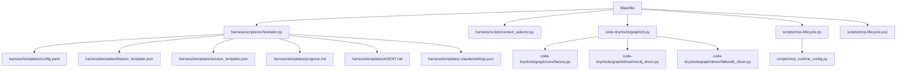
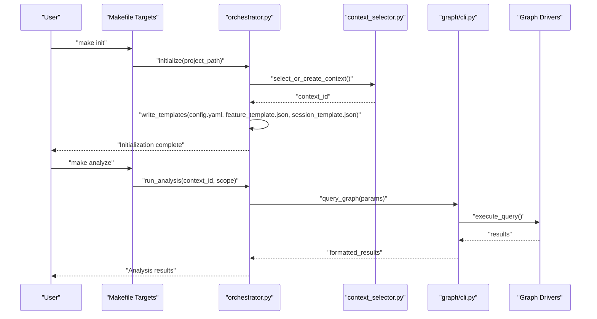
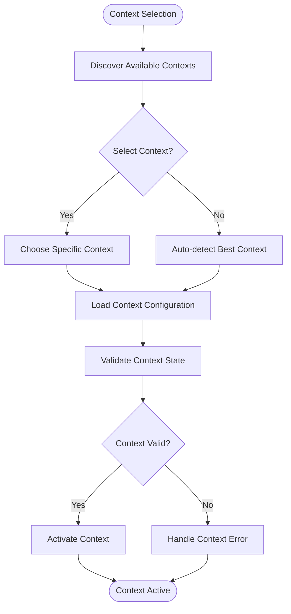
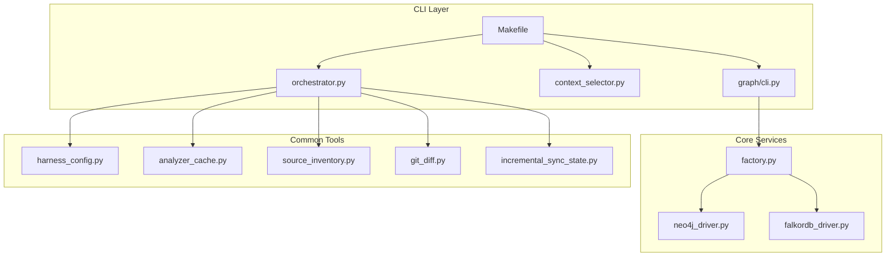

# Command Line Interface

<cite>
**Referenced Files in This Document**
- [Makefile](file://Makefile)
- [ReadMe.md](file://ReadMe.md)
- [harness/scripts/orchestrator.py](file://harness/scripts/orchestrator.py)
- [harness/scripts/context_selector.py](file://harness/scripts/context_selector.py)
- [harness/templates/config.yaml](file://harness/templates/config.yaml)
- [harness/templates/feature_template.json](file://harness/templates/feature_template.json)
- [harness/templates/session_template.json](file://harness/templates/session_template.json)
- [harness/templates/progress.md](file://harness/templates/progress.md)
- [harness/templates/AGENT.md](file://harness/templates/AGENT.md)
- [harness/templates/.claude/settings.json](file://harness/templates/.claude/settings.json)
- [scripts/mcp-lifecycle.py](file://scripts/mcp-lifecycle.py)
- [scripts/mcp-lifecycle.ps1](file://scripts/mcp-lifecycle.ps1)
- [scripts/mcp_runtime_config.py](file://scripts/mcp_runtime_config.py)
- [scripts/validate_retrieval.py](file://scripts/validate_retrieval.py)
- [installers/common/config_manager.py](file://installers/common/config_manager.py)
- [installers/windows/wrapper.bat](file://installers/windows/wrapper.bat)
- [installers/ubuntu/scripts/build_deb.sh](file://installers/ubuntu/scripts/build_deb.sh)
- [installers/macos/workflows/build_pkg.sh](file://installers/macos/workflows/build_pkg.sh)
- [code-tiny/tools/graph/cli.py](file://code-tiny/tools/graph/cli.py)
- [code-tiny/tools/graph/core/factory.py](file://code-tiny/tools/graph/core/factory.py)
- [code-tiny/tools/graph/driver/neo4j_driver.py](file://code-tiny/tools/graph/driver/neo4j_driver.py)
- [code-tiny/tools/graph/driver/falkordb_driver.py](file://code-tiny/tools/graph/driver/falkordb_driver.py)
- [code-tiny/tools/sync/incremental_sync.py](file://code-tiny/tools/sync/incremental_sync.py)
- [code-tiny/tools/common/harness_config.py](file://code-tiny/tools/common/harness_config.py)
- [code-tiny/tools/common/analyzer_cache.py](file://code-tiny/tools/common/analyzer_cache.py)
- [code-tiny/tools/common/source_inventory.py](file://code-tiny/tools/common/source_inventory.py)
- [code-tiny/tools/common/git_diff.py](file://code-tiny/tools/common/git_diff.py)
- [code-tiny/tools/common/incremental_cleanup.py](file://code-tiny/tools/common/incremental_cleanup.py)
- [code-tiny/tools/common/incremental_sync_state.py](file://code-tiny/tools/common/incremental_sync_state.py)
- [code-tiny/tools/common/result_packager.py](file://code-tiny/tools/common/result_packager.py)
- [code-tiny/tools/common/bm25_ranker.py](file://code-tiny/tools/common/bm25_ranker.py)
- [code-tiny/tools/common/intelligent_retrieval.py](file://code-tiny/tools/common/intelligent_retrieval.py)
- [code-tiny/tools/common/query_intent_classifier.py](file://code-tiny/tools/common/query_intent_classifier.py)
- [code-tiny/tools/common/query_understanding.py](file://code-tiny/tools/common/query_understanding.py)
- [code-tiny/tools/common/retrieval_scorer.py](file://code-tiny/tools/common/retrieval_scorer.py)
- [code-tiny/tools/common/semantic_inference.py](file://code-tiny/tools/common/semantic_inference.py)
- [code-tiny/tools/common/signal_normalizer.py](file://code-tiny/tools/common/signal_normalizer.py)
- [code-tiny/tools/common/url_normalizer.py](file://code-tiny/tools/common/url_normalizer.py)
- [code-tiny/tools/common/workflow_classifier.py](file://code-tiny/tools/common/workflow_classifier.py)
- [code-tiny/tools/common/workflow_impact_scorer.py](file://code-tiny/tools/common/workflow_impact_scorer.py)
- [code-tiny/tools/common/cloc_stats.py](file://code-tiny/tools/common/cloc_stats.py)
- [code-tiny/tools/common/api_match_engine.py](file://code-tiny/tools/common/api_match_engine.py)
- [code-tiny/tools/common/confidence_scorer.py](file://code-tiny/tools/common/confidence_scorer.py)
- [code-tiny/tools/common/frontend_relationship_extractor.py](file://code-tiny/tools/common/frontend_relationship_extractor.py)
- [code-tiny/tools/common/graph_expander.py](file://code-tiny/tools/common/graph_expander.py)
- [code-tiny/tools/common/message_scan.py](file://code-tiny/tools/common/message_scan.py)
- [code-tiny/tools/common/primary_vector_sync.py](file://code-tiny/tools/common/primary_vector_sync.py)
- [code-tiny/tools/common/react_role_classifier.py](file://code-tiny/tools/common/react_role_classifier.py)
- [code-tiny/tools/common/sync_scope.py](file://code-tiny/tools/common/sync_scope.py)
- [code-tiny/tools/ts/context/analyzer_context.py](file://code-tiny/tools/ts/context/analyzer_context.py)
- [code-tiny/tools/ts/pipeline/backend_pipeline.py](file://code-tiny/tools/ts/pipeline/backend_pipeline.py)
- [code-tiny/tools/ts/pipeline/frontend_pipeline.py](file://code-tiny/tools/ts/pipeline/frontend_pipeline.py)
- [code-tiny/tools/ts/types/ast_types.py](file://code-tiny/tools/ts/types/ast_types.py)
- [code-tiny/tools/ts/types/graph_types.py](file://code-tiny/tools/ts/types/graph_types.py)
- [code-tiny/tools/ts/utils/file_utils.py](file://code-tiny/tools/ts/utils/file_utils.py)
- [code-tiny/tools/ts/utils/id_utils.py](file://code-tiny/tools/ts/utils/id_utils.py)
- [code-tiny/tools/ts/utils/regex_patterns.py](file://code-tiny/tools/ts/utils/regex_patterns.py)
- [code-tiny/tools/ts/_refactor_ts_analyzer.py](file://code-tiny/tools/ts/_refactor_ts_analyzer.py)
- [code-tiny/tools/ts/ts_analyzer.py](file://code-tiny/tools/ts/ts_analyzer.py)
- [code-tiny/tools/ts/ts_api_bridge.py](file://code-tiny/tools/ts/ts_api_bridge.py)
- [code-tiny/tools/ts/ts_backend_analyzer.py](file://code-tiny/tools/ts/ts_backend_analyzer.py)
- [code-tiny/tools/ts/ts_project_detector.py](file://code-tiny/tools/ts/ts_project_detector.py)
- [code-tiny/tools/ts/workflow_finder.py](file://code-tiny/tools/ts/workflow_finder.py)
- [code-tiny/tools/sync/build_owner_manifests.py](file://code-tiny/tools/sync/build_owner_manifests.py)
- [code-tiny/tools/sync/dead_code_report.py](file://code-tiny/tools/sync/dead_code_report.py)
- [code-tiny/tools/sync/message_scan.py](file://code-tiny/tools/sync/message_scan.py)
- [code-tiny/tools/sync/owner_manifest.py](file://code-tiny/tools/sync/owner_manifest.py)
- [code-tiny/tools/graph/operations/__init__.py](file://code-tiny/tools/graph/operations/__init__.py)
- [code-tiny/tools/graph/operations/class_ops.py](file://code-tiny/tools/graph/operations/class_ops.py)
- [code-tiny/tools/graph/operations/cross_edge_ops.py](file://code-tiny/tools/graph/operations/cross_edge_ops.py)
- [code-tiny/tools/graph/operations/document_ops.py](file://code-tiny/tools/graph/operations/document_ops.py)
- [code-tiny/tools/graph/operations/flow_ops.py](file://code-tiny/tools/graph/operations/flow_ops.py)
- [code-tiny/tools/graph/operations/infra_ops.py](file://code-tiny/tools/graph/operations/infra_ops.py)
- [code-tiny/tools/graph/operations/namespace_ops.py](file://code-tiny/tools/graph/operations/namespace_ops.py)
- [code-tiny/tools/graph/operations/package_ops.py](file://code-tiny/tools/graph/operations/package_ops.py)
- [code-tiny/tools/graph/operations/type_ops.py](file://code-tiny/tools/graph/operations/type_ops.py)
- [code-tiny/tools/graph/writer/aspnet_writer.py](file://code-tiny/tools/graph/writer/aspnet_writer.py)
- [code-tiny/tools/graph/writer/database_schema_writer.py](file://code-tiny/tools/graph/writer/database_schema_writer.py)
- [code-tiny/tools/graph/writer/language_writer.py](file://code-tiny/tools/graph/writer/language_writer.py)
- [code-tiny/tools/graph/writer/mybatis_writer.py](file://code-tiny/tools/graph/writer/mybatis_writer.py)
-/code-tiny/tools/graph/writer/servlet_jsp_writer.py](file://code-tiny/tools/graph/writer/servlet_jsp_writer.py)
- [code-tiny/tools/graph/writer/spring_writer.py](file://code-tiny/tools/graph/writer/spring_writer.py)
- [code-tiny/tools/graph/writer/web_framework_writer.py](file://code-tiny/tools/graph/writer/web_framework_writer.py)
- [code-tiny/tools/graph/core/base.py](file://code-tiny/tools/graph/core/base.py)
- [code-tiny/tools/graph/core/provider_runtime.py](file://code-tiny/tools/graph/core/provider_runtime.py)
- [code-tiny/tools/graph/core/record_parsers.py](file://code-tiny/tools/graph/core/record_parsers.py)
- [code-tiny/tools/graph/core/require_neo4j.py](file://code-tiny/tools/graph/core/require_neo4j.py)
- [code-tiny/tools/graph/docs/IMPLEMENTATION_SUMMARY.md](file://code-tiny/tools/graph/docs/IMPLEMENTATION_SUMMARY.md)
- [code-tiny/tools/graph/docs/MIGRATION_EXAMPLE.md](file://code-tiny/tools/graph/docs/MIGRATION_EXAMPLE.md)
- [code-tiny/tools/graph/docs/MIGRATION_GUIDE.py](file://code-tiny/tools/graph/docs/MIGRATION_GUIDE.py)
- [code-tiny/tools/graph/docs/QUERY_BUILDER_SOLUTION.md](file://code-tiny/tools/graph/docs/QUERY_BUILDER_SOLUTION.md)
- [code-tiny/tools/graph/docs/QUERY_METHODS.md](file://code-tiny/tools/graph/docs/QUERY_METHODS.md)
- [code-tiny/tools/graph/docs/QUICK_REFERENCE.md](file://code-tiny/tools/graph/docs/QUICK_REFERENCE.md)
- [code-tiny/tools/graph/docs/README.md](file://code-tiny/tools/graph/docs/README.md)
- [code-tiny/tools/graph/examples/example_usage.py](file://code-tiny/tools/graph/examples/example_usage.py)
- [code-tiny/tools/graph/STRUCTURE.md](file://code-tiny/tools/graph/STRUCTURE.md)
</cite>

## Table of Contents
1. [Introduction](#introduction)
2. [Project Structure](#project-structure)
3. [Core Components](#core-components)
4. [Architecture Overview](#architecture-overview)
5. [Detailed Component Analysis](#detailed-component-analysis)
6. [Dependency Analysis](#dependency-analysis)
7. [Performance Considerations](#performance-considerations)
8. [Troubleshooting Guide](#troubleshooting-guide)
9. [Conclusion](#conclusion)
10. [Appendices](#appendices)

## Introduction
This document provides comprehensive CLI documentation for Cortex Harness command line interface. It covers project initialization, analysis orchestration, lifecycle management, and utility functions. It also documents Makefile targets for build automation and development workflows, context selection mechanisms for multi-project environments, session management features, scripting examples for CI/CD integration, error handling patterns, logging options, and debugging techniques for CLI operations.

## Project Structure
The repository organizes CLI-related functionality across several areas:
- Top-level Makefile defines lifecycle targets that drive the CLI and scripts.
- harness/scripts contains orchestrator and context selector utilities used by CLI commands.
- harness/templates provides default configuration and templates used during project initialization.
- code-tiny/tools/graph/cli.py exposes graph-related CLI commands.
- installers provide platform-specific wrappers and packaging scripts.
- scripts include MCP lifecycle helpers and runtime configuration utilities.



**Diagram sources**
- [Makefile](file://Makefile)
- [harness/scripts/orchestrator.py](file://harness/scripts/orchestrator.py)
- [harness/scripts/context_selector.py](file://harness/scripts/context_selector.py)
- [code-tiny/tools/graph/cli.py](file://code-tiny/tools/graph/cli.py)
- [scripts/mcp-lifecycle.py](file://scripts/mcp-lifecycle.py)
- [scripts/mcp-lifecycle.ps1](file://scripts/mcp-lifecycle.ps1)
- [harness/templates/config.yaml](file://harness/templates/config.yaml)
- [harness/templates/feature_template.json](file://harness/templates/feature_template.json)
- [harness/templates/session_template.json](file://harness/templates/session_template.json)
- [harness/templates/progress.md](file://harness/templates/progress.md)
- [harness/templates/AGENT.md](file://harness/templates/AGENT.md)
- [harness/templates/.claude/settings.json](file://harness/templates/.claude/settings.json)
- [code-tiny/tools/graph/core/factory.py](file://code-tiny/tools/graph/core/factory.py)
- [code-tiny/tools/graph/driver/neo4j_driver.py](file://code-tiny/tools/graph/driver/neo4j_driver.py)
- [code-tiny/tools/graph/driver/falkordb_driver.py](file://code-tiny/tools/graph/driver/falkordb_driver.py)
- [scripts/mcp_runtime_config.py](file://scripts/mcp_runtime_config.py)

**Section sources**
- [Makefile](file://Makefile)
- [ReadMe.md](file://ReadMe.md)

## Core Components
- Orchestrator: Central entry point for analysis orchestration and lifecycle tasks invoked by CLI commands.
- Context Selector: Manages multi-project environment selection and switching between contexts.
- Graph CLI: Provides graph-oriented commands for querying and managing code graphs.
- MCP Lifecycle Scripts: Manage MCP server lifecycle and runtime configuration.
- Installer Wrappers: Provide platform-specific CLI entry points and environment setup.

Key responsibilities:
- Initialize new projects with templates and configuration.
- Run full or incremental analyses based on change detection.
- Manage sessions and progress tracking.
- Query results via graph commands.
- Integrate with external graph providers (Neo4j, FalkorDB).

**Section sources**
- [harness/scripts/orchestrator.py](file://harness/scripts/orchestrator.py)
- [harness/scripts/context_selector.py](file://harness/scripts/context_selector.py)
- [code-tiny/tools/graph/cli.py](file://code-tiny/tools/graph/cli.py)
- [scripts/mcp-lifecycle.py](file://scripts/mcp-lifecycle.py)
- [scripts/mcp-lifecycle.ps1](file://scripts/mcp-lifecycle.ps1)
- [installers/windows/wrapper.bat](file://installers/windows/wrapper.bat)

## Architecture Overview
The CLI architecture centers around a Makefile-driven workflow that invokes Python orchestrators and helper scripts. The orchestrator coordinates template-based initialization, analysis pipelines, and result packaging. Context selection enables multi-project environments, while graph CLI commands interact with graph drivers to query and manage data.



**Diagram sources**
- [Makefile](file://Makefile)
- [harness/scripts/orchestrator.py](file://harness/scripts/orchestrator.py)
- [harness/scripts/context_selector.py](file://harness/scripts/context_selector.py)
- [code-tiny/tools/graph/cli.py](file://code-tiny/tools/graph/cli.py)
- [code-tiny/tools/graph/driver/neo4j_driver.py](file://code-tiny/tools/graph/driver/neo4j_driver.py)
- [code-tiny/tools/graph/driver/falkordb_driver.py](file://code-tiny/tools/graph/driver/falkordb_driver.py)

## Detailed Component Analysis

### CLI Commands

#### Project Initialization
- Purpose: Create a new project structure with default templates and configuration files.
- Parameters:
  - project_path: Path to initialize the project.
  - context_name: Optional name for the context.
- Flags:
  - --force: Overwrite existing project files.
  - --template-dir: Custom template directory.
- Environment Variables:
  - CORTEX_HARNESS_CONFIG_DIR: Override default config directory.
  - CORTEX_HARNESS_TEMPLATES_DIR: Override default templates directory.
- Expected Outputs:
  - config.yaml: Project configuration.
  - feature_template.json: Feature definition template.
  - session_template.json: Session metadata template.
  - progress.md: Progress tracking file.
  - AGENT.md: Agent instructions.
  - .claude/settings.json: Claude IDE settings.

Practical Example:
- Initialize a new project: make init PROJECT_PATH=/path/to/project CONTEXT_NAME=myproject

**Section sources**
- [harness/scripts/orchestrator.py](file://harness/scripts/orchestrator.py)
- [harness/templates/config.yaml](file://harness/templates/config.yaml)
- [harness/templates/feature_template.json](file://harness/templates/feature_template.json)
- [harness/templates/session_template.json](file://harness/templates/session_template.json)
- [harness/templates/progress.md](file://harness/templates/progress.md)
- [harness/templates/AGENT.md](file://harness/templates/AGENT.md)
- [harness/templates/.claude/settings.json](file://harness/templates/.claude/settings.json)

#### Analysis Orchestration
- Purpose: Run full or incremental analyses based on project state and changes.
- Parameters:
  - context_id: Identifier for the active context.
  - scope: Analysis scope (full, incremental, targeted).
- Flags:
  - --dry-run: Preview changes without executing.
  - --verbose: Enable detailed logging.
  - --output-format: Result format (json, markdown, text).
- Environment Variables:
  - CORTEX_HARNESS_ANALYSIS_SCOPE: Default analysis scope.
  - CORTEX_HARNESS_LOG_LEVEL: Logging verbosity level.
- Expected Outputs:
  - Analysis results packaged according to output format.
  - Updated progress.md with status information.

Practical Examples:
- Full analysis: make analyze CONTEXT_ID=abc123 SCOPE=full
- Incremental update: make analyze CONTEXT_ID=abc123 SCOPE=incremental

**Section sources**
- [harness/scripts/orchestrator.py](file://harness/scripts/orchestrator.py)

#### Lifecycle Management
- Purpose: Manage MCP server lifecycle and runtime configuration.
- Commands:
  - start: Start MCP server with current configuration.
  - stop: Stop running MCP server instance.
  - restart: Restart MCP server with updated configuration.
  - status: Check MCP server status and health.
- Environment Variables:
  - MCP_SERVER_PORT: Port for MCP server.
  - MCP_RUNTIME_CONFIG: Path to runtime configuration file.

Practical Examples:
- Start MCP server: make mcp-start
- Stop MCP server: make mcp-stop
- Check status: make mcp-status

**Section sources**
- [scripts/mcp-lifecycle.py](file://scripts/mcp-lifecycle.py)
- [scripts/mcp-lifecycle.ps1](file://scripts/mcp-lifecycle.ps1)
- [scripts/mcp_runtime_config.py](file://scripts/mcp_runtime_config.py)

#### Utility Functions
- Purpose: Provide helper commands for common tasks.
- Commands:
  - validate-retrieval: Validate retrieval system functionality.
  - list-contexts: List available contexts.
  - switch-context: Switch active context.
  - show-config: Display current configuration.
- Environment Variables:
  - CORTEX_HARNESS_CONTEXT_DIR: Directory containing contexts.

Practical Examples:
- List contexts: make list-contexts
- Switch context: make switch-context CONTEXT_ID=newcontext

**Section sources**
- [scripts/validate_retrieval.py](file://scripts/validate_retrieval.py)
- [harness/scripts/context_selector.py](file://harness/scripts/context_selector.py)

### Context Selection Mechanisms
Cortex Harness supports multi-project environments through context selection:
- Context Discovery: Automatically discovers available contexts in configured directories.
- Context Switching: Allows switching between different project contexts.
- Context Persistence: Maintains context state across sessions.
- Context Inheritance: Supports hierarchical context configurations.



**Diagram sources**
- [harness/scripts/context_selector.py](file://harness/scripts/context_selector.py)

**Section sources**
- [harness/scripts/context_selector.py](file://harness/scripts/context_selector.py)

### Session Management Features
Session management provides:
- Session Creation: Automatic session creation during analysis runs.
- Session Tracking: Persistent session state and progress tracking.
- Session Recovery: Resume interrupted analysis sessions.
- Session Cleanup: Automatic cleanup of stale sessions.

**Section sources**
- [harness/templates/session_template.json](file://harness/templates/session_template.json)
- [harness/templates/progress.md](file://harness/templates/progress.md)

### Graph CLI Commands
The graph CLI provides powerful querying capabilities:
- Query Operations: Execute complex queries against the code graph.
- Node Operations: Manipulate nodes and relationships.
- Export Operations: Export graph data in various formats.
- Validation Operations: Validate graph integrity and consistency.

**Section sources**
- [code-tiny/tools/graph/cli.py](file://code-tiny/tools/graph/cli.py)

## Dependency Analysis



**Diagram sources**
- [Makefile](file://Makefile)
- [harness/scripts/orchestrator.py](file://harness/scripts/orchestrator.py)
- [harness/scripts/context_selector.py](file://harness/scripts/context_selector.py)
- [code-tiny/tools/graph/cli.py](file://code-tiny/tools/graph/cli.py)
- [code-tiny/tools/graph/core/factory.py](file://code-tiny/tools/graph/core/factory.py)
- [code-tiny/tools/graph/driver/neo4j_driver.py](file://code-tiny/tools/graph/driver/neo4j_driver.py)
- [code-tiny/tools/graph/driver/falkordb_driver.py](file://code-tiny/tools/graph/driver/falkordb_driver.py)
- [code-tiny/tools/common/harness_config.py](file://code-tiny/tools/common/harness_config.py)
- [code-tiny/tools/common/analyzer_cache.py](file://code-tiny/tools/common/analyzer_cache.py)
- [code-tiny/tools/common/source_inventory.py](file://code-tiny/tools/common/source_inventory.py)
- [code-tiny/tools/common/git_diff.py](file://code-tiny/tools/common/git_diff.py)
- [code-tiny/tools/common/incremental_sync_state.py](file://code-tiny/tools/common/incremental_sync_state.py)

**Section sources**
- [Makefile](file://Makefile)
- [harness/scripts/orchestrator.py](file://harness/scripts/orchestrator.py)
- [code-tiny/tools/graph/cli.py](file://code-tiny/tools/graph/cli.py)

## Performance Considerations
- Incremental Analysis: Use incremental mode for faster updates by analyzing only changed files.
- Caching: Leverage analyzer cache to avoid reprocessing unchanged components.
- Parallel Processing: Utilize parallel execution where supported by analyzers.
- Memory Management: Configure appropriate memory limits for large codebases.
- Database Optimization: Tune graph database performance parameters for optimal query response times.

## Troubleshooting Guide

### Common Issues and Solutions
- Context Not Found: Verify context exists and is properly configured.
- Permission Errors: Ensure proper file system permissions for project directories.
- Graph Connection Failures: Check graph database connectivity and credentials.
- Template Generation Errors: Validate template syntax and required variables.

### Logging and Debugging
- Enable verbose logging using --verbose flag or CORTEX_HARNESS_LOG_LEVEL environment variable.
- Check progress.md for detailed analysis status and error messages.
- Use --dry-run flag to preview operations without side effects.
- Inspect generated configuration files for correct parameter values.

### Error Handling Patterns
- Graceful Degradation: Continue operation when non-critical components fail.
- Retry Logic: Implement automatic retries for transient failures.
- Comprehensive Error Messages: Provide actionable error information to users.
- State Recovery: Maintain consistent state even after failures.

**Section sources**
- [harness/scripts/orchestrator.py](file://harness/scripts/orchestrator.py)
- [harness/templates/progress.md](file://harness/templates/progress.md)

## Conclusion
Cortex Harness provides a comprehensive CLI interface for project initialization, analysis orchestration, and lifecycle management. The modular architecture supports multi-project environments through context selection, while offering powerful graph querying capabilities. With robust error handling, logging, and debugging features, it serves as a reliable tool for software analysis workflows.

## Appendices

### Makefile Targets Reference
- init: Initialize new project with templates
- analyze: Run analysis on current context
- mcp-start: Start MCP server
- mcp-stop: Stop MCP server  
- mcp-status: Check MCP server status
- list-contexts: List available contexts
- switch-context: Switch active context
- validate-retrieval: Validate retrieval system

### Environment Variables Reference
- CORTEX_HARNESS_CONFIG_DIR: Config directory override
- CORTEX_HARNESS_TEMPLATES_DIR: Templates directory override
- CORTEX_HARNESS_ANALYSIS_SCOPE: Default analysis scope
- CORTEX_HARNESS_LOG_LEVEL: Logging verbosity
- CORTEX_HARNESS_CONTEXT_DIR: Contexts directory
- MCP_SERVER_PORT: MCP server port
- MCP_RUNTIME_CONFIG: Runtime configuration path

### Scripting Examples for CI/CD Integration

Initialize and analyze in CI pipeline:
```bash
# Initialize project
make init PROJECT_PATH=$CI_PROJECT_DIR CONTEXT_NAME=ci-analysis

# Run full analysis
make analyze CONTEXT_ID=$(cat context_id.txt) SCOPE=full OUTPUT_FORMAT=json

# Validate results
make validate-retrieval
```

Incremental analysis workflow:
```bash
# Detect changes and run incremental analysis
make analyze CONTEXT_ID=$(cat context_id.txt) SCOPE=incremental

# Generate reports
make generate-report CONTEXT_ID=$(cat context_id.txt) FORMAT=markdown
```

MCP server lifecycle in containerized environment:
```bash
# Start MCP server
make mcp-start

# Wait for readiness
sleep 10

# Run analysis against MCP server
make analyze CONTEXT_ID=$(cat context_id.txt) SCOPE=full

# Clean up
make mcp-stop
```

**Section sources**
- [Makefile](file://Makefile)
- [scripts/mcp-lifecycle.py](file://scripts/mcp-lifecycle.py)
- [scripts/validate_retrieval.py](file://scripts/validate_retrieval.py)