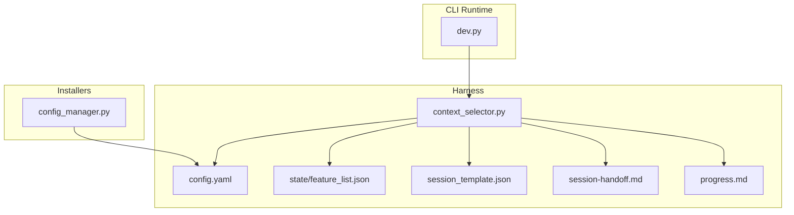
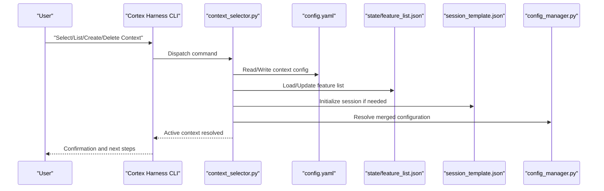
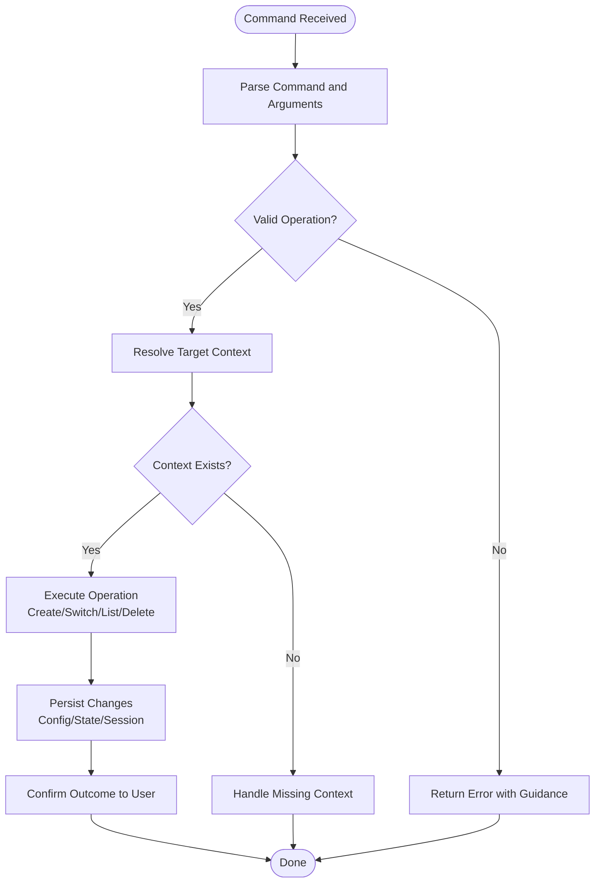
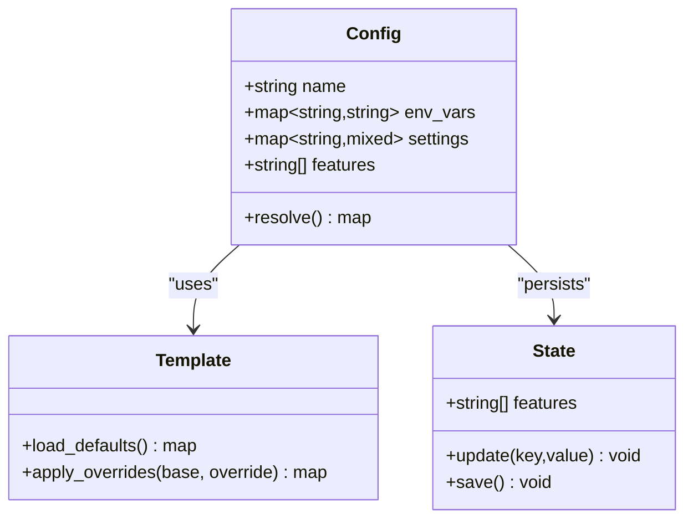
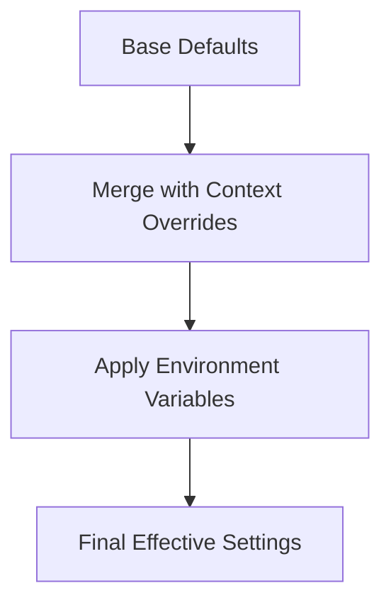
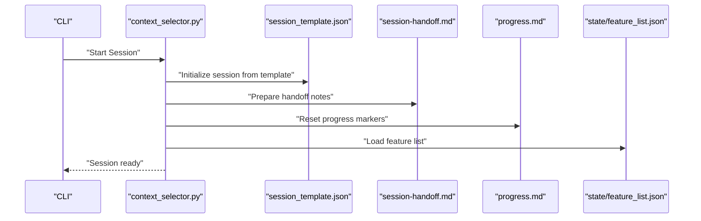
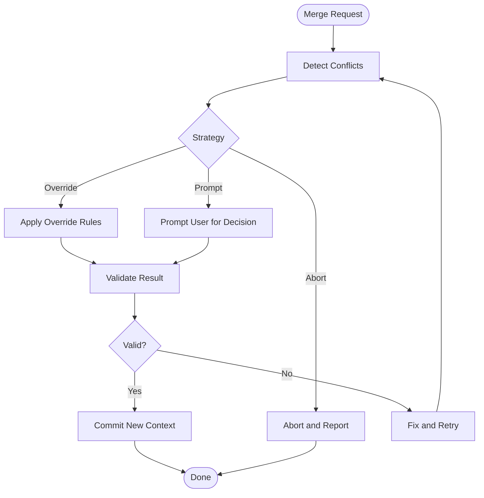
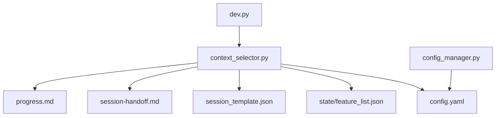

# Context Management & Multi-Project Support

<cite>
**Referenced Files in This Document**
- [harness/scripts/context_selector.py](file://harness/scripts/context_selector.py)
- [harness/templates/config.yaml](file://harness/templates/config.yaml)
- [harness/templates/progress.md](file://harness/templates/progress.md)
- [harness/templates/session-handoff.md](file://harness/templates/session-handoff.md)
- [harness/templates/session_template.json](file://harness/templates/session_template.json)
- [harness/templates/state/feature_list.json](file://harness/templates/state/feature_list.json)
- [installers/common/config_manager.py](file://installers/common/config_manager.py)
- [cli/__pycache__](file://cli/__pycache__)
- [cortex_harness/dev.py](file://cortex_harness/dev.py)
</cite>

## Table of Contents
1. [Introduction](#introduction)
2. [Project Structure](#project-structure)
3. [Core Components](#core-components)
4. [Architecture Overview](#architecture-overview)
5. [Detailed Component Analysis](#detailed-component-analysis)
6. [Dependency Analysis](#dependency-analysis)
7. [Performance Considerations](#performance-considerations)
8. [Troubleshooting Guide](#troubleshooting-guide)
9. [Conclusion](#conclusion)
10. [Appendices](#appendices)

## Introduction
This document explains how Cortex Harness CLI manages contexts and supports multiple projects or environments. A context isolates configurations, settings, and state for a specific project or environment (for example, development, staging, production). It covers:
- What a context is and why it matters
- How to create, switch, list, and delete contexts
- The configuration file structure used by contexts
- Environment variable scoping and inheritance across contexts
- Session management and persistence
- Conflict resolution strategies when merging or switching contexts
- Best practices for organizing multi-project setups and sharing common configuration

The goal is to help you run and manage several projects side-by-side without cross-contamination of settings or state.

## Project Structure
Context-related functionality spans the harness scripts, templates, and shared configuration utilities. Key areas include:
- Context selection script that drives interactive or programmatic context operations
- Template-based configuration and session scaffolding
- Shared configuration manager used during installation and runtime setup

**Diagram sources**
- [harness/scripts/context_selector.py](file://harness/scripts/context_selector.py)
- [harness/templates/config.yaml](file://harness/templates/config.yaml)
- [harness/templates/state/feature_list.json](file://harness/templates/state/feature_list.json)
- [harness/templates/session_template.json](file://harness/templates/session_template.json)
- [harness/templates/session-handoff.md](file://harness/templates/session-handoff.md)
- [harness/templates/progress.md](file://harness/templates/progress.md)
- [installers/common/config_manager.py](file://installers/common/config_manager.py)
- [cortex_harness/dev.py](file://cortex_harness/dev.py)

**Section sources**
- [harness/scripts/context_selector.py](file://harness/scripts/context_selector.py)
- [harness/templates/config.yaml](file://harness/templates/config.yaml)
- [harness/templates/state/feature_list.json](file://harness/templates/state/feature_list.json)
- [harness/templates/session_template.json](file://harness/templates/session_template.json)
- [harness/templates/session-handoff.md](file://harness/templates/session-handoff.md)
- [harness/templates/progress.md](file://harness/templates/progress.md)
- [installers/common/config_manager.py](file://installers/common/config_manager.py)
- [cortex_harness/dev.py](file://cortex_harness/dev.py)

## Core Components
- Context selector: Provides commands to create, switch, list, and remove contexts; resolves active context; integrates with templates and state files.
- Configuration template: Defines default keys and structure for per-context settings.
- State and session artifacts: Track features, progress, and handoff data scoped to the active context.
- Shared config manager: Centralizes reading/writing configuration and may be used by installers and CLI flows.

Operational responsibilities:
- Isolate per-project settings and state under a chosen context
- Persist current context selection across sessions
- Provide predictable defaults via templates while allowing overrides
- Manage environment variable scoping at context boundaries

**Section sources**
- [harness/scripts/context_selector.py](file://harness/scripts/context_selector.py)
- [harness/templates/config.yaml](file://harness/templates/config.yaml)
- [harness/templates/state/feature_list.json](file://harness/templates/state/feature_list.json)
- [harness/templates/session_template.json](file://harness/templates/session_template.json)
- [harness/templates/session-handoff.md](file://harness/templates/session-handoff.md)
- [harness/templates/progress.md](file://harness/templates/progress.md)
- [installers/common/config_manager.py](file://installers/common/config_manager.py)

## Architecture Overview
At runtime, the CLI selects an active context and loads its configuration and state. Templates provide baseline structures for new contexts. The shared configuration manager reads and writes configuration consistently across components.

**Diagram sources**
- [harness/scripts/context_selector.py](file://harness/scripts/context_selector.py)
- [harness/templates/config.yaml](file://harness/templates/config.yaml)
- [harness/templates/state/feature_list.json](file://harness/templates/state/feature_list.json)
- [harness/templates/session_template.json](file://harness/templates/session_template.json)
- [installers/common/config_manager.py](file://installers/common/config_manager.py)

## Detailed Component Analysis

### Context Selector
Responsibilities:
- Implement context lifecycle commands: create, switch, list, delete
- Determine the active context based on explicit selection or defaults
- Integrate with configuration and state files to ensure isolation
- Provide feedback and error handling for invalid operations

Key behaviors:
- Create: scaffold a new context using templates and initialize required files
- Switch: update active context reference and reload configuration
- List: enumerate available contexts and highlight the active one
- Delete: remove context artifacts safely after validation

**Diagram sources**
- [harness/scripts/context_selector.py](file://harness/scripts/context_selector.py)

**Section sources**
- [harness/scripts/context_selector.py](file://harness/scripts/context_selector.py)

### Configuration File Structure
The configuration template defines the shape of per-context settings. Typical sections include:
- Global defaults and shared keys
- Per-environment overrides (development, staging, production)
- Feature toggles and flags
- Paths and resource references scoped to the context

Guidelines:
- Keep shared settings in a base section and override per context
- Use clear naming conventions for environment-specific values
- Avoid embedding secrets directly; prefer environment variables or secure stores

**Diagram sources**
- [harness/templates/config.yaml](file://harness/templates/config.yaml)
- [harness/templates/state/feature_list.json](file://harness/templates/state/feature_list.json)

**Section sources**
- [harness/templates/config.yaml](file://harness/templates/config.yaml)
- [harness/templates/state/feature_list.json](file://harness/templates/state/feature_list.json)

### Environment Variable Scoping and Inheritance
Environment variables can be scoped to a context to isolate sensitive or environment-specific values. Recommended approach:
- Define context-scoped variables in configuration or dedicated env files
- Merge global defaults with context overrides
- Ensure precedence rules are consistent: explicit > context > global

Inheritance model:
- Base configuration provides defaults
- Context-specific configuration overrides base values
- Environment variables can further override configuration values at runtime

[No sources needed since this diagram shows conceptual workflow, not actual code structure]

### Session Management and Persistence
Sessions capture transient state and handoff information for a given context. Artifacts include:
- Session template for initialization
- Handoff notes for continuity across interactions
- Progress tracking for long-running tasks
- Feature list state to track enabled capabilities

Persistence strategy:
- Store session and state files within the active context directory
- Ensure atomic updates to avoid partial writes
- Provide recovery mechanisms if interrupted mid-operation

**Diagram sources**
- [harness/templates/session_template.json](file://harness/templates/session_template.json)
- [harness/templates/session-handoff.md](file://harness/templates/session-handoff.md)
- [harness/templates/progress.md](file://harness/templates/progress.md)
- [harness/templates/state/feature_list.json](file://harness/templates/state/feature_list.json)
- [harness/scripts/context_selector.py](file://harness/scripts/context_selector.py)

**Section sources**
- [harness/templates/session_template.json](file://harness/templates/session_template.json)
- [harness/templates/session-handoff.md](file://harness/templates/session-handoff.md)
- [harness/templates/progress.md](file://harness/templates/progress.md)
- [harness/templates/state/feature_list.json](file://harness/templates/state/feature_list.json)
- [harness/scripts/context_selector.py](file://harness/scripts/context_selector.py)

### Conflict Resolution Strategies
When merging configurations or switching contexts, conflicts may arise:
- Duplicate keys with different values
- Incompatible feature flags
- Path or resource collisions

Resolution guidelines:
- Prefer explicit context values over base defaults
- Warn on ambiguous merges and require confirmation for destructive changes
- Maintain a history of recent switches to support rollback
- Validate critical dependencies before applying a new context

[No sources needed since this diagram shows conceptual workflow, not actual code structure]

### Example Workflows: Development, Staging, Production
Typical usage patterns:
- Create separate contexts for each environment
- Set environment-specific variables and feature flags per context
- Switch contexts before running analysis or deployment tasks
- Verify active context to avoid accidental misconfiguration

Steps:
- Create a context named “dev”, “staging”, or “prod”
- Populate environment variables and settings appropriate for the target
- Switch to the desired context
- Run commands; they will operate against the selected context’s configuration and state

[No sources needed since this section provides general guidance]

## Dependency Analysis
The following diagram maps key dependencies among context-related modules and templates.

**Diagram sources**
- [harness/scripts/context_selector.py](file://harness/scripts/context_selector.py)
- [harness/templates/config.yaml](file://harness/templates/config.yaml)
- [harness/templates/state/feature_list.json](file://harness/templates/state/feature_list.json)
- [harness/templates/session_template.json](file://harness/templates/session_template.json)
- [harness/templates/session-handoff.md](file://harness/templates/session-handoff.md)
- [harness/templates/progress.md](file://harness/templates/progress.md)
- [installers/common/config_manager.py](file://installers/common/config_manager.py)
- [cortex_harness/dev.py](file://cortex_harness/dev.py)

**Section sources**
- [harness/scripts/context_selector.py](file://harness/scripts/context_selector.py)
- [harness/templates/config.yaml](file://harness/templates/config.yaml)
- [harness/templates/state/feature_list.json](file://harness/templates/state/feature_list.json)
- [harness/templates/session_template.json](file://harness/templates/session_template.json)
- [harness/templates/session-handoff.md](file://harness/templates/session-handoff.md)
- [harness/templates/progress.md](file://harness/templates/progress.md)
- [installers/common/config_manager.py](file://installers/common/config_manager.py)
- [cortex_harness/dev.py](file://cortex_harness/dev.py)

## Performance Considerations
- Minimize disk I/O by caching resolved configuration in memory during a session
- Batch updates to state files to reduce write contention
- Defer heavy operations until after context switch completes
- Use incremental updates for large feature lists or progress logs

[No sources needed since this section provides general guidance]

## Troubleshooting Guide
Common issues and resolutions:
- Active context not applied: verify the current context selection and re-run the switch command
- Missing configuration keys: ensure the context was created from the template and contains required fields
- Permission errors on state files: check read/write permissions for the context directory
- Conflicting environment variables: review precedence rules and explicitly set intended values
- Session corruption: reset session artifacts using the provided templates and restart the session

Diagnostic tips:
- List contexts to confirm availability and active selection
- Inspect configuration and state files for anomalies
- Review session handoff notes for clues about interrupted operations

**Section sources**
- [harness/scripts/context_selector.py](file://harness/scripts/context_selector.py)
- [harness/templates/session-handoff.md](file://harness/templates/session-handoff.md)
- [harness/templates/progress.md](file://harness/templates/progress.md)
- [harness/templates/state/feature_list.json](file://harness/templates/state/feature_list.json)

## Conclusion
Contexts enable clean isolation of configurations, settings, and state across multiple projects or environments. By leveraging the context selector, templates, and shared configuration manager, teams can maintain consistent workflows while avoiding cross-contamination. Adopting best practices—clear naming, explicit overrides, careful environment scoping, and robust session management—ensures reliable multi-project operations.

[No sources needed since this section summarizes without analyzing specific files]

## Appendices

### Best Practices for Multi-Project Organization
- Use descriptive context names aligned with environments or repositories
- Keep shared defaults minimal; override only what differs per context
- Store secrets outside configuration files; inject via environment variables
- Version control base templates but exclude per-context secrets
- Regularly audit active contexts and remove unused ones

[No sources needed since this section provides general guidance]