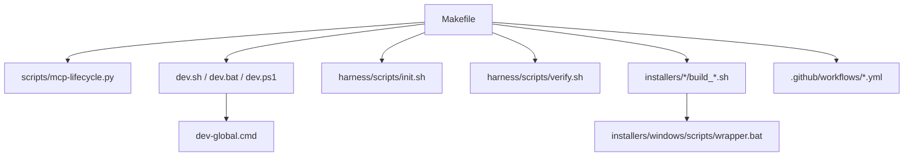
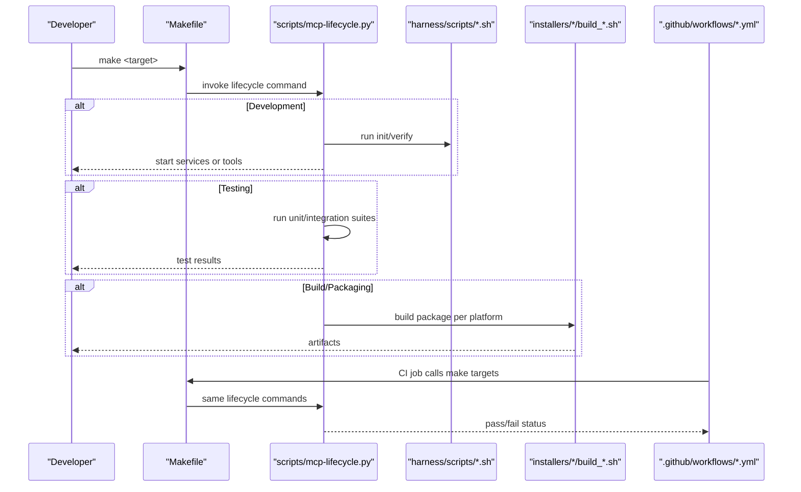
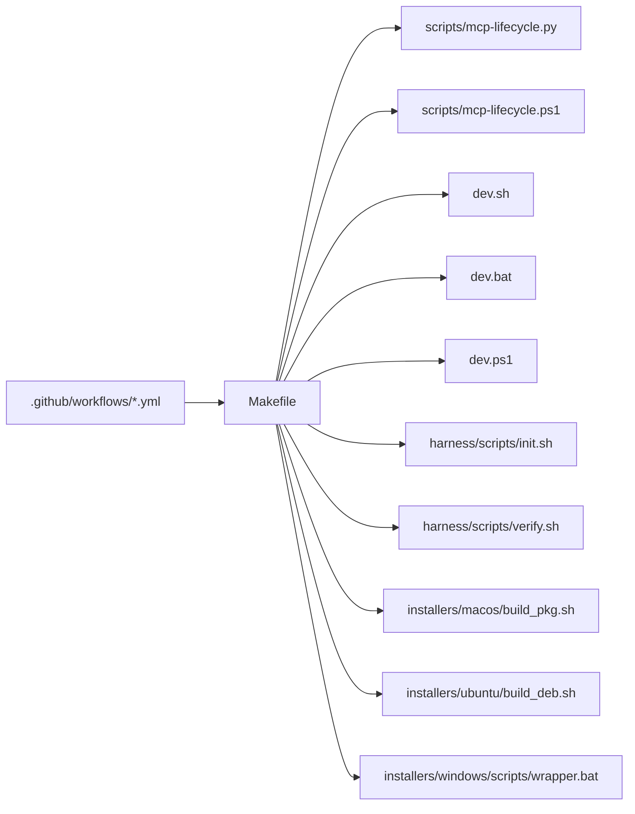

# Makefile Targets & Build Automation

<cite>
**Referenced Files in This Document**
- [Makefile](file://Makefile)
- [dev.sh](file://dev.sh)
- [dev.bat](file://dev.bat)
- [dev.ps1](file://dev.ps1)
- [dev-global.cmd](file://dev-global.cmd)
- [install-windows.bat](file://install-windows.bat)
- [install-windows.ps1](file://install-windows.ps1)
- [scripts/mcp-lifecycle.py](file://scripts/mcp-lifecycle.py)
- [scripts/mcp-lifecycle.ps1](file://scripts/mcp-lifecycle.ps1)
- [.github/workflows/cobol-macos.yml](file://.github/workflows/cobol-macos.yml)
- [.github/workflows/lifecycle-macos.yml](file://.github/workflows/lifecycle-macos.yml)
- [harness/scripts/init.sh](file://harness/scripts/init.sh)
- [harness/scripts/verify.sh](file://harness/scripts/verify.sh)
- [installers/windows/scripts/wrapper.bat](file://installers/windows/scripts/wrapper.bat)
- [installers/macos/build_pkg.sh](file://installers/macos/build_pkg.sh)
- [installers/ubuntu/build_deb.sh](file://installers/ubuntu/build_deb.sh)
</cite>

## Table of Contents
1. [Introduction](#introduction)
2. [Project Structure](#project-structure)
3. [Core Components](#core-components)
4. [Architecture Overview](#architecture-overview)
5. [Detailed Component Analysis](#detailed-component-analysis)
6. [Dependency Analysis](#dependency-analysis)
7. [Performance Considerations](#performance-considerations)
8. [Troubleshooting Guide](#troubleshooting-guide)
9. [Conclusion](#conclusion)
10. [Appendices](#appendices)

## Introduction
This document explains the build automation surface for Cortex Harness with a focus on Makefile targets and related scripts. It covers development setup, testing, building, packaging, deployment, and maintenance tasks. It also documents cross-platform considerations (Windows, macOS, Linux), environment variables, configuration overrides, CI integration examples, and guidance for creating custom targets.

## Project Structure
The repository provides a unified entry point via a top-level Makefile that orchestrates Python-based lifecycle scripts and platform-specific helpers. The structure is layered:
- Top-level orchestration: Makefile
- Cross-platform developer helpers: dev.sh, dev.bat, dev.ps1, dev-global.cmd
- Windows installers and wrappers: install-windows.bat, install-windows.ps1, installers/windows/scripts/wrapper.bat
- Lifecycle automation: scripts/mcp-lifecycle.py and scripts/mcp-lifecycle.ps1
- Platform packaging: installers/{macos,ubuntu,windows}/*
- GitHub Actions workflows: .github/workflows/*.yml
- Harness bootstrap and verification: harness/scripts/init.sh, harness/scripts/verify.sh

**Diagram sources**
- [Makefile](file://Makefile)
- [scripts/mcp-lifecycle.py](file://scripts/mcp-lifecycle.py)
- [dev.sh](file://dev.sh)
- [dev.bat](file://dev.bat)
- [dev.ps1](file://dev.ps1)
- [dev-global.cmd](file://dev-global.cmd)
- [harness/scripts/init.sh](file://harness/scripts/init.sh)
- [harness/scripts/verify.sh](file://harness/scripts/verify.sh)
- [installers/macos/build_pkg.sh](file://installers/macos/build_pkg.sh)
- [installers/ubuntu/build_deb.sh](file://installers/ubuntu/build_deb.sh)
- [installers/windows/scripts/wrapper.bat](file://installers/windows/scripts/wrapper.bat)
- [.github/workflows/cobol-macos.yml](file://.github/workflows/cobol-macos.yml)
- [.github/workflows/lifecycle-macos.yml](file://.github/workflows/lifecycle-macos.yml)

**Section sources**
- [Makefile](file://Makefile)
- [dev.sh](file://dev.sh)
- [dev.bat](file://dev.bat)
- [dev.ps1](file://dev.ps1)
- [dev-global.cmd](file://dev-global.cmd)
- [install-windows.bat](file://install-windows.bat)
- [install-windows.ps1](file://install-windows.ps1)
- [scripts/mcp-lifecycle.py](file://scripts/mcp-lifecycle.py)
- [scripts/mcp-lifecycle.ps1](file://scripts/mcp-lifecycle.ps1)
- [.github/workflows/cobol-macos.yml](file://.github/workflows/cobol-macos.yml)
- [.github/workflows/lifecycle-macos.yml](file://.github/workflows/lifecycle-macos.yml)
- [harness/scripts/init.sh](file://harness/scripts/init.sh)
- [harness/scripts/verify.sh](file://harness/scripts/verify.sh)
- [installers/windows/scripts/wrapper.bat](file://installers/windows/scripts/wrapper.bat)
- [installers/macos/build_pkg.sh](file://installers/macos/build_pkg.sh)
- [installers/ubuntu/build_deb.sh](file://installers/ubuntu/build_deb.sh)

## Core Components
- Makefile: Central orchestration for all lifecycle targets. Delegates to Python lifecycle scripts and platform helpers.
- Lifecycle scripts: scripts/mcp-lifecycle.py (primary), scripts/mcp-lifecycle.ps1 (Windows). Provide commands for dev/test/build/package/deploy.
- Developer helpers: dev.sh (POSIX), dev.bat/dev.ps1 (Windows), dev-global.cmd (global launcher).
- Packaging: installers/{macos,ubuntu,windows} contain platform-specific build and installer scripts.
- CI: .github/workflows define CI jobs invoking make targets and lifecycle scripts.
- Harness bootstrap: harness/scripts/init.sh and verify.sh support environment initialization and validation.

Key responsibilities:
- Environment preparation (Python venv, dependencies, graph provider init)
- Testing (unit and integration)
- Building and packaging artifacts
- Deployment and publishing flows
- Maintenance (clean, lint, format)

**Section sources**
- [Makefile](file://Makefile)
- [scripts/mcp-lifecycle.py](file://scripts/mcp-lifecycle.py)
- [scripts/mcp-lifecycle.ps1](file://scripts/mcp-lifecycle.ps1)
- [dev.sh](file://dev.sh)
- [dev.bat](file://dev.bat)
- [dev.ps1](file://dev.ps1)
- [dev-global.cmd](file://dev-global.cmd)
- [installers/macos/build_pkg.sh](file://installers/macos/build_pkg.sh)
- [installers/ubuntu/build_deb.sh](file://installers/ubuntu/build_deb.sh)
- [installers/windows/scripts/wrapper.bat](file://installers/windows/scripts/wrapper.bat)
- [harness/scripts/init.sh](file://harness/scripts/init.sh)
- [harness/scripts/verify.sh](file://harness/scripts/verify.sh)

## Architecture Overview
The build system follows a thin Makefile layer over Python-driven lifecycle commands. This design centralizes logic in Python while keeping shell invocation simple and portable.

**Diagram sources**
- [Makefile](file://Makefile)
- [scripts/mcp-lifecycle.py](file://scripts/mcp-lifecycle.py)
- [harness/scripts/init.sh](file://harness/scripts/init.sh)
- [harness/scripts/verify.sh](file://harness/scripts/verify.sh)
- [installers/macos/build_pkg.sh](file://installers/macos/build_pkg.sh)
- [installers/ubuntu/build_deb.sh](file://installers/ubuntu/build_deb.sh)
- [.github/workflows/cobol-macos.yml](file://.github/workflows/cobol-macos.yml)
- [.github/workflows/lifecycle-macos.yml](file://.github/workflows/lifecycle-macos.yml)

## Detailed Component Analysis

### Makefile Targets
The Makefile exposes high-level targets that map to lifecycle operations. Typical categories include:
- Development setup: dev, setup, install
- Testing: test, test-unit, test-integration
- Building: build, package, dist
- Deployment: deploy, publish
- Maintenance: clean, lint, format

Behavioral characteristics:
- Dependencies: Many targets depend on environment preparation (e.g., virtual environment creation, dependency installation).
- Execution context: Targets may switch into a virtual environment or set environment variables before invoking lifecycle scripts.
- Configuration options: Environment variables override defaults for providers, paths, and flags.
- Expected outcomes: Artifacts are produced in designated directories; logs are emitted to standard output or files depending on target.

Cross-platform notes:
- On POSIX systems, Makefile delegates to shell and Python scripts.
- On Windows, PowerShell or batch helpers may be used by specific targets.

Examples of common patterns:
- dev: initialize environment, start local services, and launch tooling.
- test: run full suite; test-unit and test-integration split scope.
- build: compile or assemble outputs; package creates distributables; dist produces final archives.
- deploy/publish: push artifacts to registries or installers.
- clean: remove generated artifacts and caches.
- lint/format: enforce code style and formatting.

**Section sources**
- [Makefile](file://Makefile)

### Lifecycle Scripts (Python and PowerShell)
Primary orchestrator:
- scripts/mcp-lifecycle.py: Implements core commands invoked by Makefile targets. Handles environment setup, running tests, building, packaging, and deployment.
- scripts/mcp-lifecycle.ps1: Windows variant for PowerShell environments.

Responsibilities:
- Parse arguments and environment variables
- Initialize Python virtual environment and dependencies
- Execute test runners
- Invoke platform packaging scripts
- Manage deployment steps and credentials

Integration points:
- Called from Makefile targets
- Used directly by CI workflows
- Optional direct invocation for ad-hoc tasks

**Section sources**
- [scripts/mcp-lifecycle.py](file://scripts/mcp-lifecycle.py)
- [scripts/mcp-lifecycle.ps1](file://scripts/mcp-lifecycle.ps1)

### Developer Helpers (POSIX and Windows)
- dev.sh: POSIX helper to bootstrap development environment and launch services.
- dev.bat / dev.ps1: Windows equivalents for setting up and launching dev workflows.
- dev-global.cmd: Global launcher to simplify access across sessions.

Usage:
- Run from terminal to quickly spin up local dev stack.
- Accepts optional flags to control verbosity and service selection.

**Section sources**
- [dev.sh](file://dev.sh)
- [dev.bat](file://dev.bat)
- [dev.ps1](file://dev.ps1)
- [dev-global.cmd](file://dev-global.cmd)

### Harness Bootstrap and Verification
- harness/scripts/init.sh: Initializes harness state and prerequisites.
- harness/scripts/verify.sh: Validates environment readiness and connectivity.

These scripts are typically invoked during setup and pre-test phases to ensure consistent runtime conditions.

**Section sources**
- [harness/scripts/init.sh](file://harness/scripts/init.sh)
- [harness/scripts/verify.sh](file://harness/scripts/verify.sh)

### Packaging and Installers
Platform-specific packaging:
- installers/macos/build_pkg.sh: Builds macOS packages.
- installers/ubuntu/build_deb.sh: Builds Debian packages.
- installers/windows/scripts/wrapper.bat: Windows wrapper used by packaging/installation flows.

Makefile targets delegate to these scripts based on detected platform or explicit parameters.

**Section sources**
- [installers/macos/build_pkg.sh](file://installers/macos/build_pkg.sh)
- [installers/ubuntu/build_deb.sh](file://installers/ubuntu/build_deb.sh)
- [installers/windows/scripts/wrapper.bat](file://installers/windows/scripts/wrapper.bat)

### CI Integration
GitHub Actions workflows call make targets and lifecycle scripts to automate builds and tests on macOS.

- .github/workflows/cobol-macos.yml
- .github/workflows/lifecycle-macos.yml

Typical flow:
- Checkout code
- Set up Python and dependencies
- Invoke make targets (test, build, package)
- Upload artifacts or publish releases

**Section sources**
- [.github/workflows/cobol-macos.yml](file://.github/workflows/cobol-macos.yml)
- [.github/workflows/lifecycle-macos.yml](file://.github/workflows/lifecycle-macos.yml)

### Windows Installation and Wrappers
- install-windows.bat / install-windows.ps1: One-click installers for Windows.
- installers/windows/scripts/wrapper.bat: Wrapper used by packaging and installation processes.

These streamline installation and registration on Windows platforms.

**Section sources**
- [install-windows.bat](file://install-windows.bat)
- [install-windows.ps1](file://install-windows.ps1)
- [installers/windows/scripts/wrapper.bat](file://installers/windows/scripts/wrapper.bat)

## Dependency Analysis
High-level dependency relationships among build components:

**Diagram sources**
- [Makefile](file://Makefile)
- [scripts/mcp-lifecycle.py](file://scripts/mcp-lifecycle.py)
- [scripts/mcp-lifecycle.ps1](file://scripts/mcp-lifecycle.ps1)
- [dev.sh](file://dev.sh)
- [dev.bat](file://dev.bat)
- [dev.ps1](file://dev.ps1)
- [harness/scripts/init.sh](file://harness/scripts/init.sh)
- [harness/scripts/verify.sh](file://harness/scripts/verify.sh)
- [installers/macos/build_pkg.sh](file://installers/macos/build_pkg.sh)
- [installers/ubuntu/build_deb.sh](file://installers/ubuntu/build_deb.sh)
- [installers/windows/scripts/wrapper.bat](file://installers/windows/scripts/wrapper.bat)
- [.github/workflows/cobol-macos.yml](file://.github/workflows/cobol-macos.yml)
- [.github/workflows/lifecycle-macos.yml](file://.github/workflows/lifecycle-macos.yml)

**Section sources**
- [Makefile](file://Makefile)
- [scripts/mcp-lifecycle.py](file://scripts/mcp-lifecycle.py)
- [scripts/mcp-lifecycle.ps1](file://scripts/mcp-lifecycle.ps1)
- [dev.sh](file://dev.sh)
- [dev.bat](file://dev.bat)
- [dev.ps1](file://dev.ps1)
- [harness/scripts/init.sh](file://harness/scripts/init.sh)
- [harness/scripts/verify.sh](file://harness/scripts/verify.sh)
- [installers/macos/build_pkg.sh](file://installers/macos/build_pkg.sh)
- [installers/ubuntu/build_deb.sh](file://installers/ubuntu/build_deb.sh)
- [installers/windows/scripts/wrapper.bat](file://installers/windows/scripts/wrapper.bat)
- [.github/workflows/cobol-macos.yml](file://.github/workflows/cobol-macos.yml)
- [.github/workflows/lifecycle-macos.yml](file://.github/workflows/lifecycle-macos.yml)

## Performance Considerations
- Parallelization: Use parallel test execution where supported to reduce total test time.
- Caching: Cache Python dependencies and intermediate artifacts to speed up repeated runs.
- Incremental builds: Prefer incremental packaging and scanning to avoid full rebuilds.
- Resource limits: Configure memory and concurrency for heavy analyzers to prevent OOM on CI.
- Artifact reuse: Reuse previously built packages when only minor changes occur.

[No sources needed since this section provides general guidance]

## Troubleshooting Guide
Common issues and resolutions:
- Missing Python or pip: Ensure Python 3.x and pip are installed and available in PATH.
- Virtual environment errors: Recreate the venv and reinstall dependencies.
- Graph provider connectivity: Verify database endpoints and credentials; use harness/scripts/verify.sh to validate.
- Permission issues on packaging: Run with appropriate privileges or adjust script permissions.
- Windows-specific failures: Use PowerShell wrapper and confirm registry entries if required by installers.

Operational checks:
- harness/scripts/init.sh: Run to bootstrap environment.
- harness/scripts/verify.sh: Run to validate prerequisites and connectivity.

**Section sources**
- [harness/scripts/init.sh](file://harness/scripts/init.sh)
- [harness/scripts/verify.sh](file://harness/scripts/verify.sh)

## Conclusion
Cortex Harness uses a Makefile-centric orchestration backed by Python lifecycle scripts and platform-specific helpers. This design enables consistent development, testing, packaging, and deployment across platforms. By leveraging environment variables and modular scripts, teams can tailor workflows for different scenarios and integrate smoothly with CI/CD pipelines.

[No sources needed since this section summarizes without analyzing specific files]

## Appendices

### Environment Variables and Configuration Overrides
Typical variables used across targets and scripts:
- Provider configuration: Database URLs, authentication tokens, and connection parameters.
- Paths: Output directories, artifact locations, and workspace roots.
- Flags: Verbosity levels, feature toggles, and test scopes.
- Platform overrides: OS-specific settings for packaging and installation.

Best practices:
- Store secrets in CI secret stores and inject at runtime.
- Use .env files locally for convenience, but never commit sensitive values.
- Validate required variables early using harness/scripts/verify.sh.

[No sources needed since this section provides general guidance]

### Cross-Platform Considerations
- Windows:
  - Prefer PowerShell or batch helpers for lifecycle tasks.
  - Use install-windows.bat / install-windows.ps1 for one-click installs.
  - Confirm registry interactions if required by installers.
- macOS:
  - Use installers/macos/build_pkg.sh for packaging.
  - Ensure Xcode command-line tools are installed.
- Linux:
  - Use installers/ubuntu/build_deb.sh for Debian packaging.
  - Ensure dpkg and related tools are present.

**Section sources**
- [install-windows.bat](file://install-windows.bat)
- [install-windows.ps1](file://install-windows.ps1)
- [installers/macos/build_pkg.sh](file://installers/macos/build_pkg.sh)
- [installers/ubuntu/build_deb.sh](file://installers/ubuntu/build_deb.sh)

### Custom Target Creation
Guidelines:
- Add a new target in the Makefile that delegates to scripts/mcp-lifecycle.py with appropriate arguments.
- If platform-specific behavior is needed, branch on OS within the target or call dedicated helpers.
- Document required environment variables and expected artifacts.
- Integrate with CI by adding a workflow step that invokes the new target.

Example pattern:
- Define target name
- Set dependencies (e.g., setup)
- Invoke lifecycle script with subcommand
- Capture and report exit codes

[No sources needed since this section provides general guidance]

### CI/CD Integration Examples
- GitHub Actions:
  - Call make targets in matrix jobs for multiple platforms.
  - Cache dependencies and artifacts between steps.
  - Publish release artifacts upon successful builds.

**Section sources**
- [.github/workflows/cobol-macos.yml](file://.github/workflows/cobol-macos.yml)
- [.github/workflows/lifecycle-macos.yml](file://.github/workflows/lifecycle-macos.yml)