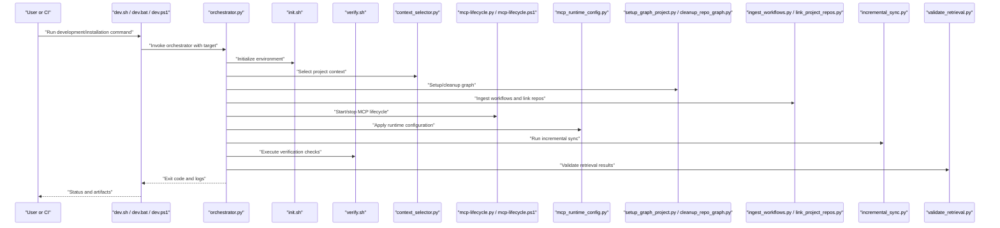
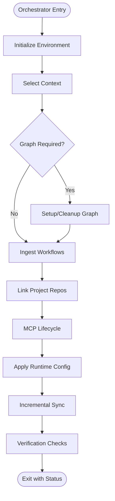
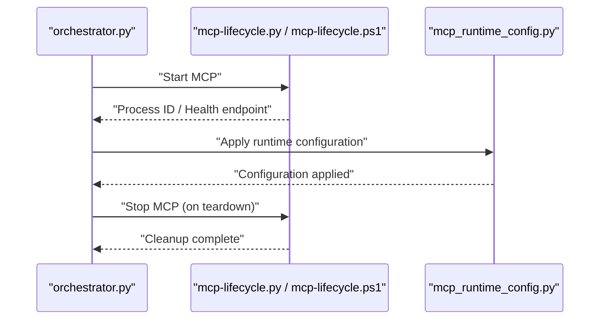
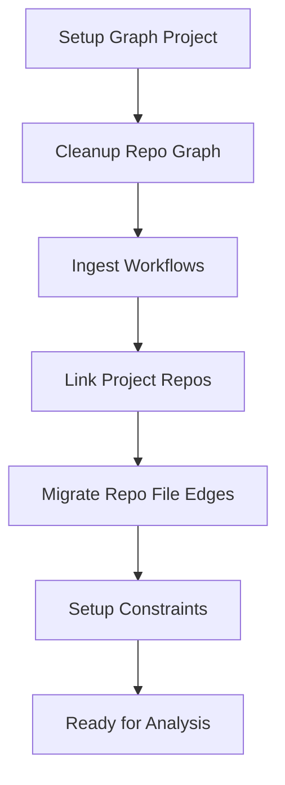
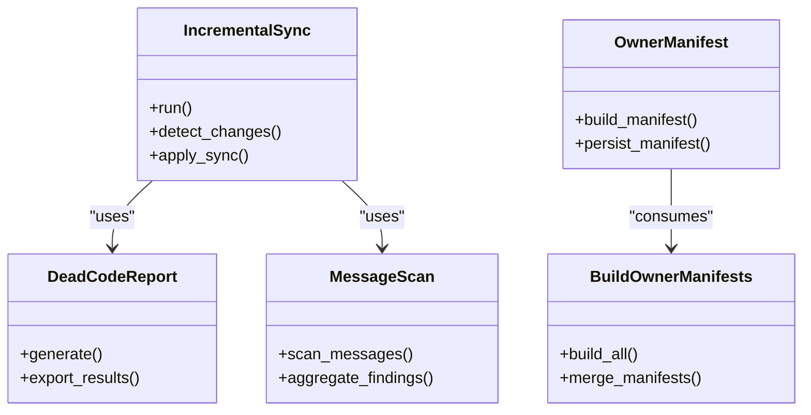
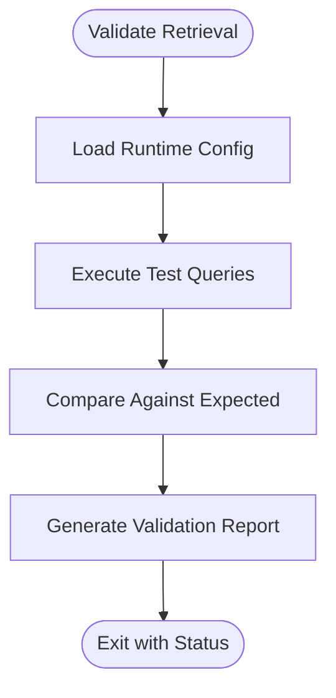
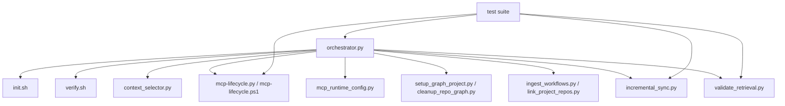

# Scripting & Automation Patterns

<cite>
**Referenced Files in This Document**
- [ReadMe.md](file://ReadMe.md)
- [Makefile](file://Makefile)
- [dev.sh](file://dev.sh)
- [dev.bat](file://dev.bat)
- [dev.ps1](file://dev.ps1)
- [install-windows.bat](file://install-windows.bat)
- [install-windows.ps1](file://install-windows.ps1)
- [harness/scripts/orchestrator.py](file://harness/scripts/orchestrator.py)
- [harness/scripts/init.sh](file://harness/scripts/init.sh)
- [harness/scripts/verify.sh](file://harness/scripts/verify.sh)
- [harness/scripts/context_selector.py](file://harness/scripts/context_selector.py)
- [scripts/mcp-lifecycle.py](file://scripts/mcp-lifecycle.py)
- [scripts/mcp-lifecycle.ps1](file://scripts/mcp-lifecycle.ps1)
- [scripts/mcp_runtime_config.py](file://scripts/mcp_runtime_config.py)
- [scripts/validate_retrieval.py](file://scripts/validate_retrieval.py)
- [code-tiny/scripts/setup_graph_project.py](file://code-tiny/scripts/setup_graph_project.py)
- [code-tiny/scripts/cleanup_repo_graph.py](file://code-tiny/scripts/cleanup_repo_graph.py)
- [code-tiny/scripts/ingest_workflows.py](file://code-tiny/scripts/ingest_workflows.py)
- [code-tiny/scripts/link_project_repos.py](file://code-tiny/scripts/link_project_repos.py)
- [code-tiny/scripts/migrate_repo_file_edges.py](file://code-tiny/scripts/migrate_repo_file_edges.py)
- [code-tiny/scripts/setup_constraints.py](file://code-tiny/scripts/setup_constraints.py)
- [code-tiny/livingdoc/living-doc-pipeline.py](file://code-tiny/livingdoc/living-doc-pipeline.py)
- [code-tiny/livingdoc/living-doc-summarize.py](file://code-tiny/livingdoc/living-doc-summarize.py)
- [code-tiny/livingdoc/living-doc-vectorize.py](file://code-tiny/livingdoc/living-doc-vectorize.py)
- [code-tiny/livingdoc/living-doc-vectorize-infra.py](file://code-tiny/livingdoc/living-doc-vectorize-infra.py)
- [code-tiny/livingdoc/living-doc-summarize-infra.py](file://code-tiny/livingdoc/living-doc-summarize-infra.py)
- [code-tiny/livingdoc/living-doc-link.py](file://code-tiny/livingdoc/living-doc-link.py)
- [code-tiny/livingdoc/louvain.md](file://code-tiny/livingdoc/louvain.md)
- [code-tiny/livingdoc/strategy.md](file://code-tiny/livingdoc/strategy.md)
- [code-tiny/tools/common/harness_config.py](file://code-tiny/tools/common/harness_config.py)
- [code-tiny/tools/graph/cli.py](file://code-tiny/tools/graph/cli.py)
- [code-tiny/tools/sync/incremental_sync.py](file://code-tiny/tools/sync/incremental_sync.py)
- [code-tiny/tools/sync/dead_code_report.py](file://code-tiny/tools/sync/dead_code_report.py)
- [code-tiny/tools/sync/message_scan.py](file://code-tiny/tools/sync/message_scan.py)
- [code-tiny/tools/sync/owner_manifest.py](file://code-tiny/tools/sync/owner_manifest.py)
- [code-tiny/tools/sync/build_owner_manifests.py](file://code-tiny/tools/sync/build_owner_manifests.py)
- [tests/test_dev_lifecycle_commands.py](file://tests/test_dev_lifecycle_commands.py)
- [tests/test_make_lifecycle.py](file://tests/test_make_lifecycle.py)
- [tests/test_mcp_runtime_config.py](file://tests/test_mcp_runtime_config.py)
- [tests/test_incremental_sync_bootstrap.py](file://tests/test_incremental_sync_bootstrap.py)
- [tests/test_incremental_sync_lock.py](file://tests/test_incremental_sync_lock.py)
- [tests/test_incremental_sync_state_migration.py](file://tests/test_incremental_sync_state_migration.py)
- [tests/test_incremental_sync_submodules.py](file://tests/test_incremental_sync_submodules.py)
- [tests/test_incremental_sync_worktree.py](file://tests/test_incremental_sync_worktree.py)
- [tests/test_git_change_detection.py](file://tests/test_git_change_detection.py)
- [tests/test_source_inventory.py](file://tests/test_source_inventory.py)
- [tests/test_primary_analyzer_vector_contract.py](file://tests/test_primary_analyzer_vector_contract.py)
- [tests/test_primary_vector_sync.py](file://tests/test_primary_vector_sync.py)
- [tests/test_validate_retrieval.py](file://tests/test_validate_retrieval.py)
- [tests/test_framework_fixture_analysis.py](file://tests/test_framework_fixture_analysis.py)
- [tests/test_cobol_fixture_analysis.py](file://tests/test_cobol_fixture_analysis.py)
- [tests/test_dart_fixture_analysis.py](file://tests/test_dart_fixture_analysis.py)
- [tests/test_perl_integration.py](file://tests/test_perl_integration.py)
- [tests/test_aspnet_integration.py](file://tests/test_aspnet_integration.py)
- [tests/test_unified_mcp_input_coercion.py](file://tests/test_unified_mcp_input_coercion.py)
- [tests/test_unified_mcp_wrapper_signatures.py](file://tests/test_unified_mcp_wrapper_signatures.py)
- [tests/test_mcp_http_resilience.py](file://tests/test_mcp_http_resilience.py)
- [tests/test_mcp_acceptance_matrix.py](file://tests/test_mcp_acceptance_matrix.py)
- [tests/test_falkordb_driver.py](file://tests/test_falkordb_driver.py)
- [tests/test_explore_graph_falkor_compat.py](file://tests/test_explore_graph_falkor_compat.py)
- [tests/test_doc_graph_store.py](file://tests/test_doc_graph_store.py)
- [tests/test_semantic_graph_expansion.py](file://tests/test_semantic_graph_expansion.py)
- [tests/test_qdrant_collection_scope.py](file://tests/test_qdrant_collection_scope.py)
- [tests/test_struts_common_integration.py](file://tests/test_struts_common_integration.py)
- [tests/test_struts_scan_filtering.py](file://tests/test_struts_scan_filtering.py)
- [tests/test_web_framework_overlay.py](file://tests/test_web_framework_overlay.py)
- [tests/test_framework_analyzer_imports.py](file://tests/test_framework_analyzer_imports.py)
- [tests/test_framework_graph_contract.py](file://tests/test_framework_graph_contract.py)
- [tests/test_framework_mcp_flows.py](file://tests/test_framework_mcp_flows.py)
- [tests/test_framework_mcp_routing.py](file://tests/test_framework_mcp_routing.py)
- [tests/test_framework_mcp_search.py](file://tests/test_framework_mcp_search.py)
- [tests/test_dev_init_graph_provider.py](file://tests/test_dev_init_graph_provider.py)
- [tests/test_dev_sync_reliability.py](file://tests/test_dev_sync_reliability.py)
- [tests/test_dev_cobol_parser_discovery.py](file://tests/test_dev_cobol_parser_discovery.py)
- [tests/test_dev_framework_parser_discovery.py](file://tests/test_dev_framework_parser_discovery.py)
- [tests/test_cplus_windows_resource_parser.py](file://tests/test_cplus_windows_resource_parser.py)
- [tests/test_flutter_protocol.py](file://tests/test_flutter_protocol.py)
- [tests/test_flutter_project_detection.py](file://tests/test_flutter_analyzer_imports.py)
- [tests/test_cobol_error_recovery.py](file://tests/test_cobol_error_recovery.py)
- [tests/test_cobol_fact_contract.py](file://tests/test_cobol_fact_contract.py)
- [tests/test_cobol_incremental_resolution.py](file://tests/test_cobol_incremental_resolution.py)
- [tests/test_cobol_mcp_routing.py](file://tests/test_cobol_mcp_routing.py)
- [tests/test_cobol_performance.py](file://tests/test_cobol_performance.py)
- [tests/test_cobol_qdrant_contract.py](file://tests/test_cobol_qdrant_contract.py)
- [tests/test_cobol_source_formats.py](file://tests/test_cobol_source_formats.py)
- [tests/test_common_analyzer_registry.py](file://tests/test_common_analyzer_registry.py)
- [tests/test_database_schema_overlay.py](file://tests/test_database_schema_overlay.py)
- [tests/test_incremental_sync_cobol.py](file://tests/test_incremental_sync_cobol.py)
- [tests/test_incremental_sync_framework_overlays.py](file://tests/test_incremental_sync_framework_overlays.py)
- [tests/test_incremental_sync_graph_setup.py](file://tests/test_incremental_sync_graph_setup.py)
- [tests/test_incremental_sync_non_git.py](file://tests/test_incremental_sync_non_git.py)
- [tests/test_perl_parser.py](file://tests/test_perl_parser.py)
- [tests/test_primary_analyzer_vector_contract.py](file://tests/test_primary_analyzer_vector_contract.py)
- [tests/test_primary_vector_sync.py](file://tests/test_primary_vector_sync.py)
- [tests/test_validate_retrieval.py](file://tests/test_validate_retrieval.py)
</cite>

## Table of Contents
1. [Introduction](#introduction)
2. [Project Structure](#project-structure)
3. [Core Components](#core-components)
4. [Architecture Overview](#architecture-overview)
5. [Detailed Component Analysis](#detailed-component-analysis)
6. [Dependency Analysis](#dependency-analysis)
7. [Performance Considerations](#performance-considerations)
8. [Troubleshooting Guide](#troubleshooting-guide)
9. [Conclusion](#conclusion)
10. [Appendices](#appendices)

## Introduction
This document provides comprehensive scripting and automation patterns for Cortex Harness CLI. It focuses on integrating CLI commands into shell scripts, Python automation, and CI/CD pipelines. It covers programmatic invocation patterns, output parsing techniques, error handling strategies, logging configuration, progress tracking, result aggregation, Git hooks, pre-commit checks, scheduled jobs, and performance optimization for large-scale automation and parallel processing.

The repository includes:
- Cross-platform entry points and lifecycle helpers (shell and PowerShell)
- Orchestrator and verification utilities under harness/scripts
- MCP lifecycle and runtime configuration scripts
- Graph setup, cleanup, and workflow ingestion scripts
- Incremental sync and reporting tools
- Extensive tests that demonstrate expected behaviors and contracts

## Project Structure
At a high level, automation is organized around:
- Entry points and lifecycle scripts for development and installation
- Orchestration and verification utilities
- MCP lifecycle and runtime configuration
- Graph and data pipeline scripts
- Incremental synchronization and reporting
- Tests that validate behavior and serve as usage examples

```mermaid
graph TB
subgraph "Entry Points"
DEV_SH["dev.sh"]
DEV_BAT["dev.bat"]
DEV_PS1["dev.ps1"]
INSTALL_WIN_BAT["install-windows.bat"]
INSTALL_WIN_PS1["install-windows.ps1"]
end
subgraph "Orchestration"
ORCH["harness/scripts/orchestrator.py"]
INIT_SH["harness/scripts/init.sh"]
VERIFY_SH["harness/scripts/verify.sh"]
CTX_SEL["harness/scripts/context_selector.py"]
end
subgraph "MCP Lifecycle"
MCP_LIFECYCLE_PY["scripts/mcp-lifecycle.py"]
MCP_LIFECYCLE_PS1["scripts/mcp-lifecycle.ps1"]
MCP_RUNTIME_CFG["scripts/mcp_runtime_config.py"]
end
subgraph "Graph & Data"
SETUP_GRAPH["code-tiny/scripts/setup_graph_project.py"]
CLEANUP_GRAPH["code-tiny/scripts/cleanup_repo_graph.py"]
INGEST_WF["code-tiny/scripts/ingest_workflows.py"]
LINK_REPOS["code-tiny/scripts/link_project_repos.py"]
MIGRATE_EDGES["code-tiny/scripts/migrate_repo_file_edges.py"]
SETUP_CONSTRAINTS["code-tiny/scripts/setup_constraints.py"]
end
subgraph "Incremental Sync & Reports"
INC_SYNC["code-tiny/tools/sync/incremental_sync.py"]
DEAD_CODE["code-tiny/tools/sync/dead_code_report.py"]
MSG_SCAN["code-tiny/tools/sync/message_scan.py"]
OWNER_MANIFEST["code-tiny/tools/sync/owner_manifest.py"]
BUILD_OWNER["code-tiny/tools/sync/build_owner_manifests.py"]
end
subgraph "Validation"
VALIDATE_RET["scripts/validate_retrieval.py"]
end
DEV_SH --> ORCH
DEV_BAT --> ORCH
DEV_PS1 --> ORCH
INSTALL_WIN_BAT --> ORCH
INSTALL_WIN_PS1 --> ORCH
ORCH --> INIT_SH
ORCH --> VERIFY_SH
ORCH --> CTX_SEL
ORCH --> MCP_LIFECYCLE_PY
ORCH --> MCP_LIFECYCLE_PS1
ORCH --> MCP_RUNTIME_CFG
ORCH --> SETUP_GRAPH
ORCH --> CLEANUP_GRAPH
ORCH --> INGEST_WF
ORCH --> LINK_REPOS
ORCH --> MIGRATE_EDGES
ORCH --> SETUP_CONSTRAINTS
ORCH --> INC_SYNC
ORCH --> DEAD_CODE
ORCH --> MSG_SCAN
ORCH --> OWNER_MANIFEST
ORCH --> BUILD_OWNER
ORCH --> VALIDATE_RET
```



**Diagram sources**
- [dev.sh](file://dev.sh)
- [dev.bat](file://dev.bat)
- [dev.ps1](file://dev.ps1)
- [install-windows.bat](file://install-windows.bat)
- [install-windows.ps1](file://install-windows.ps1)
- [harness/scripts/orchestrator.py](file://harness/scripts/orchestrator.py)
- [harness/scripts/init.sh](file://harness/scripts/init.sh)
- [harness/scripts/verify.sh](file://harness/scripts/verify.sh)
- [harness/scripts/context_selector.py](file://harness/scripts/context_selector.py)
- [scripts/mcp-lifecycle.py](file://scripts/mcp-lifecycle.py)
- [scripts/mcp-lifecycle.ps1](file://scripts/mcp-lifecycle.ps1)
- [scripts/mcp_runtime_config.py](file://scripts/mcp_runtime_config.py)
- [code-tiny/scripts/setup_graph_project.py](file://code-tiny/scripts/setup_graph_project.py)
- [code-tiny/scripts/cleanup_repo_graph.py](file://code-tiny/scripts/cleanup_repo_graph.py)
- [code-tiny/scripts/ingest_workflows.py](file://code-tiny/scripts/ingest_workflows.py)
- [code-tiny/scripts/link_project_repos.py](file://code-tiny/scripts/link_project_repos.py)
- [code-tiny/scripts/migrate_repo_file_edges.py](file://code-tiny/scripts/migrate_repo_file_edges.py)
- [code-tiny/scripts/setup_constraints.py](file://code-tiny/scripts/setup_constraints.py)
- [code-tiny/tools/sync/incremental_sync.py](file://code-tiny/tools/sync/incremental_sync.py)
- [code-tiny/tools/sync/dead_code_report.py](file://code-tiny/tools/sync/dead_code_report.py)
- [code-tiny/tools/sync/message_scan.py](file://code-tiny/tools/sync/message_scan.py)
- [code-tiny/tools/sync/owner_manifest.py](file://code-tiny/tools/sync/owner_manifest.py)
- [code-tiny/tools/sync/build_owner_manifests.py](file://code-tiny/tools/sync/build_owner_manifests.py)
- [scripts/validate_retrieval.py](file://scripts/validate_retrieval.py)

**Section sources**
- [ReadMe.md](file://ReadMe.md)
- [Makefile](file://Makefile)

## Core Components
- Development and installation entry points: cross-platform scripts to bootstrap and run the harness.
- Orchestrator: central script coordinating initialization, verification, context selection, and lifecycle tasks.
- MCP lifecycle and runtime config: scripts to manage MCP server lifecycle and runtime configuration.
- Graph and data pipeline scripts: setup, cleanup, ingestion, linking, migration, and constraint management.
- Incremental sync and reporting: incremental synchronization, dead code reports, message scanning, owner manifests, and manifest building.
- Validation utilities: retrieval validation and acceptance checks.

These components are designed to be invoked from shell scripts, Python automation, and CI/CD pipelines with consistent exit codes and structured outputs suitable for parsing.

**Section sources**
- [harness/scripts/orchestrator.py](file://harness/scripts/orchestrator.py)
- [harness/scripts/init.sh](file://harness/scripts/init.sh)
- [harness/scripts/verify.sh](file://harness/scripts/verify.sh)
- [harness/scripts/context_selector.py](file://harness/scripts/context_selector.py)
- [scripts/mcp-lifecycle.py](file://scripts/mcp-lifecycle.py)
- [scripts/mcp-lifecycle.ps1](file://scripts/mcp-lifecycle.ps1)
- [scripts/mcp_runtime_config.py](file://scripts/mcp_runtime_config.py)
- [code-tiny/scripts/setup_graph_project.py](file://code-tiny/scripts/setup_graph_project.py)
- [code-tiny/scripts/cleanup_repo_graph.py](file://code-tiny/scripts/cleanup_repo_graph.py)
- [code-tiny/scripts/ingest_workflows.py](file://code-tiny/scripts/ingest_workflows.py)
- [code-tiny/scripts/link_project_repos.py](file://code-tiny/scripts/link_project_repos.py)
- [code-tiny/scripts/migrate_repo_file_edges.py](file://code-tiny/scripts/migrate_repo_file_edges.py)
- [code-tiny/scripts/setup_constraints.py](file://code-tiny/scripts/setup_constraints.py)
- [code-tiny/tools/sync/incremental_sync.py](file://code-tiny/tools/sync/incremental_sync.py)
- [code-tiny/tools/sync/dead_code_report.py](file://code-tiny/tools/sync/dead_code_report.py)
- [code-tiny/tools/sync/message_scan.py](file://code-tiny/tools/sync/message_scan.py)
- [code-tiny/tools/sync/owner_manifest.py](file://code-tiny/tools/sync/owner_manifest.py)
- [code-tiny/tools/sync/build_owner_manifests.py](file://code-tiny/tools/sync/build_owner_manifests.py)
- [scripts/validate_retrieval.py](file://scripts/validate_retrieval.py)

## Architecture Overview
The automation architecture centers on an orchestrator that composes smaller, focused scripts and utilities. The orchestrator coordinates environment setup, graph operations, MCP lifecycle, and verification steps. Shell and PowerShell entry points provide platform-specific bootstrapping.



**Diagram sources**
- [dev.sh](file://dev.sh)
- [dev.bat](file://dev.bat)
- [dev.ps1](file://dev.ps1)
- [harness/scripts/orchestrator.py](file://harness/scripts/orchestrator.py)
- [harness/scripts/init.sh](file://harness/scripts/init.sh)
- [harness/scripts/verify.sh](file://harness/scripts/verify.sh)
- [harness/scripts/context_selector.py](file://harness/scripts/context_selector.py)
- [scripts/mcp-lifecycle.py](file://scripts/mcp-lifecycle.py)
- [scripts/mcp-lifecycle.ps1](file://scripts/mcp-lifecycle.ps1)
- [scripts/mcp_runtime_config.py](file://scripts/mcp_runtime_config.py)
- [code-tiny/scripts/setup_graph_project.py](file://code-tiny/scripts/setup_graph_project.py)
- [code-tiny/scripts/cleanup_repo_graph.py](file://code-tiny/scripts/cleanup_repo_graph.py)
- [code-tiny/scripts/ingest_workflows.py](file://code-tiny/scripts/ingest_workflows.py)
- [code-tiny/scripts/link_project_repos.py](file://code-tiny/scripts/link_project_repos.py)
- [code-tiny/tools/sync/incremental_sync.py](file://code-tiny/tools/sync/incremental_sync.py)
- [scripts/validate_retrieval.py](file://scripts/validate_retrieval.py)

## Detailed Component Analysis

### Orchestrator and Verification Utilities
The orchestrator coordinates multiple subtasks including initialization, context selection, graph operations, MCP lifecycle, incremental sync, and verification. Verification utilities ensure system readiness and correctness.



**Diagram sources**
- [harness/scripts/orchestrator.py](file://harness/scripts/orchestrator.py)
- [harness/scripts/init.sh](file://harness/scripts/init.sh)
- [harness/scripts/verify.sh](file://harness/scripts/verify.sh)
- [harness/scripts/context_selector.py](file://harness/scripts/context_selector.py)
- [code-tiny/scripts/setup_graph_project.py](file://code-tiny/scripts/setup_graph_project.py)
- [code-tiny/scripts/cleanup_repo_graph.py](file://code-tiny/scripts/cleanup_repo_graph.py)
- [code-tiny/scripts/ingest_workflows.py](file://code-tiny/scripts/ingest_workflows.py)
- [code-tiny/scripts/link_project_repos.py](file://code-tiny/scripts/link_project_repos.py)
- [scripts/mcp-lifecycle.py](file://scripts/mcp-lifecycle.py)
- [scripts/mcp-lifecycle.ps1](file://scripts/mcp-lifecycle.ps1)
- [scripts/mcp_runtime_config.py](file://scripts/mcp_runtime_config.py)
- [code-tiny/tools/sync/incremental_sync.py](file://code-tiny/tools/sync/incremental_sync.py)

**Section sources**
- [harness/scripts/orchestrator.py](file://harness/scripts/orchestrator.py)
- [harness/scripts/init.sh](file://harness/scripts/init.sh)
- [harness/scripts/verify.sh](file://harness/scripts/verify.sh)
- [harness/scripts/context_selector.py](file://harness/scripts/context_selector.py)

### MCP Lifecycle and Runtime Configuration
MCP lifecycle scripts manage starting, stopping, and monitoring the MCP server across platforms. Runtime configuration applies settings required by the harness and MCP components.



**Diagram sources**
- [scripts/mcp-lifecycle.py](file://scripts/mcp-lifecycle.py)
- [scripts/mcp-lifecycle.ps1](file://scripts/mcp-lifecycle.ps1)
- [scripts/mcp_runtime_config.py](file://scripts/mcp_runtime_config.py)
- [harness/scripts/orchestrator.py](file://harness/scripts/orchestrator.py)

**Section sources**
- [scripts/mcp-lifecycle.py](file://scripts/mcp-lifecycle.py)
- [scripts/mcp-lifecycle.ps1](file://scripts/mcp-lifecycle.ps1)
- [scripts/mcp_runtime_config.py](file://scripts/mcp_runtime_config.py)

### Graph Setup, Cleanup, and Workflow Ingestion
Graph-related scripts handle repository graph initialization, cleanup, workflow ingestion, linking repositories, migrating edges, and setting constraints. These are commonly orchestrated by the main orchestrator but can also be invoked directly for targeted tasks.



**Diagram sources**
- [code-tiny/scripts/setup_graph_project.py](file://code-tiny/scripts/setup_graph_project.py)
- [code-tiny/scripts/cleanup_repo_graph.py](file://code-tiny/scripts/cleanup_repo_graph.py)
- [code-tiny/scripts/ingest_workflows.py](file://code-tiny/scripts/ingest_workflows.py)
- [code-tiny/scripts/link_project_repos.py](file://code-tiny/scripts/link_project_repos.py)
- [code-tiny/scripts/migrate_repo_file_edges.py](file://code-tiny/scripts/migrate_repo_file_edges.py)
- [code-tiny/scripts/setup_constraints.py](file://code-tiny/scripts/setup_constraints.py)

**Section sources**
- [code-tiny/scripts/setup_graph_project.py](file://code-tiny/scripts/setup_graph_project.py)
- [code-tiny/scripts/cleanup_repo_graph.py](file://code-tiny/scripts/cleanup_repo_graph.py)
- [code-tiny/scripts/ingest_workflows.py](file://code-tiny/scripts/ingest_workflows.py)
- [code-tiny/scripts/link_project_repos.py](file://code-tiny/scripts/link_project_repos.py)
- [code-tiny/scripts/migrate_repo_file_edges.py](file://code-tiny/scripts/migrate_repo_file_edges.py)
- [code-tiny/scripts/setup_constraints.py](file://code-tiny/scripts/setup_constraints.py)

### Incremental Sync and Reporting
Incremental sync maintains up-to-date graph state efficiently. Reporting tools generate insights such as dead code analysis, message scans, and owner manifests.



**Diagram sources**
- [code-tiny/tools/sync/incremental_sync.py](file://code-tiny/tools/sync/incremental_sync.py)
- [code-tiny/tools/sync/dead_code_report.py](file://code-tiny/tools/sync/dead_code_report.py)
- [code-tiny/tools/sync/message_scan.py](file://code-tiny/tools/sync/message_scan.py)
- [code-tiny/tools/sync/owner_manifest.py](file://code-tiny/tools/sync/owner_manifest.py)
- [code-tiny/tools/sync/build_owner_manifests.py](file://code-tiny/tools/sync/build_owner_manifests.py)

**Section sources**
- [code-tiny/tools/sync/incremental_sync.py](file://code-tiny/tools/sync/incremental_sync.py)
- [code-tiny/tools/sync/dead_code_report.py](file://code-tiny/tools/sync/dead_code_report.py)
- [code-tiny/tools/sync/message_scan.py](file://code-tiny/tools/sync/message_scan.py)
- [code-tiny/tools/sync/owner_manifest.py](file://code-tiny/tools/sync/owner_manifest.py)
- [code-tiny/tools/sync/build_owner_manifests.py](file://code-tiny/tools/sync/build_owner_manifests.py)

### Retrieval Validation
Retrieval validation ensures that queries return expected results and that the underlying graph and vector stores are functioning correctly.



**Diagram sources**
- [scripts/validate_retrieval.py](file://scripts/validate_retrieval.py)
- [scripts/mcp_runtime_config.py](file://scripts/mcp_runtime_config.py)

**Section sources**
- [scripts/validate_retrieval.py](file://scripts/validate_retrieval.py)

### Living Documentation Pipeline
Living documentation scripts automate generation, summarization, vectorization, and linking of documentation assets. They can be integrated into CI/CD to keep docs synchronized with code changes.

```mermaid
sequenceDiagram
participant CI as "CI Pipeline"
participant Pipeline as "living-doc-pipeline.py"
participant Summarize as "living-doc-summarize.py"
participant Vectorize as "living-doc-vectorize.py"
participant VectorizeInfra as "living-doc-vectorize-infra.py"
participant SummarizeInfra as "living-doc-summarize-infra.py"
participant Link as "living-doc-link.py"
CI->>Pipeline : "Trigger doc pipeline"
Pipeline->>Summarize : "Summarize content"
Summarize-->>Pipeline : "Summaries"
Pipeline->>Vectorize : "Vectorize summaries"
Vectorize-->>Pipeline : "Vectors"
Pipeline->>VectorizeInfra : "Vectorize infra docs"
VectorizeInfra-->>Pipeline : "Infra vectors"
Pipeline->>SummarizeInfra : "Summarize infra docs"
SummarizeInfra-->>Pipeline : "Infra summaries"
Pipeline->>Link : "Link documents"
Link-->>Pipeline : "Linked docs"
Pipeline-->>CI : "Artifacts and status"
```

**Diagram sources**
- [code-tiny/livingdoc/living-doc-pipeline.py](file://code-tiny/livingdoc/living-doc-pipeline.py)
- [code-tiny/livingdoc/living-doc-summarize.py](file://code-tiny/livingdoc/living-doc-summarize.py)
- [code-tiny/livingdoc/living-doc-vectorize.py](file://code-tiny/livingdoc/living-doc-vectorize.py)
- [code-tiny/livingdoc/living-doc-vectorize-infra.py](file://code-tiny/livingdoc/living-doc-vectorize-infra.py)
- [code-tiny/livingdoc/living-doc-summarize-infra.py](file://code-tiny/livingdoc/living-doc-summarize-infra.py)
- [code-tiny/livingdoc/living-doc-link.py](file://code-tiny/livingdoc/living-doc-link.py)

**Section sources**
- [code-tiny/livingdoc/living-doc-pipeline.py](file://code-tiny/livingdoc/living-doc-pipeline.py)
- [code-tiny/livingdoc/living-doc-summarize.py](file://code-tiny/livingdoc/living-doc-summarize.py)
- [code-tiny/livingdoc/living-doc-vectorize.py](file://code-tiny/livingdoc/living-doc-vectorize.py)
- [code-tiny/livingdoc/living-doc-vectorize-infra.py](file://code-tiny/livingdoc/living-doc-vectorize-infra.py)
- [code-tiny/livingdoc/living-doc-summarize-infra.py](file://code-tiny/livingdoc/living-doc-summarize-infra.py)
- [code-tiny/livingdoc/living-doc-link.py](file://code-tiny/livingdoc/living-doc-link.py)

## Dependency Analysis
Automation components depend on each other through the orchestrator and shared configuration. Tests validate these dependencies and contracts.



**Diagram sources**
- [harness/scripts/orchestrator.py](file://harness/scripts/orchestrator.py)
- [harness/scripts/init.sh](file://harness/scripts/init.sh)
- [harness/scripts/verify.sh](file://harness/scripts/verify.sh)
- [harness/scripts/context_selector.py](file://harness/scripts/context_selector.py)
- [scripts/mcp-lifecycle.py](file://scripts/mcp-lifecycle.py)
- [scripts/mcp-lifecycle.ps1](file://scripts/mcp-lifecycle.ps1)
- [scripts/mcp_runtime_config.py](file://scripts/mcp_runtime_config.py)
- [code-tiny/scripts/setup_graph_project.py](file://code-tiny/scripts/setup_graph_project.py)
- [code-tiny/scripts/cleanup_repo_graph.py](file://code-tiny/scripts/cleanup_repo_graph.py)
- [code-tiny/scripts/ingest_workflows.py](file://code-tiny/scripts/ingest_workflows.py)
- [code-tiny/scripts/link_project_repos.py](file://code-tiny/scripts/link_project_repos.py)
- [code-tiny/tools/sync/incremental_sync.py](file://code-tiny/tools/sync/incremental_sync.py)
- [scripts/validate_retrieval.py](file://scripts/validate_retrieval.py)
- [tests/test_dev_lifecycle_commands.py](file://tests/test_dev_lifecycle_commands.py)
- [tests/test_mcp_runtime_config.py](file://tests/test_mcp_runtime_config.py)
- [tests/test_incremental_sync_bootstrap.py](file://tests/test_incremental_sync_bootstrap.py)
- [tests/test_incremental_sync_lock.py](file://tests/test_incremental_sync_lock.py)
- [tests/test_incremental_sync_state_migration.py](file://tests/test_incremental_sync_state_migration.py)
- [tests/test_incremental_sync_submodules.py](file://tests/test_incremental_sync_submodules.py)
- [tests/test_incremental_sync_worktree.py](file://tests/test_incremental_sync_worktree.py)
- [tests/test_validate_retrieval.py](file://tests/test_validate_retrieval.py)

**Section sources**
- [tests/test_dev_lifecycle_commands.py](file://tests/test_dev_lifecycle_commands.py)
- [tests/test_mcp_runtime_config.py](file://tests/test_mcp_runtime_config.py)
- [tests/test_incremental_sync_bootstrap.py](file://tests/test_incremental_sync_bootstrap.py)
- [tests/test_incremental_sync_lock.py](file://tests/test_incremental_sync_lock.py)
- [tests/test_incremental_sync_state_migration.py](file://tests/test_incremental_sync_state_migration.py)
- [tests/test_incremental_sync_submodules.py](file://tests/test_incremental_sync_submodules.py)
- [tests/test_incremental_sync_worktree.py](file://tests/test_incremental_sync_worktree.py)
- [tests/test_validate_retrieval.py](file://tests/test_validate_retrieval.py)

## Performance Considerations
- Prefer incremental sync over full re-ingestion when possible to reduce runtime and resource usage.
- Use targeted graph operations (setup/cleanup) only when necessary; avoid redundant runs.
- Parallelize independent tasks where safe (e.g., separate repo ingestion), ensuring idempotency and avoiding lock contention.
- Cache intermediate artifacts (summaries, vectors) to minimize recomputation.
- Monitor MCP health endpoints and back off on transient failures.
- Limit scope of analysis using context selectors and filters to reduce workload.

[No sources needed since this section provides general guidance]

## Troubleshooting Guide
Common issues and strategies:
- MCP startup failures: verify runtime configuration and health endpoints; restart lifecycle via lifecycle scripts.
- Graph inconsistencies: run cleanup and setup again; check incremental sync state and locks.
- Retrieval validation errors: inspect validation report and adjust runtime configuration or test queries.
- Lock contention: ensure exclusive access during critical operations; use provided locking mechanisms.
- Non-Git repositories: confirm non-git mode support and path resolution.

**Section sources**
- [tests/test_mcp_runtime_config.py](file://tests/test_mcp_runtime_config.py)
- [tests/test_incremental_sync_lock.py](file://tests/test_incremental_sync_lock.py)
- [tests/test_incremental_sync_non_git.py](file://tests/test_incremental_sync_non_git.py)
- [tests/test_validate_retrieval.py](file://tests/test_validate_retrieval.py)

## Conclusion
Cortex Harness CLI automation is built around a modular orchestrator and focused scripts for graph operations, MCP lifecycle, incremental sync, and validation. By composing these components, you can implement robust automation for code analysis, quality gates, reporting, and deployment verification across shell, Python, and CI/CD environments.

[No sources needed since this section summarizes without analyzing specific files]

## Appendices

### Programmatic Invocation Patterns
- Shell scripts: invoke orchestrator and sub-scripts with explicit arguments; capture exit codes and log output.
- Python automation: import and call functions from orchestrator and utility modules; handle exceptions and structured outputs.
- CI/CD pipelines: define stages for setup, analysis, verification, and reporting; aggregate artifacts and publish results.

[No sources needed since this section provides general guidance]

### Output Parsing Techniques
- Parse JSON or structured logs emitted by scripts for automated decision-making.
- Use exit codes to determine pass/fail conditions in pipelines.
- Aggregate results from multiple runs into summary reports.

[No sources needed since this section provides general guidance]

### Error Handling Strategies
- Implement retries with exponential backoff for networked services (MCP).
- Fail fast on configuration errors; provide actionable messages.
- Capture and persist logs for post-mortem analysis.

[No sources needed since this section provides general guidance]

### Logging Configuration
- Centralize logging configuration via runtime config scripts.
- Ensure consistent log formats across scripts for easy parsing.
- Route logs to persistent storage for auditing.

[No sources needed since this section provides general guidance]

### Progress Tracking and Result Aggregation
- Emit periodic progress markers for long-running tasks.
- Combine partial results into final reports.
- Track metrics like duration, change counts, and issue totals.

[No sources needed since this section provides general guidance]

### Ready-to-Use Script Templates
- Automated code analysis: orchestrate graph setup, incremental sync, and validation.
- Quality gates: enforce thresholds on findings and block merges if violated.
- Reporting generation: summarize analysis results and publish artifacts.
- Deployment verification: run retrieval validation and integration checks post-deploy.

[No sources needed since this section provides general guidance]

### Git Hooks and Pre-commit Checks
- Pre-commit: run lightweight checks (linting, quick validation) before commit.
- Post-merge: trigger full analysis and update living documentation.

[No sources needed since this section provides general guidance]

### Scheduled Analysis Jobs
- Cron or CI schedules: run nightly full analyses and weekly deep dives.
- Incremental updates: run frequently to keep graphs current.

[No sources needed since this section provides general guidance]

### Parallel Processing Strategies
- Partition work by repository or module; ensure isolation and idempotency.
- Use job queues or process pools to control concurrency.
- Avoid shared mutable state; rely on durable artifacts and locks.

[No sources needed since this section provides general guidance]