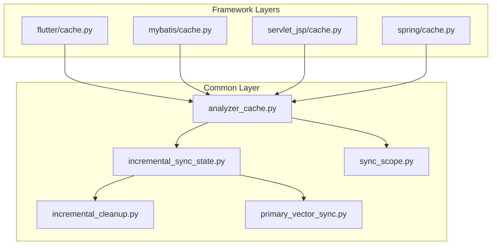
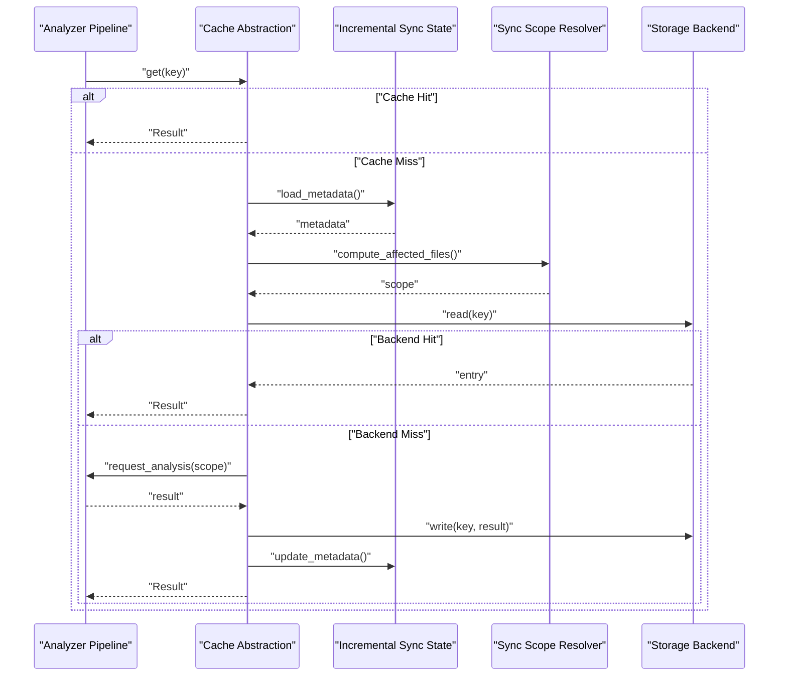
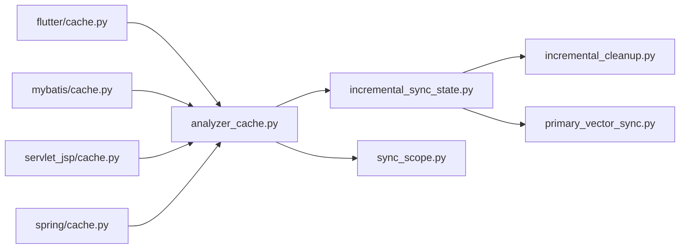

# Analyzer Caching & Performance Optimization

<cite>
**Referenced Files in This Document**
- [analyzer_cache.py](file://code-tiny/tools/common/analyzer_cache.py)
- [incremental_sync_state.py](file://code-tiny/tools/common/incremental_sync_state.py)
- [sync_scope.py](file://code-tiny/tools/common/sync_scope.py)
- [incremental_cleanup.py](file://code-tiny/tools/common/incremental_cleanup.py)
- [primary_vector_sync.py](file://code-tiny/tools/common/primary_vector_sync.py)
- [flutter/cache.py](file://code-tiny/tools/flutter/cache.py)
- [mybatis/cache.py](file://code-tiny/tools/mybatis/cache.py)
- [servlet_jsp/cache.py](file://code-tiny/tools/servlet_jsp/cache.py)
- [spring/cache.py](file://code-tiny/tools/spring/cache.py)
</cite>

## Table of Contents
1. [Introduction](#introduction)
2. [Project Structure](#project-structure)
3. [Core Components](#core-components)
4. [Architecture Overview](#architecture-overview)
5. [Detailed Component Analysis](#detailed-component-analysis)
6. [Dependency Analysis](#dependency-analysis)
7. [Performance Considerations](#performance-considerations)
8. [Troubleshooting Guide](#troubleshooting-guide)
9. [Conclusion](#conclusion)
10. [Appendices](#appendices)

## Introduction
This document explains the analyzer caching mechanisms and performance optimization strategies implemented across the codebase. It focuses on cache architecture, keys, invalidation policies, storage backends, incremental analysis capabilities, configuration examples, custom providers, warming strategies, integration with incremental sync state management, change detection algorithms, monitoring metrics, distributed caching considerations, consistency in multi-process environments, and troubleshooting guidance for corruption, bottlenecks, and memory leaks.

## Project Structure
The repository organizes caching and incremental logic primarily under the common tools module and framework-specific analyzers:
- Common layer: shared cache abstraction, incremental sync state, scope resolution, cleanup utilities, and primary vector synchronization.
- Framework layers: per-framework caches (Flutter, MyBatis, Servlet/JSP, Spring) that build on or extend common patterns.

**Diagram sources**
- [analyzer_cache.py](file://code-tiny/tools/common/analyzer_cache.py)
- [incremental_sync_state.py](file://code-tiny/tools/common/incremental_sync_state.py)
- [sync_scope.py](file://code-tiny/tools/common/sync_scope.py)
- [incremental_cleanup.py](file://code-tiny/tools/common/incremental_cleanup.py)
- [primary_vector_sync.py](file://code-tiny/tools/common/primary_vector_sync.py)
- [flutter/cache.py](file://code-tiny/tools/flutter/cache.py)
- [mybatis/cache.py](file://code-tiny/tools/mybatis/cache.py)
- [servlet_jsp/cache.py](file://code-tiny/tools/servlet_jsp/cache.py)
- [spring/cache.py](file://code-tiny/tools/spring/cache.py)

**Section sources**
- [analyzer_cache.py](file://code-tiny/tools/common/analyzer_cache.py)
- [incremental_sync_state.py](file://code-tiny/tools/common/incremental_sync_state.py)
- [sync_scope.py](file://code-tiny/tools/common/sync_scope.py)
- [incremental_cleanup.py](file://code-tiny/tools/common/incremental_cleanup.py)
- [primary_vector_sync.py](file://code-tiny/tools/common/primary_vector_sync.py)
- [flutter/cache.py](file://code-tiny/tools/flutter/cache.py)
- [mybatis/cache.py](file://code-tiny/tools/mybatis/cache.py)
- [servlet_jsp/cache.py](file://code-tiny/tools/servlet_jsp/cache.py)
- [spring/cache.py](file://code-tiny/tools/spring/cache.py)

## Core Components
- Cache Abstraction and Storage Backends: The common cache module defines a unified interface for storing and retrieving analyzer results. It supports multiple backends (e.g., in-memory, file-based) and exposes methods to get/set entries, manage TTL, and clear scopes.
- Incremental Sync State: Tracks project-level and file-level states used by change detection and incremental analysis. It persists metadata such as last analyzed timestamps, version hashes, and dependency graphs to avoid re-analysis when inputs are unchanged.
- Sync Scope Resolution: Determines which parts of the codebase are affected by changes based on declared dependencies and framework overlays.
- Cleanup Utilities: Prune stale entries from caches and sync state to reclaim disk and memory resources.
- Primary Vector Synchronization: Coordinates persistence of semantic vectors alongside graph data, ensuring cache coherence between vector stores and graph nodes.

Key responsibilities:
- Compute stable cache keys from file paths, content hashes, and analyzer versions.
- Apply invalidation policies based on dependency edges and change detection signals.
- Provide hooks for custom cache providers and cache warming routines.

**Section sources**
- [analyzer_cache.py](file://code-tiny/tools/common/analyzer_cache.py)
- [incremental_sync_state.py](file://code-tiny/tools/common/incremental_sync_state.py)
- [sync_scope.py](file://code-tiny/tools/common/sync_scope.py)
- [incremental_cleanup.py](file://code-tiny/tools/common/incremental_cleanup.py)
- [primary_vector_sync.py](file://code-tiny/tools/common/primary_vector_sync.py)

## Architecture Overview
The caching architecture is layered:
- Interface layer: common cache API consumed by all analyzers.
- Backend layer: pluggable storage implementations (in-memory, filesystem).
- Integration layer: incremental sync state and scope resolution drive invalidation and warm-up.
- Framework adapters: per-framework caches that tailor keying and invalidation rules.

**Diagram sources**
- [analyzer_cache.py](file://code-tiny/tools/common/analyzer_cache.py)
- [incremental_sync_state.py](file://code-tiny/tools/common/incremental_sync_state.py)
- [sync_scope.py](file://code-tiny/tools/common/sync_scope.py)

## Detailed Component Analysis

### Cache Abstraction and Storage Backends
Responsibilities:
- Define a consistent API for get/set/clear operations.
- Support TTL and scoped invalidation.
- Provide backend selection and lifecycle management.
- Expose metrics counters for hits, misses, writes, and errors.

Design highlights:
- Key normalization ensures deterministic keys across platforms.
- Backend abstraction enables swapping in-memory vs. persistent storage without changing callers.
- Optional compression or serialization strategies can be configured per backend.

Configuration examples:
- In-memory cache with size limits and eviction policy.
- Filesystem-backed cache with directory layout keyed by project and analyzer version.
- Custom provider registration via a factory method or registry.

Warming strategies:
- Pre-warm frequently accessed modules after project activation.
- Batch write warm entries to reduce I/O contention.
- Use dependency order to ensure upstream artifacts are available before downstream consumers.

**Section sources**
- [analyzer_cache.py](file://code-tiny/tools/common/analyzer_cache.py)

### Incremental Sync State Management
Responsibilities:
- Persist and load project and file-level metadata.
- Track last successful analysis timestamps and version digests.
- Maintain dependency edges to compute impact sets.

Change detection algorithm:
- Hybrid approach combining file system timestamps/content hashes and optional VCS diff signals.
- Dependency traversal to expand affected files beyond direct modifications.
- Scope pruning using framework overlays to limit re-analysis to relevant regions.

Integration points:
- Cache invalidation triggers when metadata indicates outdated entries.
- Cleanup utilities remove orphaned entries not referenced by current state.

**Section sources**
- [incremental_sync_state.py](file://code-tiny/tools/common/incremental_sync_state.py)
- [sync_scope.py](file://code-tiny/tools/common/sync_scope.py)
- [incremental_cleanup.py](file://code-tiny/tools/common/incremental_cleanup.py)

### Framework-Specific Caches
These caches adapt the common API to framework semantics:
- Flutter cache: Dart source parsing and asset handling; keys include package resolution context.
- MyBatis cache: Mapper XML and annotation scanning; keys incorporate SQL dialect and mapping version.
- Servlet/JSP cache: JSP compilation artifacts and EL expressions; keys consider web.xml and tag library versions.
- Spring cache: Annotation-driven component scanning; keys reflect configuration class versions and profile selections.

Each framework cache may override:
- Key composition rules to account for framework-specific inputs.
- Invalidation triggers for generated artifacts and compiled classes.
- Warming sequences tailored to framework bootstrapping.

**Section sources**
- [flutter/cache.py](file://code-tiny/tools/flutter/cache.py)
- [mybatis/cache.py](file://code-tiny/tools/mybatis/cache.py)
- [servlet_jsp/cache.py](file://code-tiny/tools/servlet_jsp/cache.py)
- [spring/cache.py](file://code-tiny/tools/spring/cache.py)

### Primary Vector Synchronization
Responsibilities:
- Keep vector embeddings consistent with graph nodes and cached analysis results.
- Ensure atomic updates to both vector store and graph to prevent partial states.
- Provide rollback and reconciliation hooks when inconsistencies are detected.

Integration:
- Triggered after successful cache writes and incremental sync updates.
- Uses transaction-like semantics to maintain cross-store consistency.

**Section sources**
- [primary_vector_sync.py](file://code-tiny/tools/common/primary_vector_sync.py)

## Dependency Analysis
The following diagram shows how components depend on each other during an analysis run:

**Diagram sources**
- [analyzer_cache.py](file://code-tiny/tools/common/analyzer_cache.py)
- [incremental_sync_state.py](file://code-tiny/tools/common/incremental_sync_state.py)
- [sync_scope.py](file://code-tiny/tools/common/sync_scope.py)
- [incremental_cleanup.py](file://code-tiny/tools/common/incremental_cleanup.py)
- [primary_vector_sync.py](file://code-tiny/tools/common/primary_vector_sync.py)
- [flutter/cache.py](file://code-tiny/tools/flutter/cache.py)
- [mybatis/cache.py](file://code-tiny/tools/mybatis/cache.py)
- [servlet_jsp/cache.py](file://code-tiny/tools/servlet_jsp/cache.py)
- [spring/cache.py](file://code-tiny/tools/spring/cache.py)

**Section sources**
- [analyzer_cache.py](file://code-tiny/tools/common/analyzer_cache.py)
- [incremental_sync_state.py](file://code-tiny/tools/common/incremental_sync_state.py)
- [sync_scope.py](file://code-tiny/tools/common/sync_scope.py)
- [incremental_cleanup.py](file://code-tiny/tools/common/incremental_cleanup.py)
- [primary_vector_sync.py](file://code-tiny/tools/common/primary_vector_sync.py)
- [flutter/cache.py](file://code-tiny/tools/flutter/cache.py)
- [mybatis/cache.py](file://code-tiny/tools/mybatis/cache.py)
- [servlet_jsp/cache.py](file://code-tiny/tools/servlet_jsp/cache.py)
- [spring/cache.py](file://code-tiny/tools/spring/cache.py)

## Performance Considerations
- Cache hit ratio: Monitor get() hits vs. misses to tune invalidation granularity and warming coverage.
- Memory usage: Prefer bounded in-memory caches with LRU eviction for short-lived sessions; switch to persistent backends for long-running processes.
- Disk I/O: Batch writes and use compact serialization formats to reduce latency.
- Change detection: Combine content hashing with lightweight timestamp checks to minimize expensive scans.
- Concurrency: Use fine-grained locks per scope or shard keys to avoid contention in multi-threaded pipelines.
- Garbage collection: Periodically trigger cleanup to release references held by caches and state objects.

[No sources needed since this section provides general guidance]

## Troubleshooting Guide
Common issues and remedies:
- Cache corruption:
  - Validate entry checksums and schema versions on read.
  - Rebuild affected scopes using incremental sync state to reconstruct missing metadata.
  - Use cleanup utilities to purge orphaned entries.
- Performance bottlenecks:
  - Profile get()/set() hot paths; identify slow backends or excessive serialization.
  - Increase cache capacity or enable pre-warming for top modules.
  - Reduce invalidation scope by refining dependency tracking.
- Memory leaks in long-running sessions:
  - Ensure caches implement proper reference clearing and TTL expiration.
  - Periodically flush large entries to disk and evict cold items.
  - Audit framework caches for lingering references to parsed ASTs or large blobs.

Operational tips:
- Enable detailed logging around cache operations to capture miss reasons and error traces.
- Export metrics (hits, misses, write latency, memory footprint) to dashboards.
- Implement periodic reconciliation jobs to detect drift between cache, state, and vector stores.

**Section sources**
- [incremental_cleanup.py](file://code-tiny/tools/common/incremental_cleanup.py)
- [primary_vector_sync.py](file://code-tiny/tools/common/primary_vector_sync.py)

## Conclusion
The caching subsystem combines a robust abstraction with pluggable backends, precise invalidation driven by incremental sync state, and framework-aware optimizations. By leveraging stable keys, targeted warming, and careful resource management, the system minimizes re-analysis and sustains high throughput in large codebases. Monitoring and proactive maintenance further ensure reliability and performance over time.

[No sources needed since this section summarizes without analyzing specific files]

## Appendices

### Cache Configuration Examples
- In-memory cache:
  - Set maximum entries and eviction policy.
  - Configure TTL for transient analysis artifacts.
- Filesystem cache:
  - Define base directory and key prefix per project.
  - Enable compression for large payloads.
- Custom provider:
  - Register a new backend implementing the common API.
  - Provide initialization and shutdown hooks for connection pooling.

[No sources needed since this section provides general guidance]

### Distributed Caching and Multi-Process Consistency
- Use a shared filesystem or network-backed store for cross-process visibility.
- Employ file locking or advisory locks to serialize conflicting writes.
- Version entries and validate compatibility on reads to handle rolling upgrades.
- Integrate with a coordination service for leader election if necessary.

[No sources needed since this section provides general guidance]