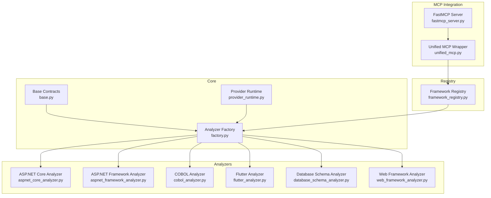
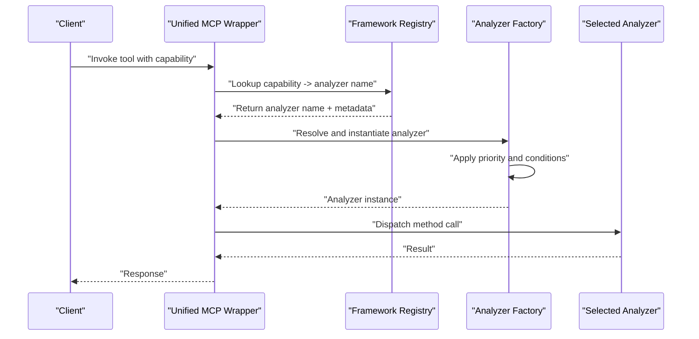
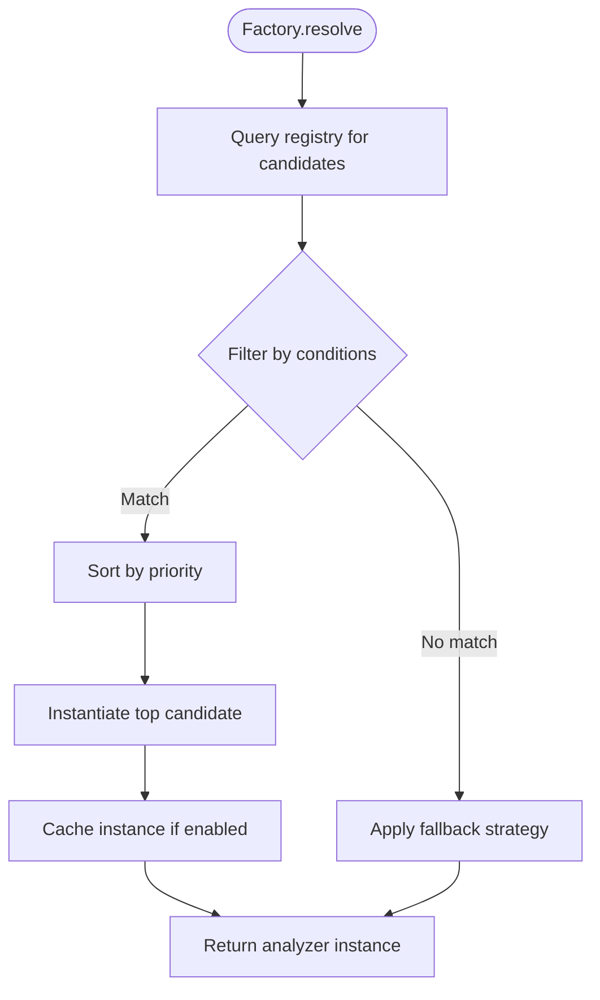
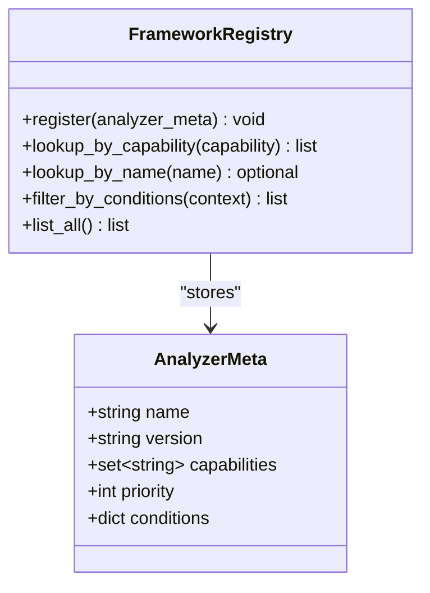
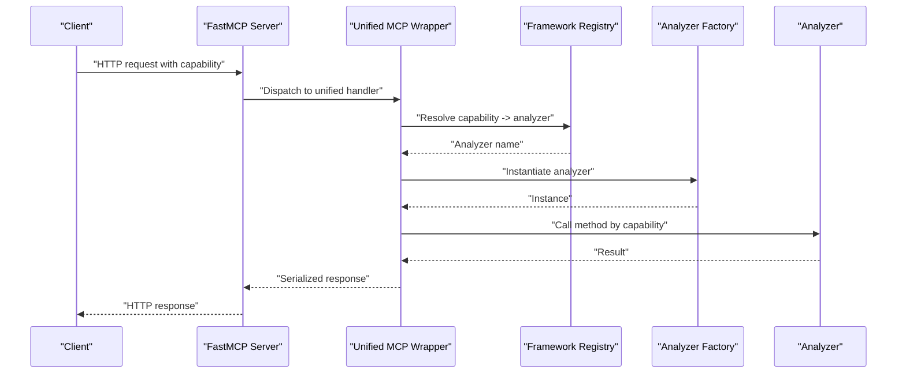
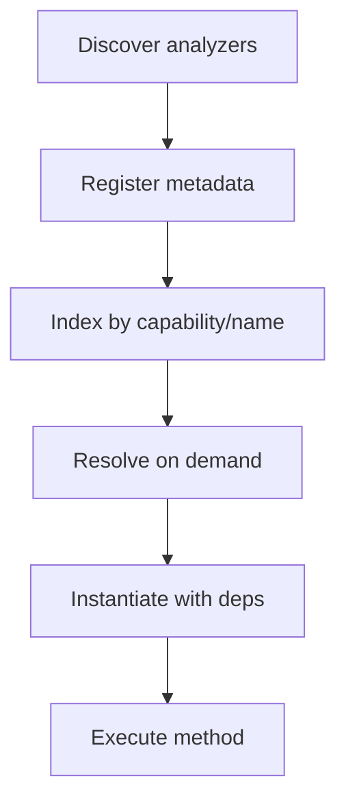
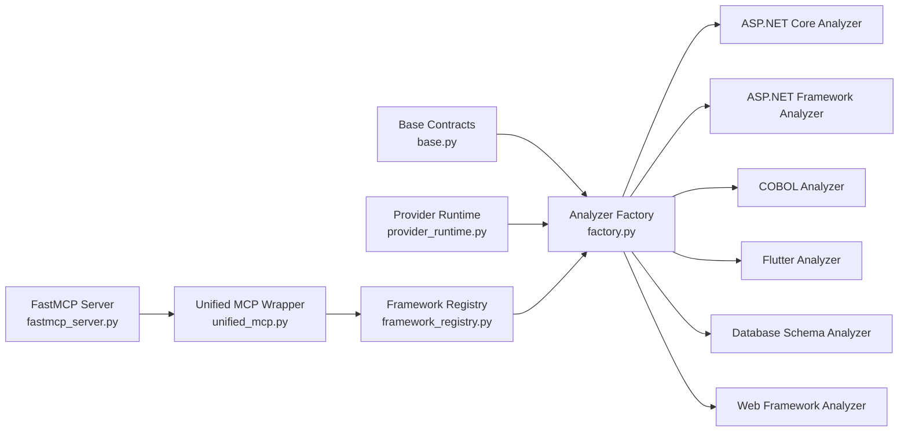

# Analyzer Factory & Framework Registry

<cite>
**Referenced Files in This Document**
- [factory.py](file://code-tiny/tools/graph/core/factory.py)
- [base.py](file://code-tiny/tools/graph/core/base.py)
- [provider_runtime.py](file://code-tiny/tools/graph/core/provider_runtime.py)
- [framework_registry.py](file://code-tiny/mcp/framework_registry.py)
- [unified_mcp.py](file://code-tiny/mcp/unified_mcp.py)
- [fastmcp_server.py](file://code-tiny/mcp/fastmcp_server.py)
- [aspnet_core_analyzer.py](file://code-tiny/tools/aspnet_core/aspnet_core_analyzer.py)
- [aspnet_framework_analyzer.py](file://code-tiny/tools/aspnet_framework/aspnet_framework_analyzer.py)
- [cobol_analyzer.py](file://code-tiny/tools/cobol/cobol_analyzer.py)
- [flutter_analyzer.py](file://code-tiny/tools/flutter/flutter_analyzer.py)
- [database_schema_analyzer.py](file://code-tiny/tools/database_schema/database_schema_analyzer.py)
- [web_framework_analyzer.py](file://code-tiny/tools/web_framework/web_framework_analyzer.py)
- [test_common_analyzer_registry.py](file://tests/test_common_analyzer_registry.py)
- [test_dev_framework_parser_discovery.py](file://tests/test_dev_framework_parser_discovery.py)
- [test_framework_mcp_routing.py](file://tests/test_framework_mcp_routing.py)
</cite>

## Table of Contents
1. [Introduction](#introduction)
2. [Project Structure](#project-structure)
3. [Core Components](#core-components)
4. [Architecture Overview](#architecture-overview)
5. [Detailed Component Analysis](#detailed-component-analysis)
6. [Dependency Analysis](#dependency-analysis)
7. [Performance Considerations](#performance-considerations)
8. [Troubleshooting Guide](#troubleshooting-guide)
9. [Conclusion](#conclusion)
10. [Appendices](#appendices)

## Introduction
This document explains the analyzer factory pattern and framework registry system used to dynamically discover, register, and instantiate analyzers for different languages and frameworks. It covers how project detection rules drive selection, how the registry maintains metadata, and how MCP capability routing and CLI dispatch integrate with this system. It also provides configuration guidance for analyzer selection, priority ordering, fallback strategies, troubleshooting tips, and performance optimization techniques.

## Project Structure
The analyzer factory and registry are implemented across a small set of core modules:
- Core graph runtime and base contracts
- A generic analyzer factory that resolves and instantiates analyzers
- A framework registry that tracks available analyzers and their capabilities
- MCP integration that routes requests based on detected frameworks
- Concrete analyzers per language/framework

**Diagram sources**
- [factory.py:1-200](file://code-tiny/tools/graph/core/factory.py#L1-L200)
- [base.py:1-200](file://code-tiny/tools/graph/core/base.py#L1-L200)
- [provider_runtime.py:1-200](file://code-tiny/tools/graph/core/provider_runtime.py#L1-L200)
- [framework_registry.py:1-200](file://code-tiny/mcp/framework_registry.py#L1-L200)
- [unified_mcp.py:1-200](file://code-tiny/mcp/unified_mcp.py#L1-L200)
- [fastmcp_server.py:1-200](file://code-tiny/mcp/fastmcp_server.py#L1-L200)
- [aspnet_core_analyzer.py:1-200](file://code-tiny/tools/aspnet_core/aspnet_core_analyzer.py#L1-L200)
- [aspnet_framework_analyzer.py:1-200](file://code-tiny/tools/aspnet_framework/aspnet_framework_analyzer.py#L1-L200)
- [cobol_analyzer.py:1-200](file://code-tiny/tools/cobol/cobol_analyzer.py#L1-L200)
- [flutter_analyzer.py:1-200](file://code-tiny/tools/flutter/flutter_analyzer.py#L1-L200)
- [database_schema_analyzer.py:1-200](file://code-tiny/tools/database_schema/database_schema_analyzer.py#L1-L200)
- [web_framework_analyzer.py:1-200](file://code-tiny/tools/web_framework/web_framework_analyzer.py#L1-L200)

**Section sources**
- [factory.py:1-200](file://code-tiny/tools/graph/core/factory.py#L1-L200)
- [base.py:1-200](file://code-tiny/tools/graph/core/base.py#L1-L200)
- [provider_runtime.py:1-200](file://code-tiny/tools/graph/core/provider_runtime.py#L1-L200)
- [framework_registry.py:1-200](file://code-tiny/mcp/framework_registry.py#L1-L200)
- [unified_mcp.py:1-200](file://code-tiny/mcp/unified_mcp.py#L1-L200)
- [fastmcp_server.py:1-200](file://code-tiny/mcp/fastmcp_server.py#L1-L200)

## Core Components
- Base contracts define the interface that all analyzers must implement, including capability declarations and lifecycle hooks.
- The analyzer factory is responsible for resolving an appropriate analyzer by name or capability, handling instantiation, caching, and error propagation.
- The framework registry maintains metadata about registered analyzers (names, capabilities, priorities, conditions), supports dynamic discovery, and exposes lookup APIs.
- Provider runtime integrates with the factory and registry to manage analyzer lifecycles and execution context.
- MCP integration uses the registry to route incoming requests to the correct analyzer implementation based on detected frameworks and declared capabilities.

Key responsibilities:
- Dynamic discovery: scan known packages/modules and import analyzer classes.
- Registration: record analyzer metadata (name, version, supported capabilities, priority).
- Resolution: select the best analyzer given project signals and configuration.
- Instantiation: create analyzer instances with required dependencies.
- Routing: map MCP tool calls to analyzer methods via capability names.

**Section sources**
- [base.py:1-200](file://code-tiny/tools/graph/core/base.py#L1-L200)
- [factory.py:1-200](file://code-tiny/tools/graph/core/factory.py#L1-L200)
- [framework_registry.py:1-200](file://code-tiny/mcp/framework_registry.py#L1-L200)
- [provider_runtime.py:1-200](file://code-tiny/tools/graph/core/provider_runtime.py#L1-L200)

## Architecture Overview
The system follows a layered architecture:
- Discovery layer scans analyzer modules and registers them into the registry.
- Registry layer stores metadata and provides resolution APIs.
- Factory layer resolves and instantiates analyzers based on registry data and project detection results.
- MCP layer routes requests using capability names to the selected analyzer.

**Diagram sources**
- [unified_mcp.py:1-200](file://code-tiny/mcp/unified_mcp.py#L1-L200)
- [framework_registry.py:1-200](file://code-tiny/mcp/framework_registry.py#L1-L200)
- [factory.py:1-200](file://code-tiny/tools/graph/core/factory.py#L1-L200)

## Detailed Component Analysis

### Analyzer Factory
Responsibilities:
- Resolve analyzer by name or capability.
- Apply priority and conditional loading rules.
- Instantiate analyzers with dependency injection where applicable.
- Cache instances to avoid repeated construction overhead.

Resolution flow:
- Input includes target capability or analyzer name, project signals, and configuration.
- Factory queries registry for candidates matching capability and conditions.
- Candidates are sorted by priority; first valid candidate is instantiated.
- If no candidate matches, fallback strategy selects a default or returns an error.

**Diagram sources**
- [factory.py:1-200](file://code-tiny/tools/graph/core/factory.py#L1-L200)

**Section sources**
- [factory.py:1-200](file://code-tiny/tools/graph/core/factory.py#L1-L200)

### Framework Registry
Responsibilities:
- Maintain a catalog of analyzers with metadata: name, version, capabilities, priority, conditions.
- Support dynamic registration from discovered modules.
- Provide lookup by capability, name, or filter by conditions.
- Expose iteration over registered analyzers for diagnostics and testing.

Registration process:
- Analyzers declare themselves during module load or via explicit registration calls.
- Registry validates metadata and indexes entries by capability and name.
- Conditional expressions (e.g., environment flags, presence of files) can gate availability.

**Diagram sources**
- [framework_registry.py:1-200](file://code-tiny/mcp/framework_registry.py#L1-L200)

**Section sources**
- [framework_registry.py:1-200](file://code-tiny/mcp/framework_registry.py#L1-L200)

### MCP Capability Routing
Responsibilities:
- Map MCP tool calls to analyzer methods using capability names.
- Use the registry to resolve the correct analyzer for each capability.
- Handle errors when capabilities are missing or not supported.

Routing flow:
- Incoming request includes capability identifier.
- Unified wrapper consults registry to find analyzer name.
- Factory instantiates analyzer and invokes the corresponding method.
- Response is returned to client.

**Diagram sources**
- [fastmcp_server.py:1-200](file://code-tiny/mcp/fastmcp_server.py#L1-L200)
- [unified_mcp.py:1-200](file://code-tiny/mcp/unified_mcp.py#L1-L200)
- [framework_registry.py:1-200](file://code-tiny/mcp/framework_registry.py#L1-L200)
- [factory.py:1-200](file://code-tiny/tools/graph/core/factory.py#L1-L200)

**Section sources**
- [unified_mcp.py:1-200](file://code-tiny/mcp/unified_mcp.py#L1-L200)
- [fastmcp_server.py:1-200](file://code-tiny/mcp/fastmcp_server.py#L1-L200)

### Concrete Analyzer Examples
- ASP.NET Core Analyzer: declares capabilities for ASP.NET Core-specific analysis and registers itself.
- ASP.NET Framework Analyzer: targets legacy ASP.NET framework patterns.
- COBOL Analyzer: provides COBOL source parsing and graph generation capabilities.
- Flutter Analyzer: handles Dart/Flutter project structures and semantics.
- Database Schema Analyzer: focuses on schema extraction and normalization.
- Web Framework Analyzer: generic overlay for web frameworks.

Each analyzer implements the base contract and contributes metadata to the registry upon import or explicit registration.

**Section sources**
- [aspnet_core_analyzer.py:1-200](file://code-tiny/tools/aspnet_core/aspnet_core_analyzer.py#L1-L200)
- [aspnet_framework_analyzer.py:1-200](file://code-tiny/tools/aspnet_framework/aspnet_framework_analyzer.py#L1-L200)
- [cobol_analyzer.py:1-200](file://code-tiny/tools/cobol/cobol_analyzer.py#L1-L200)
- [flutter_analyzer.py:1-200](file://code-tiny/tools/flutter/flutter_analyzer.py#L1-L200)
- [database_schema_analyzer.py:1-200](file://code-tiny/tools/database_schema/database_schema_analyzer.py#L1-L200)
- [web_framework_analyzer.py:1-200](file://code-tiny/tools/web_framework/web_framework_analyzer.py#L1-L200)

### Conceptual Overview
Conceptually, the system separates concerns:
- Discovery and registration occur at startup or on-demand.
- Resolution and instantiation happen per request or per task.
- Routing ensures the right analyzer executes the right method for the requested capability.

[No sources needed since this diagram shows conceptual workflow, not actual code structure]

## Dependency Analysis
The following diagram illustrates key dependencies between components:

**Diagram sources**
- [base.py:1-200](file://code-tiny/tools/graph/core/base.py#L1-L200)
- [provider_runtime.py:1-200](file://code-tiny/tools/graph/core/provider_runtime.py#L1-L200)
- [factory.py:1-200](file://code-tiny/tools/graph/core/factory.py#L1-L200)
- [framework_registry.py:1-200](file://code-tiny/mcp/framework_registry.py#L1-L200)
- [unified_mcp.py:1-200](file://code-tiny/mcp/unified_mcp.py#L1-L200)
- [fastmcp_server.py:1-200](file://code-tiny/mcp/fastmcp_server.py#L1-L200)
- [aspnet_core_analyzer.py:1-200](file://code-tiny/tools/aspnet_core/aspnet_core_analyzer.py#L1-L200)
- [aspnet_framework_analyzer.py:1-200](file://code-tiny/tools/aspnet_framework/aspnet_framework_analyzer.py#L1-L200)
- [cobol_analyzer.py:1-200](file://code-tiny/tools/cobol/cobol_analyzer.py#L1-L200)
- [flutter_analyzer.py:1-200](file://code-tiny/tools/flutter/flutter_analyzer.py#L1-L200)
- [database_schema_analyzer.py:1-200](file://code-tiny/tools/database_schema/database_schema_analyzer.py#L1-L200)
- [web_framework_analyzer.py:1-200](file://code-tiny/tools/web_framework/web_framework_analyzer.py#L1-L200)

**Section sources**
- [factory.py:1-200](file://code-tiny/tools/graph/core/factory.py#L1-L200)
- [framework_registry.py:1-200](file://code-tiny/mcp/framework_registry.py#L1-L200)
- [unified_mcp.py:1-200](file://code-tiny/mcp/unified_mcp.py#L1-L200)
- [fastmcp_server.py:1-200](file://code-tiny/mcp/fastmcp_server.py#L1-L200)

## Performance Considerations
- Caching: Enable instance caching in the factory to reduce repeated instantiation costs.
- Lazy loading: Defer heavy imports until an analyzer is actually needed.
- Priority tuning: Adjust priorities to minimize search space and ensure fast resolution.
- Condition evaluation: Keep condition checks lightweight; precompute static parts when possible.
- Registry indexing: Ensure capability-to-analyzer mappings are indexed for O(1) lookups.
- Batch operations: When multiple capabilities are requested, batch resolution to reuse shared state.

[No sources needed since this section provides general guidance]

## Troubleshooting Guide
Common issues and resolutions:
- Missing capability: Verify that the analyzer declares the expected capability and is registered. Check registry listing APIs for presence.
- Duplicate registrations: Ensure unique analyzer names and capabilities; deduplicate during registration.
- Conditional failures: Inspect condition expressions gating analyzer availability; validate environment variables and file presence.
- Priority conflicts: If multiple analyzers support the same capability, adjust priorities to disambiguate.
- MCP routing errors: Confirm capability names match exactly between MCP tools and analyzer declarations.

Relevant tests:
- Common analyzer registry behavior and edge cases.
- Development-time framework parser discovery validation.
- MCP routing flows for framework-specific analyzers.

**Section sources**
- [test_common_analyzer_registry.py:1-200](file://tests/test_common_analyzer_registry.py#L1-L200)
- [test_dev_framework_parser_discovery.py:1-200](file://tests/test_dev_framework_parser_discovery.py#L1-L200)
- [test_framework_mcp_routing.py:1-200](file://tests/test_framework_mcp_routing.py#L1-L200)

## Conclusion
The analyzer factory and framework registry provide a robust foundation for dynamic analyzer discovery, registration, and instantiation. By leveraging capability-based routing and clear metadata, the system scales across many languages and frameworks while maintaining predictable performance and extensibility. Proper configuration of priorities and conditions, combined with caching and lazy loading, ensures efficient operation under load.

[No sources needed since this section summarizes without analyzing specific files]

## Appendices

### Configuration Options
- Analyzer selection: Specify preferred analyzer by name or capability.
- Priority ordering: Assign numeric priorities to influence resolution order.
- Fallback strategies: Define defaults when no exact match is found.
- Conditional loading: Use environment flags or file presence to enable/disable analyzers.

[No sources needed since this section provides general guidance]