# Analyzer Framework & Language Support

<cite>
**Referenced Files in This Document**
- [graph/factory.py](file://code-tiny/tools/graph/core/factory.py)
- [graph/base.py](file://code-tiny/tools/graph/core/base.py)
- [framework_registry.py](file://code-tiny/mcp/framework_registry.py)
- [python_analyzer.py](file://code-tiny/tools/python/python_analyzer.py)
- [java_analyzer.py](file://code-tiny/tools/java/java_analyzer.py)
- [csharp_analyzer.py](file://code-tiny/tools/csharp/csharp_analyzer.py)
- [cobol_analyzer.py](file://code-tiny/tools/cobol/cobol_analyzer.py)
- [analyzer_cache.py](file://code-tiny/tools/common/analyzer_cache.py)
- [call_graph_builder.py](file://code-tiny/tools/common/call_graph_builder.py)
- [symbol_service.py](file://code-tiny/mcp/services/symbol_service.py)
- [test_common_analyzer_registry.py](file://tests/test_common_analyzer_registry.py)
</cite>

## Table of Contents
1. [Introduction](#introduction)
2. [Project Structure](#project-structure)
3. [Core Components](#core-components)
4. [Architecture Overview](#architecture-overview)
5. [Detailed Component Analysis](#detailed-component-analysis)
6. [Dependency Analysis](#dependency-analysis)
7. [Performance Considerations](#performance-considerations)
8. [Troubleshooting Guide](#troubleshooting-guide)
9. [Conclusion](#conclusion)

## Introduction
This document explains the analyzer framework architecture that enables dynamic discovery and execution of language-specific analyzers. It covers:
- The base analyzer interface and common contracts
- Factory pattern for creating analyzers
- Registry mechanism for dynamic discovery
- How Python, Java, C#, and COBOL analyzers extend common functionality while producing consistent outputs
- Configuration options for selecting analyzers
- Caching strategies for performance optimization
- Error handling mechanisms
- Relationships with the graph builder and symbol resolution systems
- Extension points for adding new languages and troubleshooting registration issues

## Project Structure
The analyzer framework is implemented primarily under tools/graph/core (base and factory), MCP-level registry, per-language analyzer modules, shared utilities (cache, call graph builder), and services for symbol resolution. Tests validate registry behavior and integration.

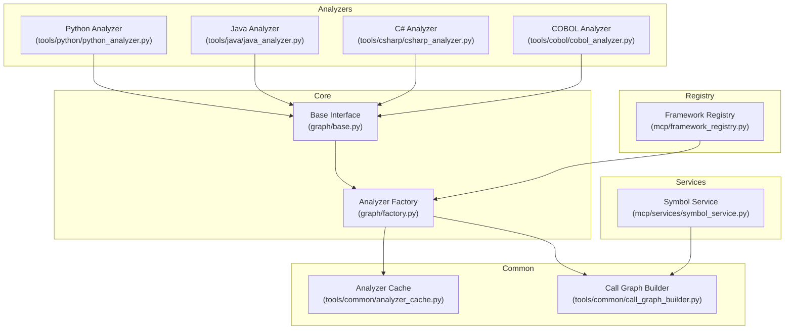

**Diagram sources**
- [graph/base.py](file://code-tiny/tools/graph/core/base.py)
- [graph/factory.py](file://code-tiny/tools/graph/core/factory.py)
- [framework_registry.py](file://code-tiny/mcp/framework_registry.py)
- [python_analyzer.py](file://code-tiny/tools/python/python_analyzer.py)
- [java_analyzer.py](file://code-tiny/tools/java/java_analyzer.py)
- [csharp_analyzer.py](file://code-tiny/tools/csharp/csharp_analyzer.py)
- [cobol_analyzer.py](file://code-tiny/tools/cobol/cobol_analyzer.py)
- [analyzer_cache.py](file://code-tiny/tools/common/analyzer_cache.py)
- [call_graph_builder.py](file://code-tiny/tools/common/call_graph_builder.py)
- [symbol_service.py](file://code-tiny/mcp/services/symbol_service.py)

**Section sources**
- [graph/base.py](file://code-tiny/tools/graph/core/base.py)
- [graph/factory.py](file://code-tiny/tools/graph/core/factory.py)
- [framework_registry.py](file://code-tiny/mcp/framework_registry.py)
- [python_analyzer.py](file://code-tiny/tools/python/python_analyzer.py)
- [java_analyzer.py](file://code-tiny/tools/java/java_analyzer.py)
- [csharp_analyzer.py](file://code-tiny/tools/csharp/csharp_analyzer.py)
- [cobol_analyzer.py](file://code-tiny/tools/cobol/cobol_analyzer.py)
- [analyzer_cache.py](file://code-tiny/tools/common/analyzer_cache.py)
- [call_graph_builder.py](file://code-tiny/tools/common/call_graph_builder.py)
- [symbol_service.py](file://code-tiny/mcp/services/symbol_service.py)

## Core Components
- Base analyzer interface: Defines the contract all language analyzers must implement, including methods for initialization, analysis execution, result normalization, and lifecycle hooks.
- Analyzer factory: Creates analyzer instances based on configuration or detected language, applying caching and dependency injection where appropriate.
- Framework registry: Discovers and registers available analyzers at runtime, enabling dynamic selection without hard-coded branches.
- Shared utilities:
  - Analyzer cache: Stores intermediate results to avoid redundant work across runs or incremental updates.
  - Call graph builder: Builds and persists call relationships used by multiple analyzers and downstream consumers.
- Symbol service: Provides symbol lookup and cross-references consumed by analyzers and graph builders.

Key responsibilities:
- Consistent output schema across languages
- Pluggable language support via registry
- Performance through caching and incremental processing
- Robust error handling and diagnostics

**Section sources**
- [graph/base.py](file://code-tiny/tools/graph/core/base.py)
- [graph/factory.py](file://code-tiny/tools/graph/core/factory.py)
- [framework_registry.py](file://code-tiny/mcp/framework_registry.py)
- [analyzer_cache.py](file://code-tiny/tools/common/analyzer_cache.py)
- [call_graph_builder.py](file://code-tiny/tools/common/call_graph_builder.py)
- [symbol_service.py](file://code-tiny/mcp/services/symbol_service.py)

## Architecture Overview
The framework follows a layered design:
- Discovery layer: Registry scans and registers analyzers.
- Creation layer: Factory instantiates analyzers using registry metadata and configuration.
- Execution layer: Analyzers parse code, extract semantics, and produce normalized results.
- Integration layer: Results are written into the graph via the call graph builder; symbols are resolved via the symbol service.

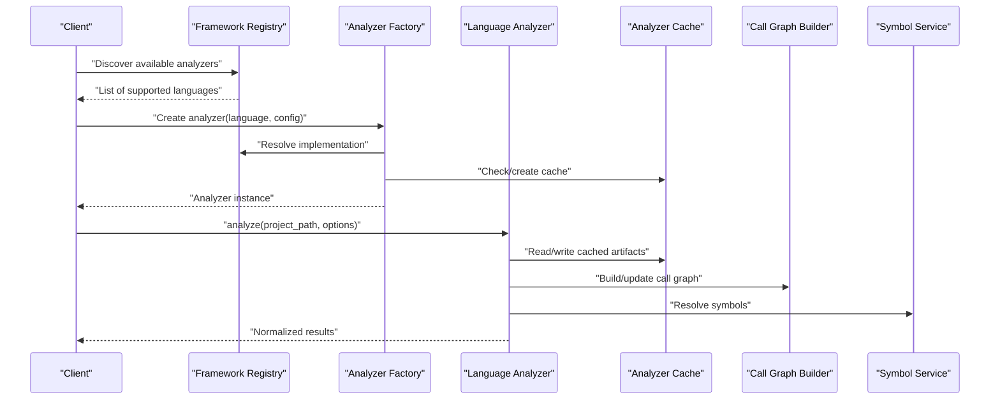

**Diagram sources**
- [framework_registry.py](file://code-tiny/mcp/framework_registry.py)
- [graph/factory.py](file://code-tiny/tools/graph/core/factory.py)
- [analyzer_cache.py](file://code-tiny/tools/common/analyzer_cache.py)
- [call_graph_builder.py](file://code-tiny/tools/common/call_graph_builder.py)
- [symbol_service.py](file://code-tiny/mcp/services/symbol_service.py)

## Detailed Component Analysis

### Base Analyzer Interface
The base interface defines the standard contract for all analyzers:
- Initialization parameters (e.g., project path, options)
- Analysis entry point
- Result normalization method
- Lifecycle hooks (setup/teardown)
- Capability flags (e.g., supports_incremental)

Implementers must adhere to this contract to be compatible with the factory and registry.

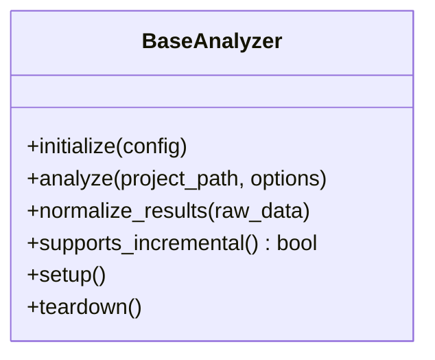

**Diagram sources**
- [graph/base.py](file://code-tiny/tools/graph/core/base.py)

**Section sources**
- [graph/base.py](file://code-tiny/tools/graph/core/base.py)

### Factory Pattern Implementation
The factory creates analyzer instances by:
- Resolving the requested language to an implementation via the registry
- Applying configuration overrides
- Injecting shared dependencies (cache, call graph builder, symbol service)
- Returning a fully initialized analyzer ready for execution

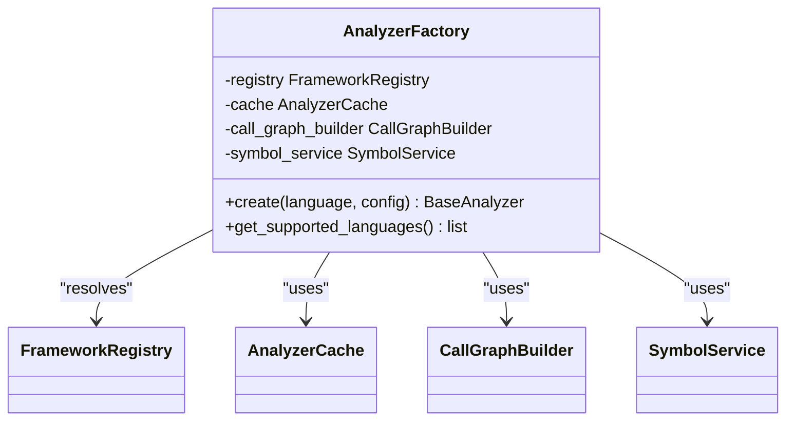

**Diagram sources**
- [graph/factory.py](file://code-tiny/tools/graph/core/factory.py)
- [framework_registry.py](file://code-tiny/mcp/framework_registry.py)
- [analyzer_cache.py](file://code-tiny/tools/common/analyzer_cache.py)
- [call_graph_builder.py](file://code-tiny/tools/common/call_graph_builder.py)
- [symbol_service.py](file://code-tiny/mcp/services/symbol_service.py)

**Section sources**
- [graph/factory.py](file://code-tiny/tools/graph/core/factory.py)

### Framework Registry for Dynamic Discovery
The registry discovers and registers analyzers at runtime:
- Scans known packages/modules for analyzer implementations
- Maps language identifiers to concrete classes
- Exposes APIs to query capabilities and create instances

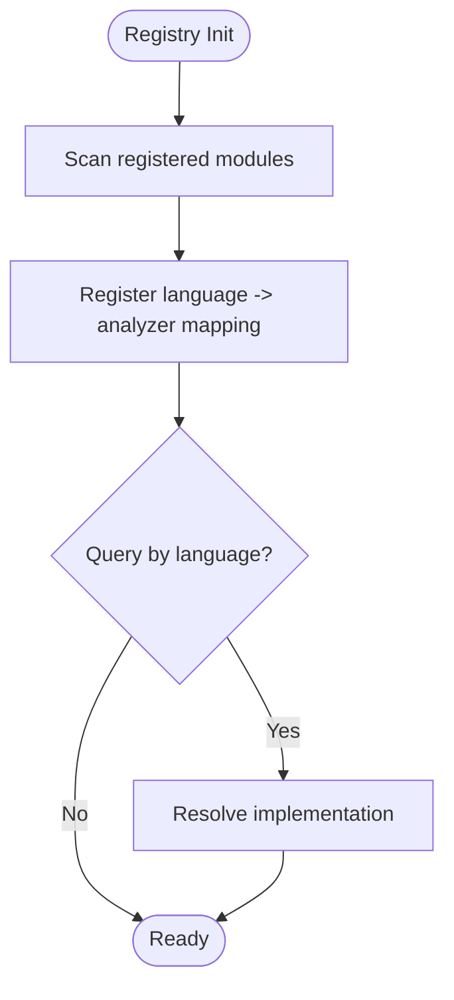

**Diagram sources**
- [framework_registry.py](file://code-tiny/mcp/framework_registry.py)

**Section sources**
- [framework_registry.py](file://code-tiny/mcp/framework_registry.py)

### Language-Specific Analyzers
Each language analyzer extends the base interface and implements language-specific parsing and extraction logic while adhering to the common output format.

#### Python Analyzer
- Extends the base interface
- Parses Python source files and constructs semantic nodes
- Normalizes results to the shared schema
- Integrates with the call graph builder and symbol service

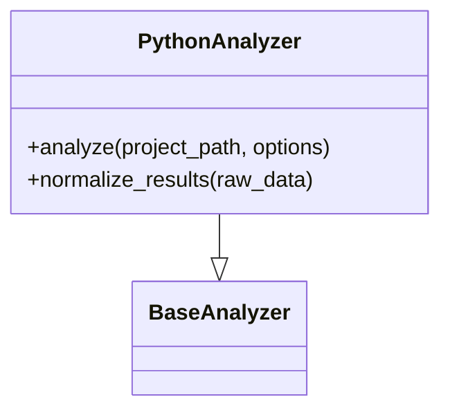

**Diagram sources**
- [python_analyzer.py](file://code-tiny/tools/python/python_analyzer.py)
- [graph/base.py](file://code-tiny/tools/graph/core/base.py)

**Section sources**
- [python_analyzer.py](file://code-tiny/tools/python/python_analyzer.py)

#### Java Analyzer
- Extends the base interface
- Uses Java-specific parsers and tooling
- Produces normalized AST and relationship data
- Leverages caching for large projects

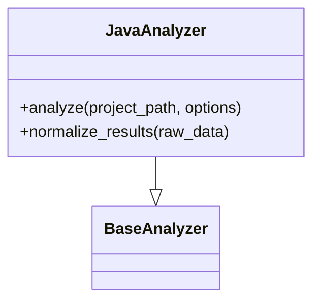

**Diagram sources**
- [java_analyzer.py](file://code-tiny/tools/java/java_analyzer.py)
- [graph/base.py](file://code-tiny/tools/graph/core/base.py)

**Section sources**
- [java_analyzer.py](file://code-tiny/tools/java/java_analyzer.py)

#### C# Analyzer
- Extends the base interface
- Integrates with .NET tooling where applicable
- Extracts types, methods, and references
- Normalizes to shared schema

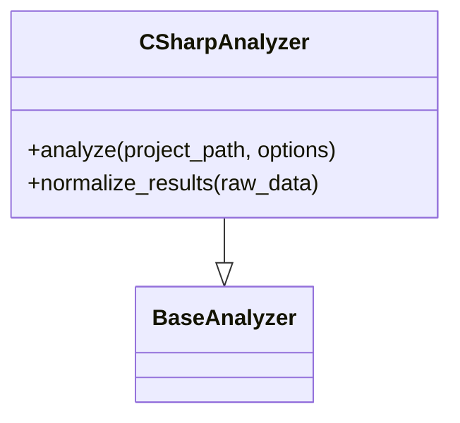

**Diagram sources**
- [csharp_analyzer.py](file://code-tiny/tools/csharp/csharp_analyzer.py)
- [graph/base.py](file://code-tiny/tools/graph/core/base.py)

**Section sources**
- [csharp_analyzer.py](file://code-tiny/tools/csharp/csharp_analyzer.py)

#### COBOL Analyzer
- Extends the base interface
- Handles COBOL-specific structures and copybooks
- Builds control flow and data references
- Normalizes results consistently

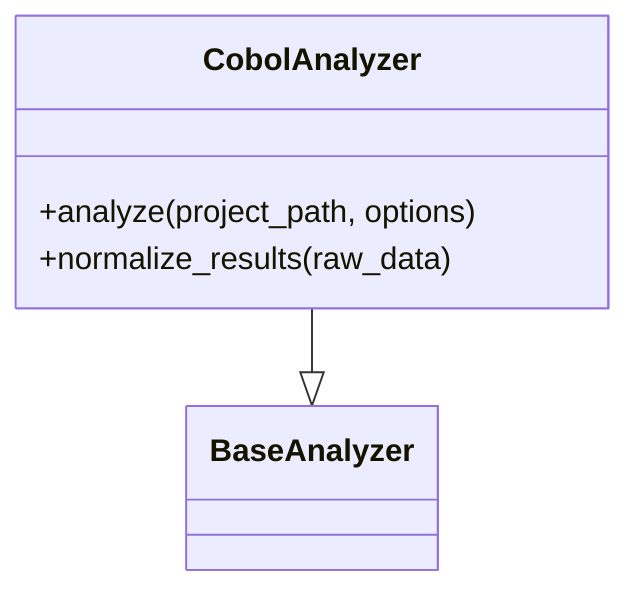

**Diagram sources**
- [cobol_analyzer.py](file://code-tiny/tools/cobol/cobol_analyzer.py)
- [graph/base.py](file://code-tiny/tools/graph/core/base.py)

**Section sources**
- [cobol_analyzer.py](file://code-tiny/tools/cobol/cobol_analyzer.py)

### Configuration Options for Analyzer Selection
Configuration typically includes:
- Language identifier to select the analyzer
- Project path and scope filters
- Incremental mode flags
- Cache enablement and TTL settings
- Output verbosity and logging level

These options are passed through the factory to the selected analyzer.

**Section sources**
- [graph/factory.py](file://code-tiny/tools/graph/core/factory.py)
- [framework_registry.py](file://code-tiny/mcp/framework_registry.py)

### Caching Strategies for Performance Optimization
The analyzer cache stores:
- Parsed ASTs
- Intermediate semantic graphs
- Symbol resolution maps
- Incremental change deltas

Strategies include:
- Key derivation from file paths and timestamps
- TTL-based invalidation
- Per-analyzer namespaces to avoid collisions
- Lazy loading of heavy artifacts

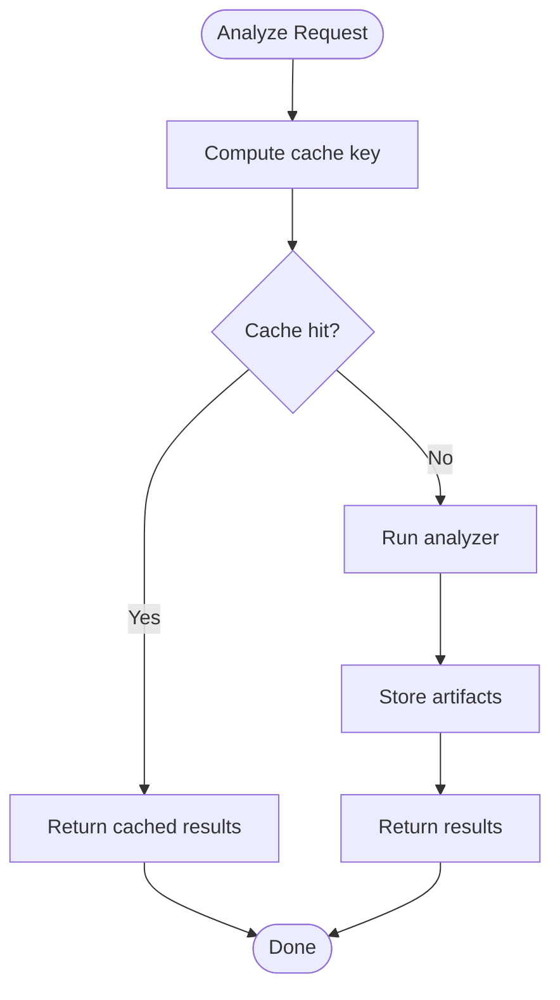

**Diagram sources**
- [analyzer_cache.py](file://code-tiny/tools/common/analyzer_cache.py)

**Section sources**
- [analyzer_cache.py](file://code-tiny/tools/common/analyzer_cache.py)

### Error Handling Mechanisms
Common patterns:
- Validation of inputs and environment prerequisites
- Graceful degradation when optional tooling is missing
- Structured error responses with context (language, file, step)
- Retry and fallback strategies for external processes
- Logging and diagnostics for troubleshooting

**Section sources**
- [graph/factory.py](file://code-tiny/tools/graph/core/factory.py)
- [framework_registry.py](file://code-tiny/mcp/framework_registry.py)

### Relationships with Graph Builder and Symbol Resolution
- Call graph builder: Consumes analyzer outputs to construct and persist call edges and node metadata.
- Symbol service: Provides symbol lookups and cross-references, aiding analyzers in resolving names and types.

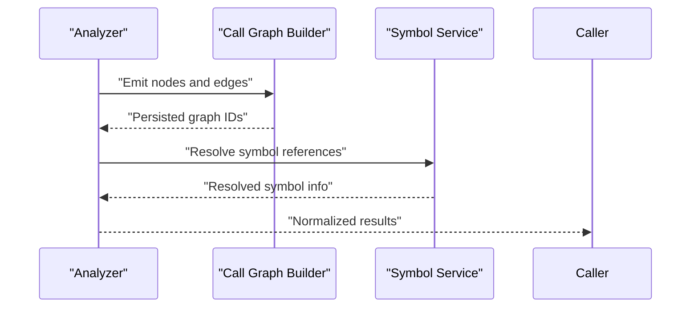

**Diagram sources**
- [call_graph_builder.py](file://code-tiny/tools/common/call_graph_builder.py)
- [symbol_service.py](file://code-tiny/mcp/services/symbol_service.py)

**Section sources**
- [call_graph_builder.py](file://code-tiny/tools/common/call_graph_builder.py)
- [symbol_service.py](file://code-tiny/mcp/services/symbol_service.py)

### Extension Points for Adding New Language Support
To add a new language:
- Implement the base analyzer interface
- Provide language-specific parsing and normalization
- Register the analyzer with the framework registry
- Ensure compatibility with the shared output schema
- Add tests to verify registration and behavior

**Section sources**
- [graph/base.py](file://code-tiny/tools/graph/core/base.py)
- [framework_registry.py](file://code-tiny/mcp/framework_registry.py)

### Troubleshooting Analyzer Registration Issues
Common checks:
- Verify the analyzer module is importable and correctly named
- Confirm the registry has discovered the analyzer
- Validate configuration keys match expected values
- Inspect logs for import errors or missing dependencies
- Use tests to assert registration and creation flows

**Section sources**
- [framework_registry.py](file://code-tiny/mcp/framework_registry.py)
- [test_common_analyzer_registry.py](file://tests/test_common_analyzer_registry.py)

## Dependency Analysis
The following diagram shows core dependencies among components:

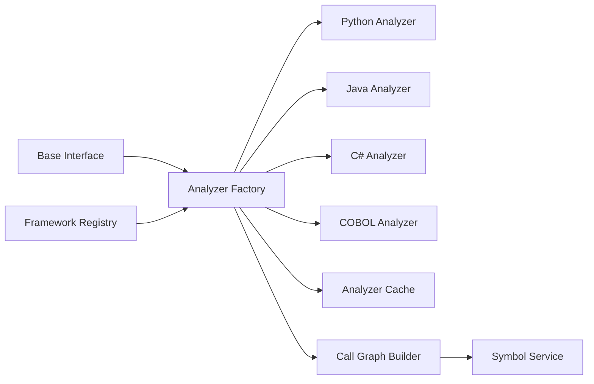

**Diagram sources**
- [graph/base.py](file://code-tiny/tools/graph/core/base.py)
- [graph/factory.py](file://code-tiny/tools/graph/core/factory.py)
- [framework_registry.py](file://code-tiny/mcp/framework_registry.py)
- [python_analyzer.py](file://code-tiny/tools/python/python_analyzer.py)
- [java_analyzer.py](file://code-tiny/tools/java/java_analyzer.py)
- [csharp_analyzer.py](file://code-tiny/tools/csharp/csharp_analyzer.py)
- [cobol_analyzer.py](file://code-tiny/tools/cobol/cobol_analyzer.py)
- [analyzer_cache.py](file://code-tiny/tools/common/analyzer_cache.py)
- [call_graph_builder.py](file://code-tiny/tools/common/call_graph_builder.py)
- [symbol_service.py](file://code-tiny/mcp/services/symbol_service.py)

**Section sources**
- [graph/base.py](file://code-tiny/tools/graph/core/base.py)
- [graph/factory.py](file://code-tiny/tools/graph/core/factory.py)
- [framework_registry.py](file://code-tiny/mcp/framework_registry.py)
- [analyzer_cache.py](file://code-tiny/tools/common/analyzer_cache.py)
- [call_graph_builder.py](file://code-tiny/tools/common/call_graph_builder.py)
- [symbol_service.py](file://code-tiny/mcp/services/symbol_service.py)

## Performance Considerations
- Enable caching for large repositories to reduce repeated parsing overhead
- Use incremental mode where supported to process only changed files
- Prefer lazy loading of heavy artifacts until needed
- Batch symbol resolution calls to minimize service round-trips
- Tune cache TTL based on project update frequency

[No sources needed since this section provides general guidance]

## Troubleshooting Guide
- If an analyzer fails to load, check registry discovery logs and ensure the module path is correct.
- For inconsistent outputs, verify normalization methods conform to the shared schema.
- When encountering slow analysis, inspect cache usage and consider adjusting TTL or clearing stale entries.
- For symbol resolution failures, confirm the symbol service is reachable and indexes are up-to-date.
- Use provided tests to validate registration and basic creation flows.

**Section sources**
- [framework_registry.py](file://code-tiny/mcp/framework_registry.py)
- [test_common_analyzer_registry.py](file://tests/test_common_analyzer_registry.py)

## Conclusion
The analyzer framework provides a robust, extensible foundation for multi-language code analysis. By adhering to a common interface, leveraging a factory and registry, and integrating with shared caching, graph building, and symbol resolution services, it ensures consistent outputs and high performance. Adding new languages involves implementing the base interface, registering the analyzer, and validating against shared contracts.

[No sources needed since this section summarizes without analyzing specific files]