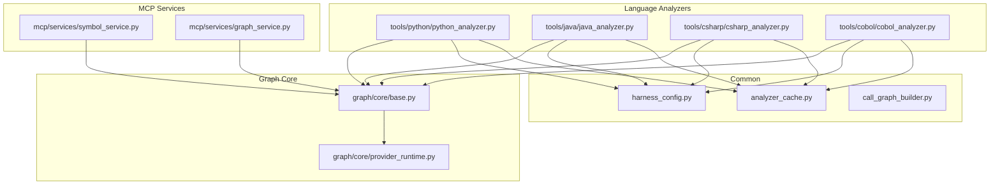
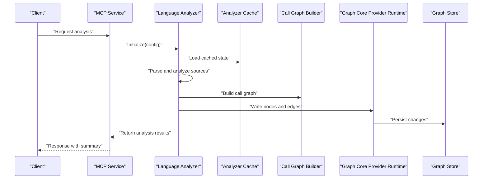
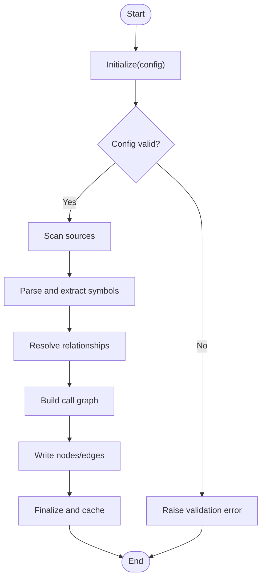
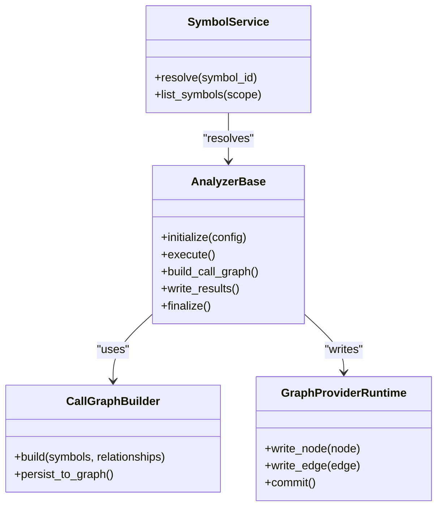
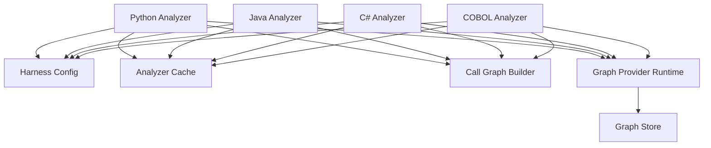

# Base Analyzer Interface & Core Contracts

<cite>
**Referenced Files in This Document**
- [python_analyzer.py](file://code-tiny/tools/python/python_analyzer.py)
- [java_analyzer.py](file://code-tiny/tools/java/java_analyzer.py)
- [csharp_analyzer.py](file://code-tiny/tools/csharp/csharp_analyzer.py)
- [cobol_analyzer.py](file://code-tiny/tools/cobol/cobol_analyzer.py)
- [harness_config.py](file://code-tiny/tools/common/harness_config.py)
- [analyzer_cache.py](file://code-tiny/tools/common/analyzer_cache.py)
- [call_graph_builder.py](file://code-tiny/tools/common/call_graph_builder.py)
- [symbol_service.py](file://code-tiny/mcp/services/symbol_service.py)
- [graph_service.py](file://code-tiny/mcp/services/graph_service.py)
- [base.py](file://code-tiny/tools/graph/core/base.py)
- [provider_runtime.py](file://code-tiny/tools/graph/core/provider_runtime.py)
</cite>

## Table of Contents
1. [Introduction](#introduction)
2. [Project Structure](#project-structure)
3. [Core Components](#core-components)
4. [Architecture Overview](#architecture-overview)
5. [Detailed Component Analysis](#detailed-component-analysis)
6. [Dependency Analysis](#dependency-analysis)
7. [Performance Considerations](#performance-considerations)
8. [Troubleshooting Guide](#troubleshooting-guide)
9. [Conclusion](#conclusion)

## Introduction
This document describes the base analyzer interface and core contracts used across language analyzers in the repository. It explains the abstract analyzer class structure, required methods that all language analyzers must implement, standardized output format contracts, and the analyzer lifecycle from initialization through completion. It also documents configuration schema validation, error handling patterns, logging conventions, and the relationship with the graph builder system and symbol resolution infrastructure. Concrete examples are provided for Python, Java, C#, and COBOL analyzers. Performance considerations include caching strategies and memory management.

## Project Structure
The analyzer ecosystem is organized by language under tools/<language>, with shared utilities in tools/common and graph building/infrastructure in tools/graph and mcp services. The base contracts and runtime are defined in the graph core module and consumed by language-specific analyzers.

**Diagram sources**
- [python_analyzer.py](file://code-tiny/tools/python/python_analyzer.py)
- [java_analyzer.py](file://code-tiny/tools/java/java_analyzer.py)
- [csharp_analyzer.py](file://code-tiny/tools/csharp/csharp_analyzer.py)
- [cobol_analyzer.py](file://code-tiny/tools/cobol/cobol_analyzer.py)
- [harness_config.py](file://code-tiny/tools/common/harness_config.py)
- [analyzer_cache.py](file://code-tiny/tools/common/analyzer_cache.py)
- [call_graph_builder.py](file://code-tiny/tools/common/call_graph_builder.py)
- [symbol_service.py](file://code-tiny/mcp/services/symbol_service.py)
- [graph_service.py](file://code-tiny/mcp/services/graph_service.py)
- [base.py](file://code-tiny/tools/graph/core/base.py)
- [provider_runtime.py](file://code-tiny/tools/graph/core/provider_runtime.py)

**Section sources**
- [python_analyzer.py](file://code-tiny/tools/python/python_analyzer.py)
- [java_analyzer.py](file://code-tiny/tools/java/java_analyzer.py)
- [csharp_analyzer.py](file://code-tiny/tools/csharp/csharp_analyzer.py)
- [cobol_analyzer.py](file://code-tiny/tools/cobol/cobol_analyzer.py)
- [harness_config.py](file://code-tiny/tools/common/harness_config.py)
- [analyzer_cache.py](file://code-tiny/tools/common/analyzer_cache.py)
- [call_graph_builder.py](file://code-tiny/tools/common/call_graph_builder.py)
- [symbol_service.py](file://code-tiny/mcp/services/symbol_service.py)
- [graph_service.py](file://code-tiny/mcp/services/graph_service.py)
- [base.py](file://code-tiny/tools/graph/core/base.py)
- [provider_runtime.py](file://code-tiny/tools/graph/core/provider_runtime.py)

## Core Components
- Abstract analyzer base: Defines the contract for all language analyzers including initialization, analysis execution, result packaging, and resource cleanup.
- Configuration schema: Centralized configuration loading and validation to ensure consistent settings across analyzers.
- Output contracts: Standardized data structures for nodes, edges, symbols, and metadata emitted by analyzers.
- Graph integration: Writers and builders that persist results into the graph store via the graph core provider runtime.
- Symbol resolution: Services that resolve identifiers and relationships across files and modules.

Key responsibilities:
- Language analyzers implement the base interface to parse source code, extract semantic information, and produce normalized outputs.
- Common utilities provide caching, call graph construction, and result packaging.
- MCP services expose symbol and graph operations to clients.

**Section sources**
- [python_analyzer.py](file://code-tiny/tools/python/python_analyzer.py)
- [java_analyzer.py](file://code-tiny/tools/java/java_analyzer.py)
- [csharp_analyzer.py](file://code-tiny/tools/csharp/csharp_analyzer.py)
- [cobol_analyzer.py](file://code-tiny/tools/cobol/cobol_analyzer.py)
- [harness_config.py](file://code-tiny/tools/common/harness_config.py)
- [analyzer_cache.py](file://code-tiny/tools/common/analyzer_cache.py)
- [call_graph_builder.py](file://code-tiny/tools/common/call_graph_builder.py)
- [symbol_service.py](file://code-tiny/mcp/services/symbol_service.py)
- [graph_service.py](file://code-tiny/mcp/services/graph_service.py)
- [base.py](file://code-tiny/tools/graph/core/base.py)
- [provider_runtime.py](file://code-tiny/tools/graph/core/provider_runtime.py)

## Architecture Overview
The analyzer architecture follows a layered design:
- Language analyzers implement the base contract and produce normalized outputs.
- Common utilities handle caching, call graph building, and result packaging.
- Graph core provides provider-agnostic APIs for writing nodes and edges.
- MCP services orchestrate symbol and graph queries using the underlying providers.

**Diagram sources**
- [python_analyzer.py](file://code-tiny/tools/python/python_analyzer.py)
- [java_analyzer.py](file://code-tiny/tools/java/java_analyzer.py)
- [csharp_analyzer.py](file://code-tiny/tools/csharp/csharp_analyzer.py)
- [cobol_analyzer.py](file://code-tiny/tools/cobol/cobol_analyzer.py)
- [analyzer_cache.py](file://code-tiny/tools/common/analyzer_cache.py)
- [call_graph_builder.py](file://code-tiny/tools/common/call_graph_builder.py)
- [base.py](file://code-tiny/tools/graph/core/base.py)
- [provider_runtime.py](file://code-tiny/tools/graph/core/provider_runtime.py)

## Detailed Component Analysis

### Abstract Analyzer Base and Required Methods
The abstract analyzer base defines the lifecycle and contract:
- Initialization: Accepts configuration, validates inputs, sets up environment, and prepares caches.
- Analysis execution: Parses source files, extracts symbols and relationships, builds call graphs, and writes results.
- Result packaging: Produces standardized outputs conforming to the common contracts.
- Cleanup: Releases resources and finalizes state.

Required methods typically include:
- Initialize with configuration object
- Execute analysis over target paths or project roots
- Build call graph and write to graph store
- Return structured results (nodes, edges, symbols, metrics)

Error handling should be centralized and consistent:
- Validate configuration early and raise descriptive errors
- Wrap parser/runtime exceptions with context
- Log warnings for non-fatal issues and continue where possible

Logging conventions:
- Use structured logs with levels (debug, info, warn, error)
- Include file paths, symbol names, and operation IDs for traceability

**Section sources**
- [python_analyzer.py](file://code-tiny/tools/python/python_analyzer.py)
- [java_analyzer.py](file://code-tiny/tools/java/java_analyzer.py)
- [csharp_analyzer.py](file://code-tiny/tools/csharp/csharp_analyzer.py)
- [cobol_analyzer.py](file://code-tiny/tools/cobol/cobol_analyzer.py)
- [base.py](file://code-tiny/tools/graph/core/base.py)
- [provider_runtime.py](file://code-tiny/tools/graph/core/provider_runtime.py)

### Configuration Schema Validation
Configuration is loaded and validated centrally:
- Schema definitions specify required keys, types, defaults, and constraints
- Validation occurs at analyzer initialization to fail fast on misconfiguration
- Environment overrides and per-language profiles are supported

Best practices:
- Provide clear error messages indicating invalid fields and expected values
- Allow optional features to be toggled via configuration flags
- Persist validated configuration for reproducibility

**Section sources**
- [harness_config.py](file://code-tiny/tools/common/harness_config.py)

### Standardized Output Format Contracts
Outputs are normalized into consistent structures:
- Nodes represent entities such as files, classes, functions, variables, and modules
- Edges capture relationships like calls, imports, dependencies, and ownership
- Symbols include identifiers, scopes, types, and locations
- Metadata includes versioning, timestamps, and provenance

Contracts ensure:
- Interoperability across languages and frameworks
- Compatibility with graph writers and MCP services
- Predictable querying and traversal semantics

**Section sources**
- [python_analyzer.py](file://code-tiny/tools/python/python_analyzer.py)
- [java_analyzer.py](file://code-tiny/tools/java/java_analyzer.py)
- [csharp_analyzer.py](file://code-tiny/tools/csharp/csharp_analyzer.py)
- [cobol_analyzer.py](file://code-tiny/tools/cobol/cobol_analyzer.py)
- [call_graph_builder.py](file://code-tiny/tools/common/call_graph_builder.py)

### Analyzer Lifecycle
The lifecycle spans initialization, analysis, graph persistence, and cleanup:
- Initialize: Load config, validate schema, set up cache and providers
- Scan: Discover source files and build inventory
- Parse: Extract AST or equivalent representation
- Resolve: Bind symbols and compute relationships
- Build: Construct call graph and other derived structures
- Write: Persist nodes and edges via graph core
- Finalize: Emit summary, update cache, release resources

**Diagram sources**
- [python_analyzer.py](file://code-tiny/tools/python/python_analyzer.py)
- [java_analyzer.py](file://code-tiny/tools/java/java_analyzer.py)
- [csharp_analyzer.py](file://code-tiny/tools/csharp/csharp_analyzer.py)
- [cobol_analyzer.py](file://code-tiny/tools/cobol/cobol_analyzer.py)
- [analyzer_cache.py](file://code-tiny/tools/common/analyzer_cache.py)
- [call_graph_builder.py](file://code-tiny/tools/common/call_graph_builder.py)
- [base.py](file://code-tiny/tools/graph/core/base.py)
- [provider_runtime.py](file://code-tiny/tools/graph/core/provider_runtime.py)

### Relationship with Graph Builder System and Symbol Resolution
- Graph builder: Constructs call graphs and related structures from parsed symbols and relationships; integrates with graph core to persist results.
- Symbol resolution: Resolves identifiers across files and modules, providing canonical references for edges and queries.
- MCP services: Expose symbol and graph operations, leveraging the resolved data for search and traversal.

**Diagram sources**
- [python_analyzer.py](file://code-tiny/tools/python/python_analyzer.py)
- [java_analyzer.py](file://code-tiny/tools/java/java_analyzer.py)
- [csharp_analyzer.py](file://code-tiny/tools/csharp/csharp_analyzer.py)
- [cobol_analyzer.py](file://code-tiny/tools/cobol/cobol_analyzer.py)
- [call_graph_builder.py](file://code-tiny/tools/common/call_graph_builder.py)
- [symbol_service.py](file://code-tiny/mcp/services/symbol_service.py)
- [base.py](file://code-tiny/tools/graph/core/base.py)
- [provider_runtime.py](file://code-tiny/tools/graph/core/provider_runtime.py)

**Section sources**
- [call_graph_builder.py](file://code-tiny/tools/common/call_graph_builder.py)
- [symbol_service.py](file://code-tiny/mcp/services/symbol_service.py)
- [graph_service.py](file://code-tiny/mcp/services/graph_service.py)
- [base.py](file://code-tiny/tools/graph/core/base.py)
- [provider_runtime.py](file://code-tiny/tools/graph/core/provider_runtime.py)

### Concrete Examples: Language-Specific Analyzers
- Python analyzer: Implements base contract, parses Python sources, resolves imports and function calls, builds call graph, and writes normalized nodes/edges.
- Java analyzer: Extends base contract, handles Java compilation artifacts or AST extraction, resolves package/class/method relationships, and persists results.
- C# analyzer: Integrates with Roslyn or similar tooling, extracts symbols and call sites, constructs call graph, and writes to graph store.
- COBOL analyzer: Parses COBOL source formats, resolves copybook dependencies and program units, builds relationships, and emits standardized outputs.

Each example demonstrates:
- Configuration usage and validation
- Parsing and symbol extraction
- Call graph construction
- Writing to graph core
- Error handling and logging

**Section sources**
- [python_analyzer.py](file://code-tiny/tools/python/python_analyzer.py)
- [java_analyzer.py](file://code-tiny/tools/java/java_analyzer.py)
- [csharp_analyzer.py](file://code-tiny/tools/csharp/csharp_analyzer.py)
- [cobol_analyzer.py](file://code-tiny/tools/cobol/cobol_analyzer.py)

## Dependency Analysis
Analyzers depend on shared components for configuration, caching, graph building, and MCP services. The graph core provides provider-agnostic APIs, while MCP services offer query and traversal capabilities.

**Diagram sources**
- [python_analyzer.py](file://code-tiny/tools/python/python_analyzer.py)
- [java_analyzer.py](file://code-tiny/tools/java/java_analyzer.py)
- [csharp_analyzer.py](file://code-tiny/tools/csharp/csharp_analyzer.py)
- [cobol_analyzer.py](file://code-tiny/tools/cobol/cobol_analyzer.py)
- [harness_config.py](file://code-tiny/tools/common/harness_config.py)
- [analyzer_cache.py](file://code-tiny/tools/common/analyzer_cache.py)
- [call_graph_builder.py](file://code-tiny/tools/common/call_graph_builder.py)
- [base.py](file://code-tiny/tools/graph/core/base.py)
- [provider_runtime.py](file://code-tiny/tools/graph/core/provider_runtime.py)

**Section sources**
- [python_analyzer.py](file://code-tiny/tools/python/python_analyzer.py)
- [java_analyzer.py](file://code-tiny/tools/java/java_analyzer.py)
- [csharp_analyzer.py](file://code-tiny/tools/csharp/csharp_analyzer.py)
- [cobol_analyzer.py](file://code-tiny/tools/cobol/cobol_analyzer.py)
- [harness_config.py](file://code-tiny/tools/common/harness_config.py)
- [analyzer_cache.py](file://code-tiny/tools/common/analyzer_cache.py)
- [call_graph_builder.py](file://code-tiny/tools/common/call_graph_builder.py)
- [base.py](file://code-tiny/tools/graph/core/base.py)
- [provider_runtime.py](file://code-tiny/tools/graph/core/provider_runtime.py)

## Performance Considerations
- Caching strategies:
  - Use analyzer cache to avoid re-parsing unchanged files
  - Cache intermediate results such as symbol maps and partial call graphs
  - Invalidate cache entries based on file modification times and configuration changes
- Memory management:
  - Stream large files when possible to reduce peak memory usage
  - Release AST objects after symbol extraction
  - Batch graph writes to minimize I/O overhead
- Incremental analysis:
  - Detect changed files and re-analyze only affected modules
  - Update call graph incrementally rather than rebuilding from scratch
- Logging and observability:
  - Track performance metrics (parse time, resolution time, write latency)
  - Use structured logs to identify bottlenecks

[No sources needed since this section provides general guidance]

## Troubleshooting Guide
Common issues and resolutions:
- Configuration errors:
  - Validate schema at initialization and report missing or invalid fields
  - Ensure environment overrides are applied correctly
- Parser/runtime failures:
  - Wrap external tool exceptions with contextual messages
  - Implement graceful degradation for non-critical parsing steps
- Graph write errors:
  - Retry transient failures and log detailed stack traces
  - Verify provider connectivity and permissions
- Symbol resolution conflicts:
  - Disambiguate symbols using scope and file path
  - Normalize identifiers to canonical forms

Operational tips:
- Enable debug logging during development
- Use MCP services to verify symbol existence and graph integrity
- Run incremental scans to isolate regressions

**Section sources**
- [harness_config.py](file://code-tiny/tools/common/harness_config.py)
- [analyzer_cache.py](file://code-tiny/tools/common/analyzer_cache.py)
- [symbol_service.py](file://code-tiny/mcp/services/symbol_service.py)
- [graph_service.py](file://code-tiny/mcp/services/graph_service.py)

## Conclusion
The base analyzer interface standardizes how language analyzers integrate with the harness, ensuring consistent lifecycle management, configuration validation, output contracts, and graph persistence. By adhering to these contracts and leveraging shared utilities, language-specific analyzers can focus on domain-specific parsing and semantics while benefiting from robust caching, symbol resolution, and graph building infrastructure.