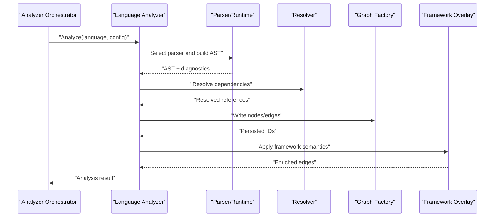
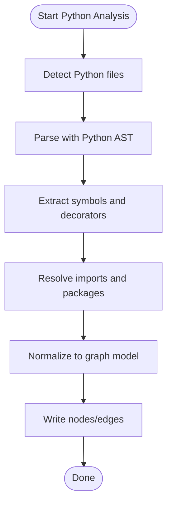
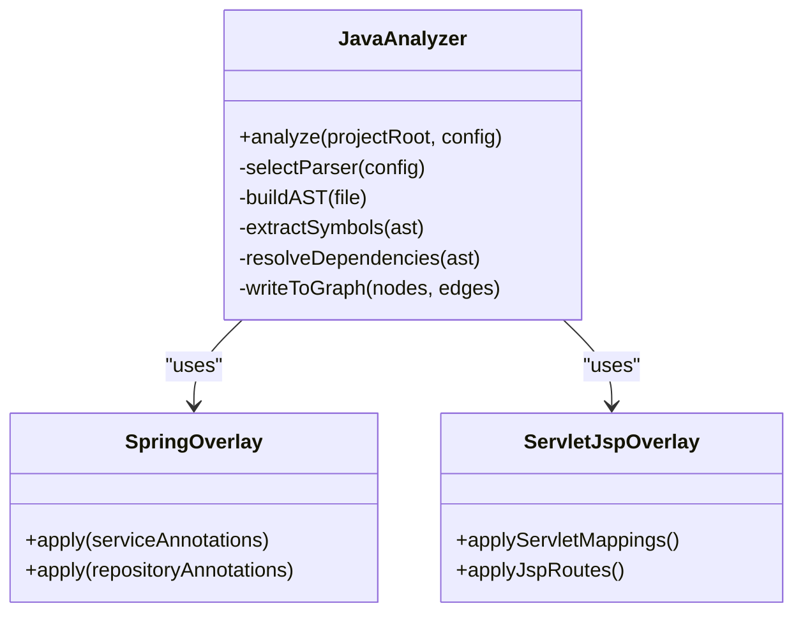
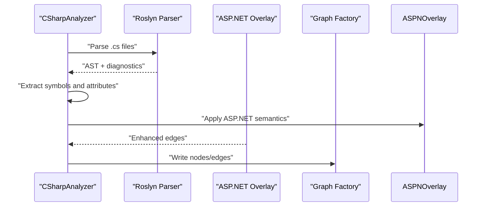
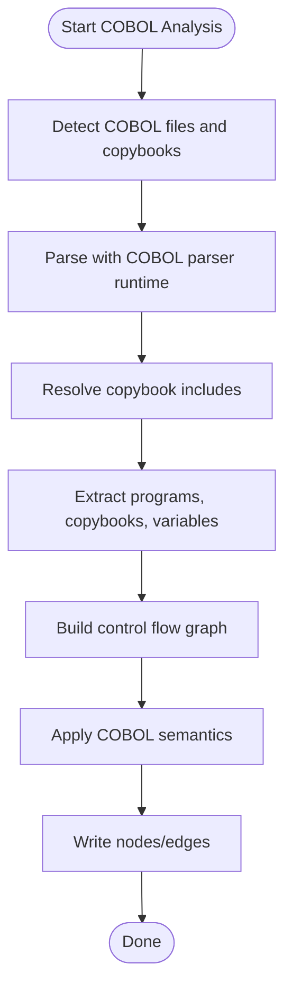
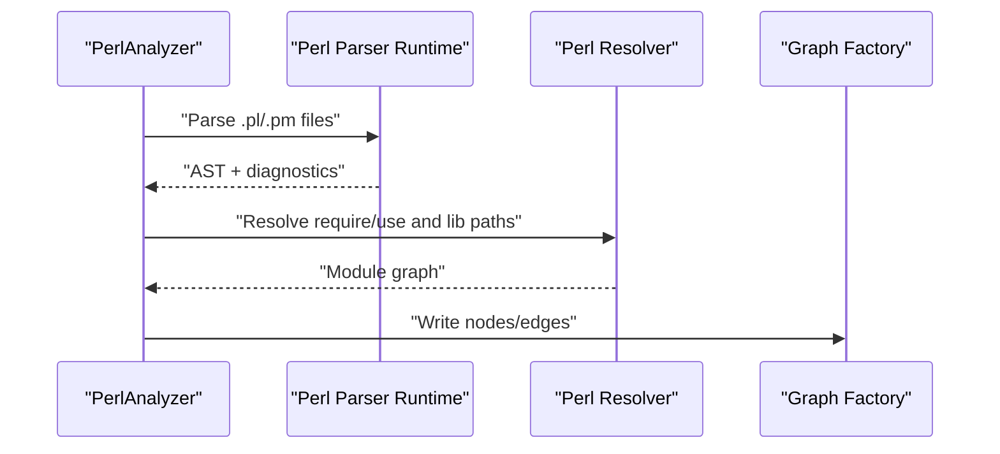
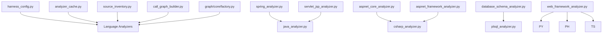
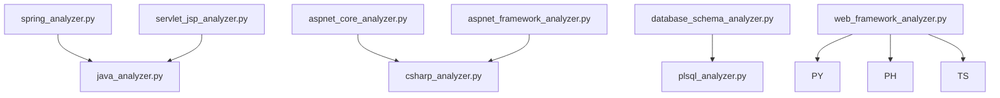

# Language-Specific Analyzer Implementations

<cite>
**Referenced Files in This Document**
- [python_analyzer.py](file://code-tiny/tools/python/python_analyzer.py)
- [java_analyzer.py](file://code-tiny/tools/java/java_analyzer.py)
- [csharp_analyzer.py](file://code-tiny/tools/csharp/csharp_analyzer.py)
- [cobol_analyzer.py](file://code-tiny/tools/cobol/cobol_analyzer.py)
- [perl_analyzer.py](file://code-tiny/tools/perl/perl_analyzer.py)
- [cplus_analyzer.py](file://code-tiny/tools/cplus/cplus_analyzer.py)
- [go_analyzer.py](file://code-tiny/tools/go/go_analyzer.py)
- [php_analyzer.py](file://code-tiny/tools/php/php_analyzer.py)
- [plsql_analyzer.py](file://code-tiny/tools/plsql/plsql_analyzer.py)
- [swift_analyzer.py](file://code-tiny/tools/swift/swift_analyzer.py)
- [rust_analyzer.py](file://code-tiny/tools/rust/rust_analyzer.py)
- [ts_analyzer.py](file://code-tiny/tools/ts/ts_analyzer.py)
- [kotlin_analyzer.py](file://code-tiny/tools/kotlin/kotlin_analyzer.py)
- [flutter_analyzer.py](file://code-tiny/tools/flutter/flutter_analyzer.py)
- [vbnet_analyzer.py](file://code-tiny/tools/vb/vbnet_analyzer.py)
- [vba_analyzer.py](file://code-tiny/tools/vb/vba_analyzer.py)
- [vbscript_analyzer.py](file://code-tiny/tools/vb/vbscript_analyzer.py)
- [delphi_analyzer.py](file://code-tiny/tools/delphi/delphi_analyzer.py)
- [spring_analyzer.py](file://code-tiny/tools/spring/spring_analyzer.py)
- [servlet_jsp_analyzer.py](file://code-tiny/tools/servlet_jsp/servlet_jsp_analyzer.py)
- [aspnet_core_analyzer.py](file://code-tiny/tools/aspnet_core/aspnet_core_analyzer.py)
- [aspnet_framework_analyzer.py](file://code-tiny/tools/aspnet_framework/aspnet_framework_analyzer.py)
- [database_schema_analyzer.py](file://code-tiny/tools/database_schema/database_schema_analyzer.py)
- [web_framework_analyzer.py](file://code-tiny/tools/web_framework/web_framework_analyzer.py)
- [graph_factory.py](file://code-tiny/tools/graph/core/factory.py)
- [harness_config.py](file://code-tiny/tools/common/harness_config.py)
- [analyzer_cache.py](file://code-tiny/tools/common/analyzer_cache.py)
- [call_graph_builder.py](file://code-tiny/tools/common/call_graph_builder.py)
- [source_inventory.py](file://code-tiny/tools/common/source_inventory.py)
- [incremental_sync_state.py](file://code-tiny/tools/common/incremental_sync_state.py)
- [pipeline.py (Cobol)](file://code-tiny/tools/cobol/pipeline.py)
- [parser_runtime.py (Cobol)](file://code-tiny/tools/cobol/parser_runtime.py)
- [resolver.py (Cobol)](file://code-tiny/tools/cobol/resolver.py)
- [models.py (Cobol)](file://code-tiny/tools/cobol/models.py)
- [semantics.py (Cobol)](file://code-tiny/tools/cobol/semantics.py)
- [cfg.py (Cobol)](file://code-tiny/tools/cobol/cfg.py)
- [qdrant.py (Cobol)](file://code-tiny/tools/cobol/qdrant.py)
- [parser.py (Cobol)](file://code-tiny/tools/cobol/parser.py)
- [pipeline.py (Perl)](file://code-tiny/tools/perl/pipeline.py)
- [parser_runtime.py (Perl)](file://code-tiny/tools/perl/parser_runtime.py)
- [resolver.py (Perl)](file://code-tiny/tools/perl/resolver.py)
- [models.py (Perl)](file://code-tiny/tools/perl/models.py)
- [perl_parser.py](file://code-tiny/tools/perl/perl_parser.py)
- [pipeline.py (Spring)](file://code-tiny/tools/spring/pipeline.py)
- [detector.py (Spring)](file://code-tiny/tools/spring/detector.py)
- [source_scanner.py (Spring)](file://code-tiny/tools/spring/source_scanner.py)
- [annotation_catalog.py (Spring)](file://code-tiny/tools/spring/annotation_catalog.py)
- [adapters.py (Spring)](file://code-tiny/tools/spring/adapters.py)
- [value_resolver.py (Spring)](file://code-tiny/tools/spring/value_resolver.py)
- [cache.py (Spring)](file://code-tiny/tools/spring/cache.py)
- [config.py (Spring)](file://code-tiny/tools/spring/config.py)
- [models.py (Spring)](file://code-tiny/tools/spring/models.py)
- [pipeline.py (Servlet/JSP)](file://code-tiny/tools/servlet_jsp/pipeline.py)
- [detector.py (Servlet/JSP)](file://code-tiny/tools/servlet_jsp/detector.py)
- [path_resolver.py (Servlet/JSP)](file://code-tiny/tools/servlet_jsp/path_resolver.py)
- [properties_parser.py (Servlet/JSP)](file://code-tiny/tools/servlet_jsp/properties_parser.py)
- [web_xml_parser.py (Servlet/JSP)](file://code-tiny/tools/servlet_jsp/web_xml_parser.py)
- [jsp_parser.py (Servlet/JSP)](file://code-tiny/tools/servlet_jsp/jsp_parser.py)
- [el_parser.py (Servlet/JSP)](file://code-tiny/tools/servlet_jsp/el_parser.py)
- [java_semantics.py (Servlet/JSP)](file://code-tiny/tools/servlet_jsp/java_semantics.py)
- [java_identity.py (Servlet/JSP)](file://code-tiny/tools/servlet_jsp/java_identity.py)
- [pipeline.py (ASP.NET Core)](file://code-tiny/tools/aspnet_core/pipeline.py)
- [detector.py (ASP.NET Core)](file://code-tiny/tools/aspnet_core/detector.py)
- [artifact_parsers.py (ASP.NET Core)](file://code-tiny/tools/aspnet_core/artifact_parsers.py)
- [resolver.py (ASP.NET Core)](file://code-tiny/tools/aspnet_core/resolver.py)
- [pipeline.py (ASP.NET Framework)](file://code-tiny/tools/aspnet_framework/pipeline.py)
- [detector.py (ASP.NET Framework)](file://code-tiny/tools/aspnet_framework/detector.py)
- [artifact_parsers.py (ASP.NET Framework)](file://code-tiny/tools/aspnet_framework/artifact_parsers.py)
- [resolver.py (ASP.NET Framework)](file://code-tiny/tools/aspnet_framework/resolver.py)
- [pipeline.py (Database Schema)](file://code-tiny/tools/database_schema/pipeline.py)
- [models.py (Database Schema)](file://code-tiny/tools/database_schema/models.py)
- [pipeline.py (Web Framework)](file://code-tiny/tools/web_framework/pipeline.py)
- [models.py (Web Framework)](file://code-tiny/tools/web_framework/models.py)
</cite>

## Table of Contents
1. [Introduction](#introduction)
2. [Project Structure](#project-structure)
3. [Core Components](#core-components)
4. [Architecture Overview](#architecture-overview)
5. [Detailed Component Analysis](#detailed-component-analysis)
6. [Dependency Analysis](#dependency-analysis)
7. [Performance Considerations](#performance-considerations)
8. [Troubleshooting Guide](#troubleshooting-guide)
9. [Conclusion](#conclusion)
10. [Appendices](#appendices)

## Introduction
This document explains how language-specific analyzers are implemented across Python, Java, C#, COBOL, Perl, and other supported languages within the repository. It focuses on common patterns used by analyzers, parser selection strategies, AST generation approaches, symbol extraction techniques, configuration options, dependency resolution, error recovery mechanisms, and interactions with framework overlays and specialized analyzers. The goal is to provide a comprehensive guide for understanding existing implementations and extending support to additional languages.

## Project Structure
The analyzer ecosystem is organized under code-tiny/tools, where each language has its own directory containing an analyzer entry point and supporting modules. Common utilities live under code-tiny/tools/common. Graph writing and core runtime components reside under code-tiny/tools/graph.

```mermaid
graph TB
subgraph "Common"
CFG["common: harness_config.py"]
CACHE["common: analyzer_cache.py"]
INV["common: source_inventory.py"]
CG["common: call_graph_builder.py"]
INC["common: incremental_sync_state.py"]
end
subgraph "Languages"
PY["python: python_analyzer.py"]
JV["java: java_analyzer.py"]
CS["csharp: csharp_analyzer.py"]
CB["cobol: cobol_analyzer.py"]
PL["perl: perl_analyzer.py"]
CP["cplus: cplus_analyzer.py"]
GO["go: go_analyzer.py"]
PH["php: php_analyzer.py"]
PS["plsql: plsql_analyzer.py"]
SW["swift: swift_analyzer.py"]
RS["rust: rust_analyzer.py"]
TS["ts: ts_analyzer.py"]
KT["kotlin: kotlin_analyzer.py"]
FL["flutter: flutter_analyzer.py"]
VB["vb: vbnet_analyzer.py / vba_analyzer.py / vbscript_analyzer.py"]
DP["delphi: delphi_analyzer.py"]
end
subgraph "Frameworks"
SPR["spring: spring_analyzer.py"]
SJS["servlet_jsp: servlet_jsp_analyzer.py"]
ASPN["aspnet_core: aspnet_core_analyzer.py"]
ASPF["aspnet_framework: aspnet_framework_analyzer.py"]
DBS["database_schema: database_schema_analyzer.py"]
WFA["web_framework: web_framework_analyzer.py"]
end
subgraph "Graph Core"
FCT["graph/core/factory.py"]
end
CFG --> PY
CFG --> JV
CFG --> CS
CFG --> CB
CFG --> PL
CFG --> CP
CFG --> GO
CFG --> PH
CFG --> PS
CFG --> SW
CFG --> RS
CFG --> TS
CFG --> KT
CFG --> FL
CFG --> VB
CFG --> DP
SPR --> JV
SPR --> KT
SJS --> JV
ASPN --> CS
ASPF --> CS
DBS --> PS
WFA --> PY
WFA --> PH
WFA --> JS["js: js_analyzer.py"]
WFA --> TS
PY --> FCT
JV --> FCT
CS --> FCT
CB --> FCT
PL --> FCT
CP --> FCT
GO --> FCT
PH --> FCT
PS --> FCT
SW --> FCT
RS --> FCT
TS --> FCT
KT --> FCT
FL --> FCT
VB --> FCT
DP --> FCT
```

**Diagram sources**
- [harness_config.py](file://code-tiny/tools/common/harness_config.py)
- [analyzer_cache.py](file://code-tiny/tools/common/analyzer_cache.py)
- [source_inventory.py](file://code-tiny/tools/common/source_inventory.py)
- [call_graph_builder.py](file://code-tiny/tools/common/call_graph_builder.py)
- [incremental_sync_state.py](file://code-tiny/tools/common/incremental_sync_state.py)
- [python_analyzer.py](file://code-tiny/tools/python/python_analyzer.py)
- [java_analyzer.py](file://code-tiny/tools/java/java_analyzer.py)
- [csharp_analyzer.py](file://code-tiny/tools/csharp/csharp_analyzer.py)
- [cobol_analyzer.py](file://code-tiny/tools/cobol/cobol_analyzer.py)
- [perl_analyzer.py](file://code-tiny/tools/perl/perl_analyzer.py)
- [cplus_analyzer.py](file://code-tiny/tools/cplus/cplus_analyzer.py)
- [go_analyzer.py](file://code-tiny/tools/go/go_analyzer.py)
- [php_analyzer.py](file://code-tiny/tools/php/php_analyzer.py)
- [plsql_analyzer.py](file://code-tiny/tools/plsql/plsql_analyzer.py)
- [swift_analyzer.py](file://code-tiny/tools/swift/swift_analyzer.py)
- [rust_analyzer.py](file://code-tiny/tools/rust/rust_analyzer.py)
- [ts_analyzer.py](file://code-tiny/tools/ts/ts_analyzer.py)
- [kotlin_analyzer.py](file://code-tiny/tools/kotlin/kotlin_analyzer.py)
- [flutter_analyzer.py](file://code-tiny/tools/flutter/flutter_analyzer.py)
- [vbnet_analyzer.py](file://code-tiny/tools/vb/vbnet_analyzer.py)
- [vba_analyzer.py](file://code-tiny/tools/vb/vba_analyzer.py)
- [vbscript_analyzer.py](file://code-tiny/tools/vb/vbscript_analyzer.py)
- [delphi_analyzer.py](file://code-tiny/tools/delphi/delphi_analyzer.py)
- [spring_analyzer.py](file://code-tiny/tools/spring/spring_analyzer.py)
- [servlet_jsp_analyzer.py](file://code-tiny/tools/servlet_jsp/servlet_jsp_analyzer.py)
- [aspnet_core_analyzer.py](file://code-tiny/tools/aspnet_core/aspnet_core_analyzer.py)
- [aspnet_framework_analyzer.py](file://code-tiny/tools/aspnet_framework/aspnet_framework_analyzer.py)
- [database_schema_analyzer.py](file://code-tiny/tools/database_schema/database_schema_analyzer.py)
- [web_framework_analyzer.py](file://code-tiny/tools/web_framework/web_framework_analyzer.py)
- [graph_factory.py](file://code-tiny/tools/graph/core/factory.py)

**Section sources**
- [harness_config.py](file://code-tiny/tools/common/harness_config.py)
- [analyzer_cache.py](file://code-tiny/tools/common/analyzer_cache.py)
- [source_inventory.py](file://code-tiny/tools/common/source_inventory.py)
- [call_graph_builder.py](file://code-tiny/tools/common/call_graph_builder.py)
- [incremental_sync_state.py](file://code-tiny/tools/common/incremental_sync_state.py)
- [graph_factory.py](file://code-tiny/tools/graph/core/factory.py)

## Core Components
Across all language analyzers, several shared responsibilities appear consistently:
- Configuration loading and validation via harness configuration utilities.
- Source discovery and inventory management.
- Parser selection based on file extensions or project metadata.
- AST generation using language-native tools or third-party parsers.
- Symbol extraction and normalization into a unified graph model.
- Dependency resolution including imports, includes, copybooks, annotations, and module manifests.
- Error handling and recovery strategies tailored to language parsing characteristics.
- Integration with framework overlays that enrich semantic edges (e.g., Spring annotations, JSP descriptors).

Key shared modules:
- Harness configuration and environment setup.
- Analyzer cache for incremental analysis.
- Source inventory for change detection and scope control.
- Call graph builder for cross-language linkage.
- Incremental sync state for reliable re-scans.

**Section sources**
- [harness_config.py](file://code-tiny/tools/common/harness_config.py)
- [analyzer_cache.py](file://code-tiny/tools/common/analyzer_cache.py)
- [source_inventory.py](file://code-tiny/tools/common/source_inventory.py)
- [call_graph_builder.py](file://code-tiny/tools/common/call_graph_builder.py)
- [incremental_sync_state.py](file://code-tiny/tools/common/incremental_sync_state.py)

## Architecture Overview
Each language analyzer follows a consistent pipeline:
1. Detect language and select appropriate parser(s).
2. Build AST from source files.
3. Extract symbols and relationships.
4. Resolve dependencies (imports, includes, annotations, copybooks, modules).
5. Write normalized nodes and edges to the graph store via the graph factory.
6. Optionally apply framework overlays to add semantic edges.

[No sources needed since this diagram shows conceptual workflow, not actual code structure]

## Detailed Component Analysis

### Python Analyzer
- Parser selection: Uses Python’s built-in AST capabilities; may integrate external tools if configured.
- AST generation: Parses .py files into AST nodes representing modules, classes, functions, decorators, and expressions.
- Symbol extraction: Identifies definitions, imports, and decorator usages; normalizes names and scopes.
- Decorators: Recognizes decorator syntax and records relationships between decorated targets and decorator call sites.
- Configuration: Supports Python-specific options such as interpreter path, virtualenv activation, and import root paths.
- Dependency resolution: Resolves relative and absolute imports, package metadata, and optional third-party libraries when available.
- Error recovery: Gracefully handles syntax errors by skipping problematic files and logging diagnostics.
- Framework overlays: Integrates with web framework overlay to detect routes, views, and middleware.

**Section sources**
- [python_analyzer.py](file://code-tiny/tools/python/python_analyzer.py)
- [web_framework_analyzer.py](file://code-tiny/tools/web_framework/web_framework_analyzer.py)

### Java Analyzer
- Parser selection: Leverages Java compiler tooling or dedicated Java parser depending on configuration.
- AST generation: Builds AST for .java files capturing classes, methods, fields, and annotations.
- Symbol extraction: Extracts class hierarchies, method signatures, and annotation usage.
- Annotations: Records @Override, @Service, @Repository, etc., and maps them to semantic roles when combined with framework overlays.
- Configuration: Options include JDK path, source/target levels, and classpath entries.
- Dependency resolution: Resolves imports, package declarations, and referenced types; integrates with Maven/Gradle metadata when present.
- Error recovery: Skips files with compilation errors and continues scanning others.
- Framework overlays: Spring and Servlet/JSP overlays enhance symbol meanings and wiring.

**Diagram sources**
- [java_analyzer.py](file://code-tiny/tools/java/java_analyzer.py)
- [spring_analyzer.py](file://code-tiny/tools/spring/spring_analyzer.py)
- [servlet_jsp_analyzer.py](file://code-tiny/tools/servlet_jsp/servlet_jsp_analyzer.py)

**Section sources**
- [java_analyzer.py](file://code-tiny/tools/java/java_analyzer.py)
- [spring_analyzer.py](file://code-tiny/tools/spring/spring_analyzer.py)
- [servlet_jsp_analyzer.py](file://code-tiny/tools/servlet_jsp/servlet_jsp_analyzer.py)

### C# Analyzer
- Parser selection: Uses Roslyn-based parsing when available; otherwise falls back to text-based heuristics.
- AST generation: Captures namespaces, classes, methods, attributes, and directives.
- Symbol extraction: Identifies types, members, and attribute usages.
- Attributes: Maps C# attributes to semantic roles; integrates with ASP.NET overlays for controllers and endpoints.
- Configuration: Options include SDK path, target framework, and project files (.csproj).
- Dependency resolution: Resolves using-project references and NuGet packages when metadata is accessible.
- Error recovery: Continues analysis despite compilation issues; logs diagnostics per file.
- Framework overlays: ASP.NET Core and ASP.NET Framework overlays add routing and controller mappings.

**Diagram sources**
- [csharp_analyzer.py](file://code-tiny/tools/csharp/csharp_analyzer.py)
- [aspnet_core_analyzer.py](file://code-tiny/tools/aspnet_core/aspnet_core_analyzer.py)
- [aspnet_framework_analyzer.py](file://code-tiny/tools/aspnet_framework/aspnet_framework_analyzer.py)

**Section sources**
- [csharp_analyzer.py](file://code-tiny/tools/csharp/csharp_analyzer.py)
- [aspnet_core_analyzer.py](file://code-tiny/tools/aspnet_core/aspnet_core_analyzer.py)
- [aspnet_framework_analyzer.py](file://code-tiny/tools/aspnet_framework/aspnet_framework_analyzer.py)

### COBOL Analyzer
- Parser selection: Custom parser runtime designed for COBOL dialects; supports copybook inclusion and fixed-format source.
- AST generation: Produces structured representations of divisions, sections, paragraphs, and data items.
- Symbol extraction: Identifies programs, copybooks, variables, and control flow constructs.
- Copybooks: Resolves included copybooks and merges their structures into the program context.
- Configuration: Options include COBOL dialect, copybook search paths, and source format flags.
- Dependency resolution: Tracks copybook includes and program calls; resolves relative paths and environment variables.
- Error recovery: Robust recovery for malformed copybooks and syntax anomalies; emits diagnostics without halting.
- Semantics and CFG: Provides control flow graphs and semantic enrichment for COBOL-specific constructs.

**Diagram sources**
- [cobol_analyzer.py](file://code-tiny/tools/cobol/cobol_analyzer.py)
- [parser_runtime.py (Cobol)](file://code-tiny/tools/cobol/parser_runtime.py)
- [resolver.py (Cobol)](file://code-tiny/tools/cobol/resolver.py)
- [models.py (Cobol)](file://code-tiny/tools/cobol/models.py)
- [semantics.py (Cobol)](file://code-tiny/tools/cobol/semantics.py)
- [cfg.py (Cobol)](file://code-tiny/tools/cobol/cfg.py)
- [pipeline.py (Cobol)](file://code-tiny/tools/cobol/pipeline.py)

**Section sources**
- [cobol_analyzer.py](file://code-tiny/tools/cobol/cobol_analyzer.py)
- [parser_runtime.py (Cobol)](file://code-tiny/tools/cobol/parser_runtime.py)
- [resolver.py (Cobol)](file://code-tiny/tools/cobol/resolver.py)
- [models.py (Cobol)](file://code-tiny/tools/cobol/models.py)
- [semantics.py (Cobol)](file://code-tiny/tools/cobol/semantics.py)
- [cfg.py (Cobol)](file://code-tiny/tools/cobol/cfg.py)
- [pipeline.py (Cobol)](file://code-tiny/tools/cobol/pipeline.py)

### Perl Analyzer
- Parser selection: Uses Perl parser runtime and grammar to handle dynamic features and pragmas.
- AST generation: Builds AST for scripts, modules, and test files; captures packages, subroutines, and use statements.
- Symbol extraction: Identifies packages, subs, variables, and module exports.
- Modules: Resolves require/use statements and library paths; supports custom module directories.
- Configuration: Options include PERL5LIB paths, pragma handling, and test file filtering.
- Dependency resolution: Tracks module dependencies and inter-file references; handles dynamic loading best-effort.
- Error recovery: Tolerates syntax variations and missing modules; logs warnings and continues.

**Diagram sources**
- [perl_analyzer.py](file://code-tiny/tools/perl/perl_analyzer.py)
- [parser_runtime.py (Perl)](file://code-tiny/tools/perl/parser_runtime.py)
- [resolver.py (Perl)](file://code-tiny/tools/perl/resolver.py)
- [models.py (Perl)](file://code-tiny/tools/perl/models.py)
- [pipeline.py (Perl)](file://code-tiny/tools/perl/pipeline.py)
- [perl_parser.py](file://code-tiny/tools/perl/perl_parser.py)

**Section sources**
- [perl_analyzer.py](file://code-tiny/tools/perl/perl_analyzer.py)
- [parser_runtime.py (Perl)](file://code-tiny/tools/perl/parser_runtime.py)
- [resolver.py (Perl)](file://code-tiny/tools/perl/resolver.py)
- [models.py (Perl)](file://code-tiny/tools/perl/models.py)
- [pipeline.py (Perl)](file://code-tiny/tools/perl/pipeline.py)
- [perl_parser.py](file://code-tiny/tools/perl/perl_parser.py)

### Other Languages Summary
- C++: Uses clang-based parsing and resource/resource script parsers; extracts classes, functions, and Windows resources.
- Go: Analyzes packages, functions, and imports; resolves module dependencies via go.mod when available.
- PHP: Parses PHP files, identifies classes/functions, and resolves includes/require statements.
- PL/SQL: Extracts procedures, functions, packages, and SQL blocks; integrates with database schema overlay.
- Swift/Rust/Kotlin/Dart/Flutter: Similar patterns—parse source, extract symbols, resolve dependencies, write graph.
- VB family (VB.NET/VBA/VBScript): Use language-appropriate parsers; VB.NET integrates with Roslyn-like workflows.
- Delphi: Parses units and forms; resolves uses clauses and component references.

**Section sources**
- [cplus_analyzer.py](file://code-tiny/tools/cplus/cplus_analyzer.py)
- [go_analyzer.py](file://code-tiny/tools/go/go_analyzer.py)
- [php_analyzer.py](file://code-tiny/tools/php/php_analyzer.py)
- [plsql_analyzer.py](file://code-tiny/tools/plsql/plsql_analyzer.py)
- [swift_analyzer.py](file://code-tiny/tools/swift/swift_analyzer.py)
- [rust_analyzer.py](file://code-tiny/tools/rust/rust_analyzer.py)
- [kotlin_analyzer.py](file://code-tiny/tools/kotlin/kotlin_analyzer.py)
- [flutter_analyzer.py](file://code-tiny/tools/flutter/flutter_analyzer.py)
- [vbnet_analyzer.py](file://code-tiny/tools/vb/vbnet_analyzer.py)
- [vba_analyzer.py](file://code-tiny/tools/vb/vba_analyzer.py)
- [vbscript_analyzer.py](file://code-tiny/tools/vb/vbscript_analyzer.py)
- [delphi_analyzer.py](file://code-tiny/tools/delphi/delphi_analyzer.py)

## Dependency Analysis
Analyzers depend on shared infrastructure for configuration, caching, source inventory, and graph writing. Framework overlays extend language analyzers by adding semantic edges based on framework conventions.

**Diagram sources**
- [harness_config.py](file://code-tiny/tools/common/harness_config.py)
- [analyzer_cache.py](file://code-tiny/tools/common/analyzer_cache.py)
- [source_inventory.py](file://code-tiny/tools/common/source_inventory.py)
- [call_graph_builder.py](file://code-tiny/tools/common/call_graph_builder.py)
- [graph_factory.py](file://code-tiny/tools/graph/core/factory.py)
- [spring_analyzer.py](file://code-tiny/tools/spring/spring_analyzer.py)
- [servlet_jsp_analyzer.py](file://code-tiny/tools/servlet_jsp/servlet_jsp_analyzer.py)
- [aspnet_core_analyzer.py](file://code-tiny/tools/aspnet_core/aspnet_core_analyzer.py)
- [aspnet_framework_analyzer.py](file://code-tiny/tools/aspnet_framework/aspnet_framework_analyzer.py)
- [database_schema_analyzer.py](file://code-tiny/tools/database_schema/database_schema_analyzer.py)
- [web_framework_analyzer.py](file://code-tiny/tools/web_framework/web_framework_analyzer.py)
- [python_analyzer.py](file://code-tiny/tools/python/python_analyzer.py)
- [php_analyzer.py](file://code-tiny/tools/php/php_analyzer.py)
- [ts_analyzer.py](file://code-tiny/tools/ts/ts_analyzer.py)
- [java_analyzer.py](file://code-tiny/tools/java/java_analyzer.py)
- [csharp_analyzer.py](file://code-tiny/tools/csharp/csharp_analyzer.py)
- [plsql_analyzer.py](file://code-tiny/tools/plsql/plsql_analyzer.py)

**Section sources**
- [harness_config.py](file://code-tiny/tools/common/harness_config.py)
- [analyzer_cache.py](file://code-tiny/tools/common/analyzer_cache.py)
- [source_inventory.py](file://code-tiny/tools/common/source_inventory.py)
- [call_graph_builder.py](file://code-tiny/tools/common/call_graph_builder.py)
- [graph_factory.py](file://code-tiny/tools/graph/core/factory.py)
- [spring_analyzer.py](file://code-tiny/tools/spring/spring_analyzer.py)
- [servlet_jsp_analyzer.py](file://code-tiny/tools/servlet_jsp/servlet_jsp_analyzer.py)
- [aspnet_core_analyzer.py](file://code-tiny/tools/aspnet_core/aspnet_core_analyzer.py)
- [aspnet_framework_analyzer.py](file://code-tiny/tools/aspnet_framework/aspnet_framework_analyzer.py)
- [database_schema_analyzer.py](file://code-tiny/tools/database_schema/database_schema_analyzer.py)
- [web_framework_analyzer.py](file://code-tiny/tools/web_framework/web_framework_analyzer.py)

## Performance Considerations
- Incremental analysis: Use analyzer cache and incremental sync state to avoid full re-scans.
- Parallel parsing: Where possible, parse independent files concurrently to reduce total time.
- Selective scanning: Limit scope to changed files and affected modules using source inventory.
- Parser efficiency: Prefer native compilers/toolchains (e.g., Roslyn, clang) when available for faster and more accurate parsing.
- Memory management: Stream large files and avoid retaining entire ASTs in memory when not needed.
- Cache invalidation: Invalidate caches only when relevant inputs change (e.g., copybook updates, module manifests).

[No sources needed since this section provides general guidance]

## Troubleshooting Guide
- Parser failures: Check diagnostics emitted by language parsers; ensure correct interpreter/compiler paths in configuration.
- Missing dependencies: Verify import/module resolution settings (e.g., PERL5LIB, classpath, copybook paths).
- Framework overlay issues: Confirm framework detectors are enabled and project structure matches expected patterns.
- Incremental sync problems: Validate lock files and state consistency; reset state if necessary.
- Graph write errors: Inspect graph factory logs and ensure proper permissions and connectivity to the graph store.

**Section sources**
- [analyzer_cache.py](file://code-tiny/tools/common/analyzer_cache.py)
- [incremental_sync_state.py](file://code-tiny/tools/common/incremental_sync_state.py)
- [harness_config.py](file://code-tiny/tools/common/harness_config.py)

## Conclusion
The repository implements a cohesive set of language-specific analyzers that share common patterns for configuration, parsing, symbol extraction, dependency resolution, and graph writing. Framework overlays augment language analyzers with domain-specific semantics. COBOL and Perl demonstrate robust custom parser runtimes and strong error recovery. Extending support to new languages should follow the established pipeline, leverage shared infrastructure, and integrate overlays where applicable.

[No sources needed since this section summarizes without analyzing specific files]

## Appendices

### Framework Overlays and Specialized Analyzers
- Spring Overlay: Enhances Java/Kotlin analysis with service/repository/controller mappings and value injection semantics.
- Servlet/JSP Overlay: Adds HTTP route mapping from web.xml, JSP files, and EL expressions.
- ASP.NET Overlays: Enriches C# analysis with controllers, actions, and routing configurations.
- Database Schema Overlay: Augments PL/SQL analysis with schema objects and relationships.
- Web Framework Overlay: General-purpose overlay for web frameworks across multiple languages.

**Diagram sources**
- [spring_analyzer.py](file://code-tiny/tools/spring/spring_analyzer.py)
- [servlet_jsp_analyzer.py](file://code-tiny/tools/servlet_jsp/servlet_jsp_analyzer.py)
- [aspnet_core_analyzer.py](file://code-tiny/tools/aspnet_core/aspnet_core_analyzer.py)
- [aspnet_framework_analyzer.py](file://code-tiny/tools/aspnet_framework/aspnet_framework_analyzer.py)
- [database_schema_analyzer.py](file://code-tiny/tools/database_schema/database_schema_analyzer.py)
- [web_framework_analyzer.py](file://code-tiny/tools/web_framework/web_framework_analyzer.py)
- [java_analyzer.py](file://code-tiny/tools/java/java_analyzer.py)
- [csharp_analyzer.py](file://code-tiny/tools/csharp/csharp_analyzer.py)
- [plsql_analyzer.py](file://code-tiny/tools/plsql/plsql_analyzer.py)
- [python_analyzer.py](file://code-tiny/tools/python/python_analyzer.py)
- [php_analyzer.py](file://code-tiny/tools/php/php_analyzer.py)
- [ts_analyzer.py](file://code-tiny/tools/ts/ts_analyzer.py)

**Section sources**
- [spring_analyzer.py](file://code-tiny/tools/spring/spring_analyzer.py)
- [servlet_jsp_analyzer.py](file://code-tiny/tools/servlet_jsp/servlet_jsp_analyzer.py)
- [aspnet_core_analyzer.py](file://code-tiny/tools/aspnet_core/aspnet_core_analyzer.py)
- [aspnet_framework_analyzer.py](file://code-tiny/tools/aspnet_framework/aspnet_framework_analyzer.py)
- [database_schema_analyzer.py](file://code-tiny/tools/database_schema/database_schema_analyzer.py)
- [web_framework_analyzer.py](file://code-tiny/tools/web_framework/web_framework_analyzer.py)