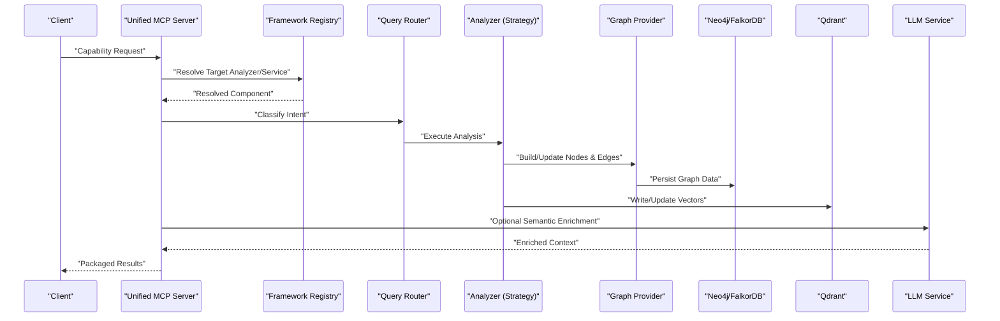
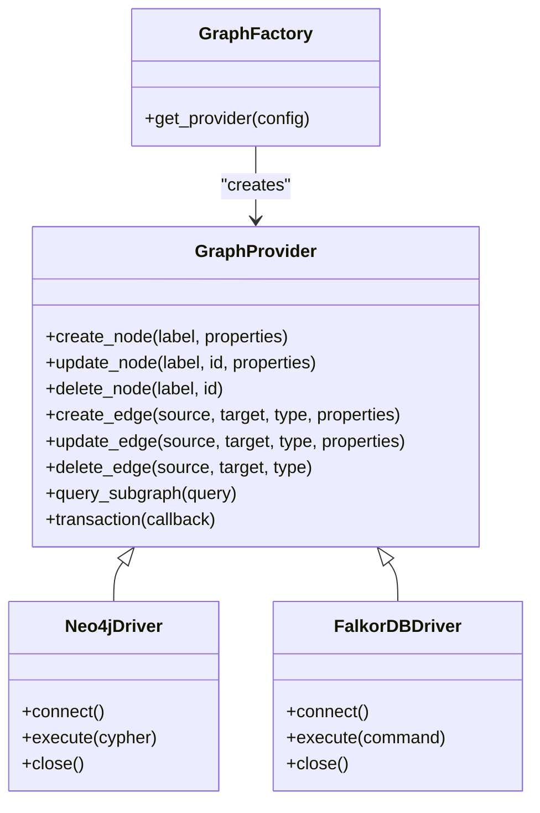
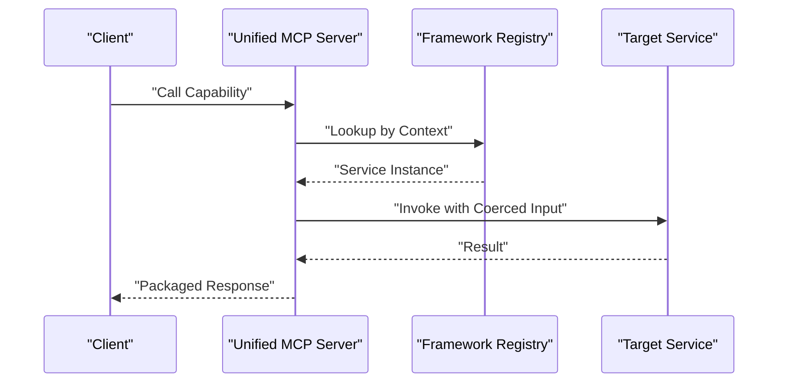
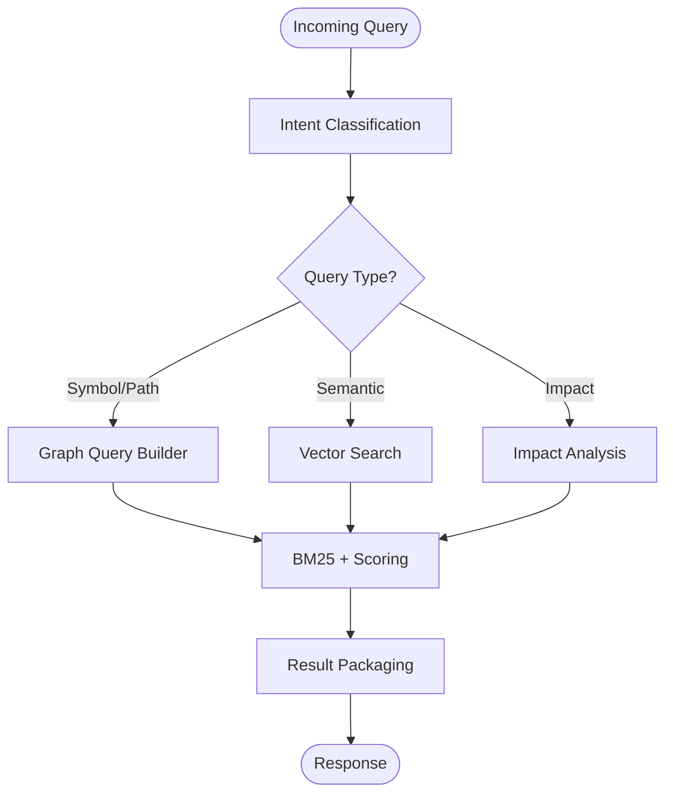
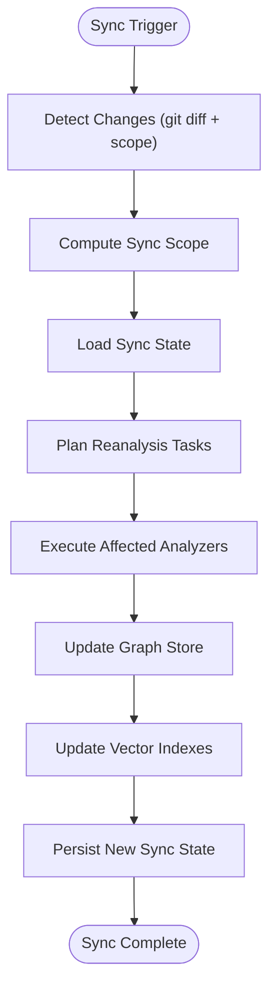
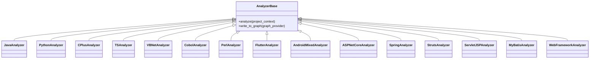
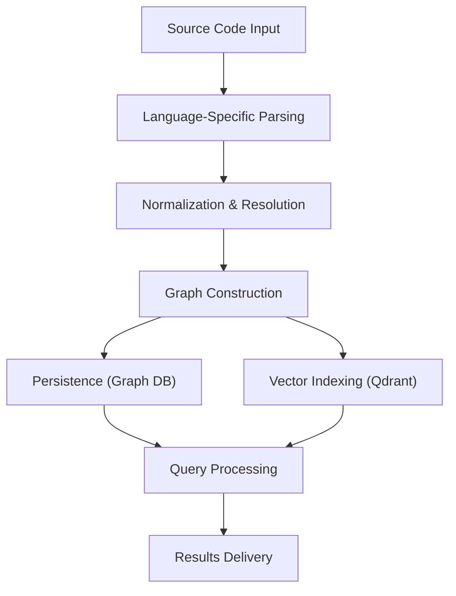
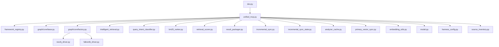

# Core Concepts & Architecture

<cite>
**Referenced Files in This Document**
- [ReadMe.md](file://ReadMe.md)
- [Makefile](file://Makefile)
- [requirements.txt](file://requirements.txt)
- [pyproject.toml](file://pyproject.toml)
- [cortex_harness/dev.py](file://cortex_harness/dev.py)
- [code-tiny/mcp/unified_mcp.py](file://code-tiny/mcp/unified_mcp.py)
- [code-tiny/mcp/fastmcp_server.py](file://code-tiny/mcp/fastmcp_server.py)
- [code-tiny/mcp/framework_registry.py](file://code-tiny/mcp/framework_registry.py)
- [code-tiny/tools/graph/core/base.py](file://code-tiny/tools/graph/core/base.py)
- [code-tiny/tools/graph/core/factory.py](file://code-tiny/tools/graph/core/factory.py)
- [code-tiny/tools/graph/driver/neo4j_driver.py](file://code-tiny/tools/graph/driver/neo4j_driver.py)
- [code-tiny/tools/graph/driver/falkordb_driver.py](file://code-tiny/tools/graph/driver/falkordb_driver.py)
- [code-tiny/tools/common/harness_config.py](file://code-tiny/tools/common/harness_config.py)
- [code-tiny/tools/common/incremental_sync_state.py](file://code-tiny/tools/common/incremental_sync_state.py)
- [code-tiny/tools/sync/incremental_sync.py](file://code-tiny/tools/sync/incremental_sync.py)
- [code-tiny/tools/common/source_inventory.py](file://code-tiny/tools/common/source_inventory.py)
- [code-tiny/tools/common/analyzer_cache.py](file://code-tiny/tools/common/analyzer_cache.py)
- [code-tiny/tools/common/call_graph_builder.py](file://code-tiny/tools/common/call_graph_builder.py)
- [code-tiny/tools/common/intelligent_retrieval.py](file://code-tiny/tools/common/intelligent_retrieval.py)
- [code-tiny/tools/common/query_intent_classifier.py](file://code-tiny/tools/common/query_intent_classifier.py)
- [code-tiny/tools/common/result_packager.py](file://code-tiny/tools/common/result_packager.py)
- [code-tiny/tools/common/bm25_ranker.py](file://code-tiny/tools/common/bm25_ranker.py)
- [code-tiny/tools/common/retrieval_scorer.py](file://code-tiny/tools/common/retrieval_scorer.py)
- [code-tiny/tools/common/primary_vector_sync.py](file://code-tiny/tools/common/primary_vector_sync.py)
- [code-tiny/tools/common/workflow_classifier.py](file://code-tiny/tools/common/workflow_classifier.py)
- [code-tiny/tools/common/workflow_impact_scorer.py](file://code-tiny/tools/common/workflow_impact_scorer.py)
- [code-tiny/tools/common/git_diff.py](file://code-tiny/tools/common/git_diff.py)
- [code-tiny/tools/common/sync_scope.py](file://code-tiny/tools/common/sync_scope.py)
- [code-tiny/tools/common/message_scan.py](file://code-tiny/tools/common/message_scan.py)
- [code-tiny/tools/common/frontend_relationship_extractor.py](file://code-tiny/tools/common/frontend_relationship_extractor.py)
- [code-tiny/tools/common/graph_expander.py](file://code-tiny/tools/common/graph_expander.py)
- [code-tiny/tools/common/confidence_scorer.py](file://code-tiny/tools/common/confidence_scorer.py)
- [code-tiny/tools/common/signal_normalizer.py](file://code-tiny/tools/common/signal_normalizer.py)
- [code-tiny/tools/common/url_normalizer.py](file://code-tiny/tools/common/url_normalizer.py)
- [code-tiny/tools/common/cloc_stats.py](file://code-tiny/tools/common/cloc_stats.py)
- [code-tiny/tools/common/api_match_engine.py](file://code-tiny/tools/common/api_match_engine.py)
- [code-tiny/tools/common/semantic_inference.py](file://code-tiny/tools/common/semantic_inference.py)
- [code-tiny/tools/common/llm_summary.py](file://code-tiny/tools/common/llm_summary.py)
- [code-tiny/tools/common/react_role_classifier.py](file://code-tiny/tools/common/react_role_classifier.py)
- [code-tiny/tools/database_schema/database_schema_analyzer.py](file://code-tiny/tools/database_schema/database_schema_analyzer.py)
- [code-tiny/tools/database_schema/pipeline.py](file://code-tiny/tools/database_schema/pipeline.py)
- [code-tiny/tools/mybatis/mybatis_analyzer.py](file://code-tiny/tools/mybatis/mybatis_analyzer.py)
- [code-tiny/tools/mybatis/pipeline.py](file://code-tiny/tools/mybatis/pipeline.py)
- [code-tiny/tools/servlet_jsp/servlet_jsp_analyzer.py](file://code-tiny/tools/servlet_jsp/servlet_jsp_analyzer.py)
- [code-tiny/tools/servlet_jsp/pipeline.py](file://code-tiny/tools/servlet_jsp/pipeline.py)
- [code-tiny/tools/struts/struts_analyzer.py](file://code-tiny/tools/struts/struts_analyzer.py)
- [code-tiny/tools/struts/pipeline.py](file://code-tiny/tools/struts/pipeline.py)
- [code-tiny/tools/web_framework/web_framework_analyzer.py](file://code-tiny/tools/web_framework/web_framework_analyzer.py)
- [code-tiny/tools/web_framework/pipeline.py](file://code-tiny/tools/web_framework/pipeline.py)
- [code-tiny/tools/flutter/flutter_analyzer.py](file://code-tiny/tools/flutter/flutter_analyzer.py)
- [code-tiny/tools/flutter/pipeline.py](file://code-tiny/tools/flutter/pipeline.py)
- [code-tiny/tools/cobol/cobol_analyzer.py](file://code-tiny/tools/cobol/cobol_analyzer.py)
- [code-tiny/tools/cobol/pipeline.py](file://code-tiny/tools/cobol/pipeline.py)
- [code-tiny/tools/perl/perl_analyzer.py](file://code-tiny/tools/perl/perl_analyzer.py)
- [code-tiny/tools/perl/pipeline.py](file://code-tiny/tools/perl/pipeline.py)
- [code-tiny/tools/ts/ts_analyzer.py](file://code-tiny/tools/ts/ts_analyzer.py)
- [code-tiny/tools/ts/ts_project_detector.py](file://code-tiny/tools/ts/ts_project_detector.py)
- [code-tiny/tools/ts/ts_backend_analyzer.py](file://code-tiny/tools/ts/ts_backend_analyzer.py)
- [code-tiny/tools/ts/ts_api_bridge.py](file://code-tiny/tools/ts/ts_api_bridge.py)
- [code-tiny/tools/vb/vbnet_analyzer.py](file://code-tiny/tools/vb/vbnet_analyzer.py)
- [code-tiny/tools/vb/vb6_analyzer.py](file://code-tiny/tools/vb/vb6_analyzer.py)
- [code-tiny/tools/vb/vba_analyzer.py](file://code-tiny/tools/vb/vba_analyzer.py)
- [code-tiny/tools/vb/vbscript_analyzer.py](file://code-tiny/tools/vb/vbscript_analyzer.py)
- [code-tiny/tools/cplus/cplus_analyzer.py](file://code-tiny/tools/cplus/cplus_analyzer.py)
- [code-tiny/tools/java/java_analyzer.py](file://code-tiny/tools/java/java_analyzer.py)
- [code-tiny/tools/python/python_analyzer.py](file://code-tiny/tools/python/python_analyzer.py)
- [code-tiny/tools/js/js_analyzer.py](file://code-tiny/tools/js/js_analyzer.py)
- [code-tiny/tools/go/go_analyzer.py](file://code-tiny/tools/go/go_analyzer.py)
- [code-tiny/tools/rust/rust_analyzer.py](file://code-tiny/tools/rust/rust_analyzer.py)
- [code-tiny/tools/php/php_analyzer.py](file://code-tiny/tools/php/php_analyzer.py)
- [code-tiny/tools/sql/sql_analyzer.py](file://code-tiny/tools/sql/sql_analyzer.py)
- [code-tiny/tools/swift/swift_analyzer.py](file://code-tiny/tools/swift/swift_analyzer.py)
- [code-tiny/tools/android/android_java_analyzer.py](file://code-tiny/tools/android/android_java_analyzer.py)
- [code-tiny/tools/android/android_kotlin_analyzer.py](file://code-tiny/tools/android/android_kotlin_analyzer.py)
- [code-tiny/tools/android/android_mixed_analyzer.py](file://code-tiny/tools/android/android_mixed_analyzer.py)
- [code-tiny/tools/aspnet_core/aspnet_core_analyzer.py](file://code-tiny/tools/aspnet_core/aspnet_core_analyzer.py)
- [code-tiny/tools/aspnet_core/pipeline.py](file://code-tiny/tools/aspnet_core/pipeline.py)
- [code-tiny/tools/aspnet_framework/aspnet_framework_analyzer.py](file://code-tiny/tools/aspnet_framework/aspnet_framework_analyzer.py)
- [code-tiny/tools/aspnet_framework/pipeline.py](file://code-tiny/tools/aspnet_framework/pipeline.py)
- [code-tiny/tools/spring/spring_analyzer.py](file://code-tiny/tools/spring/spring_analyzer.py)
- [code-tiny/tools/spring/pipeline.py](file://code-tiny/tools/spring/pipeline.py)
- [doc-tiny/graph_store.py](file://doc-tiny/graph_store.py)
- [doc-tiny/neo4j_loader.py](file://doc-tiny/neo4j_loader.py)
- [doc-tiny/embedding_utils.py](file://doc-tiny/embedding_utils.py)
- [doc-tiny/model.py](file://doc-tiny/model.py)
- [scripts/mcp_runtime_config.py](file://scripts/mcp_runtime_config.py)
</cite>

## Table of Contents
1. [Introduction](#introduction)
2. [Project Structure](#project-structure)
3. [Core Components](#core-components)
4. [Architecture Overview](#architecture-overview)
5. [Detailed Component Analysis](#detailed-component-analysis)
6. [Dependency Analysis](#dependency-analysis)
7. [Performance Considerations](#performance-considerations)
8. [Troubleshooting Guide](#troubleshooting-guide)
9. [Conclusion](#conclusion)
10. [Appendices](#appendices)

## Introduction
Cortex Harness is a modular, multi-language code analysis and graph-based intelligence platform. It ingests source code from diverse languages and frameworks, constructs rich semantic graphs, indexes them for retrieval, and exposes capabilities via an MCP integration layer. The system emphasizes:
- A strategy-based analyzer framework to support many languages and frameworks
- A graph-first representation of code relationships with pluggable database backends (Neo4j/FalkorDB)
- Vector search and LLM-assisted semantics for intelligent retrieval
- Incremental synchronization to keep the graph aligned with repository changes
- An MCP server that routes queries to appropriate analyzers and services

This document explains the high-level architecture, core components, data flows, technical decisions, infrastructure requirements, and cross-cutting concerns such as caching, performance, and scalability.

## Project Structure
At a high level, the repository contains:
- Python runtime orchestration and MCP server entry points
- Language-specific analyzers and framework overlays under tools
- Graph core abstractions and drivers for Neo4j and FalkorDB
- Common utilities for incremental sync, caching, retrieval, and result packaging
- Documentation ingestion utilities and vector embedding helpers
- Scripts for lifecycle management and configuration

```mermaid
graph TB
subgraph "Runtime"
Dev["dev.py"]
MCP["unified_mcp.py"]
FastMCP["fastmcp_server.py"]
Registry["framework_registry.py"]
end
subgraph "Graph Core"
Base["graph/core/base.py"]
Factory["graph/core/factory.py"]
Neo4j["graph/driver/neo4j_driver.py"]
Falkor["graph/driver/falkordb_driver.py"]
end
subgraph "Analyzers"
Langs["Language Analyzers<br/>java, python, cplus, ts, vb, cobol, perl, flutter, etc."]
Frameworks["Framework Overlays<br/>spring, struts, servlet/jsp, mybatis, aspnet, web_framework"]
end
subgraph "Common Services"
Sync["incremental_sync.py"]
State["incremental_sync_state.py"]
Cache["analyzer_cache.py"]
Retrieval["intelligent_retrieval.py"]
Intent["query_intent_classifier.py"]
Pack["result_packager.py"]
BM25["bm25_ranker.py"]
Scorer["retrieval_scorer.py"]
VSync["primary_vector_sync.py"]
GitDiff["git_diff.py"]
Scope["sync_scope.py"]
MsgScan["message_scan.py"]
FEExt["frontend_relationship_extractor.py"]
Expander["graph_expander.py"]
Conf["confidence_scorer.py"]
Norm["signal_normalizer.py"]
URLNorm["url_normalizer.py"]
CLOC["cloc_stats.py"]
APIMatch["api_match_engine.py"]
SemInf["semantic_inference.py"]
LLMSum["llm_summary.py"]
ReactRole["react_role_classifier.py"]
Config["harness_config.py"]
SourceInv["source_inventory.py"]
end
subgraph "Doc Ingestion"
GStore["graph_store.py"]
NLoader["neo4j_loader.py"]
Embed["embedding_utils.py"]
Model["model.py"]
end
Dev --> MCP
MCP --> Registry
MCP --> Base
MCP --> Factory
MCP --> Langs
MCP --> Frameworks
MCP --> Sync
MCP --> State
MCP --> Cache
MCP --> Retrieval
MCP --> Intent
MCP --> Pack
MCP --> BM25
MCP --> Scorer
MCP --> VSync
MCP --> GitDiff
MCP --> Scope
MCP --> MsgScan
MCP --> FEExt
MCP --> Expander
MCP --> Conf
MCP --> Norm
MCP --> URLNorm
MCP --> CLOC
MCP --> APIMatch
MCP --> SemInf
MCP --> LLMSum
MCP --> ReactRole
MCP --> Config
MCP --> SourceInv
MCP --> Neo4j
MCP --> Falkor
MCP --> GStore
MCP --> NLoader
MCP --> Embed
MCP --> Model
```

**Diagram sources**
- [cortex_harness/dev.py](file://cortex_harness/dev.py)
- [code-tiny/mcp/unified_mcp.py](file://code-tiny/mcp/unified_mcp.py)
- [code-tiny/mcp/fastmcp_server.py](file://code-tiny/mcp/fastmcp_server.py)
- [code-tiny/mcp/framework_registry.py](file://code-tiny/mcp/framework_registry.py)
- [code-tiny/tools/graph/core/base.py](file://code-tiny/tools/graph/core/base.py)
- [code-tiny/tools/graph/core/factory.py](file://code-tiny/tools/graph/core/factory.py)
- [code-tiny/tools/graph/driver/neo4j_driver.py](file://code-tiny/tools/graph/driver/neo4j_driver.py)
- [code-tiny/tools/graph/driver/falkordb_driver.py](file://code-tiny/tools/graph/driver/falkordb_driver.py)
- [code-tiny/tools/common/incremental_sync.py](file://code-tiny/tools/sync/incremental_sync.py)
- [code-tiny/tools/common/incremental_sync_state.py](file://code-tiny/tools/common/incremental_sync_state.py)
- [code-tiny/tools/common/analyzer_cache.py](file://code-tiny/tools/common/analyzer_cache.py)
- [code-tiny/tools/common/intelligent_retrieval.py](file://code-tiny/tools/common/intelligent_retrieval.py)
- [code-tiny/tools/common/query_intent_classifier.py](file://code-tiny/tools/common/query_intent_classifier.py)
- [code-tiny/tools/common/result_packager.py](file://code-tiny/tools/common/result_packager.py)
- [code-tiny/tools/common/bm25_ranker.py](file://code-tiny/tools/common/bm25_ranker.py)
- [code-tiny/tools/common/retrieval_scorer.py](file://code-tiny/tools/common/retrieval_scorer.py)
- [code-tiny/tools/common/primary_vector_sync.py](file://code-tiny/tools/common/primary_vector_sync.py)
- [code-tiny/tools/common/git_diff.py](file://code-tiny/tools/common/git_diff.py)
- [code-tiny/tools/common/sync_scope.py](file://code-tiny/tools/common/sync_scope.py)
- [code-tiny/tools/common/message_scan.py](file://code-tiny/tools/common/message_scan.py)
- [code-tiny/tools/common/frontend_relationship_extractor.py](file://code-tiny/tools/common/frontend_relationship_extractor.py)
- [code-tiny/tools/common/graph_expander.py](file://code-tiny/tools/common/graph_expander.py)
- [code-tiny/tools/common/confidence_scorer.py](file://code-tiny/tools/common/confidence_scorer.py)
- [code-tiny/tools/common/signal_normalizer.py](file://code-tiny/tools/common/signal_normalizer.py)
- [code-tiny/tools/common/url_normalizer.py](file://code-tiny/tools/common/url_normalizer.py)
- [code-tiny/tools/common/cloc_stats.py](file://code-tiny/tools/common/cloc_stats.py)
- [code-tiny/tools/common/api_match_engine.py](file://code-tiny/tools/common/api_match_engine.py)
- [code-tiny/tools/common/semantic_inference.py](file://code-tiny/tools/common/semantic_inference.py)
- [code-tiny/tools/common/llm_summary.py](file://code-tiny/tools/common/llm_summary.py)
- [code-tiny/tools/common/react_role_classifier.py](file://code-tiny/tools/common/react_role_classifier.py)
- [code-tiny/tools/common/harness_config.py](file://code-tiny/tools/common/harness_config.py)
- [code-tiny/tools/common/source_inventory.py](file://code-tiny/tools/common/source_inventory.py)
- [doc-tiny/graph_store.py](file://doc-tiny/graph_store.py)
- [doc-tiny/neo4j_loader.py](file://doc-tiny/neo4j_loader.py)
- [doc-tiny/embedding_utils.py](file://doc-tiny/embedding_utils.py)
- [doc-tiny/model.py](file://doc-tiny/model.py)

**Section sources**
- [ReadMe.md](file://ReadMe.md)
- [Makefile](file://Makefile)
- [requirements.txt](file://requirements.txt)
- [pyproject.toml](file://pyproject.toml)

## Core Components
- Modular Analyzer Framework
  - Strategy pattern per language or framework; each analyzer implements a common interface and plugs into the registry.
  - Factory pattern centralizes analyzer registration and instantiation based on project context (language, framework).
- Graph-Based Code Representation
  - Abstract graph provider abstraction with concrete drivers for Neo4j and FalkorDB.
  - Operations layer provides typed builders for nodes and edges across namespaces, packages, classes, functions, types, documents, flows, and infra.
- MCP Integration Layer
  - Unified MCP server orchestrates capability routing, input coercion, and response packaging.
  - Framework registry maps incoming requests to appropriate analyzers/services.
- Query Router and Intelligent Retrieval
  - Intent classifier determines query type (symbol lookup, path finding, semantic search, impact analysis).
  - BM25 ranking and retrieval scorer combine lexical and semantic signals.
  - Result packager standardizes outputs for clients.
- Incremental Sync Manager
  - Detects changes via git diff and scope rules, updates state, and re-analyzes affected modules.
  - Maintains owner manifests and sync scopes to minimize work.
- Vector Search and LLM Integration
  - Primary vector sync writes embeddings for primary entities.
  - Embedding utilities and model wrappers integrate with external LLM providers.
- Infrastructure Abstractions
  - Configuration loader for environment-driven settings.
  - Source inventory enumerates files and projects.

**Section sources**
- [code-tiny/tools/graph/core/base.py](file://code-tiny/tools/graph/core/base.py)
- [code-tiny/tools/graph/core/factory.py](file://code-tiny/tools/graph/core/factory.py)
- [code-tiny/tools/graph/driver/neo4j_driver.py](file://code-tiny/tools/graph/driver/neo4j_driver.py)
- [code-tiny/tools/graph/driver/falkordb_driver.py](file://code-tiny/tools/graph/driver/falkordb_driver.py)
- [code-tiny/mcp/unified_mcp.py](file://code-tiny/mcp/unified_mcp.py)
- [code-tiny/mcp/framework_registry.py](file://code-tiny/mcp/framework_registry.py)
- [code-tiny/tools/common/intelligent_retrieval.py](file://code-tiny/tools/common/intelligent_retrieval.py)
- [code-tiny/tools/common/query_intent_classifier.py](file://code-tiny/tools/common/query_intent_classifier.py)
- [code-tiny/tools/common/bm25_ranker.py](file://code-tiny/tools/common/bm25_ranker.py)
- [code-tiny/tools/common/retrieval_scorer.py](file://code-tiny/tools/common/retrieval_scorer.py)
- [code-tiny/tools/common/result_packager.py](file://code-tiny/tools/common/result_packager.py)
- [code-tiny/tools/sync/incremental_sync.py](file://code-tiny/tools/sync/incremental_sync.py)
- [code-tiny/tools/common/incremental_sync_state.py](file://code-tiny/tools/common/incremental_sync_state.py)
- [code-tiny/tools/common/primary_vector_sync.py](file://code-tiny/tools/common/primary_vector_sync.py)
- [doc-tiny/embedding_utils.py](file://doc-tiny/embedding_utils.py)
- [doc-tino/model.py](file://doc-tiny/model.py)
- [code-tiny/tools/common/harness_config.py](file://code-tiny/tools/common/harness_config.py)
- [code-tiny/tools/common/source_inventory.py](file://code-tiny/tools/common/source_inventory.py)

## Architecture Overview
The system follows a layered architecture:
- Presentation/API Layer: MCP server exposing capabilities to clients.
- Orchestration Layer: Unified MCP controller, registry, intent classifier, and router.
- Analysis Layer: Language and framework analyzers producing normalized graph facts.
- Storage Layer: Graph database (Neo4j/FalkorDB) and vector store (Qdrant).
- Cross-Cutting Services: Caching, incremental sync, retrieval scoring, result packaging, and LLM utilities.

**Diagram sources**
- [code-tiny/mcp/unified_mcp.py](file://code-tiny/mcp/unified_mcp.py)
- [code-tiny/mcp/framework_registry.py](file://code-tiny/mcp/framework_registry.py)
- [code-tiny/tools/common/query_intent_classifier.py](file://code-tiny/tools/common/query_intent_classifier.py)
- [code-tiny/tools/graph/core/base.py](file://code-tiny/tools/graph/core/base.py)
- [code-tiny/tools/graph/driver/neo4j_driver.py](file://code-tiny/tools/graph/driver/neo4j_driver.py)
- [code-tiny/tools/graph/driver/falkordb_driver.py](file://code-tiny/tools/graph/driver/falkordb_driver.py)
- [code-tiny/tools/common/primary_vector_sync.py](file://code-tiny/tools/common/primary_vector_sync.py)
- [doc-tiny/embedding_utils.py](file://doc-tiny/embedding_utils.py)
- [doc-tiny/model.py](file://doc-tiny/model.py)

## Detailed Component Analysis

### Graph Core and Drivers
- Graph Provider Abstraction
  - Defines operations for creating/updating nodes and edges, querying subgraphs, and managing transactions.
  - Provides typed builders for domain concepts (namespace, package, class, function, type, document, flow, infra).
- Driver Implementations
  - Neo4j driver uses Cypher-like operations through the official driver.
  - FalkorDB driver adapts the same interface for FalkorDB compatibility.
- Factory Pattern
  - Centralized factory selects the correct driver based on configuration.

**Diagram sources**
- [code-tiny/tools/graph/core/base.py](file://code-tiny/tools/graph/core/base.py)
- [code-tiny/tools/graph/driver/neo4j_driver.py](file://code-tiny/tools/graph/driver/neo4j_driver.py)
- [code-tiny/tools/graph/driver/falkordb_driver.py](file://code-tiny/tools/graph/driver/falkordb_driver.py)
- [code-tiny/tools/graph/core/factory.py](file://code-tiny/tools/graph/core/factory.py)

**Section sources**
- [code-tiny/tools/graph/core/base.py](file://code-tiny/tools/graph/core/base.py)
- [code-tiny/tools/graph/core/factory.py](file://code-tiny/tools/graph/core/factory.py)
- [code-tiny/tools/graph/driver/neo4j_driver.py](file://code-tiny/tools/graph/driver/neo4j_driver.py)
- [code-tiny/tools/graph/driver/falkordb_driver.py](file://code-tiny/tools/graph/driver/falkordb_driver.py)

### MCP Integration Layer
- Unified MCP Server
  - Handles request lifecycle, input validation/coercion, and response packaging.
  - Delegates to framework registry for component resolution.
- Framework Registry
  - Maps capabilities to analyzers/services by language/framework context.
  - Supports dynamic discovery and registration.

**Diagram sources**
- [code-tiny/mcp/unified_mcp.py](file://code-tiny/mcp/unified_mcp.py)
- [code-tiny/mcp/framework_registry.py](file://code-tiny/mcp/framework_registry.py)
- [code-tiny/mcp/fastmcp_server.py](file://code-tiny/mcp/fastmcp_server.py)

**Section sources**
- [code-tiny/mcp/unified_mcp.py](file://code-tiny/mcp/unified_mcp.py)
- [code-tiny/mcp/framework_registry.py](file://code-tiny/mcp/framework_registry.py)
- [code-tiny/mcp/fastmcp_server.py](file://code-tiny/mcp/fastmcp_server.py)

### Query Routing and Retrieval Pipeline
- Intent Classifier
  - Determines whether a query targets symbol lookup, path traversal, semantic search, or impact analysis.
- BM25 Ranking and Retrieval Scoring
  - Combines lexical relevance (BM25) with semantic similarity and confidence scores.
- Result Packaging
  - Normalizes outputs for consistent client consumption.

**Diagram sources**
- [code-tiny/tools/common/query_intent_classifier.py](file://code-tiny/tools/common/query_intent_classifier.py)
- [code-tiny/tools/common/bm25_ranker.py](file://code-tiny/tools/common/bm25_ranker.py)
- [code-tiny/tools/common/retrieval_scorer.py](file://code-tiny/tools/common/retrieval_scorer.py)
- [code-tiny/tools/common/result_packager.py](file://code-tiny/tools/common/result_packager.py)
- [code-tiny/tools/common/intelligent_retrieval.py](file://code-tiny/tools/common/intelligent_retrieval.py)

**Section sources**
- [code-tiny/tools/common/query_intent_classifier.py](file://code-tiny/tools/common/query_intent_classifier.py)
- [code-tiny/tools/common/bm25_ranker.py](file://code-tiny/tools/common/bm25_ranker.py)
- [code-tiny/tools/common/retrieval_scorer.py](file://code-tiny/tools/common/retrieval_scorer.py)
- [code-tiny/tools/common/result_packager.py](file://code-tiny/tools/common/result_packager.py)
- [code-tiny/tools/common/intelligent_retrieval.py](file://code-tiny/tools/common/intelligent_retrieval.py)

### Incremental Sync Manager
- Change Detection
  - Uses git diff and scope rules to identify changed files/modules.
- State Management
  - Persists sync state and owner manifests to avoid redundant work.
- Reanalysis Trigger
  - Invokes targeted analyzers for affected units and updates graph/vector stores.

**Diagram sources**
- [code-tiny/tools/sync/incremental_sync.py](file://code-tiny/tools/sync/incremental_sync.py)
- [code-tiny/tools/common/incremental_sync_state.py](file://code-tiny/tools/common/incremental_sync_state.py)
- [code-tiny/tools/common/git_diff.py](file://code-tiny/tools/common/git_diff.py)
- [code-tiny/tools/common/sync_scope.py](file://code-tiny/tools/common/sync_scope.py)
- [code-tiny/tools/common/primary_vector_sync.py](file://code-tiny/tools/common/primary_vector_sync.py)

**Section sources**
- [code-tiny/tools/sync/incremental_sync.py](file://code-tiny/tools/sync/incremental_sync.py)
- [code-tiny/tools/common/incremental_sync_state.py](file://code-tiny/tools/common/incremental_sync_state.py)
- [code-tiny/tools/common/git_diff.py](file://code-tiny/tools/common/git_diff.py)
- [code-tiny/tools/common/sync_scope.py](file://code-tiny/tools/common/sync_scope.py)
- [code-tiny/tools/common/primary_vector_sync.py](file://code-tiny/tools/common/primary_vector_sync.py)

### Language and Framework Analyzers
- Strategy Pattern
  - Each language analyzer implements a common contract and integrates with the registry.
  - Examples include Java, Python, C++, TypeScript, VB.NET/VB6/VBA/VBS, Cobol, Perl, Flutter/Dart, Android (Java/Kotlin/Mixed), ASP.NET Core/Framework, Spring, Struts, Servlet/JSP, MyBatis, Web Framework overlay, and more.
- Pipeline Composition
  - Many analyzers compose pipelines for detection, parsing, resolution, and graph writing.
- Graph Writers
  - Specialized writers map analyzer outputs to graph nodes/edges consistently.

**Diagram sources**
- [code-tiny/tools/java/java_analyzer.py](file://code-tiny/tools/java/java_analyzer.py)
- [code-tiny/tools/python/python_analyzer.py](file://code-tiny/tools/python/python_analyzer.py)
- [code-tiny/tools/cplus/cplus_analyzer.py](file://code-tiny/tools/cplus/cplus_analyzer.py)
- [code-tiny/tools/ts/ts_analyzer.py](file://code-tiny/tools/ts/ts_analyzer.py)
- [code-tiny/tools/vb/vbnet_analyzer.py](file://code-tiny/tools/vb/vbnet_analyzer.py)
- [code-tiny/tools/cobol/cobol_analyzer.py](file://code-tiny/tools/cobol/cobol_analyzer.py)
- [code-tiny/tools/perl/perl_analyzer.py](file://code-tiny/tools/perl/perl_analyzer.py)
- [code-tiny/tools/flutter/flutter_analyzer.py](file://code-tiny/tools/flutter/flutter_analyzer.py)
- [code-tiny/tools/android/android_mixed_analyzer.py](file://code-tiny/tools/android/android_mixed_analyzer.py)
- [code-tiny/tools/aspnet_core/aspnet_core_analyzer.py](file://code-tiny/tools/aspnet_core/aspnet_core_analyzer.py)
- [code-tiny/tools/spring/spring_analyzer.py](file://code-tiny/tools/spring/spring_analyzer.py)
- [code-tiny/tools/struts/struts_analyzer.py](file://code-tiny/tools/struts/struts_analyzer.py)
- [code-tiny/tools/servlet_jsp/servlet_jsp_analyzer.py](file://code-tiny/tools/servlet_jsp/servlet_jsp_analyzer.py)
- [code-tiny/tools/mybatis/mybatis_analyzer.py](file://code-tiny/tools/mybatis/mybatis_analyzer.py)
- [code-tiny/tools/web_framework/web_framework_analyzer.py](file://code-tiny/tools/web_framework/web_framework_analyzer.py)

**Section sources**
- [code-tiny/tools/java/java_analyzer.py](file://code-tiny/tools/java/java_analyzer.py)
- [code-tiny/tools/python/python_analyzer.py](file://code-tiny/tools/python/python_analyzer.py)
- [code-tiny/tools/cplus/cplus_analyzer.py](file://code-tiny/tools/cplus/cplus_analyzer.py)
- [code-tiny/tools/ts/ts_analyzer.py](file://code-tiny/tools/ts/ts_analyzer.py)
- [code-tiny/tools/vb/vbnet_analyzer.py](file://code-tiny/tools/vb/vbnet_analyzer.py)
- [code-tiny/tools/cobol/cobol_analyzer.py](file://code-tiny/tools/cobol/cobol_analyzer.py)
- [code-tiny/tools/perl/perl_analyzer.py](file://code-tiny/tools/perl/perl_analyzer.py)
- [code-tiny/tools/flutter/flutter_analyzer.py](file://code-tiny/tools/flutter/flutter_analyzer.py)
- [code-tiny/tools/android/android_mixed_analyzer.py](file://code-tiny/tools/android/android_mixed_analyzer.py)
- [code-tiny/tools/aspnet_core/aspnet_core_analyzer.py](file://code-tiny/tools/aspnet_core/aspnet_core_analyzer.py)
- [code-tiny/tools/spring/spring_analyzer.py](file://code-tiny/tools/spring/spring_analyzer.py)
- [code-tiny/tools/struts/struts_analyzer.py](file://code-tiny/tools/struts/struts_analyzer.py)
- [code-tiny/tools/servlet_jsp/servlet_jsp_analyzer.py](file://code-tiny/tools/servlet_jsp/servlet_jsp_analyzer.py)
- [code-tiny/tools/mybatis/mybatis_analyzer.py](file://code-tiny/tools/mybatis/mybatis_analyzer.py)
- [code-tiny/tools/web_framework/web_framework_analyzer.py](file://code-tiny/tools/web_framework/web_framework_analyzer.py)

### Conceptual Overview
The conceptual workflow shows how source code moves through parsing, graph construction, indexing, and query processing without mapping to specific files.

[No sources needed since this diagram shows conceptual workflow, not actual code structure]

## Dependency Analysis
Key dependencies and relationships:
- Runtime and Lifecycle
  - Entry points and scripts manage MCP server lifecycle and configuration.
- Graph Backends
  - Neo4j and FalkorDB drivers implement a shared interface selected by factory.
- Vector and LLM
  - Embedding utilities and model wrappers integrate with external services.
- Analyzers and Pipelines
  - Language and framework analyzers depend on parsers, resolvers, and graph writers.
- Common Services
  - Caching, retrieval, scoring, and packaging are reused across analyzers and MCP handlers.

**Diagram sources**
- [cortex_harness/dev.py](file://cortex_harness/dev.py)
- [code-tiny/mcp/unified_mcp.py](file://code-tiny/mcp/unified_mcp.py)
- [code-tiny/mcp/framework_registry.py](file://code-tiny/mcp/framework_registry.py)
- [code-tiny/tools/graph/core/base.py](file://code-tiny/tools/graph/core/base.py)
- [code-tiny/tools/graph/core/factory.py](file://code-tiny/tools/graph/core/factory.py)
- [code-tiny/tools/graph/driver/neo4j_driver.py](file://code-tiny/tools/graph/driver/neo4j_driver.py)
- [code-tiny/tools/graph/driver/falkordb_driver.py](file://code-tiny/tools/graph/driver/falkordb_driver.py)
- [code-tiny/tools/common/intelligent_retrieval.py](file://code-tiny/tools/common/intelligent_retrieval.py)
- [code-tiny/tools/common/query_intent_classifier.py](file://code-tiny/tools/common/query_intent_classifier.py)
- [code-tiny/tools/common/bm25_ranker.py](file://code-tiny/tools/common/bm25_ranker.py)
- [code-tiny/tools/common/retrieval_scorer.py](file://code-tiny/tools/common/retrieval_scorer.py)
- [code-tiny/tools/common/result_packager.py](file://code-tiny/tools/common/result_packager.py)
- [code-tiny/tools/sync/incremental_sync.py](file://code-tiny/tools/sync/incremental_sync.py)
- [code-tiny/tools/common/incremental_sync_state.py](file://code-tiny/tools/common/incremental_sync_state.py)
- [code-tiny/tools/common/analyzer_cache.py](file://code-tiny/tools/common/analyzer_cache.py)
- [code-tiny/tools/common/primary_vector_sync.py](file://code-tiny/tools/common/primary_vector_sync.py)
- [doc-tiny/embedding_utils.py](file://doc-tiny/embedding_utils.py)
- [doc-tiny/model.py](file://doc-tiny/model.py)
- [code-tiny/tools/common/harness_config.py](file://code-tiny/tools/common/harness_config.py)
- [code-tiny/tools/common/source_inventory.py](file://code-tiny/tools/common/source_inventory.py)

**Section sources**
- [cortex_harness/dev.py](file://cortex_harness/dev.py)
- [code-tiny/mcp/unified_mcp.py](file://code-tiny/mcp/unified_mcp.py)
- [code-tiny/mcp/framework_registry.py](file://code-tiny/mcp/framework_registry.py)
- [code-tiny/tools/graph/core/base.py](file://code-tiny/tools/graph/core/base.py)
- [code-tiny/tools/graph/core/factory.py](file://code-tiny/tools/graph/core/factory.py)
- [code-tiny/tools/graph/driver/neo4j_driver.py](file://code-tiny/tools/graph/driver/neo4j_driver.py)
- [code-tiny/tools/graph/driver/falkordb_driver.py](file://code-tiny/tools/graph/driver/falkordb_driver.py)
- [code-tiny/tools/common/intelligent_retrieval.py](file://code-tiny/tools/common/intelligent_retrieval.py)
- [code-tiny/tools/common/query_intent_classifier.py](file://code-tiny/tools/common/query_intent_classifier.py)
- [code-tiny/tools/common/bm25_ranker.py](file://code-tiny/tools/common/bm25_ranker.py)
- [code-tiny/tools/common/retrieval_scorer.py](file://code-tiny/tools/common/retrieval_scorer.py)
- [code-tiny/tools/common/result_packager.py](file://code-tiny/tools/common/result_packager.py)
- [code-tiny/tools/sync/incremental_sync.py](file://code-tiny/tools/sync/incremental_sync.py)
- [code-tiny/tools/common/incremental_sync_state.py](file://code-tiny/tools/common/incremental_sync_state.py)
- [code-tiny/tools/common/analyzer_cache.py](file://code-tiny/tools/common/analyzer_cache.py)
- [code-tiny/tools/common/primary_vector_sync.py](file://code-tiny/tools/common/primary_vector_sync.py)
- [doc-tiny/embedding_utils.py](file://doc-tiny/embedding_utils.py)
- [doc-tiny/model.py](file://doc-tiny/model.py)
- [code-tiny/tools/common/harness_config.py](file://code-tiny/tools/common/harness_config.py)
- [code-tiny/tools/common/source_inventory.py](file://code-tiny/tools/common/source_inventory.py)

## Performance Considerations
- Caching Strategies
  - Analyzer cache reduces repeated parsing and analysis overhead.
  - Graph and vector caches can be leveraged where applicable.
- Incremental Updates
  - Scoped change detection minimizes reanalysis cost.
  - Owner manifests track ownership to prune unnecessary work.
- Retrieval Optimization
  - BM25 pre-filtering combined with semantic scoring improves latency and accuracy.
  - Result packaging avoids redundant transformations.
- Scalability
  - Pluggable graph drivers allow horizontal scaling via FalkorDB or Neo4j clusters.
  - Vector index sharding/partitioning by collection scope supports large repositories.
  - Asynchronous LLM calls should be used for enrichment to avoid blocking.

[No sources needed since this section provides general guidance]

## Troubleshooting Guide
- MCP Connectivity
  - Validate server startup and capability registration.
  - Inspect runtime configuration for endpoint and transport settings.
- Graph Persistence
  - Verify driver selection and connection parameters.
  - Check transaction boundaries and error propagation.
- Incremental Sync Issues
  - Confirm git availability and repository integrity.
  - Review sync state consistency and lock handling.
- Retrieval Quality
  - Tune BM25 and scoring weights.
  - Ensure vector embeddings are up-to-date and indexed correctly.
- LLM Integration
  - Validate model endpoints and credentials.
  - Handle timeouts and retries gracefully.

**Section sources**
- [code-tiny/mcp/unified_mcp.py](file://code-tiny/mcp/unified_mcp.py)
- [code-tiny/tools/graph/core/factory.py](file://code-tiny/tools/graph/core/factory.py)
- [code-tiny/tools/sync/incremental_sync.py](file://code-tiny/tools/sync/incremental_sync.py)
- [code-tiny/tools/common/intelligent_retrieval.py](file://code-tiny/tools/common/intelligent_retrieval.py)
- [doc-tiny/embedding_utils.py](file://doc-tiny/embedding_utils.py)
- [doc-tiny/model.py](file://doc-tiny/model.py)

## Conclusion
Cortex Harness delivers a robust, extensible platform for code intelligence by combining a strategy-based analyzer framework, a graph-centric data model, and an MCP integration layer. Its design enables multi-language coverage, efficient incremental updates, and powerful retrieval through hybrid lexical-semantic scoring. With pluggable graph backends and vector search, it scales to large, heterogeneous codebases while maintaining clarity and maintainability.

[No sources needed since this section summarizes without analyzing specific files]

## Appendices

### Technology Stack
- Python runtime and orchestration
- .NET analyzers invoked by language adapters (e.g., VB.NET, ASP.NET)
- Parser dependencies per language (Clang for C++, Roslyn for C#, Dart SDK for Flutter, etc.)
- Graph databases: Neo4j, FalkorDB
- Vector search: Qdrant
- LLM services: configurable via embedding utilities and model wrappers

**Section sources**
- [requirements.txt](file://requirements.txt)
- [pyproject.toml](file://pyproject.toml)
- [doc-tiny/embedding_utils.py](file://doc-tiny/embedding_utils.py)
- [doc-tino/model.py](file://doc-tiny/model.py)

### Infrastructure Requirements
- Neo4j or FalkorDB instance with appropriate indexes and constraints
- Qdrant service configured with collections scoped by project/module
- LLM provider access (OpenAI-compatible or similar) for embeddings and summaries
- Git repository access for change detection and source inventory

**Section sources**
- [code-tiny/tools/graph/driver/neo4j_driver.py](file://code-tiny/tools/graph/driver/neo4j_driver.py)
- [code-tiny/tools/graph/driver/falkordb_driver.py](file://code-tiny/tools/graph/driver/falkordb_driver.py)
- [code-tiny/tools/common/primary_vector_sync.py](file://code-tiny/tools/common/primary_vector_sync.py)
- [doc-tiny/embedding_utils.py](file://doc-tiny/embedding_utils.py)
- [doc-tiny/model.py](file://doc-tiny/model.py)