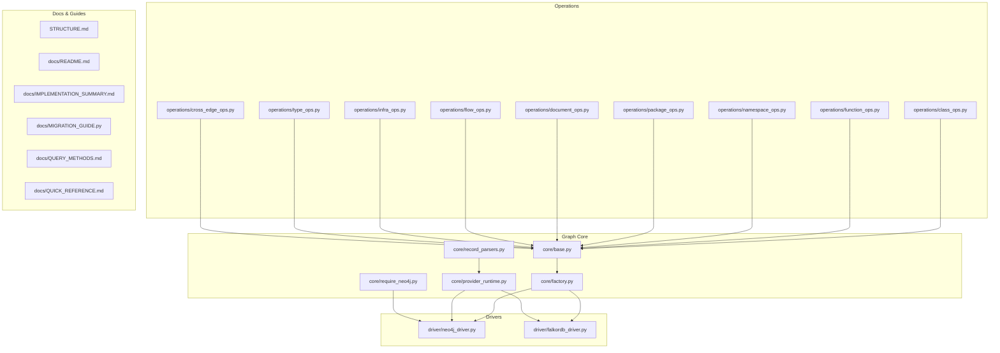
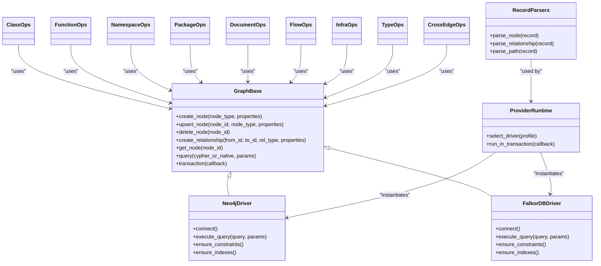
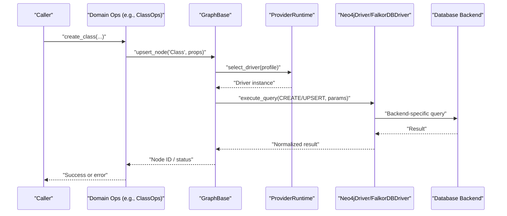
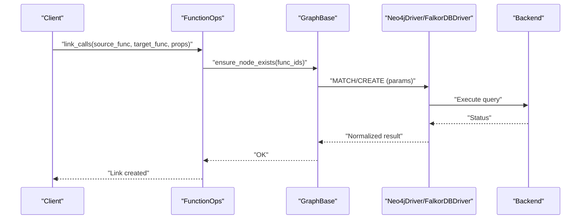
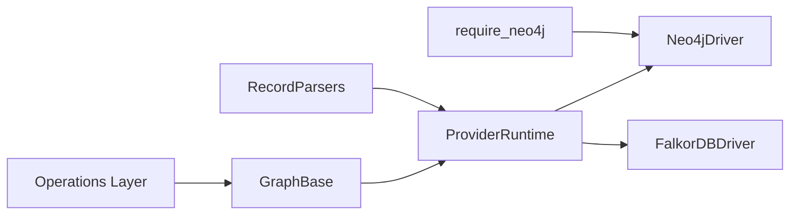

# Graph Database Layer & Schema

<cite>
**Referenced Files in This Document**
- [STRUCTURE.md](file://code-tiny/tools/graph/STRUCTURE.md)
- [README.md](file://code-tiny/tools/graph/docs/README.md)
- [IMPLEMENTATION_SUMMARY.md](file://code-tiny/tools/graph/docs/IMPLEMENTATION_SUMMARY.md)
- [MIGRATION_GUIDE.py](file://code-tiny/tools/graph/docs/MIGRATION_GUIDE.py)
- [QUERY_METHODS.md](file://code-tiny/tools/graph/docs/QUERY_METHODS.md)
- [QUICK_REFERENCE.md](file://code-tiny/tools/graph/docs/QUICK_REFERENCE.md)
- [__init__.py](file://code-tiny/tools/graph/__init__.py)
- [base.py](file://code-tiny/tools/graph/core/base.py)
- [factory.py](file://code-tiny/tools/graph/core/factory.py)
- [provider_runtime.py](file://code-tiny/tools/graph/core/provider_runtime.py)
- [record_parsers.py](file://code-tiny/tools/graph/core/record_parsers.py)
- [require_neo4j.py](file://code-tiny/tools/graph/core/require_neo4j.py)
- [neo4j_driver.py](file://code-tiny/tools/graph/driver/neo4j_driver.py)
- [falkordb_driver.py](file://code-tiny/tools/graph/driver/falkordb_driver.py)
- [class_ops.py](file://code-tiny/tools/graph/operations/class_ops.py)
- [function_ops.py](file://code-tiny/tools/graph/operations/function_ops.py)
- [namespace_ops.py](file://code-tiny/tools/graph/operations/namespace_ops.py)
- [package_ops.py](file://code-tiny/tools/graph/operations/package_ops.py)
- [document_ops.py](file://code-tiny/tools/graph/operations/document_ops.py)
- [flow_ops.py](file://code-tiny/tools/graph/operations/flow_ops.py)
- [infra_ops.py](file://code-tiny/tools/graph/operations/infra_ops.py)
- [type_ops.py](file://code-tiny/tools/graph/operations/type_ops.py)
- [cross_edge_ops.py](file://code-tiny/tools/graph/operations/cross_edge_ops.py)
- [setup_constraints.py](file://code-tiny/scripts/setup_constraints.py)
- [6_setup_indexes.py](file://doc-tiny/6_setup_indexes.py)
- [graph_store.py](file://doc-tiny/graph_store.py)
- [neo4j_loader.py](file://doc-tiny/neo4j_loader.py)
- [plan.md](file://plans/neo4j-to-falkordb-migration/plan.md)
</cite>

## Table of Contents
1. [Introduction](#introduction)
2. [Project Structure](#project-structure)
3. [Core Components](#core-components)
4. [Architecture Overview](#architecture-overview)
5. [Detailed Component Analysis](#detailed-component-analysis)
6. [Dependency Analysis](#dependency-analysis)
7. [Performance Considerations](#performance-considerations)
8. [Troubleshooting Guide](#troubleshooting-guide)
9. [Conclusion](#conclusion)
10. [Appendices](#appendices)

## Introduction
This document describes the graph database layer used to model code entities and their relationships across multiple programming languages and frameworks. It focuses on:
- Entity types (CodeNode): functions, classes, modules, files, namespaces, packages, documents, infrastructure nodes, and type nodes
- Relationship edges: imports, calls, extends, implements, containment, and cross-language links
- Metadata attributes: confidence scores, timestamps, sources, and other provenance fields
- Data access patterns via an abstracted driver interface with concrete implementations for Neo4j and FalkorDB
- Validation rules and business logic for graph operations
- Indexes, constraints, and schema considerations
- Caching strategies, performance characteristics, lifecycle management, backup procedures, and migration paths between backends

The goal is to provide a comprehensive reference for developers integrating with or extending the graph layer while ensuring consistency across backends.

## Project Structure
The graph layer is organized into core abstractions, driver implementations, domain-specific operations, and documentation/guides. The following diagram maps key directories and files to responsibilities.



**Diagram sources**
- [base.py](file://code-tiny/tools/graph/core/base.py)
- [factory.py](file://code-tiny/tools/graph/core/factory.py)
- [provider_runtime.py](file://code-tiny/tools/graph/core/provider_runtime.py)
- [record_parsers.py](file://code-tiny/tools/graph/core/record_parsers.py)
- [require_neo4j.py](file://code-tiny/tools/graph/core/require_neo4j.py)
- [neo4j_driver.py](file://code-tiny/tools/graph/driver/neo4j_driver.py)
- [falkordb_driver.py](file://code-tiny/tools/graph/driver/falkordb_driver.py)
- [class_ops.py](file://code-tiny/tools/graph/operations/class_ops.py)
- [function_ops.py](file://code-tiny/tools/graph/operations/function_ops.py)
- [namespace_ops.py](file://code-tiny/tools/graph/operations/namespace_ops.py)
- [package_ops.py](file://code-tiny/tools/graph/operations/package_ops.py)
- [document_ops.py](file://code-tiny/tools/graph/operations/document_ops.py)
- [flow_ops.py](file://code-tiny/tools/graph/operations/flow_ops.py)
- [infra_ops.py](file://code-tiny/tools/graph/operations/infra_ops.py)
- [type_ops.py](file://code-tiny/tools/graph/operations/type_ops.py)
- [cross_edge_ops.py](file://code-tiny/tools/graph/operations/cross_edge_ops.py)
- [STRUCTURE.md](file://code-tiny/tools/graph/STRUCTURE.md)
- [README.md](file://code-tiny/tools/graph/docs/README.md)
- [IMPLEMENTATION_SUMMARY.md](file://code-tiny/tools/graph/docs/IMPLEMENTATION_SUMMARY.md)
- [MIGRATION_GUIDE.py](file://code-tiny/tools/graph/docs/MIGRATION_GUIDE.py)
- [QUERY_METHODS.md](file://code-tiny/tools/graph/docs/QUERY_METHODS.md)
- [QUICK_REFERENCE.md](file://code-tiny/tools/graph/docs/QUICK_REFERENCE.md)

**Section sources**
- [STRUCTURE.md](file://code-tiny/tools/graph/STRUCTURE.md)
- [README.md](file://code-tiny/tools/graph/docs/README.md)

## Core Components
This section outlines the primary building blocks of the graph layer and how they interact.

- Abstract base and contracts
  - Base abstraction defines the common interface for node creation, relationship establishment, querying, and transactional semantics.
  - Record parsers normalize driver-specific results into consistent internal representations.
  - Provider runtime orchestrates driver selection and lifecycle.
  - Neo4j requirement helper enforces backend capabilities when needed.

- Driver implementations
  - Neo4j driver provides Cypher-based operations and leverages Neo4j-native features such as constraints and indexes.
  - FalkorDB driver adapts the same interface to FalkorDB’s API surface, handling differences in query language and feature availability.

- Domain operations
  - Class, function, namespace, package, document, flow, infrastructure, and type operations encapsulate high-level graph manipulations aligned with CodeNode types and relationship edges.
  - Cross-edge operations manage relationships that span different entity categories or languages.

- Documentation and guides
  - Implementation summary and quick reference summarize APIs and usage patterns.
  - Migration guide details steps to move from Neo4j to FalkorDB.

Key responsibilities and interactions are visualized below.



**Diagram sources**
- [base.py](file://code-tiny/tools/graph/core/base.py)
- [neo4j_driver.py](file://code-tiny/tools/graph/driver/neo4j_driver.py)
- [falkordb_driver.py](file://code-tiny/tools/graph/driver/falkordb_driver.py)
- [provider_runtime.py](file://code-tiny/tools/graph/core/provider_runtime.py)
- [record_parsers.py](file://code-tiny/tools/graph/core/record_parsers.py)
- [class_ops.py](file://code-tiny/tools/graph/operations/class_ops.py)
- [function_ops.py](file://code-tiny/tools/graph/operations/function_ops.py)
- [namespace_ops.py](file://code-tiny/tools/graph/operations/namespace_ops.py)
- [package_ops.py](file://code-tiny/tools/graph/operations/package_ops.py)
- [document_ops.py](file://code-tiny/tools/graph/operations/document_ops.py)
- [flow_ops.py](file://code-tiny/tools/graph/operations/flow_ops.py)
- [infra_ops.py](file://code-tiny/tools/graph/operations/infra_ops.py)
- [type_ops.py](file://code-tiny/tools/graph/operations/type_ops.py)
- [cross_edge_ops.py](file://code-tiny/tools/graph/operations/cross_edge_ops.py)

**Section sources**
- [IMPLEMENTATION_SUMMARY.md](file://code-tiny/tools/graph/docs/IMPLEMENTATION_SUMMARY.md)
- [QUICK_REFERENCE.md](file://code-tiny/tools/graph/docs/QUICK_REFERENCE.md)
- [QUERY_METHODS.md](file://code-tiny/tools/graph/docs/QUERY_METHODS.md)

## Architecture Overview
The architecture separates concerns between:
- Abstraction layer: defines the contract for graph operations
- Driver layer: implements backend-specific behavior (Neo4j, FalkorDB)
- Operations layer: encapsulates domain logic for CodeNode types and relationships
- Runtime layer: selects drivers and manages transactions



**Diagram sources**
- [provider_runtime.py](file://code-tiny/tools/graph/core/provider_runtime.py)
- [base.py](file://code-tiny/tools/graph/core/base.py)
- [neo4j_driver.py](file://code-tiny/tools/graph/driver/neo4j_driver.py)
- [falkordb_driver.py](file://code-tiny/tools/graph/driver/falkordb_driver.py)
- [class_ops.py](file://code-tiny/tools/graph/operations/class_ops.py)

## Detailed Component Analysis

### Data Model: Node Types and Relationships
The graph models code artifacts using standardized node types and typed relationships. While exact property sets vary per operation, the following summarizes the canonical model.

- Node types (CodeNode)
  - File: represents source files
  - Module: logical grouping of related code units
  - Namespace: scoping construct for identifiers
  - Package: distribution unit or module boundary
  - Class: object-oriented class definitions
  - Function: callable code units
  - Document: documentation or specification nodes
  - Infrastructure: external systems, services, or configuration nodes
  - Type: generic or primitive type descriptors

- Relationship edges
  - IMPORTS: dependency between modules/packages/files
  - CALLS: invocation relationships between functions/methods
  - EXTENDS: inheritance relationships between classes
  - IMPLEMENTS: interface implementation relationships
  - CONTAINS: hierarchical containment (e.g., file contains functions; module contains classes)
  - CROSS_*: cross-language or cross-boundary relationships managed by cross-edge operations

- Metadata attributes
  - confidence_score: numeric score indicating analysis certainty
  - timestamp: last updated time
  - source: origin artifact or analyzer producing the node/edge
  - additional provenance fields as required by operations

```mermaid
erDiagram
FILE ||--o{ MODULE : "contains"
MODULE ||--o{ NAMESPACE : "contains"
NAMESPACE ||--o{ CLASS : "contains"
NAMESPACE ||--o{ FUNCTION : "contains"
PACKAGE ||--o{ MODULE : "contains"
CLASS ||--o{ FUNCTION : "contains"
CLASS ||--o{ CLASS : "extends"
CLASS ||--o{ CLASS : "implements"
FILE ||--o{ FILE : "imports"
MODULE ||--o{ MODULE : "imports"
PACKAGE ||--o{ PACKAGE : "imports"
FUNCTION ||--o{ FUNCTION : "calls"
DOCUMENT ||--o{ CLASS : "documents"
INFRA ||--o{ PACKAGE : "depends_on"
TYPE ||--o{ CLASS : "typed_by"
```

[No sources needed since this diagram shows conceptual model]

### Primary Keys, Foreign Keys, Indexes, and Constraints
- Primary keys
  - Each node has a stable identifier (node_id). Uniqueness is enforced at the application level and backed by backend constraints where available.
- Foreign keys
  - Relationships implicitly enforce referential integrity through existence checks before edge creation.
- Indexes
  - Create indexes on frequently queried properties such as labels, names, and file paths to optimize lookups.
- Constraints
  - Enforce uniqueness on critical identifiers (e.g., node_id per label) to prevent duplicates.

Operational setup scripts:
- Constraint setup script initializes backend-specific constraints.
- Index setup script creates indexes for performance-critical fields.

**Section sources**
- [setup_constraints.py](file://code-tiny/scripts/setup_constraints.py)
- [6_setup_indexes.py](file://doc-tiny/6_setup_indexes.py)

### Data Validation Rules and Business Logic
Validation ensures data integrity and consistency during ingestion and updates:
- Property validation
  - Required fields: node_id, label, timestamp, source
  - Confidence scoring: normalized range and thresholding
- Relationship validation
  - Existence checks for endpoints before creating edges
  - Duplicate edge prevention
- Transactional semantics
  - Batch writes wrapped in transactions to maintain consistency
- Error handling
  - Standardized exceptions and retry policies for transient failures

Business logic highlights:
- Upsert strategy: create if absent, update metadata if present
- Incremental sync: only process changed files/modules
- Provenance tracking: record analyzer/source for each node/edge

**Section sources**
- [class_ops.py](file://code-tiny/tools/graph/operations/class_ops.py)
- [function_ops.py](file://code-tiny/tools/graph/operations/function_ops.py)
- [namespace_ops.py](file://code-tiny/tools/graph/operations/namespace_ops.py)
- [package_ops.py](file://code-tiny/tools/graph/operations/package_ops.py)
- [document_ops.py](file://code-tiny/tools/graph/operations/document_ops.py)
- [flow_ops.py](file://code-tiny/tools/graph/operations/flow_ops.py)
- [infra_ops.py](file://code-tiny/tools/graph/operations/infra_ops.py)
- [type_ops.py](file://code-tiny/tools/graph/operations/type_ops.py)
- [cross_edge_ops.py](file://code-tiny/tools/graph/operations/cross_edge_ops.py)

### Data Access Patterns Through the Abstracted Driver Interface
Access patterns include:
- Node upserts and deletes
- Relationship creation and deletion
- Query execution with parameterization
- Transactional batches for bulk operations



**Diagram sources**
- [function_ops.py](file://code-tiny/tools/graph/operations/function_ops.py)
- [base.py](file://code-tiny/tools/graph/core/base.py)
- [neo4j_driver.py](file://code-tiny/tools/graph/driver/neo4j_driver.py)
- [falkordb_driver.py](file://code-tiny/tools/graph/driver/falkordb_driver.py)

**Section sources**
- [QUERY_METHODS.md](file://code-tiny/tools/graph/docs/QUERY_METHODS.md)
- [QUICK_REFERENCE.md](file://code-tiny/tools/graph/docs/QUICK_REFERENCE.md)

### Caching Strategies for Frequently Accessed Nodes
Caching reduces repeated queries and improves latency:
- In-memory cache keyed by node_id and label
- TTL-based expiration for stale entries
- Cache invalidation on write operations
- Optional persistence-backed cache for shared processes

Implementation guidance:
- Cache reads before hitting the driver
- Invalidate on upsert/delete
- Use consistent serialization for cache values

[No sources needed since this section provides general guidance]

### Performance Considerations for Large Codebases
Optimization techniques:
- Indexing and constraints on hot paths (labels, names, paths)
- Batched writes within transactions
- Pagination and streaming for large traversals
- Avoiding unnecessary property expansion
- Using targeted MATCH clauses and WHERE filters
- Monitoring query plans and adjusting indexes accordingly

[No sources needed since this section provides general guidance]

### Data Lifecycle Management
Lifecycle stages:
- Ingestion: parse source artifacts, generate nodes/edges, validate, upsert
- Incremental updates: detect changes, re-ingest affected units
- Archival: mark obsolete nodes/edges without immediate deletion
- Cleanup: periodic removal of archived items based on retention policy

Operational flows:
- Change detection triggers incremental sync
- Transactions ensure atomicity
- Provenance fields track lineage

**Section sources**
- [flow_ops.py](file://code-tiny/tools/graph/operations/flow_ops.py)
- [infra_ops.py](file://code-tiny/tools/graph/operations/infra_ops.py)

### Backup Procedures
Recommended practices:
- Native backups for Neo4j (snapshots, continuous archiving)
- Export/import routines for FalkorDB-compatible snapshots
- Versioned dumps with metadata manifests
- Restore validation and checksum verification

[No sources needed since this section provides general guidance]

### Migration Paths Between Database Backends
Migration plan overview:
- Inventory compatibility and feature gaps
- Prepare FalkorDB driver and schema mapping
- Migrate constraints and indexes
- Convert Cypher to FalkorDB-native queries
- Validate data parity and performance
- Rollout with canary deployments

Steps:
- Run constraint/index setup for target backend
- Execute data migration scripts
- Validate queries and traversal results
- Monitor performance and adjust indexes

**Section sources**
- [MIGRATION_GUIDE.py](file://code-tiny/tools/graph/docs/MIGRATION_GUIDE.py)
- [plan.md](file://plans/neo4j-to-falkordb-migration/plan.md)

## Dependency Analysis
The graph layer exhibits clear separation between abstraction, drivers, and operations. Dependencies are primarily one-directional: operations depend on the base interface; drivers implement the interface; runtime selects drivers; parsers normalize results.



**Diagram sources**
- [base.py](file://code-tiny/tools/graph/core/base.py)
- [provider_runtime.py](file://code-tiny/tools/graph/core/provider_runtime.py)
- [neo4j_driver.py](file://code-tiny/tools/graph/driver/neo4j_driver.py)
- [falkordb_driver.py](file://code-tiny/tools/graph/driver/falkordb_driver.py)
- [record_parsers.py](file://code-tiny/tools/graph/core/record_parsers.py)
- [require_neo4j.py](file://code-tiny/tools/graph/core/require_neo4j.py)

**Section sources**
- [__init__.py](file://code-tiny/tools/graph/__init__.py)

## Performance Considerations
- Prefer batched transactions for bulk writes
- Ensure indexes exist for frequent filters (labels, names, paths)
- Limit property expansion in queries
- Use pagination for deep traversals
- Profile and tune queries per backend
- Leverage caching for hot paths

[No sources needed since this section provides general guidance]

## Troubleshooting Guide
Common issues and resolutions:
- Missing constraints or indexes leading to slow queries
  - Re-run constraint and index setup scripts
- Driver connection errors
  - Verify credentials and network reachability
  - Check backend capability requirements
- Duplicate nodes or edges
  - Validate upsert logic and uniqueness constraints
- Query incompatibility across backends
  - Use abstraction layer; avoid direct backend-specific calls
- Stale cache entries
  - Invalidate cache on writes; reduce TTL if necessary

**Section sources**
- [setup_constraints.py](file://code-tiny/scripts/setup_constraints.py)
- [6_setup_indexes.py](file://doc-tiny/6_setup_indexes.py)
- [neo4j_loader.py](file://doc-tiny/neo4j_loader.py)
- [graph_store.py](file://doc-tiny/graph_store.py)

## Conclusion
The graph database layer provides a robust, backend-abstracted foundation for modeling code artifacts and relationships. By standardizing node types, relationship edges, and metadata, it enables consistent analytics and tooling across diverse languages and frameworks. With careful attention to indexing, transactions, caching, and migrations, the system scales effectively to large codebases while maintaining data integrity and performance.

## Appendices

### Appendix A: Operational Scripts and Utilities
- Constraint setup: initialize backend-specific constraints
- Index setup: create performance-critical indexes
- Loader utilities: assist with ingestion and validation workflows

**Section sources**
- [setup_constraints.py](file://code-tiny/scripts/setup_constraints.py)
- [6_setup_indexes.py](file://doc-tiny/6_setup_indexes.py)
- [neo4j_loader.py](file://doc-tiny/neo4j_loader.py)
- [graph_store.py](file://doc-tiny/graph_store.py)

### Appendix B: Documentation References
- Implementation summary and quick reference for API usage
- Query methods guide for advanced operations
- Migration guide for moving between backends

**Section sources**
- [IMPLEMENTATION_SUMMARY.md](file://code-tiny/tools/graph/docs/IMPLEMENTATION_SUMMARY.md)
- [QUICK_REFERENCE.md](file://code-tiny/tools/graph/docs/QUICK_REFERENCE.md)
- [QUERY_METHODS.md](file://code-tiny/tools/graph/docs/QUERY_METHODS.md)
- [MIGRATION_GUIDE.py](file://code-tiny/tools/graph/docs/MIGRATION_GUIDE.py)