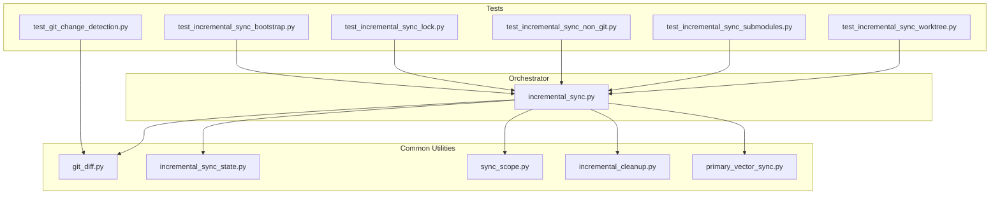
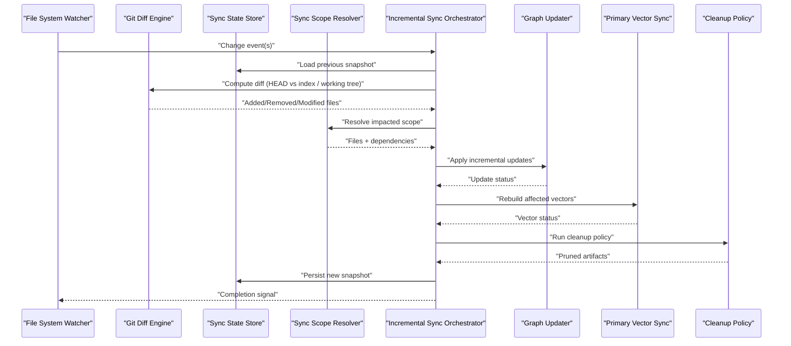
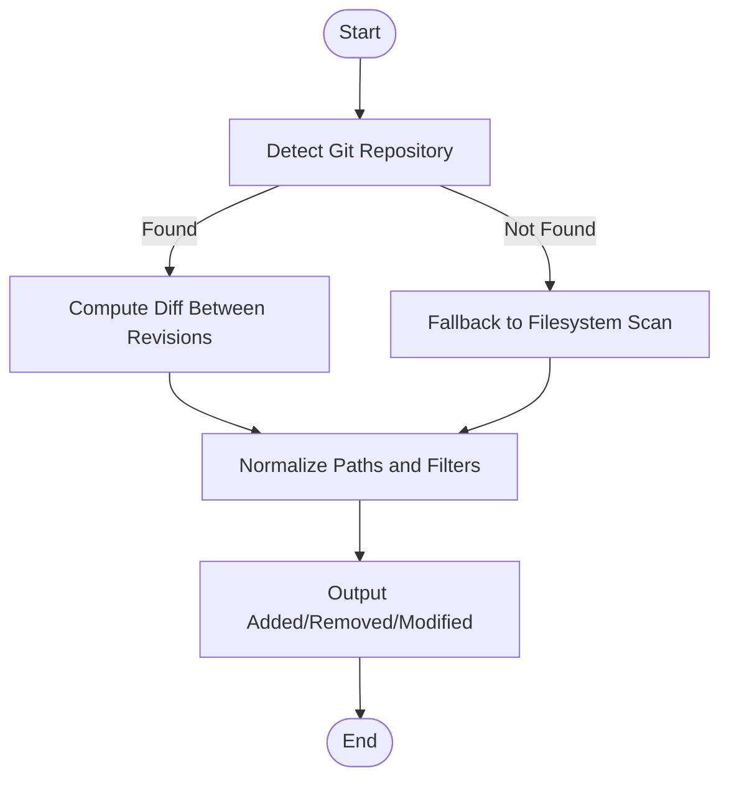
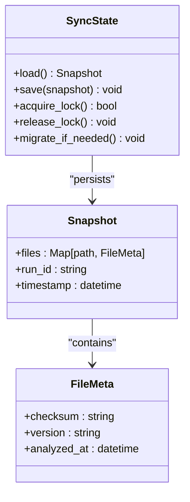
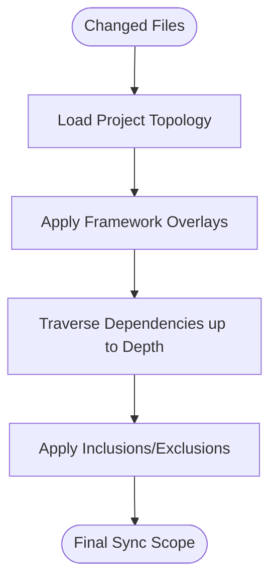
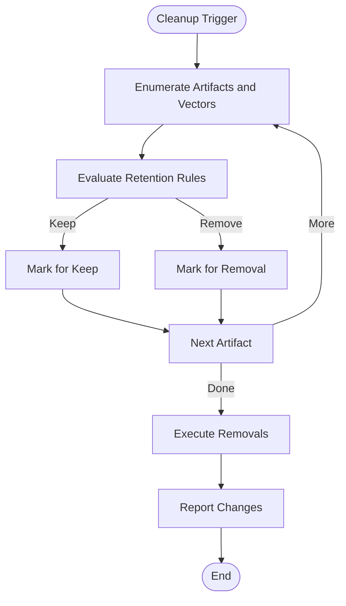
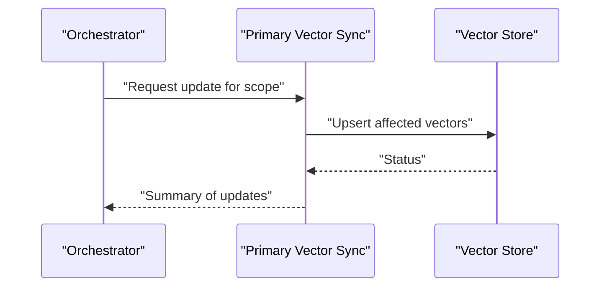
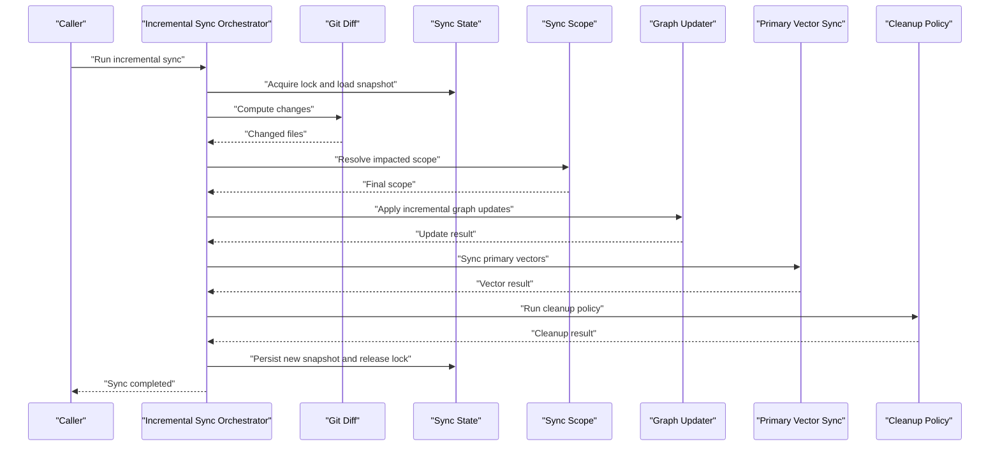
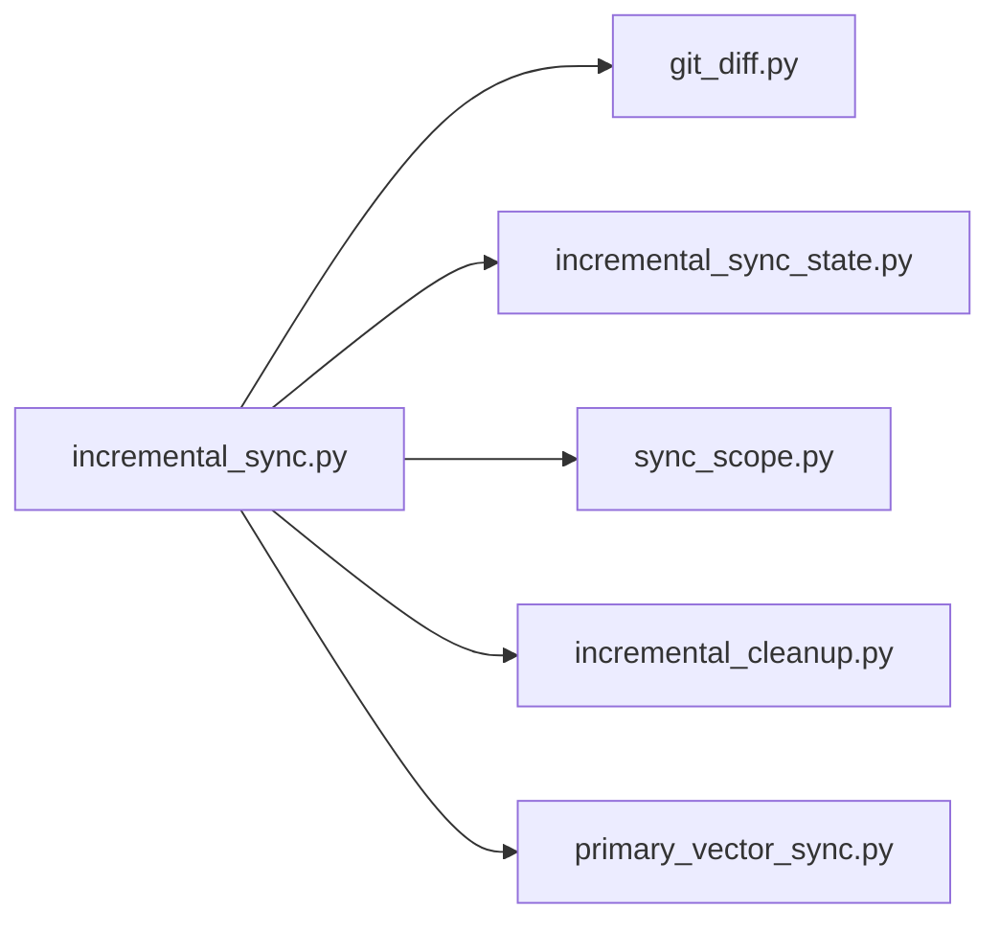

# Incremental Analysis & Change Detection

<cite>
**Referenced Files in This Document**
- [git_diff.py](file://code-tiny/tools/common/git_diff.py)
- [incremental_sync_state.py](file://code-tiny/tools/common/incremental_sync_state.py)
- [sync_scope.py](file://code-tiny/tools/common/sync_scope.py)
- [incremental_cleanup.py](file://code-tiny/tools/common/incremental_cleanup.py)
- [primary_vector_sync.py](file://code-tiny/tools/common/primary_vector_sync.py)
- [incremental_sync.py](file://code-tiny/tools/sync/incremental_sync.py)
- [test_git_change_detection.py](file://tests/test_git_change_detection.py)
- [test_incremental_sync_bootstrap.py](file://tests/test_incremental_sync_bootstrap.py)
- [test_incremental_sync_lock.py](file://tests/test_incremental_sync_lock.py)
- [test_incremental_sync_non_git.py](file://tests/test_incremental_sync_non_git.py)
- [test_incremental_sync_submodules.py](file://tests/test_incremental_sync_submodules.py)
- [test_incremental_sync_worktree.py](file://tests/test_incremental_sync_worktree.py)
</cite>

## Table of Contents
1. [Introduction](#introduction)
2. [Project Structure](#project-structure)
3. [Core Components](#core-components)
4. [Architecture Overview](#architecture-overview)
5. [Detailed Component Analysis](#detailed-component-analysis)
6. [Dependency Analysis](#dependency-analysis)
7. [Performance Considerations](#performance-considerations)
8. [Troubleshooting Guide](#troubleshooting-guide)
9. [Conclusion](#conclusion)

## Introduction
This document explains the incremental analysis engine with a focus on change detection, state management, and scope-based synchronization. It covers how Git diff analysis drives efficient updates, how modified files are tracked across runs, and how sync scopes determine analysis boundaries and dependency impact. It also documents configuration options for sensitivity and cleanup policies, performance optimization techniques, integration points with the file system watcher and Git repository, and graph update mechanisms. Finally, it provides guidance on resolving common issues such as inaccurate change detection, conflict resolution, and recovery from partial failures.

## Project Structure
The incremental analysis features are implemented primarily under:
- Common utilities for change detection, state, scope, cleanup, and vector sync
- A higher-level orchestrator for incremental synchronization
- Tests that validate behavior across Git and non-Git scenarios, submodules, worktrees, and locking

**Diagram sources**
- [git_diff.py](file://code-tiny/tools/common/git_diff.py)
- [incremental_sync_state.py](file://code-tiny/tools/common/incremental_sync_state.py)
- [sync_scope.py](file://code-tiny/tools/common/sync_scope.py)
- [incremental_cleanup.py](file://code-tiny/tools/common/incremental_cleanup.py)
- [primary_vector_sync.py](file://code-tiny/tools/common/primary_vector_sync.py)
- [incremental_sync.py](file://code-tiny/tools/sync/incremental_sync.py)
- [test_git_change_detection.py](file://tests/test_git_change_detection.py)
- [test_incremental_sync_bootstrap.py](file://tests/test_incremental_sync_bootstrap.py)
- [test_incremental_sync_lock.py](file://tests/test_incremental_sync_lock.py)
- [test_incremental_sync_non_git.py](file://tests/test_incremental_sync_non_git.py)
- [test_incremental_sync_submodules.py](file://tests/test_incremental_sync_submodules.py)
- [test_incremental_sync_worktree.py](file://tests/test_incremental_sync_worktree.py)

**Section sources**
- [git_diff.py](file://code-tiny/tools/common/git_diff.py)
- [incremental_sync_state.py](file://code-tiny/tools/common/incremental_sync_state.py)
- [sync_scope.py](file://code-tiny/tools/common/sync_scope.py)
- [incremental_cleanup.py](file://code-tiny/tools/common/incremental_cleanup.py)
- [primary_vector_sync.py](file://code-tiny/tools/common/primary_vector_sync.py)
- [incremental_sync.py](file://code-tiny/tools/sync/incremental_sync.py)
- [test_git_change_detection.py](file://tests/test_git_change_detection.py)
- [test_incremental_sync_bootstrap.py](file://tests/test_incremental_sync_bootstrap.py)
- [test_incremental_sync_lock.py](file://tests/test_incremental_sync_lock.py)
- [test_incremental_sync_non_git.py](file://tests/test_incremental_sync_non_git.py)
- [test_incremental_sync_submodules.py](file://tests/test_incremental_sync_submodules.py)
- [test_incremental_sync_worktree.py](file://tests/test_incremental_sync_worktree.py)

## Core Components
- Change detection via Git diff: Computes added, removed, and modified files between revisions or working tree vs index to drive targeted reanalysis.
- Sync state persistence: Tracks previously analyzed snapshots and metadata to avoid redundant work and support resumption after interruptions.
- Sync scope computation: Determines the minimal set of files and modules impacted by changes using dependency graphs and project topology.
- Cleanup policy: Prunes stale artifacts and outdated vectors based on retention rules and staleness thresholds.
- Primary vector sync: Updates embeddings and indexes only for affected primary entities to keep retrieval accurate and performant.
- Orchestrator: Coordinates change detection, scope expansion, incremental analysis, graph updates, and cleanup in a resilient pipeline.

**Section sources**
- [git_diff.py](file://code-tiny/tools/common/git_diff.py)
- [incremental_sync_state.py](file://code-tiny/tools/common/incremental_sync_state.py)
- [sync_scope.py](file://code-tiny/tools/common/sync_scope.py)
- [incremental_cleanup.py](file://code-tiny/tools/common/incremental_cleanup.py)
- [primary_vector_sync.py](file://code-tiny/tools/common/primary_vector_sync.py)
- [incremental_sync.py](file://code-tiny/tools/sync/incremental_sync.py)

## Architecture Overview
The incremental analysis pipeline integrates Git history, local state, and dependency-aware scoping to minimize rework while keeping the code graph and search indices consistent.

**Diagram sources**
- [git_diff.py](file://code-tiny/tools/common/git_diff.py)
- [incremental_sync_state.py](file://code-tiny/tools/common/incremental_sync_state.py)
- [sync_scope.py](file://code-tiny/tools/common/sync_scope.py)
- [incremental_cleanup.py](file://code-tiny/tools/common/incremental_cleanup.py)
- [primary_vector_sync.py](file://code-tiny/tools/common/primary_vector_sync.py)
- [incremental_sync.py](file://code-tiny/tools/sync/incremental_sync.py)

## Detailed Component Analysis

### Change Detection Strategy (Git Diff)
- Purpose: Identify precise sets of changed files to limit reanalysis to relevant parts of the codebase.
- Inputs: Current revision, target revision or working tree, optional filters (paths, patterns).
- Outputs: Lists of added, removed, and modified paths; optionally unified diffs for context.
- Sensitivity controls:
  - Include renames and copies if supported by the underlying diff tooling.
  - Respect ignore patterns and submodule boundaries.
  - Thresholds for binary vs text handling and large-file skipping.
- Non-Git fallback: When no repository is present, fall back to filesystem timestamps and content hashes to detect changes.

**Diagram sources**
- [git_diff.py](file://code-tiny/tools/common/git_diff.py)
- [test_git_change_detection.py](file://tests/test_git_change_detection.py)
- [test_incremental_sync_non_git.py](file://tests/test_incremental_sync_non_git.py)

**Section sources**
- [git_diff.py](file://code-tiny/tools/common/git_diff.py)
- [test_git_change_detection.py](file://tests/test_git_change_detection.py)
- [test_incremental_sync_non_git.py](file://tests/test_incremental_sync_non_git.py)

### State Management for Modified Files
- Purpose: Persist and load the last known good snapshot of analyzed files and metadata to resume safely and avoid redundant work.
- Responsibilities:
  - Track file versions, checksums, and analysis timestamps.
  - Maintain run identifiers and lock information for concurrency control.
  - Support migration when schema evolves.
- Concurrency:
  - Use locks to prevent concurrent writers from corrupting state.
  - Handle lock acquisition failures gracefully with retries or fallback strategies.
- Resilience:
  - On partial failure, use persisted state to resume from the last successful checkpoint.

**Diagram sources**
- [incremental_sync_state.py](file://code-tiny/tools/common/incremental_sync_state.py)
- [test_incremental_sync_lock.py](file://tests/test_incremental_sync_lock.py)
- [test_incremental_sync_bootstrap.py](file://tests/test_incremental_sync_bootstrap.py)

**Section sources**
- [incremental_sync_state.py](file://code-tiny/tools/common/incremental_sync_state.py)
- [test_incremental_sync_lock.py](file://tests/test_incremental_sync_lock.py)
- [test_incremental_sync_bootstrap.py](file://tests/test_incremental_sync_bootstrap.py)

### Sync Scope System (Analysis Boundaries and Dependency Impact)
- Purpose: Expand the initial set of changed files into a minimal but complete set of files and modules that may be impacted.
- Inputs: Changed files list, project topology, dependency graph, framework overlays.
- Outputs: Final scope including direct changes and transitive dependencies within configured depth.
- Features:
  - Submodule awareness: Treat submodules as separate scopes with their own boundaries.
  - Worktree support: Resolve correct roots and ignore unrelated branches.
  - Framework overlays: Apply language-specific impact heuristics (e.g., imports, manifests).
- Configuration:
  - Depth limits for dependency traversal.
  - Exclusions and inclusions by path patterns.
  - Per-language or per-framework overrides.

**Diagram sources**
- [sync_scope.py](file://code-tiny/tools/common/sync_scope.py)
- [test_incremental_sync_submodules.py](file://tests/test_incremental_sync_submodules.py)
- [test_incremental_sync_worktree.py](file://tests/test_incremental_sync_worktree.py)

**Section sources**
- [sync_scope.py](file://code-tiny/tools/common/sync_scope.py)
- [test_incremental_sync_submodules.py](file://tests/test_incremental_sync_submodules.py)
- [test_incremental_sync_worktree.py](file://tests/test_incremental_sync_worktree.py)

### Cleanup Policy for Stale Data
- Purpose: Remove outdated artifacts, orphaned nodes, and unused vectors to maintain storage efficiency and query accuracy.
- Policies:
  - Time-based retention windows for temporary artifacts.
  - Reference-count pruning for nodes without incoming edges.
  - Vector garbage collection for entities outside current scope.
- Triggers:
  - Post-sync cleanup after successful updates.
  - Scheduled maintenance jobs.
- Safety:
  - Dry-run mode for auditing before deletion.
  - Rollback-friendly operations where possible.

**Diagram sources**
- [incremental_cleanup.py](file://code-tiny/tools/common/incremental_cleanup.py)

**Section sources**
- [incremental_cleanup.py](file://code-tiny/tools/common/incremental_cleanup.py)

### Primary Vector Sync
- Purpose: Update embeddings and indexes for primary entities impacted by changes to keep semantic search accurate.
- Behavior:
  - Batch updates for affected entities.
  - Idempotent writes to handle retries.
  - Consistency checks against source-of-truth graph nodes.
- Integration:
  - Coordinated with graph updates to ensure vectors reflect latest semantics.
  - Backoff and retry on transient errors.

**Diagram sources**
- [primary_vector_sync.py](file://code-tiny/tools/common/primary_vector_sync.py)

**Section sources**
- [primary_vector_sync.py](file://code-tiny/tools/common/primary_vector_sync.py)

### Orchestrator: Incremental Sync Pipeline
- Purpose: Coordinate all stages—change detection, scope resolution, graph updates, vector sync, cleanup, and state persistence—into a reliable workflow.
- Key responsibilities:
  - Acquire locks and manage concurrency.
  - Run change detection and compute sync scope.
  - Invoke analyzers and writers for affected files.
  - Update graph and vectors incrementally.
  - Persist final state and release locks.
- Error handling:
  - Partial failure recovery using checkpoints.
  - Graceful degradation when Git is unavailable.
  - Retry policies for external services.

**Diagram sources**
- [incremental_sync.py](file://code-tiny/tools/sync/incremental_sync.py)
- [git_diff.py](file://code-tiny/tools/common/git_diff.py)
- [incremental_sync_state.py](file://code-tiny/tools/common/incremental_sync_state.py)
- [sync_scope.py](file://code-tiny/tools/common/sync_scope.py)
- [primary_vector_sync.py](file://code-tiny/tools/common/primary_vector_sync.py)
- [incremental_cleanup.py](file://code-tiny/tools/common/incremental_cleanup.py)

**Section sources**
- [incremental_sync.py](file://code-tiny/tools/sync/incremental_sync.py)
- [test_incremental_sync_bootstrap.py](file://tests/test_incremental_sync_bootstrap.py)
- [test_incremental_sync_lock.py](file://tests/test_incremental_sync_lock.py)
- [test_incremental_sync_non_git.py](file://tests/test_incremental_sync_non_git.py)
- [test_incremental_sync_submodules.py](file://tests/test_incremental_sync_submodules.py)
- [test_incremental_sync_worktree.py](file://tests/test_incremental_sync_worktree.py)

## Dependency Analysis
The orchestrator depends on several core utilities. The diagram below shows import-time relationships and runtime interactions.

**Diagram sources**
- [incremental_sync.py](file://code-tiny/tools/sync/incremental_sync.py)
- [git_diff.py](file://code-tiny/tools/common/git_diff.py)
- [incremental_sync_state.py](file://code-tiny/tools/common/incremental_sync_state.py)
- [sync_scope.py](file://code-tiny/tools/common/sync_scope.py)
- [incremental_cleanup.py](file://code-tiny/tools/common/incremental_cleanup.py)
- [primary_vector_sync.py](file://code-tiny/tools/common/primary_vector_sync.py)

**Section sources**
- [incremental_sync.py](file://code-tiny/tools/sync/incremental_sync.py)
- [git_diff.py](file://code-tiny/tools/common/git_diff.py)
- [incremental_sync_state.py](file://code-tiny/tools/common/incremental_sync_state.py)
- [sync_scope.py](file://code-tiny/tools/common/sync_scope.py)
- [incremental_cleanup.py](file://code-tiny/tools/common/incremental_cleanup.py)
- [primary_vector_sync.py](file://code-tiny/tools/common/primary_vector_sync.py)

## Performance Considerations
- Minimize diff scope:
  - Use precise path filters and ignore patterns to reduce diff size.
  - Prefer narrow revision ranges (e.g., branch tip vs base) over full history scans.
- Limit dependency traversal depth:
  - Configure depth caps to avoid explosion in large monorepos.
- Batch operations:
  - Group graph and vector updates to reduce round trips.
- Caching and idempotency:
  - Leverage checksums and version markers to skip unchanged files.
  - Ensure vector upserts are idempotent to allow safe retries.
- Concurrency control:
  - Use locks to serialize conflicting writes and prevent inconsistent states.
- Monitoring and observability:
  - Log scope sizes, number of updated nodes/vectors, and durations to identify bottlenecks.

[No sources needed since this section provides general guidance]

## Troubleshooting Guide
- Change detection inaccuracies:
  - Verify Git repository root and active branch/worktree.
  - Check ignore patterns and submodule configurations.
  - Validate that the diff engine is invoked with expected revision pairs.
- Conflict resolution:
  - If multiple processes attempt sync concurrently, ensure lock acquisition succeeds and conflicts are retried or aborted.
  - Inspect lock state and clear stale locks if necessary.
- Recovery from partial failures:
  - Use persisted snapshots to resume from the last successful checkpoint.
  - Re-run cleanup to remove partially written artifacts.
- Non-Git environments:
  - Confirm fallback scan logic detects changes via timestamps/hashes.
  - Validate that scope resolution still works without Git topology.
- Submodules and worktrees:
  - Ensure submodule roots are correctly discovered and isolated.
  - Confirm worktree paths resolve to the intended repository instance.

**Section sources**
- [test_git_change_detection.py](file://tests/test_git_change_detection.py)
- [test_incremental_sync_lock.py](file://tests/test_incremental_sync_lock.py)
- [test_incremental_sync_non_git.py](file://tests/test_incremental_sync_non_git.py)
- [test_incremental_sync_submodules.py](file://tests/test_incremental_sync_submodules.py)
- [test_incremental_sync_worktree.py](file://tests/test_incremental_sync_worktree.py)

## Conclusion
The incremental analysis engine combines Git-driven change detection, robust state management, and dependency-aware scoping to deliver fast, accurate updates to the code graph and search indices. By configuring sensitivity, applying cleanup policies, and leveraging batching and idempotency, teams can achieve high performance even in large, complex repositories. The orchestrator ties together these components with resilience and observability, enabling reliable operation across diverse environments including Git, submodules, worktrees, and non-Git setups.