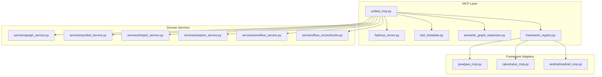
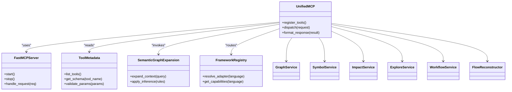
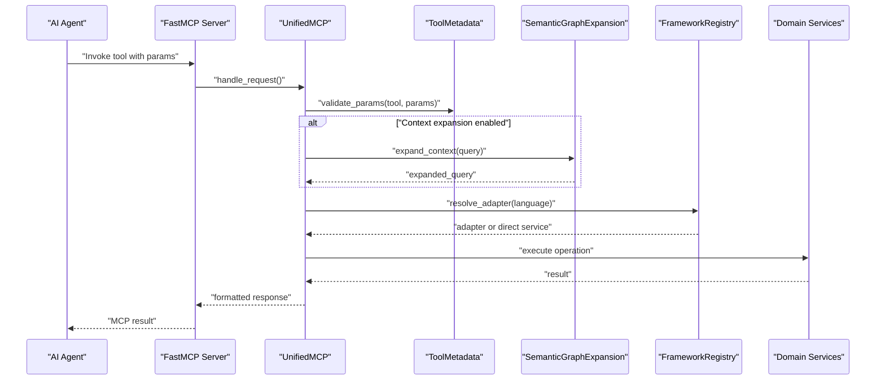
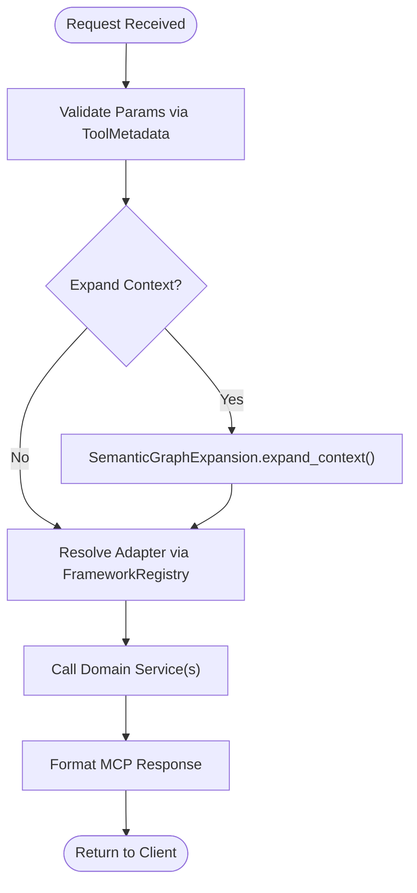
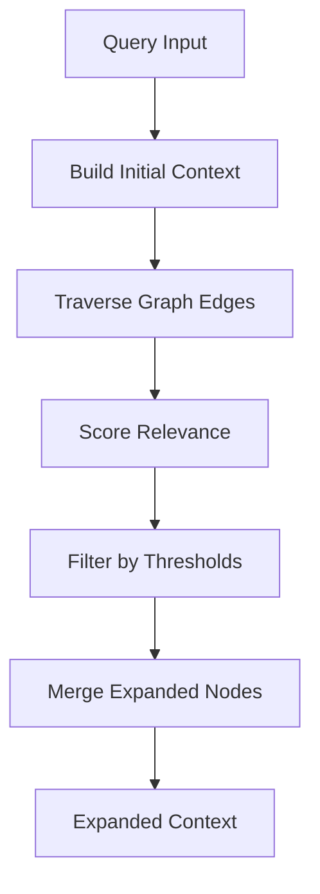
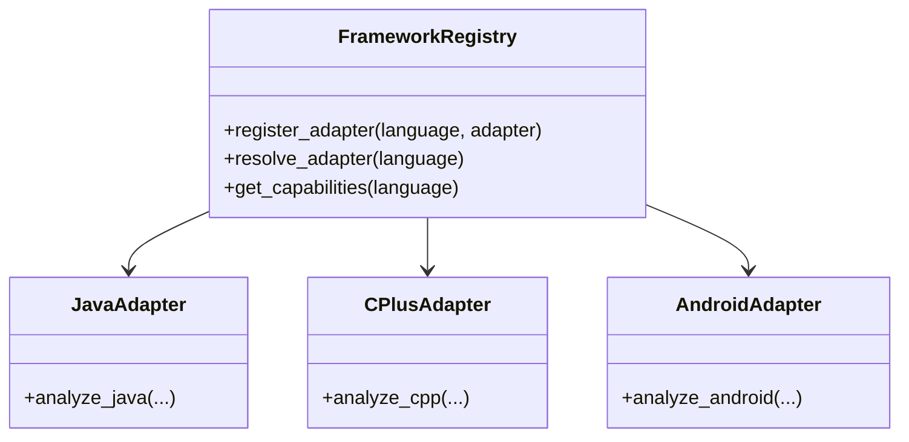
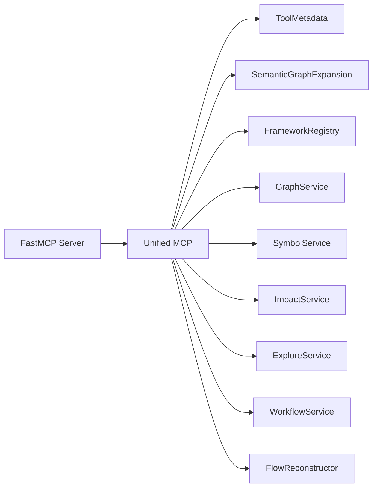
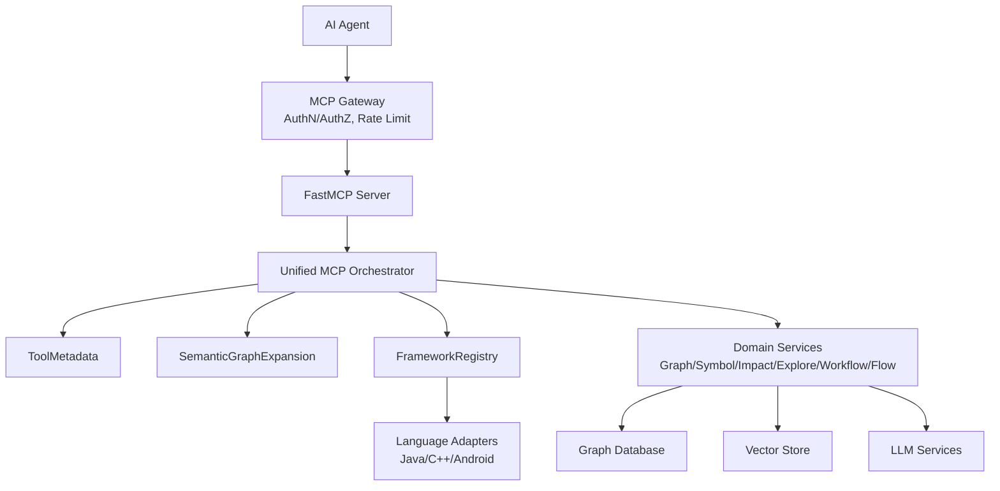

# MCP Integration & AI Services

<cite>
**Referenced Files in This Document**
- [unified_mcp.py](file://code-tiny/mcp/unified_mcp.py)
- [fastmcp_server.py](file://code-tiny/mcp/fastmcp_server.py)
- [tool_metadata.py](file://code-tiny/mcp/tool_metadata.py)
- [semantic_graph_expansion.py](file://code-tiny/mcp/semantic_graph_expansion.py)
- [framework_registry.py](file://code-tiny/mcp/framework_registry.py)
- [graph_service.py](file://code-tiny/mcp/services/graph_service.py)
- [symbol_service.py](file://code-tiny/mcp/services/symbol_service.py)
- [impact_service.py](file://code-tiny/mcp/services/impact_service.py)
- [explore_service.py](file://code-tiny/mcp/services/explore_service.py)
- [workflow_service.py](file://code-tiny/mcp/services/workflow_service.py)
- [flow_reconstructor.py](file://code-tiny/mcp/services/flow_reconstructor.py)
- [java_mcp.py](file://code-tiny/mcp/java/java_mcp.py)
- [cplus_mcp.py](file://code-tiny/mcp/cplus/cplus_mcp.py)
- [android_mcp.py](file://code-tiny/mcp/android/android_mcp.py)
- [mcp.md](file://docs/specs/mcp.md)
- [MCP_CAPABILITY_ACCEPTANCE_MATRIX.md](file://docs/MCP_CAPABILITY_ACCEPTANCE_MATRIX.md)
- [test_unified_mcp_wrapper_signatures.py](file://tests/test_unified_mcp_wrapper_signatures.py)
- [test_unified_mcp_input_coercion.py](file://tests/test_unified_mcp_input_coercion.py)
- [test_semantic_graph_expansion.py](file://tests/test_semantic_graph_expansion.py)
- [test_framework_mcp_routing.py](file://tests/test_framework_mcp_routing.py)
- [test_cobol_mcp_routing.py](file://tests/test_cobol_mcp_routing.py)
- [test_mcp_http_resilience.py](file://tests/test_mcp_http_resilience.py)
- [test_mcp_acceptance_matrix.py](file://tests/test_mcp_acceptance_matrix.py)
- [requirements.txt](file://requirements.txt)
</cite>

## Table of Contents
1. [Introduction](#introduction)
2. [Project Structure](#project-structure)
3. [Core Components](#core-components)
4. [Architecture Overview](#architecture-overview)
5. [Detailed Component Analysis](#detailed-component-analysis)
6. [Dependency Analysis](#dependency-analysis)
7. [Performance Considerations](#performance-considerations)
8. [Security and Access Control](#security-and-access-control)
9. [Infrastructure Requirements](#infrastructure-requirements)
10. [Troubleshooting Guide](#troubleshooting-guide)
11. [Conclusion](#conclusion)
12. [Appendices](#appendices)

## Introduction
This document describes the Model Context Protocol (MCP) integration layer that exposes code analysis capabilities to AI agents through a unified server. It explains the protocol abstraction, tool metadata management, semantic graph expansion, capability routing across language frameworks, and interactions with underlying analyzer services. It also covers infrastructure requirements for LLM and semantic search components, request flows from agents to analysis backends, security considerations, authentication methods, rate limiting strategies, and the technology stack centered on FastMCP.

## Project Structure
The MCP integration is implemented under code-tiny/mcp with:
- A unified MCP server entrypoint and FastMCP bootstrap
- Tool metadata registry and semantic graph expansion utilities
- Capability routing and framework-specific adapters
- Domain services for graph, symbol, impact, explore, workflow, and flow reconstruction
- Language-specific MCP modules for Java, C++, and Android ecosystems

**Diagram sources**
- [unified_mcp.py](file://code-tiny/mcp/unified_mcp.py)
- [fastmcp_server.py](file://code-tiny/mcp/fastmcp_server.py)
- [tool_metadata.py](file://code-tiny/mcp/tool_metadata.py)
- [semantic_graph_expansion.py](file://code-tiny/mcp/semantic_graph_expansion.py)
- [framework_registry.py](file://code-tiny/mcp/framework_registry.py)
- [graph_service.py](file://code-tiny/mcp/services/graph_service.py)
- [symbol_service.py](file://code-tiny/mcp/services/symbol_service.py)
- [impact_service.py](file://code-tiny/mcp/services/impact_service.py)
- [explore_service.py](file://code-tiny/mcp/services/explore_service.py)
- [workflow_service.py](file://code-tiny/mcp/services/workflow_service.py)
- [flow_reconstructor.py](file://code-tiny/mcp/services/flow_reconstructor.py)
- [java_mcp.py](file://code-tiny/mcp/java/java_mcp.py)
- [cplus_mcp.py](file://code-tiny/mcp/cplus/cplus_mcp.py)
- [android_mcp.py](file://code-tiny/mcp/android/android_mcp.py)

**Section sources**
- [unified_mcp.py](file://code-tiny/mcp/unified_mcp.py)
- [fastmcp_server.py](file://code-tiny/mcp/fastmcp_server.py)
- [tool_metadata.py](file://code-tiny/mcp/tool_metadata.py)
- [semantic_graph_expansion.py](file://code-tiny/mcp/semantic_graph_expansion.py)
- [framework_registry.py](file://code-tiny/mcp/framework_registry.py)
- [graph_service.py](file://code-tiny/mcp/services/graph_service.py)
- [symbol_service.py](file://code-tiny/mcp/services/symbol_service.py)
- [impact_service.py](file://code-tiny/mcp/services/impact_service.py)
- [explore_service.py](file://code-tiny/mcp/services/explore_service.py)
- [workflow_service.py](file://code-tiny/mcp/services/workflow_service.py)
- [flow_reconstructor.py](file://code-tiny/mcp/services/flow_reconstructor.py)
- [java_mcp.py](file://code-tiny/mcp/java/java_mcp.py)
- [cplus_mcp.py](file://code-tiny/mcp/cplus/cplus_mcp.py)
- [android_mcp.py](file://code-tiny/mcp/android/android_mcp.py)

## Core Components
- Unified MCP Server: Orchestrates tool registration, request dispatch, and response formatting over MCP. It integrates with FastMCP for transport and lifecycle management.
- Tool Metadata Management: Centralizes tool definitions, parameter schemas, descriptions, and capability tags used by the MCP server to expose consistent interfaces to clients.
- Semantic Graph Expansion: Provides algorithms to expand query context using graph traversal, semantic inference, and cross-language relationships to enrich results returned via MCP tools.
- Framework Registry and Routing: Maps incoming requests to appropriate framework-specific adapters (Java, C++, Android), enabling multi-language support behind a single MCP surface.
- Domain Services: Encapsulate core analysis operations such as graph queries, symbol lookups, impact analysis, exploration, workflow tracing, and flow reconstruction.

Key responsibilities and interactions are illustrated below.

**Diagram sources**
- [unified_mcp.py](file://code-tiny/mcp/unified_mcp.py)
- [fastmcp_server.py](file://code-tiny/mcp/fastmcp_server.py)
- [tool_metadata.py](file://code-tiny/mcp/tool_metadata.py)
- [semantic_graph_expansion.py](file://code-tiny/mcp/semantic_graph_expansion.py)
- [framework_registry.py](file://code-tiny/mcp/framework_registry.py)
- [graph_service.py](file://code-tiny/mcp/services/graph_service.py)
- [symbol_service.py](file://code-tiny/mcp/services/symbol_service.py)
- [impact_service.py](file://code-tiny/mcp/services/impact_service.py)
- [explore_service.py](file://code-tiny/mcp/services/explore_service.py)
- [workflow_service.py](file://code-tiny/mcp/services/workflow_service.py)
- [flow_reconstructor.py](file://code-tiny/mcp/services/flow_reconstructor.py)

**Section sources**
- [unified_mcp.py](file://code-tiny/mcp/unified_mcp.py)
- [tool_metadata.py](file://code-tiny/mcp/tool_metadata.py)
- [semantic_graph_expansion.py](file://code-tiny/mcp/semantic_graph_expansion.py)
- [framework_registry.py](file://code-tiny/mcp/framework_registry.py)
- [graph_service.py](file://code-tiny/mcp/services/graph_service.py)
- [symbol_service.py](file://code-tiny/mcp/services/symbol_service.py)
- [impact_service.py](file://code-tiny/mcp/services/impact_service.py)
- [explore_service.py](file://code-tiny/mcp/services/explore_service.py)
- [workflow_service.py](file://code-tiny/mcp/services/workflow_service.py)
- [flow_reconstructor.py](file://code-tiny/mcp/services/flow_reconstructor.py)

## Architecture Overview
The MCP integration provides a single protocol boundary for AI agents to discover and invoke code analysis tools. Requests enter via the FastMCP server, pass through the unified MCP orchestrator, which validates inputs against tool metadata, optionally expands context using semantic graph expansion, routes to framework-specific adapters when needed, and delegates to domain services for execution. Responses are serialized back to MCP format.

**Diagram sources**
- [fastmcp_server.py](file://code-tiny/mcp/fastmcp_server.py)
- [unified_mcp.py](file://code-tiny/mcp/unified_mcp.py)
- [tool_metadata.py](file://code-tiny/mcp/tool_metadata.py)
- [semantic_graph_expansion.py](file://code-tiny/mcp/semantic_graph_expansion.py)
- [framework_registry.py](file://code-tiny/mcp/framework_registry.py)
- [graph_service.py](file://code-tiny/mcp/services/graph_service.py)
- [symbol_service.py](file://code-tiny/mcp/services/symbol_service.py)
- [impact_service.py](file://code-tiny/mcp/services/impact_service.py)
- [explore_service.py](file://code-tiny/mcp/services/explore_service.py)
- [workflow_service.py](file://code-tiny/mcp/services/workflow_service.py)
- [flow_reconstructor.py](file://code-tiny/mcp/services/flow_reconstructor.py)

## Detailed Component Analysis

### Unified MCP Server
- Responsibilities:
  - Register MCP tools and their schemas
  - Validate and coerce input parameters
  - Orchestrate semantic expansion and routing
  - Format responses conforming to MCP contracts
- Key behaviors:
  - Wraps tool calls with validation and error handling
  - Integrates with FastMCP for transport and lifecycle
  - Exposes capability discovery endpoints

**Diagram sources**
- [unified_mcp.py](file://code-tiny/mcp/unified_mcp.py)
- [tool_metadata.py](file://code-tiny/mcp/tool_metadata.py)
- [semantic_graph_expansion.py](file://code-tiny/mcp/semantic_graph_expansion.py)
- [framework_registry.py](file://code-tiny/mcp/framework_registry.py)

**Section sources**
- [unified_mcp.py](file://code-tiny/mcp/unified_mcp.py)
- [test_unified_mcp_wrapper_signatures.py](file://tests/test_unified_mcp_wrapper_signatures.py)
- [test_unified_mcp_input_coercion.py](file://tests/test_unified_mcp_input_coercion.py)

### Tool Metadata Management
- Responsibilities:
  - Maintain tool definitions, parameter schemas, descriptions, and capability tags
  - Provide validation and coercion helpers for incoming parameters
  - Support dynamic discovery for MCP clients
- Design notes:
  - Schema-first approach ensures robust client-server compatibility
  - Validation errors are surfaced consistently to MCP clients

**Section sources**
- [tool_metadata.py](file://code-tiny/mcp/tool_metadata.py)
- [test_unified_mcp_input_coercion.py](file://tests/test_unified_mcp_input_coercion.py)

### Semantic Graph Expansion
- Responsibilities:
  - Enrich queries by traversing semantic graphs and applying inference rules
  - Integrate with graph services to retrieve related nodes and edges
  - Produce expanded contexts for downstream analysis
- Algorithms:
  - Breadth-first and depth-limited traversal
  - Heuristic scoring for relevance ranking
  - Cross-language relationship resolution via framework adapters

**Diagram sources**
- [semantic_graph_expansion.py](file://code-tiny/mcp/semantic_graph_expansion.py)
- [graph_service.py](file://code-tiny/mcp/services/graph_service.py)

**Section sources**
- [semantic_graph_expansion.py](file://code-tiny/mcp/semantic_graph_expansion.py)
- [test_semantic_graph_expansion.py](file://tests/test_semantic_graph_expansion.py)
- [graph_service.py](file://code-tiny/mcp/services/graph_service.py)

### Framework Registry and Routing
- Responsibilities:
  - Discover and register framework-specific MCP adapters
  - Resolve target adapter based on language or project context
  - Provide capability matrices per framework
- Interactions:
  - Unified MCP uses registry to route requests to Java, C++, Android adapters
  - Adapters may delegate to specialized services or analyzers

**Diagram sources**
- [framework_registry.py](file://code-tiny/mcp/framework_registry.py)
- [java_mcp.py](file://code-tiny/mcp/java/java_mcp.py)
- [cplus_mcp.py](file://code-tiny/mcp/cplus/cplus_mcp.py)
- [android_mcp.py](file://code-tiny/mcp/android/android_mcp.py)

**Section sources**
- [framework_registry.py](file://code-tiny/mcp/framework_registry.py)
- [java_mcp.py](file://code-tiny/mcp/java/java_mcp.py)
- [cplus_mcp.py](file://code-tiny/mcp/cplus/cplus_mcp.py)
- [android_mcp.py](file://code-tiny/mcp/android/android_mcp.py)
- [test_framework_mcp_routing.py](file://tests/test_framework_mcp_routing.py)
- [test_cobol_mcp_routing.py](file://tests/test_cobol_mcp_routing.py)

### Domain Services
- Graph Service: Executes graph queries, path finding, and subgraph retrieval.
- Symbol Service: Resolves symbols, retrieves details, and maps identifiers.
- Impact Service: Computes change impact and dependency propagation.
- Explore Service: Supports exploratory searches and browsing capabilities.
- Workflow Service: Traces workflows and orchestration paths.
- Flow Reconstructor: Reconstructs control/data flows from graph artifacts.

These services are invoked by the unified MCP layer after validation and optional expansion.

**Section sources**
- [graph_service.py](file://code-tiny/mcp/services/graph_service.py)
- [symbol_service.py](file://code-tiny/mcp/services/symbol_service.py)
- [impact_service.py](file://code-tiny/mcp/services/impact_service.py)
- [explore_service.py](file://code-tiny/mcp/services/explore_service.py)
- [workflow_service.py](file://code-tiny/mcp/services/workflow_service.py)
- [flow_reconstructor.py](file://code-tiny/mcp/services/flow_reconstructor.py)

## Dependency Analysis
The MCP layer depends on:
- FastMCP for transport and lifecycle
- Tool metadata for schema validation
- Semantic graph expansion for context enrichment
- Framework registry for multi-language routing
- Domain services for analysis execution

**Diagram sources**
- [fastmcp_server.py](file://code-tiny/mcp/fastmcp_server.py)
- [unified_mcp.py](file://code-tiny/mcp/unified_mcp.py)
- [tool_metadata.py](file://code-tiny/mcp/tool_metadata.py)
- [semantic_graph_expansion.py](file://code-tiny/mcp/semantic_graph_expansion.py)
- [framework_registry.py](file://code-tiny/mcp/framework_registry.py)
- [graph_service.py](file://code-tiny/mcp/services/graph_service.py)
- [symbol_service.py](file://code-tiny/mcp/services/symbol_service.py)
- [impact_service.py](file://code-tiny/mcp/services/impact_service.py)
- [explore_service.py](file://code-tiny/mcp/services/explore_service.py)
- [workflow_service.py](file://code-tiny/mcp/services/workflow_service.py)
- [flow_reconstructor.py](file://code-tiny/mcp/services/flow_reconstructor.py)

**Section sources**
- [fastmcp_server.py](file://code-tiny/mcp/fastmcp_server.py)
- [unified_mcp.py](file://code-tiny/mcp/unified_mcp.py)
- [tool_metadata.py](file://code-tiny/mcp/tool_metadata.py)
- [semantic_graph_expansion.py](file://code-tiny/mcp/semantic_graph_expansion.py)
- [framework_registry.py](file://code-tiny/mcp/framework_registry.py)
- [graph_service.py](file://code-tiny/mcp/services/graph_service.py)
- [symbol_service.py](file://code-tiny/mcp/services/symbol_service.py)
- [impact_service.py](file://code-tiny/mcp/services/impact_service.py)
- [explore_service.py](file://code-tiny/mcp/services/explore_service.py)
- [workflow_service.py](file://code-tiny/mcp/services/workflow_service.py)
- [flow_reconstructor.py](file://code-tiny/mcp/services/flow_reconstructor.py)

## Performance Considerations
- Batched graph traversals: Prefer batched queries and limit traversal depth to reduce latency.
- Caching: Cache frequent symbol lookups and small subgraphs near the MCP layer.
- Streaming responses: For large result sets, stream partial results where supported by MCP transport.
- Concurrency: Use async handlers in FastMCP to serve multiple agent requests concurrently.
- Indexing: Ensure vector indexes and graph indexes are optimized for common query patterns.

[No sources needed since this section provides general guidance]

## Security and Access Control
- Authentication:
  - Enforce token-based authentication at the MCP gateway before requests reach the server.
  - Validate and scope tokens per agent identity and capability matrix.
- Authorization:
  - Map agent roles to allowed tools and frameworks via capability matrices.
  - Enforce per-project access controls within domain services.
- Rate Limiting:
  - Apply per-agent and global rate limits at the gateway or server middleware.
  - Use sliding windows and quotas to prevent abuse.
- Input Validation:
  - Strictly validate all MCP tool parameters using tool metadata schemas.
  - Reject malformed or oversized payloads early.
- Audit Logging:
  - Log request metadata, outcomes, and resource usage for compliance and debugging.

[No sources needed since this section provides general guidance]

## Infrastructure Requirements
- LLM Services:
  - Endpoint configuration for embedding generation and summarization used by semantic expansion and metadata enrichment.
  - Retry and timeout policies for resilience.
- Semantic Search:
  - Vector store (e.g., Qdrant) for primary vectors and semantic retrieval.
  - Collections scoped per project or tenant.
- Graph Store:
  - Graph database (Neo4j or Falkordb) for code graph storage and traversal.
  - Connection pooling and index maintenance.
- MCP Transport:
  - HTTP(S) endpoint with TLS termination.
  - Optional reverse proxy for load balancing and rate limiting.

**Section sources**
- [requirements.txt](file://requirements.txt)
- [mcp.md](file://docs/specs/mcp.md)

## Troubleshooting Guide
- MCP Contract Compliance:
  - Verify tool signatures and parameter schemas match expectations.
  - Use acceptance tests to ensure compatibility across versions.
- Routing Issues:
  - Confirm framework adapters are registered and resolvable.
  - Check capability matrices for correct language mappings.
- Semantic Expansion Failures:
  - Inspect graph connectivity and index health.
  - Validate expansion thresholds and scoring heuristics.
- HTTP Resilience:
  - Monitor timeouts, retries, and circuit breaker behavior.
  - Validate error serialization and recovery paths.

**Section sources**
- [test_mcp_acceptance_matrix.py](file://tests/test_mcp_acceptance_matrix.py)
- [test_framework_mcp_routing.py](file://tests/test_framework_mcp_routing.py)
- [test_cobol_mcp_routing.py](file://tests/test_cobol_mcp_routing.py)
- [test_semantic_graph_expansion.py](file://tests/test_semantic_graph_expansion.py)
- [test_mcp_http_resilience.py](file://tests/test_mcp_http_resilience.py)

## Conclusion
The MCP integration layer provides a cohesive, extensible interface for AI agents to perform code analysis across multiple languages and frameworks. By centralizing tool metadata, enabling semantic graph expansion, and routing requests through a framework-aware registry, it abstracts complexity while preserving performance and security. The architecture supports scalable deployment with clear separation between protocol, orchestration, and analysis services.

[No sources needed since this section summarizes without analyzing specific files]

## Appendices

### Technology Stack
- FastMCP server implementation for MCP transport and lifecycle
- Python-based services for graph, symbol, impact, explore, workflow, and flow reconstruction
- Vector store for semantic search and embeddings
- Graph database for code graph storage and traversal

**Section sources**
- [fastmcp_server.py](file://code-tiny/mcp/fastmcp_server.py)
- [requirements.txt](file://requirements.txt)

### Request Flow Diagram (System Context)

**Diagram sources**
- [fastmcp_server.py](file://code-tiny/mcp/fastmcp_server.py)
- [unified_mcp.py](file://code-tiny/mcp/unified_mcp.py)
- [tool_metadata.py](file://code-tiny/mcp/tool_metadata.py)
- [semantic_graph_expansion.py](file://code-tiny/mcp/semantic_graph_expansion.py)
- [framework_registry.py](file://code-tiny/mcp/framework_registry.py)
- [java_mcp.py](file://code-tiny/mcp/java/java_mcp.py)
- [cplus_mcp.py](file://code-tiny/mcp/cplus/cplus_mcp.py)
- [android_mcp.py](file://code-tiny/mcp/android/android_mcp.py)
- [graph_service.py](file://code-tiny/mcp/services/graph_service.py)
- [symbol_service.py](file://code-tiny/mcp/services/symbol_service.py)
- [impact_service.py](file://code-tiny/mcp/services/impact_service.py)
- [explore_service.py](file://code-tiny/mcp/services/explore_service.py)
- [workflow_service.py](file://code-tiny/mcp/services/workflow_service.py)
- [flow_reconstructor.py](file://code-tiny/mcp/services/flow_reconstructor.py)