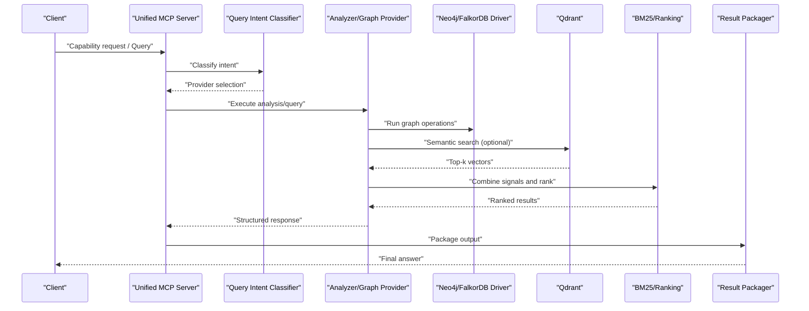
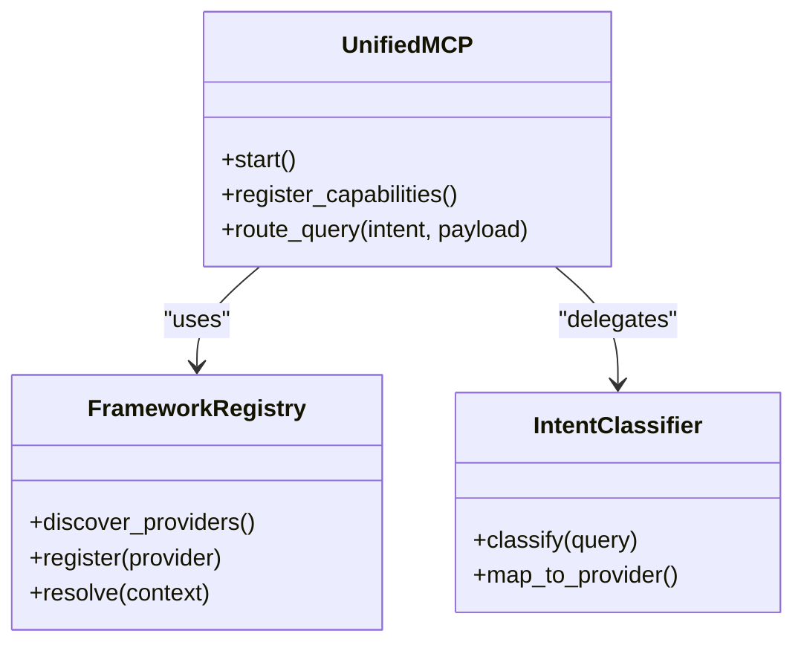
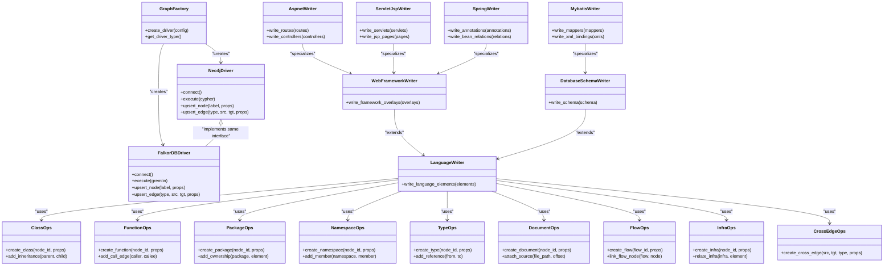
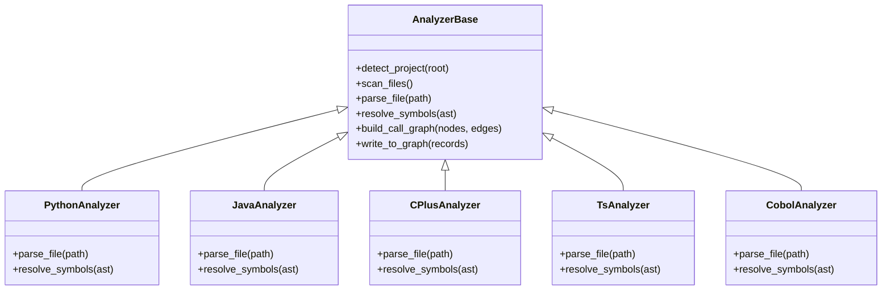
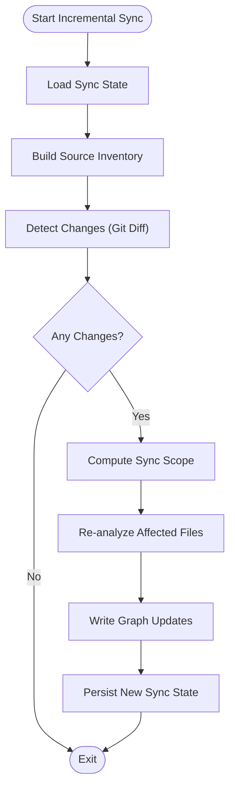
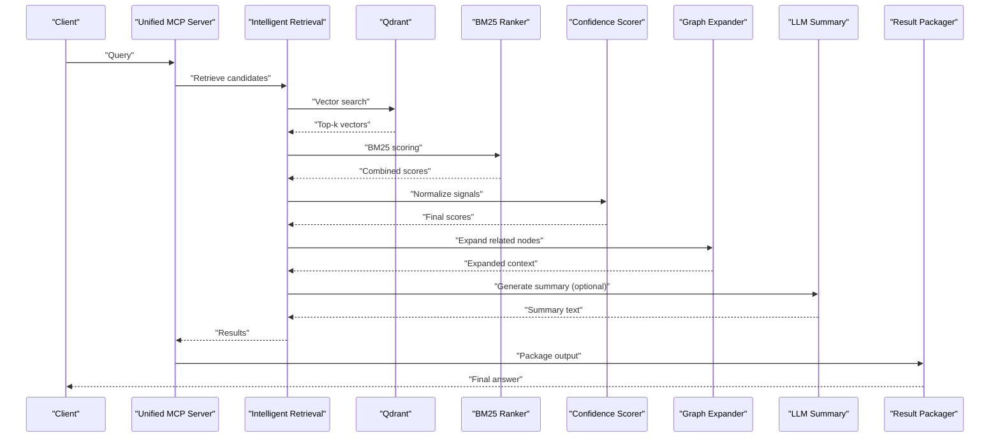
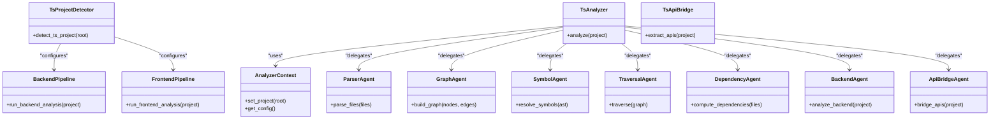
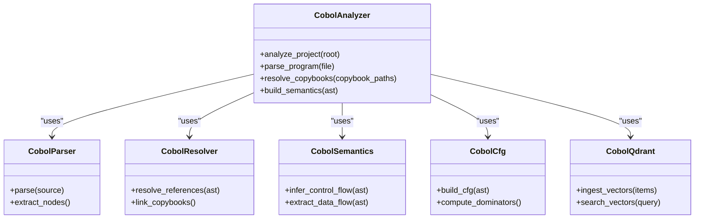
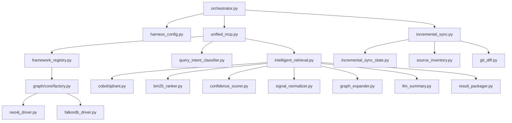

# System Architecture Overview

<cite>
**Referenced Files in This Document**
- [ReadMe.md](file://ReadMe.md)
- [Makefile](file://Makefile)
- [harness/scripts/orchestrator.py](file://harness/scripts/orchestrator.py)
- [code-tiny/mcp/unified_mcp.py](file://code-tiny/mcp/unified_mcp.py)
- [code-tiny/mcp/framework_registry.py](file://code-tiny/mcp/framework_registry.py)
- [code-tiny/tools/common/harness_config.py](file://code-tiny/tools/common/harness_config.py)
- [code-tiny/tools/graph/core/factory.py](file://code-tiny/tools/graph/core/factory.py)
- [code-tiny/tools/graph/driver/neo4j_driver.py](file://code-tiny/tools/graph/driver/neo4j_driver.py)
- [code-tiny/tools/graph/driver/falkordb_driver.py](file://code-tiny/tools/graph/driver/falkordb_driver.py)
- [code-tiny/tools/common/incremental_sync_state.py](file://code-tiny/tools/common/incremental_sync_state.py)
- [code-tiny/tools/sync/incremental_sync.py](file://code-tiny/tools/sync/incremental_sync.py)
- [code-tiny/tools/common/analyzer_cache.py](file://code-tiny/tools/common/analyzer_cache.py)
- [code-tiny/tools/common/query_intent_classifier.py](file://code-tiny/tools/common/query_intent_classifier.py)
- [code-tiny/tools/common/intelligent_retrieval.py](file://code-tiny/tools/common/intelligent_retrieval.py)
- [code-tiny/tools/cobol/qdrant.py](file://code-tiny/tools/cobol/qdrant.py)
- [code-tiny/tools/common/bm25_ranker.py](file://code-tiny/tools/common/bm25_ranker.py)
- [code-tiny/tools/common/source_inventory.py](file://code-tiny/tools/common/source_inventory.py)
- [code-tiny/tools/common/git_diff.py](file://code-tiny/tools/common/git_diff.py)
- [code-tiny/tools/common/workflow_classifier.py](file://code-tiny/tools/common/workflow_classifier.py)
- [code-tiny/tools/common/result_packager.py](file://code-tiny/tools/common/result_packager.py)
- [code-tiny/tools/common/llm_summary.py](file://code-tiny/tools/common/llm_summary.py)
- [code-tiny/tools/common/api_match_engine.py](file://code-tiny/tools/common/api_match_engine.py)
- [code-tiny/tools/common/confidence_scorer.py](file://code-tiny/tools/common/confidence_scorer.py)
- [code-tiny/tools/common/retrieval_scorer.py](file://code-tiny/tools/common/retrieval_scorer.py)
- [code-tiny/tools/common/signal_normalizer.py](file://code-tiny/tools/common/signal_normalizer.py)
- [code-tiny/tools/common/react_role_classifier.py](file://code-tiny/tools/common/react_role_classifier.py)
- [code-tiny/tools/common/frontend_relationship_extractor.py](file://code-tiny/tools/common/frontend_relationship_extractor.py)
- [code-tiny/tools/common/graph_expander.py](file://code-tiny/tools/common/graph_expander.py)
- [code-tiny/tools/common/call_graph_builder.py](file://code-tiny/tools/common/call_graph_builder.py)
- [code-tiny/tools/common/message_scan.py](file://code-tiny/tools/common/message_scan.py)
- [code-tiny/tools/common/url_normalizer.py](file://code-tiny/tools/common/url_normalizer.py)
- [code-tiny/tools/common/workflow_impact_scorer.py](file://code-tiny/tools/common/workflow_impact_scorer.py)
- [code-tiny/tools/common/sync_scope.py](file://code-tiny/tools/common/sync_scope.py)
- [code-tiny/tools/common/primary_vector_sync.py](file://code-tiny/tools/common/primary_vector_sync.py)
- [code-tiny/tools/graph/operations/class_ops.py](file://code-tiny/tools/graph/operations/class_ops.py)
- [code-tiny/tools/graph/operations/function_ops.py](file://code-tiny/tools/graph/operations/function_ops.py)
- [code-tiny/tools/graph/operations/package_ops.py](file://code-tiny/tools/graph/operations/package_ops.py)
- [code-tiny/tools/graph/operations/namespace_ops.py](file://code-tiny/tools/graph/operations/namespace_ops.py)
- [code-tiny/tools/graph/operations/type_ops.py](file://code-tiny/tools/graph/operations/type_ops.py)
- [code-tiny/tools/graph/operations/document_ops.py](file://code-tiny/tools/graph/operations/document_ops.py)
- [code-tiny/tools/graph/operations/flow_ops.py](file://code-tiny/tools/graph/operations/flow_ops.py)
- [code-tiny/tools/graph/operations/infra_ops.py](file://code-tiny/tools/graph/operations/infra_ops.py)
- [code-tiny/tools/graph/operations/cross_edge_ops.py](file://code-tiny/tools/graph/operations/cross_edge_ops.py)
- [code-tiny/tools/graph/writer/language_writer.py](file://code-tiny/tools/graph/writer/language_writer.py)
- [code-tiny/tools/graph/writer/web_framework_writer.py](file://code-tiny/tools/graph/writer/web_framework_writer.py)
- [code-tiny/tools/graph/writer/database_schema_writer.py](file://code-tiny/tools/graph/writer/database_schema_writer.py)
- [code-tiny/tools/graph/writer/aspnet_writer.py](file://code-tiny/tools/graph/writer/aspnet_writer.py)
- [code-tiny/tools/graph/writer/mybatis_writer.py](file://code-tiny/tools/graph/writer/mybatis_writer.py)
- [code-tiny/tools/graph/writer/servlet_jsp_writer.py](file://code-tiny/tools/graph/writer/servlet_jsp_writer.py)
- [code-tiny/tools/graph/writer/spring_writer.py](file://code-tiny/tools/graph/writer/spring_writer.py)
- [code-tiny/tools/ts/pipeline/backend_pipeline.py](file://code-tiny/tools/ts/pipeline/backend_pipeline.py)
- [code-tiny/tools/ts/pipeline/frontend_pipeline.py](file://code-tiny/tools/ts/pipeline/frontend_pipeline.py)
- [code-tiny/tools/ts/ts_analyzer.py](file://code-tiny/tools/ts/ts_analyzer.py)
- [code-tiny/tools/ts/ts_project_detector.py](file://code-tiny/tools/ts/ts_project_detector.py)
- [code-tiny/tools/ts/ts_api_bridge.py](file://code-tiny/tools/ts/ts_api_bridge.py)
- [code-tiny/tools/ts/context/analyzer_context.py](file://code-tiny/tools/ts/context/analyzer_context.py)
- [code-tiny/tools/ts/types/graph_types.py](file://code-tiny/tools/ts/types/graph_types.py)
- [code-tiny/tools/ts/types/ast_types.py](file://code-tiny/tools/ts/types/ast_types.py)
- [code-tiny/tools/ts/utils/file_utils.py](file://code-tiny/tools/ts/utils/file_utils.py)
- [code-tiny/tools/ts/utils/id_utils.py](file://code-tiny/tools/ts/utils/id_utils.py)
- [code-tiny/tools/ts/utils/regex_patterns.py](file://code-tiny/tools/ts/utils/regex_patterns.py)
- [code-tiny/tools/ts/agents/parser_agent.py](file://code-tiny/tools/ts/agents/parser_agent.py)
- [code-tiny/tools/ts/agents/graph_agent.py](file://code-tiny/tools/ts/agents/graph_agent.py)
- [code-tiny/tools/ts/agents/symbol_agent.py](file://code-tiny/tools/ts/agents/symbol_agent.py)
- [code-tiny/tools/ts/agents/traversal_agent.py](file://code-tiny/tools/ts/agents/traversal_agent.py)
- [code-tiny/tools/ts/agents/dependency_agent.py](file://code-tiny/tools/ts/agents/dependency_agent.py)
- [code-tiny/tools/ts/agents/backend_agent.py](file://code-tiny/tools/ts/agents/backend_agent.py)
- [code-tiny/tools/ts/agents/api_bridge_agent.py](file://code-tiny/tools/ts/agents/api_bridge_agent.py)
- [code-tiny/tools/python/python_analyzer.py](file://code-tiny/tools/python/python_analyzer.py)
- [code-tiny/tools/java/java_analyzer.py](file://code-tiny/tools/java/java_analyzer.py)
- [code-tiny/tools/cplus/cplus_analyzer.py](file://code-tiny/tools/cplus/cplus_analyzer.py)
- [code-tiny/tools/go/go_analyzer.py](file://code-tiny/tools/go/go_analyzer.py)
- [code-tiny/tools/js/js_analyzer.py](file://code-tiny/tools/js/js_analyzer.py)
- [code-tiny/tools/kotlin/kotlin_analyzer.py](file://code-tiny/tools/kotlin/kotlin_analyzer.py)
- [code-tiny/tools/php/php_analyzer.py](file://code-tiny/tools/php/php_analyzer.py)
- [code-tiny/tools/rust/rust_analyzer.py](file://code-tiny/tools/rust/rust_analyzer.py)
- [code-tiny/tools/swift/swift_analyzer.py](file://code-tiny/tools/swift/swift_analyzer.py)
- [code-tiny/tools/sql/sql_analyzer.py](file://code-tiny/tools/sql/sql_analyzer.py)
- [code-tiny/tools/vb/vb6_analyzer.py](file://code-tiny/tools/vb/vb6_analyzer.py)
- [code-tiny/tools/vb/vba_analyzer.py](file://code-tiny/tools/vb/vba_analyzer.py)
- [code-tiny/tools/vb/vbnet_analyzer.py](file://code-tiny/tools/vb/vbnet_analyzer.py)
- [code-tiny/tools/vb/vbscript_analyzer.py](file://code-tiny/tools/vb/vbscript_analyzer.py)
- [code-tiny/tools/perl/perl_analyzer.py](file://code-tiny/tools/perl/perl_analyzer.py)
- [code-tiny/tools/flutter/flutter_analyzer.py](file://code-tiny/tools/flutter/flutter_analyzer.py)
- [code-tiny/tools/aspnet_core/aspnet_core_analyzer.py](file://code-tiny/tools/aspnet_core/aspnet_core_analyzer.py)
- [code-tiny/tools/aspnet_framework/aspnet_framework_analyzer.py](file://code-tiny/tools/aspnet_framework/aspnet_framework_analyzer.py)
- [code-tiny/tools/database_schema/database_schema_analyzer.py](file://code-tiny/tools/database_schema/database_schema_analyzer.py)
- [code-tiny/tools/mybatis/mybatis_analyzer.py](file://code-tiny/tools/mybatis/mybatis_analyzer.py)
- [code-tiny/tools/servlet_jsp/servlet_jsp_analyzer.py](file://code-tiny/tools/servlet_jsp/servlet_jsp_analyzer.py)
- [code-tiny/tools/struts/struts_analyzer.py](file://code-tiny/tools/struts/struts_analyzer.py)
- [code-tiny/tools/web_framework/web_framework_analyzer.py](file://code-tiny/tools/web_framework/web_framework_analyzer.py)
- [code-tiny/tools/cobol/cobol_analyzer.py](file://code-tiny/tools/cobol/cobol_analyzer.py)
- [code-tiny/tools/cobol/models.py](file://code-tiny/tools/cobol/models.py)
- [code-tiny/tools/cobol/parser_runtime.py](file://code-tiny/tools/cobol/parser_runtime.py)
- [code-tiny/tools/cobol/resolver.py](file://code-tiny/tools/cobol/resolver.py)
- [code-tiny/tools/cobol/pipeline.py](file://code-tiny/tools/cobol/pipeline.py)
- [code-tiny/tools/cobol/semantics.py](file://code-tiny/tools/cobol/semantics.py)
- [code-tiny/tools/cobol/cfg.py](file://code-tiny/tools/cobol/cfg.py)
- [code-tiny/tools/cobol/lib/__init__.py](file://code-tiny/tools/cobol/lib/__init__.py)
- [code-tiny/tools/cobol/lib/README.md](file://code-tiny/tools/cobol/lib/README.md)
- [code-tiny/tools/cobol/README.md](file://code-tiny/tools/cobol/README.md)
- [code-tiny/tools/cobol/parser.py](file://code-tiny/tools/cobol/parser.py)
- [code-tiny/tools/cobol/parser_runtime.py](file://code-tiny/tools/cobol/parser_runtime.py)
- [code-tiny/tools/cobol/resolver.py](file://code-tiny/tools/cobol/resolver.py)
- [code-tiny/tools/cobol/pipeline.py](file://code-tiny/tools/cobol/pipeline.py)
- [code-tiny/tools/cobol/semantics.py](file://code-tiny/tools/cobol/semantics.py)
- [code-tiny/tools/cobol/cfg.py](file://code-tiny/tools/cobol/cfg.py)
- [code-tiny/tools/cobol/lib/__init__.py](file://code-tiny/tools/cobol/lib/__init__.py)
- [code-tiny/tools/cobol/lib/README.md](file://code-tiny/tools/cobol/lib/README.md)
- [code-tiny/tools/cobol/README.md](file://code-tiny/tools/cobol/README.md)
- [code-tiny/tools/cobol/parser.py](file://code-tiny/tools/cobol/parser.py)
</cite>

## Table of Contents
1. [Introduction](#introduction)
2. [Project Structure](#project-structure)
3. [Core Components](#core-components)
4. [Architecture Overview](#architecture-overview)
5. [Detailed Component Analysis](#detailed-component-analysis)
6. [Dependency Analysis](#dependency-analysis)
7. [Performance Considerations](#performance-considerations)
8. [Troubleshooting Guide](#troubleshooting-guide)
9. [Conclusion](#conclusion)
10. [Appendices](#appendices)

## Introduction
Cortex Harness is a modular, multi-language code analysis and query system that transforms source repositories into rich graph-based representations for semantic exploration, impact analysis, and intelligent retrieval. It provides:
- A modular analyzer framework with strategy patterns for language-specific analyzers
- A graph-based code representation layer backed by Neo4j or FalkorDB
- MCP integration services for capability routing and tool exposure
- Incremental synchronization to keep the graph consistent with repository changes
- Vector search via Qdrant and LLM-assisted summarization and classification

The system supports multiple languages and frameworks (Python, Java, C++, Go, JS/TS, Kotlin, PHP, Rust, Swift, SQL, VB family, Perl, Flutter, ASP.NET Core/Framework, MyBatis, Servlet/JSP, Struts, Web Framework overlays, Database Schema), enabling cross-language understanding and unified querying.

## Project Structure
At a high level, the repository organizes functionality into:
- Orchestrator and lifecycle scripts under harness
- Unified MCP server and registry under code-tiny/mcp
- Language and framework analyzers under code-tiny/tools
- Graph core, drivers, operations, and writers under code-tiny/tools/graph
- Common utilities for caching, sync, retrieval, scoring, and normalization under code-tiny/tools/common
- TypeScript tooling pipeline and agents under code-tiny/tools/ts
- Cobol analyzer and runtime under code-tiny/tools/cobol

```mermaid
graph TB
subgraph "Orchestration"
ORCH["harness/scripts/orchestrator.py"]
CFG["code-tiny/tools/common/harness_config.py"]
end
subgraph "MCP Integration"
UNIFIED["code-tiny/mcp/unified_mcp.py"]
REG["code-tiny/mcp/framework_registry.py"]
end
subgraph "Graph Layer"
FACT["code-tiny/tools/graph/core/factory.py"]
N4J["code-tiny/tools/graph/driver/neo4j_driver.py"]
FKB["code-tiny/tools/graph/driver/falkordb_driver.py"]
OPS["code-tiny/tools/graph/operations/*"]
WRT["code-tiny/tools/graph/writer/*"]
end
subgraph "Analyzers"
PYA["code-tiny/tools/python/python_analyzer.py"]
JVA["code-tiny/tools/java/java_analyzer.py"]
CPPA["code-tiny/tools/cplus/cplus_analyzer.py"]
GOA["code-tiny/tools/go/go_analyzer.py"]
TSA["code-tiny/tools/ts/ts_analyzer.py"]
COBA["code-tiny/tools/cobol/cobol_analyzer.py"]
WEBFA["code-tiny/tools/web_framework/web_framework_analyzer.py"]
end
subgraph "Sync & Retrieval"
SYNC["code-tiny/tools/sync/incremental_sync.py"]
STATE["code-tiny/tools/common/incremental_sync_state.py"]
INV["code-tiny/tools/common/source_inventory.py"]
GITD["code-tiny/tools/common/git_diff.py"]
INTL["code-tiny/tools/common/intelligent_retrieval.py"]
QDR["code-tiny/tools/cobol/qdrant.py"]
BM25["code-tiny/tools/common/bm25_ranker.py"]
end
ORCH --> CFG
ORCH --> UNIFIED
UNIFIED --> REG
REG --> FACT
FACT --> N4J
FACT --> FKB
ORCH --> PYA
ORCH --> JVA
ORCH --> CPPA
ORCH --> GOA
ORCH --> TSA
ORCH --> COBA
ORCH --> WEBFA
ORCH --> SYNC
SYNC --> STATE
SYNC --> INV
SYNC --> GITD
INTL --> QDR
INTL --> BM25
```

**Diagram sources**
- [harness/scripts/orchestrator.py](file://harness/scripts/orchestrator.py)
- [code-tiny/tools/common/harness_config.py](file://code-tiny/tools/common/harness_config.py)
- [code-tiny/mcp/unified_mcp.py](file://code-tiny/mcp/unified_mcp.py)
- [code-tiny/mcp/framework_registry.py](file://code-tiny/mcp/framework_registry.py)
- [code-tiny/tools/graph/core/factory.py](file://code-tiny/tools/graph/core/factory.py)
- [code-tiny/tools/graph/driver/neo4j_driver.py](file://code-tiny/tools/graph/driver/neo4j_driver.py)
- [code-tiny/tools/graph/driver/falkordb_driver.py](file://code-tiny/tools/graph/driver/falkordb_driver.py)
- [code-tiny/tools/python/python_analyzer.py](file://code-tiny/tools/python/python_analyzer.py)
- [code-tiny/tools/java/java_analyzer.py](file://code-tiny/tools/java/java_analyzer.py)
- [code-tiny/tools/cplus/cplus_analyzer.py](file://code-tiny/tools/cplus/cplus_analyzer.py)
- [code-tiny/tools/go/go_analyzer.py](file://code-tiny/tools/go/go_analyzer.py)
- [code-tiny/tools/ts/ts_analyzer.py](file://code-tiny/tools/ts/ts_analyzer.py)
- [code-tiny/tools/cobol/cobol_analyzer.py](file://code-tiny/tools/cobol/cobol_analyzer.py)
- [code-tiny/tools/web_framework/web_framework_analyzer.py](file://code-tiny/tools/web_framework/web_framework_analyzer.py)
- [code-tiny/tools/sync/incremental_sync.py](file://code-tiny/tools/sync/incremental_sync.py)
- [code-tiny/tools/common/incremental_sync_state.py](file://code-tiny/tools/common/incremental_sync_state.py)
- [code-tiny/tools/common/source_inventory.py](file://code-tiny/tools/common/source_inventory.py)
- [code-tiny/tools/common/git_diff.py](file://code-tiny/tools/common/git_diff.py)
- [code-tiny/tools/common/intelligent_retrieval.py](file://code-tiny/tools/common/intelligent_retrieval.py)
- [code-tiny/tools/cobol/qdrant.py](file://code-tiny/tools/cobol/qdrant.py)
- [code-tiny/tools/common/bm25_ranker.py](file://code-tiny/tools/common/bm25_ranker.py)

**Section sources**
- [ReadMe.md](file://ReadMe.md)
- [Makefile](file://Makefile)

## Core Components
- Orchestrator: Coordinates scanning, analysis, graph construction, and MCP service startup. Reads configuration and dispatches tasks to analyzers and sync managers.
- Analyzer Registry and Strategy Pattern: Registers language-specific analyzers dynamically using factory mechanisms; each analyzer implements a common interface for parsing, resolution, and graph writing.
- Graph Layer: Provides a driver abstraction over Neo4j and FalkorDB, with typed operations for nodes and edges and writer modules for framework-specific semantics.
- MCP Integration: Unified MCP server exposes capabilities and routes queries to appropriate providers based on project context and language detection.
- Incremental Sync Manager: Tracks state, detects changes, scopes updates, and performs targeted re-analysis to maintain graph consistency efficiently.
- Retrieval and Ranking: Combines vector search (Qdrant) and BM25 ranking with confidence scoring and result packaging for intelligent responses.

**Section sources**
- [harness/scripts/orchestrator.py](file://harness/scripts/orchestrator.py)
- [code-tiny/mcp/unified_mcp.py](file://code-tiny/mcp/unified_mcp.py)
- [code-tiny/mcp/framework_registry.py](file://code-tiny/mcp/framework_registry.py)
- [code-tiny/tools/graph/core/factory.py](file://code-tiny/tools/graph/core/factory.py)
- [code-tiny/tools/graph/driver/neo4j_driver.py](file://code-tiny/tools/graph/driver/neo4j_driver.py)
- [code-tiny/tools/graph/driver/falkordb_driver.py](file://code-tiny/tools/graph/driver/falkordb_driver.py)
- [code-tiny/tools/sync/incremental_sync.py](file://code-tiny/tools/sync/incremental_sync.py)
- [code-tiny/tools/common/incremental_sync_state.py](file://code-tiny/tools/common/incremental_sync_state.py)
- [code-tiny/tools/common/intelligent_retrieval.py](file://code-tiny/tools/common/intelligent_retrieval.py)
- [code-tiny/tools/common/bm25_ranker.py](file://code-tiny/tools/common/bm25_ranker.py)

## Architecture Overview
The system follows a layered architecture:
- Ingestion Layer: Source inventory and change detection feed analyzers.
- Analysis Layer: Language-specific analyzers parse and resolve symbols, build call graphs, and produce graph records.
- Graph Layer: Typed operations and writers persist relationships into Neo4j/FalkorDB.
- Query Layer: MCP router classifies intent, selects providers, executes graph/vector queries, ranks results, and packages outputs.
- Services: Caching, LLM summarization, and semantic expansion augment query responses.

**Diagram sources**
- [code-tiny/mcp/unified_mcp.py](file://code-tiny/mcp/unified_mcp.py)
- [code-tiny/tools/common/query_intent_classifier.py](file://code-tiny/tools/common/query_intent_classifier.py)
- [code-tiny/tools/graph/core/factory.py](file://code-tiny/tools/graph/core/factory.py)
- [code-tiny/tools/graph/driver/neo4j_driver.py](file://code-tiny/tools/graph/driver/neo4j_driver.py)
- [code-tiny/tools/graph/driver/falkordb_driver.py](file://code-tiny/tools/graph/driver/falkordb_driver.py)
- [code-tiny/tools/cobol/qdrant.py](file://code-tiny/tools/cobol/qdrant.py)
- [code-tiny/tools/common/bm25_ranker.py](file://code-tiny/tools/common/bm25_ranker.py)
- [code-tiny/tools/common/result_packager.py](file://code-tiny/tools/common/result_packager.py)

## Detailed Component Analysis

### Orchestrator and Configuration
Responsibilities:
- Load harness configuration
- Initialize MCP server and registry
- Dispatch scan and sync tasks
- Manage lifecycle hooks and logging

Key interactions:
- Reads config from harness_config
- Starts unified MCP server
- Invokes orchestrator flows for full scans and incremental updates

**Section sources**
- [harness/scripts/orchestrator.py](file://harness/scripts/orchestrator.py)
- [code-tiny/tools/common/harness_config.py](file://code-tiny/tools/common/harness_config.py)

### MCP Integration and Capability Routing
Responsibilities:
- Expose tools and capabilities via MCP protocol
- Route queries to appropriate providers based on project context
- Validate inputs and coerce types for provider compatibility

Key components:
- Unified MCP server entrypoint
- Framework registry for dynamic discovery and registration
- Intent classifier for query disambiguation

**Diagram sources**
- [code-tiny/mcp/unified_mcp.py](file://code-tiny/mcp/unified_mcp.py)
- [code-tiny/mcp/framework_registry.py](file://code-tiny/mcp/framework_registry.py)
- [code-tiny/tools/common/query_intent_classifier.py](file://code-tiny/tools/common/query_intent_classifier.py)

**Section sources**
- [code-tiny/mcp/unified_mcp.py](file://code-tiny/mcp/unified_mcp.py)
- [code-tiny/mcp/framework_registry.py](file://code-tiny/mcp/framework_registry.py)
- [code-tiny/tools/common/query_intent_classifier.py](file://code-tiny/tools/common/query_intent_classifier.py)

### Graph Layer: Drivers, Operations, and Writers
Design decisions:
- Use graph databases (Neo4j/FalkorDB) to model complex code relationships (calls, imports, inheritance, control/data flow).
- Provide a driver abstraction to support multiple backends transparently.
- Encapsulate domain operations (classes, functions, packages, namespaces, types, documents, flows, infra, cross-edge) for readability and reuse.
- Use writers to inject framework-specific semantics (ASP.NET, Spring, MyBatis, Servlet/JSP, database schema).

**Diagram sources**
- [code-tiny/tools/graph/core/factory.py](file://code-tiny/tools/graph/core/factory.py)
- [code-tiny/tools/graph/driver/neo4j_driver.py](file://code-tiny/tools/graph/driver/neo4j_driver.py)
- [code-tiny/tools/graph/driver/falkordb_driver.py](file://code-tiny/tools/graph/driver/falkordb_driver.py)
- [code-tiny/tools/graph/operations/class_ops.py](file://code-tiny/tools/graph/operations/class_ops.py)
- [code-tiny/tools/graph/operations/function_ops.py](file://code-tiny/tools/graph/operations/function_ops.py)
- [code-tiny/tools/graph/operations/package_ops.py](file://code-tiny/tools/graph/operations/package_ops.py)
- [code-tiny/tools/graph/operations/namespace_ops.py](file://code-tiny/tools/graph/operations/namespace_ops.py)
- [code-tiny/tools/graph/operations/type_ops.py](file://code-tiny/tools/graph/operations/type_ops.py)
- [code-tiny/tools/graph/operations/document_ops.py](file://code-tiny/tools/graph/operations/document_ops.py)
- [code-tiny/tools/graph/operations/flow_ops.py](file://code-tiny/tools/graph/operations/flow_ops.py)
- [code-tiny/tools/graph/operations/infra_ops.py](file://code-tiny/tools/graph/operations/infra_ops.py)
- [code-tiny/tools/graph/operations/cross_edge_ops.py](file://code-tiny/tools/graph/operations/cross_edge_ops.py)
- [code-tiny/tools/graph/writer/language_writer.py](file://code-tiny/tools/graph/writer/language_writer.py)
- [code-tiny/tools/graph/writer/web_framework_writer.py](file://code-tiny/tools/graph/writer/web_framework_writer.py)
- [code-tiny/tools/graph/writer/database_schema_writer.py](file://code-tiny/tools/graph/writer/database_schema_writer.py)
- [code-tiny/tools/graph/writer/aspnet_writer.py](file://code-tiny/tools/graph/writer/aspnet_writer.py)
- [code-tiny/tools/graph/writer/mybatis_writer.py](file://code-tiny/tools/graph/writer/mybatis_writer.py)
- [code-tiny/tools/graph/writer/servlet_jsp_writer.py](file://code-tiny/tools/graph/writer/servlet_jsp_writer.py)
- [code-tiny/tools/graph/writer/spring_writer.py](file://code-tiny/tools/graph/writer/spring_writer.py)

**Section sources**
- [code-tiny/tools/graph/core/factory.py](file://code-tiny/tools/graph/core/factory.py)
- [code-tiny/tools/graph/driver/neo4j_driver.py](file://code-tiny/tools/graph/driver/neo4j_driver.py)
- [code-tiny/tools/graph/driver/falkordb_driver.py](file://code-tiny/tools/graph/driver/falkordb_driver.py)
- [code-tiny/tools/graph/operations/class_ops.py](file://code-tiny/tools/graph/operations/class_ops.py)
- [code-tiny/tools/graph/operations/function_ops.py](file://code-tiny/tools/graph/operations/function_ops.py)
- [code-tiny/tools/graph/operations/package_ops.py](file://code-tiny/tools/graph/operations/package_ops.py)
- [code-tiny/tools/graph/operations/namespace_ops.py](file://code-tiny/tools/graph/operations/namespace_ops.py)
- [code-tiny/tools/graph/operations/type_ops.py](file://code-tiny/tools/graph/operations/type_ops.py)
- [code-tiny/tools/graph/operations/document_ops.py](file://code-tiny/tools/graph/operations/document_ops.py)
- [code-tiny/tools/graph/operations/flow_ops.py](file://code-tiny/tools/graph/operations/flow_ops.py)
- [code-tiny/tools/graph/operations/infra_ops.py](file://code-tiny/tools/graph/operations/infra_ops.py)
- [code-tiny/tools/graph/operations/cross_edge_ops.py](file://code-tiny/tools/graph/operations/cross_edge_ops.py)
- [code-tiny/tools/graph/writer/language_writer.py](file://code-tiny/tools/graph/writer/language_writer.py)
- [code-tiny/tools/graph/writer/web_framework_writer.py](file://code-tiny/tools/graph/writer/web_framework_writer.py)
- [code-tiny/tools/graph/writer/database_schema_writer.py](file://code-tiny/tools/graph/writer/database_schema_writer.py)
- [code-tiny/tools/graph/writer/aspnet_writer.py](file://code-tiny/tools/graph/writer/aspnet_writer.py)
- [code-tiny/tools/graph/writer/mybatis_writer.py](file://code-tiny/tools/graph/writer/mybatis_writer.py)
- [code-tiny/tools/graph/writer/servlet_jsp_writer.py](file://code-tiny/tools/graph/writer/servlet_jsp_writer.py)
- [code-tiny/tools/graph/writer/spring_writer.py](file://code-tiny/tools/graph/writer/spring_writer.py)

### Analyzers: Strategy Pattern and Dynamic Registration
Each language analyzer implements a common contract for:
- Detecting project scope and files
- Parsing AST/control/data structures
- Resolving symbols and references
- Building call graphs and semantic relations
- Writing graph records via writers

Dynamic registration uses a factory mechanism to discover and instantiate analyzers at runtime based on project metadata and file extensions.

Examples of analyzers:
- Python, Java, C++, Go, JS, TS, Kotlin, PHP, Rust, Swift, SQL, VB family, Perl, Flutter, ASP.NET Core/Framework, MyBatis, Servlet/JSP, Struts, Web Framework overlay, Database Schema, Cobol

**Diagram sources**
- [code-tiny/tools/python/python_analyzer.py](file://code-tiny/tools/python/python_analyzer.py)
- [code-tiny/tools/java/java_analyzer.py](file://code-tiny/tools/java/java_analyzer.py)
- [code-tiny/tools/cplus/cplus_analyzer.py](file://code-tiny/tools/cplus/cplus_analyzer.py)
- [code-tiny/tools/ts/ts_analyzer.py](file://code-tiny/tools/ts/ts_analyzer.py)
- [code-tiny/tools/cobol/cobol_analyzer.py](file://code-tiny/tools/cobol/cobol_analyzer.py)

**Section sources**
- [code-tiny/tools/python/python_analyzer.py](file://code-tiny/tools/python/python_analyzer.py)
- [code-tiny/tools/java/java_analyzer.py](file://code-tiny/tools/java/java_analyzer.py)
- [code-tiny/tools/cplus/cplus_analyzer.py](file://code-tiny/tools/cplus/cplus_analyzer.py)
- [code-tiny/tools/ts/ts_analyzer.py](file://code-tiny/tools/ts/ts_analyzer.py)
- [code-tiny/tools/cobol/cobol_analyzer.py](file://code-tiny/tools/cobol/cobol_analyzer.py)
- [code-tiny/tools/graph/core/factory.py](file://code-tiny/tools/graph/core/factory.py)

### Incremental Sync Manager
Responsibilities:
- Maintain sync state and lock management
- Inventory source files and detect changes via Git diffs
- Scope updates to affected modules/submodules
- Trigger targeted re-analysis and graph updates

**Diagram sources**
- [code-tiny/tools/sync/incremental_sync.py](file://code-tiny/tools/sync/incremental_sync.py)
- [code-tiny/tools/common/incremental_sync_state.py](file://code-tiny/tools/common/incremental_sync_state.py)
- [code-tiny/tools/common/source_inventory.py](file://code-tiny/tools/common/source_inventory.py)
- [code-tiny/tools/common/git_diff.py](file://code-tiny/tools/common/git_diff.py)

**Section sources**
- [code-tiny/tools/sync/incremental_sync.py](file://code-tiny/tools/sync/incremental_sync.py)
- [code-tiny/tools/common/incremental_sync_state.py](file://code-tiny/tools/common/incremental_sync_state.py)
- [code-tiny/tools/common/source_inventory.py](file://code-tiny/tools/common/source_inventory.py)
- [code-tiny/tools/common/git_diff.py](file://code-tiny/tools/common/git_diff.py)

### Retrieval, Ranking, and Semantic Expansion
Responsibilities:
- Combine vector similarity (Qdrant) and keyword matching (BM25)
- Apply confidence scoring and signal normalization
- Expand graphs semantically and summarize with LLMs when needed
- Package structured results for MCP consumers

**Diagram sources**
- [code-tiny/tools/common/intelligent_retrieval.py](file://code-tiny/tools/common/intelligent_retrieval.py)
- [code-tiny/tools/cobol/qdrant.py](file://code-tiny/tools/cobol/qdrant.py)
- [code-tiny/tools/common/bm25_ranker.py](file://code-tiny/tools/common/bm25_ranker.py)
- [code-tiny/tools/common/confidence_scorer.py](file://code-tiny/tools/common/confidence_scorer.py)
- [code-tiny/tools/common/signal_normalizer.py](file://code-tiny/tools/common/signal_normalizer.py)
- [code-tiny/tools/common/graph_expander.py](file://code-tiny/tools/common/graph_expander.py)
- [code-tiny/tools/common/llm_summary.py](file://code-tiny/tools/common/llm_summary.py)
- [code-tiny/tools/common/result_packager.py](file://code-tiny/tools/common/result_packager.py)

**Section sources**
- [code-tiny/tools/common/intelligent_retrieval.py](file://code-tiny/tools/common/intelligent_retrieval.py)
- [code-tiny/tools/cobol/qdrant.py](file://code-tiny/tools/cobol/qdrant.py)
- [code-tiny/tools/common/bm25_ranker.py](file://code-tiny/tools/common/bm25_ranker.py)
- [code-tiny/tools/common/confidence_scorer.py](file://code-tiny/tools/common/confidence_scorer.py)
- [code-tiny/tools/common/signal_normalizer.py](file://code-tiny/tools/common/signal_normalizer.py)
- [code-tiny/tools/common/graph_expander.py](file://code-tiny/tools/common/graph_expander.py)
- [code-tiny/tools/common/llm_summary.py](file://code-tiny/tools/common/llm_summary.py)
- [code-tiny/tools/common/result_packager.py](file://code-tiny/tools/common/result_packager.py)

### TypeScript Tooling Pipeline and Agents
Responsibilities:
- Detect TS projects and configure pipelines for backend/frontend
- Parse ASTs, extract symbols, traverse dependencies, and build API bridges
- Provide typed graph models and utilities for ID generation and regex patterns

**Diagram sources**
- [code-tiny/tools/ts/ts_project_detector.py](file://code-tiny/tools/ts/ts_project_detector.py)
- [code-tiny/tools/ts/pipeline/backend_pipeline.py](file://code-tiny/tools/ts/pipeline/backend_pipeline.py)
- [code-tiny/tools/ts/pipeline/frontend_pipeline.py](file://code-tiny/tools/ts/pipeline/frontend_pipeline.py)
- [code-tiny/tools/ts/ts_analyzer.py](file://code-tiny/tools/ts/ts_analyzer.py)
- [code-tiny/tools/ts/ts_api_bridge.py](file://code-tiny/tools/ts/ts_api_bridge.py)
- [code-tiny/tools/ts/context/analyzer_context.py](file://code-tiny/tools/ts/context/analyzer_context.py)
- [code-tiny/tools/ts/agents/parser_agent.py](file://code-tiny/tools/ts/agents/parser_agent.py)
- [code-tiny/tools/ts/agents/graph_agent.py](file://code-tiny/tools/ts/agents/graph_agent.py)
- [code-tiny/tools/ts/agents/symbol_agent.py](file://code-tiny/tools/ts/agents/symbol_agent.py)
- [code-tiny/tools/ts/agents/traversal_agent.py](file://code-tiny/tools/ts/agents/traversal_agent.py)
- [code-tiny/tools/ts/agents/dependency_agent.py](file://code-tiny/tools/ts/agents/dependency_agent.py)
- [code-tiny/tools/ts/agents/backend_agent.py](file://code-tiny/tools/ts/agents/backend_agent.py)
- [code-tiny/tools/ts/agents/api_bridge_agent.py](file://code-tiny/tools/ts/agents/api_bridge_agent.py)

**Section sources**
- [code-tiny/tools/ts/ts_project_detector.py](file://code-tiny/tools/ts/ts_project_detector.py)
- [code-tiny/tools/ts/pipeline/backend_pipeline.py](file://code-tiny/tools/ts/pipeline/backend_pipeline.py)
- [code-tiny/tools/ts/pipeline/frontend_pipeline.py](file://code-tiny/tools/ts/pipeline/frontend_pipeline.py)
- [code-tiny/tools/ts/ts_analyzer.py](file://code-tiny/tools/ts/ts_analyzer.py)
- [code-tiny/tools/ts/ts_api_bridge.py](file://code-tiny/tools/ts/ts_api_bridge.py)
- [code-tiny/tools/ts/context/analyzer_context.py](file://code-tiny/tools/ts/context/analyzer_context.py)
- [code-tiny/tools/ts/agents/parser_agent.py](file://code-tiny/tools/ts/agents/parser_agent.py)
- [code-tiny/tools/ts/agents/graph_agent.py](file://code-tiny/tools/ts/agents/graph_agent.py)
- [code-tiny/tools/ts/agents/symbol_agent.py](file://code-tiny/tools/ts/agents/symbol_agent.py)
- [code-tiny/tools/ts/agents/traversal_agent.py](file://code-tiny/tools/ts/agents/traversal_agent.py)
- [code-tiny/tools/ts/agents/dependency_agent.py](file://code-tiny/tools/ts/agents/dependency_agent.py)
- [code-tiny/tools/ts/agents/backend_agent.py](file://code-tiny/tools/ts/agents/backend_agent.py)
- [code-tiny/tools/ts/agents/api_bridge_agent.py](file://code-tiny/tools/ts/agents/api_bridge_agent.py)

### Cobol Analyzer and Runtime
Responsibilities:
- Parse COBOL programs, copybooks, and runtime constructs
- Build control flow graphs and semantic relations
- Integrate with Qdrant for primary vector ingestion and retrieval

**Diagram sources**
- [code-tiny/tools/cobol/cobol_analyzer.py](file://code-tiny/tools/cobol/cobol_analyzer.py)
- [code-tiny/tools/cobol/parser.py](file://code-tiny/tools/cobol/parser.py)
- [code-tiny/tools/cobol/resolver.py](file://code-tiny/tools/cobol/resolver.py)
- [code-tiny/tools/cobol/semantics.py](file://code-tiny/tools/cobol/semantics.py)
- [code-tiny/tools/cobol/cfg.py](file://code-tiny/tools/cobol/cfg.py)
- [code-tiny/tools/cobol/qdrant.py](file://code-tiny/tools/cobol/qdrant.py)

**Section sources**
- [code-tiny/tools/cobol/cobol_analyzer.py](file://code-tiny/tools/cobol/cobol_analyzer.py)
- [code-tiny/tools/cobol/parser.py](file://code-tiny/tools/cobol/parser.py)
- [code-tiny/tools/cobol/resolver.py](file://code-tiny/tools/cobol/resolver.py)
- [code-tiny/tools/cobol/semantics.py](file://code-tiny/tools/cobol/semantics.py)
- [code-tiny/tools/cobol/cfg.py](file://code-tiny/tools/cobol/cfg.py)
- [code-tiny/tools/cobol/qdrant.py](file://code-tiny/tools/cobol/qdrant.py)

## Dependency Analysis
High-level dependency relationships:
- Orchestrator depends on configuration and MCP server
- MCP server depends on registry and intent classifier
- Registry depends on graph factory and analyzer implementations
- Graph factory abstracts Neo4j/FalkorDB drivers
- Analyzers depend on graph operations and writers
- Sync manager depends on state, inventory, and diff utilities
- Retrieval pipeline depends on Qdrant, BM25, scorers, expander, and packager

**Diagram sources**
- [harness/scripts/orchestrator.py](file://harness/scripts/orchestrator.py)
- [code-tiny/tools/common/harness_config.py](file://code-tiny/tools/common/harness_config.py)
- [code-tiny/mcp/unified_mcp.py](file://code-tiny/mcp/unified_mcp.py)
- [code-tiny/mcp/framework_registry.py](file://code-tiny/mcp/framework_registry.py)
- [code-tiny/tools/graph/core/factory.py](file://code-tiny/tools/graph/core/factory.py)
- [code-tiny/tools/graph/driver/neo4j_driver.py](file://code-tiny/tools/graph/driver/neo4j_driver.py)
- [code-tiny/tools/graph/driver/falkordb_driver.py](file://code-tiny/tools/graph/driver/falkordb_driver.py)
- [code-tiny/tools/common/query_intent_classifier.py](file://code-tiny/tools/common/query_intent_classifier.py)
- [code-tiny/tools/common/intelligent_retrieval.py](file://code-tiny/tools/common/intelligent_retrieval.py)
- [code-tiny/tools/cobol/qdrant.py](file://code-tiny/tools/cobol/qdrant.py)
- [code-tiny/tools/common/bm25_ranker.py](file://code-tiny/tools/common/bm25_ranker.py)
- [code-tiny/tools/common/confidence_scorer.py](file://code-tiny/tools/common/confidence_scorer.py)
- [code-tiny/tools/common/signal_normalizer.py](file://code-tiny/tools/common/signal_normalizer.py)
- [code-tiny/tools/common/graph_expander.py](file://code-tiny/tools/common/graph_expander.py)
- [code-tiny/tools/common/llm_summary.py](file://code-tiny/tools/common/llm_summary.py)
- [code-tiny/tools/common/result_packager.py](file://code-tiny/tools/common/result_packager.py)
- [code-tiny/tools/sync/incremental_sync.py](file://code-tiny/tools/sync/incremental_sync.py)
- [code-tiny/tools/common/incremental_sync_state.py](file://code-tiny/tools/common/incremental_sync_state.py)
- [code-tiny/tools/common/source_inventory.py](file://code-tiny/tools/common/source_inventory.py)
- [code-tiny/tools/common/git_diff.py](file://code-tiny/tools/common/git_diff.py)

**Section sources**
- [harness/scripts/orchestrator.py](file://harness/scripts/orchestrator.py)
- [code-tiny/tools/common/harness_config.py](file://code-tiny/tools/common/harness_config.py)
- [code-tiny/mcp/unified_mcp.py](file://code-tiny/mcp/unified_mcp.py)
- [code-tiny/mcp/framework_registry.py](file://code-tiny/mcp/framework_registry.py)
- [code-tiny/tools/graph/core/factory.py](file://code-tiny/tools/graph/core/factory.py)
- [code-tiny/tools/graph/driver/neo4j_driver.py](file://code-tiny/tools/graph/driver/neo4j_driver.py)
- [code-tiny/tools/graph/driver/falkordb_driver.py](file://code-tiny/tools/graph/driver/falkordb_driver.py)
- [code-tiny/tools/common/query_intent_classifier.py](file://code-tiny/tools/common/query_intent_classifier.py)
- [code-tiny/tools/common/intelligent_retrieval.py](file://code-tiny/tools/common/intelligent_retrieval.py)
- [code-tiny/tools/cobol/qdrant.py](file://code-tiny/tools/cobol/qdrant.py)
- [code-tiny/tools/common/bm25_ranker.py](file://code-tiny/tools/common/bm25_ranker.py)
- [code-tiny/tools/common/confidence_scorer.py](file://code-tiny/tools/common/confidence_scorer.py)
- [code-tiny/tools/common/signal_normalizer.py](file://code-tiny/tools/common/signal_normalizer.py)
- [code-tiny/tools/common/graph_expander.py](file://code-tiny/tools/common/graph_expander.py)
- [code-tiny/tools/common/llm_summary.py](file://code-tiny/tools/common/llm_summary.py)
- [code-tiny/tools/common/result_packager.py](file://code-tiny/tools/common/result_packager.py)
- [code-tiny/tools/sync/incremental_sync.py](file://code-tiny/tools/sync/incremental_sync.py)
- [code-tiny/tools/common/incremental_sync_state.py](file://code-tiny/tools/common/incremental_sync_state.py)
- [code-tiny/tools/common/source_inventory.py](file://code-tiny/tools/common/source_inventory.py)
- [code-tiny/tools/common/git_diff.py](file://code-tiny/tools/common/git_diff.py)

## Performance Considerations
- Graph indexing and constraints: Ensure indexes on frequently queried labels and properties to reduce traversal latency.
- Batch writes: Use batched upserts for nodes and edges to minimize round-trips to the graph database.
- Incremental updates: Prefer targeted re-analysis and scoped updates to avoid full rebuilds.
- Caching: Leverage analyzer cache and result cache to avoid redundant computations.
- Vector search tuning: Adjust top-k and similarity thresholds in Qdrant to balance recall and latency.
- BM25 weighting: Tune field weights and document length normalization for better ranking.
- Concurrency: Parallelize independent file parsing and graph writes where safe.
- Memory management: Stream large ASTs and avoid loading entire repositories into memory.

[No sources needed since this section provides general guidance]

## Troubleshooting Guide
Common issues and resolutions:
- Graph connectivity failures: Verify Neo4j/FalkorDB credentials and network access; check driver initialization logs.
- MCP capability not found: Ensure registry discovers providers and that project context matches expected language/framework.
- Stale graph after changes: Confirm incremental sync ran successfully and state persisted; validate Git diff detection.
- Poor retrieval quality: Review Qdrant collection scoping and BM25 parameters; inspect confidence scores and normalization.
- Slow queries: Inspect graph indexes and constraint definitions; consider pruning irrelevant edges or expanding selectively.

**Section sources**
- [code-tiny/tools/graph/driver/neo4j_driver.py](file://code-tiny/tools/graph/driver/neo4j_driver.py)
- [code-tiny/tools/graph/driver/falkordb_driver.py](file://code-tiny/tools/graph/driver/falkordb_driver.py)
- [code-tiny/mcp/framework_registry.py](file://code-tiny/mcp/framework_registry.py)
- [code-tiny/tools/sync/incremental_sync.py](file://code-tiny/tools/sync/incremental_sync.py)
- [code-tiny/tools/common/intelligent_retrieval.py](file://code-tiny/tools/common/intelligent_retrieval.py)
- [code-tiny/tools/common/bm25_ranker.py](file://code-tiny/tools/common/bm25_ranker.py)

## Conclusion
Cortex Harness delivers a scalable, extensible platform for multi-language code analysis and intelligent querying. Its modular analyzer framework, robust graph layer, and MCP integration enable powerful semantic exploration and impact analysis. The use of graph databases captures complex relationships effectively, while incremental sync ensures efficiency and freshness. With vector search and LLM augmentation, the system provides context-aware answers tailored to developer workflows.

[No sources needed since this section summarizes without analyzing specific files]

## Appendices

### Infrastructure Requirements
- Graph Databases: Neo4j or FalkorDB for storing code relationships and traversals.
- Vector Search: Qdrant for semantic similarity search and primary vector ingestion.
- LLM Services: Optional LLM endpoints for summarization and classification tasks.
- Git Access: Required for change detection and incremental sync.
- OS Support: Windows/macOS/Linux with Python environment and required dependencies.

[No sources needed since this section provides general guidance]