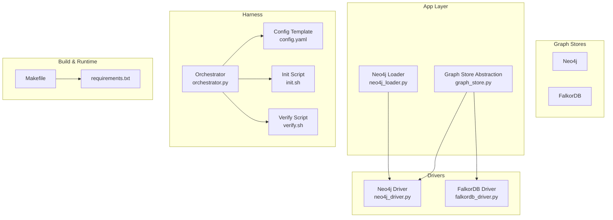
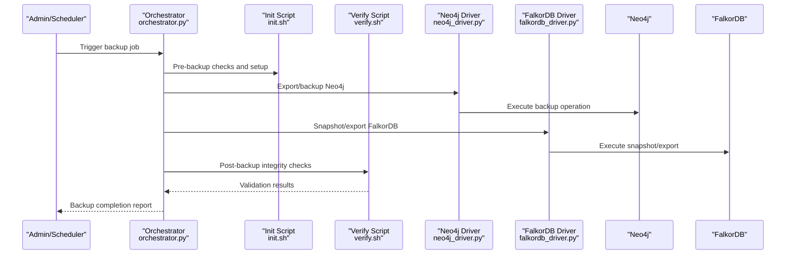
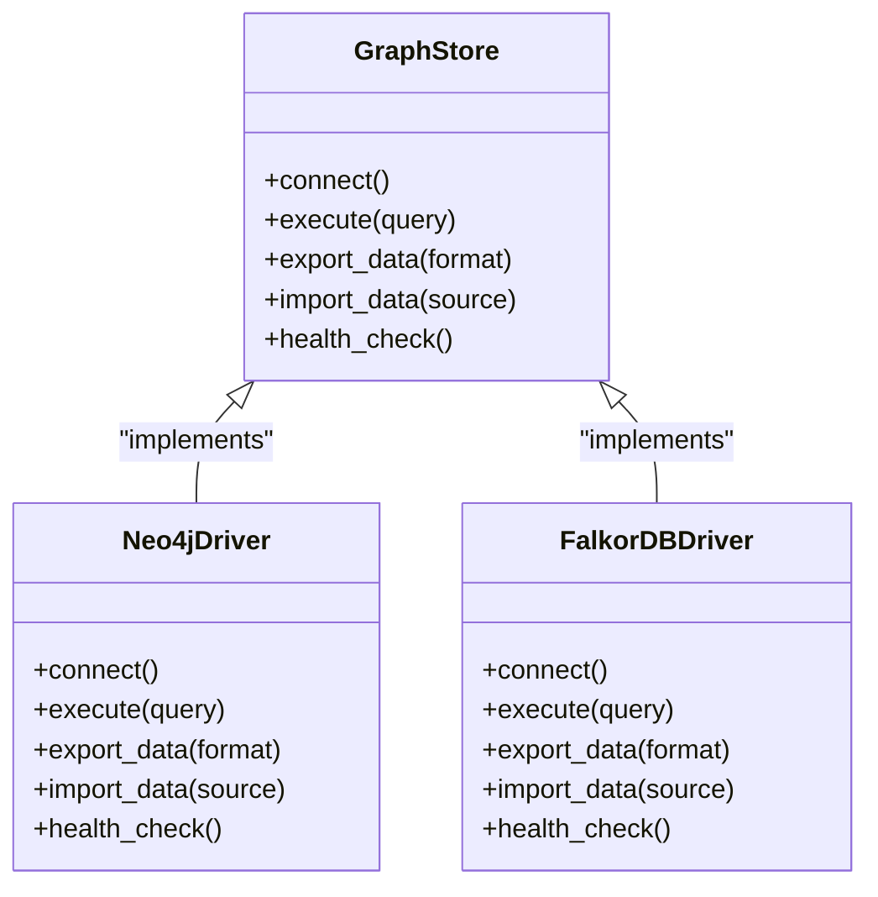
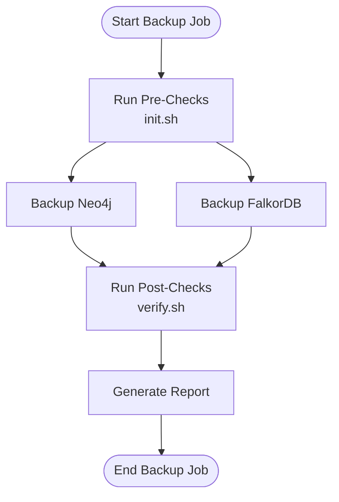
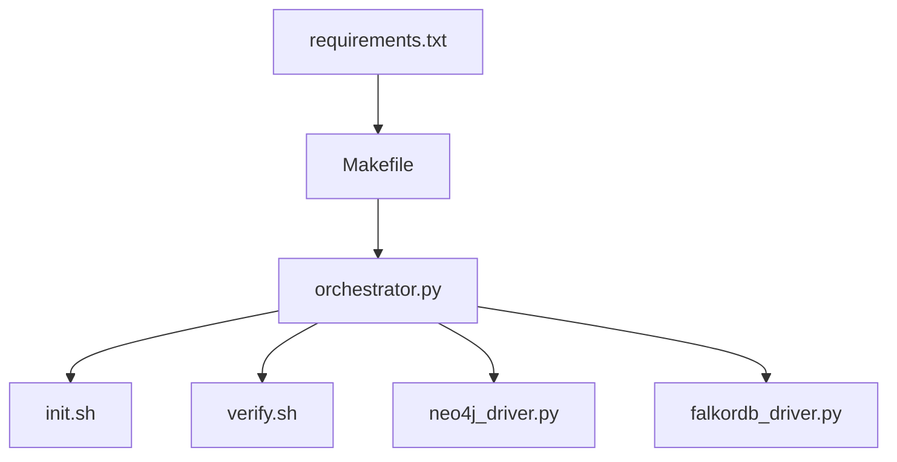

# Backup & Recovery

<cite>
**Referenced Files in This Document**
- [neo4j_driver.py](file://code-tiny/tools/graph/driver/neo4j_driver.py)
- [falkordb_driver.py](file://code-tiny/tools/graph/driver/falkordb_driver.py)
- [graph_store.py](file://doc-tiny/graph_store.py)
- [neo4j_loader.py](file://doc-tiny/neo4j_loader.py)
- [harness_config.py](file://code-tiny/tools/common/harness_config.py)
- [config.yaml](file://harness/templates/config.yaml)
- [init.sh](file://harness/scripts/init.sh)
- [orchestrator.py](file://harness/scripts/orchestrator.py)
- [verify.sh](file://harness/scripts/verify.sh)
- [Makefile](file://Makefile)
- [requirements.txt](file://requirements.txt)
</cite>

## Table of Contents
1. [Introduction](#introduction)
2. [Project Structure](#project-structure)
3. [Core Components](#core-components)
4. [Architecture Overview](#architecture-overview)
5. [Detailed Component Analysis](#detailed-component-analysis)
6. [Dependency Analysis](#dependency-analysis)
7. [Performance Considerations](#performance-considerations)
8. [Troubleshooting Guide](#troubleshooting-guide)
9. [Conclusion](#conclusion)
10. [Appendices](#appendices)

## Introduction
This document provides comprehensive backup and recovery guidance for Cortex Harness production environments. It covers automated backup strategies for Neo4j and FalkorDB graph databases, including full backups, incremental backups, and point-in-time recovery (PITR). It also documents procedures for analysis caches, configuration files, and user-generated content, along with disaster recovery workflows, validation steps, RPO/RTO definitions, cross-region replication strategies, encryption and access control, and testing procedures for restoration and recovery validation.

## Project Structure
Cortex Harness integrates with two primary graph stores: Neo4j and FalkorDB. The codebase includes drivers for both, a shared graph store abstraction used by documentation tools, and harness templates and scripts that orchestrate initialization and verification tasks. Configuration is managed via YAML templates and runtime config utilities.

**Diagram sources**
- [neo4j_driver.py](file://code-tiny/tools/graph/driver/neo4j_driver.py)
- [falkordb_driver.py](file://code-tiny/tools/graph/driver/falkordb_driver.py)
- [graph_store.py](file://doc-tiny/graph_store.py)
- [neo4j_loader.py](file://doc-tiny/neo4j_loader.py)
- [config.yaml](file://harness/templates/config.yaml)
- [init.sh](file://harness/scripts/init.sh)
- [orchestrator.py](file://harness/scripts/orchestrator.py)
- [verify.sh](file://harness/scripts/verify.sh)
- [Makefile](file://Makefile)
- [requirements.txt](file://requirements.txt)

**Section sources**
- [neo4j_driver.py](file://code-tiny/tools/graph/driver/neo4j_driver.py)
- [falkordb_driver.py](file://code-tiny/tools/graph/driver/falkordb_driver.py)
- [graph_store.py](file://doc-tiny/graph_store.py)
- [neo4j_loader.py](file://doc-tiny/neo4j_loader.py)
- [config.yaml](file://harness/templates/config.yaml)
- [init.sh](file://harness/scripts/init.sh)
- [orchestrator.py](file://harness/scripts/orchestrator.py)
- [verify.sh](file://harness/scripts/verify.sh)
- [Makefile](file://Makefile)
- [requirements.txt](file://requirements.txt)

## Core Components
- Graph Drivers: Provide connectivity to Neo4j and FalkorDB. These are the primary integration points for backup and restore operations at the database layer.
- Graph Store Abstraction: A higher-level interface used by application components to interact with graph stores uniformly.
- Neo4j Loader: Utility for loading data into Neo4j; relevant for rehydration after restore or migration.
- Harness Config and Scripts: Templates and scripts that initialize environment state and verify system health; useful as anchors for backup/restore automation.

Key responsibilities:
- Establish connections and execute queries against graph stores.
- Support import/export flows for data movement during backup and restore.
- Provide hooks for orchestrating pre/post operations around maintenance windows.

**Section sources**
- [neo4j_driver.py](file://code-tiny/tools/graph/driver/neo4j_driver.py)
- [falkordb_driver.py](file://code-tiny/tools/graph/driver/falkordb_driver.py)
- [graph_store.py](file://doc-tiny/graph_store.py)
- [neo4j_loader.py](file://doc-tiny/neo4j_loader.py)
- [config.yaml](file://harness/templates/config.yaml)
- [init.sh](file://harness/scripts/init.sh)
- [orchestrator.py](file://harness/scripts/orchestrator.py)
- [verify.sh](file://harness/scripts/verify.sh)

## Architecture Overview
The backup and recovery architecture centers on the graph store drivers and harness orchestration. Backups can be performed using native database mechanisms (e.g., Neo4j backup tooling, FalkorDB snapshots), while application-layer exports leverage driver APIs. Orchestration scripts coordinate pre-backup quiescing, execution, post-backup verification, and retention management.

**Diagram sources**
- [orchestrator.py](file://harness/scripts/orchestrator.py)
- [init.sh](file://harness/scripts/init.sh)
- [verify.sh](file://harness/scripts/verify.sh)
- [neo4j_driver.py](file://code-tiny/tools/graph/driver/neo4j_driver.py)
- [falkordb_driver.py](file://code-tiny/tools/graph/driver/falkordb_driver.py)

## Detailed Component Analysis

### Neo4j Backup and Recovery
- Full backups: Use Neo4j’s native backup tooling to create consistent snapshots. Ensure transaction logs are available for PITR.
- Incremental backups: Leverage continuous WAL/transaction log shipping to capture changes between full backups.
- Point-in-time recovery: Restore from the latest full backup and replay transaction logs up to the desired timestamp.
- Application-layer export: As a fallback or for selective data, use the Neo4j driver to export nodes and relationships to structured formats.

Operational considerations:
- Schedule full backups at low-traffic periods.
- Continuously ship transaction logs to offsite storage.
- Validate checksums and metadata after each backup.
- Maintain retention policies aligned with RPO targets.

**Section sources**
- [neo4j_driver.py](file://code-tiny/tools/graph/driver/neo4j_driver.py)
- [neo4j_loader.py](file://doc-tiny/neo4j_loader.py)

### FalkorDB Backup and Recovery
- Snapshots: Use FalkorDB’s snapshotting capabilities to capture consistent states.
- Incremental backups: If supported by your deployment, enable append-only log shipping to minimize RPO.
- Restoration: Restore from the most recent snapshot and apply any incremental logs if applicable.
- Application-layer export: Use the FalkorDB driver to export datasets when needed.

Operational considerations:
- Coordinate snapshot timing with write-heavy workloads to reduce impact.
- Store snapshots in durable, encrypted storage with versioning.
- Periodically test restore procedures to ensure recoverability.

**Section sources**
- [falkordb_driver.py](file://code-tiny/tools/graph/driver/falkordb_driver.py)

### Graph Store Abstraction and Data Flows
The graph store abstraction provides a unified interface across Neo4j and FalkorDB. Backup and restore flows should route through this abstraction where possible to maintain consistency and simplify multi-store scenarios.

**Diagram sources**
- [graph_store.py](file://doc-tiny/graph_store.py)
- [neo4j_driver.py](file://code-tiny/tools/graph/driver/neo4j_driver.py)
- [falkordb_driver.py](file://code-tiny/tools/graph/driver/falkordb_driver.py)

**Section sources**
- [graph_store.py](file://doc-tiny/graph_store.py)
- [neo4j_driver.py](file://code-tiny/tools/graph/driver/neo4j_driver.py)
- [falkordb_driver.py](file://code-tiny/tools/graph/driver/falkordb_driver.py)

### Configuration and User Content
- Configuration files: Back up harness configuration templates and runtime settings. Changes here affect behavior and must be restored precisely.
- User-generated content: Include repositories, artifacts, and workspace directories under version control or dedicated backup paths.
- Analysis caches: Cache directories may contain derived data; include them in backups if they significantly impact recovery time.

Best practices:
- Version configuration files alongside application releases.
- Separate sensitive secrets from general configuration; back up secrets securely.
- Apply retention policies per data sensitivity and compliance requirements.

**Section sources**
- [config.yaml](file://harness/templates/config.yaml)
- [harness_config.py](file://code-tiny/tools/common/harness_config.py)

### Orchestration and Verification
- Orchestration: Use the orchestrator script to sequence pre-checks, backup execution, and post-validation.
- Initialization: The init script can prepare environments before restore, ensuring dependencies are ready.
- Verification: The verify script performs health checks and basic integrity validations post-restore.

**Diagram sources**
- [orchestrator.py](file://harness/scripts/orchestrator.py)
- [init.sh](file://harness/scripts/init.sh)
- [verify.sh](file://harness/scripts/verify.sh)

**Section sources**
- [orchestrator.py](file://harness/scripts/orchestrator.py)
- [init.sh](file://harness/scripts/init.sh)
- [verify.sh](file://harness/scripts/verify.sh)

## Dependency Analysis
Backup and recovery depend on:
- Database drivers for connectivity and data movement.
- Harness scripts for orchestration and validation.
- Build/runtime manifests for dependency alignment.

**Diagram sources**
- [requirements.txt](file://requirements.txt)
- [Makefile](file://Makefile)
- [orchestrator.py](file://harness/scripts/orchestrator.py)
- [init.sh](file://harness/scripts/init.sh)
- [verify.sh](file://harness/scripts/verify.sh)
- [neo4j_driver.py](file://code-tiny/tools/graph/driver/neo4j_driver.py)
- [falkordb_driver.py](file://code-tiny/tools/graph/driver/falkordb_driver.py)

**Section sources**
- [requirements.txt](file://requirements.txt)
- [Makefile](file://Makefile)
- [orchestrator.py](file://harness/scripts/orchestrator.py)
- [init.sh](file://harness/scripts/init.sh)
- [verify.sh](file://harness/scripts/verify.sh)
- [neo4j_driver.py](file://code-tiny/tools/graph/driver/neo4j_driver.py)
- [falkordb_driver.py](file://code-tiny/tools/graph/driver/falkordb_driver.py)

## Performance Considerations
- Schedule heavy backups during off-peak hours to minimize impact on query latency.
- Use incremental backups and continuous log shipping to reduce backup window size.
- Parallelize non-conflicting operations (e.g., exporting different namespaces) while respecting database limits.
- Monitor I/O and network throughput; tune buffer sizes and concurrency based on hardware capacity.
- Compress and deduplicate backups to reduce storage costs and transfer times.

[No sources needed since this section provides general guidance]

## Troubleshooting Guide
Common issues and mitigations:
- Connectivity failures: Validate credentials, firewall rules, and service endpoints before initiating backups.
- Inconsistent snapshots: Ensure no active writes during snapshot creation or use database-native consistency guarantees.
- Integrity errors: Compare checksums and record counts between source and restored datasets.
- Orchestration timeouts: Increase timeout thresholds for large datasets and monitor resource utilization.

Validation steps:
- Run the verification script post-restore to confirm service health and basic query responses.
- Perform sample queries against restored graphs to validate schema and data integrity.
- Re-run critical ingestion pipelines to ensure downstream systems function correctly.

**Section sources**
- [verify.sh](file://harness/scripts/verify.sh)
- [orchestrator.py](file://harness/scripts/orchestrator.py)

## Conclusion
A robust backup and recovery strategy for Cortex Harness combines native database mechanisms with application-layer exports, orchestrated by harness scripts and validated through verification routines. By implementing full and incremental backups, enabling PITR where feasible, securing and encrypting backups, and regularly testing restoration procedures, production environments can achieve defined RPO/RTO targets and maintain high availability.

[No sources needed since this section summarizes without analyzing specific files]

## Appendices

### RPO and RTO Definitions
- Recovery Point Objective (RPO): Maximum tolerable data loss measured in time. For example, 1 hour RPO implies backups must occur at least every hour.
- Recovery Time Objective (RTO): Maximum acceptable downtime. For example, 4-hour RTO implies restoration and validation must complete within four hours.

Recommended baselines:
- Minor failure (single node/database instance): RPO ≤ 1 hour, RTO ≤ 2 hours.
- Major failure (region outage): RPO ≤ 15 minutes with continuous log shipping, RTO ≤ 4 hours with cross-region replication.

[No sources needed since this section provides general guidance]

### Cross-Region Replication Strategies
- Continuous log shipping: Stream transaction logs to a secondary region for near-zero RPO.
- Read replicas: Maintain read-only replicas in another region for failover and reduced latency.
- Snapshot replication: Periodically replicate snapshots to offsite storage with encryption and integrity checks.
- DNS-based failover: Route traffic to the healthy region automatically upon detection of primary failure.

[No sources needed since this section provides general guidance]

### Encryption, Secure Storage, and Access Control
- Encrypt backups at rest using strong algorithms and manage keys via a centralized key management service.
- Enforce least-privilege access controls for backup storage buckets and vaults.
- Enable audit logging for all backup and restore operations.
- Rotate credentials and keys periodically and enforce secure transmission channels.

[No sources needed since this section provides general guidance]

### Testing Procedures for Backup Restoration and Recovery Validation
- Create a staging environment mirroring production configurations.
- Restore the latest backup and run the verification script to validate health.
- Execute representative queries and ingestion jobs to confirm data correctness.
- Measure restoration duration and compare against RTO targets.
- Document findings and update procedures as needed.

**Section sources**
- [verify.sh](file://harness/scripts/verify.sh)
- [orchestrator.py](file://harness/scripts/orchestrator.py)