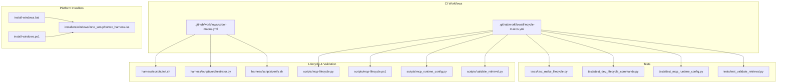
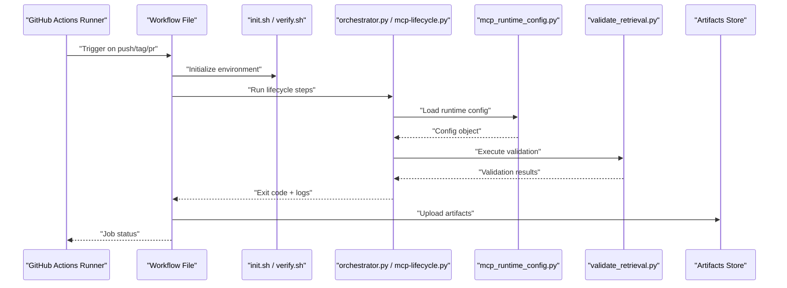
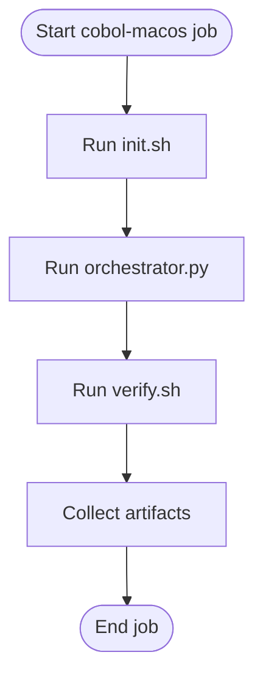
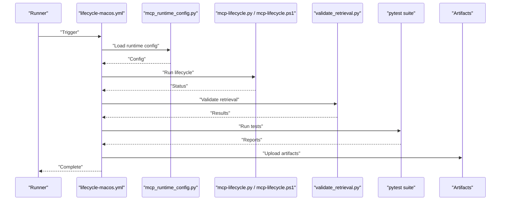
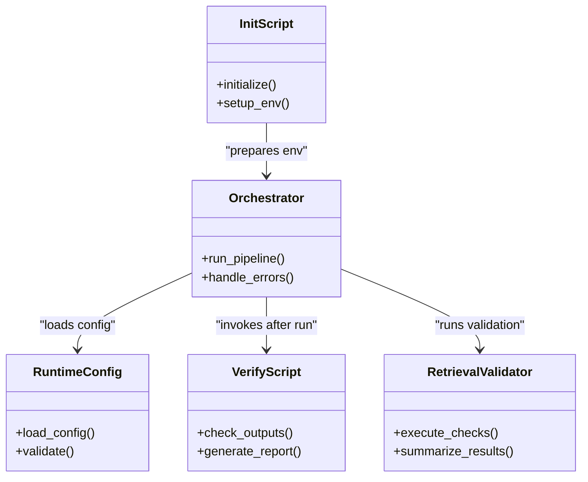
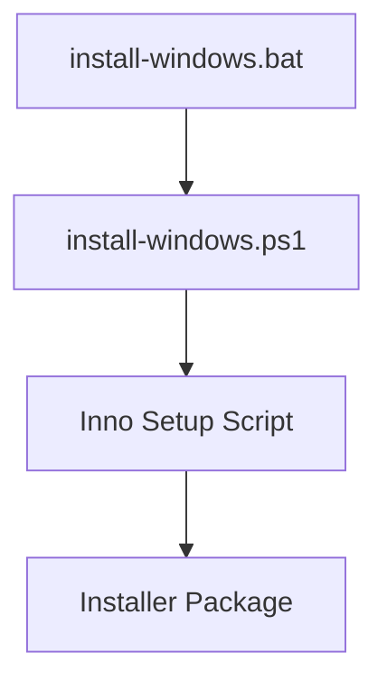
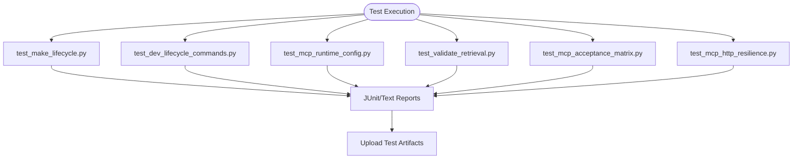
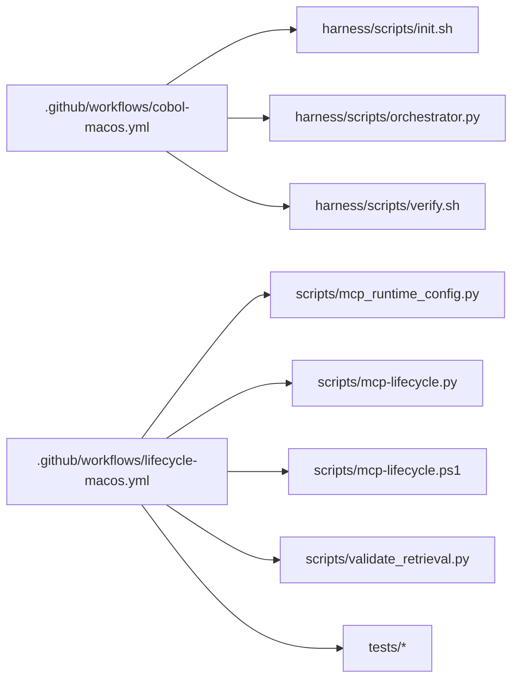

# CI/CD Pipelines & Automation

<cite>
**Referenced Files in This Document**
- [cobol-macos.yml](file://.github/workflows/cobol-macos.yml)
- [lifecycle-macos.yml](file://.github/workflows/lifecycle-macos.yml)
- [Makefile](file://Makefile)
- [dev.sh](file://dev.sh)
- [dev.bat](file://dev.bat)
- [dev.ps1](file://dev.ps1)
- [install-windows.bat](file://install-windows.bat)
- [install-windows.ps1](file://install-windows.ps1)
- [README.md](file://ReadMe.md)
- [INSTALLER_GUIDE.md](file://INSTALLER_GUIDE.md)
- [harness/scripts/init.sh](file://harness/scripts/init.sh)
- [harness/scripts/orchestrator.py](file://harness/scripts/orchestrator.py)
- [harness/scripts/verify.sh](file://harness/scripts/verify.sh)
- [harness/templates/config.yaml](file://harness/templates/config.yaml)
- [harness/templates/feature_template.json](file://harness/templates/feature_template.json)
- [harness/templates/session-template.json](file://harness/templates/session-template.json)
- [harness/templates/progress.md](file://harness/templates/progress.md)
- [harness/templates/agent.md](file://harness/templates/AGENT.md)
- [harness/templates/state/feature_list.json](file://harness/templates/state/feature_list.json)
- [scripts/mcp-lifecycle.py](file://scripts/mcp-lifecycle.py)
- [scripts/mcp-lifecycle.ps1](file://scripts/mcp-lifecycle.ps1)
- [scripts/mcp_runtime_config.py](file://scripts/mcp_runtime_config.py)
- [scripts/validate_retrieval.py](file://scripts/validate_retrieval.py)
- [tests/test_make_lifecycle.py](file://tests/test_make_lifecycle.py)
- [tests/test_dev_lifecycle_commands.py](file://tests/test_dev_lifecycle_commands.py)
- [tests/test_mcp_acceptance_matrix.py](file://tests/test_mcp_acceptance_matrix.py)
- [tests/test_mcp_http_resilience.py](file://tests/test_mcp_http_resilience.py)
- [tests/test_mcp_runtime_config.py](file://tests/test_mcp_runtime_config.py)
- [tests/test_validate_retrieval.py](file://tests/test_validate_retrieval.py)
</cite>

## Table of Contents
1. [Introduction](#introduction)
2. [Project Structure](#project-structure)
3. [Core Components](#core-components)
4. [Architecture Overview](#architecture-overview)
5. [Detailed Component Analysis](#detailed-component-analysis)
6. [Dependency Analysis](#dependency-analysis)
7. [Performance Considerations](#performance-considerations)
8. [Troubleshooting Guide](#troubleshooting-guide)
9. [Conclusion](#conclusion)
10. [Appendices](#appendices)

## Introduction
This document describes the CI/CD pipelines and automation for Cortex Harness, focusing on GitHub Actions workflows, build and test stages, artifact management, environment-specific configurations, release processes, security controls, and monitoring strategies. It synthesizes existing workflow files and supporting scripts to provide a comprehensive guide for automated development and deployment across multiple platforms.

## Project Structure
The repository includes GitHub Actions workflows under .github/workflows, lifecycle and validation scripts under harness/scripts and scripts, platform installers under installers, and tests under tests. The Makefile provides unified targets that are commonly used by CI jobs.

**Diagram sources**
- [cobol-macos.yml](file://.github/workflows/cobol-macos.yml)
- [lifecycle-macos.yml](file://.github/workflows/lifecycle-macos.yml)
- [harness/scripts/init.sh](file://harness/scripts/init.sh)
- [harness/scripts/orchestrator.py](file://harness/scripts/orchestrator.py)
- [harness/scripts/verify.sh](file://harness/scripts/verify.sh)
- [scripts/mcp-lifecycle.py](file://scripts/mcp-lifecycle.py)
- [scripts/mcp-lifecycle.ps1](file://scripts/mcp-lifecycle.ps1)
- [scripts/mcp_runtime_config.py](file://scripts/mcp_runtime_config.py)
- [scripts/validate_retrieval.py](file://scripts/validate_retrieval.py)
- [install-windows.bat](file://install-windows.bat)
- [install-windows.ps1](file://install-windows.ps1)
- [cortex_harness.iss](file://installers/windows/inno_setup/cortex_harness.iss)
- [test_make_lifecycle.py](file://tests/test_make_lifecycle.py)
- [test_dev_lifecycle_commands.py](file://tests/test_dev_lifecycle_commands.py)
- [test_mcp_runtime_config.py](file://tests/test_mcp_runtime_config.py)
- [test_validate_retrieval.py](file://tests/test_validate_retrieval.py)

**Section sources**
- [cobol-macos.yml](file://.github/workflows/cobol-macos.yml)
- [lifecycle-macos.yml](file://.github/workflows/lifecycle-macos.yml)
- [Makefile](file://Makefile)
- [README.md](file://ReadMe.md)

## Core Components
- GitHub Actions workflows:
  - cobol-macos.yml: macOS-focused pipeline for Cobol analyzer integration and related tasks.
  - lifecycle-macos.yml: macOS-focused pipeline orchestrating lifecycle commands, runtime configuration, and validation.
- Lifecycle and validation scripts:
  - harness/scripts/init.sh: Initializes harness context and prerequisites.
  - harness/scripts/orchestrator.py: Coordinates multi-step operations (e.g., scans, syncs).
  - harness/scripts/verify.sh: Validates outputs and health checks post-run.
  - scripts/mcp-lifecycle.py and scripts/mcp-lifecycle.ps1: Cross-platform lifecycle orchestration for MCP-related flows.
  - scripts/mcp_runtime_config.py: Loads and validates runtime configuration for MCP components.
  - scripts/validate_retrieval.py: End-to-end retrieval validation against fixtures or live stores.
- Platform installers:
  - Windows installer entry points and Inno Setup script for packaging.
- Tests:
  - Unit and integration tests covering lifecycle commands, runtime config, and retrieval validation.

**Section sources**
- [cobol-macos.yml](file://.github/workflows/cobol-macos.yml)
- [lifecycle-macos.yml](file://.github/workflows/lifecycle-macos.yml)
- [harness/scripts/init.sh](file://harness/scripts/init.sh)
- [harness/scripts/orchestrator.py](file://harness/scripts/orchestrator.py)
- [harness/scripts/verify.sh](file://harness/scripts/verify.sh)
- [scripts/mcp-lifecycle.py](file://scripts/mcp-lifecycle.py)
- [scripts/mcp-lifecycle.ps1](file://scripts/mcp-lifecycle.ps1)
- [scripts/mcp_runtime_config.py](file://scripts/mcp_runtime_config.py)
- [scripts/validate_retrieval.py](file://scripts/validate_retrieval.py)
- [install-windows.bat](file://install-windows.bat)
- [install-windows.ps1](file://install-windows.ps1)
- [cortex_harness.iss](file://installers/windows/inno_setup/cortex_harness.iss)
- [test_make_lifecycle.py](file://tests/test_make_lifecycle.py)
- [test_dev_lifecycle_commands.py](file://tests/test_dev_lifecycle_commands.py)
- [test_mcp_runtime_config.py](file://tests/test_mcp_runtime_config.py)
- [test_validate_retrieval.py](file://tests/test_validate_retrieval.py)

## Architecture Overview
The CI/CD architecture centers on two primary workflows targeting macOS runners. They invoke shared lifecycle and verification scripts, run tests, and produce artifacts such as logs, reports, and installers. The following diagram maps the high-level flow from trigger to artifact publication.

**Diagram sources**
- [cobol-macos.yml](file://.github/workflows/cobol-macos.yml)
- [lifecycle-macos.yml](file://.github/workflows/lifecycle-macos.yml)
- [harness/scripts/init.sh](file://harness/scripts/init.sh)
- [harness/scripts/orchestrator.py](file://harness/scripts/orchestrator.py)
- [harness/scripts/verify.sh](file://harness/scripts/verify.sh)
- [scripts/mcp-lifecycle.py](file://scripts/mcp-lifecycle.py)
- [scripts/mcp_runtime_config.py](file://scripts/mcp_runtime_config.py)
- [scripts/validate_retrieval.py](file://scripts/validate_retrieval.py)

## Detailed Component Analysis

### Workflow: cobol-macos.yml
Purpose:
- Executes macOS-based steps focused on Cobol analyzer integration and related validations.
- Invokes initialization, orchestration, and verification scripts.
- Produces artifacts for downstream consumption.

Key responsibilities:
- Set up runner and dependencies.
- Run init and orchestration phases.
- Execute verification and reporting.
- Upload artifacts and mark job success/failure.

**Diagram sources**
- [cobol-macos.yml](file://.github/workflows/cobol-macos.yml)
- [harness/scripts/init.sh](file://harness/scripts/init.sh)
- [harness/scripts/orchestrator.py](file://harness/scripts/orchestrator.py)
- [harness/scripts/verify.sh](file://harness/scripts/verify.sh)

**Section sources**
- [cobol-macos.yml](file://.github/workflows/cobol-macos.yml)
- [harness/scripts/init.sh](file://harness/scripts/init.sh)
- [harness/scripts/orchestrator.py](file://harness/scripts/orchestrator.py)
- [harness/scripts/verify.sh](file://harness/scripts/verify.sh)

### Workflow: lifecycle-macos.yml
Purpose:
- Orchestrates lifecycle commands, runtime configuration loading, and retrieval validation on macOS.
- Runs unit/integration tests and publishes artifacts.

Key responsibilities:
- Configure Python and dependencies.
- Load runtime configuration via mcp_runtime_config.py.
- Execute MCP lifecycle scripts (Python and PowerShell variants).
- Run validation and tests.
- Publish artifacts and results.

**Diagram sources**
- [lifecycle-macos.yml](file://.github/workflows/lifecycle-macos.yml)
- [scripts/mcp_runtime_config.py](file://scripts/mcp_runtime_config.py)
- [scripts/mcp-lifecycle.py](file://scripts/mcp-lifecycle.py)
- [scripts/mcp-lifecycle.ps1](file://scripts/mcp-lifecycle.ps1)
- [scripts/validate_retrieval.py](file://scripts/validate_retrieval.py)

**Section sources**
- [lifecycle-macos.yml](file://.github/workflows/lifecycle-macos.yml)
- [scripts/mcp_runtime_config.py](file://scripts/mcp_runtime_config.py)
- [scripts/mcp-lifecycle.py](file://scripts/mcp-lifecycle.py)
- [scripts/mcp-lifecycle.ps1](file://scripts/mcp-lifecycle.ps1)
- [scripts/validate_retrieval.py](file://scripts/validate_retrieval.py)

### Lifecycle Scripts and Runtime Configuration
- init.sh: Prepares harness context and environment variables required by subsequent steps.
- orchestrator.py: Coordinates complex operations such as scanning, syncing, and graph updates.
- verify.sh: Performs post-run checks and generates verification reports.
- mcp_runtime_config.py: Centralizes runtime configuration loading and validation.
- validate_retrieval.py: Executes retrieval validation using configured endpoints and fixtures.

**Diagram sources**
- [harness/scripts/init.sh](file://harness/scripts/init.sh)
- [harness/scripts/orchestrator.py](file://harness/scripts/orchestrator.py)
- [harness/scripts/verify.sh](file://harness/scripts/verify.sh)
- [scripts/mcp_runtime_config.py](file://scripts/mcp_runtime_config.py)
- [scripts/validate_retrieval.py](file://scripts/validate_retrieval.py)

**Section sources**
- [harness/scripts/init.sh](file://harness/scripts/init.sh)
- [harness/scripts/orchestrator.py](file://harness/scripts/orchestrator.py)
- [harness/scripts/verify.sh](file://harness/scripts/verify.sh)
- [scripts/mcp_runtime_config.py](file://scripts/mcp_runtime_config.py)
- [scripts/validate_retrieval.py](file://scripts/validate_retrieval.py)

### Platform Installers and Packaging
- Windows installer entry points:
  - install-windows.bat and install-windows.ps1 bootstrap installation routines.
- Inno Setup script:
  - installers/windows/inno_setup/cortex_harness.iss defines packaging metadata and output artifacts.

**Diagram sources**
- [install-windows.bat](file://install-windows.bat)
- [install-windows.ps1](file://install-windows.ps1)
- [cortex_harness.iss](file://installers/windows/inno_setup/cortex_harness.iss)

**Section sources**
- [install-windows.bat](file://install-windows.bat)
- [install-windows.ps1](file://install-windows.ps1)
- [INSTALLER_GUIDE.md](file://INSTALLER_GUIDE.md)
- [cortex_harness.iss](file://installers/windows/inno_setup/cortex_harness.iss)

### Test Coverage and Validation
- Lifecycle and command tests:
  - tests/test_make_lifecycle.py validates Makefile-driven lifecycle targets.
  - tests/test_dev_lifecycle_commands.py verifies dev lifecycle commands.
- Runtime configuration and retrieval:
  - tests/test_mcp_runtime_config.py ensures config loading and validation.
  - tests/test_validate_retrieval.py confirms retrieval behavior.
- Acceptance and resilience:
  - tests/test_mcp_acceptance_matrix.py and tests/test_mcp_http_resilience.py cover acceptance criteria and HTTP resilience.

**Diagram sources**
- [test_make_lifecycle.py](file://tests/test_make_lifecycle.py)
- [test_dev_lifecycle_commands.py](file://tests/test_dev_lifecycle_commands.py)
- [test_mcp_runtime_config.py](file://tests/test_mcp_runtime_config.py)
- [test_validate_retrieval.py](file://tests/test_validate_retrieval.py)
- [test_mcp_acceptance_matrix.py](file://tests/test_mcp_acceptance_matrix.py)
- [test_mcp_http_resilience.py](file://tests/test_mcp_http_resilience.py)

**Section sources**
- [test_make_lifecycle.py](file://tests/test_make_lifecycle.py)
- [test_dev_lifecycle_commands.py](file://tests/test_dev_lifecycle_commands.py)
- [test_mcp_runtime_config.py](file://tests/test_mcp_runtime_config.py)
- [test_validate_retrieval.py](file://tests/test_validate_retrieval.py)
- [test_mcp_acceptance_matrix.py](file://tests/test_mcp_acceptance_matrix.py)
- [test_mcp_http_resilience.py](file://tests/test_mcp_http_resilience.py)

## Dependency Analysis
The workflows depend on shared scripts and configuration modules. The following diagram shows key relationships between workflow files and their invoked components.

**Diagram sources**
- [cobol-macos.yml](file://.github/workflows/cobol-macos.yml)
- [lifecycle-macos.yml](file://.github/workflows/lifecycle-macos.yml)
- [harness/scripts/init.sh](file://harness/scripts/init.sh)
- [harness/scripts/orchestrator.py](file://harness/scripts/orchestrator.py)
- [harness/scripts/verify.sh](file://harness/scripts/verify.sh)
- [scripts/mcp_runtime_config.py](file://scripts/mcp_runtime_config.py)
- [scripts/mcp-lifecycle.py](file://scripts/mcp-lifecycle.py)
- [scripts/mcp-lifecycle.ps1](file://scripts/mcp-lifecycle.ps1)
- [scripts/validate_retrieval.py](file://scripts/validate_retrieval.py)
- [test_make_lifecycle.py](file://tests/test_make_lifecycle.py)
- [test_dev_lifecycle_commands.py](file://tests/test_dev_lifecycle_commands.py)
- [test_mcp_runtime_config.py](file://tests/test_mcp_runtime_config.py)
- [test_validate_retrieval.py](file://tests/test_validate_retrieval.py)

**Section sources**
- [cobol-macos.yml](file://.github/workflows/cobol-macos.yml)
- [lifecycle-macos.yml](file://.github/workflows/lifecycle-macos.yml)
- [Makefile](file://Makefile)

## Performance Considerations
- Parallelization:
  - Use matrix strategies to run tests and validations concurrently across OS versions and Python versions where applicable.
- Caching:
  - Cache Python dependencies and toolchains to reduce setup time.
- Incremental execution:
  - Leverage incremental sync and targeted test runs based on changed files to minimize CI duration.
- Artifact minimization:
  - Compress large artifacts and upload only necessary outputs to reduce storage and transfer overhead.

[No sources needed since this section provides general guidance]

## Troubleshooting Guide
Common issues and resolutions:
- Initialization failures:
  - Check harness/scripts/init.sh for environment variable requirements and dependency availability.
- Orchestration errors:
  - Inspect harness/scripts/orchestrator.py logs and exit codes; ensure runtime configuration is valid.
- Verification failures:
  - Review harness/scripts/verify.sh outputs and generated reports for failing assertions.
- Runtime configuration problems:
  - Validate configuration with scripts/mcp_runtime_config.py and ensure secrets are correctly provided via GitHub Secrets.
- Retrieval validation issues:
  - Confirm endpoint connectivity and fixture data using scripts/validate_retrieval.py.

**Section sources**
- [harness/scripts/init.sh](file://harness/scripts/init.sh)
- [harness/scripts/orchestrator.py](file://harness/scripts/orchestrator.py)
- [harness/scripts/verify.sh](file://harness/scripts/verify.sh)
- [scripts/mcp_runtime_config.py](file://scripts/mcp_runtime_config.py)
- [scripts/validate_retrieval.py](file://scripts/validate_retrieval.py)

## Conclusion
Cortex Harness leverages GitHub Actions workflows to automate testing, building, and validation across macOS environments. Shared lifecycle and verification scripts centralize operational logic, while tests ensure reliability. Installer packaging supports Windows distribution. Extending these foundations with additional workflows, artifact signing, approvals, and blue-green deployment strategies will further strengthen CI/CD robustness and safety.

[No sources needed since this section summarizes without analyzing specific files]

## Appendices

### Environment-Specific Configuration
- Development:
  - Local dev helpers: dev.sh, dev.bat, dev.ps1 streamline local runs.
  - Templates: harness/templates/config.yaml and feature/session templates define defaults.
- Staging:
  - Use separate GitHub Environments with protected branches and required reviewers.
- Production:
  - Require manual approvals and restrict triggers to tags or main branch merges.

**Section sources**
- [dev.sh](file://dev.sh)
- [dev.bat](file://dev.bat)
- [dev.ps1](file://dev.ps1)
- [config.yaml](file://harness/templates/config.yaml)
- [feature_template.json](file://harness/templates/feature_template.json)
- [session-template.json](file://harness/templates/session-template.json)
- [progress.md](file://harness/templates/progress.md)
- [AGENT.md](file://harness/templates/AGENT.md)
- [feature_list.json](file://harness/templates/state/feature_list.json)

### Automated Release Processes
- Version tagging:
  - Trigger release workflows on annotated tags.
- Changelog generation:
  - Generate changelogs from commit history and PR descriptions.
- Artifact publishing:
  - Publish installers and logs to GitHub Releases or an artifact store.

[No sources needed since this section provides general guidance]

### Rollback and Blue-Green Deployment
- Rollback automation:
  - Re-deploy previous stable version using stored artifacts and environment manifests.
- Blue-green strategy:
  - Maintain parallel environments; switch traffic after validation passes.

[No sources needed since this section provides general guidance]

### Pipeline Security
- Secret management:
  - Store sensitive values in GitHub Secrets and reference them in workflows.
- Signing artifacts:
  - Sign installers and packages using secure keys managed in CI.
- Deployment approvals:
  - Protect production deployments with required reviewers and environment rules.

[No sources needed since this section provides general guidance]

### Monitoring and Alerting
- Failure notifications:
  - Integrate Slack or email alerts for failed jobs.
- Dashboards:
  - Track pipeline durations, flaky tests, and artifact sizes over time.
- Health checks:
  - Add smoke tests post-deployment to confirm service readiness.

[No sources needed since this section provides general guidance]