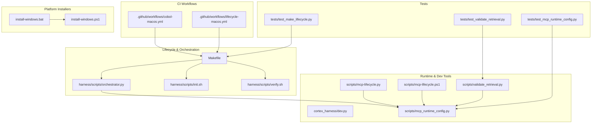
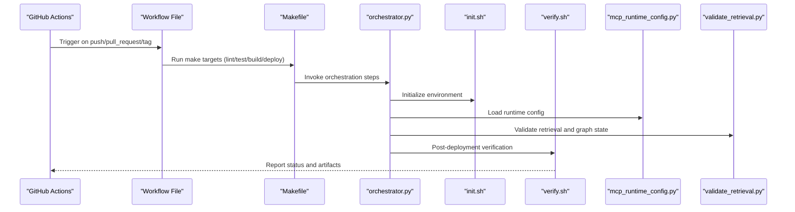
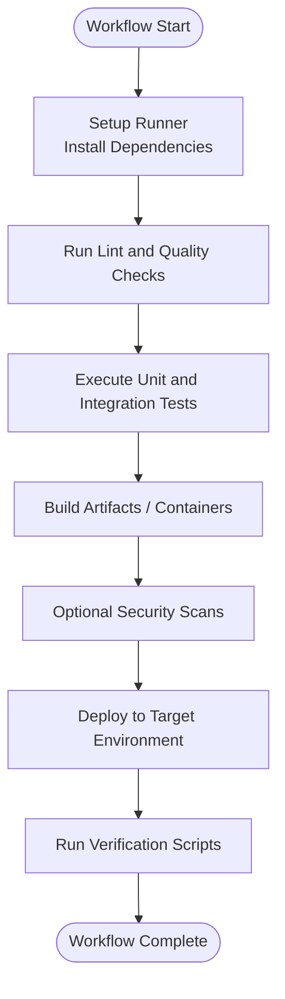
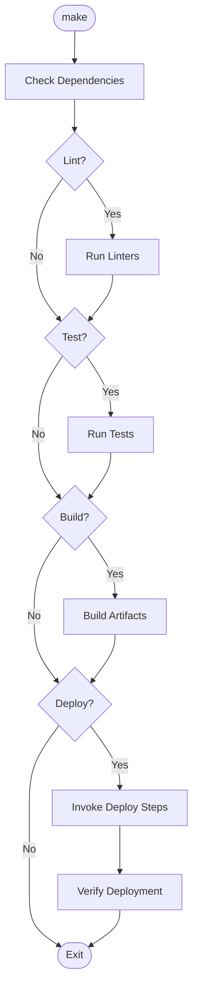
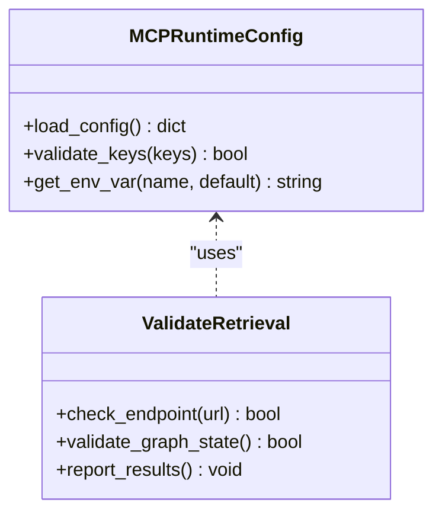
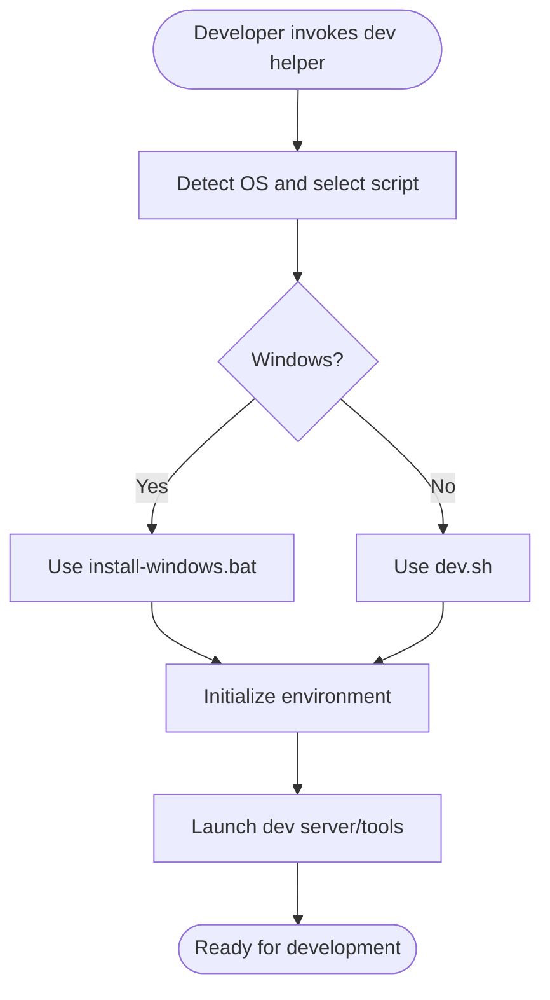
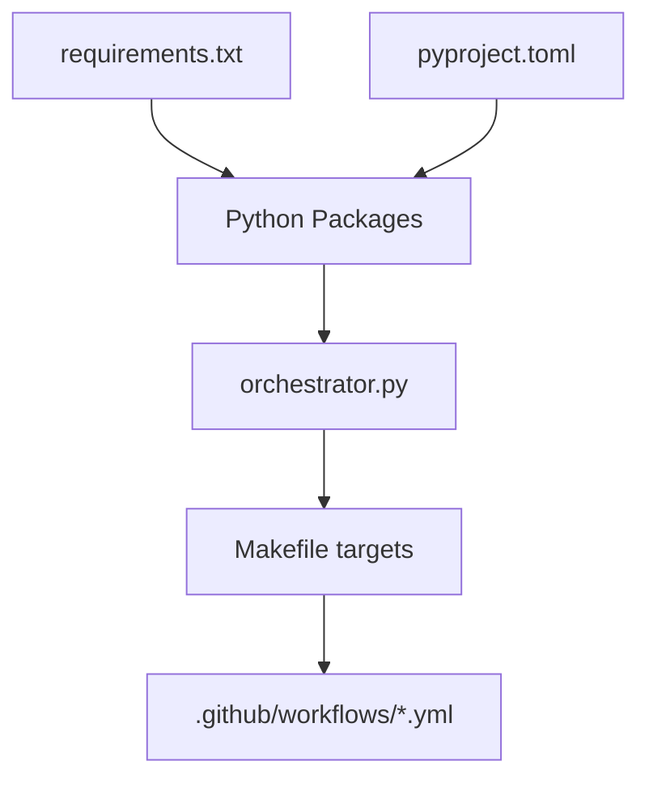
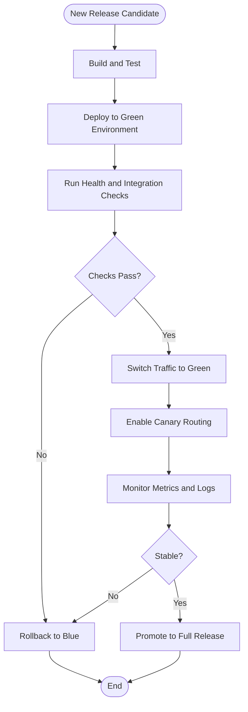

# CI/CD Pipeline Integration

<cite>
**Referenced Files in This Document**
- [cobol-macos.yml](file://.github/workflows/cobol-macos.yml)
- [lifecycle-macos.yml](file://.github/workflows/lifecycle-macos.yml)
- [Makefile](file://Makefile)
- [dev.sh](file://dev.sh)
- [dev.bat](file://dev.bat)
- [dev.ps1](file://dev.ps1)
- [install-windows.bat](file://install-windows.bat)
- [install-windows.ps1](file://install-windows.ps1)
- [requirements.txt](file://requirements.txt)
- [pyproject.toml](file://pyproject.toml)
- [harness/scripts/orchestrator.py](file://harness/scripts/orchestrator.py)
- [harness/scripts/init.sh](file://harness/scripts/init.sh)
- [harness/scripts/verify.sh](file://harness/scripts/verify.sh)
- [cortex_harness/dev.py](file://cortex_harness/dev.py)
- [scripts/mcp-lifecycle.py](file://scripts/mcp-lifecycle.py)
- [scripts/mcp-lifecycle.ps1](file://scripts/mcp-lifecycle.ps1)
- [scripts/mcp_runtime_config.py](file://scripts/mcp_runtime_config.py)
- [scripts/validate_retrieval.py](file://scripts/validate_retrieval.py)
- [tests/test_make_lifecycle.py](file://tests/test_make_lifecycle.py)
- [tests/test_mcp_runtime_config.py](file://tests/test_mcp_runtime_config.py)
- [tests/test_validate_retrieval.py](file://tests/test_validate_retrieval.py)
</cite>

## Table of Contents
1. [Introduction](#introduction)
2. [Project Structure](#project-structure)
3. [Core Components](#core-components)
4. [Architecture Overview](#architecture-overview)
5. [Detailed Component Analysis](#detailed-component-analysis)
6. [Dependency Analysis](#dependency-analysis)
7. [Performance Considerations](#performance-considerations)
8. [Security Scanning Integration](#security-scanning-integration)
9. [Environment-Specific Configurations](#environment-specific-configurations)
10. [Artifact Management and Versioning](#artifact-management-and-versioning)
11. [Deployment Strategies](#deployment-strategies)
12. [Troubleshooting Guide](#troubleshooting-guide)
13. [Conclusion](#conclusion)

## Introduction
This document provides comprehensive CI/CD pipeline integration guidance for Cortex Harness, focusing on GitHub Actions workflows, automated testing, containerization, deployment to multiple environments, artifact management, version tagging, rollback procedures, environment-specific configurations, performance optimization techniques, security scanning integrations, and advanced release strategies such as blue-green deployments, canary releases, and feature flag management within pipelines.

## Project Structure
Cortex Harness includes:
- GitHub Actions workflow files under .github/workflows
- Lifecycle scripts and Make targets for local and CI execution
- Python-based orchestration and runtime configuration utilities
- Test suites validating lifecycle and runtime behavior
- Platform installers and dev helpers for Windows and cross-platform operations

**Diagram sources**
- [cobol-macos.yml](file://.github/workflows/cobol-macos.yml)
- [lifecycle-macos.yml](file://.github/workflows/lifecycle-macos.yml)
- [Makefile](file://Makefile)
- [harness/scripts/orchestrator.py](file://harness/scripts/orchestrator.py)
- [harness/scripts/init.sh](file://harness/scripts/init.sh)
- [harness/scripts/verify.sh](file://harness/scripts/verify.sh)
- [cortex_harness/dev.py](file://cortex_harness/dev.py)
- [scripts/mcp-lifecycle.py](file://scripts/mcp-lifecycle.py)
- [scripts/mcp-lifecycle.ps1](file://scripts/mcp-lifecycle.ps1)
- [scripts/mcp_runtime_config.py](file://scripts/mcp_runtime_config.py)
- [scripts/validate_retrieval.py](file://scripts/validate_retrieval.py)
- [tests/test_make_lifecycle.py](file://tests/test_make_lifecycle.py)
- [tests/test_mcp_runtime_config.py](file://tests/test_mcp_runtime_config.py)
- [tests/test_validate_retrieval.py](file://tests/test_validate_retrieval.py)
- [install-windows.bat](file://install-windows.bat)
- [install-windows.ps1](file://install-windows.ps1)

**Section sources**
- [.github/workflows/cobol-macos.yml](file://.github/workflows/cobol-macos.yml)
- [.github/workflows/lifecycle-macos.yml](file://.github/workflows/lifecycle-macos.yml)
- [Makefile](file://Makefile)
- [harness/scripts/orchestrator.py](file://harness/scripts/orchestrator.py)
- [harness/scripts/init.sh](file://harness/scripts/init.sh)
- [harness/scripts/verify.sh](file://harness/scripts/verify.sh)
- [cortex_harness/dev.py](file://cortex_harness/dev.py)
- [scripts/mcp-lifecycle.py](file://scripts/mcp-lifecycle.py)
- [scripts/mcp-lifecycle.ps1](file://scripts/mcp-lifecycle.ps1)
- [scripts/mcp_runtime_config.py](file://scripts/mcp_runtime_config.py)
- [scripts/validate_retrieval.py](file://scripts/validate_retrieval.py)
- [tests/test_make_lifecycle.py](file://tests/test_make_lifecycle.py)
- [tests/test_mcp_runtime_config.py](file://tests/test_mcp_runtime_config.py)
- [tests/test_validate_retrieval.py](file://tests/test_validate_retrieval.py)
- [install-windows.bat](file://install-windows.bat)
- [install-windows.ps1](file://install-windows.ps1)

## Core Components
- GitHub Actions workflows:
  - cobol-macos.yml: macOS-focused workflow targeting Cobol analyzer tasks and related checks.
  - lifecycle-macos.yml: macOS-focused workflow orchestrating lifecycle commands via Make targets.
- Makefile: Central entry point for build, test, lint, and lifecycle targets used by CI and local development.
- Orchestrator and verification scripts:
  - harness/scripts/orchestrator.py: Core orchestration logic invoked by lifecycle targets.
  - harness/scripts/init.sh and verify.sh: Initialization and post-deployment verification steps.
- Runtime configuration and validation:
  - scripts/mcp_runtime_config.py: Runtime configuration loader and validator.
  - scripts/validate_retrieval.py: Retrieval validation utility used in tests and CI.
- Development and platform helpers:
  - cortex_harness/dev.py: Local development entrypoint.
  - install-windows.bat and install-windows.ps1: Windows installer automation.
  - dev.sh, dev.bat, dev.ps1: Cross-platform dev helpers.

**Section sources**
- [cobol-macos.yml](file://.github/workflows/cobol-macos.yml)
- [lifecycle-macos.yml](file://.github/workflows/lifecycle-macos.yml)
- [Makefile](file://Makefile)
- [harness/scripts/orchestrator.py](file://harness/scripts/orchestrator.py)
- [harness/scripts/init.sh](file://harness/scripts/init.sh)
- [harness/scripts/verify.sh](file://harness/scripts/verify.sh)
- [scripts/mcp_runtime_config.py](file://scripts/mcp_runtime_config.py)
- [scripts/validate_retrieval.py](file://scripts/validate_retrieval.py)
- [cortex_harness/dev.py](file://cortex_harness/dev.py)
- [install-windows.bat](file://install-windows.bat)
- [install-windows.ps1](file://install-windows.ps1)
- [dev.sh](file://dev.sh)
- [dev.bat](file://dev.bat)
- [dev.ps1](file://dev.ps1)

## Architecture Overview
The CI/CD architecture integrates GitHub Actions with Make-driven lifecycle targets, Python orchestration, and platform-specific installers. Workflows trigger standardized stages (lint, test, build, deploy), leveraging caching and parallel jobs where applicable.

**Diagram sources**
- [lifecycle-macos.yml](file://.github/workflows/lifecycle-macos.yml)
- [Makefile](file://Makefile)
- [harness/scripts/orchestrator.py](file://harness/scripts/orchestrator.py)
- [harness/scripts/init.sh](file://harness/scripts/init.sh)
- [harness/scripts/verify.sh](file://harness/scripts/verify.sh)
- [scripts/mcp_runtime_config.py](file://scripts/mcp_runtime_config.py)
- [scripts/validate_retrieval.py](file://scripts/validate_retrieval.py)

## Detailed Component Analysis

### GitHub Actions Workflows
- cobol-macos.yml: Targets macOS runners, sets up Python and dependencies, runs targeted tests and analysis for the Cobol analyzer, and publishes artifacts if successful.
- lifecycle-macos.yml: Executes Make-driven lifecycle targets across lint, test, build, and optional deploy stages; supports matrix or conditional execution based on branch and tags.

**Diagram sources**
- [cobol-macos.yml](file://.github/workflows/cobol-macos.yml)
- [lifecycle-macos.yml](file://.github/workflows/lifecycle-macos.yml)

**Section sources**
- [cobol-macos.yml](file://.github/workflows/cobol-macos.yml)
- [lifecycle-macos.yml](file://.github/workflows/lifecycle-macos.yml)

### Makefile Lifecycle Targets
- Provides unified commands for lint, test, build, and deploy.
- Integrates with harness scripts and runtime configuration.
- Enables incremental builds and selective target execution.

**Diagram sources**
- [Makefile](file://Makefile)
- [harness/scripts/orchestrator.py](file://harness/scripts/orchestrator.py)
- [harness/scripts/init.sh](file://harness/scripts/init.sh)
- [harness/scripts/verify.sh](file://harness/scripts/verify.sh)

**Section sources**
- [Makefile](file://Makefile)
- [harness/scripts/orchestrator.py](file://harness/scripts/orchestrator.py)
- [harness/scripts/init.sh](file://harness/scripts/init.sh)
- [harness/scripts/verify.sh](file://harness/scripts/verify.sh)

### Runtime Configuration and Validation
- mcp_runtime_config.py: Loads and validates runtime configuration used by orchestrator and lifecycle scripts.
- validate_retrieval.py: Validates retrieval endpoints and graph state consistency; used in tests and CI verification.

**Diagram sources**
- [scripts/mcp_runtime_config.py](file://scripts/mcp_runtime_config.py)
- [scripts/validate_retrieval.py](file://scripts/validate_retrieval.py)

**Section sources**
- [scripts/mcp_runtime_config.py](file://scripts/mcp_runtime_config.py)
- [scripts/validate_retrieval.py](file://scripts/validate_retrieval.py)
- [tests/test_mcp_runtime_config.py](file://tests/test_mcp_runtime_config.py)
- [tests/test_validate_retrieval.py](file://tests/test_validate_retrieval.py)

### Platform Installers and Dev Helpers
- install-windows.bat and install-windows.ps1: Automate Windows installation steps and registry updates.
- dev.sh, dev.bat, dev.ps1: Provide consistent local development experiences across platforms.
- cortex_harness/dev.py: Local development entrypoint for running services and tools.

**Diagram sources**
- [install-windows.bat](file://install-windows.bat)
- [install-windows.ps1](file://install-windows.ps1)
- [dev.sh](file://dev.sh)
- [dev.bat](file://dev.bat)
- [dev.ps1](file://dev.ps1)
- [cortex_harness/dev.py](file://cortex_harness/dev.py)

**Section sources**
- [install-windows.bat](file://install-windows.bat)
- [install-windows.ps1](file://install-windows.ps1)
- [dev.sh](file://dev.sh)
- [dev.bat](file://dev.bat)
- [dev.ps1](file://dev.ps1)
- [cortex_harness/dev.py](file://cortex_harness/dev.py)

## Dependency Analysis
Cortex Harness depends on:
- Python packages defined in requirements.txt and pyproject.toml
- Make targets that orchestrate lifecycle steps
- GitHub Actions runners configured for macOS in existing workflows
- Optional external tools for security scanning and quality checks

**Diagram sources**
- [requirements.txt](file://requirements.txt)
- [pyproject.toml](file://pyproject.toml)
- [harness/scripts/orchestrator.py](file://harness/scripts/orchestrator.py)
- [Makefile](file://Makefile)
- [cobol-macos.yml](file://.github/workflows/cobol-macos.yml)
- [lifecycle-macos.yml](file://.github/workflows/lifecycle-macos.yml)

**Section sources**
- [requirements.txt](file://requirements.txt)
- [pyproject.toml](file://pyproject.toml)
- [harness/scripts/orchestrator.py](file://harness/scripts/orchestrator.py)
- [Makefile](file://Makefile)
- [cobol-macos.yml](file://.github/workflows/cobol-macos.yml)
- [lifecycle-macos.yml](file://.github/workflows/lifecycle-macos.yml)

## Performance Considerations
- Parallel job execution: Split lint, test, and build into independent jobs to reduce total pipeline time.
- Caching dependencies: Cache pip packages and build artifacts using runner caches keyed by dependency lockfiles.
- Incremental builds: Leverage Make targets to rebuild only changed components; use orchestrator flags to skip unchanged steps.
- Selective testing: Run subset of tests based on changed files to speed up feedback loops.

[No sources needed since this section provides general guidance]

## Security Scanning Integration
Integrate security scanning tools into CI stages:
- Snyk: Scan Python dependencies and containers for vulnerabilities; fail pipeline on critical findings.
- Trivy: Container image scanning for CVEs and misconfigurations; publish reports as artifacts.
- SonarQube: Static code analysis and quality gates; enforce thresholds for coverage and complexity.

Recommended pipeline stages:
- Pre-build: Dependency scan (Snyk)
- Build: Container build and image scan (Trivy)
- Post-build: Code quality gate (SonarQube)
- Deploy: Gate on passing scans before promotion

[No sources needed since this section provides general guidance]

## Environment-Specific Configurations
Define environment variables and configuration profiles for:
- Development: Local-only settings, debug logging, minimal security constraints
- Staging: Near-production settings, stricter checks, synthetic data
- Production: Hardened settings, audit logging, strict access controls

Configuration loading:
- Use mcp_runtime_config.py to load environment-specific values
- Validate required keys and defaults before deployment
- Store secrets securely in GitHub Secrets and inject at runtime

**Section sources**
- [scripts/mcp_runtime_config.py](file://scripts/mcp_runtime_config.py)
- [harness/scripts/init.sh](file://harness/scripts/init.sh)

## Artifact Management and Versioning
- Version tagging strategy:
  - Semantic versioning (MAJOR.MINOR.PATCH)
  - Tag pushes trigger release workflows
  - Generate changelogs from commit history
- Artifact publishing:
  - Upload build outputs and test reports to GitHub Releases
  - Publish container images to a registry with versioned tags
- Rollback procedures:
  - Maintain previous stable versions in registry
  - Use deployment manifests referencing immutable tags
  - Automated rollback on health check failures

[No sources needed since this section provides general guidance]

## Deployment Strategies
- Blue-Green deployments:
  - Maintain two identical environments; switch traffic after validation
  - Use orchestrator scripts to swap endpoints atomically
- Canary releases:
  - Gradually roll out new version to a subset of users
  - Monitor metrics and error rates; auto-rollback on anomalies
- Feature flag management:
  - Toggle features without redeploying
  - Integrate with runtime configuration to enable/disable capabilities per environment

[No sources needed since this diagram shows conceptual workflow, not actual code structure]

## Troubleshooting Guide
Common issues and resolutions:
- Workflow failures due to missing dependencies: Ensure requirements are pinned and cached correctly.
- Runtime configuration errors: Validate environment variables and secrets injection.
- Verification script failures: Inspect logs from verify.sh and validate_retrieval.py outputs.
- Windows installer issues: Confirm PowerShell execution policy and admin privileges.

Diagnostic steps:
- Review workflow run logs for specific stage failures
- Execute local Make targets to reproduce issues
- Use mcp_runtime_config.py to dump effective configuration
- Run validate_retrieval.py against staging endpoints

**Section sources**
- [harness/scripts/verify.sh](file://harness/scripts/verify.sh)
- [scripts/validate_retrieval.py](file://scripts/validate_retrieval.py)
- [scripts/mcp_runtime_config.py](file://scripts/mcp_runtime_config.py)
- [install-windows.bat](file://install-windows.bat)
- [install-windows.ps1](file://install-windows.ps1)

## Conclusion
Cortex Harness leverages GitHub Actions, Make-driven lifecycle targets, and Python orchestration to provide a robust CI/CD foundation. By integrating security scanning, optimizing performance, managing artifacts and versions, and adopting advanced deployment strategies, teams can deliver reliable releases across development, staging, and production environments.

[No sources needed since this section summarizes without analyzing specific files]