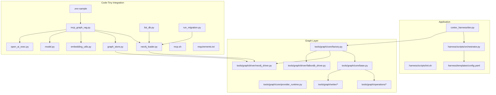
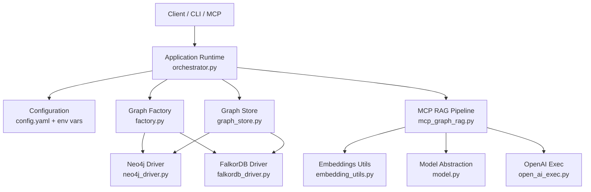
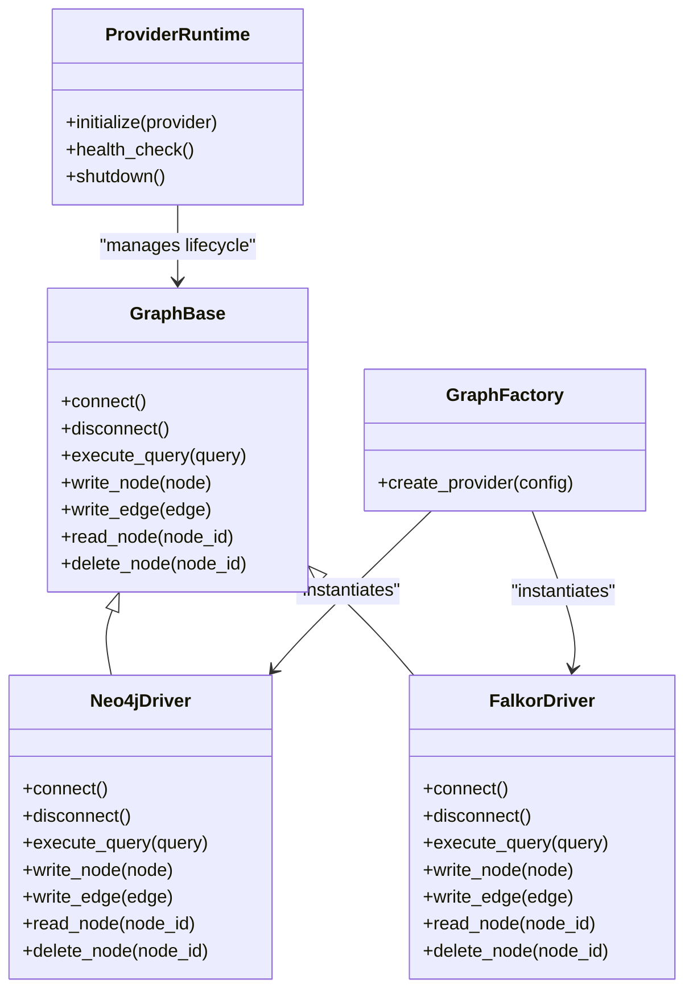
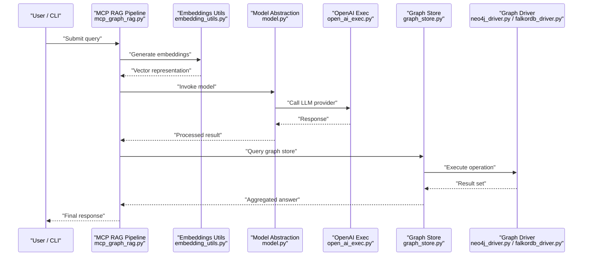
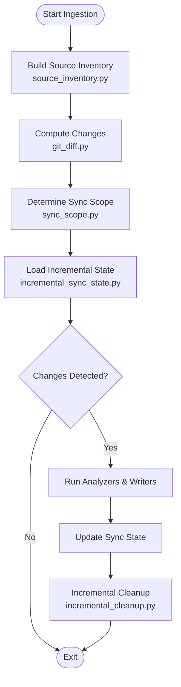
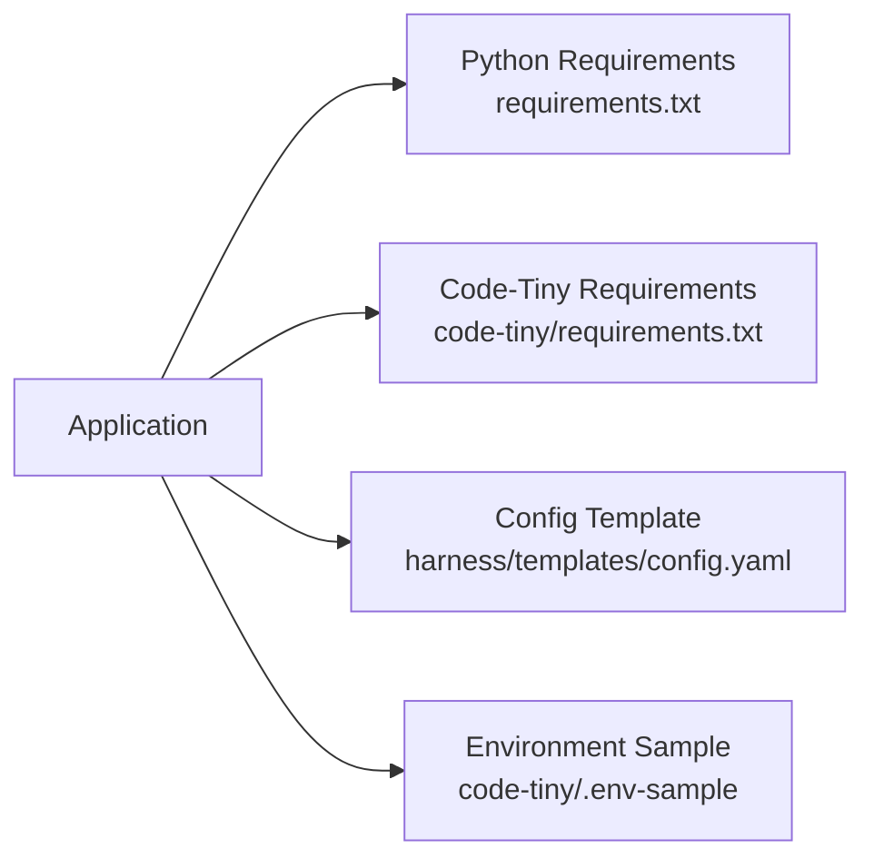

# AWS Deployment

<cite>
**Referenced Files in This Document**
- [ReadMe.md](file://ReadMe.md)
- [requirements.txt](file://requirements.txt)
- [pyproject.toml](file://pyproject.toml)
- [Makefile](file://Makefile)
- [dev-global.cmd](file://dev-global.cmd)
- [dev.bat](file://dev.bat)
- [dev.ps1](file://dev.ps1)
- [dev.sh](file://dev.sh)
- [install-windows.bat](file://install-windows.bat)
- [install-windows.ps1](file://install-windows.ps1)
- [INSTALLER_GUIDE.md](file://INSTALLER_GUIDE.md)
- [cortex_harness/dev.py](file://cortex_harness/dev.py)
- [harness/scripts/orchestrator.py](file://harness/scripts/orchestrator.py)
- [harness/scripts/init.sh](file://harness/scripts/init.sh)
- [harness/templates/config.yaml](file://harness/templates/config.yaml)
- [code-tiny/neo4j_loader.py](file://code-tiny/neo4j_loader.py)
- [code-tiny/graph_store.py](file://code-tiny/graph_store.py)
- [code-tiny/.env-sample](file://code-tiny/.env-sample)
- [code-tiny/README.md](file://code-tiny/README.md)
- [code-tiny/mcp_graph_rag.py](file://code-tiny/mcp_graph_rag.py)
- [code-tiny/embedding_utils.py](file://code-tiny/embedding_utils.py)
- [code-tiny/model.py](file://code-tiny/model.py)
- [code-tiny/open_ai_exec.py](file://code-tiny/open_ai_exec.py)
- [code-tiny/list_db.py](file://code-tiny/list_db.py)
- [code-tiny/run_migration.py](file://code-tiny/run_migration.py)
- [code-tiny/mcp.sh](file://code-tiny/mcp.sh)
- [code-tiny/requirements.txt](file://code-tiny/requirements.txt)
- [code-tiny/tools/graph/driver/neo4j_driver.py](file://code-tiny/tools/graph/driver/neo4j_driver.py)
- [code-tiny/tools/graph/driver/falkordb_driver.py](file://code-tiny/tools/graph/driver/falkordb_driver.py)
- [code-tiny/tools/graph/core/require_neo4j.py](file://code-tiny/tools/graph/core/require_neo4j.py)
- [code-tiny/tools/graph/core/provider_runtime.py](file://code-tiny/tools/graph/core/provider_runtime.py)
- [code-tiny/tools/graph/core/factory.py](file://code-tiny/tools/graph/core/factory.py)
- [code-tiny/tools/graph/core/base.py](file://code-tiny/tools/graph/core/base.py)
- [code-tiny/tools/graph/__init__.py](file://code-tiny/tools/graph/__init__.py)
- [code-tiny/tools/graph/cli.py](file://code-tiny/tools/graph/cli.py)
- [code-tiny/tools/graph/examples/example_usage.py](file://code-tiny/tools/graph/examples/example_usage.py)
- [code-tiny/tools/graph/docs/QUICK_REFERENCE.md](file://code-tiny/tools/graph/docs/QUICK_REFERENCE.md)
- [code-tiny/tools/graph/docs/IMPLEMENTATION_SUMMARY.md](file://code-tiny/tools/graph/docs/IMPLEMENTATION_SUMMARY.md)
- [code-tiny/tools/graph/docs/MIGRATION_GUIDE.py](file://code-tiny/tools/graph/docs/MIGRATION_GUIDE.py)
- [code-tiny/tools/graph/docs/MIGRATION_EXAMPLE.md](file://code-tiny/tools/graph/docs/MIGRATION_EXAMPLE.md)
- [code-tiny/tools/graph/docs/QUERY_BUILDER_SOLUTION.md](file://code-tiny/tools/graph/docs/QUERY_BUILDER_SOLUTION.md)
- [code-tiny/tools/graph/docs/QUERY_METHODS.md](file://code-tiny/tools/graph/docs/QUERY_METHODS.md)
- [code-tiny/tools/graph/operations/class_ops.py](file://code-tiny/tools/graph/operations/class_ops.py)
- [code-tiny/tools/graph/operations/cross_edge_ops.py](file://code-tiny/tools/graph/operations/cross_edge_ops.py)
- [code-tiny/tools/graph/operations/document_ops.py](file://code-tiny/tools/graph/operations/document_ops.py)
- [code-tiny/tools/graph/operations/flow_ops.py](file://code-tiny/tools/graph/operations/flow_ops.py)
- [code-tiny/tools/graph/operations/function_ops.py](file://code-tiny/tools/graph/operations/function_ops.py)
- [code-tiny/tools/graph/operations/infra_ops.py](file://code-tiny/tools/graph/operations/infra_ops.py)
- [code-tiny/tools/graph/operations/namespace_ops.py](file://code-tiny/tools/graph/operations/namespace_ops.py)
- [code-tiny/tools/graph/operations/package_ops.py](file://code-tiny/tools/graph/operations/package_ops.py)
- [code-tiny/tools/graph/operations/type_ops.py](file://code-tiny/tools/graph/operations/type_ops.py)
- [code-tiny/tools/graph/writer/aspnet_writer.py](file://code-tiny/tools/graph/writer/aspnet_writer.py)
- [code-tiny/tools/graph/writer/database_schema_writer.py](file://code-tiny/tools/graph/writer/database_schema_writer.py)
- [code-tiny/tools/graph/writer/language_writer.py](file://code-tiny/tools/graph/writer/language_writer.py)
- [code-tiny/tools/graph/writer/mybatis_writer.py](file://code-tiny/tools/graph/writer/mybatis_writer.py)
- [code-tiny/tools/graph/writer/servlet_jsp_writer.py](file://code-tiny/tools/graph/writer/servlet_jsp_writer.py)
- [code-tiny/tools/graph/writer/spring_writer.py](file://code-tiny/tools/graph/writer/spring_writer.py)
- [code-tiny/tools/graph/writer/web_framework_writer.py](file://code-tiny/tools/graph/writer/web_framework_writer.py)
- [code-tiny/tools/common/harness_config.py](file://code-tiny/tools/common/harness_config.py)
- [code-tiny/tools/common/incremental_sync_state.py](file://code-tiny/tools/common/incremental_sync_state.py)
- [code-tiny/tools/common/incremental_cleanup.py](file://code-tiny/tools/common/incremental_cleanup.py)
- [code-tiny/tools/common/analyzer_cache.py](file://code-tiny/tools/common/analyzer_cache.py)
- [code-tiny/tools/common/source_inventory.py](file://code-tiny/tools/common/source_inventory.py)
- [code-tiny/tools/common/graph_expander.py](file://code-tiny/tools/common/graph_expander.py)
- [code-tiny/tools/common/primary_vector_sync.py](file://code-tiny/tools/common/primary_vector_sync.py)
- [code-tiny/tools/common/query_understanding.py](file://code-tiny/tools/common/query_understanding.py)
- [code-tiny/tools/common/intelligent_retrieval.py](file://code-tiny/tools/common/intelligent_retrieval.py)
- [code-tiny/tools/common/retrieval_scorer.py](file://code-tiny/tools/common/retrieval_scorer.py)
- [code-tiny/tools/common/bm25_ranker.py](file://code-tiny/tools/common/bm25_ranker.py)
- [code-tiny/tools/common/api_match_engine.py](file://code-tiny/tools/common/api_match_engine.py)
- [code-tiny/tools/common/call_graph_builder.py](file://code-tiny/tools/common/call_graph_builder.py)
- [code-tiny/tools/common/confidence_scorer.py](file://code-tiny/tools/common/confidence_scorer.py)
- [code-tiny/tools/common/frontend_relationship_extractor.py](file://code-tiny/tools/common/frontend_relationship_extractor.py)
- [code-tiny/tools/common/git_diff.py](file://code-tiny/tools/common/git_diff.py)
- [code-tiny/tools/common/llm_summary.py](file://code-tiny/tools/common/llm_summary.py)
- [code-tiny/tools/common/message_scan.py](file://code-tiny/tools/common/message_scan.py)
- [code-tiny/tools/common/react_role_classifier.py](file://code-tiny/tools/common/react_role_classifier.py)
- [code-tiny/tools/common/result_packager.py](file://code-tiny/tools/common/result_packager.py)
- [code-tiny/tools/common/semantic_inference.py](file://code-tiny/tools/common/semantic_inference.py)
- [code-tiny/tools/common/signal_normalizer.py](file://code-tiny/tools/common/signal_normalizer.py)
- [code-tiny/tools/common/sync_scope.py](file://code-tiny/tools/common/sync_scope.py)
- [code-tiny/tools/common/url_normalizer.py](file://code-tiny/tools/common/url_normalizer.py)
- [code-tiny/tools/common/workflow_classifier.py](file://code-tiny/tools/common/workflow_classifier.py)
- [code-tiny/tools/common/workflow_impact_scorer.py](file://code-tiny/tools/common/workflow_impact_scorer.py)
- [code-tiny/tools/common/cloc_stats.py](file://code-tiny/tools/common/cloc_stats.py)
- [code-tiny/tools/common/CLAUDE.md](file://code-tiny/tools/common/CLAUDE.md)
</cite>

## Table of Contents
1. [Introduction](#introduction)
2. [Project Structure](#project-structure)
3. [Core Components](#core-components)
4. [Architecture Overview](#architecture-overview)
5. [Detailed Component Analysis](#detailed-component-analysis)
6. [Dependency Analysis](#dependency-analysis)
7. [Performance Considerations](#performance-considerations)
8. [Troubleshooting Guide](#troubleshooting-guide)
9. [Conclusion](#conclusion)
10. [Appendices](#appendices)

## Introduction
This document provides comprehensive guidance for deploying Cortex Harness on AWS, including ECS Fargate and EKS Kubernetes options, graph database configuration (RDS PostgreSQL or DocumentDB as alternatives to Neo4j), VPC networking, security groups, IAM roles, secrets management with AWS Secrets Manager, CloudWatch monitoring, log aggregation, alerting, cost optimization strategies, backup automation with AWS Backup, disaster recovery procedures, and cross-region replication patterns. It is intended for platform engineers and DevOps practitioners who need production-grade deployment instructions tailored to Cortex Harness components.

## Project Structure
Cortex Harness includes a Python-based backend and tooling that integrates with graph databases and vector stores. The repository contains:
- Application entry points and development scripts
- Graph driver abstractions and writers
- Common utilities for ingestion, synchronization, and retrieval
- Configuration templates and environment samples
- Documentation and migration guides

**Diagram sources**
- [cortex_harness/dev.py](file://cortex_harness/dev.py)
- [harness/scripts/orchestrator.py](file://harness/scripts/orchestrator.py)
- [harness/scripts/init.sh](file://harness/scripts/init.sh)
- [harness/templates/config.yaml](file://harness/templates/config.yaml)
- [code-tiny/neo4j_loader.py](file://code-tiny/neo4j_loader.py)
- [code-tiny/graph_store.py](file://code-tiny/graph_store.py)
- [code-tiny/.env-sample](file://code-tiny/.env-sample)
- [code-tiny/mcp_graph_rag.py](file://code-tiny/mcp_graph_rag.py)
- [code-tiny/embedding_utils.py](file://code-tiny/embedding_utils.py)
- [code-tiny/model.py](file://code-tiny/model.py)
- [code-tiny/open_ai_exec.py](file://code-tiny/open_ai_exec.py)
- [code-tiny/list_db.py](file://code-tiny/list_db.py)
- [code-tiny/run_migration.py](file://code-tiny/run_migration.py)
- [code-tiny/mcp.sh](file://code-tiny/mcp.sh)
- [code-tiny/requirements.txt](file://code-tiny/requirements.txt)
- [code-tiny/tools/graph/core/base.py](file://code-tiny/tools/graph/core/base.py)
- [code-tiny/tools/graph/core/factory.py](file://code-tiny/tools/graph/core/factory.py)
- [code-tiny/tools/graph/core/provider_runtime.py](file://code-tiny/tools/graph/core/provider_runtime.py)
- [code-tiny/tools/graph/driver/neo4j_driver.py](file://code-tiny/tools/graph/driver/neo4j_driver.py)
- [code-tiny/tools/graph/driver/falkordb_driver.py](file://code-tiny/tools/graph/driver/falkordb_driver.py)
- [code-tiny/tools/graph/operations/class_ops.py](file://code-tiny/tools/graph/operations/class_ops.py)
- [code-tiny/tools/graph/operations/cross_edge_ops.py](file://code-tiny/tools/graph/operations/cross_edge_ops.py)
- [code-tiny/tools/graph/operations/document_ops.py](file://code-tiny/tools/graph/operations/document_ops.py)
- [code-tiny/tools/graph/operations/flow_ops.py](file://code-tiny/tools/graph/operations/flow_ops.py)
- [code-tiny/tools/graph/operations/function_ops.py](file://code-tiny/tools/graph/operations/function_ops.py)
- [code-tiny/tools/graph/operations/infra_ops.py](file://code-tiny/tools/graph/operations/infra_ops.py)
- [code-tiny/tools/graph/operations/namespace_ops.py](file://code-tiny/tools/graph/operations/namespace_ops.py)
- [code-tiny/tools/graph/operations/package_ops.py](file://code-tiny/tools/graph/operations/package_ops.py)
- [code-tiny/tools/graph/operations/type_ops.py](file://code-tiny/tools/graph/operations/type_ops.py)
- [code-tiny/tools/graph/writer/aspnet_writer.py](file://code-tiny/tools/graph/writer/aspnet_writer.py)
- [code-tiny/tools/graph/writer/database_schema_writer.py](file://code-tiny/tools/graph/writer/database_schema_writer.py)
- [code-tiny/tools/graph/writer/language_writer.py](file://code-tiny/tools/graph/writer/language_writer.py)
- [code-tiny/tools/graph/writer/mybatis_writer.py](file://code-tiny/tools/graph/writer/mybatis_writer.py)
- [code-tiny/tools/graph/writer/servlet_jsp_writer.py](file://code-tiny/tools/graph/writer/servlet_jsp_writer.py)
- [code-tiny/tools/graph/writer/spring_writer.py](file://code-tiny/tools/graph/writer/spring_writer.py)
- [code-tiny/tools/graph/writer/web_framework_writer.py](file://code-tiny/tools/graph/writer/web_framework_writer.py)

**Section sources**
- [ReadMe.md](file://ReadMe.md)
- [requirements.txt](file://requirements.txt)
- [pyproject.toml](file://pyproject.toml)
- [Makefile](file://Makefile)
- [dev-global.cmd](file://dev-global.cmd)
- [dev.bat](file://dev.bat)
- [dev.ps1](file://dev.ps1)
- [dev.sh](file://dev.sh)
- [install-windows.bat](file://install-windows.bat)
- [install-windows.ps1](file://install-windows.ps1)
- [INSTALLER_GUIDE.md](file://INSTALLER_GUIDE.md)
- [cortex_harness/dev.py](file://cortex_harness/dev.py)
- [harness/scripts/orchestrator.py](file://harness/scripts/orchestrator.py)
- [harness/scripts/init.sh](file://harness/scripts/init.sh)
- [harness/templates/config.yaml](file://harness/templates/config.yaml)
- [code-tiny/neo4j_loader.py](file://code-tiny/neo4j_loader.py)
- [code-tiny/graph_store.py](file://code-tiny/graph_store.py)
- [code-tiny/.env-sample](file://code-tiny/.env-sample)
- [code-tiny/mcp_graph_rag.py](file://code-tiny/mcp_graph_rag.py)
- [code-tiny/embedding_utils.py](file://code-tiny/embedding_utils.py)
- [code-tiny/model.py](file://code-tiny/model.py)
- [code-tiny/open_ai_exec.py](file://code-tiny/open_ai_exec.py)
- [code-tiny/list_db.py](file://code-tiny/list_db.py)
- [code-tiny/run_migration.py](file://code-tiny/run_migration.py)
- [code-tiny/mcp.sh](file://code-tiny/mcp.sh)
- [code-tiny/requirements.txt](file://code-tiny/requirements.txt)
- [code-tiny/tools/graph/core/base.py](file://code-tiny/tools/graph/core/base.py)
- [code-tiny/tools/graph/core/factory.py](file://code-tiny/tools/graph/factory.py)
- [code-tiny/tools/graph/core/provider_runtime.py](file://code-tiny/tools/graph/core/provider_runtime.py)
- [code-tiny/tools/graph/driver/neo4j_driver.py](file://code-tiny/tools/graph/driver/neo4j_driver.py)
- [code-tiny/tools/graph/driver/falkordb_driver.py](file://code-tiny/tools/graph/driver/falkordb_driver.py)
- [code-tiny/tools/graph/operations/class_ops.py](file://code-tiny/tools/graph/operations/class_ops.py)
- [code-tiny/tools/graph/operations/cross_edge_ops.py](file://code-tiny/tools/graph/operations/cross_edge_ops.py)
- [code-tiny/tools/graph/operations/document_ops.py](file://code-tiny/tools/graph/operations/document_ops.py)
- [code-tiny/tools/graph/operations/flow_ops.py](file://code-tiny/tools/graph/operations/flow_ops.py)
- [code-tiny/tools/graph/operations/function_ops.py](file://code-tiny/tools/graph/operations/function_ops.py)
- [code-tiny/tools/graph/operations/infra_ops.py](file://code-tiny/tools/graph/operations/infra_ops.py)
- [code-tiny/tools/graph/operations/namespace_ops.py](file://code-tiny/tools/graph/operations/namespace_ops.py)
- [code-tiny/tools/graph/operations/package_ops.py](file://code-tiny/tools/graph/operations/package_ops.py)
- [code-tiny/tools/graph/operations/type_ops.py](file://code-tiny/tools/graph/operations/type_ops.py)
- [code-tiny/tools/graph/writer/aspnet_writer.py](file://code-tiny/tools/graph/writer/aspnet_writer.py)
- [code-tiny/tools/graph/writer/database_schema_writer.py](file://code-tiny/tools/graph/writer/database_schema_writer.py)
- [code-tiny/tools/graph/writer/language_writer.py](file://code-tiny/tools/graph/writer/language_writer.py)
- [code-tiny/tools/graph/writer/mybatis_writer.py](file://code-tiny/tools/graph/writer/mybatis_writer.py)
- [code-tiny/tools/graph/writer/servlet_jsp_writer.py](file://code-tiny/tools/graph/writer/servlet_jsp_writer.py)
- [code-tiny/tools/graph/writer/spring_writer.py](file://code-tiny/tools/graph/writer/spring_writer.py)
- [code-tiny/tools/graph/writer/web_framework_writer.py](file://code-tiny/tools/graph/writer/web_framework_writer.py)

## Core Components
- Application runtime and orchestration:
  - Entry point and dev helpers for local execution
  - Orchestrator script for lifecycle tasks
  - Initialization script and configuration template
- Graph abstraction layer:
  - Base interface and factory for provider selection
  - Provider runtime for initialization and lifecycle
  - Drivers for Neo4j and FalkorDB
  - Operations and writers for schema and data manipulation
- Code-Tiny integration:
  - Loader and store modules for graph operations
  - MCP RAG pipeline integrating embeddings and models
  - Environment sample and requirements
  - Migration and listing utilities

Key responsibilities:
- Provide pluggable graph backends via a consistent API
- Manage ingestion pipelines and incremental sync state
- Support MCP-based query and analysis workflows
- Offer configuration-driven behavior through YAML and environment variables

**Section sources**
- [cortex_harness/dev.py](file://cortex_harness/dev.py)
- [harness/scripts/orchestrator.py](file://harness/scripts/orchestrator.py)
- [harness/scripts/init.sh](file://harness/scripts/init.sh)
- [harness/templates/config.yaml](file://harness/templates/config.yaml)
- [code-tiny/tools/graph/core/base.py](file://code-tiny/tools/graph/core/base.py)
- [code-tiny/tools/graph/core/factory.py](file://code-tiny/tools/graph/core/factory.py)
- [code-tiny/tools/graph/core/provider_runtime.py](file://code-tiny/tools/graph/core/provider_runtime.py)
- [code-tiny/tools/graph/driver/neo4j_driver.py](file://code-tiny/tools/graph/driver/neo4j_driver.py)
- [code-tiny/tools/graph/driver/falkordb_driver.py](file://code-tiny/tools/graph/driver/falkordb_driver.py)
- [code-tiny/neo4j_loader.py](file://code-tiny/neo4j_loader.py)
- [code-tiny/graph_store.py](file://code-tiny/graph_store.py)
- [code-tiny/mcp_graph_rag.py](file://code-tiny/mcp_graph_rag.py)
- [code-tiny/.env-sample](file://code-tiny/.env-sample)
- [code-tiny/requirements.txt](file://code-tiny/requirements.txt)

## Architecture Overview
The system comprises an application layer orchestrating ingestion and queries, a graph abstraction layer selecting the appropriate backend, and optional external services such as vector stores and LLM providers.

**Diagram sources**
- [harness/scripts/orchestrator.py](file://harness/scripts/orchestrator.py)
- [harness/templates/config.yaml](file://harness/templates/config.yaml)
- [code-tiny/tools/graph/core/factory.py](file://code-tiny/tools/graph/core/factory.py)
- [code-tiny/tools/graph/driver/neo4j_driver.py](file://code-tiny/tools/graph/driver/neo4j_driver.py)
- [code-tiny/tools/graph/driver/falkordb_driver.py](file://code-tiny/tools/graph/driver/falkordb_driver.py)
- [code-tiny/mcp_graph_rag.py](file://code-tiny/mcp_graph_rag.py)
- [code-tiny/embedding_utils.py](file://code-tiny/embedding_utils.py)
- [code-tiny/model.py](file://code-tiny/model.py)
- [code-tiny/open_ai_exec.py](file://code-tiny/open_ai_exec.py)
- [code-tiny/graph_store.py](file://code-tiny/graph_store.py)

## Detailed Component Analysis

### Graph Abstraction Layer
The graph abstraction defines a base interface and a factory to select drivers at runtime. The provider runtime manages initialization and lifecycle hooks.

**Diagram sources**
- [code-tiny/tools/graph/core/base.py](file://code-tiny/tools/graph/core/base.py)
- [code-tiny/tools/graph/core/factory.py](file://code-tiny/tools/graph/core/factory.py)
- [code-tiny/tools/graph/core/provider_runtime.py](file://code-tiny/tools/graph/core/provider_runtime.py)
- [code-tiny/tools/graph/driver/neo4j_driver.py](file://code-tiny/tools/graph/driver/neo4j_driver.py)
- [code-tiny/tools/graph/driver/falkordb_driver.py](file://code-tiny/tools/graph/driver/falkordb_driver.py)

**Section sources**
- [code-tiny/tools/graph/core/base.py](file://code-tiny/tools/graph/core/base.py)
- [code-tiny/tools/graph/core/factory.py](file://code-tiny/tools/graph/core/factory.py)
- [code-tiny/tools/graph/core/provider_runtime.py](file://code-tiny/tools/graph/core/provider_runtime.py)
- [code-tiny/tools/graph/driver/neo4j_driver.py](file://code-tiny/tools/graph/driver/neo4j_driver.py)
- [code-tiny/tools/graph/driver/falkordb_driver.py](file://code-tiny/tools/graph/driver/falkordb_driver.py)

### MCP RAG Pipeline
The MCP RAG pipeline coordinates embeddings, model inference, and graph store interactions to support semantic search and analysis.

**Diagram sources**
- [code-tiny/mcp_graph_rag.py](file://code-tiny/mcp_graph_rag.py)
- [code-tiny/embedding_utils.py](file://code-tiny/embedding_utils.py)
- [code-tiny/model.py](file://code-tiny/model.py)
- [code-tiny/open_ai_exec.py](file://code-tiny/open_ai_exec.py)
- [code-tiny/graph_store.py](file://code-tiny/graph_store.py)
- [code-tiny/tools/graph/driver/neo4j_driver.py](file://code-tiny/tools/graph/driver/neo4j_driver.py)
- [code-tiny/tools/graph/driver/falkordb_driver.py](file://code-tiny/tools/graph/driver/falkordb_driver.py)

**Section sources**
- [code-tiny/mcp_graph_rag.py](file://code-tiny/mcp_graph_rag.py)
- [code-tiny/embedding_utils.py](file://code-tiny/embedding_utils.py)
- [code-tiny/model.py](file://code-tiny/model.py)
- [code-tiny/open_ai_exec.py](file://code-tiny/open_ai_exec.py)
- [code-tiny/graph_store.py](file://code-tiny/graph_store.py)
- [code-tiny/tools/graph/driver/neo4j_driver.py](file://code-tiny/tools/graph/driver/neo4j_driver.py)
- [code-tiny/tools/graph/driver/falkordb_driver.py](file://code-tiny/tools/graph/driver/falkordb_driver.py)

### Ingestion and Sync Utilities
Ingestion and incremental sync utilities manage source inventory, change detection, and state persistence.

**Diagram sources**
- [code-tiny/tools/common/source_inventory.py](file://code-tiny/tools/common/source_inventory.py)
- [code-tiny/tools/common/git_diff.py](file://code-tiny/tools/common/git_diff.py)
- [code-tiny/tools/common/sync_scope.py](file://code-tiny/tools/common/sync_scope.py)
- [code-tiny/tools/common/incremental_sync_state.py](file://code-tiny/tools/common/incremental_sync_state.py)
- [code-tiny/tools/common/incremental_cleanup.py](file://code-tiny/tools/common/incremental_cleanup.py)

**Section sources**
- [code-tiny/tools/common/source_inventory.py](file://code-tiny/tools/common/source_inventory.py)
- [code-tiny/tools/common/git_diff.py](file://code-tiny/tools/common/git_diff.py)
- [code-tiny/tools/common/sync_scope.py](file://code-tiny/tools/common/sync_scope.py)
- [code-tiny/tools/common/incremental_sync_state.py](file://code-tiny/tools/common/incremental_sync_state.py)
- [code-tiny/tools/common/incremental_cleanup.py](file://code-tiny/tools/common/incremental_cleanup.py)

## Dependency Analysis
External dependencies are declared in requirements files and include libraries for graph connectivity, embeddings, and LLM integrations.

**Diagram sources**
- [requirements.txt](file://requirements.txt)
- [code-tiny/requirements.txt](file://code-tiny/requirements.txt)
- [harness/templates/config.yaml](file://harness/templates/config.yaml)
- [code-tiny/.env-sample](file://code-tiny/.env-sample)

**Section sources**
- [requirements.txt](file://requirements.txt)
- [code-tiny/requirements.txt](file://code-tiny/requirements.txt)
- [harness/templates/config.yaml](file://harness/templates/config.yaml)
- [code-tiny/.env-sample](file://code-tiny/.env-sample)

## Performance Considerations
- Use connection pooling for graph drivers where supported by the driver implementation.
- Batch write operations for large ingestion jobs to reduce round-trips.
- Enable indexes and constraints in the graph database to optimize query performance.
- Cache embeddings and frequently accessed results using analyzer cache utilities.
- Scale horizontally by running multiple worker processes behind a load balancer.
- Tune concurrency limits based on CPU and memory profiles observed in CloudWatch metrics.

[No sources needed since this section provides general guidance]

## Troubleshooting Guide
Common issues and resolutions:
- Connection failures to graph databases:
  - Verify network reachability and security group rules.
  - Check credentials from AWS Secrets Manager and ensure correct secret ARN references.
- MCP pipeline errors:
  - Validate embedding model availability and API keys.
  - Inspect logs for timeouts or rate limiting from LLM providers.
- Ingestion stalls:
  - Review incremental sync state for lock conflicts.
  - Confirm git diff accuracy and scope filtering.
- Resource exhaustion:
  - Monitor CPU/memory utilization and adjust task/service scaling policies.
  - Increase instance sizes or enable spot instances for non-critical workloads.

Operational checks:
- Health endpoints and readiness probes for ECS/EKS.
- Log aggregation to CloudWatch Logs Insights for error correlation.
- Alerts on high error rates, latency spikes, and resource saturation.

**Section sources**
- [harness/scripts/orchestrator.py](file://harness/scripts/orchestrator.py)
- [code-tiny/mcp_graph_rag.py](file://code-tiny/mcp_graph_rag.py)
- [code-tiny/tools/common/incremental_sync_state.py](file://code-tiny/tools/common/incremental_sync_state.py)

## Conclusion
Cortex Harness provides a flexible, pluggable architecture suitable for cloud-native deployments on AWS. By leveraging ECS Fargate or EKS, configuring secure networking and IAM, managing secrets via AWS Secrets Manager, and integrating CloudWatch for observability, teams can deploy robust, scalable, and cost-effective environments. Graph database choices (Neo4j or FalkorDB) and alternative backends (RDS PostgreSQL or DocumentDB) allow tailoring to workload needs. With proper autoscaling, backup automation, and disaster recovery planning, Cortex Harness can operate reliably across regions and scales.

[No sources needed since this section summarizes without analyzing specific files]

## Appendices

### ECS Fargate Deployment
- Task Definition:
  - Container image built from application code and pinned dependencies.
  - Environment variables sourced from AWS Secrets Manager for sensitive values.
  - Resource allocations tuned for CPU and memory usage patterns.
- Service Configuration:
  - Desired count and launch type set to Fargate.
  - Load balancer integration for HTTP ingress if applicable.
  - Health check paths configured for readiness and liveness.
- Auto-scaling Policies:
  - Target tracking on CPU or custom metrics (e.g., request queue length).
  - Step scaling for bursty ingestion workloads.
- Networking:
  - Subnets in private subnets; NAT Gateway for outbound access.
  - Security groups allowing inbound traffic from ALB/NLB and outbound to graph DB and secrets manager.
- IAM Roles:
  - Task execution role with least privilege for Secrets Manager read and CloudWatch logging.
  - Instance profile not required for Fargate; use task execution role only.
- Secrets Management:
  - Store database credentials and API keys in AWS Secrets Manager.
  - Reference secrets in task definition environment variables.
- Monitoring:
  - Enable CloudWatch container insights.
  - Stream logs to CloudWatch Logs with structured JSON format.
  - Create alarms for error rates, latency, and resource utilization.

[No sources needed since this section provides general guidance]

### EKS Kubernetes Deployment
- Helm Charts:
  - Chart values for replicas, resources, and autoscaling targets.
  - ConfigMap for non-sensitive configuration; Secret for sensitive values.
- Cluster Autoscaler:
  - Configure node groups with min/max nodes and scale-up thresholds.
  - Spot instances enabled for cost savings with fallback to on-demand.
- Pod Security Policies:
  - Prefer Pod Security Standards (Restricted) over legacy PSPs.
  - Enforce non-root users and minimal capabilities.
- Networking:
  - VPC CNI plugin for pod IP assignment.
  - NetworkPolicies to restrict inter-pod communication.
- IAM Roles for Service Accounts (IRSA):
  - Map service accounts to IAM roles for Secrets Manager and CloudWatch access.
- Secrets Management:
  - Use Kubernetes Secrets backed by AWS Secrets Manager via External Secrets Operator or native integration.
- Monitoring:
  - Deploy Prometheus/Grafana or use managed solutions.
  - Ship logs to CloudWatch Logs via Fluent Bit DaemonSet.
  - Set alerts on SLO breaches and resource pressure.

[No sources needed since this section provides general guidance]

### Graph Database Alternatives: RDS PostgreSQL and DocumentDB
- RDS PostgreSQL:
  - Use relational tables to represent nodes and edges if migrating away from graph-specific features.
  - Migrate schema and indexes accordingly; consider materialized views for complex queries.
  - Enable automated backups and snapshots; configure Multi-AZ for HA.
- DocumentDB:
  - Model documents to capture relationships; leverage indexing for common query patterns.
  - Evaluate compatibility with existing graph operations and adapt writers accordingly.
- Migration Strategy:
  - Use migration scripts and validation routines to ensure data integrity.
  - Run parallel workloads during cutover to validate performance and correctness.

[No sources needed since this section provides general guidance]

### VPC Networking and Security Groups
- VPC Design:
  - Public subnets for NAT Gateways; private subnets for application and database tiers.
  - Separate subnets per AZ for high availability.
- Security Groups:
  - Restrict inbound to known CIDRs and load balancers.
  - Allow outbound to required endpoints (Secrets Manager, CloudWatch, graph DB).
- NACLs:
  - Apply stateful rules aligned with security group policies.
- DNS and PrivateLink:
  - Use Route 53 private hosted zones for internal service discovery.
  - Consider PrivateLink for secure access to managed services.

[No sources needed since this section provides general guidance]

### IAM Roles and Least Privilege
- Task Execution Role:
  - Permissions for Secrets Manager GetSecretValue and CloudWatch PutLogEvents.
- IRSA (EKS):
  - Map service accounts to IAM roles with scoped permissions.
- Cross-account Access:
  - Use trust policies and role assumptions carefully; avoid wildcard actions.

[No sources needed since this section provides general guidance]

### Secrets Management with AWS Secrets Manager
- Store database credentials, API keys, and tokens.
- Rotate secrets periodically and integrate rotation functions.
- Reference secrets in task definitions or Kubernetes Secrets via operators.
- Audit access via CloudTrail and monitor for unauthorized attempts.

[No sources needed since this section provides general guidance]

### CloudWatch Monitoring, Logging, and Alerting
- Metrics:
  - Container CPU, memory, network I/O, and disk usage.
  - Custom business metrics exposed by the application.
- Logs:
  - Structured JSON logs with correlation IDs.
  - Centralize in CloudWatch Logs and create dashboards.
- Alarms:
  - Error rate thresholds, latency percentiles, and resource saturation.
  - PagerDuty or SNS integration for incident response.

[No sources needed since this section provides general guidance]

### Cost Optimization Strategies
- Spot Instances:
  - Use spot capacity for batch ingestion and non-critical workers.
  - Implement graceful shutdown and checkpointing for resilience.
- Right-sizing:
  - Continuously review CloudWatch metrics and adjust instance/task sizes.
- Reserved Capacity:
  - Purchase reserved instances for baseline steady-state workloads.
- Tagging Policies:
  - Enforce tags for cost allocation (environment, team, project).
  - Use AWS Cost Explorer and Budgets for visibility and alerts.

[No sources needed since this section provides general guidance]

### Backup Automation with AWS Backup and Disaster Recovery
- Automated Backups:
  - Enable daily snapshots for RDS and EBS volumes.
  - Retain backups according to compliance requirements.
- Cross-region Replication:
  - Replicate snapshots to another region for DR.
  - Test restoration procedures regularly.
- Disaster Recovery Procedures:
  - Define RTO/RPO targets and run tabletop exercises.
  - Automate failover using Route 53 health checks and DNS failover.

[No sources needed since this section provides general guidance]