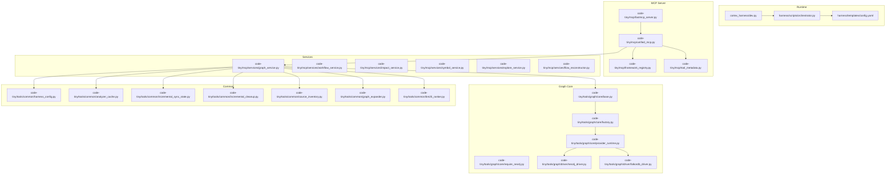
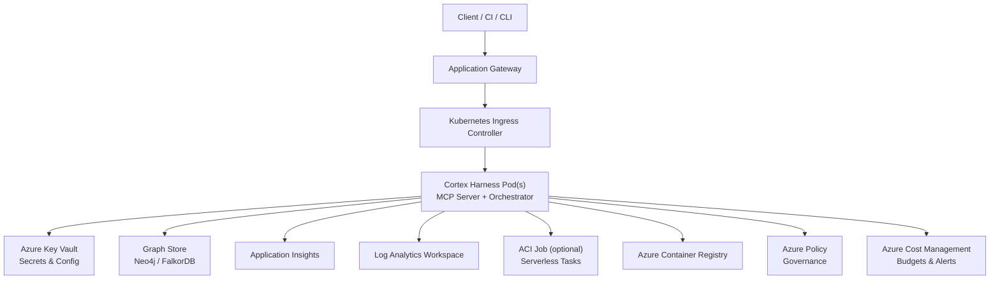
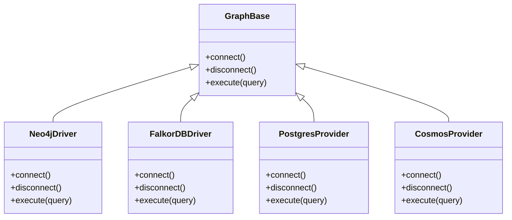
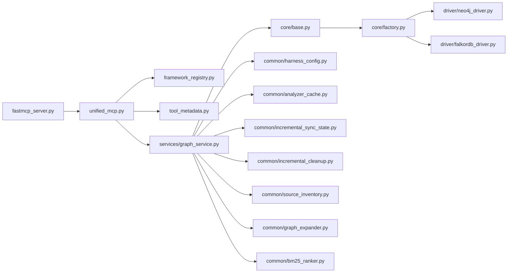
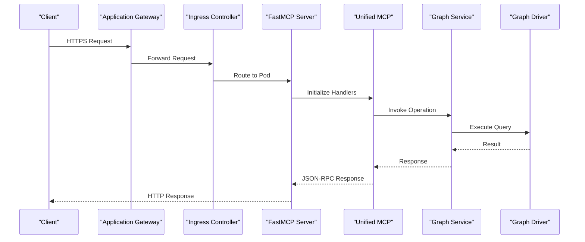

# Azure Deployment

<cite>
**Referenced Files in This Document**
- [ReadMe.md](file://ReadMe.md)
- [Makefile](file://Makefile)
- [requirements.txt](file://requirements.txt)
- [pyproject.toml](file://pyproject.toml)
- [cortex_harness/dev.py](file://cortex_harness/dev.py)
- [harness/scripts/orchestrator.py](file://harness/scripts/orchestrator.py)
- [harness/templates/config.yaml](file://harness/templates/config.yaml)
- [code-tiny/mcp/fastmcp_server.py](file://code-tiny/mcp/fastmcp_server.py)
- [code-tiny/mcp/unified_mcp.py](file://code-tiny/mcp/unified_mcp.py)
- [code-tiny/mcp/services/graph_service.py](file://code-tiny/mcp/services/graph_service.py)
- [code-tiny/mcp/services/workflow_service.py](file://code-tiny/mcp/services/workflow_service.py)
- [code-tiny/mcp/services/impact_service.py](file://code-tiny/mcp/services/impact_service.py)
- [code-tiny/mcp/services/symbol_service.py](file://code-tiny/mcp/services/symbol_service.py)
- [code-tiny/mcp/services/explore_service.py](file://code-tiny/mcp/services/explore_service.py)
- [code-tiny/mcp/services/flow_reconstructor.py](file://code-tiny/mcp/services/flow_reconstructor.py)
- [code-tiny/mcp/framework_registry.py](file://code-tiny/mcp/framework_registry.py)
- [code-tiny/mcp/tool_metadata.py](file://code-tiny/mcp/tool_metadata.py)
- [code-tiny/mcp/semantic_graph_expansion.py](file://code-tiny/mcp/semantic_graph_expansion.py)
- [code-tiny/tools/common/harness_config.py](file://code-tiny/tools/common/harness_config.py)
- [code-tiny/tools/graph/driver/neo4j_driver.py](file://code-tiny/tools/graph/driver/neo4j_driver.py)
- [code-tiny/tools/graph/driver/falkordb_driver.py](file://code-tiny/tools/graph/driver/falkordb_driver.py)
- [code-tiny/tools/graph/core/base.py](file://code-tiny/tools/graph/core/base.py)
- [code-tiny/tools/graph/core/factory.py](file://code-tiny/tools/graph/core/factory.py)
- [code-tiny/tools/graph/core/provider_runtime.py](file://code-tiny/tools/graph/core/provider_runtime.py)
- [code-tiny/tools/graph/core/require_neo4j.py](file://code-tiny/tools/graph/core/require_neo4j.py)
- [code-tiny/tools/graph/cli.py](file://code-tiny/tools/graph/cli.py)
- [code-tiny/tools/graph/operations/class_ops.py](file://code-tiny/tools/graph/operations/class_ops.py)
- [code-tiny/tools/graph/operations/cross_edge_ops.py](file://code-tiny/tools/graph/operations/cross_edge_ops.py)
- [code-tiny/tools/graph/operations/document_ops.py](file://code-tiny/tools/graph/operations/document_ops.py)
- [code-tiny/tools/graph/operations/flow_ops.py](file://code-tiny/tools/graph/operations/flow_ops.py)
- [code-tiny/tools/graph/operations/function_ops.py](file://code-tiny/tools/graph/operations/function_ops.py)
- [code-tiny/tools/graph/operations/infra_ops.py](file://code-tiny/tools/graph/operations/infra_ops.py)
- [code-tiny/tools/graph/operations/namespace_ops.py](file://code-tiny/tools/graph/operations/namespace_ops.py)
- [code-t tiny/tools/graph/operations/package_ops.py](file://code-tiny/tools/graph/operations/package_ops.py)
- [code-tiny/tools/graph/operations/type_ops.py](file://code-tiny/tools/graph/operations/type_ops.py)
- [code-tiny/tools/graph/writer/aspnet_writer.py](file://code-tiny/tools/graph/writer/aspnet_writer.py)
- [code-tiny/tools/graph/writer/database_schema_writer.py](file://code-tiny/tools/graph/writer/database_schema_writer.py)
- [code-tiny/tools/graph/writer/language_writer.py](file://code-tiny/tools/graph/writer/language_writer.py)
- [code-tiny/tools/graph/writer/mybatis_writer.py](file://code-tiny/tools/graph/writer/mybatis_writer.py)
- [code-tiny/tools/graph/writer/servlet_jsp_writer.py](file://code-tiny/tools/graph/writer/servlet_jsp_writer.py)
- [code-tiny/tools/graph/writer/web_framework_writer.py](file://code-tiny/tools/graph/writer/web_framework_writer.py)
- [code-tiny/tools/common/analyzer_cache.py](file://code-tiny/tools/common/analyzer_cache.py)
- [code-tiny/tools/common/incremental_sync_state.py](file://code-tiny/tools/common/incremental_sync_state.py)
- [code-tiny/tools/common/incremental_cleanup.py](file://code-tiny/tools/common/incremental_cleanup.py)
- [code-tiny/tools/common/source_inventory.py](file://code-tiny/tools/common/source_inventory.py)
- [code-tiny/tools/common/graph_expander.py](file://code-tiny/tools/common/graph_expander.py)
- [code-tiny/tools/common/bm25_ranker.py](file://code-tiny/tools/common/bm25_ranker.py)
- [code-tiny/tools/common/intelligent_retrieval.py](file://code-tiny/tools/common/intelligent_retrieval.py)
- [code-tiny/tools/common/query_understanding.py](file://code-tiny/tools/common/query_understanding.py)
- [code-tiny/tools/common/retrieval_scorer.py](file://code-tiny/tools/common/retrieval_scorer.py)
- [code-tiny/tools/common/semantic_inference.py](file://code-tiny/tools/common/semantic_inference.py)
- [code-tiny/tools/common/signals_normalizer.py](file://code-tiny/tools/common/signals_normalizer.py)
- [code-tiny/tools/common/url_normalizer.py](file://code-tiny/tools/common/url_normalizer.py)
- [code-tiny/tools/common/workflow_classifier.py](file://code-tiny/tools/common/workflow_classifier.py)
- [code-tiny/tools/common/workflow_impact_scorer.py](file://code-tiny/tools/common/workflow_impact_scorer.py)
- [code-tiny/tools/common/api_match_engine.py](file://code-tiny/tools/common/api_match_engine.py)
- [code-tiny/tools/common/call_graph_builder.py](file://code-tiny/tools/common/call_graph_builder.py)
- [code-tiny/tools/common/confidence_scorer.py](file://code-tiny/tools/common/confidence_scorer.py)
- [code-tiny/tools/common/frontend_relationship_extractor.py](file://code-tiny/tools/common/frontend_relationship_extractor.py)
- [code-tiny/tools/common/git_diff.py](file://code-tiny/tools/common/git_diff.py)
- [code-tiny/tools/common/message_scan.py](file://code-tiny/tools/common/message_scan.py)
- [code-tiny/tools/common/primary_vector_sync.py](file://code-tiny/tools/common/primary_vector_sync.py)
- [code-tiny/tools/common/react_role_classifier.py](file://code-tiny/tools/common/react_role_classifier.py)
- [code-tiny/tools/common/result_packager.py](file://code-tiny/tools/common/result_packager.py)
- [code-tiny/tools/common/sync_scope.py](file://code-tiny/tools/common/sync_scope.py)
- [code-tiny/tools/common/cloc_stats.py](file://code-tiny/tools/common/cloc_stats.py)
- [code-tiny/tools/common/llm_summary.py](file://code-tiny/tools/common/llm_summary.py)
- [code-tiny/tools/common/query_intent_classifier.py](file://code-tiny/tools/common/query_intent_classifier.py)
- [doc-tiny/graph_store.py](file://doc-tiny/graph_store.py)
- [doc-tiny/neo4j_loader.py](file://doc-tiny/neo4j_loader.py)
- [doc-tiny/embedding_utils.py](file://doc-tiny/embedding_utils.py)
- [doc-tiny/model.py](file://doc-tiny/model.py)
- [doc-tiny/enviroment_loader.py](file://doc-tiny/enviroment_loader.py)
- [doc-tiny/.env-sample](file://doc-tiny/.env-sample)
- [installers/README.md](file://installers/README.md)
- [installers/windows/registry_manager.py](file://installers/windows/registry_manager.py)
- [installers/windows/scripts/wrapper.bat](file://installers/windows/scripts/wrapper.bat)
- [installers/ubuntu/scripts/build_deb.sh](file://installers/ubuntu/scripts/build_deb.sh)
- [installers/macos/workflows/build_pkg.sh](file://installers/macos/workflows/build_pkg.sh)
- [scripts/mcp-lifecycle.py](file://scripts/mcp-lifecycle.py)
- [scripts/mcp-lifecycle.ps1](file://scripts/mcp-lifecycle.ps1)
- [scripts/mcp_runtime_config.py](file://scripts/mcp_runtime_config.py)
- [scripts/validate_retrieval.py](file://scripts/validate_retrieval.py)
</cite>

## Table of Contents
1. [Introduction](#introduction)
2. [Project Structure](#project-structure)
3. [Core Components](#core-components)
4. [Architecture Overview](#architecture-overview)
5. [Detailed Component Analysis](#detailed-component-analysis)
6. [Dependency Analysis](#dependency-analysis)
7. [Performance Considerations](#performance-considerations)
8. [Troubleshooting Guide](#troubleshooting-guide)
9. [Conclusion](#conclusion)
10. [Appendices](#appendices)

## Introduction
This document provides comprehensive guidance for deploying Cortex Harness on Microsoft Azure, including Kubernetes (AKS), serverless execution with Azure Container Instances, identity and secrets management, networking, observability, governance, cost controls, backup and disaster recovery. It is intended for platform engineers and DevOps teams responsible for production-grade deployments.

Cortex Harness is a code analysis and graph-based intelligence system that orchestrates analyzers, builds semantic graphs, and exposes capabilities via an MCP-compatible interface. The application integrates with graph stores (Neo4j or FalkorDB) and supports multiple language frameworks. For Azure deployments, the focus is on containerized workloads, secure configuration, scalable compute, and robust observability.

[No sources needed since this section summarizes without analyzing specific files]

## Project Structure
At a high level, the repository contains:
- Application runtime and orchestration scripts
- MCP server and services for graph operations
- Graph drivers and core abstractions
- Common utilities for scanning, caching, and retrieval
- Installer packages for Windows, Ubuntu, and macOS
- Documentation and examples

**Diagram sources**
- [cortex_harness/dev.py](file://cortex_harness/dev.py)
- [harness/scripts/orchestrator.py](file://harness/scripts/orchestrator.py)
- [harness/templates/config.yaml](file://harness/templates/config.yaml)
- [code-tiny/mcp/fastmcp_server.py](file://code-tiny/mcp/fastmcp_server.py)
- [code-tiny/mcp/unified_mcp.py](file://code-tiny/mcp/unified_mcp.py)
- [code-tiny/mcp/framework_registry.py](file://code-tiny/mcp/framework_registry.py)
- [code-tiny/mcp/tool_metadata.py](file://code-tiny/mcp/tool_metadata.py)
- [code-tiny/mcp/services/graph_service.py](file://code-tiny/mcp/services/graph_service.py)
- [code-tiny/tools/graph/core/base.py](file://code-tiny/tools/graph/core/base.py)
- [code-tiny/tools/graph/core/factory.py](file://code-tiny/tools/graph/core/factory.py)
- [code-tiny/tools/graph/core/provider_runtime.py](file://code-tiny/tools/graph/core/provider_runtime.py)
- [code-tiny/tools/graph/driver/neo4j_driver.py](file://code-tiny/tools/graph/driver/neo4j_driver.py)
- [code-tiny/tools/graph/driver/falkordb_driver.py](file://code-tiny/tools/graph/driver/falkordb_driver.py)
- [code-tiny/tools/common/harness_config.py](file://code-tiny/tools/common/harness_config.py)
- [code-tiny/tools/common/analyzer_cache.py](file://code-tiny/tools/common/analyzer_cache.py)
- [code-tiny/tools/common/incremental_sync_state.py](file://code-tiny/tools/common/incremental_sync_state.py)
- [code-tiny/tools/common/incremental_cleanup.py](file://code-tiny/tools/common/incremental_cleanup.py)
- [code-tiny/tools/common/source_inventory.py](file://code-tiny/tools/common/source_inventory.py)
- [code-tiny/tools/common/graph_expander.py](file://code-tiny/tools/common/graph_expander.py)
- [code-tiny/tools/common/bm25_ranker.py](file://code-tiny/tools/common/bm25_ranker.py)

**Section sources**
- [ReadMe.md](file://ReadMe.md)
- [Makefile](file://Makefile)
- [requirements.txt](file://requirements.txt)
- [pyproject.toml](file://pyproject.toml)

## Core Components
- Runtime entrypoint and orchestration:
  - The development entrypoint initializes the harness environment and delegates to the orchestrator.
  - The orchestrator coordinates lifecycle tasks and reads configuration from templates.
- MCP server layer:
  - FastMCP server bootstraps the unified MCP interface.
  - Unified MCP composes framework registry and tool metadata, then routes requests to services.
- Services:
  - Graph service orchestrates graph operations using the graph core abstraction.
  - Workflow, impact, symbol, explore, and flow reconstruction services implement domain-specific logic.
- Graph core:
  - Base classes define the provider contract.
  - Factory selects the appropriate driver at runtime.
  - Provider runtime manages connection lifecycle and common behaviors.
  - Drivers implement Neo4j and FalkorDB connectivity.
- Common utilities:
  - Configuration loader, caching, incremental sync state, cleanup, source inventory, graph expansion, ranking, and retrieval helpers.

**Section sources**
- [cortex_harness/dev.py](file://cortex_harness/dev.py)
- [harness/scripts/orchestrator.py](file://harness/scripts/orchestrator.py)
- [harness/templates/config.yaml](file://harness/templates/config.yaml)
- [code-tiny/mcp/fastmcp_server.py](file://code-tiny/mcp/fastmcp_server.py)
- [code-tiny/mcp/unified_mcp.py](file://code-tiny/mcp/unified_mcp.py)
- [code-tiny/mcp/framework_registry.py](file://code-tiny/mcp/framework_registry.py)
- [code-tiny/mcp/tool_metadata.py](file://code-tiny/mcp/tool_metadata.py)
- [code-tiny/mcp/services/graph_service.py](file://code-tiny/mcp/services/graph_service.py)
- [code-tiny/mcp/services/workflow_service.py](file://code-tiny/mcp/services/workflow_service.py)
- [code-tiny/mcp/services/impact_service.py](file://code-tiny/mcp/services/impact_service.py)
- [code-tiny/mcp/services/symbol_service.py](file://code-tiny/mcp/services/symbol_service.py)
- [code-tiny/mcp/services/explore_service.py](file://code-tiny/mcp/services/explore_service.py)
- [code-tiny/mcp/services/flow_reconstructor.py](file://code-tiny/mcp/services/flow_reconstructor.py)
- [code-tiny/tools/graph/core/base.py](file://code-tiny/tools/graph/core/base.py)
- [code-tiny/tools/graph/core/factory.py](file://code-tiny/tools/graph/core/factory.py)
- [code-tiny/tools/graph/core/provider_runtime.py](file://code-tiny/tools/graph/core/provider_runtime.py)
- [code-tiny/tools/graph/driver/neo4j_driver.py](file://code-tiny/tools/graph/driver/neo4j_driver.py)
- [code-tiny/tools/graph/driver/falkordb_driver.py](file://code-tiny/tools/graph/driver/falkordb_driver.py)
- [code-tiny/tools/common/harness_config.py](file://code-tiny/tools/common/harness_config.py)
- [code-tiny/tools/common/analyzer_cache.py](file://code-tiny/tools/common/analyzer_cache.py)
- [code-tiny/tools/common/incremental_sync_state.py](file://code-tiny/tools/common/incremental_sync_state.py)
- [code-tiny/tools/common/incremental_cleanup.py](file://code-tiny/tools/common/incremental_cleanup.py)
- [code-tiny/tools/common/source_inventory.py](file://code-tiny/tools/common/source_inventory.py)
- [code-tiny/tools/common/graph_expander.py](file://code-tiny/tools/common/graph_expander.py)
- [code-tiny/tools/common/bm25_ranker.py](file://code-tiny/tools/common/bm25_ranker.py)

## Architecture Overview
The deployment architecture centers around containerized workloads running on AKS or Azure Container Instances. The MCP server exposes capabilities over HTTP, while graph operations are delegated to a graph store (Neo4j or FalkorDB). Secrets and configuration are managed via Azure Key Vault and injected into pods as environment variables. Networking is secured through private subnets, NSGs, and optional Application Gateway ingress. Observability is enabled via Azure Monitor and Application Insights.

**Diagram sources**
- [code-tiny/mcp/fastmcp_server.py](file://code-tiny/mcp/fastmcp_server.py)
- [harness/scripts/orchestrator.py](file://harness/scripts/orchestrator.py)
- [code-tiny/tools/graph/driver/neo4j_driver.py](file://code-tiny/tools/graph/driver/neo4j_driver.py)
- [code-tiny/tools/graph/driver/falkordb_driver.py](file://code-tiny/tools/graph/driver/falkordb_driver.py)

## Detailed Component Analysis

### AKS Deployment with Managed Identity
- Workload Identity:
  - Configure a Kubernetes-managed identity and bind it to the service account used by Cortex Harness pods.
  - Grant the identity read access to Azure Container Registry and write access to required resources (e.g., Log Analytics, Key Vault if pulling secrets programmatically).
- Container Registry Integration:
  - Use ACR with private registries; configure imagePullSecrets or rely on workload identity for pull permissions.
- Ingress and Application Gateway:
  - Deploy an Application Gateway Ingress Controller (AGIC) or use standard NGINX ingress behind AGIC.
  - Enable TLS termination at the gateway and enforce HTTPS-only policies.
- Network Security Groups:
  - Restrict pod egress to only required endpoints: ACR, Key Vault, graph store, and monitoring endpoints.
  - Allow inbound traffic only from trusted ranges or corporate proxies.
- Autoscaling:
  - Use Horizontal Pod Autoscaler based on CPU/memory or custom metrics exposed by Application Insights.
- Storage:
  - If local caches are used, attach Azure Disk or Azure Files with appropriate retention and backup policies.

**Section sources**
- [harness/scripts/orchestrator.py](file://harness/scripts/orchestrator.py)
- [code-tiny/mcp/fastmcp_server.py](file://code-tiny/mcp/fastmcp_server.py)

### Azure Container Instances for Serverless Execution
- Use ACI Jobs for batch or one-off tasks such as large-scale scans or migrations.
- Mount ephemeral storage for temporary artifacts and clean up post-execution.
- Securely pass secrets via Key Vault references and run under a managed identity.
- Integrate with Azure Container Registry for image pulls.

**Section sources**
- [harness/scripts/orchestrator.py](file://harness/scripts/orchestrator.py)

### Graph Database Alternatives: Azure Database for PostgreSQL or Cosmos DB
- Current implementation includes drivers for Neo4j and FalkorDB.
- To support PostgreSQL or Cosmos DB:
  - Implement new graph providers following the base contract and factory registration.
  - Provide migration scripts and compatibility layers for existing operations.
  - Validate query semantics and performance characteristics against current drivers.

**Diagram sources**
- [code-tiny/tools/graph/core/base.py](file://code-tiny/tools/graph/core/base.py)
- [code-tiny/tools/graph/driver/neo4j_driver.py](file://code-tiny/tools/graph/driver/neo4j_driver.py)
- [code-tiny/tools/graph/driver/falkordb_driver.py](file://code-tiny/tools/graph/driver/falkordb_driver.py)

**Section sources**
- [code-tiny/tools/graph/core/base.py](file://code-tiny/tools/graph/core/base.py)
- [code-tiny/tools/graph/core/factory.py](file://code-tiny/tools/graph/core/factory.py)
- [code-tiny/tools/graph/driver/neo4j_driver.py](file://code-tiny/tools/graph/driver/neo4j_driver.py)
- [code-tiny/tools/graph/driver/falkordb_driver.py](file://code-tiny/tools/graph/driver/falkordb_driver.py)

### Azure Active Directory Integration
- Enforce authentication at the ingress layer using Azure AD integration with Application Gateway or AKS ingress controllers.
- Protect API endpoints with OAuth2/OIDC flows and validate tokens before routing to MCP services.
- Use conditional access policies and device compliance checks where applicable.

**Section sources**
- [code-tiny/mcp/fastmcp_server.py](file://code-tiny/mcp/fastmcp_server.py)
- [code-tiny/mcp/unified_mcp.py](file://code-tiny/mcp/unified_mcp.py)

### Key Vault for Secrets Management
- Store database credentials, API keys, and certificates in Key Vault.
- Inject secrets into pods as environment variables or mounted volumes using CSI Driver for Key Vault.
- Rotate secrets regularly and audit access via Key Vault diagnostics.

**Section sources**
- [harness/templates/config.yaml](file://harness/templates/config.yaml)
- [code-tiny/tools/common/harness_config.py](file://code-tiny/tools/common/harness_config.py)

### Network Security Group Configurations
- Define NSG rules to allow:
  - Inbound HTTPS from Application Gateway or corporate CIDRs
  - Outbound to ACR, Key Vault, graph store, and monitoring endpoints
- Disable public IPs on internal components; use private endpoints and DNS resolution within the cluster.

**Section sources**
- [harness/scripts/orchestrator.py](file://harness/scripts/orchestrator.py)

### Azure Monitor and Application Insights
- Enable Application Insights SDK in the MCP server process to capture traces, dependencies, and exceptions.
- Stream logs to Log Analytics workspace for centralized querying and alerting.
- Create dashboards for request latency, error rates, and resource utilization.

**Section sources**
- [code-tiny/mcp/fastmcp_server.py](file://code-tiny/mcp/fastmcp_server.py)
- [code-tiny/mcp/unified_mcp.py](file://code-tiny/mcp/unified_mcp.py)

### Azure Policy Compliance and Resource Governance
- Apply policies to restrict:
  - Public exposure of services
  - Allowed regions and SKUs
  - Encryption at rest and in transit
- Use role-based access control (RBAC) to limit who can modify critical resources.

**Section sources**
- [harness/scripts/orchestrator.py](file://harness/scripts/orchestrator.py)

### Cost Management with Azure Cost Management
- Set budgets and alerts for subscription-level spend.
- Tag resources by project, environment, and owner for allocation reporting.
- Right-size AKS node pools and enable autoscaling to optimize costs.

**Section sources**
- [harness/scripts/orchestrator.py](file://harness/scripts/orchestrator.py)

### Backup Strategies with Azure Backup
- Back up persistent volumes (Azure Disk/File) using Azure Backup for point-in-time recovery.
- Schedule regular backups for graph databases (native snapshots or logical exports).
- Test restore procedures periodically.

**Section sources**
- [harness/scripts/orchestrator.py](file://harness/scripts/orchestrator.py)

### Geo-Redundancy Setup and Disaster Recovery
- Deploy multi-region AKS clusters with global load balancing.
- Replicate graph data across regions using native replication features of the chosen graph store.
- Automate failover procedures and validate RTO/RPO targets.

**Section sources**
- [harness/scripts/orchestrator.py](file://harness/scripts/orchestrator.py)

## Dependency Analysis
The MCP server depends on services, which depend on the graph core abstraction and drivers. Common utilities provide shared functionality for configuration, caching, and retrieval.

**Diagram sources**
- [code-tiny/mcp/fastmcp_server.py](file://code-tiny/mcp/fastmcp_server.py)
- [code-tiny/mcp/unified_mcp.py](file://code-tiny/mcp/unified_mcp.py)
- [code-tiny/mcp/framework_registry.py](file://code-tiny/mcp/framework_registry.py)
- [code-tiny/mcp/tool_metadata.py](file://code-tiny/mcp/tool_metadata.py)
- [code-tiny/mcp/services/graph_service.py](file://code-tiny/mcp/services/graph_service.py)
- [code-tiny/tools/graph/core/base.py](file://code-tiny/tools/graph/core/base.py)
- [code-tiny/tools/graph/core/factory.py](file://code-tiny/tools/graph/core/factory.py)
- [code-tiny/tools/graph/driver/neo4j_driver.py](file://code-tiny/tools/graph/driver/neo4j_driver.py)
- [code-tiny/tools/graph/driver/falkordb_driver.py](file://code-tiny/tools/graph/driver/falkordb_driver.py)
- [code-tiny/tools/common/harness_config.py](file://code-tiny/tools/common/harness_config.py)
- [code-tiny/tools/common/analyzer_cache.py](file://code-tiny/tools/common/analyzer_cache.py)
- [code-tiny/tools/common/incremental_sync_state.py](file://code-tiny/tools/common/incremental_sync_state.py)
- [code-tiny/tools/common/incremental_cleanup.py](file://code-tiny/tools/common/incremental_cleanup.py)
- [code-tiny/tools/common/source_inventory.py](file://code-tiny/tools/common/source_inventory.py)
- [code-tiny/tools/common/graph_expander.py](file://code-tiny/tools/common/graph_expander.py)
- [code-tiny/tools/common/bm25_ranker.py](file://code-tiny/tools/common/bm25_ranker.py)

**Section sources**
- [code-tiny/mcp/fastmcp_server.py](file://code-tiny/mcp/fastmcp_server.py)
- [code-tiny/mcp/unified_mcp.py](file://code-tiny/mcp/unified_mcp.py)
- [code-tiny/mcp/services/graph_service.py](file://code-tiny/mcp/services/graph_service.py)
- [code-tiny/tools/graph/core/base.py](file://code-tiny/tools/graph/core/base.py)
- [code-tiny/tools/graph/core/factory.py](file://code-tiny/tools/graph/core/factory.py)
- [code-tiny/tools/graph/driver/neo4j_driver.py](file://code-tiny/tools/graph/driver/neo4j_driver.py)
- [code-tiny/tools/graph/driver/falkordb_driver.py](file://code-tiny/tools/graph/driver/falkordb_driver.py)
- [code-tiny/tools/common/harness_config.py](file://code-tiny/tools/common/harness_config.py)
- [code-tiny/tools/common/analyzer_cache.py](file://code-tiny/tools/common/analyzer_cache.py)
- [code-tiny/tools/common/incremental_sync_state.py](file://code-tiny/tools/common/incremental_sync_state.py)
- [code-ttiny/tools/common/incremental_cleanup.py](file://code-tiny/tools/common/incremental_cleanup.py)
- [code-tiny/tools/common/source_inventory.py](file://code-tiny/tools/common/source_inventory.py)
- [code-tiny/tools/common/graph_expander.py](file://code-tiny/tools/common/graph_expander.py)
- [code-tiny/tools/common/bm25_ranker.py](file://code-tiny/tools/common/bm25_ranker.py)

## Performance Considerations
- Connection pooling:
  - Tune graph store connections and HTTP client timeouts for high concurrency.
- Caching:
  - Leverage analyzer cache and BM25 ranker results to reduce repeated computations.
- Incremental processing:
  - Use incremental sync state and cleanup utilities to minimize reprocessing.
- Autoscaling:
  - Scale horizontally based on queue depth or request latency metrics.
- Storage I/O:
  - Prefer premium disks for graph data and cache directories.

**Section sources**
- [code-tiny/tools/common/analyzer_cache.py](file://code-tiny/tools/common/analyzer_cache.py)
- [code-tiny/tools/common/bm25_ranker.py](file://code-tiny/tools/common/bm25_ranker.py)
- [code-tiny/tools/common/incremental_sync_state.py](file://code-tiny/tools/common/incremental_sync_state.py)
- [code-tiny/tools/common/incremental_cleanup.py](file://code-tiny/tools/common/incremental_cleanup.py)

## Troubleshooting Guide
- Connectivity issues:
  - Verify network policies and NSG rules allow outbound traffic to graph stores and Key Vault.
  - Check managed identity permissions for ACR and Key Vault.
- Authentication failures:
  - Ensure token validation middleware is configured and OIDC settings match Azure AD app registration.
- Graph store errors:
  - Inspect driver logs and connection parameters; confirm schema compatibility.
- Performance regressions:
  - Review Application Insights traces and dependency calls; identify slow queries or excessive retries.
- Secret rotation:
  - Confirm Key Vault updates propagate to pods; restart deployments if necessary.

**Section sources**
- [code-tiny/mcp/fastmcp_server.py](file://code-tiny/mcp/fastmcp_server.py)
- [code-tiny/tools/graph/driver/neo4j_driver.py](file://code-tiny/tools/graph/driver/neo4j_driver.py)
- [code-tiny/tools/graph/driver/falkordb_driver.py](file://code-tiny/tools/graph/driver/falkordb_driver.py)
- [harness/scripts/orchestrator.py](file://harness/scripts/orchestrator.py)

## Conclusion
Deploying Cortex Harness on Azure involves securing the application with managed identities and Key Vault, exposing APIs via Application Gateway, integrating with graph stores, and enabling comprehensive observability. By applying Azure Policy, RBAC, and Cost Management, organizations can ensure governance and cost efficiency. Backup and geo-redundancy strategies should be tailored to the chosen graph store and business continuity requirements.

[No sources needed since this section summarizes without analyzing specific files]

## Appendices

### MCP Request Flow

**Diagram sources**
- [code-tiny/mcp/fastmcp_server.py](file://code-tiny/mcp/fastmcp_server.py)
- [code-tiny/mcp/unified_mcp.py](file://code-tiny/mcp/unified_mcp.py)
- [code-tiny/mcp/services/graph_service.py](file://code-tiny/mcp/services/graph_service.py)
- [code-tiny/tools/graph/driver/neo4j_driver.py](file://code-tiny/tools/graph/driver/neo4j_driver.py)
- [code-tiny/tools/graph/driver/falkordb_driver.py](file://code-tiny/tools/graph/driver/falkordb_driver.py)

### Environment Variables and Configuration
- Recommended variables include graph store connection strings, Key Vault endpoints, logging levels, and feature flags.
- Store sensitive values in Key Vault and inject them at runtime.

**Section sources**
- [harness/templates/config.yaml](file://harness/templates/config.yaml)
- [code-tiny/tools/common/harness_config.py](file://code-tiny/tools/common/harness_config.py)
- [doc-tiny/.env-sample](file://doc-tiny/.env-sample)

### Lifecycle Scripts
- Use provided lifecycle scripts to manage MCP processes and validate retrieval behavior.

**Section sources**
- [scripts/mcp-lifecycle.py](file://scripts/mcp-lifecycle.py)
- [scripts/mcp-lifecycle.ps1](file://scripts/mcp-lifecycle.ps1)
- [scripts/validate_retrieval.py](file://scripts/validate_retrieval.py)