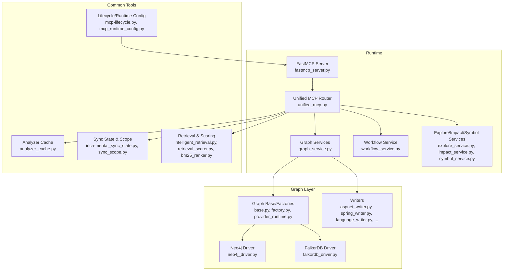
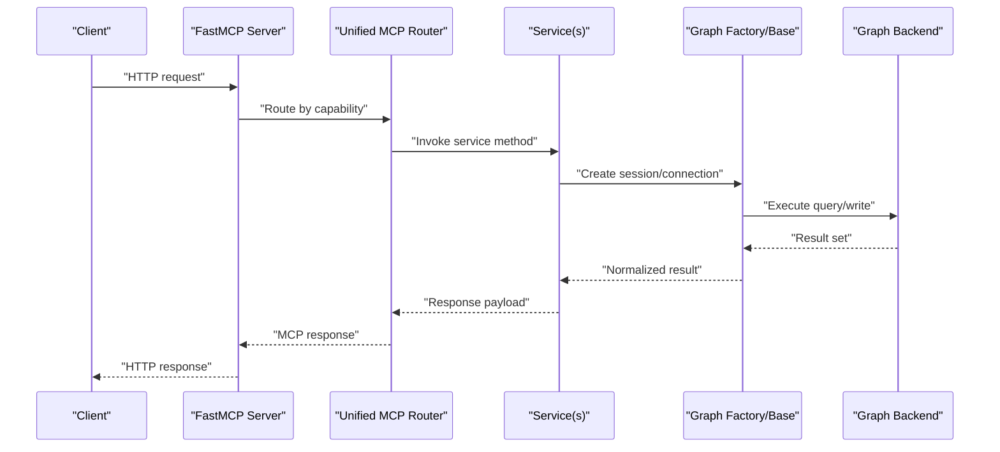
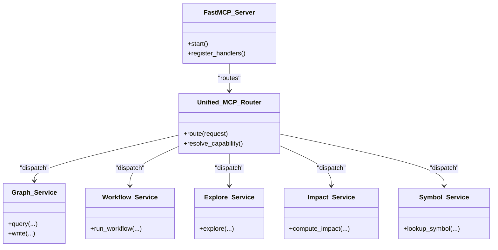
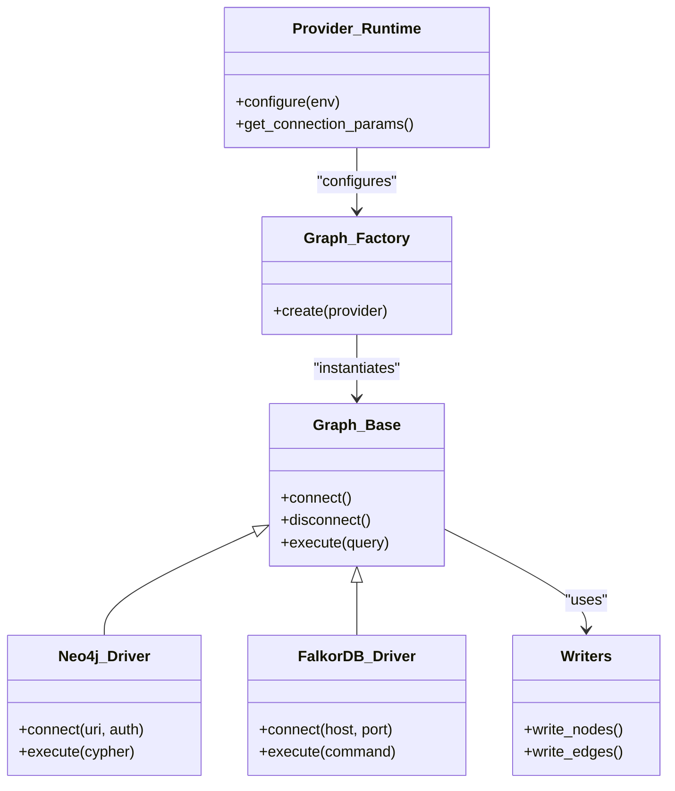
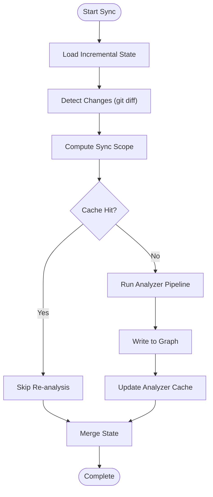
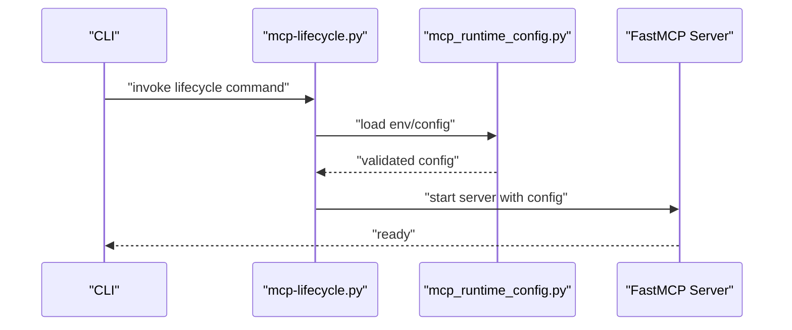
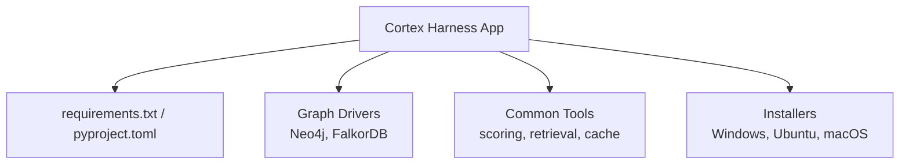

# Cloud Platform Deployments

<cite>
**Referenced Files in This Document**
- [ReadMe.md](file://ReadMe.md)
- [Makefile](file://Makefile)
- [requirements.txt](file://requirements.txt)
- [pyproject.toml](file://pyproject.toml)
- [cortex_harness/dev.py](file://cortex_harness/dev.py)
- [harness/scripts/orchestrator.py](file://harness/scripts/orchestrator.py)
- [harness/templates/config.yaml](file://harness/templates/config.yaml)
- [code-tiny/mcp/fastmcp_server.py](file://code-tiny/mcp/fastmcp_server.py)
- [code-tiny/mcp/unified_mcp.py](file://code-tiny/mcp/unified_mcp.py)
- [code-tiny/mcp/services/graph_service.py](file://code-tiny/mcp/services/graph_service.py)
- [code-tiny/mcp/services/workflow_service.py](file://code-tiny/mcp/services/workflow_service.py)
- [code-tiny/mcp/services/explore_service.py](file://code-tiny/mcp/services/explore_service.py)
- [code-tiny/mcp/services/impact_service.py](file://code-tiny/mcp/services/impact_service.py)
- [code-tiny/mcp/services/symbol_service.py](file://code-tiny/mcp/services/symbol_service.py)
- [code-tiny/mcp/framework_registry.py](file://code-tiny/mcp/framework_registry.py)
- [code-tiny/mcp/tool_metadata.py](file://code-tiny/mcp/tool_metadata.py)
- [code-tiny/mcp/semantic_graph_expansion.py](file://code-tiny/mcp/semantic_graph_expansion.py)
- [code-tiny/tools/common/harness_config.py](file://code-tiny/tools/common/harness_config.py)
- [code-tiny/tools/common/incremental_sync_state.py](file://code-tiny/tools/common/incremental_sync_state.py)
- [code-tiny/tools/common/analyzer_cache.py](file://code-tiny/tools/common/analyzer_cache.py)
- [code-tiny/tools/graph/driver/neo4j_driver.py](file://code-tiny/tools/graph/driver/neo4j_driver.py)
- [code-tiny/tools/graph/driver/falkordb_driver.py](file://code-tiny/tools/graph/driver/falkordb_driver.py)
- [code-tiny/tools/graph/core/base.py](file://code-tiny/tools/graph/core/base.py)
- [code-tiny/tools/graph/core/factory.py](file://code-tiny/tools/graph/core/factory.py)
- [code-tiny/tools/graph/core/provider_runtime.py](file://code-tiny/tools/graph/core/provider_runtime.py)
- [code-tiny/tools/graph/core/require_neo4j.py](file://code-tiny/tools/graph/core/require_neo4j.py)
- [code-tiny/tools/graph/operations/class_ops.py](file://code-tiny/tools/graph/operations/class_ops.py)
- [code-tiny/tools/graph/operations/function_ops.py](file://code-tiny/tools/graph/operations/function_ops.py)
- [code-tiny/tools/graph/operations/document_ops.py](file://code-tiny/tools/graph/operations/document_ops.py)
- [code-tiny/tools/graph/operations/cross_edge_ops.py](file://code-tiny/tools/graph/operations/cross_edge_ops.py)
- [code-tiny/tools/graph/operations/namespace_ops.py](file://code-tiny/tools/graph/operations/namespace_ops.py)
- [code-tiny/tools/graph/operations/package_ops.py](file://code-tiny/tools/graph/operations/package_ops.py)
- [code-tiny/tools/graph/operations/type_ops.py](file://code-tiny/tools/graph/operations/type_ops.py)
- [code-tiny/tools/graph/operations/infra_ops.py](file://code-tiny/tools/graph/operations/infra_ops.py)
- [code-tiny/tools/graph/writer/aspnet_writer.py](file://code-tiny/tools/graph/writer/aspnet_writer.py)
- [code-tiny/tools/graph/writer/database_schema_writer.py](file://code-tiny/tools/graph/writer/database_schema_writer.py)
- [code-tiny/tools/graph/writer/language_writer.py](file://code-tiny/tools/graph/writer/language_writer.py)
- [code-tiny/tools/graph/writer/mybatis_writer.py](file://code-tiny/tools/graph/writer/mybatis_writer.py)
- [code-tiny/tools/graph/writer/servlet_jsp_writer.py](file://code-tiny/tools/graph/writer/servlet_jsp_writer.py)
- [code-tiny/tools/graph/writer/spring_writer.py](file://code-tiny/tools/graph/writer/spring_writer.py)
- [code-tiny/tools/graph/writer/web_framework_writer.py](file://code-tiny/tools/graph/writer/web_framework_writer.py)
- [code-tiny/tools/common/api_match_engine.py](file://code-tiny/tools/common/api_match_engine.py)
- [code-tiny/tools/common/bm25_ranker.py](file://code-tiny/tools/common/bm25_ranker.py)
- [code-tiny/tools/common/call_graph_builder.py](file://code-tiny/tools/common/call_graph_builder.py)
- [code-tiny/tools/common/confidence_scorer.py](file://code-tiny/tools/common/confidence_scorer.py)
- [code-tiny/tools/common/frontend_relationship_extractor.py](file://code-tiny/tools/common/frontend_relationship_extractor.py)
- [code-tiny/tools/common/git_diff.py](file://code-tiny/tools/common/git_diff.py)
- [code-tiny/tools/common/graph_expander.py](file://code-tiny/tools/common/graph_expander.py)
- [code-tiny/tools/common/incremental_cleanup.py](file://code-tiny/tools/common/incremental_cleanup.py)
- [code-tiny/tools/common/intelligent_retrieval.py](file://code-tiny/tools/common/intelligent_retrieval.py)
- [code-tiny/tools/common/llm_summary.py](file://code-tiny/tools/common/llm_summary.py)
- [code-tiny/tools/common/message_scan.py](file://code-tiny/tools/common/message_scan.py)
- [code-tiny/tools/common/primary_vector_sync.py](file://code-tiny/tools/common/primary_vector_sync.py)
- [code-tiny/tools/common/query_intent_classifier.py](file://code-tiny/tools/common/query_intent_classifier.py)
- [code-tiny/tools/common/query_understanding.py](file://code-tiny/tools/common/query_understanding.py)
- [code-tiny/tools/common/react_role_classifier.py](file://code-tiny/tools/common/react_role_classifier.py)
- [code-tiny/tools/common/result_packager.py](file://code-tiny/tools/common/result_packager.py)
- [code-tiny/tools/common/retrieval_scorer.py](file://code-tiny/tools/common/retrieval_scorer.py)
- [code-tiny/tools/common/semantic_inference.py](file://code-tiny/tools/common/semantic_inference.py)
- [code-tiny/tools/common/signal_normalizer.py](file://code-tiny/tools/common/signal_normalizer.py)
- [code-tiny/tools/common/source_inventory.py](file://code-tiny/tools/common/source_inventory.py)
- [code-tiny/tools/common/sync_scope.py](file://code-tiny/tools/common/sync_scope.py)
- [code-tiny/tools/common/url_normalizer.py](file://code-tiny/tools/common/url_normalizer.py)
- [code-tiny/tools/common/workflow_classifier.py](file://code-tiny/tools/common/workflow_classifier.py)
- [code-tiny/tools/common/workflow_impact_scorer.py](file://code-tiny/tools/common/workflow_impact_scorer.py)
- [doc-tiny/graph_store.py](file://doc-tiny/graph_store.py)
- [doc-tiny/neo4j_loader.py](file://doc-tiny/neo4j_loader.py)
- [doc-tiny/model.py](file://doc-tiny/model.py)
- [doc-tiny/embedding_utils.py](file://doc-tiny/embedding_utils.py)
- [doc-tiny/graphrag_ingest_langextract.py](file://doc-tiny/graphrag_ingest_langextract.py)
- [doc-tiny/graphrag_query_langextract.py](file://doc-tiny/graphrag_query_langextract.py)
- [doc-tiny/mcp_graph_rag.py](file://doc-tiny/mcp_graph_rag.py)
- [scripts/mcp-lifecycle.py](file://scripts/mcp-lifecycle.py)
- [scripts/mcp_runtime_config.py](file://scripts/mcp_runtime_config.py)
- [scripts/validate_retrieval.py](file://scripts/validate_retrieval.py)
- [installers/README.md](file://installers/README.md)
- [installers/windows/__init__.py](file://installers/windows/__init__.py)
- [installers/windows/registry_manager.py](file://installers/windows/registry_manager.py)
- [installers/ubuntu/scripts/build_deb.sh](file://installers/ubuntu/scripts/build_deb.sh)
- [installers/macos/workflows/build_pkg.sh](file://installers/macos/workflows/build_pkg.sh)
- [docs/DATABASE_INTEGRATION.md](file://docs/DATABASE_INTEGRATION.md)
- [docs/HARNESS_WORKFLOW.md](file://docs/HARNESS_WORKFLOW.md)
- [docs/MCP_CAPABILITY_ACCEPTANCE_MATRIX.md](file://docs/MCP_CAPABILITY_ACCEPTANCE_MATRIX.md)
</cite>

## Table of Contents
1. [Introduction](#introduction)
2. [Project Structure](#project-structure)
3. [Core Components](#core-components)
4. [Architecture Overview](#architecture-overview)
5. [Detailed Component Analysis](#detailed-component-analysis)
6. [Dependency Analysis](#dependency-analysis)
7. [Performance Considerations](#performance-considerations)
8. [Troubleshooting Guide](#troubleshooting-guide)
9. [Conclusion](#conclusion)
10. [Appendices](#appendices)

## Introduction
This document provides comprehensive cloud platform deployment guidance for Cortex Harness across major providers: AWS (ECS with Fargate and EKS), Azure (AKS), and Google Cloud (GKE). It covers serverless execution, Kubernetes orchestration, managed graph database alternatives (RDS/DocumentDB, Cloud SQL), caching layers, ingress/load balancing, monitoring, security, compliance, auto-scaling, cost optimization, disaster recovery, backup automation, and cross-region replication patterns. Where applicable, it maps the application’s runtime components to cloud resources and highlights configuration points derived from the repository.

## Project Structure
Cortex Harness is a Python-based code analysis and MCP (Model Context Protocol) service with multiple analyzers, a graph layer, and an HTTP API surface. The key runtime elements relevant to cloud deployments include:
- MCP HTTP server entrypoints
- Graph driver abstractions and writers
- Common analysis utilities and caches
- Lifecycle and runtime configuration scripts
- Installer packaging for local environments

**Diagram sources**
- [code-tiny/mcp/fastmcp_server.py](file://code-tiny/mcp/fastmcp_server.py)
- [code-tiny/mcp/unified_mcp.py](file://code-tiny/mcp/unified_mcp.py)
- [code-tiny/mcp/services/graph_service.py](file://code-tiny/mcp/services/graph_service.py)
- [code-tiny/mcp/services/workflow_service.py](file://code-tiny/mcp/services/workflow_service.py)
- [code-tiny/mcp/services/explore_service.py](file://code-tiny/mcp/services/explore_service.py)
- [code-tiny/mcp/services/impact_service.py](file://code-tiny/mcp/services/impact_service.py)
- [code-tiny/mcp/services/symbol_service.py](file://code-tiny/mcp/services/symbol_service.py)
- [code-tiny/tools/graph/core/base.py](file://code-tiny/tools/graph/core/base.py)
- [code-tiny/tools/graph/core/factory.py](file://code-tiny/tools/graph/core/factory.py)
- [code-tiny/tools/graph/core/provider_runtime.py](file://code-tiny/tools/graph/core/provider_runtime.py)
- [code-tiny/tools/graph/driver/neo4j_driver.py](file://code-tiny/tools/graph/driver/neo4j_driver.py)
- [code-tiny/tools/graph/driver/falkordb_driver.py](file://code-tiny/tools/graph/driver/falkordb_driver.py)
- [code-tiny/tools/graph/writer/aspnet_writer.py](file://code-tiny/tools/graph/writer/aspnet_writer.py)
- [code-tiny/tools/graph/writer/spring_writer.py](file://code-tiny/tools/graph/writer/spring_writer.py)
- [code-tiny/tools/graph/writer/language_writer.py](file://code-tiny/tools/graph/writer/language_writer.py)
- [code-tiny/tools/common/analyzer_cache.py](file://code-tiny/tools/common/analyzer_cache.py)
- [code-tiny/tools/common/incremental_sync_state.py](file://code-tiny/tools/common/incremental_sync_state.py)
- [code-tiny/tools/common/sync_scope.py](file://code-tiny/tools/common/sync_scope.py)
- [code-tiny/tools/common/intelligent_retrieval.py](file://code-tiny/tools/common/intelligent_retrieval.py)
- [code-tiny/tools/common/retrieval_scorer.py](file://code-tiny/tools/common/retrieval_scorer.py)
- [code-tiny/tools/common/bm25_ranker.py](file://code-tiny/tools/common/bm25_ranker.py)
- [scripts/mcp-lifecycle.py](file://scripts/mcp-lifecycle.py)
- [scripts/mcp_runtime_config.py](file://scripts/mcp_runtime_config.py)

**Section sources**
- [ReadMe.md](file://ReadMe.md)
- [Makefile](file://Makefile)
- [requirements.txt](file://requirements.txt)
- [pyproject.toml](file://pyproject.toml)
- [cortex_harness/dev.py](file://cortex_harness/dev.py)
- [harness/scripts/orchestrator.py](file://harness/scripts/orchestrator.py)
- [harness/templates/config.yaml](file://harness/templates/config.yaml)
- [code-tiny/mcp/fastmcp_server.py](file://code-tiny/mcp/fastmcp_server.py)
- [code-tiny/mcp/unified_mcp.py](file://code-tiny/mcp/unified_mcp.py)
- [code-tiny/mcp/services/graph_service.py](file://code-tiny/mcp/services/graph_service.py)
- [code-tiny/mcp/services/workflow_service.py](file://code-tiny/mcp/services/workflow_service.py)
- [code-tiny/mcp/services/explore_service.py](file://code-tiny/mcp/services/explore_service.py)
- [code-tiny/mcp/services/impact_service.py](file://code-tiny/mcp/services/impact_service.py)
- [code-tiny/mcp/services/symbol_service.py](file://code-tiny/mcp/services/symbol_service.py)
- [code-tiny/tools/graph/core/base.py](file://code-tiny/tools/graph/core/base.py)
- [code-tiny/tools/graph/core/factory.py](file://code-tiny/tools/graph/core/factory.py)
- [code-tiny/tools/graph/core/provider_runtime.py](file://code-tiny/tools/graph/core/provider_runtime.py)
- [code-tiny/tools/graph/driver/neo4j_driver.py](file://code-tiny/tools/graph/driver/neo4j_driver.py)
- [code-tiny/tools/graph/driver/falkordb_driver.py](file://code-tiny/tools/graph/driver/falkordb_driver.py)
- [code-tiny/tools/common/analyzer_cache.py](file://code-tiny/tools/common/analyzer_cache.py)
- [code-tiny/tools/common/incremental_sync_state.py](file://code-tiny/tools/common/incremental_sync_state.py)
- [code-tiny/tools/common/sync_scope.py](file://code-tiny/tools/common/sync_scope.py)
- [code-tiny/tools/common/intelligent_retrieval.py](file://code-tiny/tools/common/intelligent_retrieval.py)
- [code-ttiny/tools/common/retrieval_scorer.py](file://code-tiny/tools/common/retrieval_scorer.py)
- [code-tiny/tools/common/bm25_ranker.py](file://code-tiny/tools/common/bm25_ranker.py)
- [scripts/mcp-lifecycle.py](file://scripts/mcp-lifecycle.py)
- [scripts/mcp_runtime_config.py](file://scripts/mcp_runtime_config.py)

## Core Components
- MCP HTTP Server: Exposes MCP endpoints via FastMCP and routes requests through a unified router to specialized services.
- Graph Abstraction: Pluggable drivers (Neo4j, FalkorDB) with writer modules per framework/language.
- Common Utilities: Caching, incremental sync state, retrieval/scoring, and lifecycle/runtime configuration.
- Lifecycle Scripts: Orchestrate MCP runtime configuration and validation.

Key responsibilities:
- Request routing and protocol handling
- Graph read/write operations via pluggable drivers
- Incremental synchronization and caching
- Runtime configuration loading and validation

**Section sources**
- [code-tiny/mcp/fastmcp_server.py](file://code-tiny/mcp/fastmcp_server.py)
- [code-tiny/mcp/unified_mcp.py](file://code-tiny/mcp/unified_mcp.py)
- [code-tiny/tools/graph/core/base.py](file://code-tiny/tools/graph/core/base.py)
- [code-tiny/tools/graph/core/factory.py](file://code-tiny/tools/graph/core/factory.py)
- [code-tiny/tools/graph/core/provider_runtime.py](file://code-tiny/tools/graph/core/provider_runtime.py)
- [code-tiny/tools/graph/driver/neo4j_driver.py](file://code-tiny/tools/graph/driver/neo4j_driver.py)
- [code-tiny/tools/graph/driver/falkordb_driver.py](file://code-tiny/tools/graph/driver/falkordb_driver.py)
- [code-tiny/tools/common/analyzer_cache.py](file://code-tiny/tools/common/analyzer_cache.py)
- [code-tiny/tools/common/incremental_sync_state.py](file://code-tiny/tools/common/incremental_sync_state.py)
- [scripts/mcp-lifecycle.py](file://scripts/mcp-lifecycle.py)
- [scripts/mcp_runtime_config.py](file://scripts/mcp_runtime_config.py)

## Architecture Overview
The system exposes an HTTP API that routes MCP calls to services which interact with a graph backend. The graph layer abstracts over different backends and includes writers for various frameworks/languages.

**Diagram sources**
- [code-tiny/mcp/fastmcp_server.py](file://code-tiny/mcp/fastmcp_server.py)
- [code-tiny/mcp/unified_mcp.py](file://code-tiny/mcp/unified_mcp.py)
- [code-tiny/mcp/services/graph_service.py](file://code-tiny/mcp/services/graph_service.py)
- [code-tiny/tools/graph/core/factory.py](file://code-tiny/tools/graph/core/factory.py)
- [code-tiny/tools/graph/core/base.py](file://code-tiny/tools/graph/core/base.py)
- [code-tiny/tools/graph/driver/neo4j_driver.py](file://code-tiny/tools/graph/driver/neo4j_driver.py)
- [code-tiny/tools/graph/driver/falkordb_driver.py](file://code-tiny/tools/graph/driver/falkordb_driver.py)

## Detailed Component Analysis

### MCP Server and Routing
- Entry point initializes the FastMCP server and registers handlers.
- Unified router dispatches to specific services based on tool/capability metadata.
- Services encapsulate domain logic (graph queries, workflows, exploration, impact, symbols).

**Diagram sources**
- [code-tiny/mcp/fastmcp_server.py](file://code-tiny/mcp/fastmcp_server.py)
- [code-tiny/mcp/unified_mcp.py](file://code-tiny/mcp/unified_mcp.py)
- [code-tiny/mcp/services/graph_service.py](file://code-tiny/mcp/services/graph_service.py)
- [code-tiny/mcp/services/workflow_service.py](file://code-tiny/mcp/services/workflow_service.py)
- [code-tiny/mcp/services/explore_service.py](file://code-tiny/mcp/services/explore_service.py)
- [code-tiny/mcp/services/impact_service.py](file://code-tiny/mcp/services/impact_service.py)
- [code-tiny/mcp/services/symbol_service.py](file://code-tiny/mcp/services/symbol_service.py)

**Section sources**
- [code-tiny/mcp/fastmcp_server.py](file://code-tiny/mcp/fastmcp_server.py)
- [code-tiny/mcp/unified_mcp.py](file://code-tiny/mcp/unified_mcp.py)
- [code-tiny/mcp/tool_metadata.py](file://code-tiny/mcp/tool_metadata.py)
- [code-tiny/mcp/framework_registry.py](file://code-tiny/mcp/framework_registry.py)

### Graph Layer and Drivers
- Base and factory manage connection/session lifecycles and provider selection.
- Drivers implement concrete interactions with Neo4j or FalkorDB.
- Writers translate framework-specific constructs into graph nodes/edges.

**Diagram sources**
- [code-tiny/tools/graph/core/base.py](file://code-tiny/tools/graph/core/base.py)
- [code-tiny/tools/graph/core/factory.py](file://code-tiny/tools/graph/core/factory.py)
- [code-tiny/tools/graph/core/provider_runtime.py](file://code-tiny/tools/graph/core/provider_runtime.py)
- [code-tiny/tools/graph/driver/neo4j_driver.py](file://code-tiny/tools/graph/driver/neo4j_driver.py)
- [code-tiny/tools/graph/driver/falkordb_driver.py](file://code-tiny/tools/graph/driver/falkordb_driver.py)
- [code-tiny/tools/graph/writer/aspnet_writer.py](file://code-tiny/tools/graph/writer/aspnet_writer.py)
- [code-tiny/tools/graph/writer/spring_writer.py](file://code-tiny/tools/graph/writer/spring_writer.py)
- [code-tiny/tools/graph/writer/language_writer.py](file://code-tiny/tools/graph/writer/language_writer.py)

**Section sources**
- [code-tiny/tools/graph/core/base.py](file://code-tiny/tools/graph/core/base.py)
- [code-tiny/tools/graph/core/factory.py](file://code-tiny/tools/graph/core/factory.py)
- [code-tiny/tools/graph/core/provider_runtime.py](file://code-tiny/tools/graph/core/provider_runtime.py)
- [code-tiny/tools/graph/driver/neo4j_driver.py](file://code-tiny/tools/graph/driver/neo4j_driver.py)
- [code-tiny/tools/graph/driver/falkordb_driver.py](file://code-tiny/tools/graph/driver/falkordb_driver.py)
- [code-tiny/tools/graph/writer/aspnet_writer.py](file://code-tiny/tools/graph/writer/aspnet_writer.py)
- [code-tiny/tools/graph/writer/spring_writer.py](file://code-tiny/tools/graph/writer/spring_writer.py)
- [code-tiny/tools/graph/writer/language_writer.py](file://code-tiny/tools/graph/writer/language_writer.py)

### Common Utilities and Caching
- Analyzer cache reduces redundant work across runs.
- Incremental sync state tracks changes and scopes for efficient updates.
- Retrieval and scoring modules support intelligent search and ranking.

**Diagram sources**
- [code-tiny/tools/common/analyzer_cache.py](file://code-tiny/tools/common/analyzer_cache.py)
- [code-tiny/tools/common/incremental_sync_state.py](file://code-tiny/tools/common/incremental_sync_state.py)
- [code-tiny/tools/common/sync_scope.py](file://code-tiny/tools/common/sync_scope.py)
- [code-tiny/tools/common/git_diff.py](file://code-tiny/tools/common/git_diff.py)
- [code-tiny/tools/common/intelligent_retrieval.py](file://code-tiny/tools/common/intelligent_retrieval.py)
- [code-tiny/tools/common/retrieval_scorer.py](file://code-tiny/tools/common/retrieval_scorer.py)
- [code-tiny/tools/common/bm25_ranker.py](file://code-tiny/tools/common/bm25_ranker.py)

**Section sources**
- [code-tiny/tools/common/analyzer_cache.py](file://code-tiny/tools/common/analyzer_cache.py)
- [code-tiny/tools/common/incremental_sync_state.py](file://code-tiny/tools/common/incremental_sync_state.py)
- [code-tiny/tools/common/sync_scope.py](file://code-tiny/tools/common/sync_scope.py)
- [code-tiny/tools/common/git_diff.py](file://code-tiny/tools/common/git_diff.py)
- [code-tiny/tools/common/intelligent_retrieval.py](file://code-tiny/tools/common/intelligent_retrieval.py)
- [code-tiny/tools/common/retrieval_scorer.py](file://code-tiny/tools/common/retrieval_scorer.py)
- [code-tiny/tools/common/bm25_ranker.py](file://code-tiny/tools/common/bm25_ranker.py)

### Lifecycle and Runtime Configuration
- Lifecycle script orchestrates MCP runtime setup and validation.
- Runtime config loader centralizes environment-driven settings.

**Diagram sources**
- [scripts/mcp-lifecycle.py](file://scripts/mcp-lifecycle.py)
- [scripts/mcp_runtime_config.py](file://scripts/mcp_runtime_config.py)
- [code-tiny/mcp/fastmcp_server.py](file://code-tiny/mcp/fastmcp_server.py)

**Section sources**
- [scripts/mcp-lifecycle.py](file://scripts/mcp-lifecycle.py)
- [scripts/mcp_runtime_config.py](file://scripts/mcp_runtime_config.py)

## Dependency Analysis
External dependencies are declared in requirements and project metadata. The runtime depends on graph drivers and common analysis libraries.

**Diagram sources**
- [requirements.txt](file://requirements.txt)
- [pyproject.toml](file://pyproject.toml)
- [code-tiny/tools/graph/driver/neo4j_driver.py](file://code-tiny/tools/graph/driver/neo4j_driver.py)
- [code-tiny/tools/graph/driver/falkordb_driver.py](file://code-tiny/tools/graph/driver/falkordb_driver.py)
- [code-tiny/tools/common/analyzer_cache.py](file://code-tiny/tools/common/analyzer_cache.py)
- [installers/README.md](file://installers/README.md)

**Section sources**
- [requirements.txt](file://requirements.txt)
- [pyproject.toml](file://pyproject.toml)
- [installers/README.md](file://installers/README.md)

## Performance Considerations
- Use analyzer cache to avoid re-analyzing unchanged files.
- Prefer incremental sync scope to limit processing to changed units.
- Tune graph driver connection pools and timeouts according to workload.
- Enable caching at the edge (e.g., Redis) for frequently accessed results if needed.
- Scale horizontally behind load balancers; ensure stateless service instances.

[No sources needed since this section provides general guidance]

## Troubleshooting Guide
- Validate MCP runtime configuration before starting the server.
- Inspect lifecycle logs for initialization errors.
- Verify graph connectivity using driver health checks.
- Confirm environment variables and secrets are correctly injected.

**Section sources**
- [scripts/mcp-lifecycle.py](file://scripts/mcp-lifecycle.py)
- [scripts/mcp_runtime_config.py](file://scripts/mcp_runtime_config.py)
- [code-tiny/tools/graph/core/require_neo4j.py](file://code-tiny/tools/graph/core/require_neo4j.py)

## Conclusion
Cortex Harness can be deployed across AWS, Azure, and Google Cloud using ECS/EKS/AKS with managed databases and caching. Its modular graph abstraction supports multiple backends, while lifecycle and configuration scripts simplify operational tasks. For production, apply provider-specific security, monitoring, scaling, and DR strategies outlined below.

[No sources needed since this section summarizes without analyzing specific files]

## Appendices

### AWS Deployment Patterns
- ECS with Fargate (serverless):
  - Containerize the MCP server and run as a task definition.
  - Use AWS Secrets Manager for credentials.
  - Place behind Application Load Balancer; enable HTTPS.
  - Configure Auto Scaling based on CPU/memory or custom metrics.
- EKS (Kubernetes):
  - Deploy as Deployment/Service/Ingress.
  - Use IAM Roles for Service Accounts (IRSA) for least privilege.
  - Store secrets in AWS Secrets Manager and mount via CSI.
  - Use Cluster Autoscaler and Karpenter for node scaling.
- Graph Database Alternatives:
  - RDS (relational) or DocumentDB (document) as alternatives where compatible with your data model.
  - Ensure VPC peering/PrivateLink and security groups restrict access.
- Monitoring:
  - CloudWatch Logs and Metrics; optionally X-Ray for tracing.
  - Create dashboards for request latency, error rates, and graph operation throughput.
- Security and Compliance:
  - Enforce TLS, least-privilege IAM, network isolation, encryption at rest.
  - Align with SOC 2/ISO 27001 controls as required.
- Disaster Recovery:
  - Automated backups for RDS/DocumentDB; define retention policies.
  - Cross-region replication for critical data stores.
  - Multi-AZ deployments for high availability.

[No sources needed since this section provides general guidance]

### Azure Deployment Patterns
- AKS (Kubernetes):
  - Deploy as Deployment/Service/Ingress.
  - Use Azure Managed Identity for secure access to Key Vault, Storage, etc.
  - Store secrets in Azure Key Vault; use CSI Secret Store Driver.
- Caching:
  - Azure Cache for Redis integration for hot paths and session/state caching.
- Ingress:
  - Azure Application Gateway with WAF for TLS termination and protection.
- Monitoring:
  - Azure Monitor and Application Insights for metrics/logs/traces.
  - Grafana dashboards via Azure Managed Grafana.
- Security and Compliance:
  - Network Policies, Private Link, Key Vault-managed certificates.
  - Align with ISO 27001/SOC 2 as required.
- Disaster Recovery:
  - Backup strategies for managed databases; geo-replication where supported.
  - Multi-region AKS clusters with traffic manager or global load balancing.

[No sources needed since this section provides general guidance]

### Google Cloud Deployment Patterns
- GKE (Kubernetes):
  - Deploy as Deployment/Service/Ingress.
  - Use Workload Identity for secure service-to-service access.
  - Store secrets in Secret Manager; mount via CSI.
- Databases:
  - Cloud SQL alternatives for relational needs; consider AlloyDB for performance.
- Load Balancing:
  - Google Cloud Load Balancer with SSL/TLS termination.
- Monitoring:
  - Cloud Monitoring and Logging; integrate with OpenTelemetry.
  - Build dashboards for SLOs and error budgets.
- Security and Compliance:
  - VPC Service Controls, Private Service Connect, least-privilege IAM.
  - Align with SOC 2/ISO 27001 as required.
- Disaster Recovery:
  - Automated backups and cross-region replication for Cloud SQL.
  - Multi-cluster multi-region deployments with failover policies.

[No sources needed since this section provides general guidance]

### Terraform Modules and IaC Guidance
- Provide reusable modules for:
  - Networking (VPC/VNet/GCP networks, subnets, NAT)
  - Compute (ECS tasks, EKS/AKS/GKE clusters)
  - Databases (RDS/DocumentDB/Cloud SQL)
  - Caching (Redis)
  - Ingress/LB (ALB, Application Gateway, Cloud LB)
  - Secrets management (Secrets Manager, Key Vault, Secret Manager)
  - Monitoring (CloudWatch, Azure Monitor, Cloud Monitoring)
- Parameterize regions, instance sizes, and scaling thresholds.
- Use remote state and locking for team collaboration.

[No sources needed since this section provides general guidance]

### Auto-Scaling Policies
- ECS: Target tracking on CPU/memory; step scaling for custom metrics.
- EKS/AKS/GKE: HPA for CPU/memory and custom metrics; cluster autoscaler/Karpenter for nodes.
- Define scale-up/down cooldowns and min/max replicas.

[No sources needed since this section provides general guidance]

### Cost Optimization Strategies
- Right-size containers and nodes; use spot/preemptible instances for non-critical workloads.
- Leverage reserved capacity for stable baseline demand.
- Implement caching to reduce expensive graph operations.
- Optimize graph queries and indexing; batch writes.
- Use lifecycle policies for logs and artifacts.

[No sources needed since this section provides general guidance]

### Disaster Recovery Procedures
- Define RPO/RTO targets per component.
- Automate backups for databases and object storage.
- Test restore procedures regularly.
- Maintain runbooks for incident response and rollback.

[No sources needed since this section provides general guidance]

### Backup Automation and Cross-Region Replication
- Schedule periodic snapshots/backups with retention rules.
- Enable cross-region replication for critical data stores.
- Validate integrity post-replication and during restores.

[No sources needed since this section provides general guidance]

### Platform-Specific Security and Compliance
- Enforce TLS everywhere; rotate certificates automatically.
- Apply least-privilege IAM/Managed Identities.
- Isolate services in private subnets; restrict egress.
- Encrypt data at rest and in transit.
- Audit access and maintain compliance evidence.

[No sources needed since this section provides general guidance]

### Monitoring Dashboards
- Track request latency, throughput, error rates.
- Monitor graph operations (read/write latency, failures).
- Observe resource utilization (CPU, memory, disk, network).
- Alert on SLO breaches and anomalies.

[No sources needed since this section provides general guidance]