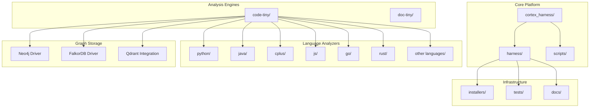
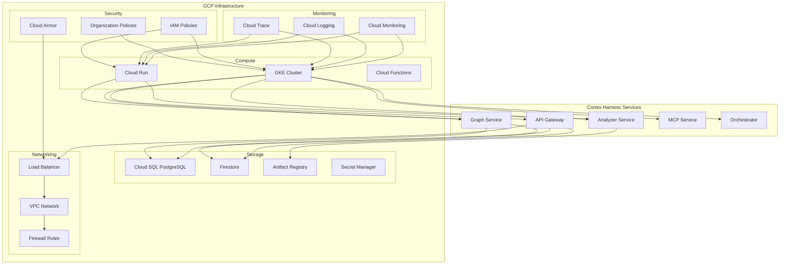
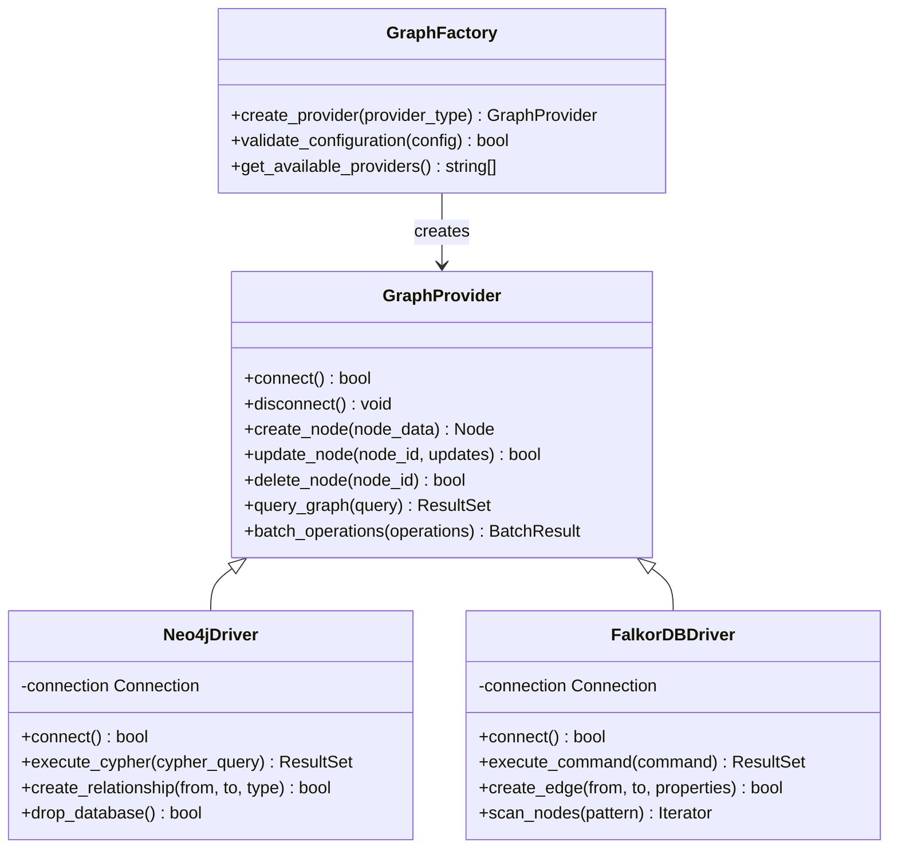
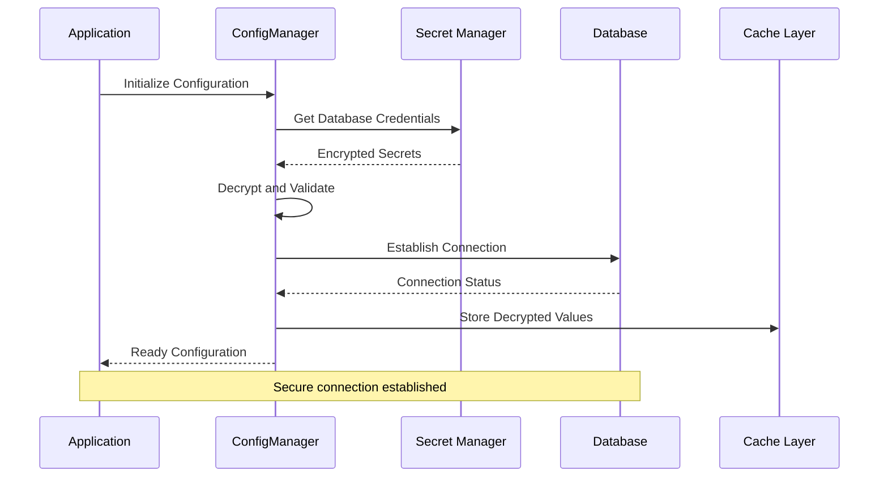
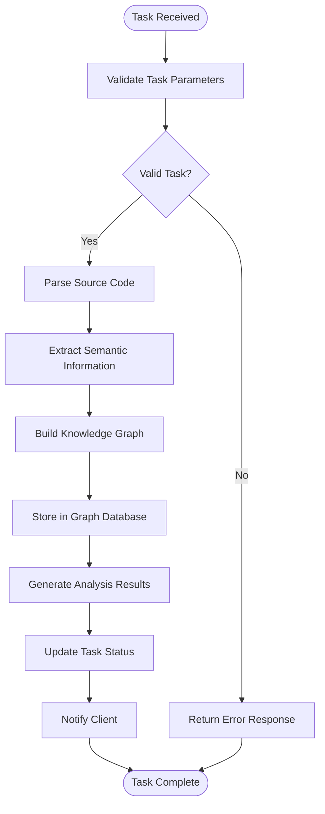
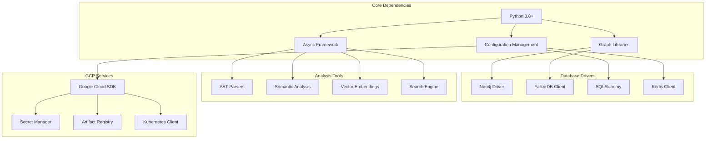

# Google Cloud Deployment

<cite>
**Referenced Files in This Document**
- [ReadMe.md](file://ReadMe.md)
- [Makefile](file://Makefile)
- [requirements.txt](file://requirements.txt)
- [pyproject.toml](file://pyproject.toml)
- [cortex_harness/dev.py](file://cortex_harness/dev.py)
- [harness/scripts/orchestrator.py](file://harness/scripts/orchestrator.py)
- [harness/templates/config.yaml](file://harness/templates/config.yaml)
- [code-tiny/graph/driver/neo4j_driver.py](file://code-tiny/graph/driver/neo4j_driver.py)
- [code-tiny/graph/driver/falkordb_driver.py](file://code-tiny/graph/driver/falkordb_driver.py)
- [code-tiny/graph/core/provider_runtime.py](file://code-tiny/graph/core/provider_runtime.py)
- [code-tiny/graph/core/base.py](file://code-tiny/graph/core/base.py)
- [code-tiny/graph/core/factory.py](file://code-tiny/graph/core/factory.py)
- [doc-tiny/graph_store.py](file://doc-tiny/graph_store.py)
- [doc-tiny/neo4j_loader.py](file://doc-tiny/neo4j_loader.py)
- [scripts/mcp_runtime_config.py](file://scripts/mcp_runtime_config.py)
- [installers/common/config_manager.py](file://installers/common/config_manager.py)
</cite>

## Table of Contents
1. [Introduction](#introduction)
2. [Project Structure](#project-structure)
3. [Core Components](#core-components)
4. [Architecture Overview](#architecture-overview)
5. [Detailed Component Analysis](#detailed-component-analysis)
6. [Dependency Analysis](#dependency-analysis)
7. [Performance Considerations](#performance-considerations)
8. [Troubleshooting Guide](#troubleshooting-guide)
9. [Conclusion](#conclusion)
10. [Appendices](#appendices)

## Introduction

Cortex Harness is a comprehensive code analysis and graph-based intelligence platform that provides multi-language static analysis capabilities, semantic code understanding, and intelligent query interfaces. The system supports multiple programming languages including Python, Java, C++, JavaScript, Go, Rust, and many others through specialized analyzers.

This document provides comprehensive Google Cloud Platform (GCP) deployment guidance for Cortex Harness, covering container orchestration with GKE, serverless deployment with Cloud Run, database configuration with Cloud SQL and Firestore, security and networking setup, monitoring and observability, and disaster recovery strategies.

## Project Structure

The Cortex Harness project follows a modular architecture with clear separation between core analysis engines, language-specific analyzers, graph storage backends, and orchestration components:

**Diagram sources**
- [ReadMe.md](file://ReadMe.md)
- [Makefile](file://Makefile)

**Section sources**
- [ReadMe.md](file://ReadMe.md)
- [Makefile](file://Makefile)

## Core Components

### Graph Database Abstraction Layer

Cortex Harness implements a flexible graph database abstraction layer supporting multiple backends including Neo4j and FalkorDB. This abstraction enables seamless switching between different graph database providers while maintaining consistent API contracts.

### Multi-Language Analysis Framework

The platform provides specialized analyzers for various programming languages, each implementing common interfaces for code parsing, semantic analysis, and graph construction. The framework supports both traditional static analysis and modern AI-enhanced code understanding.

### MCP (Model Context Protocol) Integration

Cortex Harness includes comprehensive MCP support for integrating with AI models and tools, providing standardized interfaces for code analysis queries and results.

**Section sources**
- [cortex_harness/dev.py](file://cortex_harness/dev.py)
- [harness/scripts/orchestrator.py](file://harness/scripts/orchestrator.py)
- [code-tiny/graph/core/base.py](file://code-tiny/graph/core/base.py)
- [code-tiny/graph/core/factory.py](file://code-tiny/graph/core/factory.py)

## Architecture Overview

The Cortex Harness architecture follows a microservices-oriented design with clear separation of concerns:

**Diagram sources**
- [harness/templates/config.yaml](file://harness/templates/config.yaml)
- [code-tiny/graph/core/provider_runtime.py](file://code-tiny/graph/core/provider_runtime.py)

## Detailed Component Analysis

### Graph Database Provider Implementation

The graph database abstraction layer provides a unified interface for multiple backend implementations:

**Diagram sources**
- [code-tiny/graph/driver/neo4j_driver.py](file://code-tiny/graph/driver/neo4j_driver.py)
- [code-tiny/graph/driver/falkordb_driver.py](file://code-tiny/graph/driver/falkordb_driver.py)
- [code-tiny/graph/core/factory.py](file://code-tiny/graph/core/factory.py)

### Runtime Configuration Management

The runtime configuration system handles environment-specific settings and secret management:

**Diagram sources**
- [installers/common/config_manager.py](file://installers/common/config_manager.py)
- [scripts/mcp_runtime_config.py](file://scripts/mcp_runtime_config.py)

### Orchestrator Service Flow

The orchestrator manages the lifecycle of analysis tasks and coordinates between different services:

**Diagram sources**
- [harness/scripts/orchestrator.py](file://harness/scripts/orchestrator.py)

**Section sources**
- [code-tiny/graph/driver/neo4j_driver.py](file://code-tiny/graph/driver/neo4j_driver.py)
- [code-t tiny/graph/driver/falkordb_driver.py](file://code-tiny/graph/driver/falkordb_driver.py)
- [code-tiny/graph/core/factory.py](file://code-tiny/graph/core/factory.py)
- [installers/common/config_manager.py](file://installers/common/config_manager.py)
- [harness/scripts/orchestrator.py](file://harness/scripts/orchestrator.py)

## Dependency Analysis

The Cortex Harness project has well-defined dependencies across its components:

**Diagram sources**
- [requirements.txt](file://requirements.txt)
- [pyproject.toml](file://pyproject.toml)

**Section sources**
- [requirements.txt](file://requirements.txt)
- [pyproject.toml](file://pyproject.toml)

## Performance Considerations

### Container Optimization

For optimal performance on GKE and Cloud Run:

- **Resource Allocation**: Configure appropriate CPU and memory limits based on analysis workload patterns
- **Horizontal Pod Autoscaling**: Set up autoscaling policies based on CPU utilization and queue depth
- **Connection Pooling**: Implement database connection pooling for high-throughput scenarios
- **Caching Strategy**: Utilize Redis or Memcached for frequently accessed graph data

### Database Performance

- **Neo4j**: Enable query optimization and indexing for large codebases
- **FalkorDB**: Leverage native graph operations for complex traversals
- **Connection Management**: Implement proper connection lifecycle management
- **Batch Operations**: Use batch processing for large-scale graph updates

### Monitoring and Observability

- **Custom Metrics**: Export application-specific metrics to Cloud Monitoring
- **Distributed Tracing**: Implement OpenTelemetry for request tracing across services
- **Structured Logging**: Use JSON-formatted logs for better analysis in Cloud Logging
- **Health Checks**: Implement comprehensive health check endpoints

## Troubleshooting Guide

### Common Deployment Issues

**Container Startup Failures**
- Verify environment variable configuration
- Check Secret Manager access permissions
- Validate database connectivity
- Review resource constraints

**Graph Database Connection Issues**
- Confirm network connectivity and firewall rules
- Validate authentication credentials
- Check database instance status
- Monitor connection pool utilization

**Performance Degradation**
- Analyze resource utilization patterns
- Review database query performance
- Check for memory leaks or excessive garbage collection
- Monitor network latency and throughput

### Debugging Strategies

- Enable detailed logging for critical components
- Use Kubernetes event logs for pod scheduling issues
- Monitor Cloud Monitoring dashboards for service health
- Implement distributed tracing for request flow analysis

**Section sources**
- [harness/templates/config.yaml](file://harness/templates/config.yaml)
- [code-tiny/graph/core/provider_runtime.py](file://code-tiny/graph/core/provider_runtime.py)

## Conclusion

Cortex Harness provides a robust foundation for code analysis and knowledge graph construction that can be effectively deployed on Google Cloud Platform. The modular architecture supports multiple deployment targets including GKE for scalable container orchestration and Cloud Run for serverless workloads.

Key deployment considerations include proper resource allocation, database selection based on workload characteristics, comprehensive monitoring and observability, and robust security practices using GCP's native security services.

The platform's flexibility in supporting multiple graph database backends allows organizations to choose the most appropriate solution for their specific requirements while maintaining consistent APIs and behavior.

## Appendices

### A. Environment Variables Reference

| Variable | Description | Required | Default |
|----------|-------------|----------|---------|
| `DATABASE_TYPE` | Graph database backend | Yes | neo4j |
| `DATABASE_URL` | Database connection string | Yes | - |
| `SECRET_MANAGER_PROJECT` | GCP Secret Manager project | Yes | - |
| `KUBERNETES_NAMESPACE` | Kubernetes namespace | No | default |
| `LOG_LEVEL` | Application log level | No | INFO |
| `WORKER_COUNT` | Number of analysis workers | No | 4 |

### B. Resource Requirements

| Component | Min CPU | Min Memory | Max CPU | Max Memory |
|-----------|---------|------------|---------|------------|
| API Gateway | 100m | 128Mi | 1000m | 1Gi |
| Analyzer Service | 500m | 512Mi | 4000m | 4Gi |
| Graph Service | 250m | 256Mi | 2000m | 2Gi |
| Orchestrator | 200m | 256Mi | 1000m | 1Gi |

### C. Security Best Practices

- Use Workload Identity for GKE service accounts
- Implement least-privilege IAM policies
- Enable encryption at rest and in transit
- Regular security scanning of container images
- Network segmentation using VPC Service Controls