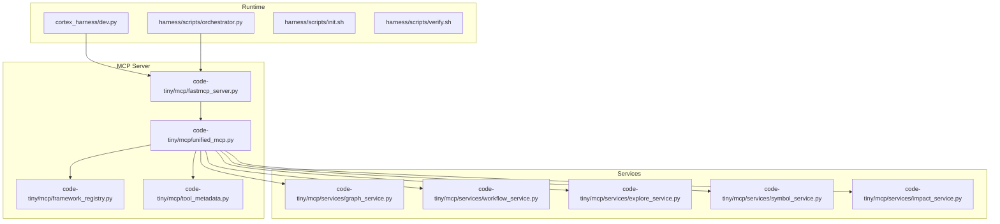
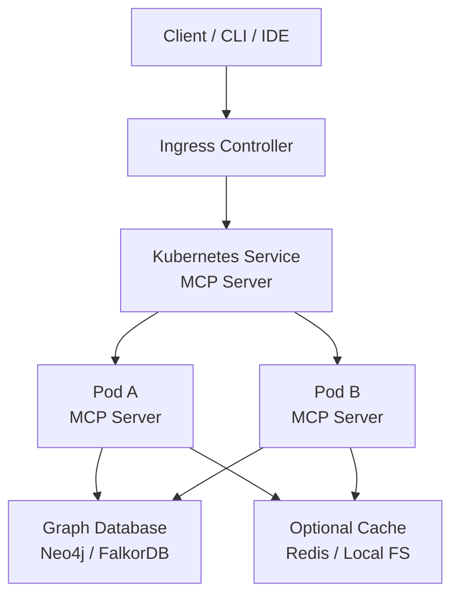
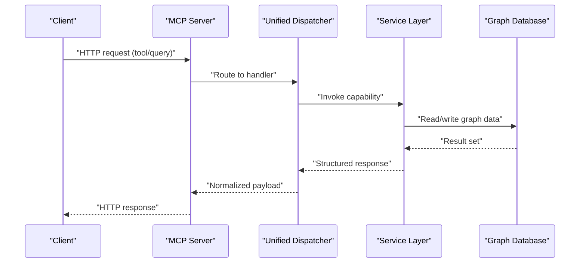
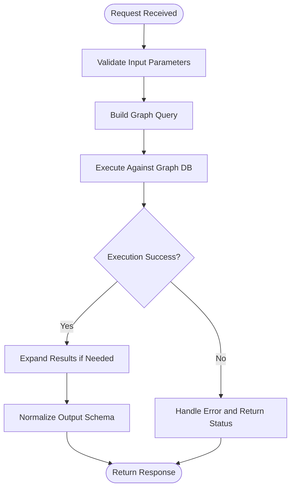
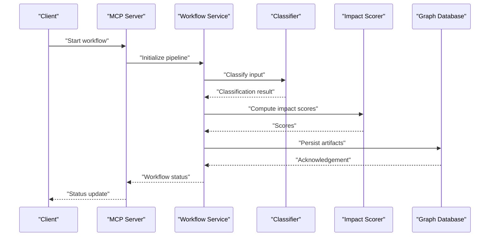
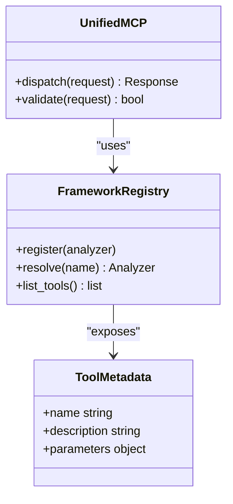
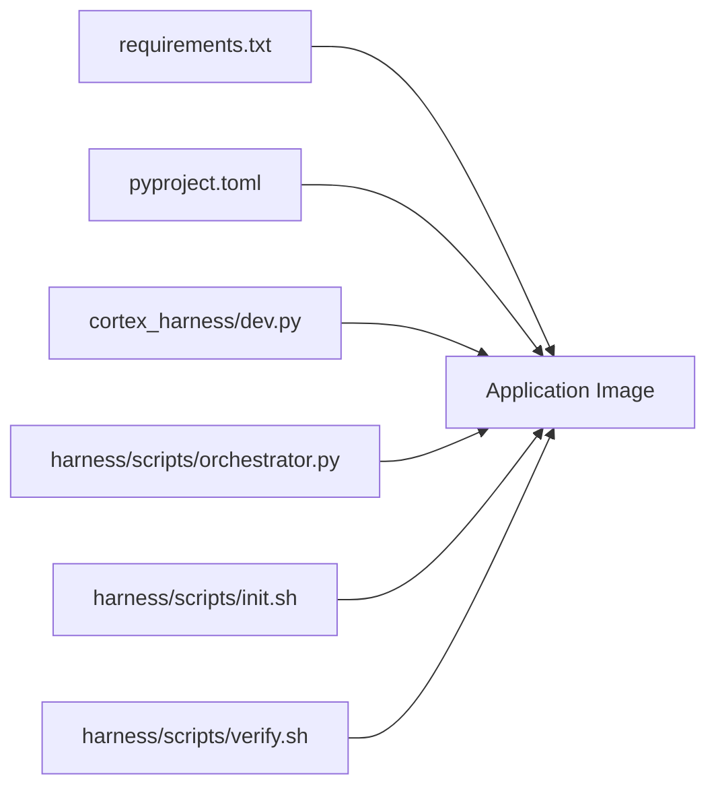

# Containerization & Orchestration

<cite>
**Referenced Files in This Document**
- [ReadMe.md](file://ReadMe.md)
- [Makefile](file://Makefile)
- [requirements.txt](file://requirements.txt)
- [pyproject.toml](file://pyproject.toml)
- [harness/scripts/orchestrator.py](file://harness/scripts/orchestrator.py)
- [harness/scripts/init.sh](file://harness/scripts/init.sh)
- [harness/scripts/verify.sh](file://harness/scripts/verify.sh)
- [cortex_harness/dev.py](file://cortex_harness/dev.py)
- [code-tiny/mcp/fastmcp_server.py](file://code-tiny/mcp/fastmcp_server.py)
- [code-tiny/mcp/unified_mcp.py](file://code-tiny/mcp/unified_mcp.py)
- [code-tiny/mcp/services/graph_service.py](file://code-tiny/mcp/services/graph_service.py)
- [code-tiny/mcp/services/workflow_service.py](file://code-tiny/mcp/services/workflow_service.py)
- [code-tiny/mcp/services/explore_service.py](file://code-tiny/mcp/services/explore_service.py)
- [code-tiny/mcp/services/symbol_service.py](file://code-tiny/mcp/services/symbol_service.py)
- [code-tiny/mcp/services/impact_service.py](file://code-tiny/mcp/services/impact_service.py)
- [code-tiny/mcp/framework_registry.py](file://code-tiny/mcp/framework_registry.py)
- [code-tiny/mcp/tool_metadata.py](file://code-tiny/mcp/tool_metadata.py)
- [code-tiny/mcp/semantic_graph_expansion.py](file://code-tiny/mcp/semantic_graph_expansion.py)
- [code-tiny/mcp/android/android_mcp.py](file://code-tiny/mcp/android/android_mcp.py)
- [code-tiny/mcp/cplus/cplus_mcp.py](file://code-tiny/mcp/cplus/cplus_mcp.py)
- [code-tiny/mcp/java/java_mcp.py](file://code-tiny/mcp/java/java_mcp.py)
- [code-tiny/mcp/services/graph_service.py](file://code-tiny/mcp/services/graph_service.py)
- [code-tiny/mcp/services/flow_reconstructor.py](file://code-tiny/mcp/services/flow_reconstructor.py)
- [code-tiny/mcp/services/query_understanding.py](file://code-tiny/mcp/services/query_understanding.py)
- [code-tiny/mcp/services/retrieval_scorer.py](file://code-tiny/mcp/services/retrieval_scorer.py)
- [code-tiny/mcp/services/intelligent_retrieval.py](file://code-tiny/mcp/services/intelligent_retrieval.py)
- [code-tiny/mcp/services/workflow_classifier.py](file://code-tiny/mcp/services/workflow_classifier.py)
- [code-tiny/mcp/services/workflow_impact_scorer.py](file://code-tiny/mcp/services/workflow_impact_scorer.py)
- [code-tiny/mcp/services/message_scan.py](file://code-tiny/mcp/services/message_scan.py)
- [code-tiny/mcp/services/api_match_engine.py](file://code-tiny/mcp/services/api_match_engine.py)
- [code-tiny/mcp/services/bm25_ranker.py](file://code-tiny/mcp/services/bm25_ranker.py)
- [code-tiny/mcp/services/call_graph_builder.py](file://code-tiny/mcp/services/call_graph_builder.py)
- [code-tiny/mcp/services/graph_expander.py](file://code-tiny/mcp/services/graph_expander.py)
- [code-tiny/mcp/services/primary_vector_sync.py](file://code-tiny/mcp/services/primary_vector_sync.py)
- [code-tiny/mcp/services/incremental_cleanup.py](file://code-tiny/mcp/services/incremental_cleanup.py)
- [code-tiny/mcp/services/incremental_sync_state.py](file://code-tiny/mcp/services/incremental_sync_state.py)
- [code-tiny/mcp/services/source_inventory.py](file://code-tiny/mcp/services/source_inventory.py)
- [code-tiny/mcp/services/url_normalizer.py](file://code-tiny/mcp/services/url_normalizer.py)
- [code-tiny/mcp/services/react_role_classifier.py](file://code-tiny/mcp/services/react_role_classifier.py)
- [code-tiny/mcp/services/confidence_scorer.py](file://code-tiny/mcp/services/confidence_scorer.py)
- [code-tiny/mcp/services/llm_summary.py](file://code-tiny/mcp/services/llm_summary.py)
- [code-tiny/mcp/services/signal_normalizer.py](file://code-tiny/mcp/services/signal_normalizer.py)
- [code-tiny/mcp/services/result_packager.py](file://code-tiny/mcp/services/result_packager.py)
- [code-tiny/mcp/services/harness_config.py](file://code-tiny/mcp/services/harness_config.py)
- [code-tiny/mcp/services/analyzer_cache.py](file://code-tiny/mcp/services/analyzer_cache.py)
- [code-tiny/mcp/services/git_diff.py](file://code-tiny/mcp/services/git_diff.py)
- [code-tiny/mcp/services/cloc_stats.py](file://code-tiny/mcp/services/cloc_stats.py)
- [code-tiny/mcp/services/semantic_inference.py](file://code-tiny/mcp/services/semantic_inference.py)
- [code-tiny/mcp/services/query_intent_classifier.py](file://code-tiny/mcp/services/query_intent_classifier.py)
- [code-tiny/mcp/services/frontend_relationship_extractor.py](file://code-tiny/mcp/services/frontend_relationship_extractor.py)
- [code-tiny/mcp/services/workflow_finder.py](file://code-tiny/mcp/services/workflow_finder.py)
- [code-tiny/mcp/ts/ts_analyzer.py](file://code-tiny/mcp/ts/ts_analyzer.py)
- [code-tiny/mcp/ts/ts_backend_analyzer.py](file://code-tiny/mcp/ts/ts_backend_analyzer.py)
- [code-tiny/mcp/ts/ts_project_detector.py](file://code-tiny/mcp/ts/ts_project_detector.py)
- [code-tiny/mcp/ts/_refactor_ts_analyzer.py](file://code-tiny/mcp/ts/_refactor_ts_analyzer.py)
- [code-tiny/mcp/ts/ts_api_bridge.py](file://code-tiny/mcp/ts/ts_api_bridge.py)
- [code-tiny/mcp/ts/pipeline/backend_pipeline.py](file://code-tiny/mcp/ts/pipeline/backend_pipeline.py)
- [code-tiny/mcp/ts/pipeline/frontend_pipeline.py](file://code-tiny/mcp/ts/pipeline/frontend_pipeline.py)
- [code-tiny/mcp/ts/context/analyzer_context.py](file://code-tiny/mcp/ts/context/analyzer_context.py)
- [code-tiny/mcp/ts/types/ast_types.py](file://code-tiny/mcp/ts/types/ast_types.py)
- [code-tiny/mcp/ts/types/graph_types.py](file://code-tiny/mcp/ts/types/graph_types.py)
- [code-tiny/mcp/ts/utils/file_utils.py](file://code-tiny/mcp/ts/utils/file_utils.py)
- [code-tiny/mcp/ts/utils/id_utils.py](file://code-tiny/mcp/ts/utils/id_utils.py)
- [code-tiny/mcp/ts/utils/regex_patterns.py](file://code-tiny/mcp/ts/utils/regex_patterns.py)
- [code-tiny/mcp/ts/agents/parser_agent.py](file://code-tiny/mcp/ts/agents/parser_agent.py)
- [code-tiny/mcp/ts/agents/graph_agent.py](file://code-tiny/mcp/ts/agents/graph_agent.py)
- [code-tiny/mcp/ts/agents/symbol_agent.py](file://code-tiny/mcp/ts/agents/symbol_agent.py)
- [code-tiny/mcp/ts/agents/dependency_agent.py](file://code-tiny/mcp/ts/agents/dependency_agent.py)
- [code-tiny/mcp/ts/agents/traversal_agent.py](file://code-tiny/mcp/ts/agents/traversal_agent.py)
- [code-tiny/mcp/ts/agents/backend_agent.py](file://code-tiny/mcp/ts/agents/backend_agent.py)
- [code-tiny/mcp/ts/agents/api_bridge_agent.py](file://code-tiny/mcp/ts/agents/api_bridge_agent.py)
- [code-tiny/mcp/ts/agents/graph_agent.py](file://code-tiny/mcp/ts/agents/graph_agent.py)
- [code-tiny/mcp/ts/agents/traversal_agent.py](file://code-tiny/mcp/ts/agents/traversal_agent.py)
- [code-tiny/mcp/ts/agents/backend_agent.py](file://code-tiny/mcp/ts/agents/backend_agent.py)
- [code-tiny/mcp/ts/agents/api_bridge_agent.py](file://code-tiny/mcp/ts/agents/api_bridge_agent.py)
- [code-tiny/mcp/ts/agents/parser_agent.py](file://code-tiny/mcp/ts/agents/parser_agent.py)
- [code-tiny/mcp/ts/agents/graph_agent.py](file://code-tiny/mcp/ts/agents/graph_agent.py)
- [code-tiny/mcp/ts/agents/symbol_agent.py](file://code-tiny/mcp/ts/agents/symbol_agent.py)
- [code-tiny/mcp/ts/agents/dependency_agent.py](file://code-tiny/mcp/ts/agents/dependency_agent.py)
- [code-tiny/mcp/ts/agents/traversal_agent.py](file://code-tiny/mcp/ts/agents/traversal_agent.py)
- [code-tiny/mcp/ts/agents/backend_agent.py](file://code-tiny/mcp/ts/agents/backend_agent.py)
- [code-tiny/mcp/ts/agents/api_bridge_agent.py](file://code-tiny/miny/mcp/ts/agents/api_bridge_agent.py)
</cite>

## Table of Contents
1. [Introduction](#introduction)
2. [Project Structure](#project-structure)
3. [Core Components](#core-components)
4. [Architecture Overview](#architecture-overview)
5. [Detailed Component Analysis](#detailed-component-analysis)
6. [Dependency Analysis](#dependency-analysis)
7. [Performance Considerations](#performance-considerations)
8. [Troubleshooting Guide](#troubleshooting-guide)
9. [Conclusion](#conclusion)
10. [Appendices](#appendices)

## Introduction
This document provides comprehensive guidance for containerizing and orchestrating Cortex Harness across environments. It covers Docker image construction, Kubernetes deployment patterns, Helm packaging, resource management, health checks, service discovery, networking, ingress, load balancing, registry strategies, versioning, rollback procedures, and cloud platform examples (AWS ECS, Azure AKS, Google GKE). The content is designed to be accessible to both operators and developers while remaining grounded in the repository’s actual components and scripts.

## Project Structure
Cortex Harness exposes a Python-based MCP server with multiple analyzers and services. The runtime entrypoints and orchestration helpers are located under harness/scripts and cortex_harness, while the MCP server implementation resides under code-tiny/mcp. Key files relevant to containerization include:
- Runtime entrypoint and development server
- Orchestrator and lifecycle scripts
- Requirements and project metadata for dependency resolution
- MCP server and service modules that define HTTP endpoints and graph operations

**Diagram sources**
- [cortex_harness/dev.py](file://cortex_harness/dev.py)
- [harness/scripts/orchestrator.py](file://harness/scripts/orchestrator.py)
- [harness/scripts/init.sh](file://harness/scripts/init.sh)
- [harness/scripts/verify.sh](file://harness/scripts/verify.sh)
- [code-tiny/mcp/fastmcp_server.py](file://code-tiny/mcp/fastmcp_server.py)
- [code-tiny/mcp/unified_mcp.py](file://code-tiny/mcp/unified_mcp.py)
- [code-tiny/mcp/framework_registry.py](file://code-tiny/mcp/framework_registry.py)
- [code-tiny/mcp/tool_metadata.py](file://code-tiny/mcp/tool_metadata.py)
- [code-tiny/mcp/services/graph_service.py](file://code-tiny/mcp/services/graph_service.py)
- [code-tiny/mcp/services/workflow_service.py](file://code-tiny/mcp/services/workflow_service.py)
- [code-tiny/mcp/services/explore_service.py](file://code-tiny/mcp/services/explore_service.py)
- [code-tiny/mcp/services/symbol_service.py](file://code-tiny/mcp/services/symbol_service.py)
- [code-tiny/mcp/services/impact_service.py](file://code-tiny/mcp/services/impact_service.py)

**Section sources**
- [ReadMe.md](file://ReadMe.md)
- [Makefile](file://Makefile)
- [requirements.txt](file://requirements.txt)
- [pyproject.toml](file://pyproject.toml)
- [cortex_harness/dev.py](file://cortex_harness/dev.py)
- [harness/scripts/orchestrator.py](file://harness/scripts/orchestrator.py)
- [harness/scripts/init.sh](file://harness/scripts/init.sh)
- [harness/scripts/verify.sh](file://harness/scripts/verify.sh)
- [code-tiny/mcp/fastmcp_server.py](file://code-tiny/mcp/fastmcp_server.py)
- [code-tiny/mcp/unified_mcp.py](file://code-tiny/mcp/unified_mcp.py)
- [code-tiny/mcp/framework_registry.py](file://code-tiny/mcp/framework_registry.py)
- [code-tiny/mcp/tool_metadata.py](file://code-tiny/mcp/tool_metadata.py)
- [code-tiny/mcp/services/graph_service.py](file://code-tiny/mcp/services/graph_service.py)
- [code-tiny/mcp/services/workflow_service.py](file://code-tiny/mcp/services/workflow_service.py)
- [code-tiny/mcp/services/explore_service.py](file://code-tiny/mcp/services/explore_service.py)
- [code-tiny/mcp/services/symbol_service.py](file://code-tiny/mcp/services/symbol_service.py)
- [code-tiny/mcp/services/impact_service.py](file://code-tiny/mcp/services/impact_service.py)

## Core Components
- MCP Server: Implements HTTP-based tool execution and query handling. Entry points and routing are defined in the MCP server module and unified dispatcher.
- Services Layer: Provides domain-specific capabilities such as graph traversal, workflow orchestration, symbol search, impact analysis, and exploration utilities.
- Orchestrator and Lifecycle Scripts: Provide initialization, verification, and orchestration hooks used during startup and readiness validation.
- Configuration and Dependencies: Defined via requirements and project metadata; environment variables drive runtime behavior.

Operational implications:
- The container should run the MCP server process as PID 1 or delegate to an init system.
- Health and readiness checks should target the MCP server’s HTTP endpoints.
- Environment configuration must be injected at runtime via secrets and config maps.

**Section sources**
- [code-tiny/mcp/fastmcp_server.py](file://code-tiny/mcp/fastmcp_server.py)
- [code-tiny/mcp/unified_mcp.py](file://code-tiny/mcp/unified_mcp.py)
- [code-tiny/mcp/services/graph_service.py](file://code-tiny/mcp/services/graph_service.py)
- [code-tiny/mcp/services/workflow_service.py](file://code-tiny/mcp/services/workflow_service.py)
- [code-tiny/mcp/services/explore_service.py](file://code-tiny/mcp/services/explore_service.py)
- [code-tiny/mcp/services/symbol_service.py](file://code-tiny/mcp/services/symbol_service.py)
- [code-tiny/mcp/services/impact_service.py](file://code-tiny/mcp/services/impact_service.py)
- [harness/scripts/orchestrator.py](file://harness/scripts/orchestrator.py)
- [harness/scripts/init.sh](file://harness/scripts/init.sh)
- [harness/scripts/verify.sh](file://harness/scripts/verify.sh)
- [requirements.txt](file://requirements.txt)
- [pyproject.toml](file://pyproject.toml)

## Architecture Overview
The runtime architecture centers on a stateless MCP server backed by external graph storage. Containers expose HTTP endpoints for MCP tools and queries. Service discovery is provided by the orchestrator (Kubernetes Services), and persistent data is stored in external graph databases.

[No sources needed since this diagram shows conceptual architecture]

## Detailed Component Analysis

### MCP Server and Routing
The MCP server exposes HTTP endpoints and routes requests through a unified dispatcher to framework-specific handlers and services.

**Diagram sources**
- [code-tiny/mcp/fastmcp_server.py](file://code-tiny/mcp/fastmcp_server.py)
- [code-tiny/mcp/unified_mcp.py](file://code-tiny/mcp/unified_mcp.py)
- [code-tiny/mcp/services/graph_service.py](file://code-tiny/mcp/services/graph_service.py)

**Section sources**
- [code-tiny/mcp/fastmcp_server.py](file://code-tiny/mcp/fastmcp_server.py)
- [code-tiny/mcp/unified_mcp.py](file://code-tiny/mcp/unified_mcp.py)
- [code-tiny/mcp/services/graph_service.py](file://code-tiny/mcp/services/graph_service.py)

### Graph Operations Flow
Graph-related operations traverse nodes and edges, perform expansions, and return results to clients.

**Diagram sources**
- [code-tiny/mcp/services/graph_service.py](file://code-tiny/mcp/services/graph_service.py)
- [code-tiny/mcp/services/graph_expander.py](file://code-tiny/mcp/services/graph_expander.py)

**Section sources**
- [code-tiny/mcp/services/graph_service.py](file://code-tiny/mcp/services/graph_service.py)
- [code-tiny/mcp/services/graph_expander.py](file://code-tiny/mcp/services/graph_expander.py)

### Workflow Orchestration
Workflow services coordinate multi-step tasks, including ingestion, classification, and scoring.

**Diagram sources**
- [code-tiny/mcp/services/workflow_service.py](file://code-tiny/mcp/services/workflow_service.py)
- [code-tiny/mcp/services/workflow_classifier.py](file://code-tiny/mcp/services/workflow_classifier.py)
- [code-tiny/mcp/services/workflow_impact_scorer.py](file://code-tiny/mcp/services/workflow_impact_scorer.py)

**Section sources**
- [code-tiny/mcp/services/workflow_service.py](file://code-tiny/mcp/services/workflow_service.py)
- [code-tiny/mcp/services/workflow_classifier.py](file://code-tiny/mcp/services/workflow_classifier.py)
- [code-tiny/mcp/services/workflow_impact_scorer.py](file://code-tiny/mcp/services/workflow_impact_scorer.py)

### Framework Registry and Tool Metadata
The registry maps frameworks to analyzers and registers tool metadata for discovery and invocation.

**Diagram sources**
- [code-tiny/mcp/framework_registry.py](file://code-tiny/mcp/framework_registry.py)
- [code-tiny/mcp/tool_metadata.py](file://code-tiny/mcp/tool_metadata.py)
- [code-tiny/mcp/unified_mcp.py](file://code-tiny/mcp/unified_mcp.py)

**Section sources**
- [code-tiny/mcp/framework_registry.py](file://code-tiny/mcp/framework_registry.py)
- [code-tiny/mcp/tool_metadata.py](file://code-tiny/mcp/tool_metadata.py)
- [code-tiny/mcp/unified_mcp.py](file://code-tiny/mcp/unified_mcp.py)

## Dependency Analysis
Containerization depends on Python runtime and packages declared in requirements and project metadata. The orchestrator and lifecycle scripts provide initialization and verification steps.

**Diagram sources**
- [requirements.txt](file://requirements.txt)
- [pyproject.toml](file://pyproject.toml)
- [cortex_harness/dev.py](file://cortex_harness/dev.py)
- [harness/scripts/orchestrator.py](file://harness/scripts/orchestrator.py)
- [harness/scripts/init.sh](file://harness/scripts/init.sh)
- [harness/scripts/verify.sh](file://harness/scripts/verify.sh)

**Section sources**
- [requirements.txt](file://requirements.txt)
- [pyproject.toml](file://pyproject.toml)
- [cortex_harness/dev.py](file://cortex_harness/dev.py)
- [harness/scripts/orchestrator.py](file://harness/scripts/orchestrator.py)
- [harness/scripts/init.sh](file://harness/scripts/init.sh)
- [harness/scripts/verify.sh](file://harness/scripts/verify.sh)

## Performance Considerations
- Use minimal base images and multi-stage builds to reduce attack surface and image size.
- Pin dependency versions to ensure reproducible builds and avoid unexpected upgrades.
- Configure CPU and memory limits appropriate for graph workloads; tune concurrency based on workload characteristics.
- Enable connection pooling for database access and consider caching layers for hot paths.
- Monitor GC and memory usage; adjust JVM/runtime settings if applicable to dependencies.
- Scale horizontally behind a load balancer; prefer stateless pods for elasticity.

[No sources needed since this section provides general guidance]

## Troubleshooting Guide
- Startup failures: Inspect orchestrator logs and verify environment variables for database connectivity and credentials.
- Readiness issues: Ensure health endpoints respond within configured thresholds; check database reachability and index availability.
- Resource exhaustion: Review CPU/memory metrics and adjust limits; analyze slow queries against the graph database.
- Networking problems: Validate DNS resolution, service discovery, and firewall rules between pods and external services.
- Rollback strategy: If a new image degrades performance or introduces errors, revert to the previous stable tag and confirm traffic routing.

**Section sources**
- [harness/scripts/orchestrator.py](file://harness/scripts/orchestrator.py)
- [harness/scripts/verify.sh](file://harness/scripts/verify.sh)

## Conclusion
Cortex Harness can be effectively containerized and orchestrated using standard practices: build lean images, deploy stateless MCP server pods, persist graph data externally, and manage configuration via environment variables. Kubernetes Services provide service discovery, while Ingress handles external routing. Helm charts simplify multi-environment deployments, and cloud platforms offer managed services for scaling and reliability.

[No sources needed since this section summarizes without analyzing specific files]

## Appendices

### Docker Image Construction
- Base image selection: Choose a small, secure Python runtime image aligned with your dependency requirements.
- Multi-stage builds: Separate build and runtime stages to minimize final image size and reduce vulnerabilities.
- Security best practices:
  - Run as non-root user.
  - Avoid installing unnecessary packages.
  - Scan images for known vulnerabilities.
  - Keep base images updated.
- Entrypoint: Execute the MCP server process directly or via a lightweight wrapper script.

[No sources needed since this section provides general guidance]

### Kubernetes Deployment Patterns
- Stateless services: Deploy replicas of the MCP server behind a Service for load balancing and service discovery.
- Persistent volume claims: Attach volumes for local caches or temporary scratch space if required by services.
- ConfigMaps and Secrets: Inject configuration and credentials securely.
- Health checks:
  - Liveness probe: Restart unhealthy containers.
  - Readiness probe: Remove pods from service endpoints until ready.
  - Startup probe: Allow longer initialization for cold starts.
- Horizontal Pod Autoscaler: Scale based on CPU, memory, or custom metrics.

[No sources needed since this section provides general guidance]

### Helm Charts
- Chart structure:
  - values.yaml for environment-specific overrides.
  - templates/deployment.yaml for stateless pods.
  - templates/service.yaml for internal service discovery.
  - templates/ingress.yaml for external exposure.
  - templates/configmap.yaml and secret.yaml for configuration.
- Versioning: Tag releases consistently and use semantic versioning for chart versions.
- Rollbacks: Use Helm history and rollback commands to revert to previous revisions.

[No sources needed since this section provides general guidance]

### Cloud Platform Examples
- AWS ECS:
  - Task definitions specify container image, ports, environment variables, and resource limits.
  - Application Load Balancer distributes traffic across tasks.
  - Auto Scaling policies scale tasks based on CPU/memory or custom metrics.
- Azure AKS:
  - Deployments and Services mirror Kubernetes patterns.
  - Ingress controllers (e.g., NGINX) handle external routing.
  - Cluster Autoscaler scales node pools; Horizontal Pod Autoscaler scales pods.
- Google GKE:
  - Standard Kubernetes manifests apply.
  - Managed Ingress and Cloud Load Balancing integrate seamlessly.
  - Cluster autoscaling and pod autoscaling configured via standard resources.

[No sources needed since this section provides general guidance]

### Container Registry and Image Versioning
- Registry setup: Use a private registry with authentication and scanning enabled.
- Image tagging:
  - Semantic version tags (e.g., v1.2.3).
  - Git commit SHA tags for traceability.
  - Latest tag reserved for CI promotion only.
- Promotion pipeline: Promote images across environments after passing tests and scans.
- Rollback procedures:
  - Re-deploy previous image tag.
  - Update Helm release to prior revision.
  - Verify health and readiness probes post-rollback.

[No sources needed since this section provides general guidance]

### Networking, Ingress, and Load Balancing
- Ingress configuration:
  - TLS termination at ingress controller.
  - Path-based routing for different services.
  - Rate limiting and WAF integration where available.
- Load balancing patterns:
  - Round-robin or least connections depending on workload.
  - Sticky sessions only if necessary (prefer stateless design).
- Service discovery:
  - Internal DNS names provided by orchestrator.
  - External clients access via Ingress hostnames.

[No sources needed since this section provides general guidance]