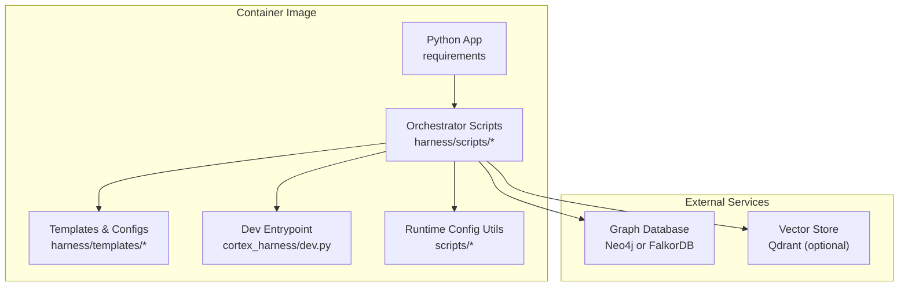
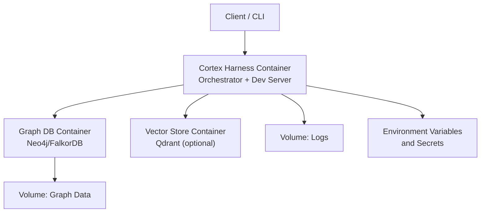

# Docker Containers

<cite>
**Referenced Files in This Document**
- [ReadMe.md](file://ReadMe.md)
- [Makefile](file://Makefile)
- [requirements.txt](file://requirements.txt)
- [pyproject.toml](file://pyproject.toml)
- [.env-sample](file://doc-tiny/.env-sample)
- [harness/scripts/init.sh](file://harness/scripts/init.sh)
- [harness/scripts/orchestrator.py](file://harness/scripts/orchestrator.py)
- [harness/templates/config.yaml](file://harness/templates/config.yaml)
- [cortex_harness/dev.py](file://cortex_harness/dev.py)
- [scripts/mcp_runtime_config.py](file://scripts/mcp_runtime_config.py)
- [code-tiny/requirements.txt](file://code-tiny/requirements.txt)
- [installers/README.md](file://installers/README.md)
</cite>

## Table of Contents
1. [Introduction](#introduction)
2. [Project Structure](#project-structure)
3. [Core Components](#core-components)
4. [Architecture Overview](#architecture-overview)
5. [Detailed Component Analysis](#detailed-component-analysis)
6. [Dependency Analysis](#dependency-analysis)
7. [Performance Considerations](#performance-considerations)
8. [Troubleshooting Guide](#troubleshooting-guide)
9. [Conclusion](#conclusion)
10. [Appendices](#appendices)

## Introduction
This document provides comprehensive guidance for containerizing Cortex Harness with Docker. It covers multi-stage builds, base image selection (Alpine vs Ubuntu), layer caching strategies, environment configuration, volumes, networking, health checks, logging, resource limits, and security best practices. It also includes docker-compose examples to run the application locally with graph database dependencies.

The repository is a Python-based project with multiple analyzers, orchestration scripts, and templates. The documentation focuses on how to package and run these components inside containers across development, production, and CI/CD scenarios.

## Project Structure
At a high level, the project contains:
- Python runtime and dependencies defined by requirements files and a project manifest
- Orchestration and initialization scripts under harness/scripts
- Configuration templates under harness/templates
- A development entrypoint under cortex_harness/dev.py
- Runtime configuration utilities under scripts
- Installer scaffolding under installers

[No sources needed since this diagram shows conceptual workflow, not actual code structure]

## Core Components
- Application runtime: Python packages and dependencies are declared in requirements files and the project manifest. These define what must be installed into the container.
- Orchestration: The orchestrator script coordinates tasks such as initialization, ingestion, and lifecycle management.
- Initialization: An init script prepares directories and state before the main process starts.
- Templates: YAML configuration templates provide defaults that can be overridden via environment variables.
- Development entrypoint: A dedicated dev module serves local development workflows.
- Runtime configuration: Utilities load and merge configuration at runtime.

Key references:
- Requirements and project metadata: [requirements.txt](file://requirements.txt), [pyproject.toml](file://pyproject.toml)
- Orchestration and init: [harness/scripts/orchestrator.py](file://harness/scripts/orchestrator.py), [harness/scripts/init.sh](file://harness/scripts/init.sh)
- Templates: [harness/templates/config.yaml](file://harness/templates/config.yaml)
- Dev entrypoint: [cortex_harness/dev.py](file://cortex_harness/dev.py)
- Runtime config: [scripts/mcp_runtime_config.py](file://scripts/mcp_runtime_config.py)

**Section sources**
- [requirements.txt](file://requirements.txt)
- [pyproject.toml](file://pyproject.toml)
- [harness/scripts/orchestrator.py](file://harness/scripts/orchestrator.py)
- [harness/scripts/init.sh](file://harness/scripts/init.sh)
- [harness/templates/config.yaml](file://harness/templates/config.yaml)
- [cortex_harness/dev.py](file://cortex_harness/dev.py)
- [scripts/mcp_runtime_config.py](file://scripts/mcp_runtime_config.py)

## Architecture Overview
The containerized architecture typically consists of:
- One or more application containers running the orchestrator and related services
- A graph database service (e.g., Neo4j or FalkorDB)
- Optional vector store (e.g., Qdrant)
- Persistent volumes for graph data and logs
- Environment-driven configuration and secrets injection

[No sources needed since this diagram shows conceptual workflow, not actual code structure]

## Detailed Component Analysis

### Multi-Stage Docker Builds
Use multi-stage builds to separate build-time tools from runtime artifacts:
- Builder stage: Install system dependencies, Python, and Python packages; compile native extensions if any; prepare caches.
- Runtime stage: Use a minimal base image and copy only necessary artifacts and dependencies.

Base image selection:
- Alpine: Smaller footprint but requires musl compatibility and additional packages for some Python wheels.
- Ubuntu: Larger but better compatibility with prebuilt wheels and system libraries.

Layer caching optimization:
- Copy dependency manifests first and install dependencies before copying source code.
- Pin versions to maximize cache hits.
- Avoid copying unnecessary files using .dockerignore.

Example patterns:
- Development image: Include debug symbols, development tools, and hot-reload support.
- Production image: Minimal runtime, non-root user, read-only filesystem where possible.
- CI/CD image: Build artifacts and test runners, then push slim images to registries.

[No sources needed since this section provides general guidance]

### Base Image Strategies
- Alpine strategy:
  - Pros: Small size, reduced attack surface.
  - Cons: Potential issues with glibc-dependent binaries; may require rebuilding certain Python wheels.
- Ubuntu strategy:
  - Pros: Broad compatibility, fewer build surprises.
  - Cons: Larger image size.

Recommendation:
- For most Python workloads, start with a slim Debian or Ubuntu variant unless you have strong reasons to use Alpine. Validate wheel availability and performance.

[No sources needed since this section provides general guidance]

### Layer Caching Optimization
- Order instructions to maximize cache reuse:
  - Copy requirements and install dependencies before copying application code.
  - Separate frequently changing layers from stable ones.
- Use .dockerignore to exclude tests, caches, and large artifacts.
- Leverage buildkit features like cache mounts for pip and package managers.

[No sources needed since this section provides general guidance]

### Environment Configuration Management
- Use environment variables to configure:
  - Graph database connection details
  - Vector store endpoints
  - Feature toggles and logging levels
- Provide a sample environment file for reference.
- Load configuration at startup via runtime utilities.

References:
- Sample environment template: [.env-sample](file://doc-tiny/.env-sample)
- Runtime configuration loader: [scripts/mcp_runtime_config.py](file://scripts/mcp_runtime_config.py)
- Template configuration: [harness/templates/config.yaml](file://harness/templates/config.yaml)

**Section sources**
- [.env-sample](file://doc-tiny/.env-sample)
- [scripts/mcp_runtime_config.py](file://scripts/mcp_runtime_config.py)
- [harness/templates/config.yaml](file://harness/templates/config.yaml)

### Volume Mounting for Persistent Data
- Persist graph database data to avoid loss across restarts.
- Persist logs for observability and debugging.
- Mount configuration overrides and seed data as read-only volumes when appropriate.

Recommended mount points:
- Graph data directory
- Logs directory
- Optional shared workspace for analysis inputs

[No sources needed since this section provides general guidance]

### Network Configuration
- Expose only required ports (e.g., HTTP API, database ports).
- Use Docker networks to isolate application and database containers.
- Configure service discovery via container names or DNS within the network.

[No sources needed since this section provides general guidance]

### Health Checks
- Implement liveness and readiness probes:
  - Liveness: Check if the process is alive and responsive.
  - Readiness: Ensure dependencies (graph DB, vector store) are reachable and initialized.
- Use simple HTTP endpoints or command-based checks.

[No sources needed since this section provides general guidance]

### Logging Configuration
- Stream logs to stdout/stderr for container orchestration systems to collect.
- Optionally write structured logs to mounted volumes for long-term retention.
- Control log verbosity via environment variables.

[No sources needed since this section provides general guidance]

### Resource Limits
- Set CPU and memory limits to prevent resource contention.
- Tune heap sizes for Python processes if needed.
- Monitor and adjust based on workload characteristics.

[No sources needed since this section provides general guidance]

### Security Best Practices
- Run as a non-root user inside the container.
- Minimize installed packages and remove unnecessary tools.
- Use read-only root filesystem where possible.
- Manage secrets via environment variables injected securely; avoid baking secrets into images.
- Scan images for vulnerabilities and enforce policies.

[No sources needed since this section provides general guidance]

### Running Locally with docker-compose
- Define services for:
  - Cortex Harness application
  - Graph database (Neo4j or FalkorDB)
  - Optional vector store (Qdrant)
- Map environment variables and volumes.
- Add health checks and depends_on conditions.
- Start with docker-compose up and verify connectivity.

[No sources needed since this section provides general guidance]

### Development Workflow
- Use a development image with tools and debug flags.
- Mount source code for live reload during development.
- Provide convenience targets via Makefile for common tasks.

References:
- Development entrypoint: [cortex_harness/dev.py](file://cortex_harness/dev.py)
- Lifecycle targets: [Makefile](file://Makefile)

**Section sources**
- [cortex_harness/dev.py](file://cortex_harness/dev.py)
- [Makefile](file://Makefile)

### CI/CD Integration
- Build images in CI with pinned dependencies and cache layers.
- Run tests inside containers for reproducibility.
- Push slim production images to a registry after validation.
- Tag images with commit hashes and semantic versions.

[No sources needed since this section provides general guidance]

## Dependency Analysis
The container must include:
- Python runtime and packages listed in requirements files
- System-level dependencies required by Python wheels or native extensions
- Orchestration scripts and templates
- Optional drivers for graph databases and vector stores

References:
- Top-level requirements: [requirements.txt](file://requirements.txt)
- Project manifest: [pyproject.toml](file://pyproject.toml)
- Code-tiny requirements (if used): [code-tiny/requirements.txt](file://code-tiny/requirements.txt)

**Section sources**
- [requirements.txt](file://requirements.txt)
- [pyproject.toml](file://pyproject.toml)
- [code-tiny/requirements.txt](file://code-tiny/requirements.txt)

## Performance Considerations
- Prefer multi-stage builds to reduce image size and improve pull times.
- Pin dependency versions to stabilize builds and leverage cache.
- Use efficient serialization formats and compression for data transfers.
- Monitor container resource usage and tune limits accordingly.
- Keep graphs and indexes optimized; consider partitioning and sharding for large datasets.

[No sources needed since this section provides general guidance]

## Troubleshooting Guide
Common issues and resolutions:
- Dependency installation failures:
  - Verify system packages match wheel requirements.
  - Rebuild problematic wheels in the builder stage.
- Graph database connectivity errors:
  - Confirm network configuration and exposed ports.
  - Validate credentials and endpoint URLs via environment variables.
- Permission errors on volumes:
  - Ensure the non-root user has correct permissions.
  - Adjust volume ownership or use named volumes managed by the platform.
- Health check flapping:
  - Increase timeouts and retries.
  - Ensure readiness checks wait for dependencies to initialize.

Operational references:
- Orchestrator logic: [harness/scripts/orchestrator.py](file://harness/scripts/orchestrator.py)
- Initialization steps: [harness/scripts/init.sh](file://harness/scripts/init.sh)
- Configuration loading: [scripts/mcp_runtime_config.py](file://scripts/mcp_runtime_config.py)

**Section sources**
- [harness/scripts/orchestrator.py](file://harness/scripts/orchestrator.py)
- [harness/scripts/init.sh](file://harness/scripts/init.sh)
- [scripts/mcp_runtime_config.py](file://scripts/mcp_runtime_config.py)

## Conclusion
By adopting multi-stage builds, careful base image selection, robust layer caching, secure configuration management, and disciplined resource and security practices, Cortex Harness can be reliably containerized for development, production, and CI/CD environments. Use docker-compose to orchestrate local runs with graph database dependencies and apply health checks and logging for operational visibility.

[No sources needed since this section summarizes without analyzing specific files]

## Appendices

### Appendix A: Example Dockerfile Patterns
- Development image:
  - Include development tools and debug flags.
  - Mount source code for live updates.
- Production image:
  - Minimal runtime, non-root user, read-only filesystem.
  - Only essential dependencies and compiled artifacts.
- CI/CD image:
  - Build and test in isolated stages.
  - Produce final images with strict tagging and scanning.

[No sources needed since this section provides general guidance]

### Appendix B: Example docker-compose Services
- Application service:
  - Depends on graph database and optional vector store.
  - Exposes API port and mounts logs.
- Graph database service:
  - Persists data to a named volume.
  - Provides health checks.
- Vector store service (optional):
  - Persists index data.
  - Exposes internal port.

[No sources needed since this section provides general guidance]

### Appendix C: Environment Variables Reference
- Graph database URL and credentials
- Vector store endpoint and authentication
- Logging level and output format
- Feature toggles and timeouts

References:
- Sample environment file: [.env-sample](file://doc-tiny/.env-sample)
- Runtime configuration loader: [scripts/mcp_runtime_config.py](file://scripts/mcp_runtime_config.py)

**Section sources**
- [.env-sample](file://doc-tiny/.env-sample)
- [scripts/mcp_runtime_config.py](file://scripts/mcp_runtime_config.py)

### Appendix D: Installation and Setup Notes
- Review installer documentation for platform-specific packaging.
- Ensure prerequisites are met before building images.

Reference:
- Installer guide: [installers/README.md](file://installers/README.md)

**Section sources**
- [installers/README.md](file://installers/README.md)

### Appendix E: Project Overview References
- High-level project overview and goals: [ReadMe.md](file://ReadMe.md)

**Section sources**
- [ReadMe.md](file://ReadMe.md)