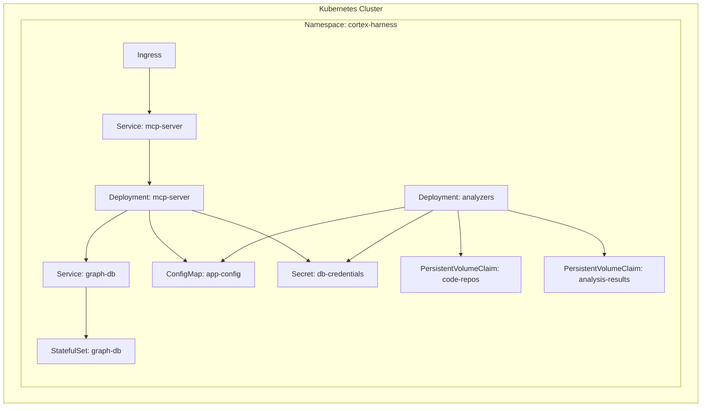
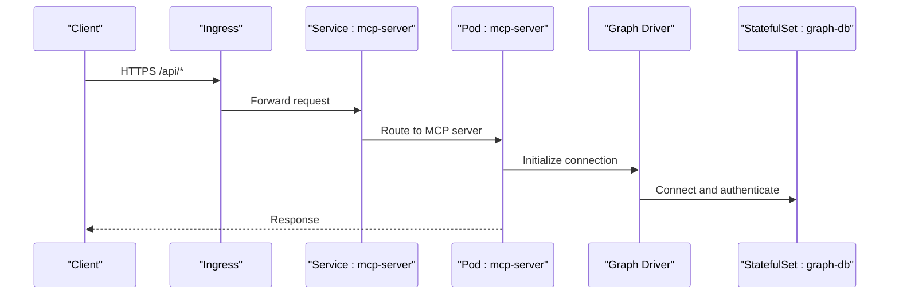
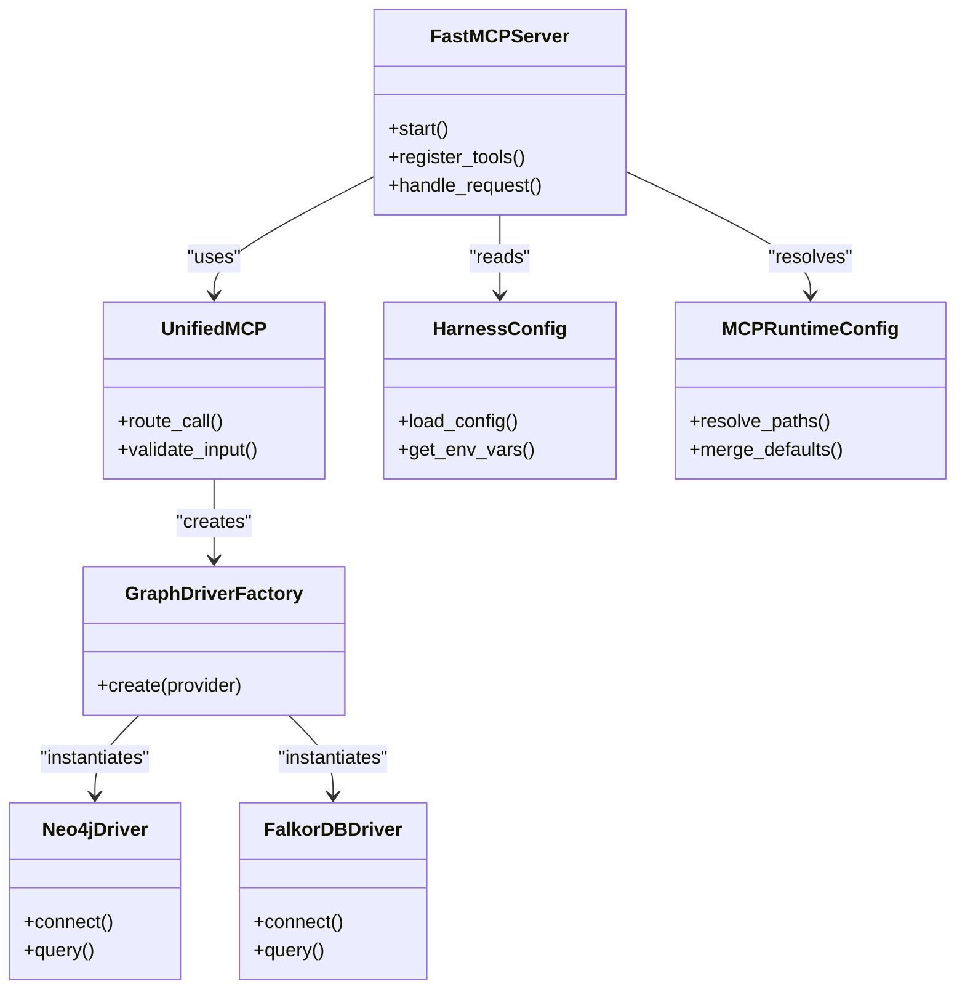

# Deployment Manifests

<cite>
**Referenced Files in This Document**
- [ReadMe.md](file://ReadMe.md)
- [Makefile](file://Makefile)
- [requirements.txt](file://requirements.txt)
- [pyproject.toml](file://pyproject.toml)
- [cortex_harness/dev.py](file://cortex_harness/dev.py)
- [code-tiny/mcp/fastmcp_server.py](file://code-tiny/mcp/fastmcp_server.py)
- [code-tiny/mcp/unified_mcp.py](file://code-tiny/mcp/unified_mcp.py)
- [code-tiny/mcp/services/graph_service.py](file://code-tiny/mcp/services/graph_service.py)
- [code-tiny/mcp/services/impact_service.py](file://code-tiny/mcp/services/impact_service.py)
- [code-tiny/mcp/services/symbol_service.py](file://code-tiny/mcp/services/symbol_service.py)
- [code-tiny/mcp/services/explore_service.py](file://code-tiny/mcp/services/explore_service.py)
- [code-tiny/mcp/services/workflow_service.py](file://code-tiny/mcp/services/workflow_service.py)
- [code-tiny/mcp/services/flow_reconstructor.py](file://code-tiny/mcp/services/flow_reconstructor.py)
- [code-tiny/mcp/framework_registry.py](file://code-tiny/mcp/framework_registry.py)
- [code-tiny/mcp/tool_metadata.py](file://code-tiny/mcp/tool_metadata.py)
- [code-tiny/mcp/semantic_graph_expansion.py](file://code-tiny/mcp/semantic_graph_expansion.py)
- [code-tiny/tools/common/harness_config.py](file://code-tiny/tools/common/harness_config.py)
- [code-tiny/tools/graph/driver/neo4j_driver.py](file://code-tiny/tools/graph/driver/neo4j_driver.py)
- [code-tiny/tools/graph/driver/falkordb_driver.py](file://code-tiny/tools/graph/driver/falkordb_driver.py)
- [code-tiny/tools/graph/core/base.py](file://code-tiny/tools/graph/core/base.py)
- [code-tiny/tools/graph/core/factory.py](file://code-tiny/tools/graph/core/factory.py)
- [code-tiny/tools/graph/core/require_neo4j.py](file://code-tiny/tools/graph/core/require_neo4j.py)
- [doc-tiny/.env-sample](file://doc-tiny/.env-sample)
- [harness/templates/config.yaml](file://harness/templates/config.yaml)
- [scripts/mcp_runtime_config.py](file://scripts/mcp_runtime_config.py)
</cite>

## Table of Contents
1. [Introduction](#introduction)
2. [Project Structure](#project-structure)
3. [Core Components](#core-components)
4. [Architecture Overview](#architecture-overview)
5. [Detailed Component Analysis](#detailed-component-analysis)
6. [Dependency Analysis](#dependency-analysis)
7. [Performance Considerations](#performance-considerations)
8. [Troubleshooting Guide](#troubleshooting-guide)
9. [Conclusion](#conclusion)
10. [Appendices](#appendices)

## Introduction
This document provides comprehensive Kubernetes deployment manifests for Cortex Harness components, including StatefulSet configurations for graph databases (Neo4j/FalkorDB), Deployments for analyzer services and the MCP server, ConfigMaps for application configuration, Secrets for sensitive data, Services for internal cluster communication, Ingress resources for external API access, and PersistentVolumeClaims for code repositories and analysis results. It also includes example YAML files with resource requests/limits, environment variables, volume mounts, and health checks.

The goal is to enable reliable, scalable, and secure operation of Cortex Harness on Kubernetes while preserving portability across cloud providers and on-prem clusters.

## Project Structure
Cortex Harness comprises:
- MCP server and services for code analysis and graph operations
- Graph drivers for Neo4j and FalkorDB
- Configuration templates and runtime config utilities
- Documentation and sample environment variables

[No sources needed since this diagram shows conceptual workflow, not actual code structure]

## Core Components
- MCP Server: Exposes tools and capabilities for code analysis and graph queries.
- Analyzer Services: Language-specific analyzers orchestrated by the harness.
- Graph Database: Neo4j or FalkorDB for storing semantic graphs.
- Configuration Management: ConfigMaps and Secrets for non-sensitive and sensitive settings.
- Storage: PVCs for persistent code repositories and analysis outputs.
- Networking: Services and Ingress for internal and external access.

Key implementation references:
- MCP server entry points and unified routing
- Graph driver implementations and provider factory
- Harness configuration loader and runtime config utilities
- Sample environment variables and template configuration

**Section sources**
- [code-tiny/mcp/fastmcp_server.py](file://code-tiny/mcp/fastmcp_server.py)
- [code-tiny/mcp/unified_mcp.py](file://code-tiny/mcp/unified_mcp.py)
- [code-tiny/tools/graph/driver/neo4j_driver.py](file://code-tiny/tools/graph/driver/neo4j_driver.py)
- [code-tiny/tools/graph/driver/falkordb_driver.py](file://code-tiny/tools/graph/driver/falkordb_driver.py)
- [code-tiny/tools/graph/core/factory.py](file://code-tiny/tools/graph/core/factory.py)
- [code-tiny/tools/common/harness_config.py](file://code-tiny/tools/common/harness_config.py)
- [scripts/mcp_runtime_config.py](file://scripts/mcp_runtime_config.py)
- [doc-tiny/.env-sample](file://doc-tiny/.env-sample)
- [harness/templates/config.yaml](file://harness/templates/config.yaml)

## Architecture Overview
The system exposes an MCP HTTP interface via a Service and Ingress. The MCP server connects to a graph database through a driver abstraction that supports both Neo4j and FalkorDB. Analyzers run as separate deployments and write results to persistent volumes.

**Diagram sources**
- [code-tiny/mcp/fastmcp_server.py](file://code-tiny/mcp/fastmcp_server.py)
- [code-tiny/tools/graph/driver/neo4j_driver.py](file://code-tiny/tools/graph/driver/neo4j_driver.py)
- [code-tiny/tools/graph/driver/falkordb_driver.py](file://code-tiny/tools/graph/driver/falkordb_driver.py)

## Detailed Component Analysis

### Graph Database StatefulSet (Neo4j/FalkorDB)
- Purpose: Provide persistent storage for semantic graphs.
- Key fields:
  - Replicas: 1 for single-node; consider HA patterns if supported by the chosen engine.
  - Volumes: PersistentVolumeClaim for data directory.
  - Environment: Database credentials and connection parameters from Secrets.
  - Health checks: Liveness and readiness probes tailored to the database protocol.
  - Resource limits: CPU and memory based on workload expectations.

Example manifest outline:
- apiVersion: apps/v1
- kind: StatefulSet
- metadata: name: graph-db
- spec:
  - serviceName: graph-db
  - replicas: 1
  - selector.matchLabels.app: graph-db
  - template.metadata.labels.app: graph-db
  - template.spec.containers:
    - name: graph-db
      image: <neo4j-or-falkordb-image>
      ports:
        - containerPort: <db-port>
      envFrom:
        - secretRef: name: db-credentials
      volumeMounts:
        - name: db-data
          mountPath: /var/lib/<db-data-dir>
      livenessProbe:
        tcpSocket:
          port: <db-port>
        initialDelaySeconds: 30
        periodSeconds: 10
      readinessProbe:
        exec:
          command: ["sh", "-c", "<db-health-check-command>"]
        initialDelaySeconds: 15
        periodSeconds: 10
      resources:
        requests:
          cpu: "500m"
          memory: "1Gi"
        limits:
          cpu: "2"
          memory: "4Gi"
  - volumeClaimTemplates:
    - metadata:
        name: db-data
      spec:
        accessModes: ["ReadWriteOnce"]
        resources:
          requests:
            storage: "20Gi"
        storageClassName: <your-storage-class>

Notes:
- Use a dedicated storage class appropriate for your cluster.
- For FalkorDB, adjust the health check command to match its CLI.
- Ensure network policies allow MCP pods to reach the graph-db service.

**Section sources**
- [code-tiny/tools/graph/driver/neo4j_driver.py](file://code-tiny/tools/graph/driver/neo4j_driver.py)
- [code-tiny/tools/graph/driver/falkordb_driver.py](file://code-tiny/tools/graph/driver/falkordb_driver.py)

### MCP Server Deployment
- Purpose: Host the MCP server and tooling for code analysis and graph queries.
- Key fields:
  - Replicas: Start with 1; scale horizontally if stateless and load balanced.
  - Environment: Application configuration from ConfigMap and secrets from Secret.
  - Volume mounts: Optional shared directories for logs or artifacts.
  - Health checks: HTTP endpoints for liveness/readiness.
  - Resources: Requests/limits tuned for Python workloads.

Example manifest outline:
- apiVersion: apps/v1
- kind: Deployment
- metadata: name: mcp-server
- spec:
  replicas: 1
  selector.matchLabels.app: mcp-server
  template.metadata.labels.app: mcp-server
  template.spec.containers:
    - name: mcp-server
      image: <mcp-server-image>
      ports:
        - containerPort: 8000
      envFrom:
        - configMapRef: name: app-config
        - secretRef: name: db-credentials
      volumeMounts:
        - name: logs
          mountPath: /app/logs
      livenessProbe:
        httpGet:
          path: /healthz
          port: 8000
        initialDelaySeconds: 20
        periodSeconds: 10
      readinessProbe:
        httpGet:
          path: /ready
          port: 8000
        initialDelaySeconds: 10
        periodSeconds: 5
      resources:
        requests:
          cpu: "500m"
          memory: "1Gi"
        limits:
          cpu: "2"
          memory: "4Gi"
  volumes:
    - name: logs
      emptyDir: {}

Integration points:
- MCP server initialization and routing
- Unified MCP wrapper and framework registry
- Tool metadata and semantic graph expansion

**Section sources**
- [code-tiny/mcp/fastmcp_server.py](file://code-tiny/mcp/fastmcp_server.py)
- [code-tiny/mcp/unified_mcp.py](file://code-tiny/mcp/unified_mcp.py)
- [code-tiny/mcp/framework_registry.py](file://code-tiny/mcp/framework_registry.py)
- [code-tiny/mcp/tool_metadata.py](file://code-tiny/mcp/tool_metadata.py)
- [code-tiny/mcp/semantic_graph_expansion.py](file://code-tiny/mcp/semantic_graph_expansion.py)

### Analyzer Services Deployment
- Purpose: Run language-specific analyzers and orchestration scripts.
- Key fields:
  - Replicas: Scale per analyzer type based on throughput needs.
  - Environment: Harness configuration and database credentials.
  - Volume mounts: Code repositories and output directories.
  - Health checks: Process-level readiness via a lightweight endpoint or file marker.
  - Resources: Higher CPU/memory for heavy parsing tasks.

Example manifest outline:
- apiVersion: apps/v1
- kind: Deployment
- metadata: name: analyzers
- spec:
  replicas: 1
  selector.matchLabels.app: analyzers
  template.metadata.labels.app: analyzers
  template.spec.containers:
    - name: analyzers
      image: <analyzers-image>
      envFrom:
        - configMapRef: name: app-config
        - secretRef: name: db-credentials
      volumeMounts:
        - name: code-repos
          mountPath: /data/repos
        - name: analysis-results
          mountPath: /data/results
      resources:
        requests:
          cpu: "1"
          memory: "2Gi"
        limits:
          cpu: "4"
          memory: "8Gi"
  volumes:
    - name: code-repos
      persistentVolumeClaim:
        claimName: code-repos-pvc
    - name: analysis-results
      persistentVolumeClaim:
        claimName: analysis-results-pvc

**Section sources**
- [code-tiny/tools/common/harness_config.py](file://code-tiny/tools/common/harness_config.py)
- [scripts/mcp_runtime_config.py](file://scripts/mcp_runtime_config.py)

### ConfigMap for Application Configuration
- Purpose: Store non-sensitive configuration such as feature flags, paths, and service endpoints.
- Example keys:
  - GRAPH_PROVIDER: neo4j|falkordb
  - ANALYZER_SCOPES: comma-separated list
  - LOG_LEVEL: info|debug
  - OUTPUT_DIR: /data/results

Example manifest outline:
- apiVersion: v1
- kind: ConfigMap
- metadata: name: app-config
- data:
  GRAPH_PROVIDER: "neo4j"
  ANALYZER_SCOPES: "python,java,cplus"
  LOG_LEVEL: "info"
  OUTPUT_DIR: "/data/results"

**Section sources**
- [harness/templates/config.yaml](file://harness/templates/config.yaml)
- [doc-tiny/.env-sample](file://doc-tiny/.env-sample)

### Secret for Sensitive Data
- Purpose: Securely store database credentials and tokens.
- Example keys:
  - DB_HOST
  - DB_PORT
  - DB_USER
  - DB_PASSWORD
  - DB_NAME

Example manifest outline:
- apiVersion: v1
- kind: Secret
- metadata: name: db-credentials
- type: Opaque
- stringData:
  DB_HOST: "graph-db"
  DB_PORT: "7687"
  DB_USER: "neo4j"
  DB_PASSWORD: "<secure-password>"
  DB_NAME: "cortex"

Note:
- Replace stringData with base64-encoded data when using kubectl apply with --dry-run or CI pipelines.

**Section sources**
- [code-tiny/tools/graph/driver/neo4j_driver.py](file://code-tiny/tools/graph/driver/neo4j_driver.py)
- [code-tiny/tools/graph/driver/falkordb_driver.py](file://code-tiny/tools/graph/driver/falkordb_driver.py)

### Service Definitions
- MCP Service:
  - Type: ClusterIP
  - Port: 8000
  - Selector: app=mcp-server
- Graph DB Service:
  - Type: ClusterIP
  - Port: <db-port>
  - Selector: app=graph-db

Example manifest outlines:
- apiVersion: v1
- kind: Service
- metadata: name: mcp-service
- spec:
  selector:
    app: mcp-server
  ports:
    - port: 8000
      targetPort: 8000
- apiVersion: v1
- kind: Service
- metadata: name: graph-db-service
- spec:
  selector:
    app: graph-db
  ports:
    - port: <db-port>
      targetPort: <db-port>

**Section sources**
- [code-tiny/mcp/fastmcp_server.py](file://code-tiny/mcp/fastmcp_server.py)

### Ingress for External API Access
- Purpose: Expose MCP API externally with TLS termination and path-based routing.
- Example manifest outline:
  - apiVersion: networking.k8s.io/v1
  - kind: Ingress
  - metadata:
      name: mcp-ingress
      annotations:
        nginx.ingress.kubernetes.io/ssl-redirect: "true"
  - spec:
      rules:
        - host: mcp.example.com
          http:
            paths:
              - path: /
                pathType: Prefix
                backend:
                  service:
                    name: mcp-service
                    port:
                      number: 8000
      tls:
        - hosts:
            - mcp.example.com
          secretName: mcp-tls-secret

**Section sources**
- [code-tiny/mcp/fastmcp_server.py](file://code-tiny/mcp/fastmcp_server.py)

### PersistentVolumeClaims
- Code Repositories:
  - Name: code-repos-pvc
  - AccessMode: ReadWriteMany (if multiple analyzer pods share storage)
  - StorageClass: <your-nfs-or-csi-class>
  - Size: Based on repository sizes
- Analysis Results:
  - Name: analysis-results-pvc
  - AccessMode: ReadWriteMany
  - StorageClass: <your-nfs-or-csi-class>
  - Size: Based on expected output volume

Example manifest outlines:
- apiVersion: v1
- kind: PersistentVolumeClaim
- metadata: name: code-repos-pvc
- spec:
  accessModes: ["ReadWriteMany"]
  resources:
    requests:
      storage: "100Gi"
  storageClassName: <your-storage-class>
- apiVersion: v1
- kind: PersistentVolumeClaim
- metadata: name: analysis-results-pvc
- spec:
  accessModes: ["ReadWriteMany"]
  resources:
    requests:
      storage: "50Gi"
  storageClassName: <your-storage-class>

**Section sources**
- [code-tiny/tools/common/harness_config.py](file://code-tiny/tools/common/harness_config.py)

## Dependency Analysis
The MCP server depends on:
- Graph driver abstraction and provider factory
- Framework registry and tool metadata
- Runtime configuration utilities

**Diagram sources**
- [code-tiny/mcp/fastmcp_server.py](file://code-tiny/mcp/fastmcp_server.py)
- [code-tiny/mcp/unified_mcp.py](file://code-tiny/mcp/unified_mcp.py)
- [code-tiny/tools/graph/core/factory.py](file://code-tiny/tools/graph/core/factory.py)
- [code-tiny/tools/graph/driver/neo4j_driver.py](file://code-tiny/tools/graph/driver/neo4j_driver.py)
- [code-tiny/tools/graph/driver/falkordb_driver.py](file://code-tiny/tools/graph/driver/falkordb_driver.py)
- [code-tiny/tools/common/harness_config.py](file://code-tiny/tools/common/harness_config.py)
- [scripts/mcp_runtime_config.py](file://scripts/mcp_runtime_config.py)

**Section sources**
- [code-tiny/mcp/fastmcp_server.py](file://code-tiny/mcp/fastmcp_server.py)
- [code-tiny/mcp/unified_mcp.py](file://code-tiny/mcp/unified_mcp.py)
- [code-tiny/tools/graph/core/factory.py](file://code-tiny/tools/graph/core/factory.py)
- [code-tiny/tools/graph/driver/neo4j_driver.py](file://code-tiny/tools/graph/driver/neo4j_driver.py)
- [code-tiny/tools/graph/driver/falkordb_driver.py](file://code-tiny/tools/graph/driver/falkordb_driver.py)
- [code-tiny/tools/common/harness_config.py](file://code-tiny/tools/common/harness_config.py)
- [scripts/mcp_runtime_config.py](file://scripts/mcp_runtime_config.py)

## Performance Considerations
- Resource requests/limits:
  - MCP server: moderate CPU and memory; scale horizontally under load.
  - Analyzers: higher CPU/memory due to parsing and graph construction.
  - Graph DB: allocate sufficient memory for indexes and working sets.
- Storage I/O:
  - Use high-performance storage classes for large repos and frequent writes.
  - Consider caching layers for repeated queries if applicable.
- Network:
  - Keep MCP and graph-db in the same cluster region to reduce latency.
  - Enable compression at the ingress layer if bandwidth is constrained.
- Probes:
  - Tune liveness/readiness delays to avoid premature restarts during startup.

[No sources needed since this section provides general guidance]

## Troubleshooting Guide
Common issues and resolutions:
- MCP server fails to start:
  - Check environment variables and ConfigMap keys.
  - Validate Secret values and ensure correct namespace.
- Graph connectivity errors:
  - Verify Service DNS and port mappings.
  - Confirm credentials and authentication mode.
- Analyzer timeouts:
  - Increase resource limits and probe delays.
  - Inspect persistent volume permissions and space.
- Ingress 404/502:
  - Validate Ingress controller and TLS secrets.
  - Ensure Service selectors match Deployment labels.

Operational references:
- MCP runtime configuration resolution
- Harness configuration loading
- Graph driver initialization and error handling

**Section sources**
- [scripts/mcp_runtime_config.py](file://scripts/mcp_runtime_config.py)
- [code-tiny/tools/common/harness_config.py](file://code-tiny/tools/common/harness_config.py)
- [code-tiny/tools/graph/core/require_neo4j.py](file://code-tiny/tools/graph/core/require_neo4j.py)

## Conclusion
By applying these Kubernetes manifests, Cortex Harness can be deployed reliably with persistent storage, secure configuration management, and robust networking. Adjust resource quotas, storage classes, and scaling parameters to match your environment’s performance and capacity requirements.

[No sources needed since this section summarizes without analyzing specific files]

## Appendices

### Example YAML Files

#### MCP Server Deployment
- See “MCP Server Deployment” section above for the complete outline.

#### Analyzer Services Deployment
- See “Analyzer Services Deployment” section above for the complete outline.

#### Graph Database StatefulSet
- See “Graph Database StatefulSet (Neo4j/FalkorDB)” section above for the complete outline.

#### ConfigMap
- See “ConfigMap for Application Configuration” section above for the complete outline.

#### Secret
- See “Secret for Sensitive Data” section above for the complete outline.

#### Services
- See “Service Definitions” section above for the complete outline.

#### Ingress
- See “Ingress for External API Access” section above for the complete outline.

#### PersistentVolumeClaims
- See “PersistentVolumeClaims” section above for the complete outline.

### Environment Variables Reference
- GRAPH_PROVIDER: neo4j|falkordb
- DB_HOST, DB_PORT, DB_USER, DB_PASSWORD, DB_NAME
- ANALYZER_SCOPES: comma-separated languages
- LOG_LEVEL: info|debug
- OUTPUT_DIR: path to results

**Section sources**
- [doc-tiny/.env-sample](file://doc-tiny/.env-sample)
- [harness/templates/config.yaml](file://harness/templates/config.yaml)

### Build and Packaging References
- Requirements and project metadata for containerization.

**Section sources**
- [requirements.txt](file://requirements.txt)
- [pyproject.toml](file://pyproject.toml)
- [Makefile](file://Makefile)
- [ReadMe.md](file://ReadMe.md)