# Kubernetes Deployment

<cite>
**Referenced Files in This Document**
- [ReadMe.md](file://ReadMe.md)
- [Makefile](file://Makefile)
- [requirements.txt](file://requirements.txt)
- [pyproject.toml](file://pyproject.toml)
- [cortex_harness/dev.py](file://cortex_harness/dev.py)
- [harness/scripts/orchestrator.py](file://harness/scripts/orchestrator.py)
- [harness/templates/config.yaml](file://harness/templates/config.yaml)
- [code-tiny/mcp/fastmcp_server.py](file://code-tiny/mcp/fastmcp_server.py)
- [code-tiny/mcp/unified_mcp.py](file://code-tiny/mcp/unified_mcp.py)
- [code-tiny/mcp/services/graph_service.py](file://code-tiny/mcp/services/graph_service.py)
- [code-tiny/mcp/services/workflow_service.py](file://code-tiny/mcp/services/workflow_service.py)
- [code-tiny/mcp/services/explore_service.py](file://code-tiny/mcp/services/explore_service.py)
- [code-tiny/mcp/services/impact_service.py](file://code-tiny/mcp/services/impact_service.py)
- [code-tiny/mcp/services/symbol_service.py](file://code-tiny/mcp/services/symbol_service.py)
- [code-tiny/tools/graph/driver/neo4j_driver.py](file://code-tiny/tools/graph/driver/neo4j_driver.py)
- [code-tiny/tools/graph/driver/falkordb_driver.py](file://code-tiny/tools/graph/driver/falkordb_driver.py)
- [code-tiny/tools/graph/core/require_neo4j.py](file://code-tiny/tools/graph/core/require_neo4j.py)
- [doc-tiny/neo4j_loader.py](file://doc-tiny/neo4j_loader.py)
- [doc-tiny/graph_store.py](file://doc-tiny/graph_store.py)
- [scripts/mcp_runtime_config.py](file://scripts/mcp_runtime_config.py)
- [harness/scripts/init.sh](file://harness/scripts/init.sh)
- [harness/scripts/verify.sh](file://harness/scripts/verify.sh)
</cite>

## Table of Contents
1. [Introduction](#introduction)
2. [Project Structure](#project-structure)
3. [Core Components](#core-components)
4. [Architecture Overview](#architecture-overview)
5. [Detailed Component Analysis](#detailed-component-analysis)
6. [Dependency Analysis](#dependency-analysis)
7. [Performance Considerations](#performance-considerations)
8. [Troubleshooting Guide](#troubleshooting-guide)
9. [Conclusion](#conclusion)
10. [Appendices](#appendices)

## Introduction
This document provides a comprehensive guide to deploying Cortex Harness on Kubernetes. It covers deployment manifests for stateless analyzer services, StatefulSets for graph databases (Neo4j/FalkorDB), ConfigMaps for application configuration, PersistentVolumeClaims for code repositories and analysis results, Service definitions for internal communication, Ingress resources for external access, HorizontalPodAutoscaler configuration, resource requests and limits, pod disruption budgets, rolling update strategies, monitoring with Prometheus/Grafana, centralized logging with ELK stack, distributed tracing, and security considerations including RBAC policies, network policies, and secrets management.

The repository includes MCP-based services and graph database drivers that inform the runtime architecture and integration points used in this deployment guide.

## Project Structure
Cortex Harness is organized into several key areas:
- Core harness scripts and templates for orchestration and configuration
- MCP server and services for code analysis workflows
- Graph database drivers for Neo4j and FalkorDB
- Utility scripts for runtime configuration and initialization

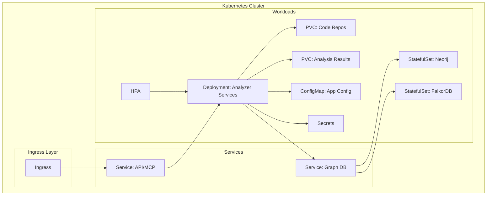

[No sources needed since this diagram shows conceptual workflow, not actual code structure]

**Section sources**
- [ReadMe.md](file://ReadMe.md)
- [Makefile](file://Makefile)

## Core Components
- Stateless Analyzer Services: Python-based analyzers orchestrated via MCP server and service modules.
- Graph Databases: Neo4j or FalkorDB as persistent graph stores for code semantics and relationships.
- Configuration Management: Centralized ConfigMaps and Secrets for environment-specific settings.
- Storage: PersistentVolumeClaims for code repositories and analysis outputs.
- Networking: Services for internal communication and Ingress for external access.
- Scaling: HorizontalPodAutoscaler based on CPU/memory or custom metrics.
- Observability: Prometheus metrics, Grafana dashboards, ELK logging, and distributed tracing.

Key runtime components and their responsibilities:
- MCP Server: Exposes unified APIs for tooling and orchestrators.
- Graph Services: Provide semantic graph operations and queries.
- Workflow Services: Orchestrate multi-step analysis pipelines.
- Impact/Symbol/Explore Services: Specialized capabilities for code impact analysis, symbol resolution, and exploration.

**Section sources**
- [code-tiny/mcp/fastmcp_server.py](file://code-tiny/mcp/fastmcp_server.py)
- [code-tiny/mcp/unified_mcp.py](file://code-tiny/mcp/unified_mcp.py)
- [code-tiny/mcp/services/graph_service.py](file://code-tiny/mcp/services/graph_service.py)
- [code-tiny/mcp/services/workflow_service.py](file://code-tiny/mcp/services/workflow_service.py)
- [code-tiny/mcp/services/explore_service.py](file://code-tiny/mcp/services/explore_service.py)
- [code-tiny/mcp/services/impact_service.py](file://code-tiny/mcp/services/impact_service.py)
- [code-tiny/mcp/services/symbol_service.py](file://code-tiny/mcp/services/symbol_service.py)

## Architecture Overview
The system comprises:
- An ingress controller exposing MCP endpoints externally.
- A stateless Deployment hosting analyzer services and MCP server.
- StatefulSets for graph databases (Neo4j/FalkorDB) with persistent storage.
- ConfigMaps and Secrets for configuration and sensitive data.
- Services for internal routing between pods.
- HPA for autoscaling based on resource usage or custom metrics.
- Optional observability integrations (Prometheus, Grafana, ELK, tracing).

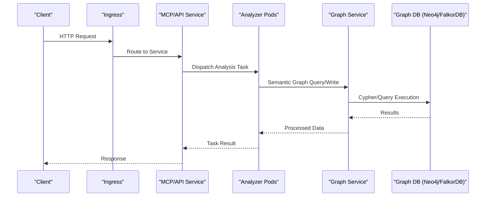

**Diagram sources**
- [code-tiny/mcp/fastmcp_server.py](file://code-tiny/mcp/fastmcp_server.py)
- [code-tiny/mcp/services/graph_service.py](file://code-tiny/mcp/services/graph_service.py)
- [code-tiny/tools/graph/driver/neo4j_driver.py](file://code-tiny/tools/graph/driver/neo4j_driver.py)
- [code-tiny/tools/graph/driver/falkordb_driver.py](file://code-tiny/tools/graph/driver/falkordb_driver.py)

**Section sources**
- [code-tiny/mcp/fastmcp_server.py](file://code-tiny/mcp/fastmcp_server.py)
- [code-tiny/mcp/services/graph_service.py](file://code-tiny/mcp/services/graph_service.py)
- [code-tiny/tools/graph/driver/neo4j_driver.py](file://code-tiny/tools/graph/driver/neo4j_driver.py)
- [code-tiny/tools/graph/driver/falkordb_driver.py](file://code-tiny/tools/graph/driver/falkordb_driver.py)

## Detailed Component Analysis

### Stateless Analyzer Services (Deployment + HPA)
- Purpose: Run stateless analyzer processes and MCP server endpoints.
- Scaling: Use HPA targeting CPU/memory utilization or custom metrics exposed by the MCP server.
- Rolling Updates: Configure strategy to ensure zero-downtime updates.
- Resource Requests/Limits: Set appropriate CPU and memory to balance performance and cluster efficiency.
- Probes: Liveness/readiness probes to maintain healthy pods.

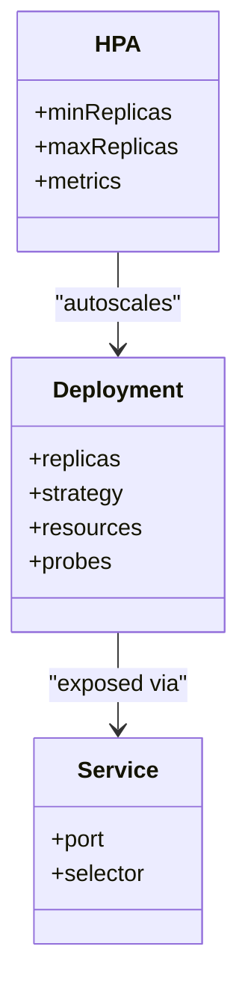

**Diagram sources**
- [code-tiny/mcp/fastmcp_server.py](file://code-tiny/mcp/fastmcp_server.py)
- [code-tiny/mcp/unified_mcp.py](file://code-tiny/mcp/unified_mcp.py)

**Section sources**
- [code-tiny/mcp/fastmcp_server.py](file://code-tiny/mcp/fastmcp_server.py)
- [code-tiny/mcp/unified_mcp.py](file://code-tiny/mcp/unified_mcp.py)

### Graph Database StatefulSets (Neo4j/FalkorDB)
- Purpose: Provide persistent graph storage for code semantics and relationships.
- Persistence: Mount PVCs for data directories.
- Networking: Internal Service for secure access from analyzer pods.
- Configuration: Environment variables and config files via ConfigMaps/Secrets.

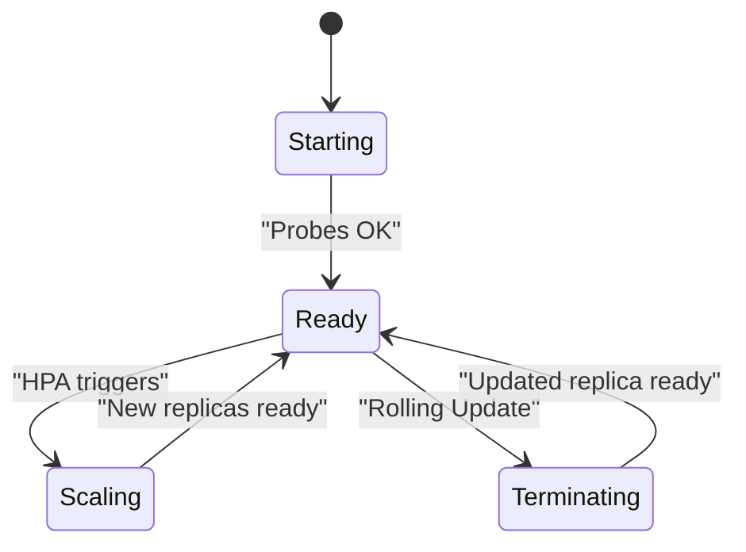

**Diagram sources**
- [code-tiny/tools/graph/driver/neo4j_driver.py](file://code-tiny/tools/graph/driver/neo4j_driver.py)
- [code-tiny/tools/graph/driver/falkordb_driver.py](file://code-tiny/tools/graph/driver/falkordb_driver.py)

**Section sources**
- [code-tiny/tools/graph/driver/neo4j_driver.py](file://code-tiny/tools/graph/driver/neo4j_driver.py)
- [code-tiny/tools/graph/driver/falkordb_driver.py](file://code-tiny/tools/graph/driver/falkordb_driver.py)

### ConfigMaps and Secrets
- ConfigMaps: Application configuration such as MCP endpoints, graph database URLs, and feature flags.
- Secrets: Credentials for graph databases, authentication tokens, and other sensitive values.

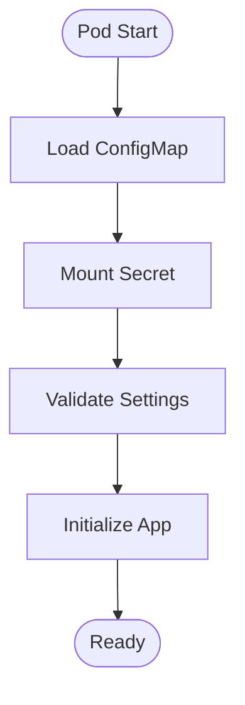

**Diagram sources**
- [harness/templates/config.yaml](file://harness/templates/config.yaml)
- [scripts/mcp_runtime_config.py](file://scripts/mcp_runtime_config.py)

**Section sources**
- [harness/templates/config.yaml](file://harness/templates/config.yaml)
- [scripts/mcp_runtime_config.py](file://scripts/mcp_runtime_config.py)

### PersistentVolumeClaims (Code Repositories and Analysis Results)
- Code Repositories: Shared read-only volumes for source code trees.
- Analysis Results: Writable volumes for intermediate and final artifacts.

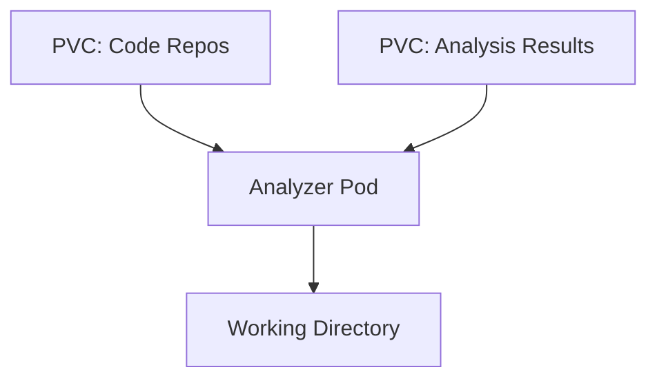

[No sources needed since this diagram shows conceptual workflow, not actual code structure]

### Service Definitions and Ingress
- Services: Internal DNS names for MCP server and graph databases.
- Ingress: External entry point for clients to reach MCP endpoints.

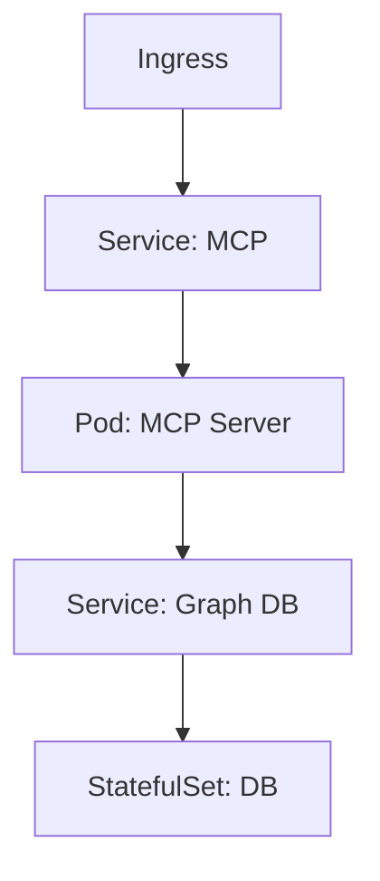

**Diagram sources**
- [code-tiny/mcp/fastmcp_server.py](file://code-tiny/mcp/fastmcp_server.py)
- [code-tiny/mcp/services/graph_service.py](file://code-tiny/mcp/services/graph_service.py)

**Section sources**
- [code-tiny/mcp/fastmcp_server.py](file://code-tiny/mcp/fastmcp_server.py)
- [code-tiny/mcp/services/graph_service.py](file://code-tiny/mcp/services/graph_service.py)

### Monitoring with Prometheus/Grafana
- Metrics: Expose MCP server metrics endpoint for scraping.
- Dashboards: Create Grafana dashboards for request latency, error rates, and resource usage.
- Alerts: Define alert rules for anomalies in MCP throughput and graph query performance.

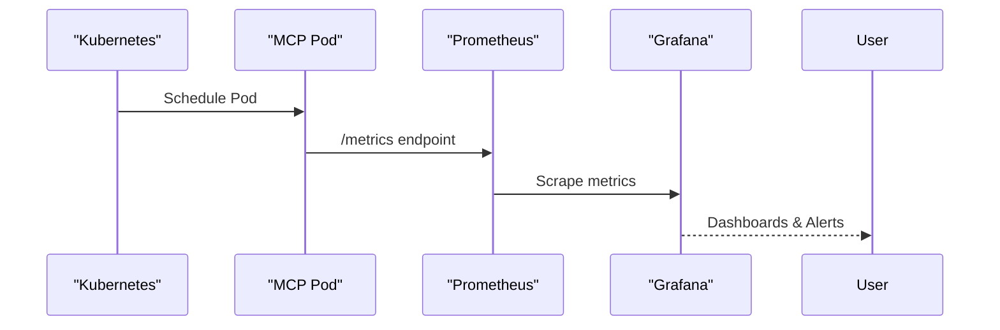

[No sources needed since this diagram shows conceptual workflow, not actual code structure]

### Centralized Logging with ELK Stack
- Log Collection: Sidecar or DaemonSet to collect logs from analyzer pods.
- Indexing: Ship logs to Elasticsearch for indexing.
- Visualization: Use Kibana to search and analyze logs.

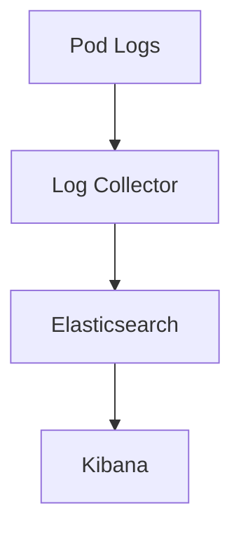

[No sources needed since this diagram shows conceptual workflow, not actual code structure]

### Distributed Tracing
- Instrumentation: Add tracing middleware to MCP server and graph service calls.
- Backend: Export traces to Jaeger or OpenTelemetry collector.
- Correlation: Link traces across MCP requests and graph queries.

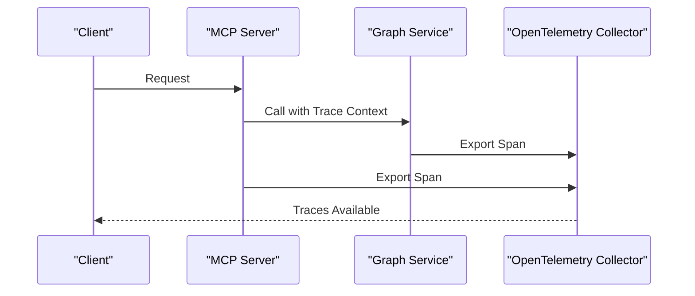

[No sources needed since this diagram shows conceptual workflow, not actual code structure]

### Security Considerations
- RBAC Policies: Restrict access to MCP server and graph database resources.
- Network Policies: Limit ingress/egress traffic to required endpoints only.
- Secrets Management: Store credentials in Kubernetes Secrets; mount securely into pods.

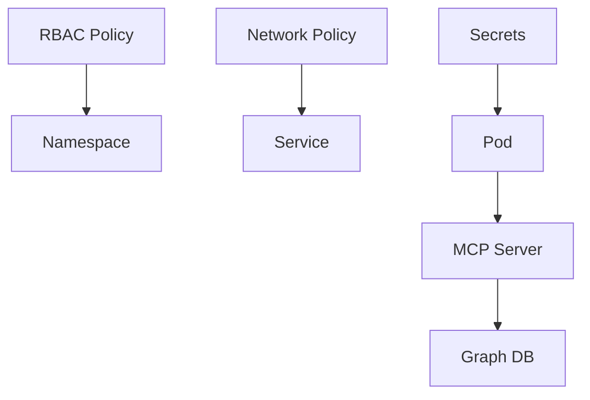

[No sources needed since this diagram shows conceptual workflow, not actual code structure]

## Dependency Analysis
Runtime dependencies include:
- MCP server and services for orchestrating analysis tasks.
- Graph database drivers for Neo4j and FalkorDB.
- Runtime configuration loader for environment-specific settings.
- Initialization and verification scripts for readiness checks.

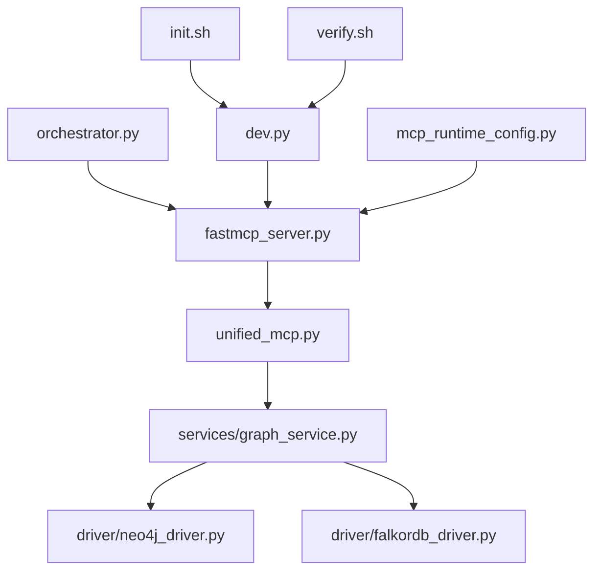

**Diagram sources**
- [code-tiny/mcp/fastmcp_server.py](file://code-tiny/mcp/fastmcp_server.py)
- [code-tiny/mcp/unified_mcp.py](file://code-tiny/mcp/unified_mcp.py)
- [code-tiny/mcp/services/graph_service.py](file://code-tiny/mcp/services/graph_service.py)
- [code-tiny/tools/graph/driver/neo4j_driver.py](file://code-tiny/tools/graph/driver/neo4j_driver.py)
- [code-tiny/tools/graph/driver/falkordb_driver.py](file://code-tiny/tools/graph/driver/falkordb_driver.py)
- [harness/scripts/orchestrator.py](file://harness/scripts/orchestrator.py)
- [cortex_harness/dev.py](file://cortex_harness/dev.py)
- [scripts/mcp_runtime_config.py](file://scripts/mcp_runtime_config.py)
- [harness/scripts/init.sh](file://harness/scripts/init.sh)
- [harness/scripts/verify.sh](file://harness/scripts/verify.sh)

**Section sources**
- [code-tiny/mcp/fastmcp_server.py](file://code-tiny/mcp/fastmcp_server.py)
- [code-tiny/mcp/unified_mcp.py](file://code-tiny/mcp/unified_mcp.py)
- [code-tiny/mcp/services/graph_service.py](file://code-tiny/mcp/services/graph_service.py)
- [code-tiny/tools/graph/driver/neo4j_driver.py](file://code-tiny/tools/graph/driver/neo4j_driver.py)
- [code-tiny/tools/graph/driver/falkordb_driver.py](file://code-tiny/tools/graph/driver/falkordb_driver.py)
- [harness/scripts/orchestrator.py](file://harness/scripts/orchestrator.py)
- [cortex_harness/dev.py](file://cortex_harness/dev.py)
- [scripts/mcp_runtime_config.py](file://scripts/mcp_runtime_config.py)
- [harness/scripts/init.sh](file://harness/scripts/init.sh)
- [harness/scripts/verify.sh](file://harness/scripts/verify.sh)

## Performance Considerations
- Resource Requests/Limits: Tune CPU and memory to match analyzer workload characteristics.
- HPA Targets: Use CPU/memory thresholds and custom metrics (e.g., queue depth, request rate).
- Database Tuning: Optimize graph database configurations for query patterns and concurrency.
- I/O Optimization: Ensure PVCs are provisioned with suitable storage classes and IOPS.
- Concurrency Control: Limit parallelism in analyzer workers to avoid overloading graph databases.

[No sources needed since this section provides general guidance]

## Troubleshooting Guide
Common issues and resolutions:
- MCP Server Not Ready: Check liveness/readiness probes and initialization scripts.
- Graph Database Connectivity: Validate Service DNS, credentials, and network policies.
- PVC Mount Failures: Inspect storage class availability and volume binding status.
- Autoscaling Not Triggering: Confirm metrics endpoints and HPA metric selectors.
- Logging Gaps: Verify log collection sidecars and ELK connectivity.

Operational utilities:
- Initialization script for setting up environment and prerequisites.
- Verification script for health checks and dependency validation.
- Runtime configuration loader for dynamic settings.

**Section sources**
- [harness/scripts/init.sh](file://harness/scripts/init.sh)
- [harness/scripts/verify.sh](file://harness/scripts/verify.sh)
- [scripts/mcp_runtime_config.py](file://scripts/mcp_runtime_config.py)

## Conclusion
This guide outlines a robust Kubernetes deployment model for Cortex Harness, covering stateless analyzer services, persistent graph databases, configuration management, networking, scaling, observability, and security. By following these recommendations, teams can deploy scalable, reliable, and secure analysis pipelines integrated with modern observability stacks.

[No sources needed since this section summarizes without analyzing specific files]

## Appendices

### Example Manifests Overview
- Deployment: Stateless analyzer services with HPA and rolling update strategy.
- StatefulSet: Graph database instances with PVCs and headless Service.
- ConfigMap/Secret: Application configuration and sensitive values.
- Service/Ingress: Internal and external networking.
- NetworkPolicy/RBAC: Security controls.

[No sources needed since this section provides general guidance]