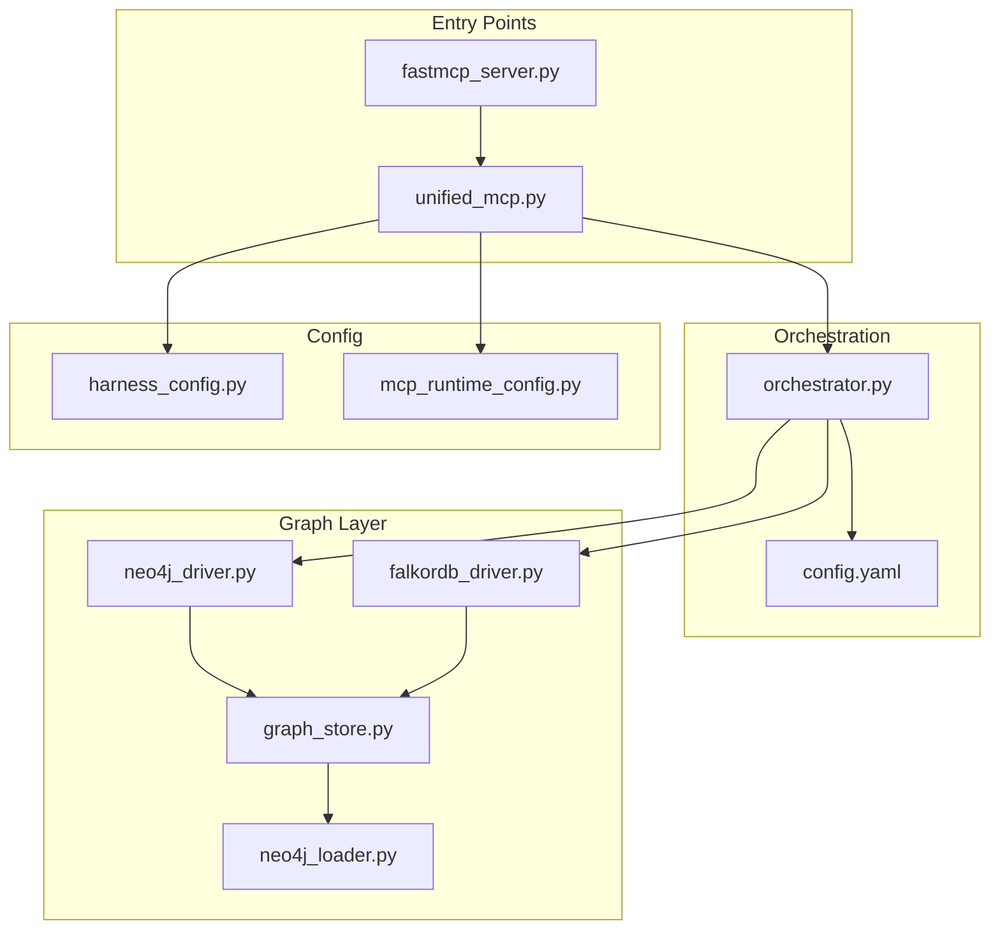
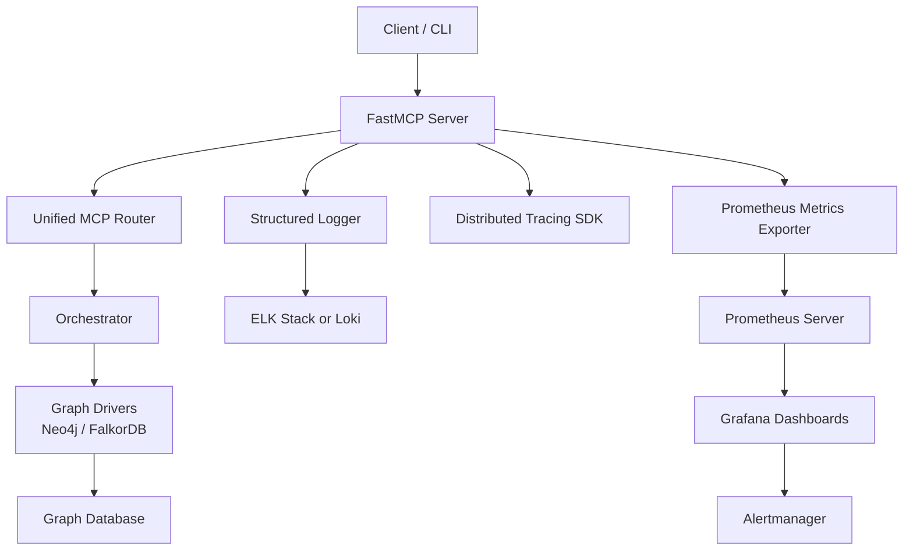
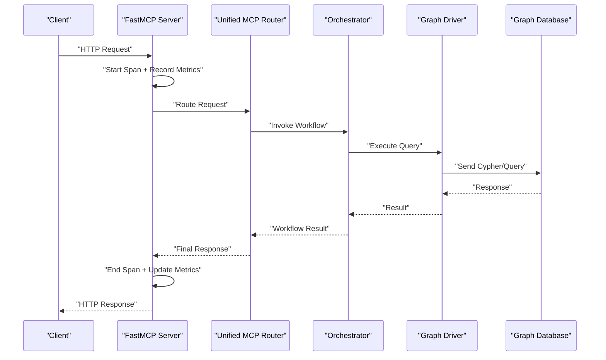
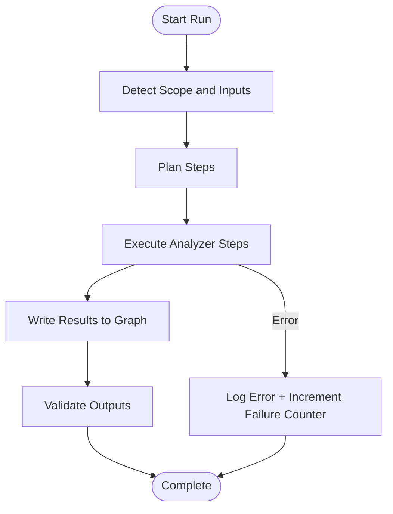
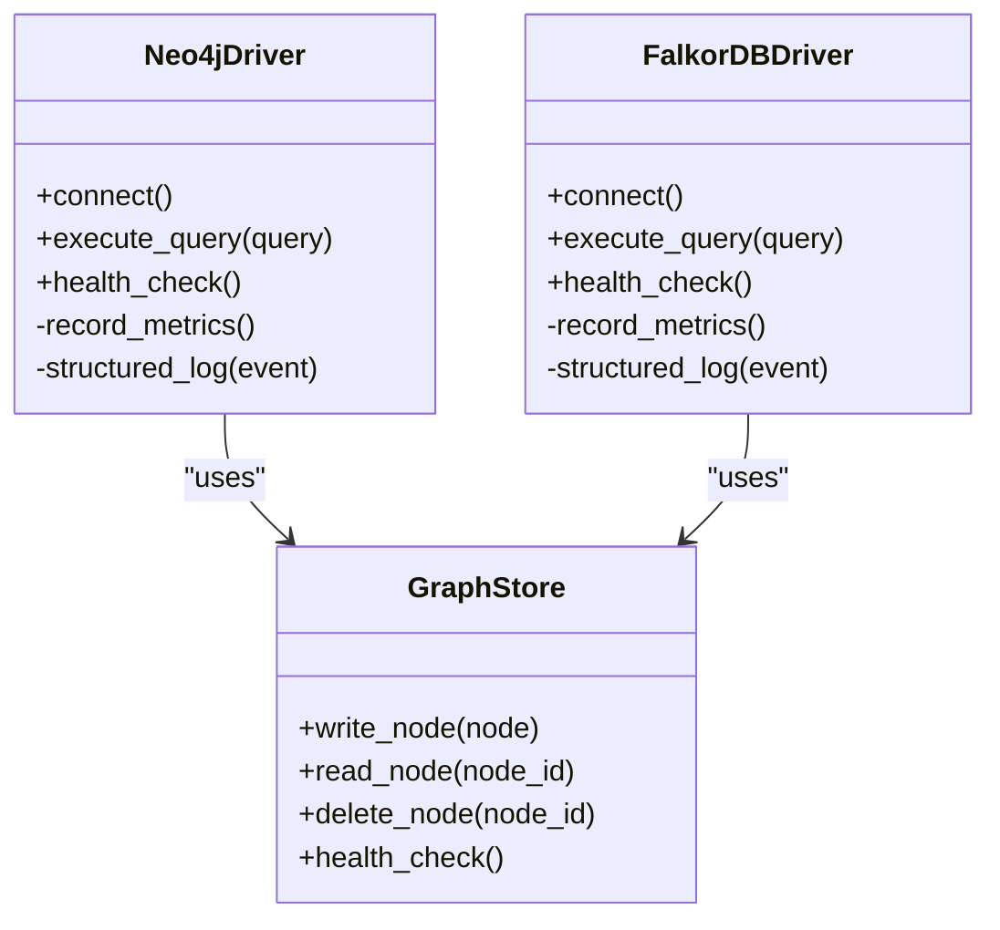
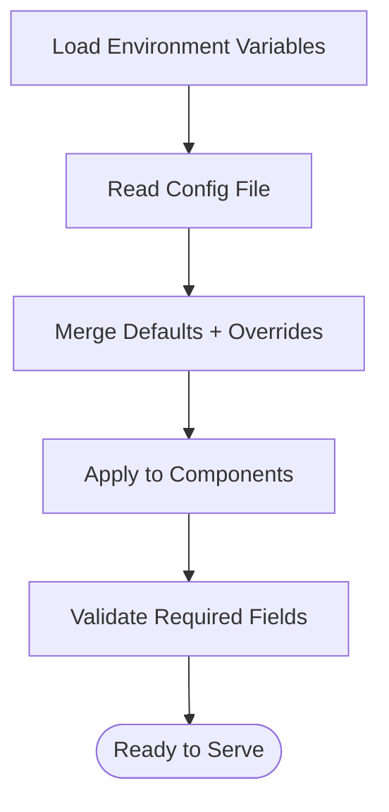
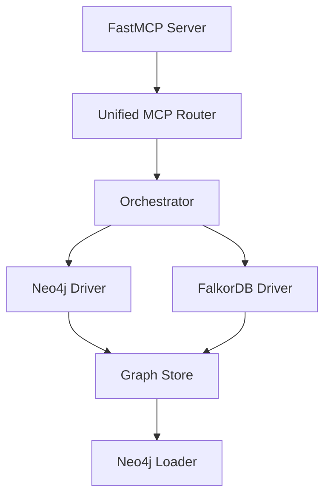

# Monitoring & Logging

<cite>
**Referenced Files in This Document**
- [ReadMe.md](file://ReadMe.md)
- [Makefile](file://Makefile)
- [requirements.txt](file://requirements.txt)
- [pyproject.toml](file://pyproject.toml)
- [cortex_harness/dev.py](file://cortex_harness/dev.py)
- [harness/scripts/orchestrator.py](file://harness/scripts/orchestrator.py)
- [harness/templates/config.yaml](file://harness/templates/config.yaml)
- [code-tiny/mcp/fastmcp_server.py](file://code-tiny/mcp/fastmcp_server.py)
- [code-tiny/mcp/unified_mcp.py](file://code-tiny/mcp/unified_mcp.py)
- [code-tiny/tools/common/harness_config.py](file://code-tiny/tools/common/harness_config.py)
- [code-tiny/tools/graph/driver/neo4j_driver.py](file://code-tiny/tools/graph/driver/neo4j_driver.py)
- [code-tiny/tools/graph/driver/falkordb_driver.py](file://code-tiny/tools/graph/driver/falkordb_driver.py)
- [doc-tiny/graph_store.py](file://doc-tiny/graph_store.py)
- [doc-tiny/neo4j_loader.py](file://doc-tiny/neo4j_loader.py)
- [scripts/mcp_runtime_config.py](file://scripts/mcp_runtime_config.py)
- [tests/test_falkordb_driver.py](file://tests/test_falkordb_driver.py)
- [tests/test_doc_graph_store.py](file://tests/test_doc_graph_store.py)
</cite>

## Table of Contents
1. [Introduction](#introduction)
2. [Project Structure](#project-structure)
3. [Core Components](#core-components)
4. [Architecture Overview](#architecture-overview)
5. [Detailed Component Analysis](#detailed-component-analysis)
6. [Dependency Analysis](#dependency-analysis)
7. [Performance Considerations](#performance-considerations)
8. [Troubleshooting Guide](#troubleshooting-guide)
9. [Conclusion](#conclusion)
10. [Appendices](#appendices)

## Introduction
This document provides a comprehensive guide to monitoring and logging for the project’s analysis pipeline, with a focus on Kubernetes environments. It covers:
- Prometheus metrics collection for analyzer performance, graph database health, and system resource utilization
- Grafana dashboard configurations for visualizing analysis pipeline metrics
- Log aggregation using ELK stack or Loki
- Alerting rules for critical system events
- Distributed tracing implementation across microservices
- Structured logging formats and log retention policies

The guidance is grounded in the repository’s existing components (MCP server, orchestrator, harness configuration, graph drivers, and runtime config), while providing concrete Kubernetes-oriented patterns for observability.

## Project Structure
Observability-related code spans several areas:
- MCP server and unified routing entry points
- Harness orchestration scripts and templates
- Graph database drivers (Neo4j and FalkorDB)
- Runtime configuration utilities
- Tests that validate driver behavior and graph store interactions

**Diagram sources**
- [code-tiny/mcp/fastmcp_server.py](file://code-tiny/mcp/fastmcp_server.py)
- [code-tiny/mcp/unified_mcp.py](file://code-tiny/mcp/unified_mcp.py)
- [harness/scripts/orchestrator.py](file://harness/scripts/orchestrator.py)
- [harness/templates/config.yaml](file://harness/templates/config.yaml)
- [code-tiny/tools/graph/driver/neo4j_driver.py](file://code-tiny/tools/graph/driver/neo4j_driver.py)
- [code-tiny/tools/graph/driver/falkordb_driver.py](file://code-tiny/tools/graph/driver/falkordb_driver.py)
- [doc-tiny/graph_store.py](file://doc-tiny/graph_store.py)
- [doc-tiny/neo4j_loader.py](file://doc-tiny/neo4j_loader.py)
- [code-tiny/tools/common/harness_config.py](file://code-tiny/tools/common/harness_config.py)
- [scripts/mcp_runtime_config.py](file://scripts/mcp_runtime_config.py)

**Section sources**
- [ReadMe.md](file://ReadMe.md)
- [Makefile](file://Makefile)
- [requirements.txt](file://requirements.txt)
- [pyproject.toml](file://pyproject.toml)

## Core Components
- MCP Server and Unified Routing: The FastMCP server exposes capabilities used by clients; the unified MCP layer coordinates requests and dispatches to analyzers and services. These are natural places to instrument metrics and logs.
- Orchestrator: Manages lifecycle and workflow execution. Ideal for pipeline-level metrics (duration, success/failure counts) and structured logs.
- Graph Drivers: Neo4j and FalkorDB drivers encapsulate connectivity and query execution. They should expose health checks and latency/error metrics.
- Graph Store and Loader: Higher-level abstractions over graph operations and data ingestion. Good candidates for counters and histograms around write/read throughput.
- Configuration Utilities: Centralized configuration access ensures consistent settings for endpoints, credentials, and feature toggles.

**Section sources**
- [code-tiny/mcp/fastmcp_server.py](file://code-tiny/mcp/fastmcp_server.py)
- [code-tiny/mcp/unified_mcp.py](file://code-tiny/mcp/unified_mcp.py)
- [harness/scripts/orchestrator.py](file://harness/scripts/orchestrator.py)
- [code-tiny/tools/graph/driver/neo4j_driver.py](file://code-tiny/tools/graph/driver/neo4j_driver.py)
- [code-tiny/tools/graph/driver/falkordb_driver.py](file://code-tiny/tools/graph/driver/falkordb_driver.py)
- [doc-tiny/graph_store.py](file://doc-tiny/graph_store.py)
- [doc-tiny/neo4j_loader.py](file://doc-tiny/neo4j_loader.py)
- [code-tiny/tools/common/harness_config.py](file://code-tiny/tools/common/harness_config.py)
- [scripts/mcp_runtime_config.py](file://scripts/mcp_runtime_config.py)

## Architecture Overview
The following diagram maps the key components involved in observability within Kubernetes:

**Diagram sources**
- [code-tiny/mcp/fastmcp_server.py](file://code-tiny/mcp/fastmcp_server.py)
- [code-tiny/mcp/unified_mcp.py](file://code-tiny/mcp/unified_mcp.py)
- [harness/scripts/orchestrator.py](file://harness/scripts/orchestrator.py)
- [code-tiny/tools/graph/driver/neo4j_driver.py](file://code-tiny/tools/graph/driver/neo4j_driver.py)
- [code-tiny/tools/graph/driver/falkordb_driver.py](file://code-tiny/tools/graph/driver/falkordb_driver.py)
- [doc-tiny/graph_store.py](file://doc-tiny/graph_store.py)
- [doc-tiny/neo4j_loader.py](file://doc-tiny/neo4j_loader.py)

## Detailed Component Analysis

### MCP Server Instrumentation
- Metrics:
  - Request counters by method and status
  - Latency histograms per endpoint
  - Error rates and exception types
- Logs:
  - Structured JSON with fields such as timestamp, level, service, trace_id, span_id, method, path, status_code, duration_ms, error_message
- Tracing:
  - Start/end spans around request handling and downstream calls
  - Propagate trace context via headers to downstream services

**Diagram sources**
- [code-tiny/mcp/fastmcp_server.py](file://code-tiny/mcp/fastmcp_server.py)
- [code-tiny/mcp/unified_mcp.py](file://code-tiny/mcp/unified_mcp.py)
- [harness/scripts/orchestrator.py](file://harness/scripts/orchestrator.py)
- [code-tiny/tools/graph/driver/neo4j_driver.py](file://code-tiny/tools/graph/driver/neo4j_driver.py)
- [code-tiny/tools/graph/driver/falkordb_driver.py](file://code-tiny/tools/graph/driver/falkordb_driver.py)

**Section sources**
- [code-tiny/mcp/fastmcp_server.py](file://code-tiny/mcp/fastmcp_server.py)
- [code-tiny/mcp/unified_mcp.py](file://code-tiny/mcp/unified_mcp.py)

### Orchestrator Metrics and Logs
- Pipeline-level metrics:
  - Total runs, successes, failures, durations
  - Per-analyzer counters and latencies
- Structured logs:
  - Include run_id, analyzer_name, phase, duration_ms, result, error details
- Health checks:
  - Readiness/liveness endpoints exposing internal state and dependency health

**Diagram sources**
- [harness/scripts/orchestrator.py](file://harness/scripts/orchestrator.py)

**Section sources**
- [harness/scripts/orchestrator.py](file://harness/scripts/orchestrator.py)

### Graph Driver Observability
- Health checks:
  - Connectivity probes and basic queries to verify readiness
- Metrics:
  - Connection pool stats (if applicable)
  - Query latency histograms
  - Error counters by error type
- Logs:
  - Structured entries for connection attempts, retries, query executions, and errors

**Diagram sources**
- [code-tiny/tools/graph/driver/neo4j_driver.py](file://code-tiny/tools/graph/driver/neo4j_driver.py)
- [code-tiny/tools/graph/driver/falkordb_driver.py](file://code-tiny/tools/graph/driver/falkordb_driver.py)
- [doc-tiny/graph_store.py](file://doc-tiny/graph_store.py)

**Section sources**
- [code-tiny/tools/graph/driver/neo4j_driver.py](file://code-tiny/tools/graph/driver/neo4j_driver.py)
- [code-tiny/tools/graph/driver/falkordb_driver.py](file://code-tiny/tools/graph/driver/falkordb_driver.py)
- [doc-tiny/graph_store.py](file://doc-tiny/graph_store.py)

### Runtime Configuration and Harness Settings
- Centralized configuration for:
  - Graph database endpoints and credentials
  - Feature flags for enabling/disabling metrics/tracing
  - Log levels and output destinations
- Environment-driven overrides suitable for Kubernetes ConfigMaps and Secrets

**Diagram sources**
- [code-tiny/tools/common/harness_config.py](file://code-tiny/tools/common/harness_config.py)
- [scripts/mcp_runtime_config.py](file://scripts/mcp_runtime_config.py)
- [harness/templates/config.yaml](file://harness/templates/config.yaml)

**Section sources**
- [code-tiny/tools/common/harness_config.py](file://code-tiny/tools/common/harness_config.py)
- [scripts/mcp_runtime_config.py](file://scripts/mcp_runtime_config.py)
- [harness/templates/config.yaml](file://harness/templates/config.yaml)

### Data Ingestion and Loader Observability
- Metrics:
  - Records ingested, ingestion duration, batch sizes
  - Errors and retries during load
- Logs:
  - Structured entries with dataset identifiers, record counts, and outcomes

**Section sources**
- [doc-tiny/neo4j_loader.py](file://doc-tiny/neo4j_loader.py)

## Dependency Analysis
Key dependencies relevant to observability:
- MCP server depends on unified router and orchestrator
- Orchestrator depends on graph drivers and configuration
- Graph drivers depend on underlying databases
- Tests validate driver behavior and graph store interactions

**Diagram sources**
- [code-tiny/mcp/fastmcp_server.py](file://code-tiny/mcp/fastmcp_server.py)
- [code-tiny/mcp/unified_mcp.py](file://code-tiny/mcp/unified_mcp.py)
- [harness/scripts/orchestrator.py](file://harness/scripts/orchestrator.py)
- [code-tiny/tools/graph/driver/neo4j_driver.py](file://code-tiny/tools/graph/driver/neo4j_driver.py)
- [code-tiny/tools/graph/driver/falkordb_driver.py](file://code-tiny/tools/graph/driver/falkordb_driver.py)
- [doc-tiny/graph_store.py](file://doc-tiny/graph_store.py)
- [doc-tiny/neo4j_loader.py](file://doc-tiny/neo4j_loader.py)

**Section sources**
- [tests/test_falkordb_driver.py](file://tests/test_falkordb_driver.py)
- [tests/test_doc_graph_store.py](file://tests/test_doc_graph_store.py)

## Performance Considerations
- Prefer async I/O for network-bound operations (database queries, HTTP calls)
- Use histogram buckets tuned to expected latency ranges for accurate SLO tracking
- Avoid excessive logging in hot paths; use sampling for high-volume events
- Batch writes to graph databases where possible to reduce overhead
- Monitor memory usage and GC pauses if applicable to your runtime

[No sources needed since this section provides general guidance]

## Troubleshooting Guide
Common issues and diagnostics:
- Graph connectivity failures:
  - Check health check endpoints and driver logs
  - Verify credentials and network policies in Kubernetes
- High latency spikes:
  - Inspect Prometheus histograms and Grafana dashboards
  - Correlate with traces to identify slow steps
- Log volume overload:
  - Adjust log levels and enable sampling
  - Ensure structured fields include correlation IDs for tracing

**Section sources**
- [code-tiny/tools/graph/driver/neo4j_driver.py](file://code-tiny/tools/graph/driver/neo4j_driver.py)
- [code-tiny/tools/graph/driver/falkordb_driver.py](file://code-tiny/tools/graph/driver/falkordb_driver.py)

## Conclusion
By instrumenting the MCP server, orchestrator, and graph drivers with Prometheus metrics, structured logging, and distributed tracing, you gain end-to-end visibility into the analysis pipeline. Integrating with ELK or Loki centralizes logs, while Grafana dashboards and Alertmanager provide actionable insights and timely alerts. Kubernetes-native configuration via ConfigMaps and Secrets ensures secure and scalable deployments.

[No sources needed since this section summarizes without analyzing specific files]

## Appendices

### Prometheus Metrics Collection
- Analyzer performance:
  - Counters: total_requests, successful_runs, failed_runs
  - Histograms: request_duration_seconds, analyze_duration_seconds
- Graph database health:
  - Gauges: db_connections_active, db_queries_failed
  - Counters: db_errors_total by error_type
- System resource utilization:
  - Process CPU and memory metrics exposed by the runtime
  - Node-level metrics collected by kube-state-metrics and node-exporter

[No sources needed since this section provides general guidance]

### Grafana Dashboard Configurations
- Panels:
  - Request rate and latency by endpoint
  - Success/failure ratio for analysis runs
  - Graph database query latency and error rates
  - Resource utilization trends
- Annotations:
  - Deployment events and configuration changes
- Sharing:
  - Export dashboards as JSON and version-control them

[No sources needed since this section provides general guidance]

### Log Aggregation (ELK or Loki)
- ELK:
  - Fluent Bit or Filebeat sidecars collect container logs
  - Index by service and environment
- Loki:
  - Promtail collects logs and labels them with Kubernetes metadata
  - Use LogQL for querying and alerting

[No sources needed since this section provides general guidance]

### Alerting Rules
- Critical events:
  - Elevated error rates for MCP endpoints
  - Graph database connectivity failures
  - Excessive ingestion errors
- Thresholds:
  - Define SLO-based thresholds for latency and availability
- Notifications:
  - Integrate with Slack, PagerDuty, or email channels

[No sources needed since this section provides general guidance]

### Distributed Tracing Implementation
- Propagation:
  - Inject trace context into HTTP headers and inter-service calls
- Spans:
  - Create spans for request handling, orchestrator phases, and database queries
- Sampling:
  - Configure adaptive sampling based on traffic and error rates

[No sources needed since this section provides general guidance]

### Structured Logging Formats
- Recommended fields:
  - timestamp, level, service, trace_id, span_id, method, path, status_code, duration_ms, error_message, run_id, analyzer_name
- Output:
  - JSON lines to stdout/stderr for collectors to ingest

[No sources needed since this section provides general guidance]

### Log Retention Policies
- ELK:
  - Index lifecycle management to rotate and delete old indices
- Loki:
  - Object storage retention policies and compaction settings
- Local containers:
  - Limit log file sizes and rotate logs to avoid disk pressure

[No sources needed since this section provides general guidance]