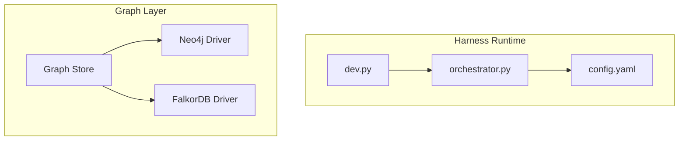
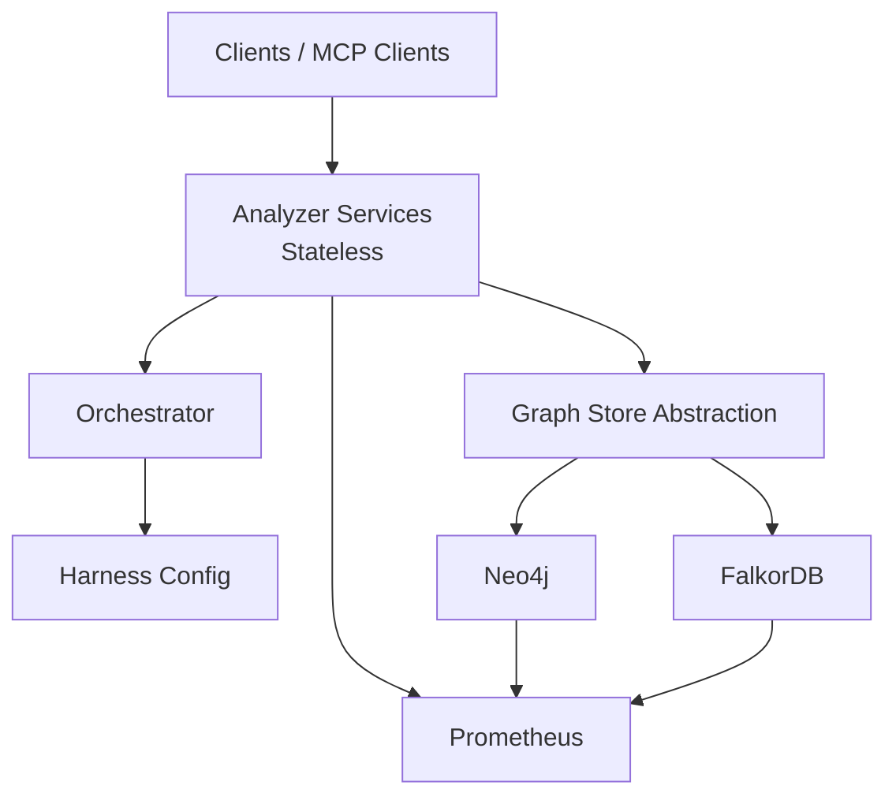
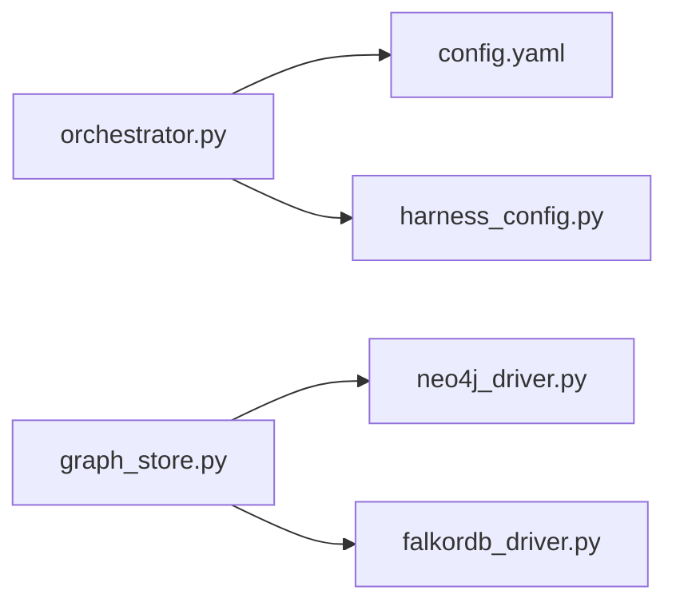

# Scaling & Auto-scaling

<cite>
**Referenced Files in This Document**
- [ReadMe.md](file://ReadMe.md)
- [Makefile](file://Makefile)
- [cortex_harness/dev.py](file://cortex_harness/dev.py)
- [harness/scripts/orchestrator.py](file://harness/scripts/orchestrator.py)
- [harness/templates/config.yaml](file://harness/templates/config.yaml)
- [code-tiny/tools/common/harness_config.py](file://code-tiny/tools/common/harness_config.py)
- [doc-tiny/graph_store.py](file://doc-tiny/graph_store.py)
- [code-tiny/tools/graph/driver/neo4j_driver.py](file://code-tiny/tools/graph/driver/neo4j_driver.py)
- [code-tiny/tools/graph/driver/falkordb_driver.py](file://code-tiny/tools/graph/driver/falkordb_driver.py)
</cite>

## Table of Contents
1. [Introduction](#introduction)
2. [Project Structure](#project-structure)
3. [Core Components](#core-components)
4. [Architecture Overview](#architecture-overview)
5. [Detailed Component Analysis](#detailed-component-analysis)
6. [Dependency Analysis](#dependency-analysis)
7. [Performance Considerations](#performance-considerations)
8. [Troubleshooting Guide](#troubleshooting-guide)
9. [Conclusion](#conclusion)
10. [Appendices](#appendices)

## Introduction
This document provides guidance for scaling and auto-scaling Cortex Harness components across Kubernetes, including:
- HorizontalPodAutoscaler (HPA) configuration based on CPU/memory usage or custom metrics from Prometheus
- VerticalPodAutoscaler (VPA) settings to optimize resource allocation
- Cluster Autoscaler integration for node-level scaling
- PodDisruptionBudgets (PDB) for high availability during maintenance
- Distinct scaling strategies for stateless analyzer services versus stateful graph database components
- Examples of custom metrics for query load monitoring and performance-based scaling triggers

The repository contains application code, orchestrators, and templates that inform how components are structured and configured. Where the repository does not include explicit Kubernetes manifests, this document provides recommended configurations aligned with the observed architecture.

## Project Structure
Cortex Harness includes:
- A Python-based harness entrypoint and development utilities
- An orchestrator script used by the harness lifecycle
- Templates and configuration files for harness behavior
- Graph storage drivers for Neo4j and FalkorDB
- Documentation and scripts related to ingestion and querying

**Diagram sources**
- [cortex_harness/dev.py](file://cortex_harness/dev.py)
- [harness/scripts/orchestrator.py](file://harness/scripts/orchestrator.py)
- [harness/templates/config.yaml](file://harness/templates/config.yaml)
- [code-tiny/tools/graph/driver/neo4j_driver.py](file://code-tiny/tools/graph/driver/neo4j_driver.py)
- [code-tiny/tools/graph/driver/falkordb_driver.py](file://code-tiny/tools/graph/driver/falkordb_driver.py)
- [doc-tiny/graph_store.py](file://doc-tiny/graph_store.py)

**Section sources**
- [ReadMe.md](file://ReadMe.md)
- [Makefile](file://Makefile)
- [cortex_harness/dev.py](file://cortex_harness/dev.py)
- [harness/scripts/orchestrator.py](file://harness/scripts/orchestrator.py)
- [harness/templates/config.yaml](file://harness/templates/config.yaml)
- [code-tiny/tools/common/harness_config.py](file://code-tiny/tools/common/harness_config.py)
- [doc-tiny/graph_store.py](file://doc-tiny/graph_store.py)
- [code-tiny/tools/graph/driver/neo4j_driver.py](file://code-tiny/tools/graph/driver/neo4j_driver.py)
- [code-tiny/tools/graph/driver/falkordb_driver.py](file://code-tiny/tools/graph/driver/falkordb_driver.py)

## Core Components
- Analyzer Services (stateless): Code analysis pipelines and MCP routing logic are implemented as stateless processes suitable for horizontal scaling.
- Graph Database (stateful): Graph storage is provided via Neo4j or FalkorDB drivers, indicating a stateful layer that should be scaled carefully and typically vertically or through managed cluster topology rather than simple pod replication.

Key observations:
- The harness orchestrator coordinates tasks and reads configuration from a template file.
- Graph store abstraction uses specific drivers for different backends.

**Section sources**
- [harness/scripts/orchestrator.py](file://harness/scripts/orchestrator.py)
- [harness/templates/config.yaml](file://harness/templates/config.yaml)
- [code-tiny/tools/common/harness_config.py](file://code-tiny/tools/common/harness_config.py)
- [doc-tiny/graph_store.py](file://doc-tiny/graph_store.py)
- [code-tiny/tools/graph/driver/neo4j_driver.py](file://code-tiny/tools/graph/driver/neo4j_driver.py)
- [code-tiny/tools/graph/driver/falkordb_driver.py](file://code-tiny/tools/graph/driver/falkordb_driver.py)

## Architecture Overview
The system comprises:
- Stateless analyzer services orchestrated by the harness
- A graph data plane backed by Neo4j or FalkorDB
- Optional Prometheus scraping for metrics exposure from services and databases

[No sources needed since this diagram shows conceptual workflow, not actual code structure]

## Detailed Component Analysis

### HorizontalPodAutoscaler (HPA) Strategy
- Stateless analyzer services:
  - Scale out based on CPU utilization and request throughput
  - Use custom metrics from Prometheus for query load and latency
- Stateful graph components:
  - Avoid HPA-driven replica changes; prefer vertical scaling or cluster topology adjustments

Recommended HPA targets:
- CPU target utilization thresholds tuned per service workload
- Custom metric targets for queries-per-second (QPS), p95 latency, or error rate

Example custom metrics for query load monitoring:
- Queries per second exposed by analyzer services
- Average response latency percentiles
- Active connection counts to graph stores

Performance-based scaling triggers:
- Increase replicas when QPS exceeds threshold or latency rises above SLO
- Decrease replicas when utilization drops below lower bound for sustained period

[No sources needed since this section provides general guidance]

### VerticalPodAutoscaler (VPA) Settings
- Apply VPA to both analyzer services and graph nodes to right-size requests and limits
- Use recommendations mode initially, then switch to update mode after validation
- Monitor resource pressure and adjust min/max bounds to prevent over-provisioning

[No sources needed since this section provides general guidance]

### Cluster Autoscaler Integration
- Ensure minimum and maximum node counts align with expected peak workloads
- Configure autoscaler policies for scale-up/down stabilization windows
- Validate taints/tolerations and node selectors for graph nodes requiring specialized resources

[No sources needed since this section provides general guidance]

### PodDisruptionBudgets (PDB)
- Set PDB for analyzer services to allow rolling updates while maintaining capacity
- For stateful graph nodes, use PDB cautiously to avoid quorum loss; coordinate with cluster management

[No sources needed since this section provides general guidance]

### Scaling Strategies: Stateless vs Stateful
- Stateless analyzer services:
  - Prefer horizontal scaling with HPA
  - Use readiness/liveness probes to ensure traffic only routes to healthy pods
- Stateful graph database components:
  - Prefer vertical scaling with VPA or managed upgrades
  - Maintain consistent storage classes and volume claims
  - Avoid frequent replica churn; rely on cluster topology and sharding if supported

[No sources needed since this section provides general guidance]

### Custom Metrics and Performance Triggers
- Expose Prometheus metrics from analyzer services:
  - Request counters, latency histograms, error rates
  - Queue depth or backlog indicators for long-running analyses
- Graph database metrics:
  - Query latency, connections, cache hit ratios
  - Disk I/O and memory usage for tuning VPA and node sizing

[No sources needed since this section provides general guidance]

## Dependency Analysis
The harness orchestrator depends on configuration and interacts with graph store abstractions, which in turn depend on specific drivers.

**Diagram sources**
- [harness/scripts/orchestrator.py](file://harness/scripts/orchestrator.py)
- [harness/templates/config.yaml](file://harness/templates/config.yaml)
- [code-tiny/tools/common/harness_config.py](file://code-tiny/tools/common/harness_config.py)
- [doc-tiny/graph_store.py](file://doc-tiny/graph_store.py)
- [code-tiny/tools/graph/driver/neo4j_driver.py](file://code-tiny/tools/graph/driver/neo4j_driver.py)
- [code-tiny/tools/graph/driver/falkordb_driver.py](file://code-tiny/tools/graph/driver/falkordb_driver.py)

**Section sources**
- [harness/scripts/orchestrator.py](file://harness/scripts/orchestrator.py)
- [harness/templates/config.yaml](file://harness/templates/config.yaml)
- [code-tiny/tools/common/harness_config.py](file://code-tiny/tools/common/harness_config.py)
- [doc-tiny/graph_store.py](file://doc-tiny/graph_store.py)
- [code-tiny/tools/graph/driver/neo4j_driver.py](file://code-tiny/tools/graph/driver/neo4j_driver.py)
- [code-tiny/tools/graph/driver/falkordb_driver.py](file://code-tiny/tools/graph/driver/falkordb_driver.py)

## Performance Considerations
- Right-size CPU/memory requests and limits using VPA recommendations
- Tune HPA cooldown periods to avoid thrashing under bursty workloads
- Separate read-heavy and write-heavy workloads into distinct deployments where possible
- Monitor graph database performance metrics to guide vertical scaling and storage class selection
- Use readiness gates to ensure new pods are warmed before receiving traffic

[No sources needed since this section provides general guidance]

## Troubleshooting Guide
Common issues and checks:
- HPA not scaling:
  - Verify metrics server and Prometheus adapter are installed and scraping
  - Confirm custom metrics endpoints are reachable and returning valid values
- VPA not applying recommendations:
  - Check VPA mode (recommendation vs update) and resource constraints
  - Review events for conflicts or insufficient permissions
- PDB blocking updates:
  - Adjust maxUnavailable/minAvailable to balance availability and rollout speed
- Graph connectivity problems:
  - Validate driver configuration and network policies
  - Inspect database logs for connection limits or authentication errors

[No sources needed since this section provides general guidance]

## Conclusion
Cortex Harness consists of stateless analyzer services and a stateful graph data plane. For optimal scaling:
- Use HPA with CPU/memory and Prometheus custom metrics for analyzer services
- Apply VPA to right-size resources across all components
- Integrate Cluster Autoscaler to provision nodes matching workload demands
- Configure PDBs to maintain availability during maintenance
- Differentiate scaling strategies between stateless and stateful components to ensure stability and performance

[No sources needed since this section summarizes without analyzing specific files]

## Appendices

### Example HPA Targets (Conceptual)
- CPU utilization target: 60–75% for analyzer services
- Custom metric targets:
  - Queries per second threshold
  - p95 latency threshold
  - Error rate threshold

[No sources needed since this section provides general guidance]

### Example VPA Profiles (Conceptual)
- Analyzer services:
  - Requests: moderate CPU, low-to-moderate memory
  - Limits: higher CPU burst allowance
- Graph nodes:
  - Requests: higher memory and CPU
  - Limits: conservative to prevent OOM kills

[No sources needed since this section provides general guidance]

### Example PDB Policies (Conceptual)
- Analyzer services:
  - maxUnavailable: 1 or 25% depending on replica count
- Graph nodes:
  - minAvailable: majority of replicas to preserve quorum

[No sources needed since this section provides general guidance]