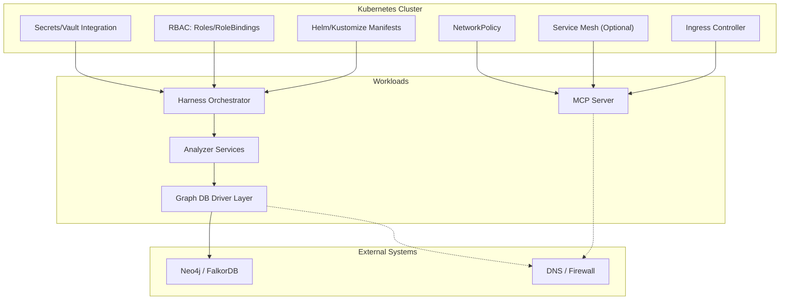
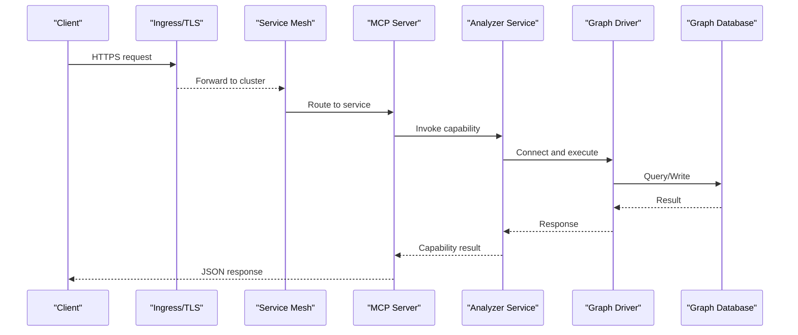
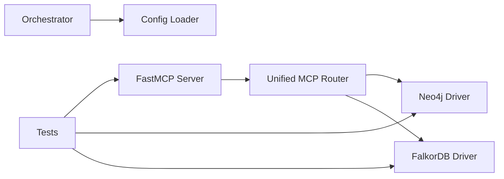

# Security & Networking

<cite>
**Referenced Files in This Document**
- [ReadMe.md](file://ReadMe.md)
- [Makefile](file://Makefile)
- [requirements.txt](file://requirements.txt)
- [pyproject.toml](file://pyproject.toml)
- [cortex_harness/dev.py](file://cortex_harness/dev.py)
- [harness/scripts/orchestrator.py](file://harness/scripts/orchestrator.py)
- [harness/templates/config.yaml](file://harness/templates/config.yaml)
- [code-tiny/mcp/fastmcp_server.py](file://code-tiny/mcp/fastmcp_server.py)
- [code-tiny/mcp/unified_mcp.py](file://code-tiny/mcp/unified_mcp.py)
- [code-tiny/tools/common/harness_config.py](file://code-tiny/tools/common/harness_config.py)
- [code-tiny/tools/graph/driver/neo4j_driver.py](file://code-tiny/tools/graph/driver/neo4j_driver.py)
- [code-tiny/tools/graph/driver/falkordb_driver.py](file://code-tiny/tools/graph/driver/falkordb_driver.py)
- [doc-tiny/neo4j_loader.py](file://doc-tiny/neo4j_loader.py)
- [scripts/mcp_runtime_config.py](file://scripts/mcp_runtime_config.py)
- [tests/test_mcp_http_resilience.py](file://tests/test_mcp_http_resilience.py)
- [tests/test_dev_init_graph_provider.py](file://tests/test_dev_init_graph_provider.py)
</cite>

## Table of Contents
1. [Introduction](#introduction)
2. [Project Structure](#project-structure)
3. [Core Components](#core-components)
4. [Architecture Overview](#architecture-overview)
5. [Detailed Component Analysis](#detailed-component-analysis)
6. [Dependency Analysis](#dependency-analysis)
7. [Performance Considerations](#performance-considerations)
8. [Troubleshooting Guide](#troubleshooting-guide)
9. [Conclusion](#conclusion)
10. [Appendices](#appendices)

## Introduction
This document provides security best practices and networking configuration guidance for deploying Cortex Harness on Kubernetes. It focuses on:
- RBAC policies for service accounts
- Network Policies to restrict pod-to-pod communication
- Secrets management using Kubernetes Secrets or external vaults
- TLS termination at the Ingress level
- Service mesh integration options (Istio, Linkerd)
- Container image scanning
- Firewall rules and DNS configuration
- Secure communication between analyzer services and graph databases

The guidance is aligned with the repository’s runtime components, MCP server, and graph database drivers.

## Project Structure
Cortex Harness includes a Python-based harness orchestrator, an MCP server layer, and multiple graph database drivers. The following files are relevant to deployment and runtime behavior:
- Orchestrator and templates for environment setup
- MCP server entrypoints and unified routing
- Graph driver implementations for Neo4j and FalkorDB
- Runtime configuration utilities used by tests and scripts

[No sources needed since this diagram shows conceptual workflow, not actual code structure]

## Core Components
- Harness Orchestrator: Initializes environments, coordinates workflows, and loads configuration.
- MCP Server: Exposes capabilities via HTTP; integrates with analyzers and graph backends.
- Graph Drivers: Provide connectivity to Neo4j and FalkorDB with connection parameters sourced from configuration.
- Runtime Configuration: Centralized loading of environment variables and config files.

Key implementation references:
- Orchestrator script and template configuration
- MCP server entrypoint and unified routing
- Graph driver implementations
- Runtime configuration loader

**Section sources**
- [harness/scripts/orchestrator.py](file://harness/scripts/orchestrator.py)
- [harness/templates/config.yaml](file://harness/templates/config.yaml)
- [code-tiny/mcp/fastmcp_server.py](file://code-tiny/mcp/fastmcp_server.py)
- [code-tiny/mcp/unified_mcp.py](file://code-tiny/mcp/unified_mcp.py)
- [code-tiny/tools/graph/driver/neo4j_driver.py](file://code-tiny/tools/graph/driver/neo4j_driver.py)
- [code-tiny/tools/graph/driver/falkordb_driver.py](file://code-tiny/tools/graph/driver/falkordb_driver.py)
- [code-tiny/tools/common/harness_config.py](file://code-tiny/tools/common/harness_config.py)

## Architecture Overview
The system exposes an HTTP API through the MCP server, optionally behind an Ingress and service mesh. Analyzers call into graph drivers to persist and query data. Secrets and configuration are injected via Kubernetes primitives or external vaults.

**Diagram sources**
- [code-tiny/mcp/fastmcp_server.py](file://code-tiny/mcp/fastmcp_server.py)
- [code-tiny/mcp/unified_mcp.py](file://code-tiny/mcp/unified_mcp.py)
- [code-tiny/tools/graph/driver/neo4j_driver.py](file://code-tiny/tools/graph/driver/neo4j_driver.py)
- [code-tiny/tools/graph/driver/falkordb_driver.py](file://code-tiny/tools/graph/driver/falkordb_driver.py)

## Detailed Component Analysis

### RBAC Policies for Service Accounts
Recommendations:
- Create dedicated ServiceAccounts per workload (e.g., harness-orchestrator, mcp-server).
- Use minimal Roles/ClusterRoles scoped to required resources (Pods, ConfigMaps, Secrets, Services).
- Bind roles via RoleBindings/ClusterRoleBindings only to necessary namespaces.
- Avoid default service account privileges; explicitly mount tokens when needed.

Implementation notes:
- Ensure the orchestrator and MCP server run under their own ServiceAccount.
- Restrict access to Secrets to only those required by each component.

**Section sources**
- [harness/scripts/orchestrator.py](file://harness/scripts/orchestrator.py)
- [code-tiny/mcp/fastmcp_server.py](file://code-tiny/mcp/fastmcp_server.py)

### Network Policies for Pod-to-Pod Communication
Recommendations:
- Deny all ingress/egress by default within the namespace.
- Allow egress from MCP server to analyzer services and graph databases.
- Allow ingress to MCP server only from Ingress controller or service mesh sidecars.
- Isolate graph database traffic to specific pods/namespaces.

Implementation notes:
- Define NetworkPolicies targeting MCP server and analyzer pods.
- Use pod selectors and port ranges to limit exposure.

**Section sources**
- [code-tiny/mcp/fastmcp_server.py](file://code-tiny/mcp/fastmcp_server.py)
- [code-tiny/tools/graph/driver/neo4j_driver.py](file://code-tiny/tools/graph/driver/neo4j_driver.py)
- [code-tiny/tools/graph/driver/falkordb_driver.py](file://code-tiny/tools/graph/driver/falkordb_driver.py)

### Secrets Management Using Kubernetes Secrets or External Vault
Recommendations:
- Store credentials (database URLs, tokens) in Kubernetes Secrets.
- Mount secrets as environment variables or files; avoid hardcoding.
- For enterprise deployments, integrate with external vault solutions (e.g., HashiCorp Vault) and inject secrets at runtime.
- Rotate secrets regularly and audit access.

Implementation notes:
- Load configuration values from environment variables and config files.
- Ensure MCP server and graph drivers read secrets securely.

**Section sources**
- [code-tiny/tools/common/harness_config.py](file://code-tiny/tools/common/harness_config.py)
- [harness/templates/config.yaml](file://harness/templates/config.yaml)
- [code-tiny/tools/graph/driver/neo4j_driver.py](file://code-tiny/tools/graph/driver/neo4j_driver.py)
- [code-tiny/tools/graph/driver/falkordb_driver.py](file://code-tiny/tools/graph/driver/falkordb_driver.py)

### TLS Termination at Ingress Level
Recommendations:
- Configure Ingress to terminate TLS and forward internal traffic over HTTP(S) within the cluster.
- Use short-lived certificates managed by cert-manager.
- Enforce HTTPS-only routes and redirect HTTP to HTTPS.
- Validate upstream services accept secure connections.

Implementation notes:
- Point Ingress to the MCP server service.
- Ensure service mesh can handle mTLS if enabled.

**Section sources**
- [code-tiny/mcp/fastmcp_server.py](file://code-tiny/mcp/fastmcp_server.py)

### Service Mesh Integration Options (Istio/Linkerd)
Recommendations:
- Enable mTLS between pods to encrypt intra-cluster traffic.
- Use Istio/Linkerd for traffic control, observability, and policy enforcement.
- Configure sidecar injection for MCP server and analyzer services.
- Apply authorization policies to restrict cross-service calls.

Implementation notes:
- Ensure MCP server and graph drivers operate transparently with mTLS.
- Verify DNS resolution and retries under mesh conditions.

**Section sources**
- [code-tiny/mcp/fastmcp_server.py](file://code-tiny/mcp/fastmcp_server.py)
- [code-tiny/tools/graph/driver/neo4j_driver.py](file://code-tiny/tools/graph/driver/neo4j_driver.py)
- [code-tiny/tools/graph/driver/falkordb_driver.py](file://code-tiny/tools/graph/driver/falkordb_driver.py)

### Security Scanning for Container Images
Recommendations:
- Scan images for vulnerabilities before deployment (e.g., Trivy, Clair).
- Pin base images and dependencies; rebuild frequently.
- Integrate scanning into CI/CD pipelines; block builds on critical findings.
- Maintain SBOMs for traceability.

Implementation notes:
- Align with project build steps and dependency management.

**Section sources**
- [requirements.txt](file://requirements.txt)
- [pyproject.toml](file://pyproject.toml)
- [Makefile](file://Makefile)

### Firewall Rules and DNS Configuration
Recommendations:
- Restrict egress from pods to known endpoints (graph DBs, external APIs).
- Allow DNS resolution for internal services and external domains as needed.
- Use private endpoints for graph databases; avoid public exposure.
- Monitor and log denied connections for visibility.

Implementation notes:
- Ensure MCP server and graph drivers resolve hostnames correctly.
- Validate connectivity during health checks.

**Section sources**
- [code-tiny/tools/graph/driver/neo4j_driver.py](file://code-tiny/tools/graph/driver/neo4j_driver.py)
- [code-tiny/tools/graph/driver/falkordb_driver.py](file://code-tiny/tools/graph/driver/falkordb_driver.py)

### Secure Communication Between Analyzer Services and Graph Databases
Recommendations:
- Use encrypted connections where supported by the database driver.
- Authenticate using strong credentials stored in Secrets.
- Limit network access to authorized pods via NetworkPolicies.
- Implement retries and timeouts for resilience.

Implementation notes:
- Configure connection parameters via runtime configuration.
- Validate driver behavior under failure scenarios.

**Section sources**
- [code-tiny/tools/graph/driver/neo4j_driver.py](file://code-tiny/tools/graph/driver/neo4j_driver.py)
- [code-tiny/tools/graph/driver/falkordb_driver.py](file://code-tiny/tools/graph/driver/falkordb_driver.py)
- [doc-tiny/neo4j_loader.py](file://doc-tiny/neo4j_loader.py)

## Dependency Analysis
Runtime dependencies include the MCP server, orchestrator, and graph drivers. Tests validate HTTP resilience and initialization flows.

**Diagram sources**
- [code-tiny/mcp/fastmcp_server.py](file://code-tiny/mcp/fastmcp_server.py)
- [code-tiny/mcp/unified_mcp.py](file://code-tiny/mcp/unified_mcp.py)
- [code-tiny/tools/graph/driver/neo4j_driver.py](file://code-tiny/tools/graph/driver/neo4j_driver.py)
- [code-tiny/tools/graph/driver/falkordb_driver.py](file://code-tiny/tools/graph/driver/falkordb_driver.py)
- [harness/scripts/orchestrator.py](file://harness/scripts/orchestrator.py)
- [code-tiny/tools/common/harness_config.py](file://code-tiny/tools/common/harness_config.py)
- [tests/test_mcp_http_resilience.py](file://tests/test_mcp_http_resilience.py)
- [tests/test_dev_init_graph_provider.py](file://tests/test_dev_init_graph_provider.py)

**Section sources**
- [code-tiny/mcp/fastmcp_server.py](file://code-tiny/mcp/fastmcp_server.py)
- [code-tiny/mcp/unified_mcp.py](file://code-tiny/mcp/unified_mcp.py)
- [code-tiny/tools/graph/driver/neo4j_driver.py](file://code-tiny/tools/graph/driver/neo4j_driver.py)
- [code-tiny/tools/graph/driver/falkordb_driver.py](file://code-tiny/tools/graph/driver/falkordb_driver.py)
- [harness/scripts/orchestrator.py](file://harness/scripts/orchestrator.py)
- [code-tiny/tools/common/harness_config.py](file://code-tiny/tools/common/harness_config.py)
- [tests/test_mcp_http_resilience.py](file://tests/test_mcp_http_resilience.py)
- [tests/test_dev_init_graph_provider.py](file://tests/test_dev_init_graph_provider.py)

## Performance Considerations
- Prefer persistent connections to graph databases where supported.
- Tune timeouts and retry policies for resilient operations.
- Use connection pooling and caching strategies appropriate for workloads.
- Monitor resource usage and scale horizontally for MCP server and analyzers.

[No sources needed since this section provides general guidance]

## Troubleshooting Guide
Common issues and resolutions:
- Connection failures to graph databases: verify credentials, endpoints, and NetworkPolicies.
- TLS errors: ensure Ingress terminates TLS correctly and upstream services accept secure connections.
- DNS resolution problems: check CoreDNS and allowlist external domains.
- RBAC denials: confirm ServiceAccount permissions and bindings.
- Image scan blocks: remediate vulnerabilities and pin versions.

Validation references:
- HTTP resilience tests for MCP server
- Initialization tests for graph provider setup

**Section sources**
- [tests/test_mcp_http_resilience.py](file://tests/test_mcp_http_resilience.py)
- [tests/test_dev_init_graph_provider.py](file://tests/test_dev_init_graph_provider.py)

## Conclusion
By applying RBAC least privilege, enforcing NetworkPolicies, managing secrets securely, terminating TLS at Ingress, integrating a service mesh, scanning container images, and securing graph database communications, Cortex Harness can be deployed safely and reliably on Kubernetes.

[No sources needed since this section summarizes without analyzing specific files]

## Appendices

### Appendix A: Example Deployment Checklist
- Define ServiceAccounts and bind minimal Roles.
- Create NetworkPolicies restricting ingress/egress.
- Store secrets in Kubernetes Secrets or external vault.
- Configure Ingress with TLS and certificate automation.
- Enable service mesh mTLS for intra-cluster encryption.
- Integrate image scanning into CI/CD.
- Validate DNS and firewall rules for graph DB connectivity.

[No sources needed since this section provides general guidance]