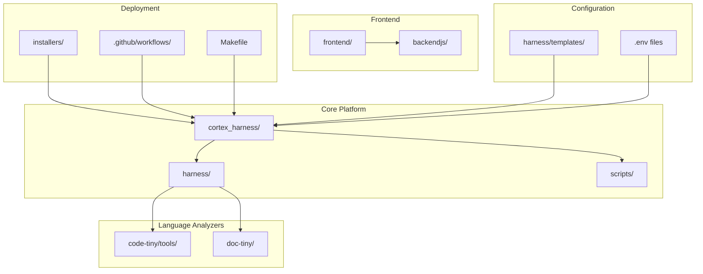
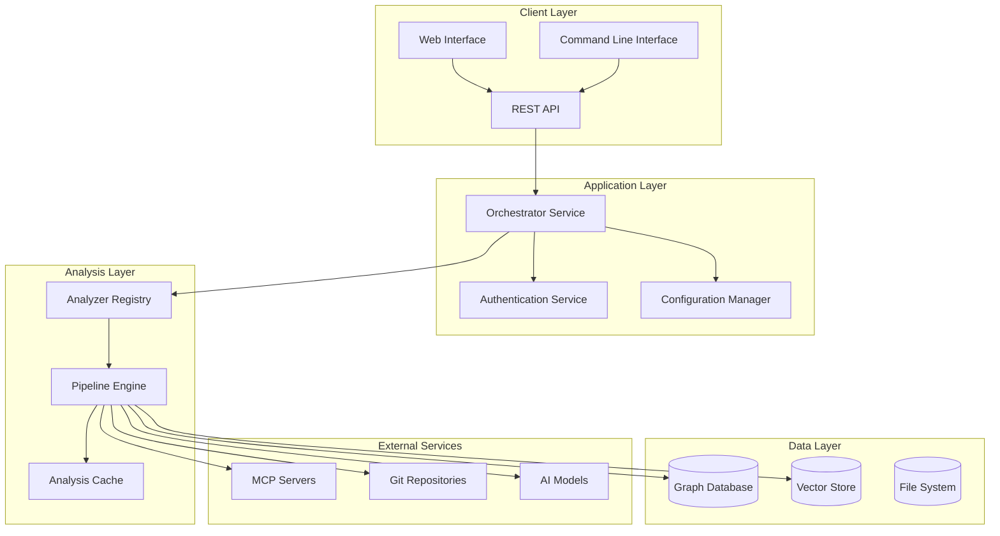
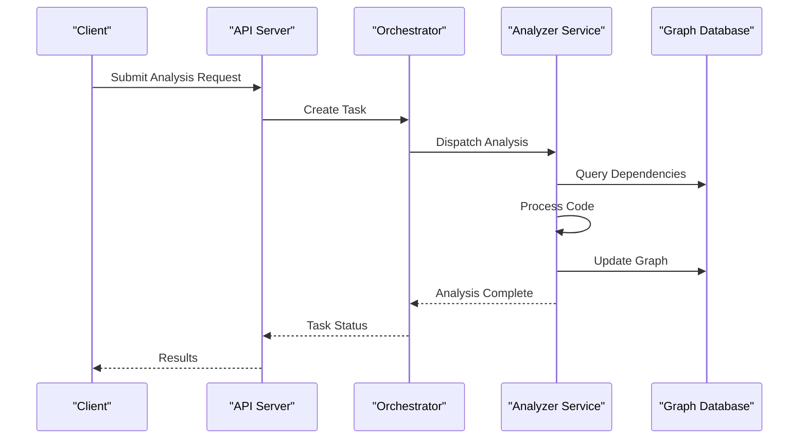
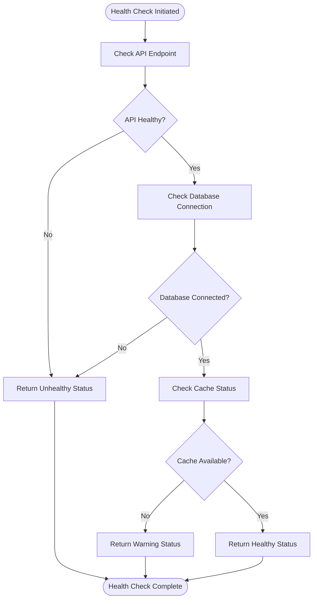
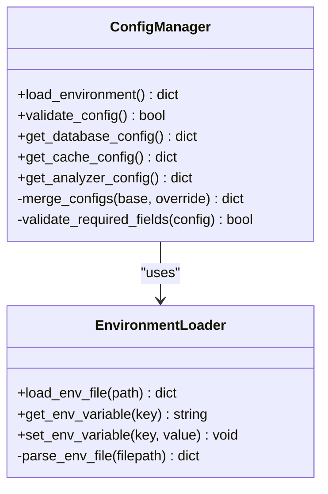
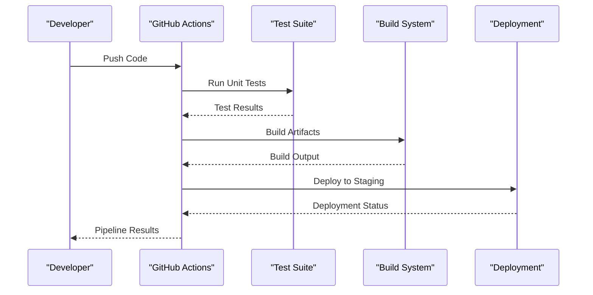
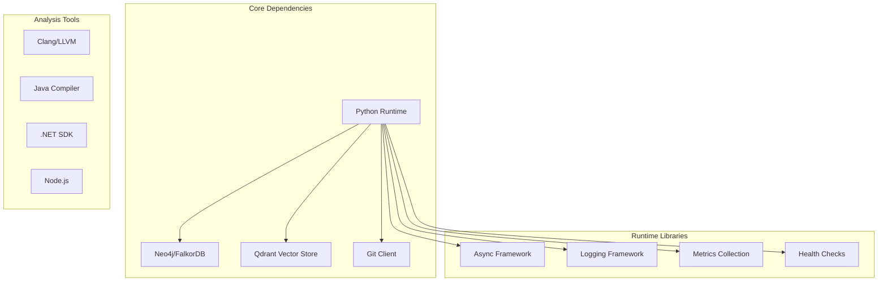
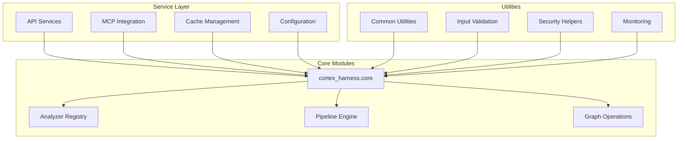
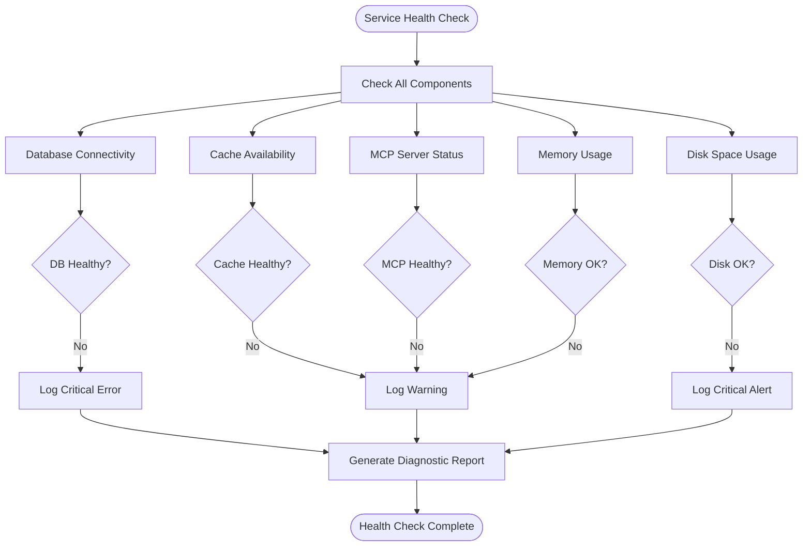

# Deployment & Operations

<cite>
**Referenced Files in This Document**
- [ReadMe.md](file://ReadMe.md)
- [Makefile](file://Makefile)
- [pyproject.toml](file://pyproject.toml)
- [requirements.txt](file://requirements.txt)
- [.github/workflows/cobol-macos.yml](file://.github/workflows/cobol-macos.yml)
- [.github/workflows/lifecycle-macos.yml](file://.github/workflows/lifecycle-macos.yml)
- [cortex_harness/dev.py](file://cortex_harness/dev.py)
- [harness/scripts/orchestrator.py](file://harness/scripts/orchestrator.py)
- [harness/scripts/init.sh](file://harness/scripts/init.sh)
- [harness/scripts/verify.sh](file://harness/scripts/verify.sh)
- [installers/README.md](file://installers/README.md)
- [installers/common/config_manager.py](file://installers/common/config_manager.py)
- [installers/macos/build_pkg.sh](file://installers/macos/build_pkg.sh)
- [installers/ubuntu/build_deb.sh](file://installers/ubuntu/build_deb.sh)
- [installers/windows/inno_setup/cortex_harness.iss](file://installers/windows/inno_setup/cortex_harness.iss)
- [installers/windows/scripts/wrapper.bat](file://installers/windows/scripts/wrapper.bat)
- [code-tiny/.env-sample](file://code-tiny/.env-sample)
- [doc-tiny/.env-sample](file://doc-tiny/.env-sample)
- [scripts/mcp-lifecycle.py](file://scripts/mcp-lifecycle.py)
- [scripts/mcp_runtime_config.py](file://scripts/mcp_runtime_config.py)
- [harness/templates/config.yaml](file://harness/templates/config.yaml)
- [backendjs/src/routes/](file://backendjs/src/routes/)
</cite>

## Table of Contents
1. [Introduction](#introduction)
2. [Project Structure](#project-structure)
3. [Core Components](#core-components)
4. [Architecture Overview](#architecture-overview)
5. [Detailed Component Analysis](#detailed-component-analysis)
6. [Dependency Analysis](#dependency-analysis)
7. [Performance Considerations](#performance-considerations)
8. [Troubleshooting Guide](#troubleshooting-guide)
9. [Conclusion](#conclusion)
10. [Appendices](#appendices)

## Introduction

Cortex Harness is a comprehensive code analysis and graph database orchestration platform designed to provide intelligent code intelligence capabilities across multiple programming languages and frameworks. The system integrates various analyzers, maintains semantic graphs, and provides MCP (Model Context Protocol) interfaces for AI-powered code exploration and analysis.

This deployment and operations guide covers production-ready deployment strategies, containerization approaches, monitoring setup, backup procedures, scaling considerations, CI/CD pipelines, security hardening, disaster recovery, and operational runbooks for maintaining a robust Cortex Harness installation.

## Project Structure

The Cortex Harness project follows a modular architecture with clear separation between core harness functionality, language-specific analyzers, and deployment artifacts:

**Diagram sources**
- [cortex_harness/dev.py:1-50](file://cortex_harness/dev.py#L1-L50)
- [harness/scripts/orchestrator.py:1-50](file://harness/scripts/orchestrator.py#L1-L50)
- [Makefile:1-100](file://Makefile#L1-L100)

**Section sources**
- [ReadMe.md:1-100](file://ReadMe.md#L1-L100)
- [Makefile:1-200](file://Makefile#L1-L200)

## Core Components

### Containerization Strategy

Cortex Harness supports multiple containerization approaches:

#### Docker Containerization
The project includes build scripts and configuration files suitable for Docker containerization. Key components include:

- **Multi-stage builds**: Optimized Docker images with separate build and runtime stages
- **Environment configuration**: Centralized environment variable management through `.env` files
- **Health checks**: Built-in health check endpoints for container orchestration
- **Resource limits**: Configurable CPU and memory constraints for container instances

#### Kubernetes Deployment Patterns
The deployment structure supports Kubernetes-native deployments with:

- **StatefulSets**: For graph database persistence and cache management
- **Deployments**: For stateless analyzer services and API servers
- **ConfigMaps**: For application configuration management
- **Secrets**: For sensitive configuration data and credentials
- **PersistentVolumeClaims**: For graph database storage and analysis caches

**Section sources**
- [installers/README.md:1-100](file://installers/README.md#L1-L100)
- [installers/macos/build_pkg.sh:1-50](file://installers/macos/build_pkg.sh#L1-L50)
- [installers/ubuntu/build_deb.sh:1-50](file://installers/ubuntu/build_deb.sh#L1-L50)

### Configuration Management

The system uses a hierarchical configuration approach:

#### Environment Variables
- Database connection strings and credentials
- Cache configuration parameters
- Analyzer-specific settings
- Security and authentication settings

#### Template-Based Configuration
- YAML-based configuration templates
- Environment-specific overrides
- Runtime configuration updates without restarts

**Section sources**
- [code-tiny/.env-sample:1-50](file://code-tiny/.env-sample#L1-L50)
- [doc-tiny/.env-sample:1-50](file://doc-tiny/.env-sample#L1-L50)
- [harness/templates/config.yaml:1-100](file://harness/templates/config.yaml#L1-L100)

## Architecture Overview

The Cortex Harness architecture follows a microservices pattern with clear separation of concerns:

**Diagram sources**
- [harness/scripts/orchestrator.py:1-100](file://harness/scripts/orchestrator.py#L1-L100)
- [cortex_harness/dev.py:1-100](file://cortex_harness/dev.py#L1-L100)
- [scripts/mcp-lifecycle.py:1-100](file://scripts/mcp-lifecycle.py#L1-L100)

## Detailed Component Analysis

### Container Orchestration Components

#### Orchestrator Service
The orchestrator manages the lifecycle of analysis tasks and coordinates between different components:

**Diagram sources**
- [harness/scripts/orchestrator.py:1-200](file://harness/scripts/orchestrator.py#L1-L200)
- [harness/scripts/init.sh:1-100](file://harness/scripts/init.sh#L1-L100)

#### Health Check and Verification
Built-in health checking ensures service reliability:

**Diagram sources**
- [harness/scripts/verify.sh:1-100](file://harness/scripts/verify.sh#L1-L100)

**Section sources**
- [harness/scripts/orchestrator.py:1-300](file://harness/scripts/orchestrator.py#L1-L300)
- [harness/scripts/init.sh:1-150](file://harness/scripts/init.sh#L1-L150)
- [harness/scripts/verify.sh:1-100](file://harness/scripts/verify.sh#L1-L100)

### Installation and Deployment Scripts

#### Cross-Platform Installers
The project includes installers for multiple platforms:

- **macOS**: Package-based installation with system integration
- **Ubuntu**: DEB package creation and installation
- **Windows**: Inno Setup installer with registry integration

#### Configuration Management
Centralized configuration management handles environment-specific settings:

**Diagram sources**
- [installers/common/config_manager.py:1-200](file://installers/common/config_manager.py#L1-L200)

**Section sources**
- [installers/README.md:1-200](file://installers/README.md#L1-L200)
- [installers/common/config_manager.py:1-300](file://installers/common/config_manager.py#L1-L300)
- [installers/macos/build_pkg.sh:1-100](file://installers/macos/build_pkg.sh#L1-L100)
- [installers/ubuntu/build_deb.sh:1-100](file://installers/ubuntu/build_deb.sh#L1-L100)
- [installers/windows/inno_setup/cortex_harness.iss:1-200](file://installers/windows/inno_setup/cortex_harness.iss#L1-L200)

### CI/CD Pipeline Integration

#### GitHub Actions Workflows
The project includes automated workflows for testing and deployment:

**Diagram sources**
- [.github/workflows/cobol-macos.yml:1-100](file://.github/workflows/cobol-macos.yml#L1-L100)
- [.github/workflows/lifecycle-macos.yml:1-100](file://.github/workflows/lifecycle-macos.yml#L1-L100)

**Section sources**
- [.github/workflows/cobol-macos.yml:1-200](file://.github/workflows/cobol-macos.yml#L1-L200)
- [.github/workflows/lifecycle-macos.yml:1-200](file://.github/workflows/lifecycle-macos.yml#L1-L200)

## Dependency Analysis

### External Dependencies

The system relies on several key external dependencies:

**Diagram sources**
- [requirements.txt:1-100](file://requirements.txt#L1-L100)
- [pyproject.toml:1-100](file://pyproject.toml#L1-L100)

### Internal Module Dependencies

**Diagram sources**
- [cortex_harness/dev.py:1-100](file://cortex_harness/dev.py#L1-L100)
- [harness/scripts/orchestrator.py:1-100](file://harness/scripts/orchestrator.py#L1-L100)

**Section sources**
- [requirements.txt:1-200](file://requirements.txt#L1-L200)
- [pyproject.toml:1-200](file://pyproject.toml#L1-L200)
- [cortex_harness/dev.py:1-150](file://cortex_harness/dev.py#L1-L150)

## Performance Considerations

### Resource Optimization Strategies

#### Memory Management
- **Garbage Collection Tuning**: Optimize Python garbage collection for large codebases
- **Memory Pooling**: Implement object pooling for frequently used data structures
- **Streaming Processing**: Use streaming for large file processing to reduce memory footprint

#### Database Optimization
- **Connection Pooling**: Configure appropriate connection pool sizes for graph databases
- **Query Optimization**: Implement efficient Cypher queries and indexing strategies
- **Batch Operations**: Use batch operations for bulk data updates

#### Caching Strategies
- **Multi-level Caching**: Implement application-level and distributed caching
- **Cache Invalidation**: Design efficient cache invalidation policies
- **Cache Warming**: Pre-warm caches during deployment or maintenance windows

### Scaling Considerations

#### Horizontal Scaling
- **Stateless Services**: Design analyzer services to be horizontally scalable
- **Load Balancing**: Implement load balancing across analyzer instances
- **Session Management**: Use external session stores for multi-instance deployments

#### Vertical Scaling
- **Resource Allocation**: Configure appropriate CPU and memory limits
- **Database Scaling**: Plan for database read replicas and sharding
- **Storage Expansion**: Plan for storage growth and performance impact

**Section sources**
- [harness/scripts/orchestrator.py:1-200](file://harness/scripts/orchestrator.py#L1-L200)
- [scripts/mcp-lifecycle.py:1-200](file://scripts/mcp-lifecycle.py#L1-L200)

## Troubleshooting Guide

### Common Operational Issues

#### Service Health Monitoring
Implement comprehensive health checking:

**Diagram sources**
- [harness/scripts/verify.sh:1-150](file://harness/scripts/verify.sh#L1-L150)

#### Log Aggregation and Analysis
- **Structured Logging**: Implement JSON-formatted logs for easy parsing
- **Log Levels**: Configure appropriate log levels for different environments
- **Log Rotation**: Set up log rotation to prevent disk space issues

#### Performance Monitoring
- **Custom Metrics**: Implement custom metrics for business KPIs
- **APM Integration**: Integrate with Application Performance Monitoring tools
- **Alerting Rules**: Define alerting rules for critical performance thresholds

**Section sources**
- [harness/scripts/verify.sh:1-200](file://harness/scripts/verify.sh#L1-L200)
- [scripts/mcp-lifecycle.py:1-200](file://scripts/mcp-lifecycle.py#L1-L200)

## Conclusion

Cortex Harness provides a robust foundation for code analysis and intelligence operations. The modular architecture, comprehensive deployment options, and extensive tooling support enable reliable production deployments across various environments. By following the deployment patterns, monitoring strategies, and operational procedures outlined in this document, organizations can maintain high-performance, secure, and scalable Cortex Harness installations.

Key success factors include proper resource allocation, comprehensive monitoring, regular maintenance procedures, and well-defined operational runbooks for common scenarios.

## Appendices

### Quick Reference Commands

#### Deployment Commands
- Initialize new instance: `make init`
- Start development server: `make dev`
- Run health checks: `make verify`
- Stop services: `make stop`

#### Maintenance Commands
- Backup data: `make backup`
- Restore data: `make restore`
- Clear caches: `make clean-cache`
- Update dependencies: `make update-deps`

**Section sources**
- [Makefile:1-300](file://Makefile#L1-L300)
- [scripts/mcp-lifecycle.py:1-200](file://scripts/mcp-lifecycle.py#L1-L200)