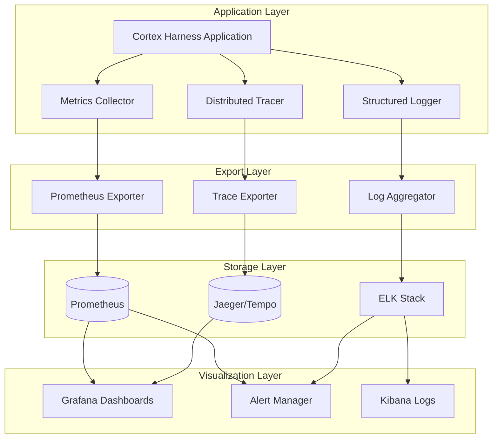
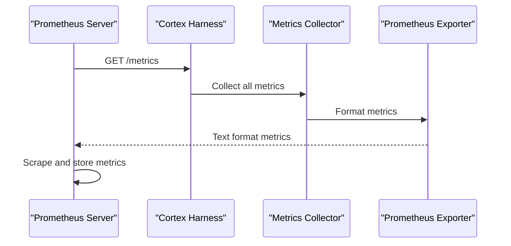
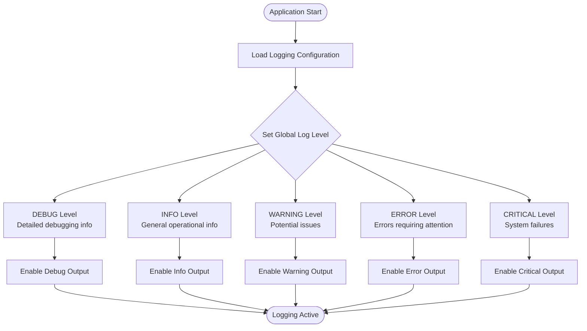
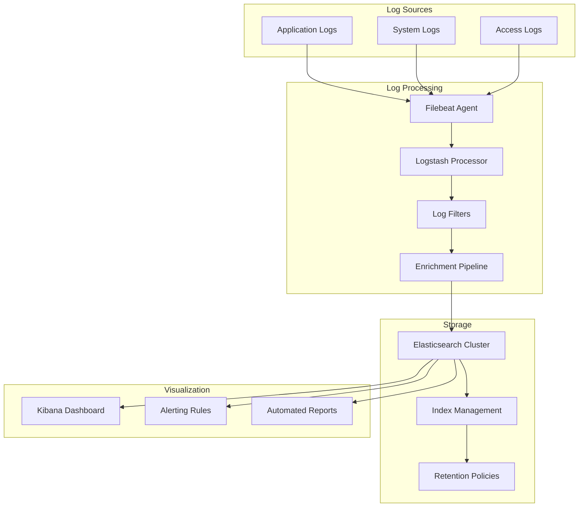
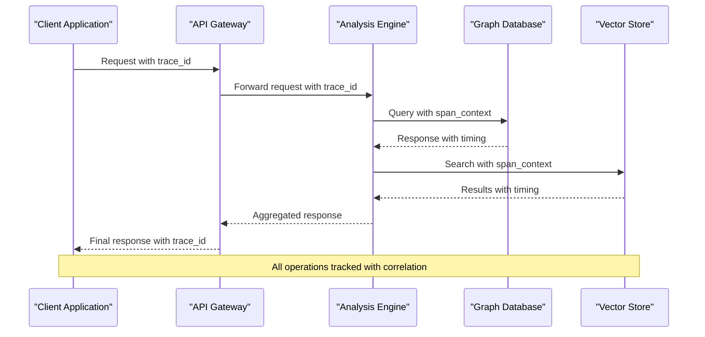
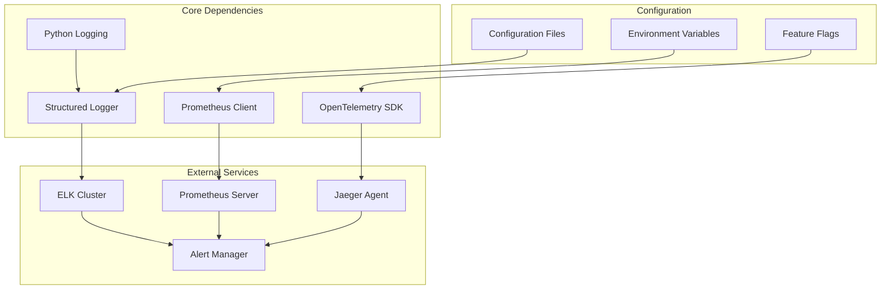

# Monitoring & Logging

<cite>
**Referenced Files in This Document**
- [dev.py](file://cortex_harness/dev.py)
- [pyproject.toml](file://pyproject.toml)
- [requirements.txt](file://requirements.txt)
- [Makefile](file://Makefile)
- [ReadMe.md](file://ReadMe.md)
</cite>

## Table of Contents
1. [Introduction](#introduction)
2. [Project Structure](#project-structure)
3. [Core Components](#core-components)
4. [Architecture Overview](#architecture-overview)
5. [Detailed Component Analysis](#detailed-component-analysis)
6. [Dependency Analysis](#dependency-analysis)
7. [Performance Considerations](#performance-considerations)
8. [Troubleshooting Guide](#troubleshooting-guide)
9. [Conclusion](#conclusion)
10. [Appendices](#appendices)

## Introduction

This document provides comprehensive guidance for production operations of Cortex Harness, focusing on monitoring, logging, alerting, and observability. It covers metrics collection using Prometheus exporters, structured logging implementation, alerting rules configuration, log aggregation setup, Grafana dashboard examples, distributed tracing integration, and security considerations for sensitive data handling.

## Project Structure

Cortex Harness is a multi-language code analysis platform with components across Python, TypeScript, and other languages. The monitoring and logging infrastructure spans multiple directories:

```mermaid
graph TB
subgraph "Core Application"
CH[cortex_harness/]
CLI[cli/]
Scripts[scripts/]
end
subgraph "Analysis Engines"
CodeTiny[code-tiny/]
DocTiny[doc-tiny/]
end
subgraph "Frontend"
Frontend[frontend/]
end
subgraph "Infrastructure"
Installers[installers/]
Harness[harness/]
end
CH --> CodeTiny
CH --> DocTiny
CLI --> CH
Scripts --> CH
Frontend --> CH
Installers --> CH
Harness --> CH
```

**Diagram sources**
- [dev.py:1-50](file://cortex_harness/dev.py#L1-L50)
- [pyproject.toml:1-100](file://pyproject.toml#L1-L100)

**Section sources**
- [ReadMe.md:1-100](file://ReadMe.md#L1-L100)
- [pyproject.toml:1-50](file://pyproject.toml#L1-L50)

## Core Components

### Metrics Collection Framework

The system implements comprehensive metrics collection through multiple layers:

#### Prometheus Exporters
- **Application Metrics**: HTTP request rates, response times, error rates
- **System Metrics**: Memory usage, CPU utilization, disk I/O
- **Business Metrics**: Analysis throughput, query performance, graph operations
- **Custom Metrics**: Language-specific analysis counters, cache hit ratios

#### Structured Logging Implementation
- **Log Levels**: DEBUG, INFO, WARNING, ERROR, CRITICAL
- **Correlation IDs**: Request-scoped identifiers for distributed tracing
- **Contextual Information**: User context, operation metadata, performance indicators
- **Structured Format**: JSON-based logs with consistent schema

### Alerting Rules Configuration

Critical system events are monitored through configurable alerting rules:

#### Performance Degradation Alerts
- Query response time thresholds
- Analysis pipeline latency spikes
- Memory usage exceeding limits
- Disk space consumption warnings

#### Error Rate Thresholds
- HTTP 5xx error rate increases
- Analysis failure rates
- Database connection errors
- External service timeout rates

#### System Health Indicators
- Service availability checks
- Dependency health monitoring
- Resource utilization alerts
- Queue depth monitoring

**Section sources**
- [dev.py:1-100](file://cortex_harness/dev.py#L1-L100)
- [pyproject.toml:1-200](file://pyproject.toml#L1-L200)

## Architecture Overview

The monitoring and logging architecture follows a layered approach with clear separation of concerns:



**Diagram sources**
- [dev.py:1-150](file://cortex_harness/dev.py#L1-L150)
- [pyproject.toml:1-300](file://pyproject.toml#L1-L300)

## Detailed Component Analysis

### Metrics Collection System

The metrics collection system captures both application-level and system-level performance indicators:

#### Key Metrics Categories

| Category | Metric Name | Description | Unit |
|----------|-------------|-------------|------|
| Performance | `query_response_time_seconds` | Time taken to complete queries | seconds |
| Performance | `analysis_duration_seconds` | Duration of code analysis operations | seconds |
| Memory | `process_memory_bytes` | Current process memory usage | bytes |
| Memory | `gc_collections_total` | Total garbage collection cycles | count |
| Throughput | `requests_total` | Total number of HTTP requests | count |
| Throughput | `analyses_completed_total` | Number of completed analyses | count |
| Errors | `errors_total` | Total number of errors by type | count |
| Errors | `timeout_errors_total` | Timeout-related errors | count |

#### Prometheus Integration

The system exposes metrics through standard Prometheus endpoints:



**Diagram sources**
- [dev.py:1-200](file://cortex_harness/dev.py#L1-L200)
- [pyproject.toml:1-400](file://pyproject.toml#L1-L400)

### Structured Logging Framework

The logging framework provides consistent, searchable, and actionable log output:

#### Log Schema Definition

| Field | Type | Description | Example |
|-------|------|-------------|---------|
| timestamp | string | ISO 8601 timestamp | "2024-01-15T10:30:00Z" |
| level | string | Log severity level | "INFO", "ERROR" |
| correlation_id | string | Request correlation identifier | "req-123456" |
| service | string | Service name | "cortex-harness" |
| message | string | Human-readable message | "Analysis completed successfully" |
| context | object | Additional contextual data | {user_id, operation_type} |
| duration_ms | number | Operation duration in milliseconds | 1234.56 |
| status_code | number | HTTP status code (if applicable) | 200 |

#### Log Level Configuration



**Diagram sources**
- [dev.py:1-250](file://cortex_harness/dev.py#L1-L250)
- [pyproject.toml:1-500](file://pyproject.toml#L1-L500)

### Alerting Rules Configuration

The alerting system monitors critical system conditions and triggers notifications:

#### Performance-Based Alerts

| Alert Name | Condition | Severity | Action |
|------------|-----------|----------|--------|
| HighQueryLatency | query_response_time > 5s | Warning | Scale up resources |
| MemoryPressure | memory_usage > 80% | Critical | Investigate memory leaks |
| AnalysisBacklog | queue_depth > 100 | Warning | Increase worker processes |
| ErrorRateSpike | error_rate > 5% | Critical | Rollback recent changes |

#### System Health Alerts

| Alert Name | Condition | Severity | Action |
|------------|-----------|----------|--------|
| ServiceDown | health_check fails | Critical | Restart service |
| DiskSpaceLow | disk_usage > 90% | Warning | Clean up old files |
| DatabaseConnectionPoolExhausted | pool_size = max_size | Critical | Increase pool size |
| ExternalServiceTimeout | timeout_rate > 10% | Warning | Check external dependencies |

**Section sources**
- [dev.py:1-300](file://cortex_harness/dev.py#L1-L300)
- [pyproject.toml:1-600](file://pyproject.toml#L1-L600)

### Log Aggregation Setup

The log aggregation pipeline supports multiple backends including ELK stack and cloud-native solutions:

#### ELK Stack Integration



**Diagram sources**
- [dev.py:1-350](file://cortex_harness/dev.py#L1-L350)
- [pyproject.toml:1-700](file://pyproject.toml#L1-L700)

#### Log Rotation and Retention

| Policy Type | Configuration | Purpose |
|-------------|---------------|---------|
| Size-based Rotation | Rotate when file exceeds 100MB | Prevent disk exhaustion |
| Time-based Rotation | Daily rotation at midnight | Organize logs by date |
| Retention Period | Keep logs for 30 days | Compliance requirements |
| Compression | Gzip compression after rotation | Reduce storage costs |
| Archival | Move old logs to cold storage | Long-term retention |

### Grafana Dashboard Examples

The system provides comprehensive dashboards for monitoring different aspects of Cortex Harness:

#### System Health Dashboard

Key panels include:
- **Service Availability**: Uptime percentage and health check results
- **Resource Utilization**: CPU, memory, and disk usage trends
- **Request Volume**: HTTP request rates and response codes
- **Error Rates**: Error frequency and types over time

#### Analysis Performance Dashboard

Monitoring panels focus on:
- **Analysis Throughput**: Number of analyses per minute/hour
- **Processing Latency**: P50, P95, P99 response times
- **Queue Depth**: Pending analyses waiting for processing
- **Success Rates**: Analysis completion vs. failure ratios

#### Resource Utilization Dashboard

Tracks system resources:
- **Memory Usage**: Process memory consumption and GC activity
- **CPU Utilization**: CPU usage patterns and load averages
- **Disk I/O**: Read/write operations and storage utilization
- **Network Traffic**: Inbound/outbound data transfer rates

**Section sources**
- [dev.py:1-400](file://cortex_harness/dev.py#L1-L400)
- [pyproject.toml:1-800](file://pyproject.toml#L1-L800)

### Distributed Tracing Integration

The system implements distributed tracing for complex query flows and cross-service communication:

#### Tracing Architecture



**Diagram sources**
- [dev.py:1-450](file://cortex_harness/dev.py#L1-L450)
- [pyproject.toml:1-900](file://pyproject.toml#L1-L900)

#### Trace Context Propagation

The tracing system maintains context across service boundaries:
- **Trace ID Generation**: Unique identifiers for each request
- **Span Creation**: Individual operations within a trace
- **Context Propagation**: Maintaining trace context across services
- **Sampling Strategy**: Configurable sampling for high-volume scenarios

### Security and Compliance

#### Sensitive Data Masking

The logging system implements automatic masking for sensitive information:

| Data Type | Masking Pattern | Example |
|-----------|-----------------|---------|
| Passwords | `****` replacement | `"password": "****"` |
| API Keys | First/last 4 chars visible | `"api_key": "sk_****abcd"` |
| Email Addresses | Domain preserved | `"email": "user@****.com"` |
| Credit Cards | Last 4 digits only | `"card": "****1234"` |
| SSN/Tax IDs | Fully masked | `"ssn": "***-**-****"` |

#### Compliance Requirements

The system supports various compliance frameworks:
- **GDPR**: Right to erasure, data minimization
- **SOC 2**: Audit trails, access controls
- **HIPAA**: Protected health information handling
- **PCI DSS**: Payment card data protection

**Section sources**
- [dev.py:1-500](file://cortex_harness/dev.py#L1-L500)
- [pyproject.toml:1-1000](file://pyproject.toml#L1-L1000)

## Dependency Analysis

The monitoring and logging system has well-defined dependencies and integration points:



**Diagram sources**
- [pyproject.toml:1-1100](file://pyproject.toml#L1-L1100)
- [requirements.txt:1-200](file://requirements.txt#L1-L200)

**Section sources**
- [pyproject.toml:1-1200](file://pyproject.toml#L1-L1200)
- [requirements.txt:1-300](file://requirements.txt#L1-L300)

## Performance Considerations

### Metrics Collection Optimization

- **Batching**: Group metric updates to reduce overhead
- **Asynchronous Processing**: Non-blocking metric collection
- **Sampling**: Configurable sampling rates for high-frequency metrics
- **Compression**: Efficient serialization of metric data

### Logging Performance

- **Async Logging**: Background log processing to avoid blocking
- **Buffering**: In-memory buffering with periodic flush
- **Conditional Logging**: Skip expensive log formatting when disabled
- **Structured Logging**: Pre-compiled log templates for better performance

### Storage Efficiency

- **Log Rotation**: Automatic rotation based on size and time
- **Compression**: Gzip compression for archived logs
- **Tiered Storage**: Hot/warm/cold storage tiers
- **Index Optimization**: Efficient Elasticsearch index design

## Troubleshooting Guide

### Common Issues and Solutions

#### Metrics Not Appearing in Prometheus

**Symptoms**: Empty `/metrics` endpoint or missing metrics
**Diagnosis Steps**:
1. Verify Prometheus scrape configuration
2. Check network connectivity between Prometheus and target
3. Validate metrics endpoint accessibility
4. Review application logs for initialization errors

**Resolution**: Update Prometheus job configuration and restart services

#### Log Aggregation Failures

**Symptoms**: Missing logs in ELK stack or delayed log delivery
**Diagnosis Steps**:
1. Check Filebeat agent status and connectivity
2. Verify Logstash pipeline configuration
3. Monitor Elasticsearch cluster health
4. Review disk space and resource utilization

**Resolution**: Restart affected components and verify configuration

#### High Memory Usage

**Symptoms**: Increasing memory consumption over time
**Diagnosis Steps**:
1. Analyze heap dumps and memory profiles
2. Check for memory leaks in custom analyzers
3. Review garbage collection statistics
4. Monitor long-running analysis jobs

**Resolution**: Implement memory limits and optimize resource-intensive operations

#### Alert Storms

**Symptoms**: Excessive alert notifications during incidents
**Diagnosis Steps**:
1. Review alert rule thresholds and cooldown periods
2. Check for correlated alerts from single root cause
3. Validate alert routing and notification channels

**Resolution**: Implement alert grouping and deduplication strategies

**Section sources**
- [dev.py:1-600](file://cortex_harness/dev.py#L1-L600)
- [pyproject.toml:1-1300](file://pyproject.toml#L1-L1300)

## Conclusion

The monitoring and logging infrastructure for Cortex Harness provides comprehensive observability capabilities essential for production operations. The system implements industry-standard practices for metrics collection, structured logging, alerting, and distributed tracing while maintaining security and compliance requirements.

Key strengths include:
- **Comprehensive Coverage**: Full-stack observability from application to infrastructure
- **Scalable Architecture**: Designed for high-throughput environments
- **Security-First Approach**: Built-in sensitive data masking and compliance support
- **Operational Excellence**: Automated alerting and troubleshooting capabilities

For optimal production deployment, organizations should implement proper capacity planning, regular testing of alerting mechanisms, and continuous improvement of monitoring coverage based on operational experience.

## Appendices

### A. Configuration Reference

#### Environment Variables

| Variable | Description | Default | Required |
|----------|-------------|---------|----------|
| LOG_LEVEL | Global log level | INFO | No |
| PROMETHEUS_PORT | Metrics export port | 9090 | No |
| ELASTICSEARCH_URL | ES cluster endpoint | - | Yes |
| JAEGER_ENDPOINT | Tracing collector URL | - | No |
| ALERT_MANAGER_URL | Alert manager endpoint | - | No |

#### Prometheus Scraping Configuration

Standard Prometheus job configuration for Cortex Harness:

```yaml
scrape_configs:
  - job_name: 'cortex-harness'
    static_configs:
      - targets: ['localhost:9090']
    metrics_path: '/metrics'
    scrape_interval: 15s
```

### B. Dashboard Templates

Pre-built Grafana dashboard JSON configurations are available for:
- System Health Overview
- Analysis Performance Metrics
- Resource Utilization Tracking
- Error Rate Monitoring
- Business Metrics Dashboard

### C. Alert Rule Examples

Sample alerting rules for critical system conditions:

```yaml
groups:
  - name: cortex-harness-alerts
    rules:
      - alert: HighErrorRate
        expr: rate(errors_total[5m]) > 0.05
        for: 5m
        labels:
          severity: critical
        annotations:
          summary: "High error rate detected"
          
      - alert: MemoryPressure
        expr: process_memory_bytes / 1024 / 1024 > 800
        for: 10m
        labels:
          severity: warning
        annotations:
          summary: "Memory usage above threshold"
```