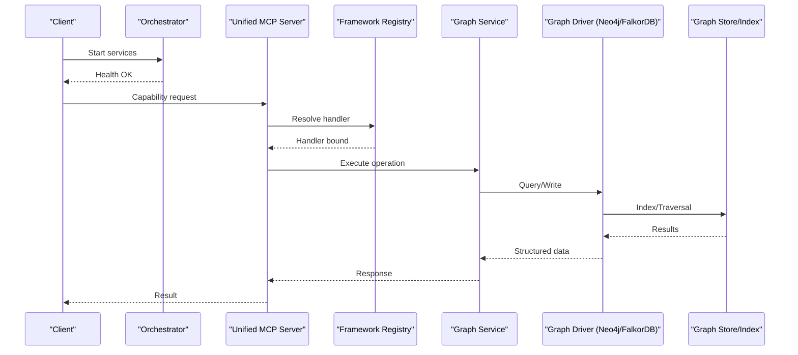
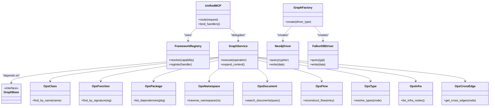

# Scaling & Performance Optimization

<cite>
**Referenced Files in This Document**
- [ReadMe.md](file://ReadMe.md)
- [Makefile](file://Makefile)
- [dev.sh](file://dev.sh)
- [dev.ps1](file://dev.ps1)
- [dev.bat](file://dev.bat)
- [cortex_harness/dev.py](file://cortex_harness/dev.py)
- [harness/scripts/orchestrator.py](file://harness/scripts/orchestrator.py)
- [harness/scripts/init.sh](file://harness/scripts/init.sh)
- [harness/scripts/verify.sh](file://harness/scripts/verify.sh)
- [code-tiny/mcp/unified_mcp.py](file://code-tiny/mcp/unified_mcp.py)
- [code-tiny/mcp/fastmcp_server.py](file://code-tiny/mcp/fastmcp_server.py)
- [code-tiny/mcp/framework_registry.py](file://code-tiny/mcp/framework_registry.py)
- [code-tiny/mcp/services/graph_service.py](file://code-tiny/mcp/services/graph_service.py)
- [code-tiny/mcp/services/explore_service.py](file://code-tiny/mcp/services/explore_service.py)
- [code-tiny/mcp/services/workflow_service.py](file://code-tiny/mcp/services/workflow_service.py)
- [code-tiny/mcp/services/impact_service.py](file://code-tiny/mcp/services/impact_service.py)
- [code-tiny/mcp/services/symbol_service.py](file://code-tiny/mcp/services/symbol_service.py)
- [code-tiny/mcp/services/flow_reconstructor.py](file://code-tiny/mcp/services/flow_reconstructor.py)
- [code-tiny/mcp/semantic_graph_expansion.py](file://code-tiny/mcp/semantic_graph_expansion.py)
- [code-tiny/tools/common/analyzer_cache.py](file://code-tiny/tools/common/analyzer_cache.py)
- [code-tiny/tools/common/call_graph_builder.py](file://code-tiny/tools/common/call_graph_builder.py)
- [code-tino/tools/common/graph_expander.py](file://code-tiny/tools/common/graph_expander.py)
- [code-tiny/tools/common/incremental_sync_state.py](file://code-tiny/tools/common/incremental_sync_state.py)
- [code-tiny/tools/common/incremental_cleanup.py](file://code-tiny/tools/common/incremental_cleanup.py)
- [code-tiny/tools/common/source_inventory.py](file://code-tiny/tools/common/source_inventory.py)
- [code-tiny/tools/common/bm25_ranker.py](file://code-tiny/tools/common/bm25_ranker.py)
- [code-tiny/tools/common/retrieval_scorer.py](file://code-tiny/tools/common/retrieval_scorer.py)
- [code-tiny/tools/common/intelligent_retrieval.py](file://code-tiny/tools/common/intelligent_retrieval.py)
- [code-tiny/tools/common/query_intent_classifier.py](file://code-tiny/tools/common/query_intent_classifier.py)
- [code-tiny/tools/common/query_understanding.py](file://code-tiny/tools/common/query_understanding.py)
- [code-tiny/tools/common/result_packager.py](file://code-tiny/tools/common/result_packager.py)
- [code-tiny/tools/common/confidence_scorer.py](file://code-tiny/tools/common/confidence_scorer.py)
- [code-tiny/tools/common/message_scan.py](file://code-tiny/tools/common/message_scan.py)
- [code-tiny/tools/common/api_match_engine.py](file://code-tiny/tools/common/api_match_engine.py)
- [code-tiny/tools/common/url_normalizer.py](file://code-tiny/tools/common/url_normalizer.py)
- [code-tiny/tools/common/signal_normalizer.py](file://code-tiny/tools/common/signal_normalizer.py)
- [code-tiny/tools/common/workflow_classifier.py](file://code-tiny/tools/common/workflow_classifier.py)
- [code-tiny/tools/common/workflow_impact_scorer.py](file://code-tiny/tools/common/workflow_impact_scorer.py)
- [code-tiny/tools/common/react_role_classifier.py](file://code-tiny/tools/common/react_role_classifier.py)
- [code-tiny/tools/common/harness_config.py](file://code-tiny/tools/common/harness_config.py)
- [code-tiny/tools/graph/driver/neo4j_driver.py](file://code-tiny/tools/graph/driver/neo4j_driver.py)
- [code-tiny/tools/graph/driver/falkordb_driver.py](file://code-tiny/tools/graph/driver/falkordb_driver.py)
- [code-tiny/tools/graph/core/base.py](file://code-tiny/tools/graph/core/base.py)
- [code-tiny/tools/graph/core/factory.py](file://code-tiny/tools/graph/core/factory.py)
- [code-tiny/tools/graph/core/provider_runtime.py](file://code-tiny/tools/graph/core/provider_runtime.py)
- [code-tiny/tools/graph/core/require_neo4j.py](file://code-tiny/tools/graph/core/require_neo4j.py)
- [code-tiny/tools/graph/operations/class_ops.py](file://code-tiny/tools/graph/operations/class_ops.py)
- [code-tiny/tools/graph/operations/function_ops.py](file://code-tiny/tools/graph/operations/function_ops.py)
- [code-tiny/tools/graph/operations/package_ops.py](file://code-tiny/tools/graph/operations/package_ops.py)
- [code-tiny/tools/graph/operations/namespace_ops.py](file://code-tiny/tools/graph/operations/namespace_ops.py)
- [code-tiny/tools/graph/operations/document_ops.py](file://code-tiny/tools/graph/operations/document_ops.py)
- [code-tiny/tools/graph/operations/flow_ops.py](file://code-tiny/tools/graph/operations/flow_ops.py)
- [code-tiny/tools/graph/operations/type_ops.py](file://code-tiny/tools/graph/operations/type_ops.py)
- [code-tiny/tools/graph/operations/infra_ops.py](file://code-tiny/tools/graph/operations/infra_ops.py)
- [code-tiny/tools/graph/operations/cross_edge_ops.py](file://code-tiny/tools/graph/operations/cross_edge_ops.py)
- [doc-tiny/6_setup_indexes.py](file://doc-tiny/6_setup_indexes.py)
- [doc-tiny/graph_store.py](file://doc-tiny/graph_store.py)
- [doc-tiny/neo4j_loader.py](file://doc-tiny/neo4j_loader.py)
- [scripts/mcp-lifecycle.py](file://scripts/mcp-lifecycle.py)
- [scripts/mcp-lifecycle.ps1](file://scripts/mcp-lifecycle.ps1)
- [scripts/mcp_runtime_config.py](file://scripts/mcp_runtime_config.py)
- [tests/test_cobol_performance.py](file://tests/test_cobol_performance.py)
- [tests/test_falkordb_driver.py](file://tests/test_falkordb_driver.py)
- [tests/test_incremental_sync_lock.py](file://tests/test_incremental_sync_lock.py)
- [tests/test_primary_vector_sync.py](file://tests/test_primary_vector_sync.py)
- [tests/test_semantic_graph_expansion.py](file://tests/test_semantic_graph_expansion.py)
- [tests/test_validate_retrieval.py](file://tests/test_validate_retrieval.py)
</cite>

## Table of Contents
1. Introduction
2. Project Structure
3. Core Components
4. Architecture Overview
5. Detailed Component Analysis
6. Dependency Analysis
7. Performance Considerations
8. Troubleshooting Guide
9. Conclusion
10. Appendices

## Introduction
This document provides comprehensive scaling and performance optimization guidance for high-volume Cortex Harness deployments. It covers horizontal scaling strategies for analyzer workers, MCP servers, and query processors; vertical scaling considerations for memory-intensive analysis and large codebases; caching strategies for graph queries and analysis results; database connection pooling, query optimization, and index tuning for graph stores; capacity planning based on codebase size, analysis frequency, and concurrent user loads; profiling techniques and bottleneck identification; resource allocation, auto-scaling policies, and cost optimization for cloud environments; and load testing procedures with benchmarking methodologies.

## Project Structure
Cortex Harness is a multi-component system:
- Orchestrator and lifecycle scripts manage services and processes.
- MCP layer exposes capabilities via a unified server and framework-specific wrappers.
- Analyzers and tools perform parsing, semantic analysis, and graph construction.
- Graph drivers abstract Neo4j and FalkorDB backends.
- Caching and retrieval utilities optimize repeated workloads.
- Tests include performance and integration scenarios.

```mermaid
graph TB
subgraph "Orchestration"
ORCH["orchestrator.py"]
LIFECYCLE["mcp-lifecycle.py"]
INIT["init.sh"]
VERIFY["verify.sh"]
end
subgraph "MCP Layer"
UNIFIED["unified_mcp.py"]
FASTMCP["fastmcp_server.py"]
REGISTRY["framework_registry.py"]
GRAPH_SVC["services/graph_service.py"]
EXPLORE_SVC["services/explore_service.py"]
WORKFLOW_SVC["services/workflow_service.py"]
IMPACT_SVC["services/impact_service.py"]
SYMBOL_SVC["services/symbol_service.py"]
FLOW_RC["services/flow_reconstructor.py"]
SEM_EXP["semantic_graph_expansion.py"]
end
subgraph "Analysis & Tools"
ANALYZER_CACHE["tools/common/analyzer_cache.py"]
CALL_GRAPH["tools/common/call_graph_builder.py"]
GRAPH_EXPAND["tools/common/graph_expander.py"]
SRC_INV["tools/common/source_inventory.py"]
BM25["tools/common/bm25_ranker.py"]
RETRIEVAL["tools/common/intelligent_retrieval.py"]
INTENT["tools/common/query_intent_classifier.py"]
UNDERSTANDING["tools/common/query_understanding.py"]
RESULT_PKG["tools/common/result_packager.py"]
CONFIDENCE["tools/common/confidence_scorer.py"]
MSG_SCAN["tools/common/message_scan.py"]
API_MATCH["tools/common/api_match_engine.py"]
URL_NORM["tools/common/url_normalizer.py"]
SIGNAL_NORM["tools/common/signal_normalizer.py"]
WF_CLASS["tools/common/workflow_classifier.py"]
WF_IMPACT["tools/common/workflow_impact_scorer.py"]
REACT_ROLE["tools/common/react_role_classifier.py"]
HCFG["tools/common/harness_config.py"]
end
subgraph "Graph Drivers"
BASE["graph/core/base.py"]
FACTORY["graph/core/factory.py"]
RUNTIME["graph/core/provider_runtime.py"]
NEO4J["graph/driver/neo4j_driver.py"]
FALKOR["graph/driver/falkordb_driver.py"]
OPS_CLASSES["graph/operations/class_ops.py"]
OPS_FUNCS["graph/operations/function_ops.py"]
OPS_PACKAGES["graph/operations/package_ops.py"]
OPS_NAMESPACES["graph/operations/namespace_ops.py"]
OPS_DOCS["graph/operations/document_ops.py"]
OPS_FLOW["graph/operations/flow_ops.py"]
OPS_TYPES["graph/operations/type_ops.py"]
OPS_INFRA["graph/operations/infra_ops.py"]
OPS_CROSS["graph/operations/cross_edge_ops.py"]
end
subgraph "Doc-Tiny Integration"
IDX_SETUP["6_setup_indexes.py"]
GSTORE["graph_store.py"]
NLOAD["neo4j_loader.py"]
end
ORCH --> LIFECYCLE
ORCH --> INIT
ORCH --> VERIFY
UNIFIED --> FASTMCP
UNIFIED --> REGISTRY
UNIFIED --> GRAPH_SVC
GRAPH_SVC --> BASE
GRAPH_SVC --> FACTORY
FACTORY --> NEO4J
FACTORY --> FALKOR
GRAPH_SVC --> OPS_CLASSES
GRAPH_SVC --> OPS_FUNCS
GRAPH_SVC --> OPS_PACKAGES
GRAPH_SVC --> OPS_NAMESPACES
GRAPH_SVC --> OPS_DOCS
GRAPH_SVC --> OPS_FLOW
GRAPH_SVC --> OPS_TYPES
GRAPH_SVC --> OPS_INFRA
GRAPH_SVC --> OPS_CROSS
UNIFIED --> SEM_EXP
UNIFIED --> ANALYZER_CACHE
UNIFIED --> CALL_GRAPH
UNIFIED --> GRAPH_EXPAND
UNIFIED --> SRC_INV
UNIFIED --> BM25
UNIFIED --> RETRIEVAL
UNIFIED --> INTENT
UNIFIED --> UNDERSTANDING
UNIFIED --> RESULT_PKG
UNIFIED --> CONFIDENCE
UNIFIED --> MSG_SCAN
UNIFIED --> API_MATCH
UNIFIED --> URL_NORM
UNIFIED --> SIGNAL_NORM
UNIFIED --> WF_CLASS
UNIFIED --> WF_IMPACT
UNIFIED --> REACT_ROLE
UNIFIED --> HCFG
IDX_SETUP --> GSTORE
NLOAD --> GSTORE
```

**Diagram sources**
- [harness/scripts/orchestrator.py](file://harness/scripts/orchestrator.py)
- [scripts/mcp-lifecycle.py](file://scripts/mcp-lifecycle.py)
- [harness/scripts/init.sh](file://harness/scripts/init.sh)
- [harness/scripts/verify.sh](file://harness/scripts/verify.sh)
- [code-tiny/mcp/unified_mcp.py](file://code-tiny/mcp/unified_mcp.py)
- [code-tiny/mcp/fastmcp_server.py](file://code-tiny/mcp/fastmcp_server.py)
- [code-tiny/mcp/framework_registry.py](file://code-tiny/mcp/framework_registry.py)
- [code-tiny/mcp/services/graph_service.py](file://code-tiny/mcp/services/graph_service.py)
- [code-tiny/tools/graph/core/base.py](file://code-tiny/tools/graph/core/base.py)
- [code-tiny/tools/graph/core/factory.py](file://code-tiny/tools/graph/core/factory.py)
- [code-tiny/tools/graph/driver/neo4j_driver.py](file://code-tiny/tools/graph/driver/neo4j_driver.py)
- [code-tiny/tools/graph/driver/falkordb_driver.py](file://code-tiny/tools/graph/driver/falkordb_driver.py)
- [code-tiny/tools/graph/operations/class_ops.py](file://code-tiny/tools/graph/operations/class_ops.py)
- [code-tiny/tools/graph/operations/function_ops.py](file://code-tiny/tools/graph/operations/function_ops.py)
- [code-tiny/tools/graph/operations/package_ops.py](file://code-tiny/tools/graph/operations/package_ops.py)
- [code-tiny/tools/graph/operations/namespace_ops.py](file://code-tiny/tools/graph/operations/namespace_ops.py)
- [code-tiny/tools/graph/operations/document_ops.py](file://code-tiny/tools/graph/operations/document_ops.py)
- [code-tiny/tools/graph/operations/flow_ops.py](file://code-tiny/tools/graph/operations/flow_ops.py)
- [code-tiny/tools/graph/operations/type_ops.py](file://code-tiny/tools/graph/operations/type_ops.py)
- [code-tiny/tools/graph/operations/infra_ops.py](file://code-tiny/tools/graph/operations/infra_ops.py)
- [code-tiny/tools/graph/operations/cross_edge_ops.py](file://code-tiny/tools/graph/operations/cross_edge_ops.py)
- [doc-tiny/6_setup_indexes.py](file://doc-tiny/6_setup_indexes.py)
- [doc-tiny/graph_store.py](file://doc-tiny/graph_store.py)
- [doc-tiny/neo4j_loader.py](file://doc-tiny/neo4j_loader.py)

**Section sources**
- [ReadMe.md](file://ReadMe.md)
- [Makefile](file://Makefile)
- [dev.sh](file://dev.sh)
- [dev.ps1](file://dev.ps1)
- [dev.bat](file://dev.bat)
- [cortex_harness/dev.py](file://cortex_harness/dev.py)

## Core Components
- Orchestrator and lifecycle management:
  - Orchestrator coordinates service startup, health checks, and process supervision.
  - Lifecycle scripts manage MCP server instances and runtime configuration.
- MCP layer:
  - Unified entrypoint routes requests to capability handlers and framework registries.
  - Services encapsulate domain logic (graph exploration, workflows, impact analysis, symbols).
- Graph abstraction:
  - Base interface and factory select driver implementations (Neo4j or FalkorDB).
  - Operations modules implement typed graph operations across classes, functions, packages, namespaces, documents, flows, types, infra, and cross edges.
- Analysis and retrieval:
  - Analyzer cache reduces redundant work.
  - Call graph builder and graph expander construct and expand graphs efficiently.
  - Retrieval pipeline includes intent classification, understanding, ranking, scoring, and result packaging.
- Indexing and store:
  - Index setup script configures graph indexes.
  - Graph store and loader provide persistence helpers.

**Section sources**
- [harness/scripts/orchestrator.py](file://harness/scripts/orchestrator.py)
- [scripts/mcp-lifecycle.py](file://scripts/mcp-lifecycle.py)
- [code-tiny/mcp/unified_mcp.py](file://code-tiny/mcp/unified_mcp.py)
- [code-tiny/mcp/services/graph_service.py](file://code-tiny/mcp/services/graph_service.py)
- [code-tiny/tools/graph/core/base.py](file://code-tiny/tools/graph/core/base.py)
- [code-tiny/tools/graph/core/factory.py](file://code-tiny/tools/graph/core/factory.py)
- [code-tiny/tools/graph/driver/neo4j_driver.py](file://code-tiny/tools/graph/driver/neo4j_driver.py)
- [code-tiny/tools/graph/driver/falkordb_driver.py](file://code-tiny/tools/graph/driver/falkordb_driver.py)
- [code-tiny/tools/common/analyzer_cache.py](file://code-tiny/tools/common/analyzer_cache.py)
- [code-tiny/tools/common/call_graph_builder.py](file://code-tiny/tools/common/call_graph_builder.py)
- [code-tiny/tools/common/graph_expander.py](file://code-tiny/tools/common/graph_expander.py)
- [code-tiny/tools/common/intelligent_retrieval.py](file://code-tiny/tools/common/intelligent_retrieval.py)
- [doc-tiny/6_setup_indexes.py](file://doc-tiny/6_setup_indexes.py)
- [doc-tiny/graph_store.py](file://doc-tiny/graph_store.py)

## Architecture Overview
The system follows a layered architecture:
- Orchestration layer manages process lifecycles and environment initialization.
- MCP layer provides a unified API surface with capability routing and framework-specific adapters.
- Analysis and graph layers build and traverse the code graph using pluggable drivers.
- Retrieval and caching layers optimize repeated queries and reduce backend pressure.

**Diagram sources**
- [harness/scripts/orchestrator.py](file://harness/scripts/orchestrator.py)
- [code-tiny/mcp/unified_mcp.py](file://code-tiny/mcp/unified_mcp.py)
- [code-tiny/mcp/framework_registry.py](file://code-tiny/mcp/framework_registry.py)
- [code-tiny/mcp/services/graph_service.py](file://code-tiny/mcp/services/graph_service.py)
- [code-tiny/tools/graph/driver/neo4j_driver.py](file://code-tiny/tools/graph/driver/neo4j_driver.py)
- [code-tiny/tools/graph/driver/falkordb_driver.py](file://code-tiny/tools/graph/driver/falkordb_driver.py)
- [doc-tiny/graph_store.py](file://doc-tiny/graph_store.py)

## Detailed Component Analysis

### MCP Server Horizontal Scaling
- Strategy:
  - Run multiple MCP server instances behind a reverse proxy or load balancer.
  - Use stateless design where possible; persist state in external stores (graph DB, caches).
  - Distribute work by capability or tenant scope using registry-based routing.
- Concurrency:
  - Increase worker processes per instance based on CPU cores and I/O characteristics.
  - Tune event loop and thread pools for blocking operations (e.g., heavy parsers).
- Observability:
  - Expose metrics endpoints and structured logs for autoscaling triggers.
- Example references:
  - Unified server entrypoint and registry binding.
  - Lifecycle scripts for managing multiple instances.

**Section sources**
- [code-tiny/mcp/unified_mcp.py](file://code-tiny/mcp/unified_mcp.py)
- [code-tiny/mcp/fastmcp_server.py](file://code-tiny/mcp/fastmcp_server.py)
- [code-tiny/mcp/framework_registry.py](file://code-tiny/mcp/framework_registry.py)
- [scripts/mcp-lifecycle.py](file://scripts/mcp-lifecycle.py)
- [scripts/mcp-lifecycle.ps1](file://scripts/mcp-lifecycle.ps1)

### Analyzer Workers Horizontal Scaling
- Strategy:
  - Partition repositories or files across worker pools.
  - Use source inventory and incremental sync state to avoid reprocessing unchanged content.
  - Employ analyzer cache to deduplicate identical analyses across workers.
- Coordination:
  - Centralized lock/state ensures consistent incremental updates.
  - Queue-based distribution can be added atop orchestrator for bursty workloads.
- Example references:
  - Source inventory and incremental sync state.
  - Analyzer cache and cleanup utilities.

**Section sources**
- [code-tiny/tools/common/source_inventory.py](file://code-tiny/tools/common/source_inventory.py)
- [code-tiny/tools/common/incremental_sync_state.py](file://code-tiny/tools/common/incremental_sync_state.py)
- [code-tiny/tools/common/analyzer_cache.py](file://code-tiny/tools/common/analyzer_cache.py)
- [code-tiny/tools/common/incremental_cleanup.py](file://code-tiny/tools/common/incremental_cleanup.py)
- [tests/test_incremental_sync_lock.py](file://tests/test_incremental_sync_lock.py)

### Query Processors and Retrieval Pipeline
- Strategy:
  - Cache frequent graph traversals and search results.
  - Use intent classification and query understanding to route to optimized paths.
  - Apply BM25 ranking and retrieval scorers to minimize expensive downstream processing.
- Example references:
  - Intelligent retrieval, intent classifier, query understanding, BM25 ranker, scorer, result packager.

**Section sources**
- [code-tiny/tools/common/intelligent_retrieval.py](file://code-tiny/tools/common/intelligent_retrieval.py)
- [code-tiny/tools/common/query_intent_classifier.py](file://code-tiny/tools/common/query_intent_classifier.py)
- [code-tiny/tools/common/query_understanding.py](file://code-tiny/tools/common/query_understanding.py)
- [code-tiny/tools/common/bm25_ranker.py](file://code-tiny/tools/common/bm25_ranker.py)
- [code-tiny/tools/common/retrieval_scorer.py](file://code-tiny/tools/common/retrieval_scorer.py)
- [code-tiny/tools/common/result_packager.py](file://code-tiny/tools/common/result_packager.py)

### Graph Abstraction and Driver Selection
- Strategy:
  - Use factory to select driver at runtime (Neo4j vs FalkorDB).
  - Normalize operations through base interface to keep upper layers driver-agnostic.
  - Provide provider runtime context for connection and transaction handling.
- Example references:
  - Base interface, factory, provider runtime, and driver implementations.

**Section sources**
- [code-tiny/tools/graph/core/base.py](file://code-tiny/tools/graph/core/base.py)
- [code-tiny/tools/graph/core/factory.py](file://code-tiny/tools/graph/core/factory.py)
- [code-tiny/tools/graph/core/provider_runtime.py](file://code-tiny/tools/graph/core/provider_runtime.py)
- [code-tiny/tools/graph/driver/neo4j_driver.py](file://code-tiny/tools/graph/driver/neo4j_driver.py)
- [code-tiny/tools/graph/driver/falkordb_driver.py](file://code-tiny/tools/graph/driver/falkordb_driver.py)

### Graph Operations and Traversal Patterns
- Strategy:
  - Encapsulate common traversals in typed operations (classes, functions, packages, namespaces, documents, flows, types, infra, cross edges).
  - Prefer targeted operations over ad-hoc queries to leverage indexes and reduce traversal depth.
- Example references:
  - Operation modules for each node/edge type.

**Section sources**
- [code-tiny/tools/graph/operations/class_ops.py](file://code-tiny/tools/graph/operations/class_ops.py)
- [code-tiny/tools/graph/operations/function_ops.py](file://code-tiny/tools/graph/operations/function_ops.py)
- [code-tiny/tools/graph/operations/package_ops.py](file://code-tiny/tools/graph/operations/package_ops.py)
- [code-tiny/tools/graph/operations/namespace_ops.py](file://code-tiny/tools/graph/operations/namespace_ops.py)
- [code-tiny/tools/graph/operations/document_ops.py](file://code-tiny/tools/graph/operations/document_ops.py)
- [code-tiny/tools/graph/operations/flow_ops.py](file://code-tiny/tools/graph/operations/flow_ops.py)
- [code-tiny/tools/graph/operations/type_ops.py](file://code-tiny/tools/graph/operations/type_ops.py)
- [code-tiny/tools/graph/operations/infra_ops.py](file://code-tiny/tools/graph/operations/infra_ops.py)
- [code-tiny/tools/graph/operations/cross_edge_ops.py](file://code-tiny/tools/graph/operations/cross_edge_ops.py)

### Indexing and Database Tuning
- Strategy:
  - Ensure primary keys and frequently filtered properties are indexed.
  - Create composite indexes for common query predicates.
  - Periodically rebuild indexes after bulk ingestion.
- Example references:
  - Index setup script and graph store/loader utilities.

**Section sources**
- [doc-tiny/6_setup_indexes.py](file://doc-tiny/6_setup_indexes.py)
- [doc-tiny/graph_store.py](file://doc-tiny/graph_store.py)
- [doc-tiny/neo4j_loader.py](file://doc-tiny/neo4j_loader.py)

### Semantic Graph Expansion and Flow Reconstruction
- Strategy:
  - Expand semantic relationships selectively to avoid explosion.
  - Reconstruct flows incrementally and cache intermediate results.
- Example references:
  - Semantic graph expansion and flow reconstructor.

**Section sources**
- [code-tiny/mcp/semantic_graph_expansion.py](file://code-tiny/mcp/semantic_graph_expansion.py)
- [code-tiny/mcp/services/flow_reconstructor.py](file://code-tiny/mcp/services/flow_reconstructor.py)

### Configuration and Runtime Settings
- Strategy:
  - Centralize harness configuration for concurrency limits, timeouts, and feature flags.
  - Use environment-driven settings for deployment-specific tuning.
- Example references:
  - Harness configuration module.

**Section sources**
- [code-tiny/tools/common/harness_config.py](file://code-tiny/tools/common/harness_config.py)

## Dependency Analysis
Key dependency chains:
- MCP unified server depends on registry and services.
- Graph service depends on base interface and factory, which selects driver implementations.
- Operations modules depend on driver interfaces for concrete traversals.
- Retrieval pipeline depends on analyzers, caches, and scorers.

**Diagram sources**
- [code-tiny/mcp/unified_mcp.py](file://code-tiny/mcp/unified_mcp.py)
- [code-tiny/mcp/framework_registry.py](file://code-tiny/mcp/framework_registry.py)
- [code-tiny/mcp/services/graph_service.py](file://code-tiny/mcp/services/graph_service.py)
- [code-tiny/tools/graph/core/base.py](file://code-tiny/tools/graph/core/base.py)
- [code-tiny/tools/graph/core/factory.py](file://code-tiny/tools/graph/core/factory.py)
- [code-tiny/tools/graph/driver/neo4j_driver.py](file://code-tiny/tools/graph/driver/neo4j_driver.py)
- [code-tiny/tools/graph/driver/falkordb_driver.py](file://code-tiny/tools/graph/driver/falkordb_driver.py)
- [code-tiny/tools/graph/operations/class_ops.py](file://code-tiny/tools/graph/operations/class_ops.py)
- [code-tiny/tools/graph/operations/function_ops.py](file://code-tiny/tools/graph/operations/function_ops.py)
- [code-tiny/tools/graph/operations/package_ops.py](file://code-tiny/tools/graph/operations/package_ops.py)
- [code-tiny/tools/graph/operations/namespace_ops.py](file://code-tiny/tools/graph/operations/namespace_ops.py)
- [code-tiny/tools/graph/operations/document_ops.py](file://code-tiny/tools/graph/operations/document_ops.py)
- [code-tiny/tools/graph/operations/flow_ops.py](file://code-tiny/tools/graph/operations/flow_ops.py)
- [code-tiny/tools/graph/operations/type_ops.py](file://code-tiny/tools/graph/operations/type_ops.py)
- [code-tiny/tools/graph/operations/infra_ops.py](file://code-tiny/tools/graph/operations/infra_ops.py)
- [code-tiny/tools/graph/operations/cross_edge_ops.py](file://code-tiny/tools/graph/operations/cross_edge_ops.py)

**Section sources**
- [code-tiny/mcp/unified_mcp.py](file://code-tiny/mcp/unified_mcp.py)
- [code-tiny/mcp/services/graph_service.py](file://code-tiny/mcp/services/graph_service.py)
- [code-tiny/tools/graph/core/base.py](file://code-tiny/tools/graph/core/base.py)
- [code-tiny/tools/graph/core/factory.py](file://code-tiny/tools/graph/core/factory.py)
- [code-tiny/tools/graph/driver/neo4j_driver.py](file://code-tiny/tools/graph/driver/neo4j_driver.py)
- [code-tiny/tools/graph/driver/falkordb_driver.py](file://code-tiny/tools/graph/driver/falkordb_driver.py)

## Performance Considerations

### Horizontal Scaling Strategies
- Analyzer workers:
  - Partition by repository or file set; use source inventory and incremental sync state to limit work.
  - Enable analyzer cache to deduplicate across workers.
- MCP servers:
  - Scale out instances; distribute by capability or tenant; ensure stateless design.
- Query processors:
  - Add read replicas for graph databases if supported; cache frequent queries.

### Vertical Scaling Considerations
- Memory-intensive analysis:
  - Increase heap size and GC tuning for JVM-based analyzers if applicable.
  - Stream large ASTs and avoid loading entire repos into memory.
- Large codebases:
  - Use incremental scans and targeted expansions to reduce peak memory.

### Caching Strategies
- Analyzer cache:
  - Key by normalized inputs (file hashes, timestamps, options).
  - Evict stale entries based on change detection.
- Graph query cache:
  - Cache results for stable traversals; invalidate on write or schema changes.
- Retrieval cache:
  - Cache BM25 scores and ranked lists for hot queries.

**Section sources**
- [code-tiny/tools/common/analyzer_cache.py](file://code-tiny/tools/common/analyzer_cache.py)
- [code-tiny/tools/common/intelligent_retrieval.py](file://code-tiny/tools/common/intelligent_retrieval.py)
- [code-tiny/tools/common/bm25_ranker.py](file://code-tiny/tools/common/bm25_ranker.py)

### Database Connection Pooling and Query Optimization
- Connection pooling:
  - Configure pool sizes per driver; tune min/max connections based on concurrency.
- Query optimization:
  - Prefer targeted operations over deep traversals.
  - Use pagination and limit result sets.
- Index tuning:
  - Ensure indexes on frequently filtered fields; create composite indexes for common predicates.
  - Rebuild indexes post-bulk ingestion.

**Section sources**
- [code-tiny/tools/graph/driver/neo4j_driver.py](file://code-tiny/tools/graph/driver/neo4j_driver.py)
- [code-tiny/tools/graph/driver/falkordb_driver.py](file://code-tiny/tools/graph/driver/falkordb_driver.py)
- [doc-tiny/6_setup_indexes.py](file://doc-tiny/6_setup_indexes.py)

### Capacity Planning Guidelines
- Inputs:
  - Codebase size (files, lines), analysis frequency (daily/weekly), concurrent users.
- Estimates:
  - Worker count proportional to total files divided by per-worker throughput.
  - MCP instances proportional to concurrent user sessions and latency targets.
  - Graph DB sizing based on node/edge counts and query mix.
- Monitoring:
  - Track queue lengths, CPU/memory utilization, and DB latency to adjust capacities.

### Profiling and Bottleneck Identification
- Techniques:
  - Profile Python call stacks and memory usage during analysis runs.
  - Measure DB query latencies and execution plans.
  - Instrument MCP request durations and error rates.
- Recommendations:
  - Identify hot paths in graph traversals and replace with targeted operations.
  - Reduce payload sizes and defer heavy computations until necessary.

**Section sources**
- [tests/test_cobol_performance.py](file://tests/test_cobol_performance.py)
- [tests/test_falkordb_driver.py](file://tests/test_falkordb_driver.py)

### Resource Allocation, Auto-Scaling, and Cost Optimization
- Resource allocation:
  - Set CPU/memory requests/limits per container; isolate heavy analyzers.
- Auto-scaling:
  - Scale MCP horizontally based on request rate and latency SLOs.
  - Scale analyzer workers based on queue depth and backlog duration.
- Cost optimization:
  - Use spot/preemptible instances for batch analysis.
  - Right-size graph DB instances; consider read replicas for reads.

### Load Testing and Benchmarking
- Procedures:
  - Simulate concurrent MCP requests with varied capabilities.
  - Generate synthetic codebases of increasing size to measure ingestion times.
  - Stress test graph queries under realistic distributions.
- Metrics:
  - P95/P99 latency, throughput, error rates, CPU/memory, DB QPS, cache hit ratios.
- Validation:
  - Compare against baselines; iterate on indexing and caching.

**Section sources**
- [tests/test_validate_retrieval.py](file://tests/test_validate_retrieval.py)
- [tests/test_primary_vector_sync.py](file://tests/test_primary_vector_sync.py)
- [tests/test_semantic_graph_expansion.py](file://tests/test_semantic_graph_expansion.py)

## Troubleshooting Guide
- Common issues:
  - High memory usage during analysis: enable streaming, increase cache eviction aggressiveness.
  - Slow graph queries: verify indexes, prefer targeted operations, add pagination.
  - MCP latency spikes: scale out instances, check registry resolution overhead.
- Diagnostics:
  - Inspect orchestrator logs for process health.
  - Review lifecycle scripts for misconfigured ports or environment variables.
  - Validate graph store connectivity and index status.

**Section sources**
- [harness/scripts/orchestrator.py](file://harness/scripts/orchestrator.py)
- [harness/scripts/init.sh](file://harness/scripts/init.sh)
- [harness/scripts/verify.sh](file://harness/scripts/verify.sh)
- [scripts/mcp-lifecycle.py](file://scripts/mcp-lifecycle.py)
- [doc-tiny/graph_store.py](file://doc-tiny/graph_store.py)

## Conclusion
High-volume Cortex Harness deployments benefit from clear horizontal scaling boundaries (analyzers, MCP servers, query processors), robust caching, and careful database tuning. By partitioning work, leveraging incremental synchronization, and optimizing graph operations with proper indexing, teams can achieve predictable latency and throughput. Continuous profiling, load testing, and right-sized resource allocation further stabilize performance while controlling costs.

## Appendices

### Quick Reference: Key Modules for Scaling
- Orchestration and lifecycle:
  - [orchestrator.py](file://harness/scripts/orchestrator.py)
  - [mcp-lifecycle.py](file://scripts/mcp-lifecycle.py)
- MCP layer:
  - [unified_mcp.py](file://code-tiny/mcp/unified_mcp.py)
  - [fastmcp_server.py](file://code-tiny/mcp/fastmcp_server.py)
  - [framework_registry.py](file://code-tiny/mcp/framework_registry.py)
- Graph abstraction and drivers:
  - [base.py](file://code-tiny/tools/graph/core/base.py)
  - [factory.py](file://code-tiny/tools/graph/core/factory.py)
  - [neo4j_driver.py](file://code-tiny/tools/graph/driver/neo4j_driver.py)
  - [falkordb_driver.py](file://code-tiny/tools/graph/driver/falkordb_driver.py)
- Retrieval and caching:
  - [analyzer_cache.py](file://code-tiny/tools/common/analyzer_cache.py)
  - [intelligent_retrieval.py](file://code-tiny/tools/common/intelligent_retrieval.py)
  - [bm25_ranker.py](file://code-tiny/tools/common/bm25_ranker.py)
- Indexing and store:
  - [6_setup_indexes.py](file://doc-tiny/6_setup_indexes.py)
  - [graph_store.py](file://doc-tiny/graph_store.py)