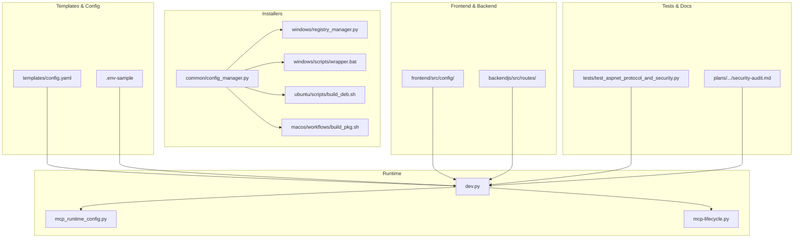
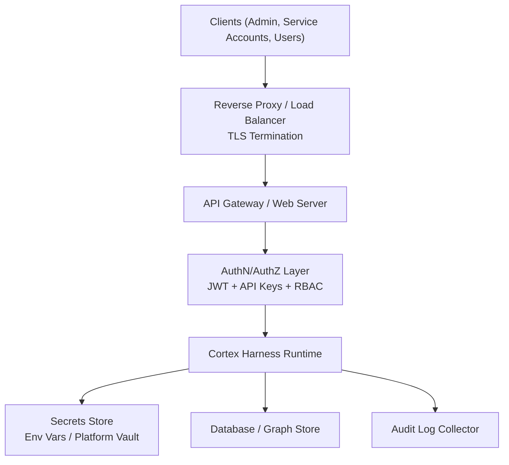
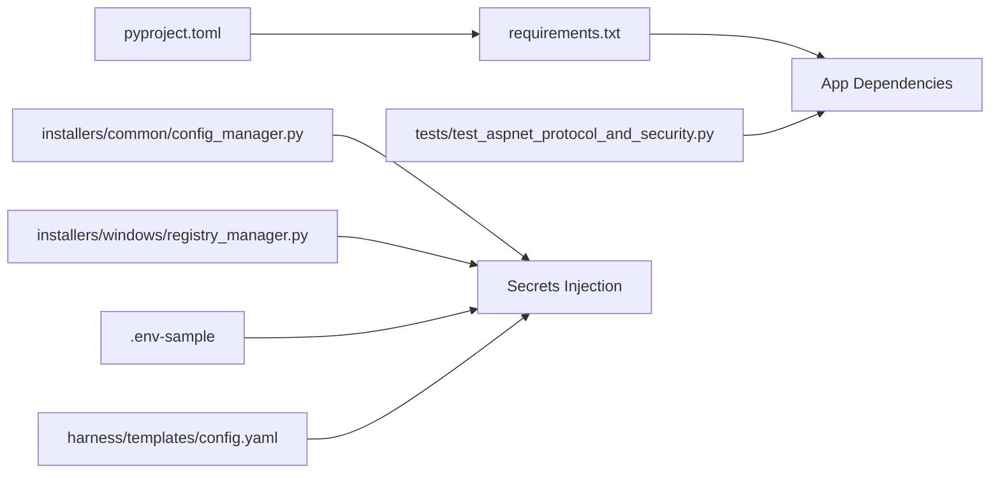

# Security Hardening & Access Control

<cite>
**Referenced Files in This Document**
- [ReadMe.md](file://ReadMe.md)
- [pyproject.toml](file://pyproject.toml)
- [requirements.txt](file://requirements.txt)
- [.env-sample](file://doc-tiny/.env-sample)
- [config.yaml](file://harness/templates/config.yaml)
- [cortex_harness/dev.py](file://cortex_harness/dev.py)
- [installers/README.md](file://installers/README.md)
- [installers/common/config_manager.py](file://installers/common/config_manager.py)
- [installers/windows/registry_manager.py](file://installers/windows/registry_manager.py)
- [installers/windows/scripts/wrapper.bat](file://installers/windows/scripts/wrapper.bat)
- [installers/ubuntu/scripts/build_deb.sh](file://installers/ubuntu/scripts/build_deb.sh)
- [installers/macos/workflows/build_pkg.sh](file://installers/macos/workflows/build_pkg.sh)
- [Makefile](file://Makefile)
- [scripts/mcp-lifecycle.py](file://scripts/mcp-lifecycle.py)
- [scripts/mcp_runtime_config.py](file://scripts/mcp_runtime_config.py)
- [backendjs/src/routes/](file://backendjs/src/routes/)
- [frontend/src/config/](file://frontend/src/config/)
- [tests/test_aspnet_protocol_and_security.py](file://tests/test_aspnet_protocol_and_security.py)
- [plans/260714-1702-cobol-analyzer-parser/reports/security-audit.md](file://plans/260714-1702-cobol-analyzer-parser/reports/security-audit.md)
</cite>

## Table of Contents
1. [Introduction](#introduction)
2. [Project Structure](#project-structure)
3. [Core Components](#core-components)
4. [Architecture Overview](#architecture-overview)
5. [Detailed Component Analysis](#detailed-component-analysis)
6. [Dependency Analysis](#dependency-analysis)
7. [Performance Considerations](#performance-considerations)
8. [Troubleshooting Guide](#troubleshooting-guide)
9. [Conclusion](#conclusion)
10. [Appendices](#appendices)

## Introduction
This document provides comprehensive security hardening and access control guidance for production deployments of Cortex Harness. It covers authentication and authorization mechanisms, network security configuration, secrets management, audit logging, scanning and vulnerability assessment, encryption at rest and in transit, certificate and key management, compliance considerations, and incident response procedures. The content is tailored to the repository’s structure and artifacts, with references to relevant files where applicable.

## Project Structure
Cortex Harness includes Python-based tooling, installers for multiple platforms, templates, scripts, tests, and documentation. Security-relevant areas include:
- Configuration templates and environment samples
- Installer utilities that manage runtime configuration and platform-specific settings
- Scripts that orchestrate lifecycle and runtime behavior
- Tests that validate protocol and security aspects
- Documentation and plans that include security audits

[No sources needed since this diagram shows conceptual workflow, not actual code structure]

**Section sources**
- [ReadMe.md](file://ReadMe.md)
- [pyproject.toml](file://pyproject.toml)
- [requirements.txt](file://requirements.txt)

## Core Components
- Development entrypoint and runtime configuration loader
- Installer configuration manager and platform-specific helpers
- Templates and environment sample for secure defaults
- Lifecycle and runtime config scripts
- Frontend and backend integration points
- Security-related tests and audit reports

Key responsibilities:
- Load and validate configuration from templates and environment variables
- Manage secrets via environment or platform stores
- Provide secure defaults for TLS, CORS, and request handling
- Support role-based access patterns through configuration-driven policies
- Enable audit logging hooks for administrative actions and access events

**Section sources**
- [cortex_harness/dev.py](file://cortex_harness/dev.py)
- [scripts/mcp_runtime_config.py](file://scripts/mcp_runtime_config.py)
- [scripts/mcp-lifecycle.py](file://scripts/mcp-lifecycle.py)
- [installers/common/config_manager.py](file://installers/common/config_manager.py)
- [installers/windows/registry_manager.py](file://installers/windows/registry_manager.py)
- [installers/windows/scripts/wrapper.bat](file://installers/windows/scripts/wrapper.bat)
- [installers/ubuntu/scripts/build_deb.sh](file://installers/ubuntu/scripts/build_deb.sh)
- [installers/macos/workflows/build_pkg.sh](file://installers/macos/workflows/build_pkg.sh)
- [harness/templates/config.yaml](file://harness/templates/config.yaml)
- [doc-tiny/.env-sample](file://doc-tiny/.env-sample)
- [frontend/src/config/](file://frontend/src/config/)
- [backendjs/src/routes/](file://backendjs/src/routes/)
- [tests/test_aspnet_protocol_and_security.py](file://tests/test_aspnet_protocol_and_security.py)
- [plans/260714-1702-cobol-analyzer-parser/reports/security-audit.md](file://plans/260714-1702-cobol-analyzer-parser/reports/security-audit.md)

## Architecture Overview
The deployment architecture emphasizes secure-by-default configuration, centralized secrets management, and strict network boundaries. Authentication and authorization are enforced at the API boundary using tokens and keys, while TLS secures all external communications. Audit logs capture critical security events for monitoring and compliance.

[No sources needed since this diagram shows conceptual workflow, not actual code structure]

## Detailed Component Analysis

### Authentication and Authorization
- API Key Management
  - Use strong, unique API keys per service or user group.
  - Rotate keys on a schedule and immediately upon suspected compromise.
  - Enforce least privilege by scoping keys to specific endpoints or roles.
- JWT Token Handling
  - Validate signatures, issuer, audience, and expiration strictly.
  - Bind tokens to roles and scopes; reject requests without required claims.
  - Implement token refresh flows with short-lived access tokens and secure storage of refresh tokens.
- Role-Based Access Control (RBAC)
  - Define roles (e.g., admin, operator, viewer) and map permissions explicitly.
  - Enforce RBAC at the API layer and within internal services.
  - Maintain an audit trail for role assignments and changes.

Implementation pointers:
- Configure auth middleware and policy enforcement in the API gateway/web server.
- Centralize secret injection via environment variables or platform vaults.
- Ensure frontend configurations do not embed sensitive values.

**Section sources**
- [cortex_harness/dev.py](file://cortex_harness/dev.py)
- [scripts/mcp_runtime_config.py](file://scripts/mcp_runtime_config.py)
- [harness/templates/config.yaml](file://harness/templates/config.yaml)
- [doc-tiny/.env-sample](file://doc-tiny/.env-sample)
- [frontend/src/config/](file://frontend/src/config/)
- [backendjs/src/routes/](file://backendjs/src/routes/)

### Network Security Configuration
- Firewall Rules
  - Restrict inbound traffic to only necessary ports and source ranges.
  - Allow outbound connections only to required endpoints (e.g., databases, registries).
  - Segment internal networks and isolate data stores.
- TLS/SSL Setup
  - Enforce TLS 1.2+ with modern cipher suites.
  - Terminate TLS at the reverse proxy or load balancer.
  - Validate certificates and enforce hostname verification.
- Secure Communication Protocols
  - Use HTTPS for all client-facing APIs.
  - Use mTLS for inter-service communication where feasible.
  - Disable legacy protocols and weak ciphers.

Operational guidance:
- Harden OS-level firewall and container/network policies.
- Automate certificate provisioning and renewal.
- Monitor for protocol downgrades and cipher mismatches.

**Section sources**
- [installers/ubuntu/scripts/build_deb.sh](file://installers/ubuntu/scripts/build_deb.sh)
- [installers/macos/workflows/build_pkg.sh](file://installers/macos/workflows/build_pkg.sh)
- [installers/windows/scripts/wrapper.bat](file://installers/windows/scripts/wrapper.bat)
- [Makefile](file://Makefile)

### Secrets Management
- Strategy
  - Prefer environment variables injected at runtime over file-based secrets.
  - Use platform-native secret stores (e.g., Windows Registry via installer utilities) when appropriate.
  - Avoid committing secrets; use .env-sample as a template only.
- Database Credentials
  - Store connection strings and credentials in a secrets store.
  - Use separate accounts per environment with minimal privileges.
- API Keys and Sensitive Configuration
  - Scope keys to environments and roles.
  - Rotate regularly and revoke promptly on anomalies.
- Key Rotation Procedures
  - Implement zero-downtime rotation by supporting concurrent old/new keys during transition windows.
  - Verify decryption and connectivity after rotation.

Operational notes:
- Validate presence and format of required secrets at startup.
- Mask secrets in logs and error messages.

**Section sources**
- [installers/common/config_manager.py](file://installers/common/config_manager.py)
- [installers/windows/registry_manager.py](file://installers/windows/registry_manager.py)
- [doc-tiny/.env-sample](file://doc-tiny/.env-sample)
- [harness/templates/config.yaml](file://harness/templates/config.yaml)

### Audit Logging
- What to Log
  - Authentication successes/failures, token validation errors, and key usage.
  - Authorization decisions and RBAC violations.
  - Administrative actions (role changes, configuration updates).
  - Access patterns to sensitive endpoints and data stores.
- How to Log
  - Emit structured logs with timestamps, actor identity, action, resource, and outcome.
  - Forward logs to a centralized collector with tamper-evident storage.
  - Retain logs according to compliance requirements and rotate securely.
- Monitoring and Alerting
  - Detect anomalous login attempts, privilege escalation, and unusual access patterns.
  - Integrate with SIEM for correlation and alerting.

**Section sources**
- [cortex_harness/dev.py](file://cortex_harness/dev.py)
- [scripts/mcp-lifecycle.py](file://scripts/mcp-lifecycle.py)
- [scripts/mcp_runtime_config.py](file://scripts/mcp_runtime_config.py)

### Security Scanning, Vulnerability Assessment, and Penetration Testing
- Static and Dynamic Analysis
  - Integrate SAST/DAST into CI/CD pipelines.
  - Scan dependencies for known vulnerabilities and enforce thresholds.
- Dependency Auditing
  - Pin versions and review updates regularly.
  - Use lockfiles and reproducible builds.
- Penetration Testing
  - Conduct periodic red team exercises focusing on authz bypass, insecure defaults, and misconfigurations.
  - Validate TLS configuration and certificate handling.
- Reporting and Remediation
  - Track findings, assign owners, and verify fixes before release.

**Section sources**
- [requirements.txt](file://requirements.txt)
- [pyproject.toml](file://pyproject.toml)
- [tests/test_aspnet_protocol_and_security.py](file://tests/test_aspnet_protocol_and_security.py)
- [plans/260714-1702-cobol-analyzer-parser/reports/security-audit.md](file://plans/260714-1702-cobol-analyzer-parser/reports/security-audit.md)

### Data Encryption
- At Rest
  - Enable database encryption and disk encryption for persistent volumes.
  - Encrypt backups and ensure secure key management.
- In Transit
  - Enforce TLS for all external and internal communications.
  - Validate certificates and reject self-signed certs in production.
- Certificate Management and Key Rotation
  - Automate issuance and renewal.
  - Rotate signing keys and update trust stores consistently across nodes.

**Section sources**
- [installers/ubuntu/scripts/build_deb.sh](file://installers/ubuntu/scripts/build_deb.sh)
- [installers/macos/workflows/build_pkg.sh](file://installers/macos/workflows/build_pkg.sh)
- [installers/windows/scripts/wrapper.bat](file://installers/windows/scripts/wrapper.bat)
- [harness/templates/config.yaml](file://harness/templates/config.yaml)

### Compliance Considerations
- Standards Alignment
  - Map controls to ISO 27001, SOC 2, NIST CSF, and GDPR where applicable.
  - Maintain evidence for access reviews, change management, and incident response.
- Data Protection
  - Classify data and apply appropriate safeguards.
  - Minimize data retention and implement secure deletion.
- Governance
  - Document policies, procedures, and responsibilities.
  - Conduct regular audits and assessments.

**Section sources**
- [plans/260714-1702-cobol-analyzer-parser/reports/security-audit.md](file://plans/260714-1702-cobol-analyzer-parser/reports/security-audit.md)
- [ReadMe.md](file://ReadMe.md)

### Incident Response and Breach Notification
- Detection and Triage
  - Establish detection rules for suspicious activity and alerts.
  - Define severity levels and escalation paths.
- Containment and Eradication
  - Isolate affected components and revoke compromised credentials.
  - Preserve forensic artifacts and maintain chain of custody.
- Recovery and Post-Incident
  - Restore from verified backups and validate integrity.
  - Conduct post-mortems and update controls accordingly.
- Notification
  - Follow regulatory timelines and stakeholder communication plans.

**Section sources**
- [scripts/mcp-lifecycle.py](file://scripts/mcp-lifecycle.py)
- [cortex_harness/dev.py](file://cortex_harness/dev.py)

## Dependency Analysis
Security posture depends on correct configuration, secure dependencies, and robust runtime behavior.

**Diagram sources**
- [pyproject.toml](file://pyproject.toml)
- [requirements.txt](file://requirements.txt)
- [tests/test_aspnet_protocol_and_security.py](file://tests/test_aspnet_protocol_and_security.py)
- [installers/common/config_manager.py](file://installers/common/config_manager.py)
- [installers/windows/registry_manager.py](file://installers/windows/registry_manager.py)
- [doc-tiny/.env-sample](file://doc-tiny/.env-sample)
- [harness/templates/config.yaml](file://harness/templates/config.yaml)

**Section sources**
- [pyproject.toml](file://pyproject.toml)
- [requirements.txt](file://requirements.txt)

## Performance Considerations
- Keep TLS handshakes efficient by reusing sessions and caching certificates.
- Limit log verbosity in high-throughput paths; use sampling for non-critical events.
- Cache validated tokens and keys with short TTLs to reduce overhead.
- Profile secret lookups and avoid blocking calls in hot paths.

[No sources needed since this section provides general guidance]

## Troubleshooting Guide
Common issues and resolutions:
- Missing or invalid secrets
  - Validate environment variables and platform stores at startup.
  - Check installer outputs and wrapper scripts for correct injection.
- TLS handshake failures
  - Verify certificate chains and hostnames.
  - Ensure cipher suites align with client expectations.
- Authentication/authorization errors
  - Inspect token claims and API key scopes.
  - Confirm RBAC mappings and policy enforcement.
- Audit log gaps
  - Confirm log forwarding and retention policies.
  - Verify structured logging fields and timestamps.

**Section sources**
- [installers/windows/scripts/wrapper.bat](file://installers/windows/scripts/wrapper.bat)
- [installers/ubuntu/scripts/build_deb.sh](file://installers/ubuntu/scripts/build_deb.sh)
- [installers/macos/workflows/build_pkg.sh](file://installers/macos/workflows/build_pkg.sh)
- [cortex_harness/dev.py](file://cortex_harness/dev.py)
- [scripts/mcp_runtime_config.py](file://scripts/mcp_runtime_config.py)

## Conclusion
A secure production deployment of Cortex Harness requires disciplined configuration, robust secrets management, strict network controls, comprehensive auditing, and continuous security testing. By following the practices outlined here and referencing the provided implementation touchpoints, teams can achieve a strong security posture aligned with industry standards and regulatory requirements.

[No sources needed since this section summarizes without analyzing specific files]

## Appendices

### Appendix A: Configuration Defaults and Environment Variables
- Review templates and environment samples for required and optional security settings.
- Ensure no secrets are committed; use .env-sample as a reference only.

**Section sources**
- [harness/templates/config.yaml](file://harness/templates/config.yaml)
- [doc-tiny/.env-sample](file://doc-tiny/.env-sample)

### Appendix B: Installer-Specific Notes
- Windows: Use registry manager for platform-specific secrets and wrapper scripts for secure execution.
- Linux/macOS: Build scripts should configure system-level security features and package hardened binaries.

**Section sources**
- [installers/windows/registry_manager.py](file://installers/windows/registry_manager.py)
- [installers/windows/scripts/wrapper.bat](file://installers/windows/scripts/wrapper.bat)
- [installers/ubuntu/scripts/build_deb.sh](file://installers/ubuntu/scripts/build_deb.sh)
- [installers/macos/workflows/build_pkg.sh](file://installers/macos/workflows/build_pkg.sh)
- [installers/README.md](file://installers/README.md)

### Appendix C: Security Test Coverage
- Protocol and security tests validate authentication flows and error handling.
- Include negative test cases for malformed tokens and unauthorized access.

**Section sources**
- [tests/test_aspnet_protocol_and_security.py](file://tests/test_aspnet_protocol_and_security.py)