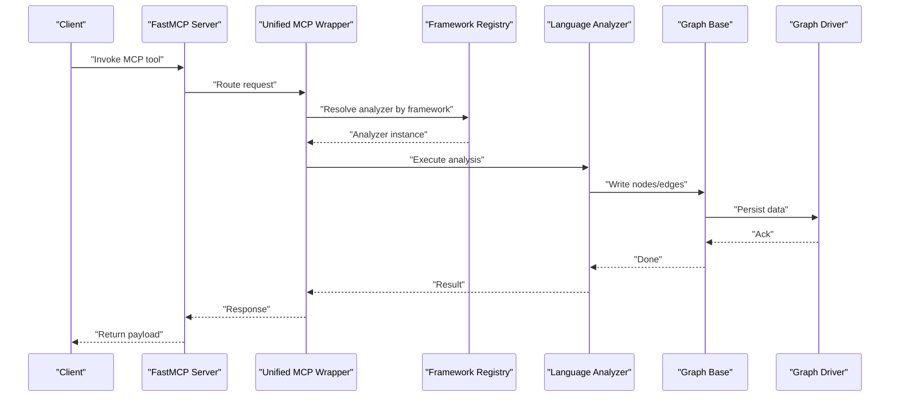
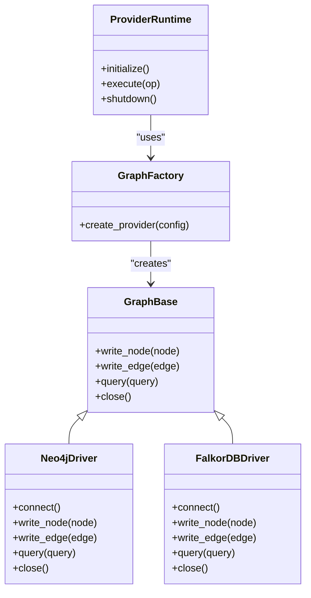
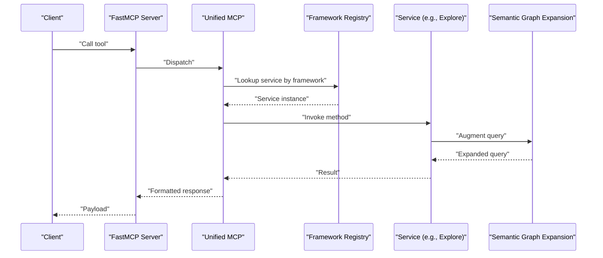
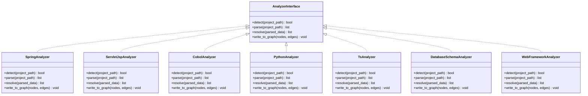
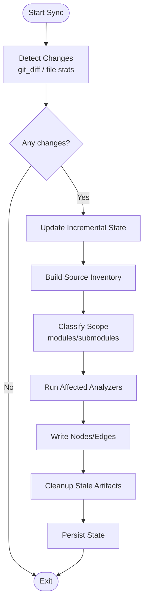
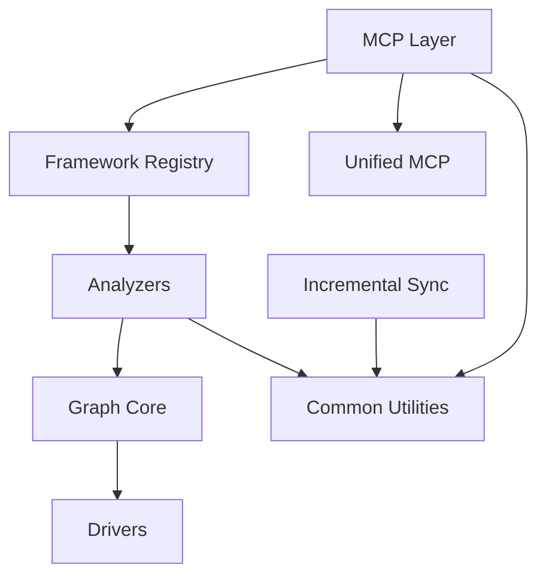

# Code Organization & Conventions

<cite>
**Referenced Files in This Document**
- [code-tiny/tools/common/harness_config.py](file://code-tiny/tools/common/harness_config.py)
- [code-tiny/mcp/framework_registry.py](file://code-tiny/mcp/framework_registry.py)
- [code-tiny/mcp/unified_mcp.py](file://code-tiny/mcp/unified_mcp.py)
- [code-tiny/mcp/fastmcp_server.py](file://code-tiny/mcp/fastmcp_server.py)
- [code-tiny/mcp/tool_metadata.py](file://code-tiny/mcp/tool_metadata.py)
- [code-tiny/mcp/semantic_graph_expansion.py](file://code-tiny/mcp/semantic_graph_expansion.py)
- [code-tiny/tools/graph/core/base.py](file://code-tiny/tools/graph/core/base.py)
- [code-tiny/tools/graph/core/factory.py](file://code-tiny/tools/graph/core/factory.py)
- [code-tiny/tools/graph/core/provider_runtime.py](file://code-tiny/tools/graph/core/provider_runtime.py)
- [code-tiny/tools/graph/driver/neo4j_driver.py](file://code-tiny/tools/graph/driver/neo4j_driver.py)
- [code-tiny/tools/graph/driver/falkordb_driver.py](file://code-tiny/tools/graph/driver/falkordb_driver.py)
- [code-tiny/tools/graph/writer/language_writer.py](file://code-tiny/tools/graph/writer/language_writer.py)
- [code-tiny/tools/graph/writer/web_framework_writer.py](file://code-tiny/tools/graph/writer/web_framework_writer.py)
- [code-tiny/tools/spring/spring_analyzer.py](file://code-tiny/tools/spring/spring_analyzer.py)
- [code-tiny/tools/servlet_jsp/servlet_jsp_analyzer.py](file://code-tiny/tools/servlet_jsp/servlet_jsp_analyzer.py)
- [code-tiny/tools/cobol/cobol_analyzer.py](file://code-tiny/tools/cobol/cobol_analyzer.py)
- [code-tiny/tools/python/python_analyzer.py](file://code-tiny/tools/python/python_analyzer.py)
- [code-tiny/tools/ts/ts_analyzer.py](file://code-tiny/tools/ts/ts_analyzer.py)
- [code-tiny/tools/database_schema/database_schema_analyzer.py](file://code-tiny/tools/database_schema/database_schema_analyzer.py)
- [code-tiny/tools/web_framework/web_framework_analyzer.py](file://code-tiny/tools/web_framework/web_framework_analyzer.py)
- [code-tiny/tools/common/analyzer_cache.py](file://code-tiny/tools/common/analyzer_cache.py)
- [code-tiny/tools/common/incremental_sync_state.py](file://code-tiny/tools/common/incremental_sync_state.py)
- [code-tiny/tools/sync/incremental_sync.py](file://code-tiny/tools/sync/incremental_sync.py)
- [code-tiny/tools/common/source_inventory.py](file://code-tiny/tools/common/source_inventory.py)
- [code-tiny/tools/common/message_scan.py](file://code-tiny/tools/common/message_scan.py)
- [code-tiny/tools/common/query_understanding.py](file://code-tiny/tools/common/query_understanding.py)
- [code-tiny/tools/common/intelligent_retrieval.py](file://code-tiny/tools/common/intelligent_retrieval.py)
- [code-tiny/tools/common/result_packager.py](file://code-tiny/tools/common/result_packager.py)
- [code-tiny/tools/common/bm25_ranker.py](file://code-tiny/tools/common/bm25_ranker.py)
- [code-tiny/tools/common/api_match_engine.py](file://code-tiny/tools/common/api_match_engine.py)
- [code-tiny/tools/common/graph_expander.py](file://code-tiny/tools/common/graph_expander.py)
- [code-tiny/tools/common/workflow_classifier.py](file://code-tiny/tools/common/workflow_classifier.py)
- [code-tiny/tools/common/workflow_impact_scorer.py](file://code-tiny/tools/common/workflow_impact_scorer.py)
- [code-tiny/tools/common/confidence_scorer.py](file://code-tiny/tools/common/confidence_scorer.py)
- [code-tiny/tools/common/signal_normalizer.py](file://code-tiny/tools/common/signal_normalizer.py)
- [code-tiny/tools/common/react_role_classifier.py](file://code-tiny/tools/common/react_role_classifier.py)
- [code-tiny/tools/common/frontend_relationship_extractor.py](file://code-tiny/tools/common/frontend_relationship_extractor.py)
- [code-tiny/tools/common/url_normalizer.py](file://code-tiny/tools/common/url_normalizer.py)
- [code-tiny/tools/common/git_diff.py](file://code-tiny/tools/common/git_diff.py)
- [code-tiny/tools/common/cloc_stats.py](file://code-tiny/tools/common/cloc_stats.py)
- [code-tiny/tools/common/llm_summary.py](file://code-tiny/tools/common/llm_summary.py)
- [code-tiny/tools/common/primary_vector_sync.py](file://code-tiny/tools/common/primary_vector_sync.py)
- [code-tiny/tools/common/sync_scope.py](file://code-tiny/tools/common/sync_scope.py)
- [code-tiny/tools/common/retrieval_scorer.py](file://code-tiny/tools/common/retrieval_scorer.py)
- [code-tiny/tools/common/semantic_inference.py](file://code-tiny/tools/common/semantic_inference.py)
- [code-tiny/tools/common/call_graph_builder.py](file://code-tiny/tools/common/call_graph_builder.py)
- [code-tiny/tools/common/incremental_cleanup.py](file://code-tiny/tools/common/incremental_cleanup.py)
- [code-tiny/tools/sync/build_owner_manifests.py](file://code-tiny/tools/sync/build_owner_manifests.py)
- [code-tiny/tools/sync/dead_code_report.py](file://code-tiny/tools/sync/dead_code_report.py)
- [code-tiny/tools/sync/message_scan.py](file://code-tiny/tools/sync/message_scan.py)
- [code-tiny/tools/sync/owner_manifest.py](file://code-tiny/tools/sync/owner_manifest.py)
- [code-tiny/tools/graph/cli.py](file://code-tiny/tools/graph/cli.py)
- [code-tiny/tools/graph/operations/__init__.py](file://code-tiny/tools/graph/operations/__init__.py)
- [code-tiny/tools/graph/operations/class_ops.py](file://code-tiny/tools/graph/operations/class_ops.py)
- [code-tiny/tools/graph/operations/function_ops.py](file://code-tiny/tools/graph/operations/function_ops.py)
- [code-tiny/tools/graph/operations/package_ops.py](file://code-tiny/tools/graph/operations/package_ops.py)
- [code-tiny/tools/graph/operations/type_ops.py](file://code-tiny/tools/graph/operations/type_ops.py)
- [code-tiny/tools/graph/operations/namespace_ops.py](file://code-tiny/tools/graph/operations/namespace_ops.py)
- [code-tiny/tools/graph/operations/document_ops.py](file://code-tiny/tools/graph/operations/document_ops.py)
- [code-tiny/tools/graph/operations/flow_ops.py](file://code-tiny/tools/graph/operations/flow_ops.py)
- [code-tiny/tools/graph/operations/infra_ops.py](file://code-tiny/tools/graph/operations/infra_ops.py)
- [code-tiny/tools/graph/operations/cross_edge_ops.py](file://code-tiny/tools/graph/operations/cross_edge_ops.py)
- [code-tiny/tools/graph/writer/aspnet_writer.py](file://code-tiny/tools/graph/writer/aspnet_writer.py)
- [code-tiny/tools/graph/writer/database_schema_writer.py](file://code-tiny/tools/graph/writer/database_schema_writer.py)
- [code-tiny/tools/graph/writer/mybatis_writer.py](file://code-tiny/tools/graph/writer/mybatis_writer.py)
- [code-tiny/tools/graph/writer/servlet_jsp_writer.py](file://code-tiny/tools/graph/writer/servlet_jsp_writer.py)
- [code-tiny/tools/graph/writer/spring_writer.py](file://code-tiny/tools/graph/writer/spring_writer.py)
- [code-tiny/tools/spring/adapters.py](file://code-tiny/tools/spring/adapters.py)
- [code-tiny/tools/spring/config.py](file://code-tiny/tools/spring/config.py)
- [code-tiny/tools/spring/detector.py](file://code-tiny/tools/spring/detector.py)
- [code-tiny/tools/spring/models.py](file://code-tiny/tools/spring/models.py)
- [code-tiny/tools/spring/pipeline.py](file://code-tiny/tools/spring/pipeline.py)
- [code-tiny/tools/spring/source_scanner.py](file://code-tiny/tools/spring/source_scanner.py)
- [code-tiny/tools/spring/spring_java_analyzer.py](file://code-tiny/tools/spring/spring_java_analyzer.py)
- [code-tiny/tools/spring/spring_kotlin_analyzer.py](file://code-tiny/tools/spring/spring_kotlin_analyzer.py)
- [code-tiny/tools/spring/spring_mixed_analyzer.py](file://code-tiny/tools/spring/spring_mixed_analyzer.py)
- [code-tiny/tools/spring/value_resolver.py](file://code-tiny/tools/spring/value_resolver.py)
- [code-tiny/tools/spring/annotation_catalog.py](file://code-tiny/tools/spring/annotation_catalog.py)
- [code-tiny/tools/spring/cache.py](file://code-tiny/tools/spring/cache.py)
- [code-tiny/tools/servlet_jsp/jsp_parser.py](file://code-tiny/tools/servlet_jsp/jsp_parser.py)
- [code-tiny/tools/servlet_jsp/java_semantics.py](file://code-tiny/tools/servlet_jsp/java_semantics.py)
- [code-tiny/tools/servlet_jsp/path_resolver.py](file://code-tiny/tools/servlet_jsp/path_resolver.py)
- [code-tiny/tools/servlet_jsp/web_xml_parser.py](file://code-tiny/tools/servlet_jsp/web_xml_parser.py)
- [code-tiny/tools/servlet_jsp/models.py](file://code-tiny/tools/servlet_jsp/models.py)
- [code-tiny/tools/servlet_jsp/parser_runtime.py](file://code-tiny/tools/servlet_jsp/parser_runtime.py)
- [code-tiny/tools/servlet_jsp/resolver.py](file://code-tiny/tools/servlet_jsp/resolver.py)
- [code-tiny/tools/servlet_jsp/detector.py](file://code-tiny/tools/servlet_jsp/detector.py)
- [code-tiny/tools/servlet_jsp/pipeline.py](file://code-tiny/tools/servlet_jsp/pipeline.py)
- [code-tiny/tools/servlet_jsp/properties_parser.py](file://code-tiny/tools/servlet_jsp/properties_parser.py)
- [code-tiny/tools/servlet_jsp/java_identity.py](file://code-tiny/tools/servlet_jsp/java_identity.py)
- [code-tiny/tools/servlet_jsp/el_parser.py](file://code-tiny/tools/servlet_jsp/el_parser.py)
- [code-tiny/tools/servlet_jsp/servlet_jsp_java_analyzer.py](file://code-tiny/tools/servlet_jsp/servlet_jsp_java_analyzer.py)
- [code-tiny/tools/cobol/cfg.py](file://code-tiny/tools/cobol/cfg.py)
- [code-tiny/tools/cobol/models.py](file://code-tiny/tools/cobol/models.py)
- [code-tiny/tools/cobol/parser.py](file://code-tiny/tools/cobol/parser.py)
- [code-tiny/tools/cobol/parser_runtime.py](file://code-tiny/tools/cobol/parser_runtime.py)
- [code-tiny/tools/cobol/pipeline.py](file://code-tiny/tools/cobol/pipeline.py)
- [code-tiny/tools/cobol/qdrant.py](file://code-tiny/tools/cobol/qdrant.py)
- [code-tiny/tools/cobol/resolver.py](file://code-tiny/tools/cobol/resolver.py)
- [code-tiny/tools/cobol/semantics.py](file://code-tiny/tools/cobol/semantics.py)
- [code-tiny/tools/ts/ts_project_detector.py](file://code-tiny/tools/ts/ts_project_detector.py)
- [code-tiny/tools/ts/ts_api_bridge.py](file://code-tiny/tools/ts/ts_api_bridge.py)
- [code-tiny/tools/ts/ts_backend_analyzer.py](file://code-tiny/tools/ts/ts_backend_analyzer.py)
- [code-tiny/tools/ts/workflow_finder.py](file://code-tiny/tools/ts/workflow_finder.py)
- [code-tiny/tools/ts/_refactor_ts_analyzer.py](file://code-tiny/tools/ts/_refactor_ts_analyzer.py)
- [code-tiny/tools/ts/types/ast_types.py](file://code-tiny/tools/ts/types/ast_types.py)
- [code-tiny/tools/ts/types/graph_types.py](file://code-tiny/tools/ts/types/graph_types.py)
- [code-tiny/tools/ts/utils/file_utils.py](file://code-tiny/tools/ts/utils/file_utils.py)
- [code-tiny/tools/ts/utils/id_utils.py](file://code-tiny/tools/ts/utils/id_utils.py)
- [code-tiny/tools/ts/utils/regex_patterns.py](file://code-tiny/tools/ts/utils/regex_patterns.py)
- [code-tiny/tools/ts/context/analyzer_context.py](file://code-tiny/tools/ts/context/analyzer_context.py)
- [code-tiny/tools/ts/pipeline/backend_pipeline.py](file://code-tiny/tools/ts/pipeline/backend_pipeline.py)
- [code-tiny/tools/ts/pipeline/frontend_pipeline.py](file://code-tiny/tools/ts/pipeline/frontend_pipeline.py)
- [code-tiny/tools/ts/agents/parser_agent.py](file://code-tiny/tools/ts/agents/parser_agent.py)
- [code-tiny/tools/ts/agents/graph_agent.py](file://code-tiny/tools/ts/agents/graph_agent.py)
- [code-tiny/tools/ts/agents/symbol_agent.py](file://code-tiny/tools/ts/agents/symbol_agent.py)
- [code-tiny/tools/ts/agents/traversal_agent.py](file://code-tiny/tools/ts/agents/traversal_agent.py)
- [code-tiny/tools/ts/agents/api_bridge_agent.py](file://code-tiny/tools/ts/agents/api_bridge_agent.py)
- [code-tiny/tools/ts/agents/backend_agent.py](file://code-tiny/tools/ts/agents/backend_agent.py)
- [code-tiny/tools/ts/agents/dependency_agent.py](file://code-tiny/tools/ts/agents/dependency_agent.py)
- [code-tiny/tools/flutter/flutter_analyzer.py](file://code-tiny/tools/flutter/flutter_analyzer.py)
- [code-tiny/tools/flutter/dart_parser.py](file://code-tiny/tools/flutter/dart_parser.py)
- [code-tiny/tools/flutter/detector.py](file://code-tiny/tools/flutter/detector.py)
- [code-tiny/tools/flutter/models.py](file://code-tiny/tools/flutter/models.py)
- [code-tiny/tools/flutter/normalizer.py](file://code-tiny/tools/flutter/normalizer.py)
- [code-tiny/tools/flutter/pipeline.py](file://code-tiny/tools/flutter/pipeline.py)
- [code-tiny/tools/flutter/protocol.py](file://code-tiny/tools/flutter/protocol.py)
- [code-tiny/tools/flutter/cache.py](file://code-tiny/tools/flutter/cache.py)
- [code-tiny/tools/aspnet_core/aspnet_core_analyzer.py](file://code-tiny/tools/aspnet_core/aspnet_core_analyzer.py)
- [code-tiny/tools/aspnet_core/artifact_parsers.py](file://code-tiny/tools/aspnet_core/artifact_parsers.py)
- [code-tiny/tools/aspnet_core/detector.py](file://code-tiny/tools/aspnet_core/detector.py)
- [code-tiny/tools/aspnet_core/pipeline.py](file://code-tiny/tools/aspnet_core/pipeline.py)
- [code-tiny/tools/aspnet_core/resolver.py](file://code-tiny/tools/aspnet_core/resolver.py)
- [code-tiny/tools/aspnet_framework/aspnet_framework_analyzer.py](file://code-tiny/tools/aspnet_framework/aspnet_framework_analyzer.py)
- [code-tiny/tools/aspnet_framework/artifact_parsers.py](file://code-tiny/tools/aspnet_framework/artifact_parsers.py)
- [code-tiny/tools/aspnet_framework/detector.py](file://code-tiny/tools/aspnet_framework/detector.py)
- [code-tiny/tools/aspnet_framework/pipeline.py](file://code-tiny/tools/aspnet_framework/pipeline.py)
- [code-tiny/tools/aspnet_framework/resolver.py](file://code-tiny/tools/aspnet_framework/resolver.py)
- [code-tiny/tools/android/android_java_analyzer.py](file://code-tiny/tools/android/android_java_analyzer.py)
- [code-tiny/tools/android/android_kotlin_analyzer.py](file://code-tiny/tools/android/android_kotlin_analyzer.py)
- [code-tiny/tools/android/android_mixed_analyzer.py](file://code-tiny/tools/android/android_mixed_analyzer.py)
- [code-tiny/tools/android/android_common.py](file://code-tiny/tools/android/android_common.py)
- [code-tiny/tools/cplus/cplus_analyzer.py](file://code-tiny/tools/cplus/cplus_analyzer.py)
- [code-tiny/tools/cplus/clang_parser.py](file://code-tiny/tools/cplus/clang_parser.py)
- [code-tiny/tools/cplus/rc_parser.py](file://code-tiny/tools/cplus/rc_parser.py)
- [code-tiny/tools/cplus/windows_resource_parser.py](file://code-tiny/tools/cplus/windows_resource_parser.py)
- [code-tiny/tools/csharp/csharp_analyzer.py](file://code-tiny/tools/csharp/csharp_analyzer.py)
- [code-tiny/tools/go/go_analyzer.py](file://code-tiny/tools/go/go_analyzer.py)
- [code-tiny/tools/js/js_analyzer.py](file://code-tiny/tools/js/js_analyzer.py)
- [code-tiny/tools/kotlin/kotlin_analyzer.py](file://code-tiny/tools/kotlin/kotlin_analyzer.py)
- [code-tiny/tools/perl/perl_analyzer.py](file://code-tiny/tools/perl/perl_analyzer.py)
- [code-tiny/tools/perl/parser_runtime.py](file://code-tiny/tools/perl/parser_runtime.py)
- [code-tiny/tools/perl/pipeline.py](file://code-tiny/tools/perl/pipeline.py)
- [code-tiny/tools/perl/resolver.py](file://code-tiny/tools/perl/resolver.py)
- [code-tiny/tools/perl/models.py](file://code-tiny/tools/perl/models.py)
- [code-tiny/tools/php/php_analyzer.py](file://code-tiny/tools/php/php_analyzer.py)
- [code-tiny/tools/plsql/plsql_analyzer.py](file://code-tiny/tools/plsql/plsql_analyzer.py)
- [code-tiny/tools/rust/rust_analyzer.py](file://code-tiny/tools/rust/rust_analyzer.py)
- [code-tiny/tools/sql/sql_analyzer.py](file://code-tiny/tools/sql/sql_analyzer.py)
- [code-tiny/tools/swift/swift_analyzer.py](file://code-tiny/tools/swift/swift_analyzer.py)
- [code-tiny/tools/vb/vb6_analyzer.py](file://code-tiny/tools/vb/vb6_analyzer.py)
- [code-tiny/tools/vb/vb_analyzer_base.py](file://code-tiny/tools/vb/vb_analyzer_base.py)
- [code-tiny/tools/vb/vb_common.py](file://code-tiny/tools/vb/vb_common.py)
- [code-tiny/tools/vb/vb_path_classifier.py](file://code-tiny/tools/vb/vb_path_classifier.py)
- [code-tiny/tools/vb/vb_roslyn_adapter.py](file://code-tiny/tools/vb/vb_roslyn_adapter.py)
- [code-tiny/tools/vb/vba_analyzer.py](file://code-tiny/tools/vb/vba_analyzer.py)
- [code-tiny/tools/vb/vbnet_analyzer.py](file://code-tiny/tools/vb/vbnet_analyzer.py)
- [code-tiny/tools/vb/vbscript_analyzer.py](file://code-tiny/tools/vb/vbscript.py)
- [code-tiny/tools/mybatis/mybatis_analyzer.py](file://code-tiny/tools/mybatis/mybatis_analyzer.py)
- [code-tiny/tools/mybatis/annotation_mapper.py](file://code-tiny/tools/mybatis/annotation_mapper.py)
- [code-tiny/tools/mybatis/cache.py](file://code-tiny/tools/mybatis/cache.py)
- [code-tiny/tools/mybatis/detector.py](file://code-tiny/tools/mybatis/detector.py)
- [code-tiny/tools/mybatis/dynamic_sql.py](file://code-tiny/tools/mybatis/dynamic_sql.py)
- [code-tiny/tools/mybatis/mapper_interface_analyzer.py](file://code-tiny/tools/mybatis/mapper_interface_analyzer.py)
- [code-tiny/tools/mybatis/mapper_xml_analyzer.py](file://code-tiny/tools/mybatis/mapper_xml_analyzer.py)
- [code-tiny/tools/mybatis/models.py](file://code-tiny/tools/mybatis/models.py)
- [code-tiny/tools/mybatis/parser_runtime.py](file://code-tiny/tools/mybatis/parser_runtime.py)
- [code-tiny/tools/mybatis/pipeline.py](file://code-tiny/tools/mybatis/pipeline.py)
- [code-tiny/tools/mybatis/resolver.py](file://code-tiny/tools/mybatis/resolver.py)
- [code-tiny/tools/mybatis/spring_bridge.py](file://code-tiny/tools/mybatis/spring_bridge.py)
- [code-tiny/tools/mybatis/sql_semantic_analyzer.py](file://code-tiny/tools/mybatis/sql_semantic_analyzer.py)
- [code-tiny/tools/struts/struts_analyzer.py](file://code-tiny/tools/struts/struts_analyzer.py)
- [code-tiny/tools/struts/struts_xml_parser.py](file://code-tiny/tools/struts/struts_xml_parser.py)
- [code-tiny/tools/struts/validation_parser.py](file://code-tiny/tools/struts/validation_parser.py)
- [code-tiny/tools/struts/web_xml_parser.py](file://code-tiny/tools/struts/web_xml_parser.py)
- [code-tiny/tools/struts/xml_utils.py](file://code-tiny/tools/struts/xml_utils.py)
- [code-tiny/tools/struts/java_validation.py](file://code-tiny/tools/struts/java_validation.py)
- [code-tiny/tools/struts/models.py](file://code-tiny/tools/struts/models.py)
- [code-tiny/tools/struts/pipeline.py](file://code-tiny/tools/struts/pipeline.py)
- [code-tiny/tools/struts/resolver.py](file://code-tiny/tools/struts/resolver.py)
- [code-tiny/tools/web_framework/models.py](file://code-tiny/tools/web_framework/models.py)
- [code-tiny/tools/web_framework/pipeline.py](file://code-tiny/tools/web_framework/pipeline.py)
- [code-tiny/tools/web_framework/web_framework_analyzer.py](file://code-tiny/tools/web_framework/web_framework_analyzer.py)
- [code-tiny/mcp/services/explore_service.py](file://code-tiny/mcp/services/explore_service.py)
- [code-tiny/mcp/services/flow_reconstructor.py](file://code-tiny/mcp/services/flow_reconstructor.py)
- [code-tiny/mcp/services/graph_service.py](file://code-tiny/mcp/services/graph_service.py)
- [code-tiny/mcp/services/impact_service.py](file://code-tiny/mcp/services/impact_service.py)
- [code-tiny/mcp/services/symbol_service.py](file://code-tiny/mcp/services/symbol_service.py)
- [code-tiny/mcp/services/workflow_service.py](file://code-tiny/mcp/services/workflow_service.py)
- [code-tiny/mcp/android/android_mcp.py](file://code-tiny/mcp/android/android_mcp.py)
- [code-tiny/mcp/cplus/cplus_mcp.py](file://code-tiny/mcp/cplus/cplus_mcp.py)
- [code-tiny/mcp/java/java_mcp.py](file://code-tiny/mcp/java/java_mcp.py)
- [code-tiny/mcp/android/services/graph_service.py](file://code-tiny/mcp/android/services/graph_service.py)
- [code-tiny/mcp/android/services/impact_service.py](file://code-tiny/mcp/android/services/impact_service.py)
- [code-tiny/mcp/android/services/symbol_service.py](file://code-tiny/mcp/android/services/symbol_service.py)
- [code-tiny/mcp/cplus/services/graph_service.py](file://code-tiny/mcp/cplus/services/graph_service.py)
- [code-tiny/mcp/cplus/services/impact_service.py](file://code-tiny/mcp/cplus/services/impact_service.py)
- [code-tiny/mcp/cplus/services/symbol_service.py](file://code-tiny/mcp/cplus/services/symbol_service.py)
- [code-tiny/mcp/java/services/graph_service.py](file://code-tiny/mcp/java/services/graph_service.py)
- [code-tiny/mcp/java/services/impact_service.py](file://code-tiny/mcp/java/services/impact_service.py)
- [code-tiny/mcp/java/services/symbol_service.py](file://code-tiny/mcp/java/services/symbol_service.py)
</cite>

## Table of Contents
1. [Introduction](#introduction)
2. [Project Structure](#project-structure)
3. [Core Components](#core-components)
4. [Architecture Overview](#architecture-overview)
5. [Detailed Component Analysis](#detailed-component-analysis)
6. [Dependency Analysis](#dependency-analysis)
7. [Performance Considerations](#performance-considerations)
8. [Troubleshooting Guide](#troubleshooting-guide)
9. [Conclusion](#conclusion)
10. [Appendices](#appendices)

## Introduction
This document explains the code organization patterns and conventions used across Cortex Harness, focusing on modular architecture, naming conventions, architectural patterns (Strategy, Factory, Observer), directory structure guidelines, import organization, dependency management, and code style standards. It provides guidance for adding new features while maintaining consistency across the codebase.

## Project Structure
Cortex Harness is organized into clear layers:
- Core analysis engine and graph runtime under tools/graph
- Language analyzers under tools/<language>
- Framework overlays under tools/<framework>
- MCP services and server under mcp
- Shared utilities under tools/common
- Synchronization and incremental scanning under tools/sync

```mermaid
graph TB
subgraph "MCP Layer"
U["unified_mcp.py"]
F["fastmcp_server.py"]
R["framework_registry.py"]
T["tool_metadata.py"]
E["semantic_graph_expansion.py"]
end
subgraph "Graph Core"
B["graph/core/base.py"]
C["graph/core/factory.py"]
P["graph/core/provider_runtime.py"]
N["graph/driver/neo4j_driver.py"]
K["graph/driver/falkordb_driver.py"]
end
subgraph "Analyzers"
A1["spring/spring_analyzer.py"]
A2["servlet_jsp/servlet_jsp_analyzer.py"]
A3["cobol/cobol_analyzer.py"]
A4["python/python_analyzer.py"]
A5["ts/ts_analyzer.py"]
A6["database_schema/database_schema_analyzer.py"]
A7["web_framework/web_framework_analyzer.py"]
end
subgraph "Common"
H["common/harness_config.py"]
AC["common/analyzer_cache.py"]
IS["common/incremental_sync_state.py"]
SI["common/source_inventory.py"]
MS["common/message_scan.py"]
QU["common/query_understanding.py"]
IR["common/intelligent_retrieval.py"]
RP["common/result_packager.py"]
BM["common/bm25_ranker.py"]
AME["common/api_match_engine.py"]
GE["common/graph_expander.py"]
WC["common/workflow_classifier.py"]
WIS["common/workflow_impact_scorer.py"]
CS["common/confidence_scorer.py"]
SN["common/signal_normalizer.py"]
RC["common/react_role_classifier.py"]
FRE["common/frontend_relationship_extractor.py"]
UN["common/url_normalizer.py"]
GD["common/git_diff.py"]
CL["common/cloc_stats.py"]
LS["common/llm_summary.py"]
PV["common/primary_vector_sync.py"]
SS["common/sync_scope.py"]
RS["common/retrieval_scorer.py"]
SE["common/semantic_inference.py"]
CG["common/call_graph_builder.py"]
IC["common/incremental_cleanup.py"]
end
subgraph "Sync"
SYN["sync/incremental_sync.py"]
BO["sync/build_owner_manifests.py"]
DC["sync/dead_code_report.py"]
MMS["sync/message_scan.py"]
OM["sync/owner_manifest.py"]
end
U --> R
U --> T
U --> E
F --> U
R --> A1
R --> A2
R --> A3
R --> A4
R --> A5
R --> A6
R --> A7
A1 --> B
A2 --> B
A3 --> B
A4 --> B
A5 --> B
A6 --> B
A7 --> B
B --> N
B --> K
A1 --> H
A2 --> H
A3 --> H
A4 --> H
A5 --> H
A6 --> H
A7 --> H
SYN --> IS
SYN --> AC
SYN --> SI
SYN --> MS
SYN --> QU
SYN --> IR
SYN --> RP
SYN --> BM
SYN --> AME
SYN --> GE
SYN --> WC
SYN --> WIS
SYN --> CS
SYN --> SN
SYN --> RC
SYN --> FRE
SYN --> UN
SYN --> GD
SYN --> CL
SYN --> LS
SYN --> PV
SYN --> SS
SYN --> RS
SYN --> SE
SYN --> CG
SYN --> IC
```

**Diagram sources**
- [code-tiny/mcp/unified_mcp.py](file://code-tiny/mcp/unified_mcp.py)
- [code-tiny/mcp/fastmcp_server.py](file://code-tiny/mcp/fastmcp_server.py)
- [code-tiny/mcp/framework_registry.py](file://code-tiny/mcp/framework_registry.py)
- [code-tiny/mcp/tool_metadata.py](file://code-tiny/mcp/tool_metadata.py)
- [code-tiny/mcp/semantic_graph_expansion.py](file://code-tiny/mcp/semantic_graph_expansion.py)
- [code-tiny/tools/graph/core/base.py](file://code-tiny/tools/graph/core/base.py)
- [code-tiny/tools/graph/core/factory.py](file://code-tiny/tools/graph/core/factory.py)
- [code-tiny/tools/graph/core/provider_runtime.py](file://code-tiny/tools/graph/core/provider_runtime.py)
- [code-tiny/tools/graph/driver/neo4j_driver.py](file://code-tiny/tools/graph/driver/neo4j_driver.py)
- [code-tiny/tools/graph/driver/falkordb_driver.py](file://code-tiny/tools/graph/driver/falkordb_driver.py)
- [code-tiny/tools/spring/spring_analyzer.py](file://code-tiny/tools/spring/spring_analyzer.py)
- [code-tiny/tools/servlet_jsp/servlet_jsp_analyzer.py](file://code-tiny/tools/servlet_jsp/servlet_jsp_analyzer.py)
- [code-tiny/tools/cobol/cobol_analyzer.py](file://code-tiny/tools/cobol/cobol_analyzer.py)
- [code-tiny/tools/python/python_analyzer.py](file://code-tiny/tools/python/python_analyzer.py)
- [code-tiny/tools/ts/ts_analyzer.py](file://code-tiny/tools/ts/ts_analyzer.py)
- [code-tiny/tools/database_schema/database_schema_analyzer.py](file://code-tiny/tools/database_schema/database_schema_analyzer.py)
- [code-tiny/tools/web_framework/web_framework_analyzer.py](file://code-tiny/tools/web_framework/web_framework_analyzer.py)
- [code-tiny/tools/common/harness_config.py](file://code-tiny/tools/common/harness_config.py)
- [code-tiny/tools/common/analyzer_cache.py](file://code-tiny/tools/common/analyzer_cache.py)
- [code-tiny/tools/common/incremental_sync_state.py](file://code-tiny/tools/common/incremental_sync_state.py)
- [code-tiny/tools/common/source_inventory.py](file://code-tiny/tools/common/source_inventory.py)
- [code-tiny/tools/common/message_scan.py](file://code-tiny/tools/common/message_scan.py)
- [code-tiny/tools/common/query_understanding.py](file://code-tiny/tools/common/query_understanding.py)
- [code-tiny/tools/common/intelligent_retrieval.py](file://code-tiny/tools/common/intelligent_retrieval.py)
- [code-tiny/tools/common/result_packager.py](file://code-tiny/tools/common/result_packager.py)
- [code-tiny/tools/common/bm25_ranker.py](file://code-tiny/tools/common/bm25_ranker.py)
- [code-tiny/tools/common/api_match_engine.py](file://code-tiny/tools/common/api_match_engine.py)
- [code-tiny/tools/common/graph_expander.py](file://code-tiny/tools/common/graph_expander.py)
- [code-tiny/tools/common/workflow_classifier.py](file://code-tiny/tools/common/workflow_classifier.py)
- [code-tiny/tools/common/workflow_impact_scorer.py](file://code-tiny/tools/common/workflow_impact_scorer.py)
- [code-tiny/tools/common/confidence_scorer.py](file://code-tiny/tools/common/confidence_scorer.py)
- [code-tiny/tools/common/signal_normalizer.py](file://code-tiny/tools/common/signal_normalizer.py)
- [code-tiny/tools/common/react_role_classifier.py](file://code-tiny/tools/common/react_role_classifier.py)
- [code-tiny/tools/common/frontend_relationship_extractor.py](file://code-tiny/tools/common/frontend_relationship_extractor.py)
- [code-tiny/tools/common/url_normalizer.py](file://code-tiny/tools/common/url_normalizer.py)
- [code-tiny/tools/common/git_diff.py](file://code-tiny/tools/common/git_diff.py)
- [code-tiny/tools/common/cloc_stats.py](file://code-tiny/tools/common/cloc_stats.py)
- [code-tiny/tools/common/llm_summary.py](file://code-tiny/tools/common/llm_summary.py)
- [code-tiny/tools/common/primary_vector_sync.py](file://code-tiny/tools/common/primary_vector_sync.py)
- [code-tiny/tools/common/sync_scope.py](file://code-tiny/tools/common/sync_scope.py)
- [code-tiny/tools/common/retrieval_scorer.py](file://code-tiny/tools/common/retrieval_scorer.py)
- [code-tiny/tools/common/semantic_inference.py](file://code-tiny/tools/common/semantic_inference.py)
- [code-tiny/tools/common/call_graph_builder.py](file://code-tiny/tools/common/call_graph_builder.py)
- [code-tiny/tools/common/incremental_cleanup.py](file://code-tiny/tools/common/incremental_cleanup.py)
- [code-tiny/tools/sync/incremental_sync.py](file://code-tiny/tools/sync/incremental_sync.py)
- [code-tiny/tools/sync/build_owner_manifests.py](file://code-tiny/tools/sync/build_owner_manifests.py)
- [code-tiny/tools/sync/dead_code_report.py](file://code-tiny/tools/sync/dead_code_report.py)
- [code-tiny/tools/sync/message_scan.py](file://code-tiny/tools/sync/message_scan.py)
- [code-tiny/tools/sync/owner_manifest.py](file://code-tiny/tools/sync/owner_manifest.py)

**Section sources**
- [code-tiny/mcp/unified_mcp.py](file://code-tiny/mcp/unified_mcp.py)
- [code-tiny/mcp/fastmcp_server.py](file://code-tiny/mcp/fastmcp_server.py)
- [code-tiny/mcp/framework_registry.py](file://code-tiny/mcp/framework_registry.py)
- [code-tiny/tools/graph/core/base.py](file://code-tiny/tools/graph/core/base.py)
- [code-tiny/tools/graph/core/factory.py](file://code-tiny/tools/graph/core/factory.py)
- [code-tiny/tools/common/harness_config.py](file://code-tiny/tools/common/harness_config.py)

## Core Components
- Graph core base and factory provide a Strategy-like interface for graph providers and a Factory for driver instantiation.
- MCP layer exposes capabilities via a unified wrapper and FastMCP server, with a framework registry to route requests to language-specific services.
- Analyzers implement per-language or per-framework parsing and graph writing.
- Common utilities encapsulate caching, sync state, source inventory, query understanding, retrieval, ranking, and result packaging.
- Sync module orchestrates incremental synchronization using shared utilities.

Key responsibilities:
- Graph provider abstraction and driver selection
- Analyzer registration and dispatch
- MCP capability routing and metadata
- Incremental scan orchestration and state persistence

**Section sources**
- [code-tiny/tools/graph/core/base.py](file://code-tiny/tools/graph/core/base.py)
- [code-tiny/tools/graph/core/factory.py](file://code-tiny/tools/graph/core/factory.py)
- [code-tiny/tools/graph/core/provider_runtime.py](file://code-tiny/tools/graph/core/provider_runtime.py)
- [code-tiny/mcp/unified_mcp.py](file://code-tiny/mcp/unified_mcp.py)
- [code-tiny/mcp/framework_registry.py](file://code-tiny/mcp/framework_registry.py)
- [code-tiny/tools/common/harness_config.py](file://code-tiny/tools/common/harness_config.py)
- [code-tiny/tools/sync/incremental_sync.py](file://code-tiny/tools/sync/incremental_sync.py)

## Architecture Overview
The system follows layered separation:
- MCP services expose capabilities and delegate to analyzers and graph operations.
- Analyzers parse source artifacts and write normalized nodes/edges to the graph.
- Graph core abstracts storage drivers and runtime behavior.
- Common modules provide reusable logic for caching, scanning, querying, and scoring.

**Diagram sources**
- [code-tiny/mcp/fastmcp_server.py](file://code-tiny/mcp/fastmcp_server.py)
- [code-tiny/mcp/unified_mcp.py](file://code-tiny/mcp/unified_mcp.py)
- [code-tiny/mcp/framework_registry.py](file://code-tiny/mcp/framework_registry.py)
- [code-tiny/tools/graph/core/base.py](file://code-tiny/tools/graph/core/base.py)
- [code-tiny/tools/graph/driver/neo4j_driver.py](file://code-tiny/tools/graph/driver/neo4j_driver.py)
- [code-tiny/tools/graph/driver/falkordb_driver.py](file://code-tiny/tools/graph/driver/falkordb_driver.py)
- [code-tiny/tools/spring/spring_analyzer.py](file://code-tiny/tools/spring/spring_analyzer.py)

## Detailed Component Analysis

### Graph Core: Strategy and Factory Patterns
- Strategy pattern: The graph base defines an interface implemented by multiple drivers (Neo4j, FalkorDB). Each driver encapsulates its own persistence strategy.
- Factory pattern: A factory selects and instantiates the appropriate driver based on configuration.
- Provider runtime coordinates lifecycle and context for graph operations.

**Diagram sources**
- [code-tiny/tools/graph/core/base.py](file://code-tiny/tools/graph/core/base.py)
- [code-tiny/tools/graph/driver/neo4j_driver.py](file://code-tiny/tools/graph/driver/neo4j_driver.py)
- [code-tiny/tools/graph/driver/falkordb_driver.py](file://code-tiny/tools/graph/driver/falkordb_driver.py)
- [code-tiny/tools/graph/core/factory.py](file://code-tiny/tools/graph/core/factory.py)
- [code-tiny/tools/graph/core/provider_runtime.py](file://code-tiny/tools/graph/core/provider_runtime.py)

**Section sources**
- [code-tiny/tools/graph/core/base.py](file://code-tiny/tools/graph/core/base.py)
- [code-tiny/tools/graph/core/factory.py](file://code-tiny/tools/graph/core/factory.py)
- [code-tiny/tools/graph/core/provider_runtime.py](file://code-tiny/tools/graph/core/provider_runtime.py)
- [code-tiny/tools/graph/driver/neo4j_driver.py](file://code-tiny/tools/graph/driver/neo4j_driver.py)
- [code-tiny/tools/graph/driver/falkordb_driver.py](file://code-tiny/tools/graph/driver/falkordb_driver.py)

### MCP Services: Capability Routing and Metadata
- Unified MCP wrapper centralizes tool invocation and response formatting.
- Framework registry maps frameworks to analyzers and services.
- Tool metadata standardizes capability descriptions and schemas.
- Semantic graph expansion augments queries with semantic context.

**Diagram sources**
- [code-tiny/mcp/fastmcp_server.py](file://code-tiny/mcp/fastmcp_server.py)
- [code-tiny/mcp/unified_mcp.py](file://code-tiny/mcp/unified_mcp.py)
- [code-tiny/mcp/framework_registry.py](file://code-tiny/mcp/framework_registry.py)
- [code-tiny/mcp/tool_metadata.py](file://code-tiny/mcp/tool_metadata.py)
- [code-tiny/mcp/semantic_graph_expansion.py](file://code-tiny/mcp/semantic_graph_expansion.py)
- [code-tiny/mcp/services/explore_service.py](file://code-tiny/mcp/services/explore_service.py)

**Section sources**
- [code-tiny/mcp/unified_mcp.py](file://code-tiny/mcp/unified_mcp.py)
- [code-tiny/mcp/framework_registry.py](file://code-tiny/mcp/framework_registry.py)
- [code-tiny/mcp/tool_metadata.py](file://code-tiny/mcp/tool_metadata.py)
- [code-tiny/mcp/semantic_graph_expansion.py](file://code-tiny/mcp/semantic_graph_expansion.py)
- [code-tiny/mcp/fastmcp_server.py](file://code-tiny/mcp/fastmcp_server.py)
- [code-tiny/mcp/services/explore_service.py](file://code-tiny/mcp/services/explore_service.py)

### Analyzers: Strategy Pattern Implementation
Each analyzer implements a consistent interface for discovery, parsing, and graph writing. Examples include Spring, Servlet/JSP, Cobol, Python, TypeScript, Database Schema, and Web Framework analyzers. They follow a uniform pipeline approach with detector, parser, resolver, and writer stages.

**Diagram sources**
- [code-tiny/tools/spring/spring_analyzer.py](file://code-tiny/tools/spring/spring_analyzer.py)
- [code-tiny/tools/servlet_jsp/servlet_jsp_analyzer.py](file://code-tiny/tools/servlet_jsp/servlet_jsp_analyzer.py)
- [code-tiny/tools/cobol/cobol_analyzer.py](file://code-tiny/tools/cobol/cobol_analyzer.py)
- [code-tiny/tools/python/python_analyzer.py](file://code-tiny/tools/python/python_analyzer.py)
- [code-tiny/tools/ts/ts_analyzer.py](file://code-tiny/tools/ts/ts_analyzer.py)
- [code-tiny/tools/database_schema/database_schema_analyzer.py](file://code-tiny/tools/database_schema/database_schema_analyzer.py)
- [code-tiny/tools/web_framework/web_framework_analyzer.py](file://code-tiny/tools/web_framework/web_framework_analyzer.py)

**Section sources**
- [code-tiny/tools/spring/spring_analyzer.py](file://code-tiny/tools/spring/spring_analyzer.py)
- [code-tiny/tools/servlet_jsp/servlet_jsp_analyzer.py](file://code-tiny/tools/servlet_jsp/servlet_jsp_analyzer.py)
- [code-tiny/tools/cobol/cobol_analyzer.py](file://code-tiny/tools/cobol/cobol_analyzer.py)
- [code-tiny/tools/python/python_analyzer.py](file://code-tiny/tools/python/python_analyzer.py)
- [code-tiny/tools/ts/ts_analyzer.py](file://code-tiny/tools/ts/ts_analyzer.py)
- [code-tiny/tools/database_schema/database_schema_analyzer.py](file://code-tiny/tools/database_schema/database_schema_analyzer.py)
- [code-tiny/tools/web_framework/web_framework_analyzer.py](file://code-tiny/tools/web_framework/web_framework_analyzer.py)

### Incremental Sync: Observer-like Event Handling
Incremental synchronization uses shared state and utilities to detect changes and update the graph. While not strictly implementing a formal Observer pattern, it exhibits event-driven behavior through change detection and subsequent processing steps.

**Diagram sources**
- [code-tiny/tools/sync/incremental_sync.py](file://code-tiny/tools/sync/incremental_sync.py)
- [code-tiny/tools/common/incremental_sync_state.py](file://code-tiny/tools/common/incremental_sync_state.py)
- [code-tiny/tools/common/source_inventory.py](file://code-tiny/tools/common/source_inventory.py)
- [code-tiny/tools/common/git_diff.py](file://code-tiny/tools/common/git_diff.py)
- [code-tiny/tools/common/incremental_cleanup.py](file://code-tiny/tools/common/incremental_cleanup.py)

**Section sources**
- [code-tiny/tools/sync/incremental_sync.py](file://code-tiny/tools/sync/incremental_sync.py)
- [code-tiny/tools/common/incremental_sync_state.py](file://code-tiny/tools/common/incremental_sync_state.py)
- [code-tiny/tools/common/source_inventory.py](file://code-tiny/tools/common/source_inventory.py)
- [code-tiny/tools/common/git_diff.py](file://code-tiny/tools/common/git_diff.py)
- [code-tiny/tools/common/incremental_cleanup.py](file://code-tiny/tools/common/incremental_cleanup.py)

### Naming Conventions
Follow Python best practices consistently:
- Files and packages: snake_case (e.g., spring_analyzer.py, incremental_sync_state.py)
- Classes: PascalCase (e.g., SpringAnalyzer, GraphFactory)
- Functions and methods: snake_case (e.g., detect(), parse(), resolve())
- Variables and attributes: snake_case (e.g., project_path, parsed_data)
- Constants: UPPER_SNAKE_CASE where applicable (e.g., DEFAULT_TIMEOUT)
- Modules: descriptive names indicating responsibility (e.g., workflow_classifier.py)

Examples from the codebase:
- Analyzer files: *_analyzer.py
- Pipeline files: pipeline.py within feature directories
- Models: models.py for domain entities
- Utilities: *_utils.py or specific purpose names (e.g., id_utils.py)

**Section sources**
- [code-tiny/tools/spring/spring_analyzer.py](file://code-tiny/tools/spring/spring_analyzer.py)
- [code-tiny/tools/spring/pipeline.py](file://code-tiny/tools/spring/pipeline.py)
- [code-tiny/tools/spring/models.py](file://code-tiny/tools/spring/models.py)
- [code-tiny/tools/ts/utils/id_utils.py](file://code-tiny/tools/ts/utils/id_utils.py)
- [code-tiny/tools/common/workflow_classifier.py](file://code-tiny/tools/common/workflow_classifier.py)

### Architectural Patterns Summary
- Strategy pattern: Graph drivers implement a common interface; analyzers implement a common analyzer interface.
- Factory pattern: Graph factory creates provider instances based on configuration.
- Observer-like behavior: Incremental sync detects changes and triggers downstream processing.

**Section sources**
- [code-tiny/tools/graph/core/base.py](file://code-tiny/tools/graph/core/base.py)
- [code-tiny/tools/graph/core/factory.py](file://code-tiny/tools/graph/core/factory.py)
- [code-tiny/tools/sync/incremental_sync.py](file://code-tiny/tools/sync/incremental_sync.py)

### Directory Structure Guidelines
- tools/<language>: Language-specific analyzers and parsers
- tools/<framework>: Framework overlays (Spring, Struts, ASP.NET, etc.)
- tools/graph: Core graph runtime, drivers, writers, operations, CLI
- tools/common: Shared utilities (caching, sync state, retrieval, ranking)
- tools/sync: Orchestration of incremental synchronization
- mcp: MCP server, unified wrapper, framework registry, services, and language-specific MCP wrappers

Import organization:
- Prefer explicit relative imports within packages
- Use absolute imports for cross-package dependencies
- Keep circular imports minimal; refactor into shared modules when needed

Package dependency management:
- Group related functionality into cohesive modules
- Avoid monolithic modules; split large files into focused components
- Maintain clear boundaries between layers (MCP -> Analyzers -> Graph Core -> Drivers)

**Section sources**
- [code-tiny/tools/graph/cli.py](file://code-tiny/tools/graph/cli.py)
- [code-tiny/tools/graph/operations/__init__.py](file://code-tiny/tools/graph/operations/__init__.py)
- [code-tiny/tools/graph/writer/language_writer.py](file://code-tiny/tools/graph/writer/language_writer.py)
- [code-tiny/tools/graph/writer/web_framework_writer.py](file://code-tiny/tools/graph/writer/web_framework_writer.py)

### Code Style Standards
- Follow PEP 8 for Python code style
- Use type hints for function signatures and variables
- Provide docstrings for public APIs and complex functions
- Keep functions small and focused; extract helpers when complexity grows
- Use logging instead of print statements
- Centralize configuration via harness config utilities

Documentation requirements:
- Add README or inline comments for non-obvious logic
- Document analyzer contracts and expected graph schema
- Maintain MCP tool metadata for discoverability

Comment conventions:
- Explain why, not what; avoid redundant comments
- Mark TODO/FIXME with references to issues or plans
- Keep comments up-to-date with code changes

**Section sources**
- [code-tiny/tools/common/harness_config.py](file://code-tiny/tools/common/harness_config.py)
- [code-tiny/mcp/tool_metadata.py](file://code-tiny/mcp/tool_metadata.py)

### Adding New Features: Example Organization
For a new language or framework:
- Create tools/<feature>/ with analyzer, detector, parser, resolver, pipeline, models, and cache modules
- Implement analyzer following the Strategy interface
- Register analyzer in the framework registry
- Add MCP services if exposing capabilities
- Update MCP tool metadata for discoverability
- Ensure incremental sync recognizes new artifacts

Consistency checklist:
- Naming conventions followed
- Clear separation of concerns
- Proper imports and no circular dependencies
- Tests added for critical paths
- Documentation updated

**Section sources**
- [code-tiny/tools/spring/spring_analyzer.py](file://code-tiny/tools/spring/spring_analyzer.py)
- [code-tiny/mcp/framework_registry.py](file://code-tiny/mcp/framework_registry.py)
- [code-tiny/mcp/tool_metadata.py](file://code-tiny/mcp/tool_metadata.py)

## Dependency Analysis
High-level dependencies:
- MCP depends on framework registry and analyzers
- Analyzers depend on graph core and common utilities
- Graph core depends on drivers
- Sync depends on common utilities and analyzers

**Diagram sources**
- [code-tiny/mcp/unified_mcp.py](file://code-tiny/mcp/unified_mcp.py)
- [code-tiny/mcp/framework_registry.py](file://code-tiny/mcp/framework_registry.py)
- [code-tiny/tools/graph/core/base.py](file://code-tiny/tools/graph/core/base.py)
- [code-tiny/tools/graph/driver/neo4j_driver.py](file://code-tiny/tools/graph/driver/neo4j_driver.py)
- [code-tiny/tools/sync/incremental_sync.py](file://code-tiny/tools/sync/incremental_sync.py)
- [code-tiny/tools/common/harness_config.py](file://code-tiny/tools/common/harness_config.py)

**Section sources**
- [code-tiny/mcp/unified_mcp.py](file://code-tiny/mcp/unified_mcp.py)
- [code-tiny/mcp/framework_registry.py](file://code-tiny/mcp/framework_registry.py)
- [code-tiny/tools/graph/core/base.py](file://code-tiny/tools/graph/core/base.py)
- [code-tiny/tools/sync/incremental_sync.py](file://code-tiny/tools/sync/incremental_sync.py)

## Performance Considerations
- Cache frequently accessed results using analyzer cache utilities
- Minimize I/O by batching writes to graph drivers
- Use incremental sync to limit reprocessing scope
- Optimize queries in graph operations and leverage indexes
- Profile hot paths and consider async execution where safe

[No sources needed since this section provides general guidance]

## Troubleshooting Guide
Common issues and resolutions:
- Configuration errors: Validate harness config and environment variables
- Driver connectivity: Check connection parameters and credentials
- Analyzer failures: Inspect logs and ensure correct project detection
- MCP routing problems: Verify framework registry mappings and tool metadata
- Incremental sync inconsistencies: Review state persistence and change detection logic

Debugging tips:
- Enable detailed logging for MCP and analyzer pipelines
- Use CLI tools to validate graph operations
- Test analyzers against fixtures to isolate issues

**Section sources**
- [code-tiny/tools/common/harness_config.py](file://code-tiny/tools/common/harness_config.py)
- [code-tiny/tools/graph/cli.py](file://code-tiny/tools/graph/cli.py)
- [code-tiny/mcp/unified_mcp.py](file://code-tiny/mcp/unified_mcp.py)

## Conclusion
Cortex Harness employs a modular, layered architecture with clear separation between MCP services, analyzers, graph core, and shared utilities. Consistent naming conventions, well-defined interfaces, and established patterns (Strategy, Factory, Observer-like behavior) enable extensibility and maintainability. Following the guidelines in this document ensures new features integrate smoothly and remain consistent with the codebase.

[No sources needed since this section summarizes without analyzing specific files]

## Appendices
- API definitions and contracts are documented within respective modules and MCP tool metadata
- Migration guides and implementation summaries exist under tools/graph/docs
- Acceptance matrices and specs are maintained under docs/specs

[No sources needed since this section provides general guidance]